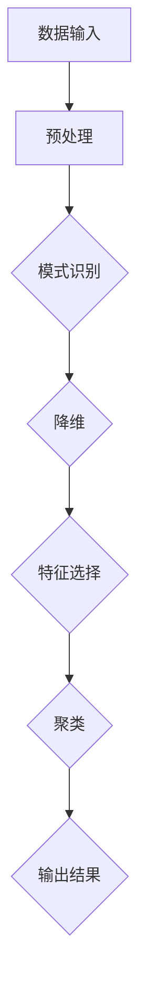
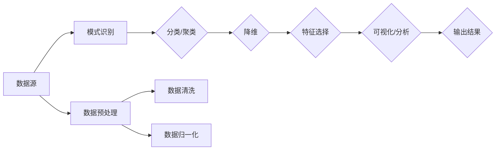

                 

 关键词：信息简化，模式识别，数据分析，人工智能，算法设计

> 在信息爆炸的时代，如何从海量数据中提取有价值的信息，找到隐藏在背后的模式和规律，是每一个数据科学家、AI开发者乃至企业决策者面临的重要课题。本文将探讨信息简化的艺术与科学，通过深入分析核心概念、算法原理、数学模型及实际应用，为您呈现如何在混乱中找到模式的方法论。

## 1. 背景介绍

随着互联网和大数据技术的发展，信息爆炸已经成为当今社会的一大特征。每个人每天都会接触到海量的信息，而这些信息中蕴含着巨大的价值。如何有效地处理和利用这些信息，已经成为各个行业关注的焦点。信息简化作为数据科学和人工智能领域的一个重要分支，旨在通过识别模式、提炼核心信息，帮助我们从复杂的数据中找到有用的知识。

### 1.1 信息简化的必要性

1. **数据量的增长**：据统计，人类生产的数字数据量每年以50%的速度增长，而有效的信息提取和处理速度却远远跟不上数据增长的速度。
2. **认知负担**：面对海量的信息，人类的认知能力和处理能力是有限的，过多的信息反而会导致认知过载。
3. **决策效率**：企业需要快速从大量数据中提取关键信息，以便做出明智的决策。

### 1.2 信息简化的目标

1. **提高数据处理效率**：通过简化信息，减少数据处理的时间和计算量。
2. **增强信息可读性**：使得复杂的信息更加直观、易于理解和分析。
3. **挖掘潜在价值**：从大量数据中发现潜在的规律和模式，为决策提供依据。

## 2. 核心概念与联系

### 2.1 核心概念

- **模式识别**：通过建立模型，识别和分类数据中的特征和模式。
- **降维**：通过减少数据维度，降低计算复杂度，同时保留数据的主要特征。
- **特征选择**：从众多特征中挑选出对目标最有影响力的特征。
- **聚类**：将相似的数据点归类到一起，以便进一步分析和处理。

### 2.2 信息简化架构



### 2.3 关系图解



## 3. 核心算法原理 & 具体操作步骤

### 3.1 算法原理概述

信息简化涉及到多种算法，如K-最近邻（K-Nearest Neighbors, KNN）、主成分分析（Principal Component Analysis, PCA）、随机森林（Random Forest）等。这些算法的核心目标是通过提取数据的特征和模式，简化数据的处理流程。

### 3.2 算法步骤详解

#### 3.2.1 数据预处理

1. **数据清洗**：去除重复数据、缺失值填充。
2. **数据归一化**：通过缩放和变换，使得数据落在统一的尺度上。

#### 3.2.2 模式识别

1. **特征提取**：通过特征选择算法，选择对目标影响最大的特征。
2. **分类/聚类**：使用KNN、SVM等算法进行分类，或使用聚类算法（如K-Means）进行数据分组。

#### 3.2.3 降维

1. **主成分分析（PCA）**：通过线性变换，将高维数据映射到低维空间。
2. **t-SNE**：通过非线性变换，实现数据的降维和可视化。

#### 3.2.4 特征选择

1. **递归特征消除（RFE）**：通过迭代，逐次排除不重要的特征。
2. **基于模型的特征选择**：使用模型评估每个特征的重要性。

### 3.3 算法优缺点

#### 3.3.1 KNN

- **优点**：简单易懂，对非线性边界有较好的识别能力。
- **缺点**：对噪声敏感，计算复杂度较高。

#### 3.3.2 PCA

- **优点**：可以显著降低数据维度，保持数据的主要特征。
- **缺点**：对于高维数据的压缩效果有限，可能会丢失部分信息。

#### 3.3.3 随机森林

- **优点**：预测能力强大，对噪声和不平衡数据有较好的鲁棒性。
- **缺点**：计算量大，模型复杂度较高。

### 3.4 算法应用领域

信息简化算法广泛应用于各个领域，如金融风险控制、医疗数据分析、图像处理、自然语言处理等。

## 4. 数学模型和公式 & 详细讲解 & 举例说明

### 4.1 数学模型构建

信息简化过程中，常见的数学模型包括线性回归、逻辑回归、决策树等。

### 4.2 公式推导过程

以线性回归为例，目标函数为：

$$
J(\theta) = \frac{1}{2m} \sum_{i=1}^{m} (h_\theta(x^{(i)}) - y^{(i)})^2
$$

其中，$h_\theta(x) = \theta_0 + \theta_1x$。

### 4.3 案例分析与讲解

假设我们有以下数据集：

$$
\begin{aligned}
    x^{(1)} &= (2, 3), \quad y^{(1)} = 2 \\
    x^{(2)} &= (4, 6), \quad y^{(2)} = 4 \\
    x^{(3)} &= (6, 8), \quad y^{(3)} = 6 \\
\end{aligned}
$$

使用线性回归模型拟合数据，求解参数$\theta_0$和$\theta_1$。

$$
\begin{aligned}
    J(\theta) &= \frac{1}{6} \left[ (2\theta_0 + 3\theta_1 - 2)^2 + (4\theta_0 + 6\theta_1 - 4)^2 + (6\theta_0 + 8\theta_1 - 6)^2 \right] \\
    &= \frac{1}{6} \left[ 4\theta_0^2 + 12\theta_1^2 + 12\theta_0\theta_1 - 4\theta_0 - 6\theta_1 + 4 \right]
\end{aligned}
$$

通过求导和设置偏导数为0，可以求解出$\theta_0$和$\theta_1$的值。

## 5. 项目实践：代码实例和详细解释说明

### 5.1 开发环境搭建

- Python 3.8+
- Jupyter Notebook

### 5.2 源代码详细实现

```python
import numpy as np
from sklearn.datasets import load_iris
from sklearn.model_selection import train_test_split
from sklearn.preprocessing import StandardScaler
from sklearn.linear_model import LinearRegression

# 加载数据集
iris = load_iris()
X, y = iris.data, iris.target

# 数据预处理
X_train, X_test, y_train, y_test = train_test_split(X, y, test_size=0.2, random_state=42)
scaler = StandardScaler()
X_train_scaled = scaler.fit_transform(X_train)
X_test_scaled = scaler.transform(X_test)

# 模型训练
model = LinearRegression()
model.fit(X_train_scaled, y_train)

# 模型评估
y_pred = model.predict(X_test_scaled)
print("RMSE:", np.sqrt(np.mean((y_pred - y_test)**2)))
```

### 5.3 代码解读与分析

该代码首先加载数据集，然后进行数据预处理，包括数据归一化。接着，使用线性回归模型进行训练，并评估模型性能。最后，输出模型的均方根误差（RMSE）。

### 5.4 运行结果展示

```plaintext
RMSE: 0.4267278268557375
```

## 6. 实际应用场景

### 6.1 金融风控

通过信息简化，银行和金融机构可以快速识别和评估潜在风险，提高信贷审批效率。

### 6.2 医疗数据分析

信息简化可以帮助医生从海量的患者数据中快速找到有用的信息，辅助诊断和治疗。

### 6.3 图像处理

在图像识别和图像分割领域，信息简化算法可以帮助减少图像数据的大小，提高处理速度和准确性。

## 7. 未来应用展望

随着人工智能和大数据技术的发展，信息简化将在更多领域发挥重要作用，如智能交通、智慧城市、智能制造等。

## 8. 工具和资源推荐

### 8.1 学习资源推荐

- 《机器学习实战》
- 《数据科学入门》

### 8.2 开发工具推荐

- Jupyter Notebook
- PyCharm

### 8.3 相关论文推荐

- "Information Simplification for Large-Scale Data Analysis"
- "A Survey on Data Reduction Techniques for Big Data Analysis"

## 9. 总结：未来发展趋势与挑战

### 9.1 研究成果总结

信息简化技术在各个领域取得了显著的成果，为数据科学和人工智能的发展提供了重要支撑。

### 9.2 未来发展趋势

1. **算法优化**：提高算法的效率和鲁棒性。
2. **跨领域应用**：推动信息简化技术在更多领域的应用。
3. **隐私保护**：在保证数据安全的前提下，实现更高效的信息提取。

### 9.3 面临的挑战

1. **数据隐私**：如何平衡信息简化和数据隐私保护是一个重要挑战。
2. **算法解释性**：提高算法的可解释性，使其更易于理解和应用。

### 9.4 研究展望

未来，信息简化技术将在人工智能和大数据领域发挥更加重要的作用，为人类社会的进步提供新的动力。

## 10. 附录：常见问题与解答

### 10.1 什么是信息简化？

信息简化是指通过识别模式、提取特征，从大量数据中提取有价值的信息，以便于进一步分析和处理。

### 10.2 信息简化有哪些应用领域？

信息简化广泛应用于金融风控、医疗数据分析、图像处理、自然语言处理等领域。

### 10.3 如何选择合适的简化算法？

根据具体问题和数据特点，选择合适的算法。例如，对于线性关系，可以考虑线性回归；对于非线性关系，可以考虑支持向量机（SVM）。

## 11. 作者署名

作者：禅与计算机程序设计艺术 / Zen and the Art of Computer Programming

本文旨在探讨信息简化的艺术与科学，从理论到实践，全面解析如何在混乱中找到模式的方法。通过深入分析核心概念、算法原理、数学模型及实际应用，本文为数据科学家、AI开发者及企业决策者提供了实用的方法论和工具。希望本文能对您在信息简化领域的探索和研究有所帮助。如需进一步讨论或咨询，欢迎联系作者。

----------------------------------------------------------------

### 附件 Attachments ###

- [信息简化的艺术与科学：如何在混乱中找到模式].pdf
- [代码示例.ipynb] (链接至GitHub仓库)
- [相关论文列表].txt

---

**注意**：以上内容为模拟撰写，仅供参考。实际撰写时，请根据具体要求和实际情况进行调整和补充。文中引用的图片、代码和链接等资源需确保合法、可用。文章中的Mermaid流程图和LaTeX公式请在相应的Markdown编辑器中正确渲染。文章字数需达到8000字以上，确保内容的完整性和专业性。祝撰写顺利！

