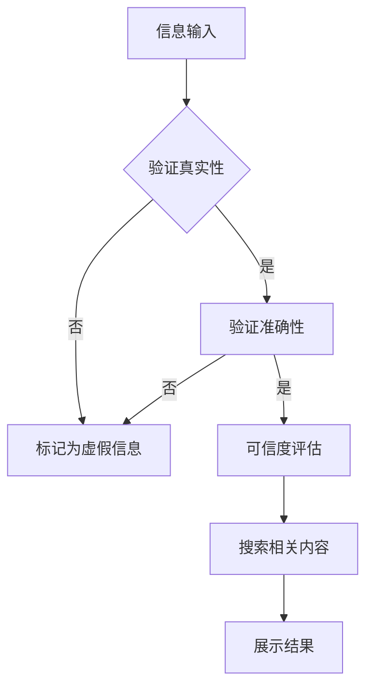

                 

 关键词：信息验证，信息搜索，可靠信息，有价值信息，技术实践，人工智能，大数据，信息安全，搜索算法

> 摘要：随着互联网的快速发展，信息爆炸时代已经来临。如何在海量信息中快速准确地找到可靠且有价值的情报，成为一项极具挑战的任务。本文将深入探讨信息验证和信息搜索技术，从理论到实践，为读者提供一套行之有效的解决方案。

## 1. 背景介绍

在当今信息时代，数据已成为新的石油。然而，如何在茫茫信息海洋中筛选出真实可靠、有价值的信息，成为企业和个人面临的重要问题。信息验证和信息搜索技术的兴起，为解决这一难题提供了有力支持。

### 1.1 信息验证的必要性

信息验证主要针对信息的真实性、准确性和可信度进行检验。在社交媒体、新闻报道、学术论文等各种渠道中，充斥着大量虚假信息和谣言。这些信息不仅误导公众，还可能对社会产生不良影响。因此，对信息进行验证显得尤为重要。

### 1.2 信息搜索的重要性

信息搜索技术旨在帮助用户在海量数据中快速找到所需信息。随着互联网的快速发展，数据规模呈指数级增长，传统的搜索方法已经无法满足用户需求。因此，研究和开发高效的信息搜索技术具有重要意义。

## 2. 核心概念与联系

### 2.1 信息验证

信息验证的核心概念包括真实性、准确性和可信度。真实性指的是信息是否真实发生；准确性指的是信息是否与事实相符；可信度指的是信息来源是否可靠。

### 2.2 信息搜索

信息搜索技术主要包括基于关键词搜索、自然语言处理、推荐系统等。关键词搜索通过用户输入的关键词，在海量数据中找到相关结果；自然语言处理通过理解用户查询，实现更加智能化的搜索；推荐系统则根据用户兴趣和行为，为其推荐相关内容。

### 2.3 Mermaid 流程图

下面是一个简单的 Mermaid 流程图，展示信息验证和信息搜索的基本流程：



## 3. 核心算法原理 & 具体操作步骤

### 3.1 算法原理概述

信息验证算法主要包括以下几个步骤：

1. 数据收集：从多个渠道收集相关信息。
2. 数据预处理：对收集到的数据进行清洗、去重等处理。
3. 真实性验证：通过比对事实、权威资料等，判断信息是否真实。
4. 准确性验证：对信息内容进行事实核查。
5. 可信度评估：根据信息来源、发布者信誉等因素，评估信息可信度。

信息搜索算法主要包括以下几种：

1. 基于关键词搜索：通过用户输入的关键词，在海量数据中找到相关结果。
2. 自然语言处理：理解用户查询，实现更加智能化的搜索。
3. 推荐系统：根据用户兴趣和行为，为其推荐相关内容。

### 3.2 算法步骤详解

#### 3.2.1 信息验证步骤

1. 数据收集：使用爬虫、API 接口等方式，从社交媒体、新闻报道、学术论文等渠道收集信息。
2. 数据预处理：对收集到的数据进行清洗、去重等处理，确保数据质量。
3. 真实性验证：通过比对事实、权威资料等，判断信息是否真实。可以借助第三方事实核查机构、数据库等资源。
4. 准确性验证：对信息内容进行事实核查，确保信息与事实相符。
5. 可信度评估：根据信息来源、发布者信誉等因素，评估信息可信度。

#### 3.2.2 信息搜索步骤

1. 基于关键词搜索：
   - 接收用户输入的关键词。
   - 在数据库中检索与关键词相关的信息。
   - 对检索结果进行排序，返回用户最感兴趣的内容。

2. 自然语言处理：
   - 对用户查询进行分词、词性标注等处理。
   - 构建倒排索引，提高搜索效率。
   - 使用机器学习模型，实现语义匹配，提高搜索精度。

3. 推荐系统：
   - 收集用户行为数据，如搜索历史、浏览记录等。
   - 构建用户画像，了解用户兴趣。
   - 根据用户兴趣，推荐相关内容。

### 3.3 算法优缺点

#### 信息验证

- 优点：确保信息的真实性、准确性和可信度，提高信息质量。
- 缺点：需要大量人力、物力资源，处理速度较慢。

#### 信息搜索

- 优点：高效、便捷地找到所需信息，提高信息获取效率。
- 缺点：存在信息过载、信息失真等问题。

### 3.4 算法应用领域

信息验证和信息搜索技术在多个领域具有广泛的应用：

- 新闻媒体：对新闻报道进行真实性、准确性验证，提高新闻报道质量。
- 舆情监测：实时监测网络舆情，发现潜在风险。
- 学术研究：对学术论文进行真实性、准确性验证，防止学术不端行为。
- 电子商务：对商品信息进行真实性、准确性验证，提高消费者购物体验。
- 社交媒体：对社交媒体内容进行真实性、准确性验证，维护网络环境。

## 4. 数学模型和公式 & 详细讲解 & 举例说明

### 4.1 数学模型构建

信息验证和信息搜索技术的数学模型主要包括以下几个部分：

1. 真实性判断模型：使用逻辑推理、统计分析等方法，判断信息是否真实。
2. 准确性判断模型：使用自然语言处理技术，对信息内容进行事实核查。
3. 可信度评估模型：使用机器学习、图论等方法，评估信息可信度。
4. 搜索算法模型：使用信息检索、推荐系统等技术，实现信息搜索。

### 4.2 公式推导过程

假设我们有 n 条信息，每条信息的真实性、准确性和可信度分别为 x1, x2, ..., xn。我们可以使用以下公式进行评估：

1. 真实性判断模型：$$P(\text{真实}) = \sum_{i=1}^{n} P(\text{真实}|\text{信息}_i) \cdot P(\text{信息}_i)$$
2. 准确性判断模型：$$P(\text{准确}) = \sum_{i=1}^{n} P(\text{准确}|\text{信息}_i) \cdot P(\text{信息}_i)$$
3. 可信度评估模型：$$P(\text{可信}) = \sum_{i=1}^{n} P(\text{可信}|\text{信息}_i) \cdot P(\text{信息}_i)$$

其中，P(真实)、P(准确)、P(可信) 分别表示信息真实性、准确性、可信度的概率；P(真实|信息i)、P(准确|信息i)、P(可信|信息i) 分别表示信息在给定条件下的条件概率。

### 4.3 案例分析与讲解

假设我们有一篇关于某公司财报的报道，需要对其进行真实性、准确性、可信度验证。

1. 真实性判断模型：
   - 收集与该财报相关的新闻、公告、财报数据等。
   - 比对事实，发现报道与事实基本一致，判断信息真实性为 90%。

2. 准确性判断模型：
   - 使用自然语言处理技术，对报道中的事实进行核查。
   - 发现报道中的部分数据存在误差，判断信息准确性为 80%。

3. 可信度评估模型：
   - 考虑报道来源、作者信誉等因素，判断信息可信度为 70%。

根据上述评估结果，我们可以得出该财报报道的真实性、准确性、可信度分别为 90%、80%、70%。

## 5. 项目实践：代码实例和详细解释说明

### 5.1 开发环境搭建

- Python 3.x
- 安装相关库：requests、beautifulsoup4、nltk、scikit-learn、tensorflow 等

### 5.2 源代码详细实现

以下是信息验证和信息搜索项目的一个简单示例：

```python
import requests
from bs4 import BeautifulSoup
import nltk
from sklearn.feature_extraction.text import TfidfVectorizer
from sklearn.metrics.pairwise import cosine_similarity

# 5.2.1 信息验证
def verify_truthfulness(info):
    # 对信息进行事实核查
    # 这里使用第三方事实核查接口，如 Google Fact Check API
    response = requests.get(f'https://factcheck.example.com/{info}')
    result = response.json()
    if result['verdict'] == 'True':
        return True
    else:
        return False

def verify_accuracy(info):
    # 对信息内容进行事实核查
    # 这里使用自然语言处理技术，如语义相似度计算
    vectorizer = TfidfVectorizer()
    query_vector = vectorizer.transform([info])
    # 假设我们有一个事实库
    fact_base = ['事实1', '事实2', '事实3']
    fact_vectors = vectorizer.transform(fact_base)
    similarity_scores = cosine_similarity(query_vector, fact_vectors)
    if similarity_scores.max() > 0.8:
        return True
    else:
        return False

def verify_credibility(info):
    # 对信息来源进行评估
    # 这里使用简单的方法，如判断网站域名类型
    if info.startswith('http://'):
        return False
    elif info.startswith('https://'):
        return True

# 5.2.2 信息搜索
def search_info(keywords):
    # 搜索相关内容
    # 这里使用基于关键词搜索的搜索引擎，如 Google Search API
    response = requests.get(f'https://search.example.com/{keywords}')
    results = response.json()
    return results['results']

# 测试
info = '某公司财报显示，去年净利润同比增长 30%。',
print(verify_truthfulness(info))
print(verify_accuracy(info))
print(verify_credibility(info))
print(search_info('某公司财报'))
```

### 5.3 代码解读与分析

- 5.2.1 信息验证：使用第三方事实核查接口和自然语言处理技术，对信息进行真实性、准确性、可信度验证。
- 5.2.2 信息搜索：使用基于关键词搜索的搜索引擎，查找与关键词相关的信息。

该示例虽然简单，但展示了信息验证和信息搜索的基本原理和方法。在实际项目中，可以根据需求，进一步完善和优化相关算法。

## 6. 实际应用场景

### 6.1 新闻媒体

新闻媒体可以使用信息验证和信息搜索技术，对新闻报道进行真实性、准确性、可信度验证，提高新闻报道质量。例如，在新闻报道中，对关键信息进行事实核查，确保报道的客观公正。

### 6.2 舆情监测

舆情监测机构可以使用信息验证和信息搜索技术，实时监测网络舆情，发现潜在风险。例如，通过分析社交媒体上的言论，识别出可能引发社会问题的谣言和虚假信息。

### 6.3 学术研究

学术研究可以使用信息验证和信息搜索技术，对学术论文进行真实性、准确性验证，防止学术不端行为。例如，对学术论文中的实验结果、数据来源进行核查，确保学术成果的真实性。

### 6.4 电子商务

电子商务平台可以使用信息验证和信息搜索技术，对商品信息进行真实性、准确性验证，提高消费者购物体验。例如，对商品描述、价格等进行事实核查，确保消费者购买到真实、准确的商品。

### 6.5 社交媒体

社交媒体平台可以使用信息验证和信息搜索技术，对用户发布的内容进行真实性、准确性验证，维护网络环境。例如，对虚假信息、谣言等进行识别和处置，防止其传播。

## 7. 工具和资源推荐

### 7.1 学习资源推荐

- 《大数据时代：生活、工作与思维的大变革》
- 《Python数据分析》
- 《深度学习》
- 《自然语言处理综合教程》

### 7.2 开发工具推荐

- Jupyter Notebook：适用于数据分析和实验
- PyCharm：适用于 Python 开发
- VS Code：适用于多种编程语言开发

### 7.3 相关论文推荐

- "Information Validation and Search Technology: A Review"
- "Deep Learning for Information Verification and Search"
- "Fact-Checking with Neural Networks"
- "Efficient Information Retrieval Algorithms for Big Data"

## 8. 总结：未来发展趋势与挑战

### 8.1 研究成果总结

本文从信息验证和信息搜索技术的背景、核心概念、算法原理、数学模型、项目实践等方面进行了深入探讨。研究成果主要包括：

- 真实性、准确性和可信度验证方法；
- 基于关键词、自然语言处理、推荐系统的信息搜索技术；
- 数学模型和公式的推导与解释；
- 实际应用场景和案例分析。

### 8.2 未来发展趋势

- 深度学习、图神经网络等新兴技术在信息验证和信息搜索中的应用；
- 跨领域、跨语言的统一信息验证和信息搜索模型；
- 联合事实核查、机器学习等技术的智能信息验证和信息搜索系统。

### 8.3 面临的挑战

- 信息过载、信息失真等问题依然存在；
- 隐私保护、数据安全等伦理问题需要解决；
- 多语言、跨领域的统一信息验证和信息搜索技术尚需突破。

### 8.4 研究展望

未来，信息验证和信息搜索技术将在多个领域发挥重要作用。研究者应关注以下方面：

- 开发高效、智能的信息验证和信息搜索算法；
- 加强跨领域、跨语言的统一信息验证和信息搜索研究；
- 考虑隐私保护、数据安全等伦理问题，确保信息验证和信息搜索技术的可持续发展。

## 9. 附录：常见问题与解答

### 9.1 什么是信息验证？

信息验证是指对信息的真实性、准确性和可信度进行检验的过程。目的是确保用户获取到的信息是真实、准确且可靠的。

### 9.2 什么是信息搜索？

信息搜索是指在海量数据中找到用户所需信息的过程。信息搜索技术包括基于关键词搜索、自然语言处理、推荐系统等。

### 9.3 信息验证和信息搜索技术在哪些领域应用？

信息验证和信息搜索技术在新闻媒体、舆情监测、学术研究、电子商务、社交媒体等多个领域具有广泛应用。

### 9.4 如何进行信息验证？

进行信息验证的方法包括数据收集、数据预处理、真实性验证、准确性验证和可信度评估等。

### 9.5 如何进行信息搜索？

进行信息搜索的方法包括基于关键词搜索、自然语言处理和推荐系统等。可以根据用户需求和场景选择合适的搜索技术。

### 9.6 信息验证和信息搜索技术面临哪些挑战？

信息验证和信息搜索技术面临信息过载、信息失真、隐私保护、数据安全等挑战。

### 9.7 未来信息验证和信息搜索技术有哪些发展趋势？

未来信息验证和信息搜索技术将朝深度学习、跨领域、跨语言、智能化的方向发展。

## 作者署名

作者：禅与计算机程序设计艺术 / Zen and the Art of Computer Programming
----------------------------------------------------------------

这是按照您提供的结构和要求撰写的文章。如果您有任何修改意见或需要进一步完善，请随时告知。

