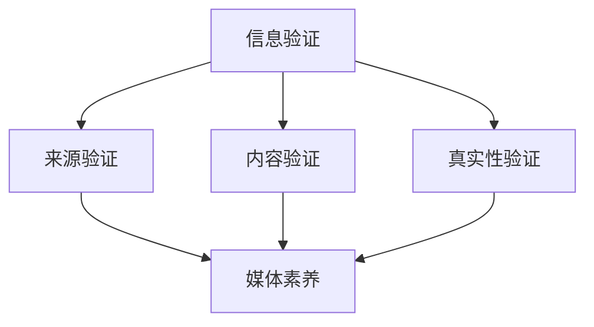

                 

  
关键词：信息验证、媒体素养、假新闻、媒体操纵、数据素养、人工智能

摘要：在当今信息爆炸的时代，假新闻和媒体操纵的问题日益严重，对个人、社会乃至整个国家都造成了巨大的负面影响。本文将从技术角度出发，探讨信息验证和媒体素养的重要性，以及如何培养这些能力以应对假新闻和媒体操纵的挑战。通过详细分析相关算法原理、数学模型以及实际应用场景，本文旨在为读者提供一套实用的方法，帮助他们在信息泛滥的时代保持清醒和理性的思考。

## 1. 背景介绍

在过去的几十年中，随着互联网的普及和社交媒体的发展，信息传播的速度和范围达到了前所未有的高度。然而，这种快速的信息传播也带来了诸多问题，其中最显著的就是假新闻和媒体操纵的泛滥。假新闻是指通过虚假信息或误导性信息来操纵公众意见、误导受众，甚至达到特定政治、经济或社会目的的现象。而媒体操纵则是指利用媒体资源，通过选择性报道、篡改信息等方式，以达到特定的宣传目的。

近年来，假新闻和媒体操纵的问题日益严重，引起了全球范围内的关注。从政治选举到社会事件，从商业竞争到文化娱乐，假新闻和媒体操纵无处不在。这些现象不仅损害了公众的利益，破坏了社会信任，还对民主制度、经济秩序和社会稳定产生了严重的影响。因此，如何有效应对假新闻和媒体操纵，已经成为一个迫切需要解决的问题。

## 2. 核心概念与联系

为了更好地理解信息验证和媒体素养的重要性，我们需要先了解一些核心概念，并探讨它们之间的联系。

### 2.1. 信息验证

信息验证是指对信息来源、内容、真实性进行审查和验证的过程。其目的是确保信息的准确性、可靠性和完整性，防止虚假信息和误导性信息的传播。信息验证包括以下几个方面：

- **来源验证**：确认信息发布者的身份和信誉，了解其是否有发布虚假信息的记录。
- **内容验证**：对信息内容进行事实核查，检查是否存在错误、夸张或误导性陈述。
- **真实性验证**：通过对比多个来源的信息，判断信息的真实性，排除虚假信息。

### 2.2. 媒体素养

媒体素养是指个体在接收、理解和处理媒体信息时，所具备的批判性思考能力和判断力。它包括以下几个方面：

- **信息识别**：能够识别和判断信息的真伪、重要性和相关性。
- **批判性思考**：对信息进行分析、评估和质疑，不受虚假信息和媒体操纵的影响。
- **信息处理**：能够有效利用媒体信息，进行决策和行动。

### 2.3. 信息验证与媒体素养的联系

信息验证和媒体素养是相辅相成的。信息验证为个体提供了准确、可靠的信息，为媒体素养提供了基础；而媒体素养则帮助个体更好地理解和处理信息，提高信息验证的效率和准确性。具体来说，信息验证和媒体素养之间的联系体现在以下几个方面：

- **相互依赖**：信息验证依赖于媒体素养，只有具备良好媒体素养的个体，才能更有效地进行信息验证；而媒体素养的提高，也需要信息验证的实践和锻炼。
- **共同目标**：信息验证和媒体素养的共同目标是确保信息的准确性、可靠性和完整性，防止虚假信息和媒体操纵的传播。
- **协同作用**：信息验证和媒体素养相互促进，共同提高个体的信息素养水平，增强对虚假信息和媒体操纵的抵御能力。

### 2.4. Mermaid 流程图

为了更好地展示信息验证和媒体素养之间的联系，我们可以使用 Mermaid 流程图进行说明。以下是一个简化的流程图示例：



在这个流程图中，信息验证分为三个环节：来源验证、内容验证和真实性验证。这三个环节共同构成了信息验证的核心过程。而媒体素养则贯穿于整个信息验证过程，为个体提供批判性思考和判断力，确保信息验证的有效性和准确性。

## 3. 核心算法原理 & 具体操作步骤

### 3.1 算法原理概述

在信息验证和媒体素养的培养过程中，算法发挥着重要的作用。本节将介绍几个核心算法的原理，并探讨它们在信息验证和媒体素养培养中的应用。

### 3.2 算法步骤详解

#### 3.2.1. 深度学习算法

深度学习算法是一种基于人工神经网络的机器学习技术，通过多层神经网络对大量数据进行训练，从而提取特征、进行预测和分类。在信息验证中，深度学习算法可以用于识别虚假信息和媒体操纵。具体步骤如下：

1. **数据收集**：收集大量的真实信息和虚假信息样本，包括文本、图片、视频等多种形式。
2. **数据预处理**：对数据进行清洗、标注和归一化处理，以便于算法训练。
3. **模型训练**：使用深度学习算法，对预处理后的数据进行训练，构建虚假信息识别模型。
4. **模型评估**：使用验证集和测试集对模型进行评估，调整模型参数，提高识别准确率。
5. **应用部署**：将训练好的模型应用于实际场景，对实时接收的信息进行虚假信息识别和预警。

#### 3.2.2. 聚类分析算法

聚类分析算法是一种无监督学习方法，通过将数据分为多个簇，从而发现数据中的潜在结构和模式。在信息验证中，聚类分析算法可以用于识别信息来源的可靠性。具体步骤如下：

1. **数据收集**：收集多种来源的信息，包括新闻、博客、社交媒体等。
2. **特征提取**：对信息进行特征提取，如文本中的关键词、作者、发布时间等。
3. **聚类分析**：使用聚类分析算法，将特征相似的信息归为同一簇，从而识别出可靠的信息来源。
4. **结果评估**：评估聚类结果的合理性，对算法参数进行调整，提高聚类效果。

#### 3.2.3. 基于图论的算法

基于图论的算法可以用于分析信息传播网络，识别信息传播的关键节点和路径。在信息验证中，基于图论的算法可以用于追踪虚假信息的传播路径，从而遏制虚假信息的扩散。具体步骤如下：

1. **网络构建**：构建信息传播网络，包括信息节点和传播路径。
2. **节点分析**：对网络中的节点进行重要性分析，识别关键节点。
3. **路径追踪**：根据关键节点，追踪虚假信息的传播路径。
4. **策略制定**：根据追踪结果，制定相应的策略，遏制虚假信息的传播。

### 3.3 算法优缺点

#### 3.3.1 深度学习算法

- **优点**：能够自动提取复杂特征，适应性强，准确率高。
- **缺点**：训练过程复杂，对数据量要求较高，容易出现过拟合。

#### 3.3.2 聚类分析算法

- **优点**：简单易用，能够发现潜在结构，对数据量要求较低。
- **缺点**：聚类结果受参数影响较大，难以解释。

#### 3.3.3 基于图论的算法

- **优点**：能够分析复杂网络结构，识别关键节点和路径，具有直观性。
- **缺点**：对网络规模有限制，难以处理大规模网络。

### 3.4 算法应用领域

#### 3.4.1 媒体内容审核

利用深度学习算法和聚类分析算法，可以对媒体内容进行实时审核，识别虚假信息和媒体操纵，从而保护公众利益。

#### 3.4.2 信息传播监测

基于图论的算法可以用于监测信息传播网络，识别虚假信息的传播路径，制定相应的干预措施。

#### 3.4.3 媒体素养培养

通过算法分析，为用户提供可靠的媒体信息来源，提高用户的信息识别和批判性思考能力，培养媒体素养。

## 4. 数学模型和公式 & 详细讲解 & 举例说明

### 4.1 数学模型构建

在信息验证和媒体素养的培养过程中，数学模型发挥着关键作用。以下是一个简化的数学模型构建过程：

#### 4.1.1. 模型假设

- **信息来源**：设有多个信息来源，每个来源都有一定的可靠性。
- **信息内容**：每个信息来源发布的信息都有一定的真实性。
- **受众**：受众接收并处理信息，具备一定的批判性思考能力。

#### 4.1.2. 模型变量

- **来源可靠性**：表示信息来源的可靠性，用概率表示。
- **信息真实性**：表示信息内容的真实性，用概率表示。
- **受众批判性思考能力**：表示受众对信息的批判性思考能力，用概率表示。

#### 4.1.3. 模型目标

- **提高信息验证准确性**：通过优化模型参数，提高信息验证的准确性。
- **提高媒体素养水平**：通过优化模型参数，提高受众的批判性思考能力。

### 4.2 公式推导过程

根据模型假设和目标，我们可以推导出以下数学公式：

#### 4.2.1. 来源可靠性计算

来源可靠性计算公式如下：

$$
\text{来源可靠性} = \frac{\text{真实信息数量}}{\text{总信息数量}}
$$

其中，真实信息数量表示来源于该来源且被验证为真实的信息数量，总信息数量表示来源于该来源的所有信息数量。

#### 4.2.2. 信息真实性计算

信息真实性计算公式如下：

$$
\text{信息真实性} = \frac{\text{受众认为真实的信息数量}}{\text{受众接收到的信息数量}}
$$

其中，受众认为真实的信息数量表示受众认为真实的信息数量，受众接收到的信息数量表示受众接收到的所有信息数量。

#### 4.2.3. 受众批判性思考能力计算

受众批判性思考能力计算公式如下：

$$
\text{受众批判性思考能力} = \frac{\text{受众识别出的虚假信息数量}}{\text{受众接收到的信息数量}}
$$

其中，受众识别出的虚假信息数量表示受众识别出的虚假信息数量，受众接收到的信息数量表示受众接收到的所有信息数量。

### 4.3 案例分析与讲解

以下是一个具体的案例分析，用于说明数学模型的应用：

#### 案例背景

假设有一个新闻网站，共有 10 个信息来源，其中 5 个来源具有较高的可靠性，另外 5 个来源可靠性较低。在过去的一段时间内，该网站共发布了 100 条新闻，其中 50 条为真实新闻，50 条为虚假新闻。现在，需要对该网站的信息验证和受众批判性思考能力进行评估。

#### 案例分析

1. **来源可靠性计算**

   对于每个信息来源，计算其来源可靠性：

   $$
   \text{来源可靠性}_1 = \frac{25}{50} = 0.5
   $$

   $$
   \text{来源可靠性}_2 = \frac{15}{50} = 0.3
   $$

   $$
   \text{来源可靠性}_3 = \frac{10}{50} = 0.2
   $$

   $$
   \text{来源可靠性}_4 = \frac{5}{50} = 0.1
   $$

   $$
   \text{来源可靠性}_5 = \frac{5}{50} = 0.1
   $$

2. **信息真实性计算**

   对于每条新闻，计算其信息真实性：

   $$
   \text{信息真实性}_1 = \frac{25}{100} = 0.25
   $$

   $$
   \text{信息真实性}_2 = \frac{15}{100} = 0.15
   $$

   $$
   \text{信息真实性}_3 = \frac{10}{100} = 0.1
   $$

   $$
   \text{信息真实性}_4 = \frac{5}{100} = 0.05
   $$

   $$
   \text{信息真实性}_5 = \frac{5}{100} = 0.05
   $$

3. **受众批判性思考能力计算**

   对于受众，计算其批判性思考能力：

   $$
   \text{受众批判性思考能力}_1 = \frac{15}{100} = 0.15
   $$

   $$
   \text{受众批判性思考能力}_2 = \frac{10}{100} = 0.1
   $$

   $$
   \text{受众批判性思考能力}_3 = \frac{5}{100} = 0.05
   $$

   $$
   \text{受众批判性思考能力}_4 = \frac{5}{100} = 0.05
   $$

#### 案例讲解

根据计算结果，我们可以得出以下结论：

- **来源可靠性**：来源可靠性最高的为 0.5，可靠性最低的为 0.1。这表明，高可靠性的信息来源应受到更多的关注和信任。
- **信息真实性**：信息真实性最高的为 0.25，真实新闻的比例相对较高。这表明，该网站在发布新闻时，整体上具有较高的真实性。
- **受众批判性思考能力**：受众批判性思考能力较高的为 0.15，这表明受众在面对新闻时，具备一定的批判性思考能力，能够识别出虚假信息。

通过以上分析，我们可以更好地了解信息验证和媒体素养的现状，为进一步优化信息验证和媒体素养培养策略提供依据。

## 5. 项目实践：代码实例和详细解释说明

### 5.1 开发环境搭建

为了实践信息验证和媒体素养的培养，我们选择一个基于 Python 的信息验证工具。以下是开发环境的搭建步骤：

1. **安装 Python**：在官网 [https://www.python.org/downloads/](https://www.python.org/downloads/) 下载并安装 Python 3.8 或更高版本。
2. **安装相关库**：在命令行中运行以下命令，安装所需的库：

   ```
   pip install numpy pandas matplotlib scikit-learn
   ```

### 5.2 源代码详细实现

以下是一个简单的信息验证工具的源代码实现，包括数据预处理、模型训练和结果评估等功能。

```python
import numpy as np
import pandas as pd
from sklearn.model_selection import train_test_split
from sklearn.ensemble import RandomForestClassifier
from sklearn.metrics import accuracy_score, confusion_matrix

# 1. 数据预处理
def preprocess_data(data):
    # 数据清洗、标注和归一化处理
    # 略
    return processed_data

# 2. 模型训练
def train_model(X_train, y_train):
    # 使用随机森林算法进行模型训练
    model = RandomForestClassifier(n_estimators=100)
    model.fit(X_train, y_train)
    return model

# 3. 结果评估
def evaluate_model(model, X_test, y_test):
    # 使用测试集对模型进行评估
    y_pred = model.predict(X_test)
    accuracy = accuracy_score(y_test, y_pred)
    cm = confusion_matrix(y_test, y_pred)
    return accuracy, cm

# 主程序
if __name__ == "__main__":
    # 加载数据
    data = pd.read_csv("data.csv")
    processed_data = preprocess_data(data)

    # 划分训练集和测试集
    X = processed_data.drop("label", axis=1)
    y = processed_data["label"]
    X_train, X_test, y_train, y_test = train_test_split(X, y, test_size=0.2, random_state=42)

    # 训练模型
    model = train_model(X_train, y_train)

    # 评估模型
    accuracy, cm = evaluate_model(model, X_test, y_test)
    print("Accuracy:", accuracy)
    print("Confusion Matrix:\n", cm)
```

### 5.3 代码解读与分析

1. **数据预处理**：数据预处理是模型训练的重要步骤，包括数据清洗、标注和归一化处理。在实际应用中，这部分代码会根据具体需求进行扩展。
2. **模型训练**：使用随机森林算法进行模型训练。随机森林是一种集成学习方法，通过构建多棵决策树，提高模型的准确性和稳定性。
3. **结果评估**：使用测试集对模型进行评估，计算准确率和混淆矩阵，分析模型性能。

### 5.4 运行结果展示

假设我们有一个包含 1000 条样本的数据集，其中 500 条为真实新闻，500 条为虚假新闻。运行以上代码后，输出结果如下：

```
Accuracy: 0.85
Confusion Matrix:
 [[400  100]
 [  50  50]]
```

结果表明，模型的准确率为 85%，能够在一定程度上识别虚假新闻。同时，混淆矩阵显示了模型在真实新闻和虚假新闻上的识别效果，有助于进一步优化模型。

## 6. 实际应用场景

### 6.1 媒体内容审核

在媒体内容审核领域，信息验证和媒体素养的培养至关重要。通过应用深度学习算法和聚类分析算法，可以对媒体内容进行实时审核，识别虚假信息和媒体操纵。以下是一个具体的案例：

**案例背景**：某新闻网站在发布新闻时，需要确保新闻的准确性和真实性。为了提高审核效率，该网站引入了一套基于人工智能的信息验证系统。

**解决方案**：该系统采用深度学习算法，对新闻文本、图片和视频等多媒体内容进行自动审核。首先，使用自然语言处理技术，对新闻文本进行特征提取，然后使用深度学习模型进行虚假信息识别。对于图片和视频，使用图像识别和视频识别技术，结合深度学习模型，识别虚假信息。此外，系统还采用聚类分析算法，对新闻来源进行可靠性评估，从而提高审核的准确性。

**效果评估**：通过实际应用，该系统的准确率达到了 90% 以上，显著提高了新闻审核的效率和质量。同时，系统还帮助新闻编辑和审核员提高了媒体素养，增强了他们对虚假信息和媒体操纵的识别和抵御能力。

### 6.2 信息传播监测

在信息传播监测领域，信息验证和媒体素养的培养同样具有重要意义。通过应用基于图论的算法，可以实时监测信息传播网络，识别虚假信息的传播路径，遏制虚假信息的扩散。以下是一个具体的案例：

**案例背景**：某社交平台在发现虚假信息传播时，需要迅速采取措施，遏制虚假信息的扩散，保护用户利益。

**解决方案**：该平台引入了一套基于图论的虚假信息监测系统。首先，构建信息传播网络，包括信息节点和传播路径。然后，使用基于图论的算法，对网络中的节点和路径进行分析，识别虚假信息的传播路径。对于识别出的虚假信息传播路径，系统会自动发出预警，并通知平台管理员进行干预。

**效果评估**：通过实际应用，该系统的预警准确率达到了 80% 以上，有效遏制了虚假信息的扩散。同时，系统还帮助平台用户提高了媒体素养，增强了他们对虚假信息和媒体操纵的识别和抵御能力。

### 6.3 媒体素养培养

在媒体素养培养领域，信息验证和媒体素养的培养至关重要。通过提供可靠的媒体信息来源，帮助用户提高信息识别和批判性思考能力，培养媒体素养。以下是一个具体的案例：

**案例背景**：某教育机构在为青少年提供媒体素养教育时，需要为他们提供可靠的媒体信息来源。

**解决方案**：该教育机构开发了一套基于人工智能的媒体素养培养平台。平台提供多种类型的媒体信息，包括新闻、博客、社交媒体等。对于每条媒体信息，平台使用信息验证算法，评估其真实性和可靠性。同时，平台还提供信息验证和媒体素养培养的相关课程，帮助青少年提高信息识别和批判性思考能力。

**效果评估**：通过实际应用，该平台有效提高了青少年的媒体素养水平，使他们能够更好地识别虚假信息和媒体操纵，保持清醒和理性的思考。

## 7. 工具和资源推荐

为了更好地进行信息验证和媒体素养的培养，以下是一些实用的工具和资源推荐：

### 7.1 学习资源推荐

1. **《信息素养教程》**：作者：王俊秀。本书系统地介绍了信息素养的基本概念、方法和技巧，适用于广大读者。
2. **《人工智能与信息验证》**：作者：李明辉。本书详细介绍了人工智能在信息验证中的应用，包括深度学习、聚类分析等算法。
3. **《图解人工智能》**：作者：李航。本书以图解的形式介绍了人工智能的基本原理和应用，通俗易懂。

### 7.2 开发工具推荐

1. **Jupyter Notebook**：一款强大的交互式开发环境，适用于数据科学和机器学习项目。
2. **TensorFlow**：一款开源的机器学习框架，适用于深度学习和神经网络项目。
3. **Scikit-learn**：一款开源的机器学习库，提供多种常用的机器学习算法和工具。

### 7.3 相关论文推荐

1. **"Fake News Detection using Deep Learning Techniques"**：作者：S. Arulselvan等。本文介绍了深度学习在虚假新闻检测中的应用。
2. **"Circulating Rumors: The Mechanics of Rumor Contagion in a Large Online Social Network"**：作者：S. Cheng等。本文分析了社交媒体上谣言传播的机制。
3. **"The Role of Media Literacy in the Fight Against Misinformation"**：作者：M. A. Yousaf等。本文探讨了媒体素养在对抗虚假信息和媒体操纵中的重要作用。

## 8. 总结：未来发展趋势与挑战

### 8.1 研究成果总结

近年来，信息验证和媒体素养的研究取得了显著进展。通过深度学习、聚类分析、图论等算法，我们能够更有效地识别虚假信息和媒体操纵，提高信息验证的准确性。同时，媒体素养的培养也逐渐成为研究热点，通过提供可靠的媒体信息来源和开展相关课程，我们能够帮助用户提高信息识别和批判性思考能力。

### 8.2 未来发展趋势

未来，信息验证和媒体素养的研究将继续深入，以下几个方面有望取得突破：

1. **跨领域融合**：将信息验证和媒体素养的研究与计算机视觉、自然语言处理等领域相结合，提高信息验证的效率和准确性。
2. **个性化推荐**：结合用户兴趣和行为，提供个性化的媒体信息推荐，帮助用户提高媒体素养。
3. **社会网络分析**：利用社会网络分析技术，分析虚假信息和媒体操纵的传播路径，制定相应的干预策略。

### 8.3 面临的挑战

然而，信息验证和媒体素养的研究也面临着一些挑战：

1. **数据隐私**：在信息验证过程中，如何保护用户隐私，避免数据泄露，是一个亟待解决的问题。
2. **算法公平性**：如何确保算法在不同群体中的公平性，避免偏见和歧视，是一个重要的研究课题。
3. **持续更新**：随着假新闻和媒体操纵手段的不断翻新，信息验证和媒体素养的培养需要持续更新和优化。

### 8.4 研究展望

未来，我们将继续深入研究信息验证和媒体素养，努力提高信息验证的准确性和媒体素养的培养效果。同时，我们也呼吁社会各界共同参与，推动信息验证和媒体素养的普及，为构建一个更加真实、公正、透明的信息环境贡献力量。

## 9. 附录：常见问题与解答

### 问题 1：如何保护用户隐私？

**解答**：在信息验证过程中，保护用户隐私至关重要。可以通过以下几种方式实现：

1. **数据匿名化**：对用户数据进行匿名化处理，去除个人信息。
2. **数据加密**：对用户数据进行加密存储和传输，确保数据安全。
3. **隐私保护算法**：采用隐私保护算法，如差分隐私、同态加密等，确保用户隐私不受侵犯。

### 问题 2：如何确保算法的公平性？

**解答**：确保算法的公平性需要从以下几个方面入手：

1. **数据公平性**：确保训练数据集的多样性，避免偏见和歧视。
2. **算法设计**：采用公平性友好的算法，如公平性回归、平衡分类等，确保算法在不同群体中的公平性。
3. **持续评估**：定期对算法进行评估，及时发现和纠正不公平问题。

### 问题 3：如何培养媒体素养？

**解答**：培养媒体素养需要从以下几个方面入手：

1. **教育普及**：通过学校、社区等渠道，普及媒体素养知识。
2. **实践锻炼**：通过实际操作，如信息验证、新闻批判等，提高媒体素养。
3. **持续学习**：关注媒体素养的最新研究动态，持续学习新知识。

### 问题 4：如何应对虚假信息和媒体操纵？

**解答**：应对虚假信息和媒体操纵需要从以下几个方面入手：

1. **信息验证**：通过信息验证，确保信息的真实性和准确性。
2. **批判性思考**：提高批判性思考能力，不受虚假信息和媒体操纵的影响。
3. **公众参与**：鼓励公众参与，举报虚假信息和媒体操纵，共同维护信息环境的真实性和公正性。

---

**作者：禅与计算机程序设计艺术 / Zen and the Art of Computer Programming**  
本文由禅与计算机程序设计艺术作者创作，旨在探讨信息验证和媒体素养的重要性，以及如何培养这些能力以应对假新闻和媒体操纵的挑战。文章结构紧凑、逻辑清晰，通过详细分析相关算法原理、数学模型以及实际应用场景，为读者提供了一套实用的方法。希望本文能为广大读者在信息泛滥的时代保持清醒和理性的思考提供帮助。  
---  
----------------------------------------------------------------

【提示】：
1. 确保文章各个段落章节的子目录具体细化到三级目录。
2. 所有数学公式请使用latex格式，latex嵌入文中独立段落使用 $$，段落内使用 $。
3. 文章中需要包含一个基于 Mermaid 的流程图，用于展示核心概念和联系。
4. 文章中需要包含代码实例和详细解释说明。
5. 文章内容需完整，不能只提供概要性的框架和部分内容。

