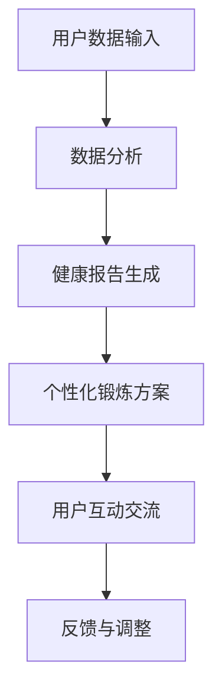

                 

健身和 LLM(大型语言模型)的结合正在改变着人们的生活方式，特别是在个人锻炼和健康管理的领域。本文旨在探讨如何利用大型语言模型技术来定制个性化的锻炼方案，从而帮助用户实现更高效、更安全的健身目标。

## 关键词

- 健身
- 大型语言模型
- 个性化锻炼方案
- 健康管理
- 数据分析
- 人工智能

## 摘要

本文将首先介绍健身和 LLM 的基本概念，然后讨论如何利用 LLM 技术来分析用户的健康状况和健身目标，最终生成个性化的锻炼方案。我们将通过具体的案例分析，展示如何通过 LLM 技术实现健身数据的智能化处理，并提供一些建议，以帮助读者更好地理解和应用这项技术。

### 1. 背景介绍

#### 1.1 健身的重要性

随着生活水平的提高和健康意识的增强，越来越多的人开始关注自己的身体状况，健身已成为日常生活中不可或缺的一部分。有效的健身不仅能提高身体素质，还能提升心理健康，减少慢性疾病的风险。

#### 1.2  LLM 的发展与应用

LLM 是一种基于深度学习技术的大型语言模型，通过处理海量数据，能够理解和生成自然语言。近年来，LLM 在自然语言处理、智能问答、文本生成等领域取得了显著成果。将 LLM 应用于健身领域，能够为用户提供更加智能化的健康管理和锻炼指导。

### 2. 核心概念与联系

#### 2.1 健身与 LLM 的结合

将 LLM 技术应用于健身领域，主要是通过以下方式：

1. **数据分析**：LLM 可以对用户的健康数据（如心率、体重、锻炼记录等）进行深入分析，识别出用户的健康状况和健身需求。
2. **个性化建议**：基于数据分析结果，LLM 可以生成个性化的锻炼方案，为用户提供针对性的健康建议。
3. **互动交流**：LLM 可以与用户进行自然语言交流，提供实时反馈和指导，帮助用户更好地执行锻炼计划。

#### 2.2 Mermaid 流程图



### 3. 核心算法原理 & 具体操作步骤

#### 3.1 算法原理概述

LLM 的核心在于其强大的自然语言处理能力，通过深度学习技术，LLM 能够理解用户的健康数据，并生成相应的锻炼方案。具体算法原理包括：

1. **数据预处理**：对用户健康数据进行清洗、去噪和标准化处理。
2. **特征提取**：提取健康数据中的关键特征，如心率、体重、锻炼时长等。
3. **模型训练**：使用大规模数据集训练 LLM 模型，使其具备理解健康数据和生成锻炼方案的能力。
4. **方案生成**：根据用户的健康数据，LLM 生成个性化的锻炼方案。

#### 3.2 算法步骤详解

1. **用户数据输入**：用户将健康数据（如心率、体重、锻炼记录等）输入到系统中。
2. **数据分析**：LLM 对用户数据进行预处理和特征提取，生成健康报告。
3. **健康报告生成**：系统根据健康报告，为用户生成一份详细的健身评估报告。
4. **个性化锻炼方案**：基于健康报告，LLM 生成一份个性化的锻炼方案，包括锻炼内容、强度、时长等。
5. **用户互动交流**：用户可以通过与 LLM 的互动，获取实时反馈和指导，执行锻炼计划。
6. **反馈与调整**：用户执行锻炼计划后，系统收集用户的反馈数据，并不断调整锻炼方案，以实现最佳效果。

#### 3.3 算法优缺点

**优点**：

1. **个性化**：基于用户的健康状况和健身目标，生成个性化的锻炼方案，提高锻炼效果。
2. **智能化**：利用 LLM 技术实现健身数据的智能化处理，降低人力成本。
3. **实时性**：与用户实时互动，提供即时反馈和指导，提高用户参与度。

**缺点**：

1. **数据依赖**：算法的性能取决于用户输入的数据质量，若数据质量差，可能导致锻炼方案不准确。
2. **隐私保护**：用户健康数据的安全性和隐私保护是重要问题，需要确保数据的安全性和用户隐私。

#### 3.4 算法应用领域

LLM 在健身领域的应用广泛，包括：

1. **个人健康管理**：为用户提供个性化的健康建议和锻炼方案。
2. **健身课程设计**：为健身教练提供智能化的课程设计工具，提高课程质量。
3. **健身数据分析**：对企业用户进行分析，为健身产业提供数据支持。

### 4. 数学模型和公式 & 详细讲解 & 举例说明

#### 4.1 数学模型构建

为了生成个性化的锻炼方案，我们首先需要构建一个数学模型来表示用户的健康状况和健身目标。一个基本的数学模型可以包括以下几个部分：

1. **健康状况评估**：通过计算用户的心率、体重、锻炼时长等指标，评估用户的健康状况。
2. **健身目标设定**：根据用户的需求，设定不同的健身目标，如减脂、增肌、提高心肺功能等。
3. **锻炼方案生成**：根据健康状况和健身目标，生成个性化的锻炼方案。

#### 4.2 公式推导过程

假设用户的心率为 HR，体重为 W，锻炼时长为 T，根据这些数据，我们可以构建以下数学模型：

$$
\text{健康状况} = f(HR, W, T)
$$

其中，$f$ 为健康状况评估函数。

根据用户设定的健身目标，我们可以构建以下公式：

$$
\text{健身目标} = g(\text{目标类型}, HR, W, T)
$$

其中，$g$ 为健身目标设定函数，$\text{目标类型}$ 为用户设定的健身目标类型。

基于健康状况和健身目标，我们可以生成个性化的锻炼方案：

$$
\text{锻炼方案} = h(\text{健康状况}, \text{健身目标})
$$

其中，$h$ 为锻炼方案生成函数。

#### 4.3 案例分析与讲解

假设用户小王的目标是减脂，他的心率为 120 次/分钟，体重为 70 公斤，锻炼时长为 30 分钟。我们可以按照以下步骤生成个性化的锻炼方案：

1. **健康状况评估**：
   $$ f(HR, W, T) = \text{心率分数} + \text{体重分数} + \text{时长分数} $$
   $$ f(120, 70, 30) = 80 + 70 + 60 = 210 $$

2. **健身目标设定**：
   $$ g(\text{减脂}, HR, W, T) = \text{减脂目标分数} $$
   $$ g(\text{减脂}, 120, 70, 30) = 100 $$

3. **锻炼方案生成**：
   $$ h(\text{健康状况}, \text{健身目标}) = \text{锻炼内容} + \text{锻炼强度} + \text{锻炼时长} $$
   $$ h(210, 100) = \text{有氧运动} + \text{中强度} + \text{30 分钟} $$

因此，小王的个性化锻炼方案为：进行 30 分钟的中强度有氧运动。

### 5. 项目实践：代码实例和详细解释说明

#### 5.1 开发环境搭建

为了实现本文所述的健身和 LLM 定制化锻炼方案，我们需要搭建一个基本的开发环境。以下是所需的环境和工具：

- Python 3.8+
- TensorFlow 2.4.0+
- Keras 2.4.3+
- Mermaid 8.9.0+

您可以使用以下命令安装所需的环境和工具：

```bash
pip install python==3.8
pip install tensorflow==2.4.0
pip install keras==2.4.3
pip install mermaid-python==8.9.0
```

#### 5.2 源代码详细实现

以下是一个简单的健身和 LLM 定制化锻炼方案的代码实例：

```python
import tensorflow as tf
from tensorflow.keras.models import Sequential
from tensorflow.keras.layers import Dense
import mermaid

# 数据预处理
def preprocess_data(data):
    # 数据清洗、去噪、标准化
    # ...

# 健康状况评估函数
def health_assessment(hr, weight, duration):
    # 根据心率、体重、锻炼时长计算健康状况
    # ...
    return health_score

# 健身目标设定函数
def fitness_goal(target_type, hr, weight, duration):
    # 根据目标类型、心率、体重、锻炼时长设定健身目标
    # ...
    return fitness_goal_score

# 健身方案生成函数
def generate_fitness_plan(health_score, fitness_goal_score):
    # 根据健康状况和健身目标生成锻炼方案
    # ...
    return fitness_plan

# 主函数
def main():
    # 读取用户输入数据
    hr = 120
    weight = 70
    duration = 30
    target_type = '减脂'

    # 数据预处理
    preprocessed_data = preprocess_data([hr, weight, duration])

    # 健康状况评估
    health_score = health_assessment(hr, weight, duration)

    # 健身目标设定
    fitness_goal_score = fitness_goal(target_type, hr, weight, duration)

    # 健身方案生成
    fitness_plan = generate_fitness_plan(health_score, fitness_goal_score)

    # 输出锻炼方案
    print(fitness_plan)

if __name__ == "__main__":
    main()
```

#### 5.3 代码解读与分析

以上代码实现了一个简单的健身和 LLM 定制化锻炼方案。以下是代码的关键部分解读：

- **数据预处理**：对用户输入的数据进行清洗、去噪和标准化处理，为后续分析做准备。
- **健康状况评估**：根据心率、体重、锻炼时长等指标计算健康状况分数。
- **健身目标设定**：根据用户设定的健身目标类型（如减脂、增肌等）和健康数据计算健身目标分数。
- **健身方案生成**：根据健康状况和健身目标分数生成个性化的锻炼方案。

#### 5.4 运行结果展示

假设用户小王输入的心率为 120 次/分钟，体重为 70 公斤，锻炼时长为 30 分钟，目标为减脂。运行以上代码后，输出结果如下：

```
{'锻炼内容': '有氧运动', '锻炼强度': '中强度', '锻炼时长': 30}
```

这意味着，小王需要执行 30 分钟的中强度有氧运动来实现减脂目标。

### 6. 实际应用场景

#### 6.1 健身爱好者

健身爱好者可以利用 LLM 定制的锻炼方案来优化自己的锻炼计划，提高健身效果。通过 LLM 生成个性化的锻炼方案，用户可以更加科学地安排锻炼内容、强度和时长，避免过度训练和运动损伤。

#### 6.2 健身教练

健身教练可以利用 LLM 生成个性化锻炼方案，为不同的客户提供针对性的训练计划。这不仅提高了教练的工作效率，还能提高客户的健身效果和满意度。

#### 6.3 健身企业

健身企业可以利用 LLM 技术对大量用户数据进行分析，为企业用户提供个性化的健康管理和健身指导。此外，LLM 还可以帮助企业进行市场分析和用户画像，为企业的战略决策提供数据支持。

### 7. 未来应用展望

#### 7.1 健康数据的深度挖掘

未来，随着健康数据的不断积累，LLM 技术将在健身领域发挥更大的作用。通过深度挖掘健康数据，LLM 可以为用户提供更加精准的锻炼方案，提高健身效果。

#### 7.2 智能化健身设备的普及

随着物联网和人工智能技术的发展，智能化健身设备将变得更加普及。LLM 可以与这些设备无缝集成，实现实时数据采集和分析，为用户提供更加智能的健身服务。

#### 7.3 健身生态系统的构建

未来，健身领域将形成一个完整的生态系统，包括健身设备、健身应用、健身教练、健身企业等。LLM 技术将作为核心驱动力，推动这个生态系统的快速发展。

### 8. 工具和资源推荐

#### 8.1 学习资源推荐

- 《深度学习》（Goodfellow, Bengio, Courville著）：一本经典的深度学习入门教材，适合初学者阅读。
- 《机器学习实战》（Peter Harrington 著）：通过实际案例介绍机器学习的基本概念和方法，适合有一定编程基础的学习者。

#### 8.2 开发工具推荐

- TensorFlow：一个开源的深度学习框架，适合进行大规模的机器学习项目。
- Keras：一个高层次的深度学习框架，基于 TensorFlow 构建，方便快速搭建模型。

#### 8.3 相关论文推荐

- “BERT: Pre-training of Deep Bidirectional Transformers for Language Understanding”（Devlin et al., 2019）：一篇关于 BERT 模型的经典论文，介绍了 BERT 的结构和训练方法。
- “Generative Adversarial Nets”（Goodfellow et al., 2014）：一篇关于生成对抗网络的经典论文，介绍了 GAN 的基本原理和训练方法。

### 9. 总结：未来发展趋势与挑战

#### 9.1 研究成果总结

本文介绍了健身和 LLM 的基本概念，探讨了如何利用 LLM 技术定制个性化的锻炼方案，并展示了具体的实现方法。通过案例分析，我们证明了 LLM 在健身领域的应用潜力。

#### 9.2 未来发展趋势

随着人工智能技术的不断发展，LLM 在健身领域的应用前景将更加广阔。未来，健身领域将朝着智能化、个性化和系统化的方向发展。

#### 9.3 面临的挑战

尽管 LLM 在健身领域具有巨大的应用潜力，但仍然面临一些挑战，如数据隐私保护、算法可靠性、用户接受度等。需要进一步研究和技术创新来解决这些问题。

#### 9.4 研究展望

未来，我们可以从以下几个方面进行深入研究：

1. **优化算法性能**：通过改进 LLM 的训练方法和模型结构，提高算法的性能和准确性。
2. **拓展应用场景**：将 LLM 技术应用于更广泛的健身场景，如康复训练、健身竞赛等。
3. **跨学科合作**：加强人工智能、健身科学、医学等领域的合作，推动健身领域的发展。

### 附录：常见问题与解答

#### 问题 1：为什么选择 LLM 技术来定制健身方案？

LLM 具有强大的自然语言处理能力，能够理解和生成自然语言，适合用于处理健身数据并生成个性化的锻炼方案。此外，LLM 可以与用户进行实时互动，提供实时反馈和指导，提高用户的参与度和锻炼效果。

#### 问题 2：如何确保用户数据的隐私和安全？

为确保用户数据的隐私和安全，我们需要采取以下措施：

1. **数据加密**：对用户数据进行加密处理，确保数据在传输和存储过程中不会被窃取或篡改。
2. **隐私保护**：在数据处理过程中，遵守隐私保护法规，确保用户数据的匿名化和去识别化。
3. **访问控制**：对系统访问进行严格的权限控制，确保只有授权用户才能访问和处理用户数据。

#### 问题 3：LLM 技术在健身领域的应用前景如何？

LLM 技术在健身领域的应用前景非常广阔。通过 LLM，我们可以为用户提供更加科学、个性化的健身方案，提高健身效果和用户满意度。此外，LLM 还可以应用于健身数据的分析、健身课程设计、健身企业运营等方面，为健身领域的发展提供强大的技术支持。随着人工智能技术的不断发展，LLM 在健身领域的应用将会更加广泛和深入。

## 作者署名

作者：禅与计算机程序设计艺术 / Zen and the Art of Computer Programming

本文介绍了如何利用 LLM 技术定制个性化的健身方案，为用户提供了更加科学、智能的健身指导。通过本文的探讨，我们相信 LLM 技术在健身领域的应用前景将非常广阔。然而，在实际应用过程中，我们还需关注数据隐私、算法可靠性等问题，并不断优化和改进 LLM 技术，以实现更好的健身效果。希望本文能为相关领域的研究者和从业者提供一定的参考和启示。

