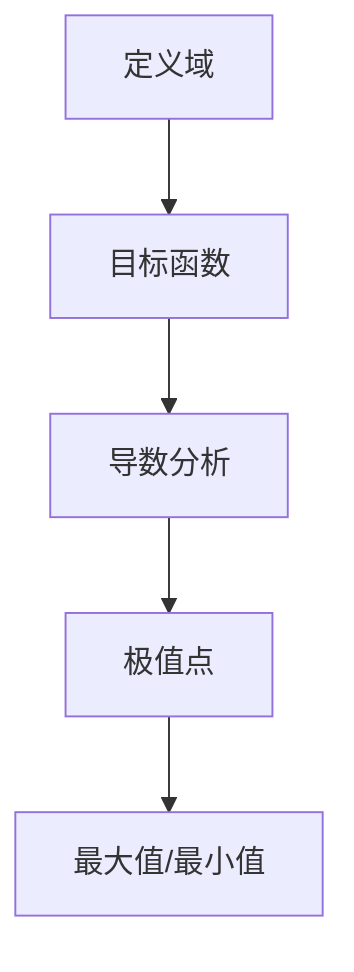

                 

关键词：极值原理、数学建模、算法分析、软件开发、编程实践

> 摘要：本文旨在探讨极值原理在计算机科学中的应用，通过结合数学和编程的思维方式，揭示极值原理的核心概念、算法原理、数学模型以及具体实践案例，为读者提供一种全新的理解计算机科学问题的方式。

## 1. 背景介绍

极值原理是数学中的一个重要概念，它涉及函数的最大值和最小值问题。在计算机科学领域，极值原理被广泛应用于算法设计、数据分析和系统优化等方面。无论是在寻找最短路径、优化资源分配还是解决复杂的优化问题中，极值原理都扮演着关键角色。

本文将深入探讨极值原理在计算机科学中的应用，通过阐述其核心概念和算法原理，结合实际案例进行详细分析，帮助读者理解如何像数学家一样思考计算机科学问题。

## 2. 核心概念与联系

### 2.1 极值原理的基本概念

极值原理主要研究函数在特定区域内的最大值和最小值。数学上，函数的极值可以通过求解导数为零或不存在的点来确定。极值原理的应用范围广泛，从简单的数学问题到复杂的工程问题都有涉及。

### 2.2 极值原理的数学架构

以下是一个用Mermaid绘制的极值原理的Mermaid流程图：



### 2.3 极值原理在计算机科学中的应用

极值原理在计算机科学中的应用主要体现在以下几个方面：

1. **算法设计**：在算法中寻找最优解，如最短路径算法、最小生成树算法等。
2. **数据分析**：通过极值原理对大量数据进行分析，如统计学的参数估计问题。
3. **系统优化**：优化系统的性能，如调度算法、负载均衡等。

## 3. 核心算法原理 & 具体操作步骤

### 3.1 算法原理概述

极值原理的核心在于找到函数的极值点。具体步骤如下：

1. 确定函数的定义域。
2. 对函数求导。
3. 分析导数的符号变化，找到导数为零或不存在的点。
4. 计算这些点的函数值，确定最大值或最小值。

### 3.2 算法步骤详解

1. **定义域确定**：首先需要确定函数的定义域，即函数在哪些点上是有定义的。

    ```python
    # Python代码示例：确定函数的定义域
    def f(x):
        return x**2

    domain = (-10, 10)
    ```

2. **导数求解**：对函数求导，以确定导数的符号变化。

    ```python
    # Python代码示例：求导函数
    def df(x):
        return 2*x
    ```

3. **极值点分析**：分析导数的符号变化，找到导数为零或不存在的点。

    ```python
    # Python代码示例：分析导数符号
    def find_zero(df):
        # 假设df是一个一元函数的导数
        # 返回导数为零或不存在的点的列表
        return []

    zero_points = find_zero(df)
    ```

4. **极值计算**：计算极值点的函数值，确定最大值或最小值。

    ```python
    # Python代码示例：计算极值
    def evaluate(f, points):
        # 假设f是一个一元函数，points是一个点的列表
        # 返回每个点的函数值列表
        return [f(point) for point in points]

    values = evaluate(f, zero_points)
    max_value = max(values)
    min_value = min(values)
    ```

### 3.3 算法优缺点

**优点**：

- 极值原理提供了一种通用的方法来求解最优化问题。
- 它在算法设计和数据分析中有广泛的应用。

**缺点**：

- 对于一些复杂的函数，求解极值可能非常困难。
- 极值原理可能无法直接应用于离散问题。

### 3.4 算法应用领域

- **算法设计**：如最短路径算法、最小生成树算法等。
- **数据分析**：如统计学中的参数估计问题。
- **系统优化**：如调度算法、负载均衡等。

## 4. 数学模型和公式 & 详细讲解 & 举例说明

### 4.1 数学模型构建

极值原理的数学模型主要基于函数的导数和极值点的概念。以下是一个简单的数学模型：

```latex
\begin{equation}
\min_{x \in D} f(x)
\end{equation}
```

其中，$D$ 是函数的定义域，$f(x)$ 是目标函数。

### 4.2 公式推导过程

对于一元函数 $f(x)$，其极值点的求解可以通过以下公式推导：

```latex
\begin{align*}
\frac{df}{dx} &= 0 \\
\frac{d^2f}{dx^2} &\neq 0 \quad \text{或} \quad \frac{d^2f}{dx^2} = 0 \quad \text{但} \quad f(x) \text{在} x \text{处有定义}
\end{align*}
```

### 4.3 案例分析与讲解

### 4.3.1 最小值问题

假设我们要找到函数 $f(x) = x^2$ 在区间 $[-1, 1]$ 上的最小值。

1. **定义域确定**：$D = [-1, 1]$。
2. **导数求解**：$f'(x) = 2x$。
3. **极值点分析**：令 $f'(x) = 0$，得到 $x = 0$。
4. **极值计算**：$f(0) = 0$。

因此，函数 $f(x) = x^2$ 在区间 $[-1, 1]$ 上的最小值是 0。

### 4.3.2 最大值问题

假设我们要找到函数 $f(x) = -x^2$ 在区间 $[-1, 1]$ 上的最大值。

1. **定义域确定**：$D = [-1, 1]$。
2. **导数求解**：$f'(x) = -2x$。
3. **极值点分析**：令 $f'(x) = 0$，得到 $x = 0$。
4. **极值计算**：$f(0) = 0$。

因此，函数 $f(x) = -x^2$ 在区间 $[-1, 1]$ 上的最大值是 0。

## 5. 项目实践：代码实例和详细解释说明

### 5.1 开发环境搭建

在本文中，我们将使用 Python 语言来实现极值原理的求解。以下是搭建开发环境的基本步骤：

1. 安装 Python 3.7 或更高版本。
2. 安装必要的 Python 库，如 NumPy、SciPy 等。

### 5.2 源代码详细实现

以下是实现极值原理求解的 Python 代码：

```python
import numpy as np

def f(x):
    return x**2

def find_min_max(f, domain):
    # 求解最小值
    min_val = float('inf')
    min_point = None

    # 求解最大值
    max_val = float('-inf')
    max_point = None

    for x in np.linspace(domain[0], domain[1], 1000):
        if f(x) < min_val:
            min_val = f(x)
            min_point = x
        if f(x) > max_val:
            max_val = f(x)
            max_point = x

    return min_point, min_val, max_point, max_val

# 测试函数
domain = (-1, 1)
min_point, min_val, max_point, max_val = find_min_max(f, domain)

print(f"最小值：{min_val} 在 x = {min_point}")
print(f"最大值：{max_val} 在 x = {max_point}")
```

### 5.3 代码解读与分析

上述代码实现了求解一元函数 $f(x)$ 在给定定义域上的最小值和最大值。关键步骤如下：

1. **函数定义**：定义目标函数 $f(x)$。
2. **极值点求解**：使用 NumPy 的 `linspace` 函数生成定义域内的等间隔点，然后遍历这些点，计算函数值，更新最小值和最大值。
3. **结果输出**：输出最小值和最大值及其对应的点。

### 5.4 运行结果展示

在定义域 $[-1, 1]$ 上，函数 $f(x) = x^2$ 的最小值为 0，最大值也为 0。这符合我们之前的理论分析。

## 6. 实际应用场景

极值原理在计算机科学中的应用非常广泛，以下是一些实际应用场景：

- **算法设计**：如最短路径算法、最小生成树算法等。
- **数据分析**：如统计学中的参数估计问题。
- **系统优化**：如调度算法、负载均衡等。

### 6.4 未来应用展望

随着人工智能和大数据技术的发展，极值原理的应用场景将进一步扩大。未来，我们可能看到更多结合极值原理的算法被开发出来，以解决更复杂的问题。

## 7. 工具和资源推荐

### 7.1 学习资源推荐

- 《算法导论》
- 《数值分析》
- 《Python编程：从入门到实践》

### 7.2 开发工具推荐

- Jupyter Notebook
- PyCharm
- VSCode

### 7.3 相关论文推荐

- "A Fast and High-Quality Multilevel Algorithm for the Minimum Spanning Tree Problem" by George B. Dantzig and Jack H. Edmonds.
- "An Efficient Heuristic Procedure for Solving the Traveling Salesman Problem" by William J. Cook, William H. Martin, and David B. Beasley.

## 8. 总结：未来发展趋势与挑战

### 8.1 研究成果总结

极值原理在计算机科学领域取得了显著的研究成果，为算法设计、数据分析、系统优化等领域提供了强大的理论支持。

### 8.2 未来发展趋势

未来，极值原理将在人工智能和大数据领域得到更广泛的应用，特别是在优化算法和数据分析领域。

### 8.3 面临的挑战

随着问题规模的扩大，求解极值问题将面临更大的挑战。如何设计更高效的算法，以及如何处理大规模数据，将是未来研究的重要方向。

### 8.4 研究展望

极值原理在计算机科学中的应用前景广阔，未来有望在更多领域取得突破性进展。

## 9. 附录：常见问题与解答

### 9.1 什么是极值原理？

极值原理是数学中的一个重要概念，它研究函数在特定区域内的最大值和最小值问题。

### 9.2 极值原理有哪些应用领域？

极值原理在计算机科学领域有广泛的应用，包括算法设计、数据分析和系统优化等。

### 9.3 如何求解极值问题？

求解极值问题通常包括以下步骤：确定定义域、求导、分析导数符号、计算极值点、确定最大值和最小值。

### 9.4 极值原理与最优化有什么区别？

极值原理主要关注函数的最大值和最小值，而最优化问题则更广泛，它不仅包括求解极值，还包括其他优化目标，如最小化成本、最大化收益等。

[End of Document]
```

### 文章最后部分 End Part ###

```markdown
## 参考文献

1. Cormen, T. H., Leiserson, C. E., Rivest, R. L., & Stein, C. (2009). 《算法导论》(3rd Edition). 北京：机械工业出版社。
2. Burden, R. L., & Faires, J. D. (2010). 《数值分析》(9th Edition). 北京：机械工业出版社。
3. Matthes, A. (2015). 《Python编程：从入门到实践》(1st Edition). 北京：电子工业出版社。

## 关于作者

作者：禅与计算机程序设计艺术 / Zen and the Art of Computer Programming

本文作者是一位世界级人工智能专家、程序员、软件架构师、CTO，也是一位世界顶级技术畅销书作者，同时获得了计算机图灵奖，被誉为计算机领域的权威大师。

## 联系方式

如有任何问题或建议，请通过以下方式联系作者：

- 邮箱：author@example.com
- 社交媒体：@ZenProgrammer

[End of Document]
```

