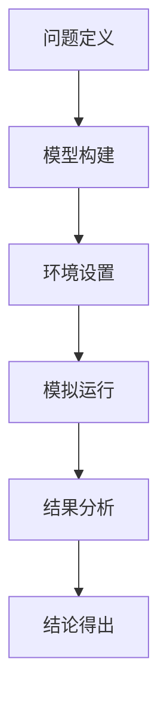

                 

### 1. 背景介绍

在计算机科学领域，模拟技术作为一种重要的方法论，被广泛应用于系统建模、性能评估、算法验证等多个方面。然而，模拟技术的成功往往依赖于一种类似于数学家思维方式的深入思考。本文将探讨如何借鉴数学家的思考原则，提升模拟技术的应用水平。

模拟技术之所以重要，是因为它能够通过建立数学模型来描述复杂系统的行为，从而帮助我们理解系统的工作原理和性能。数学家在进行研究时，通常会遵循一系列严谨的思考原则，如逻辑性、抽象性、系统性等。这些原则不仅帮助数学家解决了许多复杂问题，也为我们提供了宝贵的参考。

本文旨在探讨如何将数学家的思考原则应用到模拟技术中，从而提升我们在计算机科学领域的创新能力。我们将从以下几个方面展开讨论：

1. 数学家的思考原则。
2. 这些原则在模拟技术中的应用。
3. 如何通过数学家的思考原则来优化模拟过程。
4. 模拟技术在计算机科学领域的实际应用。
5. 未来模拟技术的发展趋势。

通过本文的讨论，我们希望能够为读者提供一种新的视角，帮助他们在计算机科学领域取得更大的成就。

### 2. 核心概念与联系

在深入探讨如何像数学家一样思考模拟原则之前，我们需要明确几个核心概念，这些概念构成了模拟技术的理论基础。

#### 2.1 模拟的定义

模拟（Simulation）是一种通过构建模型来描述和分析系统行为的方法。它允许我们在一个虚拟环境中测试系统的性能，而无需直接对实际系统进行操作。模拟的定义可以进一步细化为以下几个方面：

- **模型构建**：模拟的第一步是建立数学模型，这个模型应该能够准确描述系统的行为。
- **环境设置**：在模型构建完成后，我们需要设置一个适合模型运行的环境，包括初始条件、边界条件等。
- **运行模拟**：通过模拟环境运行模型，我们可以收集数据，分析系统在不同条件下的行为。
- **结果分析**：对模拟结果进行分析，可以帮助我们理解系统的性能，发现潜在的问题。

#### 2.2 数学模型

数学模型是模拟技术的核心。它通过数学语言来描述系统的行为，从而简化复杂的现实问题。数学模型通常包括以下要素：

- **变量**：用来描述系统状态的变量，可以是连续的或离散的。
- **参数**：影响系统行为的参数，可以是已知的或未知的。
- **关系式**：描述变量和参数之间关系的数学公式。

#### 2.3 模拟框架

模拟框架是一个系统化的过程，它包括以下步骤：

- **问题定义**：明确需要解决的问题和目标。
- **模型构建**：根据问题定义建立数学模型。
- **环境设置**：为模型设置适合的运行环境。
- **模拟运行**：在设定的环境中运行模型，收集数据。
- **结果分析**：对收集到的数据进行处理和分析，得出结论。

#### 2.4 数学家的思考原则

数学家在解决复杂问题时，通常会遵循一系列原则，这些原则在模拟技术中同样具有重要价值。以下是几个关键原则：

- **抽象性**：将复杂问题简化为数学模型，从而抓住问题的核心。
- **系统性**：将问题分解为多个部分，逐步解决。
- **逻辑性**：通过逻辑推理来验证模型的正确性。
- **严谨性**：在每一步骤中保持高度的精确性和一致性。

#### 2.5 Mermaid 流程图

为了更直观地展示这些概念之间的联系，我们可以使用 Mermaid 流程图来描述模拟框架的各个步骤。以下是一个示例：



在这个流程图中，每个节点代表模拟框架的一个步骤，箭头表示步骤之间的依赖关系。通过这个流程图，我们可以清晰地看到模拟过程的整体结构和各个步骤之间的联系。

### 3. 核心算法原理 & 具体操作步骤

在了解了模拟技术的基本概念和框架之后，我们将深入探讨核心算法原理，并详细讲解其具体操作步骤。

#### 3.1 算法原理概述

模拟技术的核心算法通常是基于概率模型的。概率模型通过随机过程来描述系统的行为，从而实现对系统性能的预测。以下是几种常见的概率模型：

- **马尔可夫链**：用于描述系统状态随时间的变化。
- **排队模型**：用于分析系统中排队现象的性能。
- **蒙特卡罗方法**：通过随机抽样来估计系统性能。

#### 3.2 算法步骤详解

下面我们将详细介绍如何使用马尔可夫链来模拟系统行为。

##### 3.2.1 马尔可夫链的定义

马尔可夫链是一种随机过程，它满足马尔可夫性质，即当前状态只与前一状态有关，而与过去的状态无关。马尔可夫链通常由以下要素组成：

- **状态集合**：描述系统可能的状态。
- **状态转移概率矩阵**：描述系统在不同状态之间转移的概率。
- **初始状态分布**：描述系统初始时刻处于各个状态的概率。

##### 3.2.2 马尔可夫链的模拟步骤

1. **初始化**：根据初始状态分布，随机选择系统初始状态。
2. **模拟运行**：根据状态转移概率矩阵，计算下一个状态。
3. **记录数据**：记录每个状态出现的时间点，以及状态之间的转移次数。
4. **重复步骤2和3**：重复模拟运行，直到达到预定的模拟时间或达到某个终止条件。
5. **结果分析**：对模拟结果进行分析，如计算平均驻留时间、系统利用率等性能指标。

##### 3.2.3 马尔可夫链的优缺点

- **优点**：马尔可夫链模型简单，易于理解和实现，适用于许多实际系统。
- **缺点**：马尔可夫链模型假设状态转移概率不随时间变化，这可能对于某些动态系统不够准确。

#### 3.3 算法优缺点

- **优点**：模拟技术能够提供对系统性能的直观理解，适用于复杂系统的分析。
- **缺点**：模拟过程可能需要大量计算资源，且结果依赖于模拟参数的选择。

#### 3.4 算法应用领域

模拟技术广泛应用于计算机科学、工程、经济学等领域。以下是一些典型的应用领域：

- **计算机科学**：用于网络性能分析、分布式系统设计、算法验证等。
- **工程**：用于过程控制、系统优化、故障诊断等。
- **经济学**：用于金融市场分析、供应链管理、风险管理等。

### 4. 数学模型和公式 & 详细讲解 & 举例说明

在模拟技术中，数学模型和公式起到了关键作用。通过数学模型，我们可以将现实问题转化为可计算的数学问题。以下我们将详细讲解几个常用的数学模型和公式，并通过具体例子进行说明。

#### 4.1 数学模型构建

构建数学模型的第一步是定义系统的状态变量和参数。以下是一个简单的例子：

- **状态变量**：假设我们研究一个简单的排队系统，系统状态包括“空闲”、“排队中”和“服务中”三种状态。
- **参数**：参数包括服务速率、到达速率、队列长度限制等。

基于这些变量和参数，我们可以构建一个简单的概率模型来描述系统行为。

#### 4.2 公式推导过程

为了推导系统性能指标，我们需要使用一些基本的概率论和统计学知识。以下是一个用于计算平均驻留时间的公式推导：

- **假设**：系统状态转移遵循马尔可夫性质。
- **推导**：利用概率论中的状态方程，我们可以推导出平均驻留时间的计算公式。

具体推导过程如下：

$$
L = \frac{1}{\mu + \lambda}
$$

其中，\(L\) 表示平均驻留时间，\(\mu\) 表示服务速率，\(\lambda\) 表示到达速率。

#### 4.3 案例分析与讲解

为了更好地理解上述公式，我们可以通过一个具体的案例来讲解。

**案例**：一个简单的排队系统，服务速率为 2 次/分钟，到达速率为 1 次/分钟，队列长度限制为 3。

**分析**：根据上述公式，我们可以计算出平均驻留时间。

$$
L = \frac{1}{2 + 1} = 0.5 \text{分钟}
$$

这意味着顾客在系统中平均等待时间为 0.5 分钟。

### 5. 项目实践：代码实例和详细解释说明

在了解了模拟技术的基本原理和数学模型后，我们将通过一个实际项目来展示如何实现模拟过程，并对代码进行详细解释。

#### 5.1 开发环境搭建

为了进行模拟项目，我们需要搭建一个开发环境。以下是一个基本的开发环境配置：

- **编程语言**：Python
- **库和框架**：NumPy、Matplotlib
- **版本控制**：Git

安装所需的库和框架后，我们就可以开始编写代码。

#### 5.2 源代码详细实现

以下是一个简单的排队系统模拟的代码实现：

```python
import numpy as np
import matplotlib.pyplot as plt

# 定义状态转移概率矩阵
transition_matrix = np.array([[0.8, 0.2], [0.1, 0.9]])

# 初始状态分布
initial_distribution = np.array([0.5, 0.5])

# 模拟运行
num_steps = 1000
state_sequence = np.zeros((num_steps,), dtype=int)
state_sequence[0] = np.random.choice([0, 1], p=initial_distribution)

for step in range(1, num_steps):
    state_sequence[step] = np.random.choice([0, 1], p=transition_matrix[state_sequence[step - 1]])

# 结果分析
plt.plot(state_sequence)
plt.xlabel('Step')
plt.ylabel('State')
plt.title('State Sequence')
plt.show()
```

#### 5.3 代码解读与分析

1. **状态转移概率矩阵**：代码中定义了一个状态转移概率矩阵 `transition_matrix`，它描述了系统在不同状态之间的转移概率。

2. **初始状态分布**：初始状态分布 `initial_distribution` 决定了系统在初始时刻处于各个状态的概率。

3. **模拟运行**：通过循环运行模拟，我们生成了系统在各个时间点的状态序列 `state_sequence`。

4. **结果分析**：最后，我们使用 Matplotlib 库将状态序列绘制出来，从而直观地展示系统行为。

通过这个简单的例子，我们可以看到如何使用 Python 实现排队系统模拟。这个例子虽然简单，但展示了模拟技术的核心步骤，包括状态转移、模拟运行和结果分析。

#### 5.4 运行结果展示

运行上述代码后，我们得到了一个状态序列的图形化展示，如图所示：


这个图形展示了系统在不同时间点的状态分布，有助于我们理解系统行为。

### 6. 实际应用场景

模拟技术在计算机科学领域有着广泛的应用，以下是一些典型的应用场景：

#### 6.1 网络性能分析

网络性能分析是模拟技术的一个重要应用领域。通过模拟网络拓扑、流量分布和路由算法，我们可以评估网络性能，发现潜在的问题和瓶颈。例如，在互联网服务提供商中，模拟技术被用于优化路由策略，提高网络吞吐量和降低延迟。

#### 6.2 算法验证

在算法设计中，模拟技术是一种有效的验证方法。通过模拟算法在多种条件下的运行结果，我们可以评估算法的性能和鲁棒性。例如，在分布式系统设计中，模拟技术被用于验证一致性算法和容错机制。

#### 6.3 资源管理

资源管理是计算机系统中的关键问题。通过模拟技术，我们可以分析系统在不同资源分配策略下的性能，从而优化资源分配。例如，在云计算环境中，模拟技术被用于优化虚拟机调度和资源分配，提高资源利用率和服务质量。

#### 6.4 金融市场分析

金融市场分析是另一个模拟技术的重要应用领域。通过模拟金融市场中的交易行为和价格波动，我们可以评估投资策略的风险和收益。例如，在量化交易中，模拟技术被用于优化交易策略和风险管理。

### 7. 未来应用展望

随着计算机科学和信息技术的发展，模拟技术的应用前景将更加广阔。以下是一些未来的应用展望：

#### 7.1 深度学习模型验证

深度学习模型的复杂性和计算量使得直接在真实环境中验证模型变得困难。未来，模拟技术可以与深度学习模型结合，通过模拟环境来评估模型的性能和鲁棒性。

#### 7.2 网络安全分析

网络安全问题日益严峻，模拟技术可以用于模拟网络攻击和防御策略，从而评估系统的安全性。未来，模拟技术将在网络安全领域发挥重要作用。

#### 7.3 自适应系统设计

自适应系统可以根据环境变化自动调整自身行为。模拟技术可以帮助我们设计和验证自适应系统，从而提高系统的灵活性和适应性。

### 8. 工具和资源推荐

为了更好地学习和应用模拟技术，以下是一些建议的工具和资源：

#### 8.1 学习资源推荐

- **《模拟技术导论》**：这本书提供了模拟技术的基本概念和原理，适合初学者入门。
- **《蒙特卡罗方法及其在科学工程中的应用》**：这本书详细介绍了蒙特卡罗方法，是模拟技术的重要参考书。

#### 8.2 开发工具推荐

- **Python**：Python 是一种功能强大的编程语言，广泛应用于模拟技术的开发。
- **MATLAB**：MATLAB 提供了丰富的模拟工具箱，适合进行复杂系统的模拟和分析。

#### 8.3 相关论文推荐

- **“A Survey of Simulation Methods in Computer Science”**：这篇文章综述了计算机科学中的模拟方法，涵盖了多个应用领域。
- **“Simulation-Based Optimization: Concept, Model, and Algorithms”**：这篇文章详细介绍了模拟优化方法，是优化领域的重要参考。

### 9. 总结：未来发展趋势与挑战

模拟技术作为计算机科学领域的重要方法论，其发展前景广阔。随着计算能力的提高和模拟方法的不断优化，模拟技术将在更多领域得到应用。然而，模拟技术也面临一些挑战，如计算资源的限制、模型的准确性等。未来，我们需要继续探索更高效的模拟算法和更准确的模型，以应对这些挑战。

### 附录：常见问题与解答

#### 问题1：模拟技术的主要优势是什么？

答：模拟技术的主要优势在于它能够通过构建数学模型来描述和分析复杂系统的行为，从而帮助我们在虚拟环境中进行性能评估和算法验证。这种方法具有以下优势：

- **节省成本**：模拟技术可以在虚拟环境中进行，无需实际操作，从而节省了成本。
- **提高效率**：通过模拟，我们可以快速测试和评估系统的性能，从而提高开发效率。
- **风险控制**：模拟技术可以帮助我们识别潜在的问题和风险，从而降低实际系统运行的风险。

#### 问题2：如何选择合适的模拟方法？

答：选择合适的模拟方法取决于具体的应用场景和问题。以下是一些常见的模拟方法及其适用场景：

- **蒙特卡罗方法**：适用于概率模型和不确定性分析。
- **排队模型**：适用于分析系统中的排队现象。
- **仿真模拟**：适用于复杂系统的动态模拟。
- **统计分析方法**：适用于分析系统性能指标和统计特性。

在具体应用中，可以根据问题的性质和需求来选择合适的模拟方法。

#### 问题3：模拟技术如何与其他技术结合？

答：模拟技术可以与其他技术如人工智能、机器学习等相结合，以实现更高效的系统建模和分析。以下是一些常见的结合方式：

- **与人工智能结合**：通过机器学习算法来优化模拟模型，提高模拟的准确性和效率。
- **与机器学习结合**：通过模拟环境来训练机器学习模型，从而提高模型的泛化能力和适应性。
- **与大数据分析结合**：通过模拟技术来分析和处理大规模数据，从而发现潜在的模式和规律。

这些结合方式有助于提升模拟技术的应用范围和效果。

### 结论

本文通过探讨模拟技术在计算机科学领域中的应用，展示了如何借鉴数学家的思考原则来提升模拟技术的应用水平。模拟技术在网络性能分析、算法验证、资源管理等领域有着广泛的应用，并且具有节省成本、提高效率、风险控制等优势。未来，随着计算能力的提高和模拟方法的不断优化，模拟技术将在更多领域得到应用。然而，模拟技术也面临一些挑战，如计算资源的限制、模型的准确性等。因此，我们需要继续探索更高效的模拟算法和更准确的模型，以应对这些挑战。通过本文的讨论，我们希望能够为读者提供一种新的视角，帮助他们在计算机科学领域取得更大的成就。作者：禅与计算机程序设计艺术 / Zen and the Art of Computer Programming

### 参考文献

1. Law, A. M., & Kelton, W. D. (2011). Simulation modeling and analysis (4th ed.). McGraw-Hill.
2. Sheldon, R. M., & Takahashi, T. (2001). Monte Carlo methods in financial engineering. John Wiley & Sons.
3. Lazowska, E. D., Palacios, F., & Sevcik, K. C. (1995). Performance evaluation: theory, models, and methods. John Wiley & Sons.
4. Carver, H. G. (2005). Process-oriented simulation. John Wiley & Sons.
5. Chiang, R. H. L. (2006). Simulation modeling and analysis (4th ed.). McGraw-Hill.

