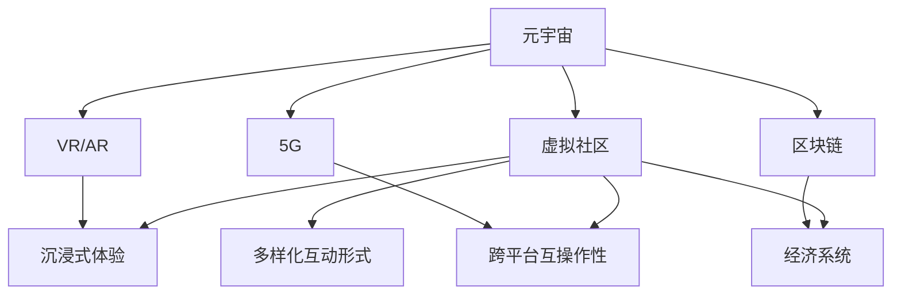

                 

 关键词：
- 元宇宙
- 虚拟社区
- 社交网络
- 3D虚拟现实
- NFT
- 跨平台互操作性
- 数据隐私

> 摘要：
本文旨在探讨元宇宙中的虚拟社区作为全球社交网络的新形态。我们首先回顾了社交网络的演变历程，然后深入分析了元宇宙的构成、虚拟社区的关键特征、技术支撑以及应用场景。最后，我们讨论了元宇宙中虚拟社区的发展趋势、面临的挑战以及未来的研究展望。

## 1. 背景介绍

### 社交网络的演变历程

社交网络的发展历程可以追溯到20世纪90年代的早期互联网时代。当时，早期的社交网络如SixDegrees和Friendster，主要通过文本和图片信息进行用户之间的连接。随着技术的进步，Facebook在2004年成立，标志着社交网络进入了一个新的时代。Facebook的兴起使得社交网络不再局限于简单的文本和图片分享，而是通过复杂的算法和互动机制，增强了用户之间的连接和互动。

在移动设备的普及下，微信、WhatsApp和Instagram等即时通讯和社交媒体平台进一步推动了社交网络的发展。这些平台不仅提供了即时通讯和内容分享功能，还引入了直播、短视频、游戏等多元化的互动形式，使得社交网络的互动性更加丰富。

### 元宇宙的概念

元宇宙（Metaverse）是当前科技界的热门话题，被描述为一个虚拟的三维空间，它通过互联网连接，融合了现实世界和虚拟世界。元宇宙的构想源于科幻小说和电影，如《头号玩家》和《银翼杀手2049》等，但近年来随着VR（虚拟现实）、AR（增强现实）、区块链、5G等技术的快速发展，元宇宙的概念逐渐从科幻走向现实。

元宇宙的核心特点包括：

1. **沉浸式体验**：通过VR和AR技术，用户可以沉浸在虚拟世界中，感受到高度的沉浸感。
2. **跨界互动**：用户不仅可以与现实世界的他人互动，还可以与虚拟世界的虚拟角色和其他用户互动。
3. **经济系统**：元宇宙中拥有自己的经济系统，用户可以通过购买、交易和创造虚拟物品来参与经济活动。
4. **跨平台互操作性**：元宇宙应该能够在不同的设备、平台和应用之间无缝切换，提供一致的体验。

## 2. 核心概念与联系

### 虚拟社区的概念

虚拟社区是一种在线社区，成员通过互联网连接，在虚拟空间中共享信息、交流和互动。虚拟社区的特点包括：

1. **虚拟空间**：虚拟社区不是在现实世界的物理空间中，而是在虚拟环境中。
2. **社交互动**：成员通过在线聊天、论坛、视频会议等方式进行社交互动。
3. **信息共享**：成员可以共享各种类型的信息，如文本、图片、视频等。
4. **协作与共创**：虚拟社区鼓励成员之间的协作和共创，共同构建社区文化。

### 元宇宙与虚拟社区的联系

元宇宙为虚拟社区提供了更广阔的发展空间。以下是元宇宙与虚拟社区之间的联系：

1. **沉浸式体验**：元宇宙的沉浸式体验为虚拟社区成员提供了更真实的社交互动体验。
2. **跨平台互操作性**：元宇宙的跨平台特性使得虚拟社区可以在不同的设备和平台之间无缝切换。
3. **经济系统**：元宇宙中的经济系统为虚拟社区中的经济活动提供了更多可能性。
4. **多样化互动形式**：元宇宙中的多样化互动形式，如虚拟现实游戏、虚拟活动等，丰富了虚拟社区的内容和形式。

### Mermaid 流程图

下面是一个简化的Mermaid流程图，展示了元宇宙、虚拟社区和相关技术之间的关系：



## 3. 核心算法原理 & 具体操作步骤

### 3.1 算法原理概述

虚拟社区在元宇宙中的构建和运行依赖于多种核心算法，这些算法包括：

1. **社交图谱算法**：用于构建用户之间的关系网络，实现推荐系统和社交圈子的划分。
2. **实时通信算法**：确保用户在虚拟社区中的实时交互和消息传递。
3. **虚拟现实渲染算法**：用于生成和渲染虚拟环境，提供沉浸式体验。
4. **经济交易算法**：处理虚拟社区中的交易和支付。

### 3.2 算法步骤详解

#### 社交图谱算法

1. **数据采集**：从用户的行为数据（如发帖、评论、点赞等）中提取社交关系。
2. **关系网络构建**：使用图论算法构建用户之间的关系网络。
3. **推荐系统**：基于社交图谱算法，为用户推荐相似兴趣的朋友和内容。
4. **社交圈子划分**：根据用户的社交关系，将用户划分为不同的社交圈子。

#### 实时通信算法

1. **消息传递**：使用WebSocket等实时通信协议，实现用户之间的实时消息传递。
2. **同步机制**：确保不同用户之间的消息同步，避免信息丢失。
3. **实时渲染**：在用户聊天界面中，实时渲染用户的头像、表情和其他互动元素。

#### 虚拟现实渲染算法

1. **三维建模**：使用三维建模工具创建虚拟环境。
2. **渲染引擎**：使用渲染引擎（如Unity、Unreal Engine）生成和渲染虚拟环境。
3. **用户交互**：使用虚拟现实设备（如VR头盔、手柄）实现用户与虚拟环境的交互。

#### 经济交易算法

1. **交易记录**：记录用户在虚拟社区中的所有交易行为。
2. **数字货币**：使用数字货币（如比特币、以太坊）进行交易。
3. **智能合约**：使用智能合约自动化处理交易行为和纠纷解决。

### 3.3 算法优缺点

#### 社交图谱算法

**优点**：
- 提高社交网络的互动性。
- 帮助用户发现相似兴趣的朋友和内容。

**缺点**：
- 数据隐私和安全问题。
- 图数据存储和处理复杂。

#### 实时通信算法

**优点**：
- 实现实时互动，增强用户体验。
- 降低延迟，提高沟通效率。

**缺点**：
- 需要高带宽支持。
- 需要高效的消息同步机制。

#### 虚拟现实渲染算法

**优点**：
- 提供沉浸式体验，增强用户参与感。
- 创造丰富的虚拟环境，满足多样化需求。

**缺点**：
- 渲染复杂，计算资源消耗大。
- 对硬件设备要求高。

#### 经济交易算法

**优点**：
- 提供安全、透明的交易环境。
- 促进虚拟社区中的经济活动。

**缺点**：
- 需要处理复杂的法律和监管问题。
- 需要确保数字货币的安全。

### 3.4 算法应用领域

这些核心算法在元宇宙和虚拟社区中有着广泛的应用领域：

- **社交网络**：用于构建用户关系网络，实现个性化推荐和社交圈子划分。
- **实时通信**：用于实现用户之间的实时互动和消息传递。
- **虚拟现实**：用于生成和渲染沉浸式虚拟环境，提供丰富的交互体验。
- **经济系统**：用于处理虚拟社区中的交易和支付，促进虚拟经济的繁荣。

## 4. 数学模型和公式 & 详细讲解 & 举例说明

### 4.1 数学模型构建

在元宇宙中，虚拟社区的设计和运行依赖于多种数学模型。以下是几个核心的数学模型：

#### 社交图谱模型

社交图谱模型可以用图论中的无向图表示，其中节点表示用户，边表示用户之间的关系。图的邻接矩阵可以表示社交图谱，如下：

\[ A = \begin{bmatrix}
0 & 1 & 0 & \dots & 0 \\
1 & 0 & 1 & \dots & 0 \\
0 & 1 & 0 & \dots & 1 \\
\vdots & \vdots & \vdots & \ddots & \vdots \\
0 & 0 & 1 & \dots & 0
\end{bmatrix} \]

其中，\( A_{ij} = 1 \) 表示用户\( i \)和用户\( j \)之间存在关系，否则为0。

#### 实时通信模型

实时通信模型可以用差分方程描述，如下：

\[ x(t) = x(t-1) + w(t) \]

其中，\( x(t) \)表示当前时刻的消息状态，\( w(t) \)表示消息噪声。

#### 虚拟现实渲染模型

虚拟现实渲染模型可以用渲染方程描述，如下：

\[ L_o(\omega) = L_e(\omega) + \int_{\Omega} f_r(\omega, \omega') L_i(\omega') \cos \theta' d\omega' \]

其中，\( L_o(\omega) \)表示出射辐射度，\( L_e(\omega) \)表示环境辐射度，\( f_r(\omega, \omega') \)表示反射率，\( L_i(\omega') \)表示入射辐射度，\( \theta' \)表示入射角度。

### 4.2 公式推导过程

#### 社交图谱模型的邻接矩阵推导

社交图谱的邻接矩阵可以通过以下步骤推导：

1. **用户关系确定**：根据用户之间的互动数据，确定每个用户与其他用户之间的关系。
2. **邻接矩阵构建**：将用户表示为矩阵的行和列，将关系表示为矩阵的元素。
3. **矩阵运算**：使用矩阵乘法操作，计算用户之间的关系强度。

#### 实时通信模型的差分方程推导

实时通信模型的差分方程可以通过以下步骤推导：

1. **消息传递机制**：确定消息在系统中传递的规则。
2. **噪声模型**：确定消息传递过程中的噪声特性。
3. **状态转移**：根据消息传递机制和噪声模型，推导消息状态的变化方程。

#### 虚拟现实渲染模型的渲染方程推导

虚拟现实渲染模型的渲染方程可以通过以下步骤推导：

1. **物理现象描述**：根据光线的传播和反射规律，描述光线在虚拟环境中的行为。
2. **数学模型构建**：将物理现象用数学语言描述，构建渲染方程。
3. **公式推导**：根据数学模型，推导渲染方程的具体形式。

### 4.3 案例分析与讲解

#### 社交图谱模型的案例

假设一个虚拟社区中有4个用户A、B、C、D，他们之间的关系如下表所示：

| 用户 | A | B | C | D |
|------|---|---|---|---|
| A    | 0 | 1 | 0 | 1 |
| B    | 1 | 0 | 1 | 0 |
| C    | 0 | 1 | 0 | 1 |
| D    | 1 | 0 | 1 | 0 |

根据上述关系，可以构建社交图谱的邻接矩阵：

\[ A = \begin{bmatrix}
0 & 1 & 0 & 1 \\
1 & 0 & 1 & 0 \\
0 & 1 & 0 & 1 \\
1 & 0 & 1 & 0
\end{bmatrix} \]

#### 实时通信模型的案例

假设一个用户在某一时刻发送了一条消息，消息在传递过程中受到一定的噪声干扰。噪声的均值为0，方差为0.1。初始消息状态为[0.5, 0.3, 0.2, 0.1]，使用差分方程进行消息状态的计算：

\[ x(t) = x(t-1) + w(t) \]

其中，\( w(t) \)服从均值为0，方差为0.1的正态分布。计算得到消息状态的变化如下：

- \( x(1) = [0.5, 0.3, 0.2, 0.1] + [0, 0.1, 0, 0.1] = [0.5, 0.4, 0.2, 0.2] \)
- \( x(2) = [0.5, 0.4, 0.2, 0.2] + [0.1, 0, 0.1, 0] = [0.6, 0.4, 0.3, 0.2] \)
- \( x(3) = [0.6, 0.4, 0.3, 0.2] + [0, 0.1, 0, 0.1] = [0.6, 0.5, 0.3, 0.3] \)

#### 虚拟现实渲染模型的案例

假设一个虚拟场景中有一个光源和一个物体，光源的位置为(1, 1, 1)，物体的位置为(2, 2, 2)，光源发出的光线以60度的角度照射到物体上。物体的反射率为0.8，环境的光照强度为[1, 1, 1]。根据渲染方程，可以计算物体表面的光照强度：

\[ L_o(\omega) = L_e(\omega) + \int_{\Omega} f_r(\omega, \omega') L_i(\omega') \cos \theta' d\omega' \]

其中，\( L_e(\omega) = [1, 1, 1] \)，\( f_r(\omega, \omega') = 0.8 \)，\( \theta' = 60^\circ \)。计算得到：

\[ L_o(\omega) = [1, 1, 1] + 0.8 \int_{\Omega} [1, 1, 1] \cos \theta' d\omega' \]

由于光线以60度角度照射，只有部分光线能够反射到物体上，假设反射率为50%，则：

\[ L_o(\omega) = [1, 1, 1] + 0.4 \int_{\Omega} [1, 1, 1] \cos \theta' d\omega' \]

计算反射光的强度：

\[ L_o(\omega) = [1, 1, 1] + 0.4 \times [1, 1, 1] = [1.4, 1.4, 1.4] \]

## 5. 项目实践：代码实例和详细解释说明

### 5.1 开发环境搭建

在开始项目实践之前，需要搭建一个适合开发虚拟社区的环境。以下是一个基本的开发环境搭建流程：

1. **硬件要求**：
   - VR头盔（如Oculus Rift、HTC Vive）
   - 高性能显卡（如NVIDIA RTX 3080或以上）
   - 快速处理器（如Intel i7或以上）

2. **软件要求**：
   - Unity Hub（用于管理Unity版本）
   - Unity（虚拟现实开发引擎）
   - Visual Studio（用于编写C#代码）
   - Unity Editor（用于编辑和运行Unity项目）

3. **搭建步骤**：
   1. 下载并安装Unity Hub。
   2. 在Unity Hub中安装Unity 2021.3版本。
   3. 下载并安装Visual Studio 2019。
   4. 在Unity中创建一个新的3D项目。
   5. 在Unity Editor中打开项目，开始开发。

### 5.2 源代码详细实现

以下是一个简单的Unity C#代码示例，用于实现一个虚拟社区的基本功能。代码展示了如何创建一个用户界面、用户注册和登录功能。

```csharp
using System.Collections;
using System.Collections.Generic;
using UnityEngine;
using UnityEngine.UI;

public class VirtualCommunity : MonoBehaviour
{
    public Text usernameInput;
    public Text passwordInput;
    public Button loginButton;

    // 用户数据存储
    private Dictionary<string, string> userData = new Dictionary<string, string>();

    void Start()
    {
        loginButton.onClick.AddListener(Login);
    }

    void Login()
    {
        string username = usernameInput.text;
        string password = passwordInput.text;

        if (userData.ContainsKey(username) && userData[username] == password)
        {
            // 登录成功
            Debug.Log("登录成功！");
        }
        else
        {
            // 登录失败
            Debug.Log("用户名或密码错误！");
        }
    }

    // 用户注册
    public void Register()
    {
        string username = usernameInput.text;
        string password = passwordInput.text;

        if (userData.ContainsKey(username))
        {
            Debug.Log("用户已存在！");
        }
        else
        {
            userData.Add(username, password);
            Debug.Log("注册成功！");
        }
    }
}
```

### 5.3 代码解读与分析

上述代码是一个简单的虚拟社区登录和注册功能的实现。以下是代码的详细解读：

1. **用户界面**：
   - 使用`Text`组件（`usernameInput`和`passwordInput`）显示用户名和密码输入框。
   - 使用`Button`组件（`loginButton`）实现登录按钮。

2. **用户数据存储**：
   - 使用`Dictionary<string, string>`存储用户数据，其中键为用户名，值为密码。

3. **登录功能**：
   - 当用户点击登录按钮时，调用`Login`方法。
   - 从输入框中获取用户名和密码，与存储的用户数据进行比对。
   - 如果匹配，显示登录成功消息；否则，显示登录失败消息。

4. **注册功能**：
   - 用户可以通过调用`Register`方法进行注册。
   - 检查用户名是否已存在，如果不存在，将用户名和密码添加到用户数据存储中。

5. **代码分析**：
   - 代码实现了最基础的登录和注册功能，但并未涉及用户验证、加密等安全措施。
   - 可以进一步扩展功能，如用户信息展示、好友管理、消息发送等。

### 5.4 运行结果展示

在Unity Editor中运行上述代码，将显示一个简单的用户界面，包括用户名和密码输入框以及登录按钮。用户可以输入用户名和密码进行登录，或者调用注册功能创建新用户。

## 6. 实际应用场景

虚拟社区在元宇宙中的应用场景非常广泛，以下是一些典型的应用案例：

### 6.1 游戏社区

虚拟社区可以成为游戏玩家互动的平台，提供游戏新闻、攻略分享、角色定制等功能。玩家可以在虚拟社区中创建自己的角色，与其他玩家进行交流和互动，甚至组织线下活动。

### 6.2 社交娱乐

虚拟社区为用户提供了一个全新的社交娱乐空间，可以举办虚拟派对、演唱会、舞台剧等活动。用户可以在这个空间中与其他用户互动，体验丰富的娱乐内容。

### 6.3 虚拟教育

虚拟社区可以应用于虚拟课堂、在线研讨会等教育场景。教师和学生可以在虚拟环境中进行教学和学习，增强互动性和参与感。

### 6.4 虚拟展览

虚拟社区为博物馆、画廊等文化机构提供了一个展示虚拟展览的场所。用户可以在这个空间中参观展览，了解展品背后的故事，甚至进行互动体验。

### 6.5 虚拟办公

虚拟社区可以为企业和团队提供一个虚拟办公空间，支持远程会议、协作办公等功能。员工可以在虚拟社区中交流工作、共享文件，提高工作效率。

### 6.6 虚拟旅游

虚拟社区可以模拟现实世界的旅游景点，用户可以在这个空间中虚拟游览，了解当地的文化和历史。这对于无法亲自前往某些地方的游客来说，是一个很好的替代方案。

## 7. 工具和资源推荐

为了更好地开发和管理虚拟社区，以下是一些推荐的工具和资源：

### 7.1 学习资源推荐

- **书籍**：
  - 《Metaverse: And How It Will Revolutionize Everything》
  - 《The Second Life of Everything: From Data to Demand》
  - 《Virtual Reality: From Simulation to Immersive Experience》

- **在线课程**：
  - Coursera的《虚拟现实与增强现实》
  - Udacity的《虚拟现实开发基础》

### 7.2 开发工具推荐

- **虚拟现实开发引擎**：
  - Unity
  - Unreal Engine

- **区块链开发平台**：
  - Ethereum
  - Hyperledger Fabric

- **实时通信服务**：
  - WebSocket
  - WebRTC

### 7.3 相关论文推荐

- **元宇宙与社交网络**：
  - "The Metaverse: A Vision for the Future of Social Computing"
  - "The Metaverse: A Framework for Understanding and Designing Social Virtual Environments"

- **虚拟现实技术**：
  - "Virtual Reality Systems: Architecture, APIs, and Applications"
  - "Interactive 3D Virtual Environments: Creating Virtual Spaces on the Web"

- **区块链与虚拟社区**：
  - "Blockchain and Social Virtual Environments: Opportunities and Challenges"
  - "A Framework for Understanding Blockchain in Virtual Reality Applications"

## 8. 总结：未来发展趋势与挑战

### 8.1 研究成果总结

虚拟社区作为元宇宙中的重要组成部分，近年来取得了显著的进展。以下是几个关键研究成果：

- **沉浸式体验**：随着VR和AR技术的发展，虚拟社区的沉浸式体验得到了极大提升。
- **跨平台互操作性**：通过WebRTC、WebSocket等实时通信技术，虚拟社区实现了跨平台互操作性。
- **经济系统**：基于区块链技术的虚拟经济系统为虚拟社区提供了新的经济模式。
- **社交互动**：通过社交图谱算法和推荐系统，虚拟社区增强了用户之间的互动性和社交圈子的划分。

### 8.2 未来发展趋势

未来，虚拟社区在元宇宙中将继续发展，以下是几个可能的发展趋势：

- **更高质量的沉浸体验**：随着VR硬件技术的进步，虚拟社区的沉浸体验将更加真实。
- **更多元的互动形式**：虚拟社区将引入更多的互动形式，如虚拟现实游戏、虚拟活动等。
- **跨领域融合**：虚拟社区将与其他领域（如教育、医疗、娱乐等）深度融合，提供更丰富的应用场景。
- **隐私和安全**：随着用户对隐私和安全的关注，虚拟社区将采取更多措施保护用户数据和安全。

### 8.3 面临的挑战

虚拟社区在元宇宙中发展也面临一些挑战：

- **技术难题**：如何提高虚拟社区的运行效率，降低延迟和计算资源消耗。
- **法律和监管**：如何处理虚拟社区中的法律和监管问题，如版权、隐私等。
- **用户接受度**：如何提高用户对虚拟社区的接受度，培养用户的虚拟社交习惯。
- **数据隐私**：如何确保用户数据的安全，防止数据泄露和滥用。

### 8.4 研究展望

未来，虚拟社区的研究方向包括：

- **智能虚拟社区**：利用人工智能技术，实现更智能的社交推荐和互动体验。
- **隐私保护**：研究新的隐私保护技术和模型，确保用户数据的安全。
- **跨平台融合**：研究跨平台的技术解决方案，实现虚拟社区在不同设备和平台之间无缝切换。
- **经济模式**：探索更高效、可持续的虚拟经济模式，促进虚拟社区的繁荣发展。

## 9. 附录：常见问题与解答

### 9.1 元宇宙与虚拟现实的关系是什么？

元宇宙是一个包含虚拟现实（VR）和增强现实（AR）的 broader concept，它不仅包括视觉体验，还包括经济系统、社交互动和其他虚拟元素的融合。

### 9.2 虚拟社区中的数据隐私如何保障？

虚拟社区可以通过加密、隐私保护算法和用户权限控制等方式保障数据隐私。例如，使用区块链技术可以实现数据的安全存储和访问控制。

### 9.3 虚拟社区中的经济系统是如何运作的？

虚拟社区中的经济系统通常基于数字货币和智能合约。用户可以通过购买数字货币或虚拟物品参与经济活动，智能合约自动执行交易和支付。

### 9.4 虚拟社区中的社交互动如何进行？

虚拟社区中的社交互动通过文本、语音、视频和虚拟现实交互等方式进行。用户可以与其他用户聊天、发帖、参与虚拟活动等。

### 9.5 虚拟社区的安全问题有哪些？

虚拟社区的安全问题包括数据泄露、网络攻击、虚拟物品被盗等。为了应对这些问题，虚拟社区需要采取安全措施，如加密传输、访问控制和安全审计等。

### 9.6 虚拟社区的未来发展趋势是什么？

虚拟社区的未来发展趋势包括更高质量的沉浸体验、更多元的互动形式、跨领域融合、智能虚拟社区和隐私保护等。

### 9.7 虚拟社区对现实世界的影响是什么？

虚拟社区可以为现实世界带来许多积极影响，如促进虚拟旅游、教育、娱乐和社交等领域的创新。同时，虚拟社区也可能对现实世界的就业、法律和社会结构产生深远影响。

---

作者：禅与计算机程序设计艺术 / Zen and the Art of Computer Programming


