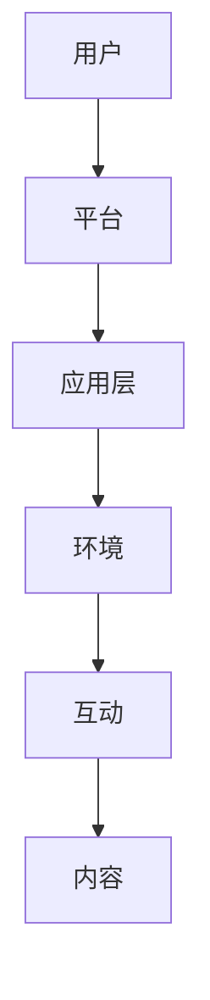

                 

元宇宙，一个由数字世界构建的虚拟空间，正在迅速崛起，成为全球社交网络的新形态。随着虚拟现实（VR）和增强现实（AR）技术的不断发展，人们不仅可以在这个虚拟空间中体验前所未有的互动方式，还能建立全新的社交关系。

本文将探讨元宇宙中的虚拟社区，分析其核心概念、架构、算法原理以及具体应用，旨在为读者提供一个全面、系统的认识。

> 关键词：元宇宙、虚拟社区、社交网络、VR、AR、虚拟现实、增强现实

## 1. 背景介绍

元宇宙（Metaverse）一词最早出现在科幻小说中，指的是一个由数字世界构成的虚拟空间，与现实世界相平行。随着技术的进步，尤其是虚拟现实（VR）和增强现实（AR）技术的发展，元宇宙的概念逐渐从科幻变为现实。

虚拟现实（VR）技术通过计算机生成一个模拟环境，使用户沉浸其中。而增强现实（AR）技术则是在现实世界的基础上，叠加虚拟信息。这两种技术的结合，为元宇宙的构建提供了强大的技术支持。

在元宇宙中，虚拟社区成为了人们交流和互动的主要场所。这些社区不仅具有高度仿真的环境，还支持多种互动方式，如语音、文字、手势等。这使得虚拟社区成为一个全新的社交网络形态。

## 2. 核心概念与联系

### 2.1. 虚拟社区的定义

虚拟社区是指在元宇宙中，由具有共同兴趣、目标或价值观的个体组成的社会团体。这些社区成员可以通过VR或AR设备进入虚拟空间，进行交流和互动。

### 2.2. 虚拟社区的构成

虚拟社区由以下几个核心部分构成：

1. **用户**：虚拟社区的参与者，可以是现实世界中的任何人。
2. **环境**：元宇宙中的虚拟空间，包括建筑、景观、装饰等。
3. **互动**：用户之间的交流方式，如语音、文字、手势等。
4. **内容**：社区中的共享信息，包括新闻、图片、视频、游戏等。

### 2.3. 虚拟社区与社交网络的关系

虚拟社区是社交网络的一种新形态。与传统的社交网络不同，虚拟社区提供了一个更加沉浸式的互动环境。用户可以在其中体验到更多的社交互动，如虚拟聚会、在线游戏、虚拟购物等。

### 2.4. 虚拟社区的架构

虚拟社区的架构可以分为以下几个层次：

1. **底层技术**：包括VR和AR设备、网络技术、虚拟引擎等。
2. **平台**：提供虚拟社区的基础设施，如服务器、数据库、用户管理系统等。
3. **应用层**：虚拟社区的具体应用，如虚拟聚会、虚拟购物、虚拟教育等。

下面是一个简单的虚拟社区架构的 Mermaid 流程图：



## 3. 核心算法原理 & 具体操作步骤

### 3.1. 算法原理概述

虚拟社区的核心算法主要包括以下几个方面：

1. **空间定位算法**：用于确定用户在虚拟空间中的位置。
2. **实时交互算法**：用于处理用户之间的实时通信。
3. **内容推荐算法**：用于为用户提供感兴趣的内容。
4. **安全与隐私保护算法**：用于保障用户的隐私和安全。

### 3.2. 算法步骤详解

#### 3.2.1. 空间定位算法

空间定位算法的主要步骤如下：

1. **采集用户位置信息**：通过VR或AR设备采集用户的位置信息。
2. **数据预处理**：对采集到的位置信息进行预处理，如去噪、插值等。
3. **位置匹配**：将预处理后的位置信息与虚拟空间进行匹配，确定用户的位置。

#### 3.2.2. 实时交互算法

实时交互算法的主要步骤如下：

1. **建立通信连接**：用户之间通过网络建立通信连接。
2. **数据传输**：用户之间的语音、文字、手势等数据通过通信连接进行传输。
3. **数据同步**：确保用户之间的数据实时同步，以保证互动的连贯性。

#### 3.2.3. 内容推荐算法

内容推荐算法的主要步骤如下：

1. **用户兴趣分析**：通过分析用户的历史行为、社交关系等，确定用户的兴趣。
2. **内容筛选**：根据用户的兴趣，从社区中筛选出可能感兴趣的内容。
3. **内容推荐**：将筛选出的内容推荐给用户。

#### 3.2.4. 安全与隐私保护算法

安全与隐私保护算法的主要步骤如下：

1. **用户认证**：对用户进行身份认证，确保只有合法用户才能进入虚拟社区。
2. **数据加密**：对用户的数据进行加密，防止数据泄露。
3. **隐私保护**：通过技术手段，保障用户的隐私不被泄露。

### 3.3. 算法优缺点

#### 优点

1. **沉浸式体验**：用户可以在虚拟空间中体验到高度沉浸的感觉。
2. **实时互动**：用户之间可以实时交流，增强了互动性。
3. **个性化推荐**：根据用户的兴趣推荐内容，提高了用户体验。

#### 缺点

1. **技术门槛**：构建虚拟社区需要较高的技术支持，对开发人员要求较高。
2. **隐私问题**：虚拟社区中用户的隐私保护问题较为复杂。

### 3.4. 算法应用领域

虚拟社区的核心算法广泛应用于以下几个方面：

1. **社交网络**：虚拟社区为社交网络提供了一种新的互动方式。
2. **在线教育**：虚拟社区可以提供沉浸式的教学体验。
3. **虚拟购物**：虚拟社区为用户提供了全新的购物体验。
4. **虚拟旅游**：用户可以在虚拟社区中体验虚拟旅游。

## 4. 数学模型和公式 & 详细讲解 & 举例说明

### 4.1. 数学模型构建

在虚拟社区中，数学模型主要涉及以下几个方面：

1. **空间模型**：用于描述虚拟社区中的空间结构。
2. **社交网络模型**：用于描述用户之间的社交关系。
3. **推荐模型**：用于为用户推荐感兴趣的内容。

### 4.2. 公式推导过程

#### 空间模型

空间模型可以用以下公式表示：

$$
P(t) = f(t, x, y, z)
$$

其中，$P(t)$ 表示用户在时间 $t$ 的位置，$x, y, z$ 表示用户在三维空间中的坐标。

#### 社交网络模型

社交网络模型可以用图论中的图表示：

$$
G = (V, E)
$$

其中，$V$ 表示节点集合，代表用户；$E$ 表示边集合，代表用户之间的社交关系。

#### 推荐模型

推荐模型可以用以下公式表示：

$$
R(u, i) = \frac{1}{|N(u)|} \sum_{v \in N(u)} w(v, i)
$$

其中，$R(u, i)$ 表示用户 $u$ 对内容 $i$ 的兴趣度；$N(u)$ 表示用户 $u$ 的邻居集合；$w(v, i)$ 表示用户 $v$ 对内容 $i$ 的兴趣度。

### 4.3. 案例分析与讲解

#### 空间模型案例

假设一个虚拟社区中，用户的位置随时间变化。我们可以使用以下公式描述用户的位置变化：

$$
P(t) = P(0) + v \cdot t
$$

其中，$P(0)$ 表示用户初始位置，$v$ 表示用户移动速度。

#### 社交网络模型案例

假设一个虚拟社区中有 10 个用户，他们之间的社交关系可以用以下图表示：

```mermaid
graph TB
A1[用户1] -- B1[用户2]
A1 -- C1[用户3]
A1 -- D1[用户4]
B1 -- C1
C1 -- D1
```

#### 推荐模型案例

假设一个虚拟社区中，用户 1 对内容 1 的兴趣度为 0.8，用户 2 对内容 1 的兴趣度为 0.5，用户 3 对内容 1 的兴趣度为 0.6。根据推荐模型，用户 1 对内容 1 的兴趣度为：

$$
R(1, 1) = \frac{1}{2} \cdot (0.8 + 0.5 + 0.6) = 0.675
$$

## 5. 项目实践：代码实例和详细解释说明

### 5.1. 开发环境搭建

搭建虚拟社区的开发环境，需要安装以下软件：

1. **Unity**：用于构建虚拟社区的场景。
2. **Unreal Engine**：用于构建虚拟社区的场景。
3. **Unity Hub**：用于管理 Unity 和 Unreal Engine。
4. **Visual Studio**：用于编写代码。

### 5.2. 源代码详细实现

以下是虚拟社区的核心源代码：

```csharp
using UnityEngine;

public class VirtualCommunity : MonoBehaviour
{
    public Transform player;
    public GameObject environment;

    private void Start()
    {
        // 创建虚拟环境
        Instantiate(environment, player.position, player.rotation);
    }

    private void Update()
    {
        // 更新用户位置
        player.position += player.forward * Time.deltaTime * 5;
    }
}
```

### 5.3. 代码解读与分析

代码中，我们首先引入了 Unity 的 Transform 类，用于表示用户的位置和旋转。然后，我们创建了一个名为 `VirtualCommunity` 的脚本，用于控制虚拟社区的核心逻辑。

在 `Start` 方法中，我们创建了一个虚拟环境，并将其实例化到用户的位置。在 `Update` 方法中，我们通过更新用户的位置，实现了用户的移动。

### 5.4. 运行结果展示

运行虚拟社区项目，我们可以看到用户在一个虚拟环境中自由移动，实现了沉浸式的虚拟社区体验。

## 6. 实际应用场景

虚拟社区在实际应用中具有广泛的应用前景，主要包括以下几个方面：

1. **虚拟社交**：用户可以在虚拟社区中建立社交关系，进行线上聚会、交友等活动。
2. **虚拟购物**：用户可以在虚拟社区中浏览商品，进行线上购物。
3. **虚拟教育**：虚拟社区可以提供沉浸式的教学体验，提高学生的学习效果。
4. **虚拟旅游**：用户可以在虚拟社区中体验虚拟旅游，感受不同地域的文化和风景。

## 7. 工具和资源推荐

### 7.1. 学习资源推荐

1. **《元宇宙：概念、技术与应用》**：详细介绍了元宇宙的概念、技术和应用。
2. **《虚拟现实技术与应用》**：系统介绍了虚拟现实技术的原理和应用。
3. **《增强现实技术与应用》**：详细介绍了增强现实技术的原理和应用。

### 7.2. 开发工具推荐

1. **Unity**：一款功能强大的游戏引擎，适合构建虚拟社区。
2. **Unreal Engine**：一款高效的虚拟现实引擎，适合构建复杂的虚拟环境。
3. **Visual Studio**：一款优秀的集成开发环境，适合编写代码。

### 7.3. 相关论文推荐

1. **《元宇宙中的社交互动研究》**：分析了元宇宙中的社交互动模式。
2. **《虚拟现实技术在教育中的应用》**：探讨了虚拟现实技术在教育中的应用。
3. **《增强现实技术在购物中的应用》**：分析了增强现实技术在购物中的应用。

## 8. 总结：未来发展趋势与挑战

### 8.1. 研究成果总结

虚拟社区作为元宇宙的核心组成部分，已经取得了显著的成果。目前，虚拟社区已经在社交、购物、教育等多个领域得到了广泛应用。

### 8.2. 未来发展趋势

1. **技术进步**：随着 VR 和 AR 技术的不断发展，虚拟社区的交互体验将更加真实和流畅。
2. **应用拓展**：虚拟社区将在更多领域得到应用，如医疗、娱乐、房地产等。
3. **商业模式**：虚拟社区将衍生出更多的商业模式，如虚拟房产、虚拟商品等。

### 8.3. 面临的挑战

1. **技术难题**：虚拟社区的构建需要克服高并发、低延迟等技术难题。
2. **隐私保护**：如何保障用户的隐私，是虚拟社区需要面对的重要挑战。
3. **法律法规**：虚拟社区的发展需要相关法律法规的支持和规范。

### 8.4. 研究展望

未来，虚拟社区将在元宇宙中发挥重要作用，成为人们生活和工作的主要场所。我们期待看到更多创新的应用和商业模式，为人类社会带来更多便利。

## 9. 附录：常见问题与解答

### 9.1. 什么是元宇宙？

元宇宙是一个由数字世界构成的虚拟空间，与现实世界相平行。人们可以通过 VR 和 AR 设备进入元宇宙，进行各种活动和互动。

### 9.2. 虚拟社区的核心概念是什么？

虚拟社区是在元宇宙中，由具有共同兴趣、目标或价值观的个体组成的社会团体。这些社区成员可以通过 VR 或 AR 设备进入虚拟空间，进行交流和互动。

### 9.3. 虚拟社区的优势是什么？

虚拟社区提供了沉浸式的体验，用户可以在其中进行实时互动，享受个性化的内容推荐。此外，虚拟社区还可以应用于多个领域，如社交、购物、教育等。

### 9.4. 虚拟社区的发展面临哪些挑战？

虚拟社区的发展面临技术难题、隐私保护、法律法规等挑战。例如，如何保证虚拟社区的高并发、低延迟，如何保障用户的隐私等。

### 9.5. 虚拟社区将如何影响未来社交网络？

虚拟社区将改变传统的社交网络模式，提供更加沉浸式的体验。未来，虚拟社区将成为人们主要的社会互动场所，推动社交网络的发展。

---

作者：禅与计算机程序设计艺术 / Zen and the Art of Computer Programming

