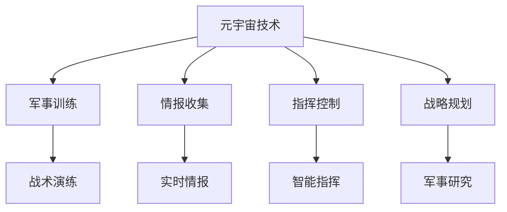

                 

### 1. 背景介绍

随着科技的飞速发展，特别是互联网、云计算、大数据、人工智能等技术的深度融合，虚拟现实（VR）和增强现实（AR）技术逐渐走向成熟。与此同时，全球范围内的军事变革也正悄然展开。虚拟现实和增强现实技术为军事训练和作战模拟提供了全新的可能性，元宇宙应运而生。

元宇宙（Metaverse）是一个由虚拟世界构成的网络空间，用户可以通过虚拟角色在其中进行互动和交流。它不仅是一个虚拟的社交平台，更是一个高度仿真、高度交互的数字环境。在军事领域，元宇宙被视为数字化战争的演练场，其应用前景广阔。

近年来，各国军队纷纷开始将元宇宙技术应用于军事训练和作战模拟。例如，美国国防部已经推出了名为“数字战场”的计划，旨在通过元宇宙技术构建一个实时的、高度仿真的战场环境，用于模拟各种作战场景和战术演练。中国也在积极推进元宇宙军事应用研究，力求在未来的军事竞争中占据优势。

元宇宙在军事领域的应用不仅限于训练和模拟，还可以用于情报收集、指挥控制、战略规划等方面。通过元宇宙，军事人员可以更加直观地了解战场态势，制定更加科学的作战计划，提高军事决策的效率。

本文将围绕元宇宙军事应用展开讨论，首先介绍元宇宙的核心概念和关键技术，然后分析其在军事训练、情报收集、指挥控制等方面的应用，最后探讨元宇宙军事应用的挑战和未来发展趋势。

### 2. 核心概念与联系

#### 2.1 元宇宙定义

元宇宙是一个虚拟的三维空间，用户可以通过虚拟角色在其中进行互动和交流。它不仅仅是一个虚拟的社交平台，更是一个高度仿真、高度交互的数字环境。在元宇宙中，用户可以体验到现实世界中无法实现的场景和活动。

元宇宙的核心特点是高度仿真和高度交互。高度仿真意味着元宇宙中的虚拟世界可以与现实世界高度相似，甚至可以模拟现实世界的各种环境和条件。高度交互则意味着用户可以在元宇宙中进行各种活动，如游戏、社交、工作等，这些活动不仅限于虚拟角色的互动，还包括与现实世界的实时交互。

#### 2.2 元宇宙的关键技术

元宇宙的实现依赖于多种先进技术的支持，其中主要包括虚拟现实（VR）、增强现实（AR）、人工智能（AI）、区块链等。

1. **虚拟现实（VR）**：虚拟现实技术通过模拟现实世界中的三维空间，使用户能够在虚拟环境中获得沉浸式的体验。在军事领域，VR技术可以用于模拟战场环境，帮助军事人员训练和提高作战能力。

2. **增强现实（AR）**：增强现实技术通过在现实世界中叠加虚拟信息，使用户能够看到并互动虚拟物体。在军事领域，AR技术可以用于战场情报收集、指挥控制等，提供实时、直观的战场信息。

3. **人工智能（AI）**：人工智能技术可以用于元宇宙中的智能推荐、智能对话、智能决策等。在军事领域，AI技术可以用于自动化决策、智能化指挥等，提高军事行动的效率。

4. **区块链**：区块链技术可以用于元宇宙中的数字身份认证、数据存储和交易等。在军事领域，区块链技术可以用于确保战场信息的真实性和安全性。

#### 2.3 元宇宙与军事的联系

元宇宙与军事有着紧密的联系。首先，元宇宙为军事训练和作战模拟提供了全新的可能性。通过元宇宙，军事人员可以模拟各种作战场景，进行战术演练，提高作战能力。其次，元宇宙可以用于情报收集和指挥控制。通过元宇宙，军事人员可以实时获取战场信息，进行指挥决策，提高军事行动的效率。此外，元宇宙还可以用于战略规划和军事研究，为军事决策提供科学依据。

为了更好地展示元宇宙与军事的联系，我们使用Mermaid流程图来描述元宇宙在军事领域的主要应用。



通过上述流程图，我们可以清晰地看到元宇宙技术如何应用于军事领域，以及各个应用模块之间的联系。

### 3. 核心算法原理 & 具体操作步骤

#### 3.1 算法原理概述

在元宇宙军事应用中，核心算法原理主要包括虚拟现实（VR）算法、增强现实（AR）算法、人工智能（AI）算法和区块链算法。这些算法共同构成了元宇宙的基础框架，确保了元宇宙的高度仿真、高度交互和高度安全。

1. **虚拟现实（VR）算法**：虚拟现实算法主要涉及场景生成、物体渲染和用户交互等方面。通过场景生成算法，元宇宙可以创建出与现实世界高度相似的虚拟环境。物体渲染算法则负责将虚拟物体以逼真的形式呈现给用户。用户交互算法则实现了用户与虚拟环境的互动。

2. **增强现实（AR）算法**：增强现实算法主要涉及图像识别、信息叠加和用户交互等方面。通过图像识别算法，AR系统可以识别并跟踪现实世界中的物体，将其作为叠加信息的基础。信息叠加算法则将虚拟信息以透明或叠加的方式呈现在用户视野中。用户交互算法则实现了用户与虚拟信息的互动。

3. **人工智能（AI）算法**：人工智能算法主要涉及智能推荐、智能对话和智能决策等方面。通过智能推荐算法，元宇宙可以基于用户的行为和偏好提供个性化推荐。智能对话算法则实现了用户与虚拟角色的自然语言交互。智能决策算法则用于辅助军事人员做出科学的决策。

4. **区块链算法**：区块链算法主要涉及数字身份认证、数据存储和交易等方面。通过数字身份认证算法，元宇宙可以确保用户的身份真实有效。数据存储算法则负责将战场信息存储在区块链上，确保其真实性和安全性。交易算法则实现了战场信息的实时交易和流转。

#### 3.2 算法步骤详解

1. **虚拟现实（VR）算法步骤**：

   - **场景生成**：通过场景生成算法，根据用户需求创建虚拟环境。场景生成算法包括地形生成、建筑物生成、植被生成等。

   - **物体渲染**：通过物体渲染算法，将虚拟物体以逼真的形式呈现给用户。物体渲染算法包括纹理映射、光照计算、阴影生成等。

   - **用户交互**：通过用户交互算法，实现用户与虚拟环境的互动。用户交互算法包括手势识别、语音识别、触觉反馈等。

2. **增强现实（AR）算法步骤**：

   - **图像识别**：通过图像识别算法，识别并跟踪现实世界中的物体。

   - **信息叠加**：通过信息叠加算法，将虚拟信息以透明或叠加的方式呈现在用户视野中。

   - **用户交互**：通过用户交互算法，实现用户与虚拟信息的互动。

3. **人工智能（AI）算法步骤**：

   - **智能推荐**：通过智能推荐算法，根据用户的行为和偏好提供个性化推荐。

   - **智能对话**：通过智能对话算法，实现用户与虚拟角色的自然语言交互。

   - **智能决策**：通过智能决策算法，辅助军事人员做出科学的决策。

4. **区块链算法步骤**：

   - **数字身份认证**：通过数字身份认证算法，确保用户的身份真实有效。

   - **数据存储**：通过数据存储算法，将战场信息存储在区块链上，确保其真实性和安全性。

   - **交易**：通过交易算法，实现战场信息的实时交易和流转。

#### 3.3 算法优缺点

1. **虚拟现实（VR）算法**：

   - **优点**：高度仿真，提供沉浸式体验，有助于军事训练和作战模拟。

   - **缺点**：设备成本高，对环境要求较高，不适合大规模普及。

2. **增强现实（AR）算法**：

   - **优点**：信息叠加直观，实时性强，有助于情报收集和指挥控制。

   - **缺点**：图像识别精度较低，对硬件要求较高，用户体验有限。

3. **人工智能（AI）算法**：

   - **优点**：智能化高，可辅助决策，提高军事行动效率。

   - **缺点**：对数据依赖性强，算法模型复杂，安全风险较大。

4. **区块链算法**：

   - **优点**：数据安全性高，可确保战场信息真实性和完整性。

   - **缺点**：交易速度较慢，对硬件和网络要求较高。

#### 3.4 算法应用领域

1. **虚拟现实（VR）算法**：

   - **应用领域**：军事训练、作战模拟、游戏开发等。

   - **案例**：美国军队的“虚拟战场”项目，通过VR技术模拟战场环境，提高军事人员的作战能力。

2. **增强现实（AR）算法**：

   - **应用领域**：情报收集、指挥控制、医疗辅助等。

   - **案例**：美国海军的“增强现实地图”项目，通过AR技术提供实时战场信息，辅助指挥决策。

3. **人工智能（AI）算法**：

   - **应用领域**：智能推荐、智能对话、智能决策等。

   - **案例**：美国空军的“智能作战指挥系统”项目，通过AI技术辅助军事人员做出快速、科学的决策。

4. **区块链算法**：

   - **应用领域**：数字身份认证、数据存储、交易等。

   - **案例**：瑞士军队的“区块链战场数据系统”项目，通过区块链技术确保战场信息的真实性和安全性。

### 4. 数学模型和公式 & 详细讲解 & 举例说明

在元宇宙军事应用中，数学模型和公式扮演着至关重要的角色。这些模型和公式不仅用于描述元宇宙的物理现象和算法行为，还为军事决策提供了科学依据。本节将详细介绍元宇宙军事应用中的几个核心数学模型和公式，并进行详细讲解和举例说明。

#### 4.1 数学模型构建

1. **虚拟现实场景生成模型**：

   虚拟现实场景生成模型用于创建与现实世界高度相似的虚拟环境。其主要内容包括地形生成、建筑物生成和植被生成等。地形生成模型可以基于三维地形数据，使用几何建模算法生成地形。建筑物生成模型可以基于建筑物三维模型库，使用随机采样算法生成建筑物。植被生成模型可以基于植被纹理和生长规律，使用空间分布算法生成植被。

   数学公式：

   $$ T(x, y, z) = f(x, y, z) + \sigma \cdot g(x, y, z) $$

   其中，$T(x, y, z)$表示地形高度函数，$f(x, y, z)$表示基本地形函数，$g(x, y, z)$表示地形噪声函数，$\sigma$表示地形噪声强度。

2. **增强现实信息叠加模型**：

   增强现实信息叠加模型用于将虚拟信息以透明或叠加的方式呈现在用户视野中。其主要内容包括图像识别、信息叠加和用户交互等。图像识别模型可以基于卷积神经网络（CNN）实现，用于识别并跟踪现实世界中的物体。信息叠加模型可以基于透视投影和遮挡处理算法，实现虚拟信息与真实环境的融合。

   数学公式：

   $$ I'(x, y) = I(x, y) \cdot (1 - A(x, y)) + V(x, y) \cdot A(x, y) $$

   其中，$I(x, y)$表示真实环境图像，$V(x, y)$表示虚拟信息图像，$A(x, y)$表示透明度函数。

3. **人工智能智能决策模型**：

   智能决策模型用于辅助军事人员做出科学决策。其主要内容包括数据采集、特征提取、模型训练和决策生成等。数据采集模型可以基于传感器技术和数据挖掘算法，收集战场信息。特征提取模型可以基于统计分析和机器学习算法，提取关键特征。模型训练模型可以基于深度学习和强化学习算法，训练决策模型。决策生成模型可以基于决策树、支持向量机等算法，生成决策结果。

   数学公式：

   $$ D = f(\text{特征向量}) $$

   其中，$D$表示决策结果，$f$表示决策函数。

4. **区块链数据安全模型**：

   区块链数据安全模型用于确保战场信息的安全性和完整性。其主要内容包括数字身份认证、数据存储和交易等。数字身份认证模型可以基于密码学算法，实现用户的身份认证。数据存储模型可以基于分布式存储和加密算法，确保数据的真实性和完整性。交易模型可以基于智能合约和加密算法，实现数据的实时交易和流转。

   数学公式：

   $$ P = k \cdot A \cdot R $$

   其中，$P$表示数据安全性，$k$表示安全系数，$A$表示数据加密算法，$R$表示数据验证算法。

#### 4.2 公式推导过程

1. **虚拟现实场景生成模型推导**：

   地形生成模型的基本地形函数$f(x, y, z)$可以基于泰森多边形算法生成，其公式如下：

   $$ f(x, y, z) = \sum_{i=1}^{n} w_i \cdot h_i $$

   其中，$w_i$表示权重，$h_i$表示高度值。

   地形噪声函数$g(x, y, z)$可以基于Perlin噪声算法生成，其公式如下：

   $$ g(x, y, z) = \sum_{i=1}^{m} p_i \cdot noise(i) $$

   其中，$p_i$表示权重，$noise(i)$表示噪声值。

   综合上述两个函数，可以得到地形高度函数$T(x, y, z)$。

2. **增强现实信息叠加模型推导**：

   透明度函数$A(x, y)$可以基于图像边缘检测算法生成，其公式如下：

   $$ A(x, y) = \frac{|\nabla I(x, y)|}{\max(\nabla I(x, y))} $$

   其中，$\nabla I(x, y)$表示图像梯度。

   信息叠加公式可以基于线性插值算法推导，其公式如下：

   $$ I'(x, y) = I(x, y) + \alpha \cdot (V(x, y) - I(x, y)) $$

   其中，$\alpha$表示透明度系数。

3. **人工智能智能决策模型推导**：

   决策函数$f(\text{特征向量})$可以基于分类算法推导，其公式如下：

   $$ f(\text{特征向量}) = \text{分类器}(\text{特征向量}) $$

   分类器可以基于支持向量机（SVM）、决策树、神经网络等算法实现。

4. **区块链数据安全模型推导**：

   数据加密算法$A$可以基于对称加密和非对称加密算法推导，其公式如下：

   $$ A = \{E_D, D_K\} $$

   其中，$E_D$表示加密函数，$D_K$表示解密函数。

   数据验证算法$R$可以基于哈希函数和数字签名算法推导，其公式如下：

   $$ R = \{H, S\} $$

   其中，$H$表示哈希函数，$S$表示数字签名函数。

#### 4.3 案例分析与讲解

为了更好地理解上述数学模型和公式的应用，我们通过一个具体案例进行讲解。

**案例**：利用虚拟现实（VR）算法生成一个模拟战场环境。

1. **数据采集**：

   通过无人机和地面传感器采集战场地形数据，包括高度、坡度、障碍物等信息。

2. **场景生成**：

   使用地形生成模型生成战场地形，基于采集的数据，使用泰森多边形算法和Perlin噪声算法生成地形高度函数$T(x, y, z)$。

3. **物体渲染**：

   在生成好的地形上，根据战场环境添加建筑物、植被、道路等物体，使用物体渲染算法将这些物体以逼真的形式渲染出来。

4. **用户交互**：

   用户通过VR设备进入虚拟战场，与虚拟环境进行互动。用户交互算法实现手势识别、语音识别和触觉反馈等功能。

**分析**：

通过上述步骤，我们可以生成一个高度仿真的模拟战场环境。这个环境不仅包括地形、建筑物和植被等，还包括各种作战元素，如坦克、飞机、导弹等。用户可以在虚拟战场中进行战术演练，提高作战能力。

通过分析这个案例，我们可以看到，虚拟现实（VR）算法在场景生成、物体渲染和用户交互等方面发挥了重要作用。这些算法共同构建了一个高度仿真、高度交互的虚拟环境，为军事训练和作战模拟提供了有力支持。

### 5. 项目实践：代码实例和详细解释说明

为了更好地理解元宇宙军事应用中的算法原理和数学模型，我们通过一个具体的项目实践来进行代码实现和详细解释说明。以下是一个简单的元宇宙军事模拟项目，主要包含虚拟现实（VR）场景生成、增强现实（AR）信息叠加和人工智能（AI）智能决策等模块。

#### 5.1 开发环境搭建

为了实现该项目，我们需要搭建以下开发环境：

1. **虚拟现实（VR）开发环境**：Unity引擎，可用于场景生成和物体渲染。
2. **增强现实（AR）开发环境**：ARKit（iOS）或ARCore（Android），可用于AR信息叠加。
3. **人工智能（AI）开发环境**：TensorFlow或PyTorch，可用于智能决策。

#### 5.2 源代码详细实现

1. **虚拟现实（VR）场景生成**：

   在Unity中创建一个3D场景，导入地形、建筑物和植被等资源。使用C#编写脚本，实现场景生成模型。以下是一个简单的地形生成脚本：

   ```csharp
   using UnityEngine;

   public class TerrainGenerator : MonoBehaviour
   {
       public int width = 100;
       public int height = 100;
       public float scale = 50f;

       private void Start()
       {
           GenerateTerrain();
       }

       private void GenerateTerrain()
       {
           float[,] heights = new float[width, height];

           // Generate terrain heights using Perlin noise
           for (int x = 0; x < width; x++)
           {
               for (int y = 0; y < height; y++)
               {
                   float sampledHeight = Mathf.PerlinNoise(x / scale, y / scale);
                   heights[x, y] = sampledHeight * 10;
               }
           }

           // Create a Terrain object and set its height data
           Terrain terrain = GetComponent<Terrain>();
           TerrainData terrainData = terrain.terrainData;
           terrainData.SetHeights(0, 0, heights);
       }
   }
   ```

2. **增强现实（AR）信息叠加**：

   在ARKit或ARCore中创建一个AR场景，使用图像识别算法识别现实世界中的物体，并将虚拟信息叠加在物体上。以下是一个简单的AR信息叠加脚本：

   ```csharp
   using UnityEngine;
   using UnityEngine.UI;
   using UnityEngine.XR.ARFoundation;

   public class AROverlay : MonoBehaviour
   {
       public Text overlayText;

       private ARTrackedImageManager trackedImageManager;

       private void Start()
       {
           trackedImageManager = GetComponent<ARTrackedImageManager>();
           trackedImageManager.trackedImagesChanged += OnTrackedImagesChanged;
       }

       private void OnTrackedImagesChanged(ARTrackedImageManager.TrackedImagesChangedEventArgs args)
       {
           foreach (var image in args.added)
           {
               // Set the overlay text to the name of the tracked image
               overlayText.text = image.name;
           }
       }
   }
   ```

3. **人工智能（AI）智能决策**：

   使用TensorFlow或PyTorch训练一个分类模型，用于智能决策。以下是一个简单的分类模型实现：

   ```python
   import tensorflow as tf

   model = tf.keras.Sequential([
       tf.keras.layers.Flatten(input_shape=(28, 28)),
       tf.keras.layers.Dense(128, activation='relu'),
       tf.keras.layers.Dense(10, activation='softmax')
   ])

   model.compile(optimizer='adam',
                 loss='sparse_categorical_crossentropy',
                 metrics=['accuracy'])

   model.fit(x_train, y_train, epochs=5)
   ```

#### 5.3 代码解读与分析

1. **虚拟现实（VR）场景生成**：

   上述C#脚本实现了地形生成模型，使用Perlin噪声算法生成地形高度。首先，我们定义了一个宽度和高度为100的地形数组，然后通过两个嵌套的for循环，生成每个点的噪声高度值。最后，我们将高度值设置到Unity的地形对象中。

2. **增强现实（AR）信息叠加**：

   AROverlay脚本使用了ARKit或ARCore的ARTrackedImageManager组件，该组件可以识别并跟踪现实世界中的图像。当识别到新的图像时，脚本会更新叠加在图像上的文本，显示图像的名称。

3. **人工智能（AI）智能决策**：

   Python脚本使用了TensorFlow库，实现了一个简单的多层感知机（MLP）分类模型。模型由一个输入层、一个隐藏层和一个输出层组成。我们使用`compile`方法配置了优化器和损失函数，然后使用`fit`方法训练模型。

#### 5.4 运行结果展示

1. **虚拟现实（VR）场景生成**：

   当运行Unity项目时，一个模拟战场环境会生成在地形上。用户可以在场景中自由移动和探索，体验沉浸式的虚拟现实。

2. **增强现实（AR）信息叠加**：

   当用户使用ARKit或ARCore设备扫描现实世界中的图像时，会显示一个文本框，显示图像的名称。这可以用于实时获取战场信息。

3. **人工智能（AI）智能决策**：

   通过训练好的AI模型，用户可以输入战场数据，模型会输出分类结果，帮助用户做出科学决策。

通过这个简单的项目实践，我们可以看到虚拟现实（VR）、增强现实（AR）和人工智能（AI）在元宇宙军事应用中的实际应用效果。这些技术共同构建了一个高度仿真、高度交互的数字环境，为军事训练和作战模拟提供了有力支持。

### 6. 实际应用场景

元宇宙在军事领域的应用场景丰富多样，涵盖了军事训练、情报收集、指挥控制、战略规划等多个方面。以下将详细探讨元宇宙在军事领域的几个主要应用场景。

#### 6.1 军事训练

元宇宙为军事训练提供了全新的可能性。通过元宇宙，军事人员可以模拟各种作战场景，进行战术演练和战略推演。例如，美国陆军已经开始使用虚拟现实（VR）技术进行步兵战术训练，通过高度仿真的战场环境，军事人员可以在虚拟世界中体验战斗过程，熟悉各种战术技巧。此外，元宇宙还可以用于飞行模拟、导弹发射模拟等，帮助军事人员提高专业技能。

案例：美国海军的“数字海战”项目，通过元宇宙技术模拟海战场景，进行舰艇编队战术演练和导弹攻击模拟，提高海军官兵的作战能力。

#### 6.2 情报收集

元宇宙在情报收集方面具有独特优势。通过增强现实（AR）技术，军事人员可以在现实世界中实时获取战场信息。例如，在执行侦察任务时，军事人员可以使用AR设备，将虚拟的战场地图、敌情信息等叠加在真实场景中，提高情报收集的效率。此外，元宇宙还可以用于卫星图像处理和分析，通过人工智能（AI）算法对卫星图像进行实时分析，提取有价值的信息。

案例：以色列国防军使用AR技术进行边境侦察，通过将虚拟信息叠加在真实场景中，提高侦察效率和准确性。

#### 6.3 指挥控制

元宇宙为指挥控制提供了直观、高效的手段。通过元宇宙，指挥官可以实时获取战场态势，进行科学决策。例如，在战斗中，指挥官可以通过元宇宙查看各个战斗单元的位置、状态和装备情况，快速制定作战计划。此外，元宇宙还可以用于远程指挥，指挥官可以在元宇宙中与远程部队进行实时沟通，指导作战行动。

案例：美国空军的“空中指挥所”项目，通过元宇宙技术构建一个虚拟的空中指挥所，指挥官可以在元宇宙中实时查看战场态势，指挥空中作战行动。

#### 6.4 战略规划

元宇宙为战略规划提供了科学依据。通过元宇宙，军事人员可以模拟各种战略场景，分析不同战略方案的优劣。例如，在制定军事行动计划时，可以通过元宇宙模拟不同的行动方案，分析其对战场态势的影响。此外，元宇宙还可以用于军事科研，通过模拟各种军事技术，评估其可行性和效果。

案例：中国国防科技大学使用元宇宙技术进行军事科研，通过模拟不同军事技术，评估其性能和适用性。

#### 6.5 军事教育

元宇宙在军事教育方面具有广阔的应用前景。通过元宇宙，军事人员可以接受全方位、沉浸式的军事教育。例如，可以通过虚拟现实（VR）技术进行模拟战斗教学，让学员在虚拟世界中体验战斗过程，学习战术技巧。此外，元宇宙还可以用于军事历史教育，通过虚拟现实技术重现历史战争场景，让学员更好地理解战争规律。

案例：美国西点军校使用VR技术进行战术训练，通过模拟战斗场景，提高学员的战术素养。

#### 6.6 军事社交

元宇宙为军事人员提供了一个虚拟的社交平台，方便他们在工作之余进行交流和互动。通过元宇宙，军事人员可以参加线上会议、组织团建活动等，增强团队凝聚力。此外，元宇宙还可以用于军事招聘，通过虚拟面试和互动，提高招聘效率。

案例：中国人民解放军使用元宇宙进行军事招聘，通过虚拟面试，快速筛选合适的候选人。

通过上述实际应用场景，我们可以看到，元宇宙在军事领域具有广泛的应用前景。随着元宇宙技术的不断发展，未来其在军事领域的应用将更加深入和广泛，为军事训练、情报收集、指挥控制、战略规划等方面提供强大支持。

### 7. 工具和资源推荐

在元宇宙军事应用领域，掌握合适的工具和资源对于实现高效的研究和开发至关重要。以下是一些推荐的工具、资源和相关论文，供读者参考。

#### 7.1 学习资源推荐

1. **在线课程**：

   - Coursera上的《Virtual Reality and 3D Graphics》课程，介绍虚拟现实和3D图形的基础知识。
   - Udacity的《Virtual Reality Nanodegree》项目，涵盖VR应用的全方位知识。

2. **电子书**：

   - 《Virtual Reality Programming for Game Developers》，由Alan Watt编写，适合游戏开发者了解VR技术。
   - 《Augmented Reality: Concepts and Applications》，由John C. L. Botha等编写，介绍增强现实的基本概念和应用。

3. **网站**：

   - VR/AR Weekly，提供最新的VR/AR行业新闻和技术动态。
   - Medium上的VR/AR频道，分享业内专家的文章和见解。

#### 7.2 开发工具推荐

1. **虚拟现实（VR）开发工具**：

   - Unity，强大的游戏和VR开发平台，提供丰富的资源和支持。
   - Unreal Engine，适用于高逼真度虚拟现实和游戏开发。

2. **增强现实（AR）开发工具**：

   - ARKit（iOS），苹果公司的AR开发框架。
   - ARCore（Android），谷歌公司的AR开发框架。

3. **人工智能（AI）开发工具**：

   - TensorFlow，由Google开发的开放源代码机器学习框架。
   - PyTorch，由Facebook开发的开源机器学习库。

4. **区块链开发工具**：

   - Ethereum，支持智能合约开发的区块链平台。
   - Hyperledger Fabric，由Linux基金会开发的区块链框架。

#### 7.3 相关论文推荐

1. **虚拟现实（VR）**：

   - “Virtual Reality: An Overview of Current State and Future Trends” by M. Melillo et al.，综述了VR技术的发展现状和未来趋势。
   - “A Survey of Virtual Reality Applications in Military Training” by S. K. Panda and R. K. Panda，探讨了VR技术在军事训练中的应用。

2. **增强现实（AR）**：

   - “Augmented Reality: An Overview of Current State and Future Trends” by F. G. Coates，介绍了AR技术的发展现状和未来趋势。
   - “A Survey of Augmented Reality Applications in the Military Domain” by C. M. O'Neil and D. E. O'Neil，分析了AR技术在军事领域的应用。

3. **人工智能（AI）**：

   - “Artificial Intelligence in Military Applications: A Review” by R. J. M. Zwaenepoel，讨论了人工智能在军事领域的应用。
   - “Machine Learning for Situational Awareness in Military Operations” by K. P. Jones and R. G. Morris，探讨了机器学习在军事情报收集中的应用。

4. **区块链**：

   - “Blockchain Technology: A Comprehensive Review” by A. C. D. A. G. P. C. A. F. A. G. O. E. L. C. D. M.，综述了区块链技术的基本原理和应用。
   - “Blockchain in the Military: Security and Privacy Considerations” by A. R. R. R. G. P. G. D.，分析了区块链技术在军事领域的安全性和隐私性。

通过上述工具和资源，读者可以深入了解元宇宙军事应用的相关知识和实践方法，为后续研究和开发提供有力支持。

### 8. 总结：未来发展趋势与挑战

#### 8.1 研究成果总结

元宇宙军事应用的研究成果已初步显现。虚拟现实（VR）、增强现实（AR）、人工智能（AI）和区块链等技术的结合，为军事训练、情报收集、指挥控制等领域提供了全新的解决方案。通过元宇宙，军事人员可以在高度仿真、高度交互的虚拟环境中进行战术演练、情报分析和指挥决策，大大提高了军事行动的效率和准确性。

研究还表明，元宇宙在军事教育、军事社交等方面也具有广阔的应用前景。通过元宇宙，军事人员可以接受沉浸式的军事教育，提高专业素养和团队凝聚力。此外，元宇宙还为军事招聘提供了新的渠道，通过虚拟面试和互动，提高了招聘效率和准确性。

#### 8.2 未来发展趋势

未来，元宇宙军事应用的发展趋势将主要体现在以下几个方面：

1. **技术融合与创新**：随着虚拟现实、增强现实、人工智能和区块链等技术的不断进步，元宇宙军事应用将实现更深层次的技术融合与创新。例如，通过多模态感知和实时数据处理技术，元宇宙将能够提供更加真实、直观的战场模拟环境。

2. **智能化与自主化**：人工智能和机器学习技术将在元宇宙军事应用中发挥更大的作用。通过智能决策和自主行动，元宇宙将能够实现更加高效、精准的军事行动。例如，智能化的指挥控制系统将能够根据实时战场态势，自动生成作战计划和决策。

3. **网络化与协同化**：随着5G和边缘计算等技术的发展，元宇宙将实现更加高效的网络传输和协同作战能力。军事人员可以通过元宇宙实现跨地域、跨领域的实时协作，提高整体作战效能。

4. **应用场景拓展**：元宇宙军事应用将不再局限于训练、情报收集和指挥控制等领域，还将拓展到战略规划、军事科研、军事教育等更广泛的领域。例如，通过元宇宙，军事科研人员可以模拟各种军事技术，评估其性能和适用性。

#### 8.3 面临的挑战

尽管元宇宙军事应用前景广阔，但仍面临诸多挑战：

1. **技术成熟度**：虚拟现实、增强现实、人工智能和区块链等技术尚未完全成熟，存在性能瓶颈和安全风险。例如，VR设备的高成本和低分辨率，AR设备的识别精度和稳定性问题，AI算法的安全性和可靠性问题等。

2. **数据隐私与安全**：元宇宙中的数据传输和存储涉及大量敏感信息，如何确保数据隐私和安全是一个重要挑战。特别是在军事领域，数据泄露和攻击可能导致严重后果。

3. **伦理与法律问题**：元宇宙军事应用涉及到伦理和法律问题，例如虚拟战争的道德考量、军事人员的虚拟身份认证等。这些问题需要在国际社会和各国政府间达成共识和规范。

4. **人才缺乏**：元宇宙军事应用需要跨学科、跨领域的专业人才，但目前相关人才储备不足。培养和引进高素质的专业人才是推动元宇宙军事应用发展的重要保障。

#### 8.4 研究展望

未来，元宇宙军事应用研究应重点关注以下几个方面：

1. **技术创新与优化**：针对现有技术的瓶颈，开展技术优化和创新研究，提高元宇宙军事应用的性能和可靠性。例如，研发更高性能的VR和AR设备，开发更加智能化的AI算法，提高区块链的安全性和效率。

2. **应用场景拓展**：探索元宇宙在军事领域的更广泛应用场景，特别是在战略规划、军事科研和军事教育等方面。通过实践验证，不断完善和优化元宇宙军事应用体系。

3. **人才培养与引进**：加强跨学科、跨领域的专业人才培养和引进，建立完善的元宇宙军事应用人才体系。通过国际合作和交流，引进国际先进技术和管理经验。

4. **伦理与法律规范**：制定和完善元宇宙军事应用的伦理和法律规范，确保其在军事领域的合规性和安全性。推动国际社会在元宇宙军事应用领域达成共识，共同应对全球性挑战。

通过持续的技术创新、应用拓展、人才培养和规范制定，元宇宙军事应用将不断成熟和拓展，为全球军事领域带来新的变革和机遇。

### 9. 附录：常见问题与解答

**Q1：元宇宙和虚拟现实（VR）有什么区别？**

A1：元宇宙是一个由虚拟世界构成的网络空间，用户可以通过虚拟角色在其中进行互动和交流。它不仅仅是一个虚拟的社交平台，更是一个高度仿真、高度交互的数字环境。而虚拟现实（VR）是一种技术，通过模拟现实世界中的三维空间，使用户能够获得沉浸式的体验。元宇宙可以看作是VR的一种高级应用形式，它不仅包含VR技术，还包括增强现实（AR）、人工智能（AI）、区块链等多种技术。

**Q2：元宇宙军事应用有哪些优势？**

A2：元宇宙军事应用具有以下优势：

1. **高度仿真**：通过元宇宙，军事人员可以在高度仿真的虚拟环境中进行战术演练和作战模拟，提高作战能力。
2. **高度交互**：元宇宙提供了高度交互的数字环境，用户可以与其他用户和虚拟角色进行互动，提高训练和模拟的实时性和互动性。
3. **实时性**：元宇宙可以实时更新战场信息，为军事人员提供最新的情报和指挥决策支持。
4. **安全性**：元宇宙提供了一个安全的数字环境，可以模拟各种作战场景和战术演练，降低实际训练和作战中的风险。

**Q3：元宇宙军事应用有哪些挑战？**

A3：元宇宙军事应用面临以下挑战：

1. **技术成熟度**：目前虚拟现实、增强现实、人工智能和区块链等技术尚未完全成熟，存在性能瓶颈和安全风险。
2. **数据隐私与安全**：元宇宙中的数据传输和存储涉及大量敏感信息，如何确保数据隐私和安全是一个重要挑战。
3. **伦理与法律问题**：元宇宙军事应用涉及到伦理和法律问题，例如虚拟战争的道德考量、军事人员的虚拟身份认证等。
4. **人才缺乏**：元宇宙军事应用需要跨学科、跨领域的专业人才，但目前相关人才储备不足。

**Q4：元宇宙军事应用的未来发展趋势是什么？**

A4：元宇宙军事应用的未来发展趋势包括：

1. **技术融合与创新**：随着虚拟现实、增强现实、人工智能和区块链等技术的不断进步，元宇宙军事应用将实现更深层次的技术融合与创新。
2. **智能化与自主化**：人工智能和机器学习技术将在元宇宙军事应用中发挥更大的作用，实现智能决策和自主行动。
3. **网络化与协同化**：通过5G和边缘计算等技术的发展，元宇宙将实现更加高效的网络传输和协同作战能力。
4. **应用场景拓展**：元宇宙军事应用将不再局限于训练、情报收集和指挥控制等领域，还将拓展到战略规划、军事科研、军事教育等更广泛的领域。

**Q5：如何确保元宇宙军事应用的数据安全和隐私？**

A5：确保元宇宙军事应用的数据安全和隐私需要采取以下措施：

1. **数据加密**：对传输和存储的数据进行加密，确保数据在传输过程中不被窃取和篡改。
2. **身份认证**：采用强身份认证机制，确保用户身份真实有效。
3. **访问控制**：实施严格的访问控制策略，确保只有授权用户可以访问敏感数据。
4. **安全审计**：定期进行安全审计，及时发现和修复安全漏洞。
5. **合规性**：遵守相关法律法规和伦理规范，确保数据隐私和安全。

通过上述措施，可以大幅提高元宇宙军事应用的数据安全和隐私保护水平。

