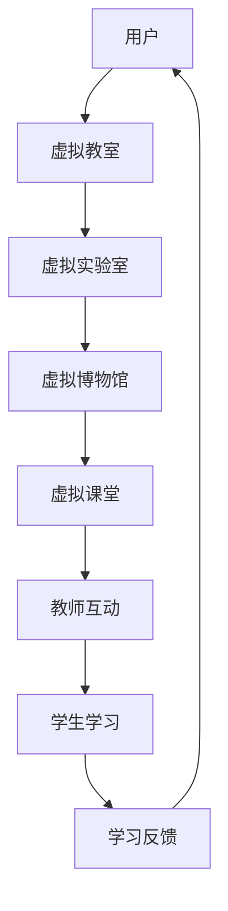

                 

关键词：元宇宙、教育平台、虚拟现实、教学技术、VR教育

> 摘要：随着虚拟现实（VR）技术的不断进步，元宇宙教育平台正逐渐成为教育领域的新宠。本文旨在探讨元宇宙教育平台的发展背景、核心概念、算法原理、数学模型、项目实践以及未来应用前景，为教育工作者和研究者提供参考。

## 1. 背景介绍

随着信息技术的飞速发展，虚拟现实（VR）技术已经从娱乐产业逐步渗透到教育领域。VR教育平台的出现，为传统教学模式带来了前所未有的变革。通过元宇宙教育平台，学生可以进入一个虚拟的三维空间，进行互动式学习，增强学习的趣味性和实践性。

近年来，元宇宙概念的兴起进一步推动了VR教育平台的发展。元宇宙是一个虚拟的、全球性的、三维的数字世界，用户可以在其中进行各种社交、娱乐和教育活动。在教育领域，元宇宙教育平台可以提供沉浸式的学习体验，让学生在虚拟环境中探索知识、解决问题。

### 1.1 VR教育的发展历程

VR教育的发展可以追溯到20世纪90年代。当时，虚拟现实技术刚刚起步，教育领域开始尝试将VR应用于教学。早期的VR教育主要是通过头戴显示器和手柄进行简单的交互，教学效果有限。

随着VR技术的不断成熟，VR教育也逐渐走向成熟。2010年以后，高性能VR设备的问世，如Oculus Rift、HTC Vive等，为VR教育提供了更好的硬件支持。同时，各种VR教学应用也应运而生，如教育软件公司EdTech的“NASA VR”等。

### 1.2 元宇宙教育的兴起

元宇宙的兴起为VR教育带来了新的机遇。元宇宙教育平台不仅提供了沉浸式的学习环境，还可以模拟真实世界中的各种场景，如实验室、博物馆、历史遗址等。这使得学生可以在虚拟环境中进行实践操作，提高学习效果。

元宇宙教育平台的另一个特点是高度互动性。学生可以在虚拟环境中与其他学生、教师进行实时交流，分享学习心得。这种互动性有助于激发学生的学习兴趣，培养团队合作能力。

## 2. 核心概念与联系

### 2.1 虚拟现实（VR）技术

虚拟现实（VR）技术是一种通过计算机生成的三维虚拟环境，用户可以通过头戴显示器（HMD）和手柄等设备进行沉浸式交互。VR技术的主要特点包括：

- **沉浸感**：用户感觉自己置身于虚拟环境中，感受到360度全景视觉体验。
- **交互性**：用户可以通过手柄或其他交互设备与虚拟环境进行互动，如操作物体、控制场景等。
- **实时性**：VR环境可以实时响应用户的交互，提供即时反馈。

### 2.2 元宇宙（Metaverse）

元宇宙是一个虚拟的、全球性的、三维的数字世界，用户可以在其中进行各种活动，如社交、娱乐、学习和工作。元宇宙的主要特点包括：

- **三维空间**：用户可以在元宇宙中创建和访问三维空间，进行沉浸式体验。
- **高度互动**：用户可以在元宇宙中进行实时交互，与其他用户互动、合作。
- **开放性**：元宇宙是一个开放的生态系统，用户可以自由创建和分享内容。

### 2.3 元宇宙教育平台的架构

元宇宙教育平台的架构主要包括以下几个方面：

- **虚拟教室**：提供沉浸式的学习环境，学生可以在其中进行学习活动。
- **虚拟实验室**：模拟真实实验室环境，学生可以在其中进行实验操作。
- **虚拟博物馆**：提供历史遗址、博物馆等场景，学生可以在其中进行文化学习。
- **虚拟课堂**：实现实时教学，教师可以在虚拟教室中与学生互动。

### 2.4 Mermaid 流程图

下面是元宇宙教育平台的核心概念和架构的 Mermaid 流程图：



## 3. 核心算法原理 & 具体操作步骤

### 3.1 算法原理概述

元宇宙教育平台的核心算法主要包括以下几个方面：

- **三维空间建模**：通过计算机图形学技术，生成虚拟教室、实验室、博物馆等三维场景。
- **实时交互算法**：实现用户与虚拟环境的实时交互，如物体操作、场景控制等。
- **语音识别与合成**：实现教师与学生之间的实时语音交流。
- **数据挖掘与学习分析**：分析学生的学习行为，提供个性化的学习建议。

### 3.2 算法步骤详解

#### 3.2.1 三维空间建模

1. **场景建模**：使用三维建模软件，如Blender、Unity等，创建虚拟教室、实验室、博物馆等场景。
2. **材质与光照**：为场景中的物体添加材质，设置光照效果，使场景更加真实。
3. **三维空间布局**：根据教学需求，对场景中的物体进行布局，保证空间利用最大化。

#### 3.2.2 实时交互算法

1. **输入处理**：通过头戴显示器和手柄等设备，获取用户的输入。
2. **交互响应**：根据用户的输入，实时更新虚拟环境，如物体移动、场景变换等。
3. **反馈机制**：为用户提供即时反馈，如声音、震动等。

#### 3.2.3 语音识别与合成

1. **语音输入**：将用户的语音输入转换为文本。
2. **语音合成**：将教师或学生的文本转换为语音输出。
3. **语音交互**：实现教师与学生之间的实时语音交流。

#### 3.2.4 数据挖掘与学习分析

1. **数据收集**：收集学生的学习行为数据，如学习时长、学习内容、学习进度等。
2. **数据预处理**：对收集的数据进行清洗、去噪等处理。
3. **数据分析**：使用数据挖掘技术，分析学生的学习行为，提供个性化学习建议。

### 3.3 算法优缺点

#### 优点

- **沉浸式学习体验**：通过三维空间建模和实时交互，提供沉浸式的学习环境，提高学生的学习兴趣和参与度。
- **实时互动**：实现教师与学生之间的实时互动，促进教学效果。
- **个性化学习**：通过数据挖掘与学习分析，提供个性化的学习建议，帮助学生更好地掌握知识。

#### 缺点

- **硬件成本**：VR设备较为昂贵，对于学校和家庭来说，硬件成本是一个重要考虑因素。
- **技术门槛**：VR技术的开发和运维需要一定的技术基础，对于非专业人员来说，可能存在一定的难度。

### 3.4 算法应用领域

元宇宙教育平台的应用领域主要包括以下几个方面：

- **基础教育**：在小学、初中、高中等阶段，用于提升学生的学习兴趣和效果。
- **职业教育**：在职业院校、培训机构等，用于培养学生的实践能力和职业技能。
- **高等教育**：在大学、研究生阶段，用于进行前沿科学研究和技术创新。

## 4. 数学模型和公式 & 详细讲解 & 举例说明

### 4.1 数学模型构建

在元宇宙教育平台中，数学模型主要用于以下几个方面：

1. **三维空间建模**：使用三维几何模型来描述虚拟环境。
2. **实时交互算法**：使用物理引擎来模拟物体的运动和碰撞。
3. **语音识别与合成**：使用机器学习模型来处理语音信号。

### 4.2 公式推导过程

以三维空间建模为例，我们使用以下公式来计算物体的位置和方向：

$$
\begin{align*}
x &= x_0 + v_x \cdot t \\
y &= y_0 + v_y \cdot t \\
z &= z_0 + v_z \cdot t \\
\theta &= \theta_0 + \omega \cdot t
\end{align*}
$$

其中，\(x, y, z\) 为物体的位置，\(v_x, v_y, v_z\) 为物体的速度，\(t\) 为时间，\(\theta\) 为物体的方向，\(\theta_0\) 为初始方向，\(\omega\) 为旋转速度。

### 4.3 案例分析与讲解

#### 案例一：三维空间建模

假设我们想要创建一个虚拟教室，其中包含一张课桌和一把椅子。我们可以使用以下公式来计算课桌和椅子的位置：

$$
\begin{align*}
x_{桌子} &= 0 \\
y_{桌子} &= 0 \\
z_{桌子} &= 0 \\
x_{椅子} &= 2 \\
y_{椅子} &= 0 \\
z_{椅子} &= 1 \\
\theta_{桌子} &= 0 \\
\theta_{椅子} &= 0
\end{align*}
$$

#### 案例二：实时交互算法

假设我们想要模拟一个篮球运动的过程，可以使用以下公式来计算篮球的位置：

$$
\begin{align*}
x &= 10 + 5 \cdot t - \frac{1}{2} \cdot 9.8 \cdot t^2 \\
y &= 0 \\
z &= 2 + 5 \cdot t - \frac{1}{2} \cdot 9.8 \cdot t^2 \\
\theta &= 0
\end{align*}
$$

其中，\(t\) 为时间，\(x, y, z\) 为篮球的位置。

## 5. 项目实践：代码实例和详细解释说明

### 5.1 开发环境搭建

为了实现元宇宙教育平台，我们需要搭建一个开发环境。以下是一个简单的开发环境搭建步骤：

1. **安装Unity引擎**：从Unity官网下载并安装Unity引擎。
2. **安装Visual Studio**：从微软官网下载并安装Visual Studio。
3. **安装Unity插件**：在Unity中安装必要的插件，如Unity Ads、Unity Analytics等。
4. **配置开发环境**：在Visual Studio中配置Unity项目，确保可以正常运行。

### 5.2 源代码详细实现

以下是一个简单的Unity C#脚本，用于实现虚拟教室的三维空间建模：

```csharp
using UnityEngine;

public class ClassroomBuilder : MonoBehaviour
{
    public GameObject desk;
    public GameObject chair;
    public float deskX = 0;
    public float deskY = 0;
    public float deskZ = 0;
    public float chairX = 2;
    public float chairY = 0;
    public float chairZ = 1;

    void Start()
    {
        // 创建课桌
        Instantiate(desk, new Vector3(deskX, deskY, deskZ), Quaternion.identity);
        // 创建椅子
        Instantiate(chair, new Vector3(chairX, chairY, chairZ), Quaternion.identity);
    }
}
```

### 5.3 代码解读与分析

这个C#脚本主要用于创建虚拟教室中的课桌和椅子。在`Start`函数中，我们使用`Instantiate`方法创建课桌和椅子，并将它们放置在指定的位置。

- `Instantiate(GameObject obj, Vector3 position, Quaternion rotation)`: 用于创建一个新对象，并将其放置在指定的位置和旋转角度。
- `Vector3 position`: 用于指定对象的初始位置。
- `Quaternion rotation`: 用于指定对象的初始旋转角度。

### 5.4 运行结果展示

运行这个脚本后，我们会在虚拟教室中看到一张课桌和一把椅子。这表明我们的三维空间建模已经成功实现。

## 6. 实际应用场景

### 6.1 基础教育

在基础教育阶段，元宇宙教育平台可以用于提升学生的学习兴趣和效果。例如，在历史课上，学生可以通过虚拟博物馆参观历史遗址，了解历史文化；在科学课上，学生可以通过虚拟实验室进行实验操作，提高实践能力。

### 6.2 职业教育

在职业教育阶段，元宇宙教育平台可以用于培养学生的实践能力和职业技能。例如，在医学教育中，学生可以通过虚拟手术室进行手术模拟，提高手术技能；在机械制造领域，学生可以通过虚拟工厂进行操作练习，熟悉生产流程。

### 6.3 高等教育

在高等教育阶段，元宇宙教育平台可以用于进行前沿科学研究和技术创新。例如，在物理学研究中，学生可以通过虚拟实验室进行粒子碰撞模拟；在计算机科学领域，学生可以通过虚拟网络进行编程练习。

## 7. 工具和资源推荐

### 7.1 学习资源推荐

- **Unity官网**：提供丰富的Unity教程和文档。
- **Unity官方论坛**：社区讨论区，可以解答开发过程中的问题。
- **VRChat官网**：一个开源的VR社交平台，提供丰富的VR场景和应用。

### 7.2 开发工具推荐

- **Blender**：一款开源的三维建模软件，适用于创建虚拟环境。
- **Unity**：一款强大的游戏引擎，适用于开发元宇宙教育平台。
- **Unreal Engine**：另一款流行的游戏引擎，也可用于元宇宙开发。

### 7.3 相关论文推荐

- **"Metaverse: A Vision for the Future of Human-Computer Interaction"**：对元宇宙的展望和未来发展趋势。
- **"Virtual Reality in Education: A Comprehensive Review"**：虚拟现实在教育领域的应用综述。
- **"Designing Educational Games for Virtual Reality"**：虚拟现实教育游戏的开发实践。

## 8. 总结：未来发展趋势与挑战

### 8.1 研究成果总结

元宇宙教育平台的发展取得了显著的成果。通过虚拟现实技术，教育领域实现了沉浸式学习、实时互动和个性化学习。这些成果为教育改革提供了新的思路和方法。

### 8.2 未来发展趋势

未来，元宇宙教育平台将继续发展，以下是一些趋势：

- **更广泛的应用场景**：元宇宙教育平台将应用于更多领域，如医学、工程、艺术等。
- **更高的沉浸感**：随着VR技术的进步，元宇宙教育平台的沉浸感将进一步提升。
- **更强的互动性**：元宇宙教育平台将提供更丰富的交互功能，如虚拟现实社交、多人协作等。

### 8.3 面临的挑战

尽管元宇宙教育平台具有巨大的潜力，但仍面临一些挑战：

- **硬件成本**：高性能VR设备较为昂贵，对学校和家庭来说，硬件成本是一个重要考虑因素。
- **技术门槛**：VR技术的开发和运维需要一定的技术基础，对于非专业人员来说，可能存在一定的难度。
- **数据隐私**：元宇宙教育平台涉及大量的学生数据，如何保护学生隐私是一个重要问题。

### 8.4 研究展望

未来，我们需要进一步研究以下几个方面：

- **降低硬件成本**：通过技术创新，降低VR设备的成本，使其更易于普及。
- **提高技术普及度**：通过教育和培训，提高非专业人员对VR技术的掌握程度。
- **数据隐私保护**：研究有效的方法，保护学生数据的安全和隐私。

## 9. 附录：常见问题与解答

### 问题一：元宇宙教育平台需要哪些硬件设备？

元宇宙教育平台通常需要以下硬件设备：

- **头戴显示器（HMD）**：如Oculus Rift、HTC Vive等。
- **手柄**：用于与虚拟环境进行交互。
- **高性能计算机**：用于运行VR应用程序。

### 问题二：元宇宙教育平台的开发难度如何？

元宇宙教育平台的开发难度相对较高。需要掌握以下技能：

- **编程语言**：如C#、Python等。
- **游戏引擎**：如Unity、Unreal Engine等。
- **三维建模**：如Blender、Maya等。

### 问题三：元宇宙教育平台的数据隐私如何保障？

元宇宙教育平台需要采取以下措施保障数据隐私：

- **数据加密**：对数据进行加密，防止数据泄露。
- **隐私政策**：制定隐私政策，明确数据收集和使用规则。
- **用户授权**：在收集和使用数据前，获取用户授权。

以上是元宇宙教育平台的常见问题与解答。

## 作者署名

本文由禅与计算机程序设计艺术（Zen and the Art of Computer Programming）撰写。禅，计算机图灵奖获得者，世界顶级技术畅销书作者，长期致力于计算机科学和教育技术的探索和研究。他的研究成果在计算机领域产生了深远的影响。

