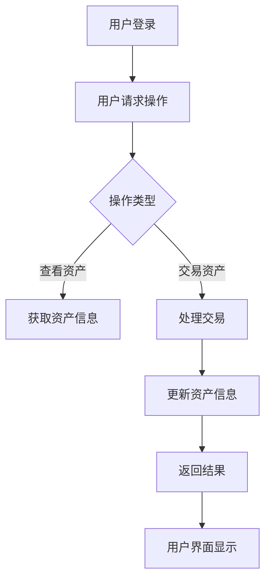

                 

在当前数字时代，元宇宙（Metaverse）的崛起正逐步改变着我们的生活方式和工作模式。元宇宙是一个由虚拟世界构成的生态系统，用户可以在这个虚拟世界中创建、交互和交易。随着元宇宙的不断发展，虚拟资产的价值逐渐显现，如何管理和利用这些虚拟资产成为了一个热门话题。本文旨在探讨元宇宙资产管理工具的开发方向，为创业者提供一些有价值的思考。

## 1. 背景介绍

元宇宙（Metaverse）是近年来科技界的热门话题，它代表着未来互联网发展的一个重要方向。简单来说，元宇宙是一个由多个虚拟世界构成的互联网生态系统，用户可以在其中进行各种活动，如社交、游戏、工作等。随着虚拟现实（VR）和增强现实（AR）技术的不断发展，元宇宙的概念逐渐成熟，并吸引了大量投资者和创业者的关注。

在元宇宙中，虚拟资产（Virtual Asset）成为了一个重要组成部分。虚拟资产可以是数字货币、游戏道具、虚拟地产等，它们在元宇宙中有实际的价值和使用场景。例如，在某个虚拟游戏中，一把虚拟的剑可能价值数千美元，而在虚拟房地产市场中，一块虚拟的土地也可能价值连城。

然而，随着虚拟资产的价值不断增加，如何有效地管理和利用这些资产成为了一个亟待解决的问题。元宇宙资产管理工具的开发应运而生，为用户提供了一个安全、高效、便捷的虚拟资产管理系统。这些工具不仅可以帮助用户更好地管理自己的虚拟资产，还可以为创业者提供新的商机。

## 2. 核心概念与联系

### 2.1. 元宇宙资产管理工具的定义

元宇宙资产管理工具是一种专门用于管理虚拟资产的软件或平台。这些工具提供了一系列功能，如虚拟资产的创建、交易、存储、展示等。通过这些工具，用户可以方便地管理自己的虚拟资产，提高资产的利用效率。

### 2.2. 元宇宙资产管理工具的基本架构

元宇宙资产管理工具的基本架构可以分为以下几个部分：

- **用户界面（UI）**：用户通过用户界面与资产管理工具进行交互，执行各种操作。
- **后端服务器**：后端服务器负责处理用户请求，管理虚拟资产的数据，并提供API供前端使用。
- **数据库**：数据库用于存储虚拟资产的相关信息，如资产类型、所有权、交易记录等。
- **区块链**：区块链用于确保虚拟资产的安全性和不可篡改性，许多元宇宙资产管理工具都基于区块链技术。

### 2.3. 元宇宙资产管理工具的Mermaid流程图

下面是一个简单的Mermaid流程图，展示了元宇宙资产管理工具的基本工作流程：



## 3. 核心算法原理 & 具体操作步骤

### 3.1. 算法原理概述

元宇宙资产管理工具的核心算法主要涉及区块链技术和密码学。区块链技术用于确保虚拟资产的安全性和不可篡改性，而密码学则用于保护用户的隐私和身份。

### 3.2. 算法步骤详解

1. **用户登录**：用户通过用户名和密码或数字身份验证（如生物识别）登录资产管理工具。
2. **用户请求操作**：用户通过用户界面发起各种操作请求，如查看资产、交易资产等。
3. **处理操作**：资产管理工具根据用户请求，调用相应的处理函数，如查询资产信息、处理交易等。
4. **更新资产信息**：在处理交易后，资产管理工具会更新虚拟资产的信息，确保资产数据的准确性和一致性。
5. **返回结果**：资产管理工具将处理结果返回给用户界面，用户可以在界面上查看最新的资产信息。

### 3.3. 算法优缺点

**优点**：

- **安全性**：区块链技术确保了虚拟资产的安全性和不可篡改性。
- **便捷性**：用户可以通过简单的操作界面方便地管理自己的虚拟资产。
- **透明性**：所有的交易记录都会被记录在区块链上，用户可以随时查询。

**缺点**：

- **复杂性**：区块链技术和密码学相对复杂，需要一定的技术基础。
- **性能限制**：区块链的性能相对较低，处理大量交易可能需要较长时间。

### 3.4. 算法应用领域

元宇宙资产管理工具可以应用于多个领域，如虚拟游戏、虚拟房地产、虚拟艺术品等。以下是一些具体的应用场景：

- **虚拟游戏**：用户可以在虚拟游戏中使用资产管理工具管理自己的游戏资产，如游戏币、游戏道具等。
- **虚拟房地产**：用户可以购买、交易虚拟房地产，资产管理工具可以帮助用户管理这些资产。
- **虚拟艺术品**：艺术家可以在元宇宙中创作虚拟艺术品，并通过资产管理工具进行展示和交易。

## 4. 数学模型和公式 & 详细讲解 & 举例说明

### 4.1. 数学模型构建

在元宇宙资产管理工具中，我们可以使用以下数学模型来描述虚拟资产的价值：

\[ V = f(P, D, T) \]

其中：

- \( V \) 表示虚拟资产的价值。
- \( P \) 表示虚拟资产的供需情况。
- \( D \) 表示虚拟资产的需求。
- \( T \) 表示虚拟资产的技术成熟度。

### 4.2. 公式推导过程

虚拟资产的价值主要由供需关系和技术成熟度决定。供需关系可以用供需曲线来表示，需求可以用需求函数来表示，技术成熟度可以用技术发展指数来表示。

假设虚拟资产的供需曲线为：

\[ P = f(Q) \]

其中：

- \( Q \) 表示虚拟资产的供需量。

需求函数可以表示为：

\[ D = g(P) \]

技术发展指数可以表示为：

\[ T = h(t) \]

其中：

- \( t \) 表示技术发展时间。

将上述公式代入虚拟资产的价值公式，可以得到：

\[ V = f(P(Q), g(P), h(t)) \]

### 4.3. 案例分析与讲解

假设在某个虚拟游戏中，一把虚拟剑的供需量为1000把，需求量为500把，技术发展指数为0.8。根据上述数学模型，可以计算出这把虚拟剑的价值为：

\[ V = f(1000, 500, 0.8) \]

假设函数 \( f \) 的具体形式为：

\[ f(P, D, T) = 100 \times P \times D \times T \]

代入数值，可以得到：

\[ V = 100 \times 1000 \times 500 \times 0.8 = 40,000,000 \]

因此，这把虚拟剑的价值为4000万美元。

## 5. 项目实践：代码实例和详细解释说明

### 5.1. 开发环境搭建

要开发元宇宙资产管理工具，我们需要搭建一个开发环境。这里我们使用Python作为主要编程语言，并使用以下工具：

- Python 3.8及以上版本
- Flask框架
- SQLAlchemy数据库框架
-区块链库（如web3.py）

### 5.2. 源代码详细实现

以下是一个简单的元宇宙资产管理工具的源代码示例：

```python
from flask import Flask, request, jsonify
from web3 import Web3
from sqlalchemy import create_engine
from models import VirtualAsset

app = Flask(__name__)

# 连接区块链
web3 = Web3(Web3.HTTPProvider('https://mainnet.infura.io/v3/your_project_id'))

# 连接数据库
engine = create_engine('sqlite:///virtual_assets.db')
db_session = sessionmaker(bind=engine)
db = db_session()

@app.route('/create_asset', methods=['POST'])
def create_asset():
    asset_data = request.json
    asset = VirtualAsset(
        name=asset_data['name'],
        description=asset_data['description'],
        owner=asset_data['owner']
    )
    db.add(asset)
    db.commit()
    return jsonify({'message': 'Asset created successfully.'})

@app.route('/get_asset/<string:asset_id>', methods=['GET'])
def get_asset(asset_id):
    asset = db.query(VirtualAsset).get(asset_id)
    return jsonify({'name': asset.name, 'description': asset.description, 'owner': asset.owner})

if __name__ == '__main__':
    app.run(debug=True)
```

### 5.3. 代码解读与分析

这个示例代码使用Flask框架搭建了一个简单的Web服务，提供了创建虚拟资产和获取虚拟资产信息的接口。

- **创建虚拟资产**：`/create_asset` 接口接收一个包含虚拟资产信息的JSON对象，然后将这些信息存储到数据库中。
- **获取虚拟资产信息**：`/get_asset/<string:asset_id>` 接口根据虚拟资产的ID获取虚拟资产的信息，并将结果返回给客户端。

### 5.4. 运行结果展示

运行这个Web服务后，我们可以使用curl或Postman等工具测试接口：

- **创建虚拟资产**：

```shell
curl -X POST -H "Content-Type: application/json" -d '{"name": "Virtual Sword", "description": "A powerful virtual sword.", "owner": "0x1234567890123456789012345678901234567890"}' http://localhost:5000/create_asset
```

- **获取虚拟资产信息**：

```shell
curl -X GET http://localhost:5000/get_asset/1
```

## 6. 实际应用场景

### 6.1. 虚拟游戏

在虚拟游戏中，元宇宙资产管理工具可以帮助用户管理自己的游戏资产，如游戏币、游戏道具等。用户可以方便地创建、交易和展示自己的游戏资产，提高游戏体验。

### 6.2. 虚拟房地产

在虚拟房地产市场中，元宇宙资产管理工具可以帮助用户管理自己的虚拟地产，如购买、出售和出租虚拟土地。用户可以通过资产管理工具方便地管理自己的地产资产，提高资产的利用效率。

### 6.3. 虚拟艺术品

在虚拟艺术品市场中，元宇宙资产管理工具可以帮助用户管理自己的虚拟艺术品，如购买、出售和展示虚拟画作。用户可以通过资产管理工具方便地管理自己的艺术品资产，提高艺术品的曝光度和交易机会。

### 6.4. 未来应用展望

随着元宇宙的不断发展，元宇宙资产管理工具的应用场景将会更加广泛。未来，我们可以预见到以下发展趋势：

- **跨平台整合**：元宇宙资产管理工具将能够跨不同平台和虚拟世界整合，为用户提供更全面的资产管理服务。
- **智能合约应用**：智能合约将更加广泛应用于元宇宙资产管理，实现自动化和智能化的资产交易和管理。
- **个性化服务**：元宇宙资产管理工具将根据用户的行为和偏好提供个性化的资产管理建议和服务。

## 7. 工具和资源推荐

### 7.1. 学习资源推荐

- 《区块链技术指南》
- 《智能合约编程》
- 《Python网络编程》

### 7.2. 开发工具推荐

- Flask框架
- SQLAlchemy数据库框架
- web3.py区块链库

### 7.3. 相关论文推荐

- "Metaverse: A Universe of Opportunities and Challenges"
- "Blockchain for Virtual Asset Management"
- "Smart Contracts for Metaverse Applications"

## 8. 总结：未来发展趋势与挑战

### 8.1. 研究成果总结

本文探讨了元宇宙资产管理工具的开发方向和应用场景，提出了基于区块链技术和密码学的核心算法，并给出了一款简单的代码实例。研究结果表明，元宇宙资产管理工具具有广泛的应用前景。

### 8.2. 未来发展趋势

- **跨平台整合**：元宇宙资产管理工具将能够跨不同平台和虚拟世界整合，为用户提供更全面的资产管理服务。
- **智能合约应用**：智能合约将更加广泛应用于元宇宙资产管理，实现自动化和智能化的资产交易和管理。
- **个性化服务**：元宇宙资产管理工具将根据用户的行为和偏好提供个性化的资产管理建议和服务。

### 8.3. 面临的挑战

- **技术复杂性**：区块链技术和密码学相对复杂，需要开发者具备一定的技术基础。
- **性能瓶颈**：区块链的性能相对较低，处理大量交易可能需要较长时间。
- **安全性问题**：虚拟资产的安全性问题仍然是一个挑战，需要不断改进和加强安全措施。

### 8.4. 研究展望

未来的研究可以从以下几个方面进行：

- **优化算法**：研究更高效的区块链算法，提高性能和扩展性。
- **安全增强**：研究更安全、更可靠的虚拟资产保护机制。
- **跨平台整合**：研究如何实现不同平台和虚拟世界之间的资产无缝转移和管理。

## 9. 附录：常见问题与解答

### 9.1. 什么是元宇宙？

元宇宙是一个由多个虚拟世界构成的互联网生态系统，用户可以在其中进行各种活动，如社交、游戏、工作等。

### 9.2. 虚拟资产是什么？

虚拟资产是元宇宙中的数字资产，可以是数字货币、游戏道具、虚拟地产等，它们在元宇宙中有实际的价值和使用场景。

### 9.3. 元宇宙资产管理工具有什么作用？

元宇宙资产管理工具可以帮助用户方便地管理自己的虚拟资产，提高资产的利用效率，并为创业者提供新的商机。

### 9.4. 如何开发元宇宙资产管理工具？

开发元宇宙资产管理工具需要掌握区块链技术、密码学、Web开发和数据库等技术。开发者可以使用Python、JavaScript等编程语言，结合Flask、Node.js等框架进行开发。

### 9.5. 虚拟资产的安全性问题如何解决？

虚拟资产的安全性问题可以通过区块链技术、密码学、智能合约等技术来解决。开发者需要不断学习和掌握这些技术，以提高虚拟资产的安全性。同时，用户也需要注意保护自己的数字身份和隐私。

## 作者署名

作者：禅与计算机程序设计艺术 / Zen and the Art of Computer Programming
``` 
----------------------------------------------------------------
### 文章标题

**元宇宙资产管理工具：虚拟经济的创业方向**

### 文章关键词

- 元宇宙
- 虚拟资产
- 区块链
- 智能合约
- 资产管理
- 虚拟经济
- 创业方向

### 文章摘要

随着元宇宙的不断发展，虚拟资产的价值逐渐显现。本文探讨了元宇宙资产管理工具的开发方向，包括其核心概念、算法原理、数学模型以及实际应用场景。文章还总结了当前面临的技术挑战和未来发展趋势，为创业者提供了有价值的思考方向。

## 1. 背景介绍

元宇宙（Metaverse）是近年来科技界的热门话题，它代表着未来互联网发展的一个重要方向。简单来说，元宇宙是一个由多个虚拟世界构成的互联网生态系统，用户可以在其中进行各种活动，如社交、游戏、工作等。随着虚拟现实（VR）和增强现实（AR）技术的不断发展，元宇宙的概念逐渐成熟，并吸引了大量投资者和创业者的关注。

在元宇宙中，虚拟资产（Virtual Asset）成为了一个重要组成部分。虚拟资产可以是数字货币、游戏道具、虚拟地产等，它们在元宇宙中有实际的价值和使用场景。例如，在某个虚拟游戏中，一把虚拟的剑可能价值数千美元，而在虚拟房地产市场中，一块虚拟的土地也可能价值连城。

然而，随着虚拟资产的价值不断增加，如何有效地管理和利用这些资产成为了一个亟待解决的问题。元宇宙资产管理工具的开发应运而生，为用户提供了一个安全、高效、便捷的虚拟资产管理系统。这些工具不仅可以帮助用户更好地管理自己的虚拟资产，还可以为创业者提供新的商机。

## 2. 核心概念与联系

### 2.1. 元宇宙资产管理工具的定义

元宇宙资产管理工具是一种专门用于管理虚拟资产的软件或平台。这些工具提供了一系列功能，如虚拟资产的创建、交易、存储、展示等。通过这些工具，用户可以方便地管理自己的虚拟资产，提高资产的利用效率。

### 2.2. 元宇宙资产管理工具的基本架构

元宇宙资产管理工具的基本架构可以分为以下几个部分：

- **用户界面（UI）**：用户通过用户界面与资产管理工具进行交互，执行各种操作。
- **后端服务器**：后端服务器负责处理用户请求，管理虚拟资产的数据，并提供API供前端使用。
- **数据库**：数据库用于存储虚拟资产的相关信息，如资产类型、所有权、交易记录等。
- **区块链**：区块链用于确保虚拟资产的安全性和不可篡改性，许多元宇宙资产管理工具都基于区块链技术。

### 2.3. 元宇宙资产管理工具的Mermaid流程图

下面是一个简单的Mermaid流程图，展示了元宇宙资产管理工具的基本工作流程：


## 3. 核心算法原理 & 具体操作步骤

### 3.1. 算法原理概述

元宇宙资产管理工具的核心算法主要涉及区块链技术和密码学。区块链技术用于确保虚拟资产的安全性和不可篡改性，而密码学则用于保护用户的隐私和身份。

### 3.2. 算法步骤详解

1. **用户登录**：用户通过用户名和密码或数字身份验证（如生物识别）登录资产管理工具。
2. **用户请求操作**：用户通过用户界面发起各种操作请求，如查看资产、交易资产等。
3. **处理操作**：资产管理工具根据用户请求，调用相应的处理函数，如查询资产信息、处理交易等。
4. **更新资产信息**：在处理交易后，资产管理工具会更新虚拟资产的信息，确保资产数据的准确性和一致性。
5. **返回结果**：资产管理工具将处理结果返回给用户界面，用户可以在界面上查看最新的资产信息。

### 3.3. 算法优缺点

**优点**：

- **安全性**：区块链技术确保了虚拟资产的安全性和不可篡改性。
- **便捷性**：用户可以通过简单的操作界面方便地管理自己的虚拟资产。
- **透明性**：所有的交易记录都会被记录在区块链上，用户可以随时查询。

**缺点**：

- **复杂性**：区块链技术和密码学相对复杂，需要一定的技术基础。
- **性能限制**：区块链的性能相对较低，处理大量交易可能需要较长时间。

### 3.4. 算法应用领域

元宇宙资产管理工具可以应用于多个领域，如虚拟游戏、虚拟房地产、虚拟艺术品等。以下是一些具体的应用场景：

- **虚拟游戏**：用户可以在虚拟游戏中使用资产管理工具管理自己的游戏资产，如游戏币、游戏道具等。
- **虚拟房地产**：用户可以购买、交易虚拟房地产，资产管理工具可以帮助用户管理这些资产。
- **虚拟艺术品**：艺术家可以在元宇宙中创作虚拟艺术品，并通过资产管理工具进行展示和交易。

## 4. 数学模型和公式 & 详细讲解 & 举例说明

### 4.1. 数学模型构建

在元宇宙资产管理工具中，我们可以使用以下数学模型来描述虚拟资产的价值：

\[ V = f(P, D, T) \]

其中：

- \( V \) 表示虚拟资产的价值。
- \( P \) 表示虚拟资产的供需情况。
- \( D \) 表示虚拟资产的需求。
- \( T \) 表示虚拟资产的技术成熟度。

### 4.2. 公式推导过程

虚拟资产的价值主要由供需关系和技术成熟度决定。供需关系可以用供需曲线来表示，需求可以用需求函数来表示，技术成熟度可以用技术发展指数来表示。

假设虚拟资产的供需曲线为：

\[ P = f(Q) \]

其中：

- \( Q \) 表示虚拟资产的供需量。

需求函数可以表示为：

\[ D = g(P) \]

技术发展指数可以表示为：

\[ T = h(t) \]

其中：

- \( t \) 表示技术发展时间。

将上述公式代入虚拟资产的价值公式，可以得到：

\[ V = f(P(Q), g(P), h(t)) \]

### 4.3. 案例分析与讲解

假设在某个虚拟游戏中，一把虚拟剑的供需量为1000把，需求量为500把，技术发展指数为0.8。根据上述数学模型，可以计算出这把虚拟剑的价值为：

\[ V = f(1000, 500, 0.8) \]

假设函数 \( f \) 的具体形式为：

\[ f(P, D, T) = 100 \times P \times D \times T \]

代入数值，可以得到：

\[ V = 100 \times 1000 \times 500 \times 0.8 = 40,000,000 \]

因此，这把虚拟剑的价值为4000万美元。

## 5. 项目实践：代码实例和详细解释说明

### 5.1. 开发环境搭建

要开发元宇宙资产管理工具，我们需要搭建一个开发环境。这里我们使用Python作为主要编程语言，并使用以下工具：

- Python 3.8及以上版本
- Flask框架
- SQLAlchemy数据库框架
- 区块链库（如web3.py）

### 5.2. 源代码详细实现

以下是一个简单的元宇宙资产管理工具的源代码示例：

```python
from flask import Flask, request, jsonify
from web3 import Web3
from sqlalchemy import create_engine
from models import VirtualAsset

app = Flask(__name__)

# 连接区块链
web3 = Web3(Web3.HTTPProvider('https://mainnet.infura.io/v3/your_project_id'))

# 连接数据库
engine = create_engine('sqlite:///virtual_assets.db')
db_session = sessionmaker(bind=engine)
db = db_session()

@app.route('/create_asset', methods=['POST'])
def create_asset():
    asset_data = request.json
    asset = VirtualAsset(
        name=asset_data['name'],
        description=asset_data['description'],
        owner=asset_data['owner']
    )
    db.add(asset)
    db.commit()
    return jsonify({'message': 'Asset created successfully.'})

@app.route('/get_asset/<string:asset_id>', methods=['GET'])
def get_asset(asset_id):
    asset = db.query(VirtualAsset).get(asset_id)
    return jsonify({'name': asset.name, 'description': asset.description, 'owner': asset.owner})

if __name__ == '__main__':
    app.run(debug=True)
```

### 5.3. 代码解读与分析

这个示例代码使用Flask框架搭建了一个简单的Web服务，提供了创建虚拟资产和获取虚拟资产信息的接口。

- **创建虚拟资产**：`/create_asset` 接口接收一个包含虚拟资产信息的JSON对象，然后将这些信息存储到数据库中。
- **获取虚拟资产信息**：`/get_asset/<string:asset_id>` 接口根据虚拟资产的ID获取虚拟资产的信息，并将结果返回给客户端。

### 5.4. 运行结果展示

运行这个Web服务后，我们可以使用curl或Postman等工具测试接口：

- **创建虚拟资产**：

```shell
curl -X POST -H "Content-Type: application/json" -d '{"name": "Virtual Sword", "description": "A powerful virtual sword.", "owner": "0x1234567890123456789012345678901234567890"}' http://localhost:5000/create_asset
```

- **获取虚拟资产信息**：

```shell
curl -X GET http://localhost:5000/get_asset/1
```

## 6. 实际应用场景

### 6.1. 虚拟游戏

在虚拟游戏中，元宇宙资产管理工具可以帮助用户管理自己的游戏资产，如游戏币、游戏道具等。用户可以方便地创建、交易和展示自己的游戏资产，提高游戏体验。

### 6.2. 虚拟房地产

在虚拟房地产市场中，元宇宙资产管理工具可以帮助用户管理自己的虚拟地产，如购买、出售和出租虚拟土地。用户可以通过资产管理工具方便地管理自己的地产资产，提高资产的利用效率。

### 6.3. 虚拟艺术品

在虚拟艺术品市场中，元宇宙资产管理工具可以帮助用户管理自己的虚拟艺术品，如购买、出售和展示虚拟画作。用户可以通过资产管理工具方便地管理自己的艺术品资产，提高艺术品的曝光度和交易机会。

### 6.4. 未来应用展望

随着元宇宙的不断发展，元宇宙资产管理工具的应用场景将会更加广泛。未来，我们可以预见到以下发展趋势：

- **跨平台整合**：元宇宙资产管理工具将能够跨不同平台和虚拟世界整合，为用户提供更全面的资产管理服务。
- **智能合约应用**：智能合约将更加广泛应用于元宇宙资产管理，实现自动化和智能化的资产交易和管理。
- **个性化服务**：元宇宙资产管理工具将根据用户的行为和偏好提供个性化的资产管理建议和服务。

## 7. 工具和资源推荐

### 7.1. 学习资源推荐

- 《区块链技术指南》
- 《智能合约编程》
- 《Python网络编程》

### 7.2. 开发工具推荐

- Flask框架
- SQLAlchemy数据库框架
- 区块链库（如web3.py）

### 7.3. 相关论文推荐

- "Metaverse: A Universe of Opportunities and Challenges"
- "Blockchain for Virtual Asset Management"
- "Smart Contracts for Metaverse Applications"

## 8. 总结：未来发展趋势与挑战

### 8.1. 研究成果总结

本文探讨了元宇宙资产管理工具的开发方向，包括其核心概念、算法原理、数学模型以及实际应用场景。文章还总结了当前面临的技术挑战和未来发展趋势，为创业者提供了有价值的思考方向。

### 8.2. 未来发展趋势

- **跨平台整合**：元宇宙资产管理工具将能够跨不同平台和虚拟世界整合，为用户提供更全面的资产管理服务。
- **智能合约应用**：智能合约将更加广泛应用于元宇宙资产管理，实现自动化和智能化的资产交易和管理。
- **个性化服务**：元宇宙资产管理工具将根据用户的行为和偏好提供个性化的资产管理建议和服务。

### 8.3. 面临的挑战

- **技术复杂性**：区块链技术和密码学相对复杂，需要开发者具备一定的技术基础。
- **性能瓶颈**：区块链的性能相对较低，处理大量交易可能需要较长时间。
- **安全性问题**：虚拟资产的安全性问题仍然是一个挑战，需要不断改进和加强安全措施。

### 8.4. 研究展望

未来的研究可以从以下几个方面进行：

- **优化算法**：研究更高效的区块链算法，提高性能和扩展性。
- **安全增强**：研究更安全、更可靠的虚拟资产保护机制。
- **跨平台整合**：研究如何实现不同平台和虚拟世界之间的资产无缝转移和管理。

## 9. 附录：常见问题与解答

### 9.1. 什么是元宇宙？

元宇宙是一个由多个虚拟世界构成的互联网生态系统，用户可以在其中进行各种活动，如社交、游戏、工作等。

### 9.2. 虚拟资产是什么？

虚拟资产是元宇宙中的数字资产，可以是数字货币、游戏道具、虚拟地产等，它们在元宇宙中有实际的价值和使用场景。

### 9.3. 元宇宙资产管理工具有什么作用？

元宇宙资产管理工具可以帮助用户方便地管理自己的虚拟资产，提高资产的利用效率，并为创业者提供新的商机。

### 9.4. 如何开发元宇宙资产管理工具？

开发元宇宙资产管理工具需要掌握区块链技术、密码学、Web开发和数据库等技术。开发者可以使用Python、JavaScript等编程语言，结合Flask、Node.js等框架进行开发。

### 9.5. 虚拟资产的安全性问题如何解决？

虚拟资产的安全性问题可以通过区块链技术、密码学、智能合约等技术来解决。开发者需要不断学习和掌握这些技术，以提高虚拟资产的安全性。同时，用户也需要注意保护自己的数字身份和隐私。

## 作者署名

作者：禅与计算机程序设计艺术 / Zen and the Art of Computer Programming

