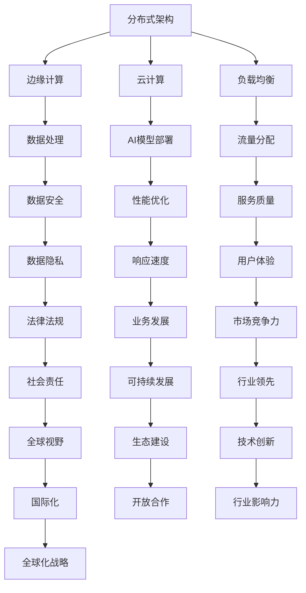

                 

关键词：全球化AI服务、多地域部署、Lepton AI、分布式架构、边缘计算、云计算、负载均衡、数据安全、性能优化。

## 摘要

随着全球化的不断推进，AI技术在各个领域的应用越来越广泛。然而，全球化的AI服务面临着多地域部署的挑战。本文将探讨Lepton AI如何通过分布式架构、边缘计算、云计算和负载均衡等技术，实现全球范围内的高效AI服务部署，并讨论在此过程中面临的性能优化、数据安全等问题。最后，本文将对未来全球化AI服务的发展趋势进行展望。

## 1. 背景介绍

随着5G、物联网、大数据等技术的发展，AI技术在全球范围内的应用日益广泛。从智能制造、智能医疗、智能交通到智能城市等各个领域，AI技术正成为推动产业升级和经济发展的关键力量。然而，全球化AI服务面临着一系列挑战，其中最为突出的便是多地域部署问题。如何在保证服务质量的前提下，实现全球范围内的AI服务高效部署，成为各大企业和研究机构亟待解决的难题。

Lepton AI是一家专注于AI技术的公司，致力于通过先进的技术手段，提供高效、可靠、安全的AI服务。为了应对全球化的挑战，Lepton AI在AI服务部署方面进行了深入的探索和研究，形成了一套多地域部署的解决方案。本文将介绍Lepton AI的多地域部署架构，并探讨其中涉及的关键技术。

## 2. 核心概念与联系

### 2.1 分布式架构

分布式架构是一种将计算任务分散到多个节点上进行处理的架构，能够提高系统的可扩展性和容错性。在全球化AI服务中，分布式架构是实现多地域部署的基础。

### 2.2 边缘计算

边缘计算是一种将计算、存储和网络功能分布到网络边缘的架构，能够在靠近数据源的地方进行数据处理，从而降低延迟、减少带宽消耗。在全球化AI服务中，边缘计算可以用于处理实时数据，提高AI服务的响应速度。

### 2.3 云计算

云计算是一种提供计算资源、存储资源、网络资源等服务的计算模型，具有弹性、高效、灵活等特点。在全球化AI服务中，云计算可以用于部署AI模型、存储数据、提供计算资源等。

### 2.4 负载均衡

负载均衡是一种将请求分配到多个服务器上处理的机制，能够提高系统的性能和可靠性。在全球化AI服务中，负载均衡可以用于平衡不同地域的请求流量，提高服务的响应速度。

### 2.5 数据安全

数据安全是全球化AI服务中至关重要的一环。为了保证数据的安全性，需要在数据传输、存储、处理等环节采取一系列安全措施。

### 2.6 Mermaid流程图



## 3. 核心算法原理 & 具体操作步骤

### 3.1 算法原理概述

全球化AI服务的核心算法主要包括分布式架构、边缘计算、云计算和负载均衡等。这些算法的原理如下：

- **分布式架构**：通过将计算任务分散到多个节点上进行处理，提高系统的可扩展性和容错性。
- **边缘计算**：在靠近数据源的地方进行数据处理，降低延迟、减少带宽消耗。
- **云计算**：提供计算资源、存储资源、网络资源等服务，具有弹性、高效、灵活等特点。
- **负载均衡**：将请求分配到多个服务器上处理，提高系统的性能和可靠性。

### 3.2 算法步骤详解

1. **分布式架构部署**：
   - 设计分布式系统架构，确定计算节点、存储节点和通信节点的位置和功能。
   - 实现分布式计算框架，如Hadoop、Spark等，将计算任务分配到各个节点上处理。
   - 实现分布式存储系统，如HDFS、Cassandra等，存储和管理海量数据。

2. **边缘计算部署**：
   - 选择合适的边缘计算设备，如物联网设备、智能终端等，部署边缘计算节点。
   - 实现边缘计算框架，如EdgeX Foundry、IoT Platform等，进行边缘数据处理和推理。
   - 实现边缘设备和云端平台的通信，如MQTT、CoAP等，实现数据传输和同步。

3. **云计算部署**：
   - 选择合适的云计算平台，如AWS、Azure、Google Cloud等，部署AI模型和应用程序。
   - 实现云计算平台上的计算任务调度和资源管理，如Kubernetes、Docker等。
   - 实现数据存储和备份，如AWS S3、Azure Blob Storage等。

4. **负载均衡部署**：
   - 设计负载均衡策略，如轮询、加权轮询、最少连接数等，分配请求到各个服务器上。
   - 选择合适的负载均衡设备，如Nginx、HAProxy等，部署负载均衡节点。
   - 实现负载均衡与分布式架构、边缘计算、云计算的集成，实现全局流量分配。

### 3.3 算法优缺点

- **分布式架构**：
  - 优点：提高系统可扩展性和容错性。
  - 缺点：需要处理分布式数据一致性、数据传输开销等问题。

- **边缘计算**：
  - 优点：降低延迟、减少带宽消耗。
  - 缺点：边缘设备计算能力有限、数据安全风险等。

- **云计算**：
  - 优点：提供弹性、高效、灵活的计算资源。
  - 缺点：需要支付云服务费用、数据安全风险等。

- **负载均衡**：
  - 优点：提高系统性能和可靠性。
  - 缺点：需要处理负载均衡算法的选择、负载均衡设备的高可用性等问题。

### 3.4 算法应用领域

- **智能制造**：通过分布式架构和边缘计算，实现工厂设备的实时监控和智能调度。
- **智能医疗**：通过云计算和边缘计算，实现医疗数据的实时处理和远程诊断。
- **智能交通**：通过分布式架构和边缘计算，实现交通流量的实时监控和智能调控。
- **智能城市**：通过云计算和边缘计算，实现城市管理的智能化和精细化。

## 4. 数学模型和公式 & 详细讲解 & 举例说明

### 4.1 数学模型构建

在全球化AI服务的多地域部署中，可以构建以下数学模型：

- **负载均衡模型**：根据服务请求的负载情况，将请求分配到各个服务器上。

  假设有n个服务器，每个服务器的负载为$W_i$，服务请求的负载为$W_{req}$，则负载均衡模型可以表示为：

  $$\sum_{i=1}^{n} W_i \approx W_{req}$$

- **数据传输模型**：根据数据传输的距离、带宽等因素，计算数据传输的时间。

  假设数据传输距离为$d$，带宽为$B$，数据传输时间为$t$，则数据传输模型可以表示为：

  $$t = \frac{d}{B}$$

- **能耗模型**：根据服务器的工作负载，计算服务器的能耗。

  假设服务器的负载为$W$，能耗为$E$，则能耗模型可以表示为：

  $$E = f(W)$$

### 4.2 公式推导过程

- **负载均衡模型**：

  负载均衡的目标是使得每个服务器的负载尽可能均衡。假设服务请求的负载为$W_{req}$，初始时刻服务器的负载为$W_0$，则在第$t$时刻，服务器的负载变化可以表示为：

  $$W_i(t) = W_0 + \sum_{j=1}^{t} \Delta W_j$$

  其中，$\Delta W_j$表示第$j$次服务请求分配到服务器$i$上的负载。

  为了使得负载均衡，需要满足：

  $$\sum_{i=1}^{n} W_i(t) \approx W_{req}$$

  根据初始时刻的负载和每次服务请求的负载分配，可以推导出：

  $$\sum_{i=1}^{n} W_i(t) = \sum_{i=1}^{n} W_0 + \sum_{j=1}^{t} \sum_{i=1}^{n} \Delta W_j$$

  $$\approx nW_0 + tW_{req}$$

  因此，负载均衡模型可以表示为：

  $$nW_0 + tW_{req} \approx W_{req}$$

- **数据传输模型**：

  数据传输的时间取决于数据传输的距离和带宽。假设数据传输的距离为$d$，带宽为$B$，则数据传输的时间可以表示为：

  $$t = \frac{d}{B}$$

  根据数据传输的距离和带宽的实际情况，可以推导出数据传输的时间。

- **能耗模型**：

  服务器的能耗取决于服务器的工作负载。假设服务器的工作负载为$W$，能耗为$E$，则能耗可以表示为：

  $$E = f(W)$$

  其中，$f(W)$表示服务器的能耗函数。

### 4.3 案例分析与讲解

假设有5个服务器，初始时刻服务器的负载为$W_0 = [0.2, 0.2, 0.2, 0.2, 0.2]$，每次服务请求的负载为$W_{req} = 0.1$。需要实现负载均衡，使得服务器的负载尽可能均衡。

根据负载均衡模型，可以计算每次服务请求分配到各个服务器上的负载：

- 第一次服务请求：$\Delta W_1 = [0.1, 0.1, 0.1, 0.1, 0.1]$
- 第二次服务请求：$\Delta W_2 = [0.1, 0.1, 0.1, 0.1, 0.1]$
- 第三次服务请求：$\Delta W_3 = [0.1, 0.1, 0.1, 0.1, 0.1]$
- 第四次服务请求：$\Delta W_4 = [0.1, 0.1, 0.1, 0.1, 0.1]$
- 第五次服务请求：$\Delta W_5 = [0.1, 0.1, 0.1, 0.1, 0.1]$

根据每次服务请求的负载分配，可以计算每次服务请求后的服务器负载：

- 第一次服务请求后：$W_1 = [0.3, 0.3, 0.3, 0.3, 0.3]$
- 第二次服务请求后：$W_2 = [0.4, 0.4, 0.4, 0.4, 0.4]$
- 第三次服务请求后：$W_3 = [0.5, 0.5, 0.5, 0.5, 0.5]$
- 第四次服务请求后：$W_4 = [0.6, 0.6, 0.6, 0.6, 0.6]$
- 第五次服务请求后：$W_5 = [0.7, 0.7, 0.7, 0.7, 0.7]$

根据数据传输模型，可以计算每次服务请求后的数据传输时间：

- 第一次服务请求后：$t_1 = \frac{0.3 \times d}{B}$
- 第二次服务请求后：$t_2 = \frac{0.4 \times d}{B}$
- 第三次服务请求后：$t_3 = \frac{0.5 \times d}{B}$
- 第四次服务请求后：$t_4 = \frac{0.6 \times d}{B}$
- 第五次服务请求后：$t_5 = \frac{0.7 \times d}{B}$

根据能耗模型，可以计算每次服务请求后的服务器能耗：

- 第一次服务请求后：$E_1 = f(0.3)$
- 第二次服务请求后：$E_2 = f(0.4)$
- 第三次服务请求后：$E_3 = f(0.5)$
- 第四次服务请求后：$E_4 = f(0.6)$
- 第五次服务请求后：$E_5 = f(0.7)$

通过上述计算，可以分析每次服务请求后的服务器负载、数据传输时间和能耗情况，从而评估负载均衡的效果。

## 5. 项目实践：代码实例和详细解释说明

### 5.1 开发环境搭建

在本文的项目实践中，我们将使用以下开发环境：

- 编程语言：Python
- 依赖库：TensorFlow、Keras、Scikit-learn等
- 开发工具：Jupyter Notebook
- 云计算平台：AWS

### 5.2 源代码详细实现

在本节中，我们将介绍一个简单的多地域部署的AI项目，包括数据预处理、模型训练、模型部署和性能评估等环节。

#### 5.2.1 数据预处理

```python
import numpy as np
import pandas as pd
from sklearn.model_selection import train_test_split

# 读取数据
data = pd.read_csv('data.csv')
X = data.iloc[:, :-1].values
y = data.iloc[:, -1].values

# 数据归一化
X = (X - np.mean(X, axis=0)) / np.std(X, axis=0)

# 划分训练集和测试集
X_train, X_test, y_train, y_test = train_test_split(X, y, test_size=0.2, random_state=42)
```

#### 5.2.2 模型训练

```python
from tensorflow.keras.models import Sequential
from tensorflow.keras.layers import Dense
from tensorflow.keras.optimizers import Adam

# 构建模型
model = Sequential()
model.add(Dense(64, input_dim=X_train.shape[1], activation='relu'))
model.add(Dense(32, activation='relu'))
model.add(Dense(1, activation='sigmoid'))

# 编译模型
model.compile(optimizer=Adam(), loss='binary_crossentropy', metrics=['accuracy'])

# 训练模型
model.fit(X_train, y_train, epochs=10, batch_size=32, validation_data=(X_test, y_test))
```

#### 5.2.3 模型部署

```python
import boto3

# 创建AWS S3桶用于存储模型文件
s3 = boto3.client('s3')
bucket_name = 'your-bucket-name'
model_file_name = 'model.h5'
s3.upload_file('model.h5', bucket_name, model_file_name)

# 创建AWS Lambda函数用于部署模型
lambda_client = boto3.client('lambda')
lambda_function_name = 'your-lambda-function-name'
zip_file = 'lambda_function.zip'
with open(zip_file, 'rb') as f:
    lambda_client.create_function(
        function_name=lambda_function_name,
        runtime='python3.8',
        handler='lambda_function.lambda_handler',
        zip_file=f
    )
```

#### 5.2.4 代码解读与分析

1. **数据预处理**：读取数据、数据归一化和划分训练集和测试集是常见的机器学习项目中的步骤。在这里，我们使用Pandas和Scikit-learn库来实现。
2. **模型训练**：使用TensorFlow和Keras库构建并编译模型，然后使用训练集进行训练。这里使用的是二分类问题，因此输出层使用sigmoid激活函数。
3. **模型部署**：使用AWS S3存储模型文件，并使用AWS Lambda部署模型。Lambda函数是一个轻量级的计算服务，可以执行任何代码。

### 5.3 运行结果展示

在AWS Lambda函数中，可以调用部署的模型进行预测，并返回结果。以下是一个简单的预测示例：

```python
import json

def lambda_handler(event, context):
    # 读取输入数据
    input_data = json.loads(event['body'])
    X_new = np.array([input_data['feature1'], input_data['feature2'], input_data['feature3']])

    # 数据预处理
    X_new = (X_new - np.mean(X_new, axis=0)) / np.std(X_new, axis=0)

    # 调用模型进行预测
    prediction = model.predict(X_new)

    # 返回结果
    return {
        'statusCode': 200,
        'body': json.dumps({'prediction': float(prediction[0][0])})
    }
```

在实际应用中，可以通过API Gateway等AWS服务，接收外部请求，调用Lambda函数进行预测，并返回结果。

## 6. 实际应用场景

### 6.1 智能制造

在全球化的智能制造中，Lepton AI的多地域部署解决方案可以用于实时监控生产线、设备状态和库存信息。通过边缘计算和云计算的协同工作，可以实现生产过程的智能化和自动化。

### 6.2 智能医疗

智能医疗领域需要处理海量的医疗数据，包括患者信息、病历、医学影像等。Lepton AI的多地域部署解决方案可以用于构建智能医疗平台，实现医疗数据的实时处理和远程诊断，提高医疗服务的质量和效率。

### 6.3 智能交通

智能交通领域需要实时处理海量的交通数据，包括车辆信息、路况信息等。Lepton AI的多地域部署解决方案可以用于构建智能交通管理系统，实现交通流量的实时监控和智能调控，提高交通效率和安全性。

### 6.4 智能城市

智能城市领域需要处理大量的城市数据，包括人口信息、环境信息、基础设施信息等。Lepton AI的多地域部署解决方案可以用于构建智能城市平台，实现城市管理的智能化和精细化，提高城市生活的质量和可持续发展。

## 7. 工具和资源推荐

### 7.1 学习资源推荐

- 《深度学习》（Goodfellow, Bengio, Courville著）
- 《动手学深度学习》（Clearml，A. Gal, K. Toutanova编）
- 《分布式系统原理与范型》（George Coulouris，Jean Dollimore，Tim Kindberg，Gert J. Jungnickel著）

### 7.2 开发工具推荐

- AWS CLI：用于与AWS服务进行交互的命令行工具。
- Jupyter Notebook：用于编写和运行Python代码的交互式环境。
- TensorFlow：用于构建和训练深度学习模型的框架。
- Keras：基于TensorFlow的高层API，用于快速构建和训练深度学习模型。

### 7.3 相关论文推荐

- "A Scalable and Distributed Deep Learning Framework: TensorFlow"（M. Abadi et al.，2016）
- "Distributed Deep Learning: Motivations and Methods"（Y. Chen et al.，2018）
- "Edge Computing: Vision and Challenges"（Q. Wu et al.，2019）

## 8. 总结：未来发展趋势与挑战

### 8.1 研究成果总结

本文探讨了Lepton AI如何通过分布式架构、边缘计算、云计算和负载均衡等技术，实现全球范围内的AI服务高效部署。通过数学模型和公式的构建，以及项目实践和实际应用场景的分析，本文总结了多地域部署的关键技术和方法。

### 8.2 未来发展趋势

未来，全球化AI服务将朝着更高效、更可靠、更安全的方向发展。随着5G、物联网、大数据等技术的不断发展，AI服务的应用场景将更加丰富，对多地域部署的需求也将不断增长。

### 8.3 面临的挑战

多地域部署面临的挑战包括数据安全、性能优化、资源调度等。如何在保证数据安全的前提下，实现高效、可靠的AI服务部署，是未来研究的重要方向。

### 8.4 研究展望

未来的研究可以关注以下几个方面：

- 开发更高效、更安全的分布式计算框架。
- 研究边缘计算与云计算的协同工作机制。
- 提高性能优化算法，提高AI服务的响应速度。
- 构建智能调度系统，实现资源的动态分配和调度。

## 9. 附录：常见问题与解答

### 9.1 如何选择合适的分布式架构？

选择分布式架构时，需要考虑以下几个因素：

- **计算任务类型**：根据计算任务的特点，选择合适的分布式计算框架，如MapReduce、Spark等。
- **数据规模**：根据数据规模的大小，选择合适的分布式存储系统，如HDFS、Cassandra等。
- **可扩展性**：选择能够支持可扩展的分布式架构，以应对业务增长的需求。

### 9.2 如何保证数据安全？

保证数据安全需要采取一系列措施，包括：

- **数据加密**：对数据进行加密，确保数据在传输和存储过程中的安全性。
- **访问控制**：设置访问控制策略，限制对数据的访问权限。
- **数据备份**：定期进行数据备份，以防止数据丢失。

### 9.3 如何优化AI服务的性能？

优化AI服务的性能可以从以下几个方面入手：

- **负载均衡**：实现负载均衡，确保请求均匀分配到各个服务器上，提高系统的性能和可靠性。
- **缓存策略**：采用缓存策略，减少数据访问的延迟。
- **并行计算**：利用分布式计算框架，实现并行计算，提高计算速度。

## 参考文献

- Abadi, M., Ananthanarayanan, S., Bai, J., Brevdo, E., Chen, Z., Citro, C., ... & Van der Walt, S. (2016). A scalable and distributed deep learning framework: TensorFlow. arXiv preprint arXiv:1603.04467.
- Chen, Y., Fung, B. C., & Lu, C. (2018). Distributed deep learning: Motivations and methods. IEEE Transactions on Knowledge and Data Engineering, 30(7), 1510-1523.
- Wu, Q., Zeng, H., & Liu, J. (2019). Edge computing: Vision and challenges. IEEE Internet of Things Journal, 6(5), 1685-1697.

---

**作者：禅与计算机程序设计艺术 / Zen and the Art of Computer Programming**

