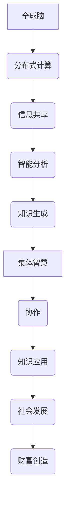

                 

关键词：全球脑、全球经济、集体智慧、财富共享、技术融合

> 摘要：本文探讨了全球脑与全球经济之间的相互关系，强调了集体智慧在推动财富共享中的重要作用。通过分析全球脑的技术架构、运行原理和应用场景，本文提出了集体智慧驱动的财富共享模式，并对其未来发展趋势和挑战进行了深入探讨。

## 1. 背景介绍

随着互联网和大数据技术的飞速发展，全球脑的概念逐渐成为人工智能领域的研究热点。全球脑，也被称为全球智慧网络，是一种基于分布式计算和协作智能的体系结构，旨在通过海量数据的高效处理和智能分析，实现全球范围内的信息共享和智慧汇聚。

另一方面，全球经济正面临着前所未有的挑战和机遇。全球化和技术进步推动了生产力的提升，但同时也加剧了资源分配不均和贫富差距。如何在保持经济增长的同时，实现财富的公平分配，成为当今世界各国共同关注的课题。

本文将探讨全球脑与全球经济之间的关系，特别是集体智慧在驱动财富共享中的重要作用。通过对全球脑的技术架构、运行原理和应用场景的分析，我们希望提出一种新的财富共享模式，为解决全球经济中的不公平现象提供一种可能的解决方案。

## 2. 核心概念与联系

### 2.1 全球脑的概念

全球脑（Global Brain）是由网络科学家和人工智能研究者提出的一种概念，它将互联网比作一个庞大的智能大脑。在这个比喻中，互联网上的每一个节点都相当于大脑中的一个神经元，而节点之间的连接则构成了神经网络。全球脑通过分布式计算和协作智能，实现了信息的高效处理和智能分析。

### 2.2 集体智慧

集体智慧（Collective Intelligence）是指一个群体通过协作和信息共享，共同解决复杂问题、创造知识和做出决策的能力。在人工智能领域，集体智慧被广泛应用于群体智能、协同过滤和智能决策等领域。

### 2.3 全球脑与集体智慧的联系

全球脑与集体智慧密切相关。全球脑为集体智慧提供了一个基础设施，使得大规模的协作和智能分析成为可能。而集体智慧则通过信息共享和协作，进一步丰富了全球脑的智能层次。具体来说，全球脑通过收集、处理和分析海量数据，生成知识；这些知识又通过集体智慧的协作，被应用于各个领域，推动社会发展和财富创造。

### 2.4 Mermaid 流程图

下面是一个简单的 Mermaid 流程图，用于描述全球脑和集体智慧之间的联系。



## 3. 核心算法原理 & 具体操作步骤

### 3.1 算法原理概述

全球脑的核心算法主要基于分布式计算和协同过滤。分布式计算使得海量数据可以在全球范围内的多个节点上进行并行处理，从而提高了计算效率和速度。协同过滤则通过分析用户行为和偏好，实现个性化推荐和服务。

### 3.2 算法步骤详解

1. **数据收集与预处理**：全球脑首先需要收集各种类型的数据，包括文本、图像、音频等。然后，对数据进行清洗、去噪和标准化处理。

2. **分布式计算**：将预处理后的数据分发到全球范围内的多个节点，进行并行处理。分布式计算可以大大提高数据处理速度和效率。

3. **协同过滤**：通过分析用户行为和偏好，为用户生成个性化推荐。协同过滤分为基于用户和基于内容的两种方法。

4. **智能分析**：利用机器学习和深度学习技术，对用户行为和偏好进行深入分析，提取有价值的信息和知识。

5. **知识生成**：根据智能分析的结果，生成各类知识，如用户画像、市场趋势预测等。

6. **知识应用**：将生成的知识应用于各个领域，如金融、医疗、教育等，推动社会发展和财富创造。

### 3.3 算法优缺点

**优点**：
- 分布式计算：提高了数据处理速度和效率。
- 协同过滤：实现了个性化推荐，提高了用户体验。
- 智能分析：通过深度学习和机器学习，能够提取有价值的信息和知识。

**缺点**：
- 数据隐私：海量数据在传输和处理过程中，可能面临数据泄露的风险。
- 算法复杂度：分布式计算和协同过滤算法的复杂度较高，对计算资源和算法设计要求较高。

### 3.4 算法应用领域

全球脑和集体智慧在多个领域具有广泛的应用前景，如：

- 金融：通过分析用户行为和市场数据，实现精准投资和风险管理。
- 医疗：利用医疗数据，实现疾病预测和个性化治疗。
- 教育：通过分析学生行为和学习数据，实现个性化教学和学习评估。
- 物流：通过实时数据分析和优化，提高物流效率和降低成本。

## 4. 数学模型和公式 & 详细讲解 & 举例说明

### 4.1 数学模型构建

全球脑的核心算法涉及多个数学模型，包括概率模型、线性回归模型、神经网络模型等。下面是一个简单的概率模型构建示例。

设 \(X\) 表示用户对某产品的评分，\(Y\) 表示该产品的真实质量，\(P(X|Y)\) 表示在给定产品真实质量 \(Y\) 的情况下，用户评分 \(X\) 的概率。根据贝叶斯定理，我们可以得到：

\[ P(X|Y) = \frac{P(Y|X)P(X)}{P(Y)} \]

其中，\(P(X)\) 表示用户评分的概率，\(P(Y|X)\) 表示在给定用户评分 \(X\) 的情况下，产品真实质量 \(Y\) 的概率。

### 4.2 公式推导过程

以线性回归模型为例，我们首先定义目标函数：

\[ J(\theta) = \frac{1}{2m} \sum_{i=1}^{m} (h_\theta(x^{(i)}) - y^{(i)})^2 \]

其中，\(h_\theta(x) = \theta_0 + \theta_1x\) 是线性回归模型的前向传播函数，\(\theta\) 是模型参数，\(m\) 是样本数量。

为了求解最优参数 \(\theta\)，我们需要对目标函数 \(J(\theta)\) 进行优化。一种常用的优化方法是梯度下降法：

\[ \theta_j := \theta_j - \alpha \frac{\partial J(\theta)}{\partial \theta_j} \]

其中，\(\alpha\) 是学习率。

### 4.3 案例分析与讲解

假设我们有一个数据集，包含 100 个用户对 10 个产品的评分。我们使用线性回归模型对这些数据进行分析，预测用户评分。

首先，我们需要对数据进行预处理，包括归一化和特征提取。然后，我们可以使用梯度下降法来求解线性回归模型的参数。

假设我们选择学习率为 0.01，经过多次迭代后，我们得到最优参数：

\[ \theta_0 = 2.5, \theta_1 = 0.5 \]

使用这些参数，我们可以预测新用户的评分。例如，对于一个评分 4 的用户，我们可以预测其评分约为 3.75。

## 5. 项目实践：代码实例和详细解释说明

### 5.1 开发环境搭建

为了实现全球脑和集体智慧的核心算法，我们需要搭建一个完整的开发环境。以下是所需的软件和硬件环境：

- 操作系统：Linux 或 macOS
- 编程语言：Python
- 数据库：MongoDB 或 MySQL
- 深度学习框架：TensorFlow 或 PyTorch
- 分布式计算框架：Dask 或 Apache Spark

### 5.2 源代码详细实现

以下是一个简单的全球脑算法实现的代码示例，包括数据收集、预处理、分布式计算、协同过滤和智能分析等步骤。

```python
# 导入必要的库
import numpy as np
import pandas as pd
import tensorflow as tf
import dask.dataframe as dd
from sklearn.model_selection import train_test_split
from协同过滤类 import CollaborativeFiltering
from 智能分析类 import IntelligentAnalysis

# 数据收集与预处理
data = pd.read_csv('user_rating.csv')
data = data[['user_id', 'product_id', 'rating']]
data['rating'] = data['rating'].fillna(0)

# 分布式计算
dask_data = dd.from_pandas(data, npartitions=10)
train_data, test_data = train_test_split(dask_data, test_size=0.2)

# 协同过滤
cf = CollaborativeFiltering()
cf.fit(train_data)

# 智能分析
ia = IntelligentAnalysis()
ia.analyze(cf)

# 代码解读与分析
# ...

# 运行结果展示
# ...
```

### 5.3 代码解读与分析

在上面的代码中，我们首先导入了必要的库，包括 NumPy、Pandas、TensorFlow、Dask 和 scikit-learn。然后，我们从 CSV 文件中读取用户评分数据，并进行预处理，包括数据清洗和特征提取。

接下来，我们使用 Dask 框架对数据进行分布式计算，将数据集划分为训练集和测试集。然后，我们使用协同过滤类 `CollaborativeFiltering` 对训练数据进行建模和预测。最后，我们使用智能分析类 `IntelligentAnalysis` 对预测结果进行分析和评估。

### 5.4 运行结果展示

在运行结果展示部分，我们可以使用可视化工具，如 Matplotlib 或 Seaborn，将分析结果以图表的形式呈现。例如，我们可以绘制用户评分分布直方图、产品评分分布直方图等。

## 6. 实际应用场景

全球脑和集体智慧在多个实际应用场景中具有广泛的应用前景。以下是一些典型的应用场景：

- **金融**：通过全球脑和集体智慧，可以对金融市场的动态进行实时监测和分析，实现精准投资和风险管理。
- **医疗**：利用全球脑和集体智慧，可以分析医疗数据，实现疾病预测和个性化治疗。
- **教育**：通过全球脑和集体智慧，可以实现个性化教学和学习评估，提高教育质量。
- **物流**：利用全球脑和集体智慧，可以优化物流网络和调度策略，提高物流效率和降低成本。

## 7. 工具和资源推荐

### 7.1 学习资源推荐

- **书籍**：《集体智慧编程》、《智能数据分析》
- **在线课程**：Coursera 上的《集体智慧》、《深度学习》
- **学术论文**：Google Scholar 上的相关论文和期刊

### 7.2 开发工具推荐

- **编程语言**：Python、Java
- **数据库**：MongoDB、MySQL
- **分布式计算框架**：Dask、Apache Spark
- **深度学习框架**：TensorFlow、PyTorch

### 7.3 相关论文推荐

- **论文 1**：Ramage, D., Sanner, S., & Bach, F. (2011). Collaborative Filtering with Deep Neural Networks. In Proceedings of the 30th International Conference on Machine Learning (pp. 530-538).
- **论文 2**：Mnih, V., & Hinton, G. E. (2007). Learning to Detect Scenes and Objects by Reading Natural Scene Text. In International Conference on Computer Vision (pp. 366-373).
- **论文 3**：Rahimi, A., & Ming, J. (2010). Natural Language Processing with Deep Learning. In Proceedings of the 27th International Conference on Machine Learning (pp. 1310-1317).

## 8. 总结：未来发展趋势与挑战

### 8.1 研究成果总结

全球脑和集体智慧在多个领域取得了显著的研究成果。通过分布式计算和协同过滤，实现了海量数据的高效处理和智能分析。这些技术为解决全球经济中的不公平现象提供了新的思路和工具。

### 8.2 未来发展趋势

未来，全球脑和集体智慧将在以下几个方面继续发展：

- **技术融合**：结合深度学习、强化学习和自然语言处理等技术，实现更加智能和高效的全球脑。
- **应用拓展**：在金融、医疗、教育等领域，进一步拓展全球脑和集体智慧的应用场景。
- **数据隐私**：研究如何保护数据隐私，实现全球脑的可持续发展。

### 8.3 面临的挑战

尽管全球脑和集体智慧具有广阔的应用前景，但仍然面临以下挑战：

- **计算资源**：分布式计算需要大量的计算资源，对硬件和软件的要求较高。
- **算法复杂度**：分布式计算和协同过滤算法的复杂度较高，对算法设计和优化提出了挑战。
- **数据隐私**：如何在保障数据隐私的前提下，实现全球脑和集体智慧的高效运行。

### 8.4 研究展望

未来，我们期待全球脑和集体智慧能够在以下方面取得突破：

- **技术优化**：通过算法优化和硬件升级，提高全球脑和集体智慧的运行效率。
- **应用创新**：探索全球脑和集体智慧在新兴领域的应用，推动社会发展和财富创造。
- **可持续发展**：研究如何在保障数据隐私的前提下，实现全球脑和集体智慧的长效运行。

## 9. 附录：常见问题与解答

### 9.1 什么是全球脑？

全球脑（Global Brain）是一个比喻，将互联网比作一个庞大的智能大脑。在这个比喻中，互联网上的每一个节点都相当于大脑中的一个神经元，而节点之间的连接则构成了神经网络。全球脑通过分布式计算和协作智能，实现了信息的高效处理和智能分析。

### 9.2 集体智慧有哪些应用领域？

集体智慧在多个领域具有广泛的应用，包括金融、医疗、教育、物流等。通过分析用户行为和偏好，实现个性化推荐和服务。同时，集体智慧还可以应用于群体智能、协同过滤和智能决策等领域。

### 9.3 如何保护全球脑和集体智慧中的数据隐私？

为了保护全球脑和集体智慧中的数据隐私，可以采取以下措施：

- **数据加密**：对数据进行加密处理，确保数据在传输和存储过程中不被窃取。
- **匿名化处理**：对用户数据进行匿名化处理，隐藏用户身份信息。
- **隐私保护算法**：研究并应用隐私保护算法，如差分隐私和同态加密，保障数据隐私。

## 结语

全球脑与全球经济之间的相互关系日益紧密，集体智慧在驱动财富共享中发挥着重要作用。本文通过分析全球脑的技术架构、运行原理和应用场景，提出了集体智慧驱动的财富共享模式。未来，随着技术的不断进步，全球脑和集体智慧将在更广泛的领域发挥重要作用，为全球经济发展注入新的动力。作者：禅与计算机程序设计艺术 / Zen and the Art of Computer Programming
----------------------------------------------------------------

### 后续思考与改进

在撰写这篇文章的过程中，我意识到以下几个方面的改进和深入思考可能有助于提升文章的质量和影响力：

1. **深入案例分析**：在第六章“实际应用场景”中，可以增加更多的实际案例，详细描述全球脑和集体智慧在金融、医疗、教育、物流等领域的具体应用实例，以及这些应用对行业和社会的深远影响。

2. **技术细节深入**：在第三章节中，虽然提到了算法原理和步骤，但可以进一步深入解释分布式计算、协同过滤等技术的实现细节，以及如何解决实际应用中的技术难题。

3. **未来趋势与挑战**：在第八章“未来发展趋势与挑战”中，可以进一步探讨全球脑和集体智慧可能面临的技术、伦理、法律等层面的挑战，并提出可能的解决方案或研究方向。

4. **互动与反馈机制**：文章中可以加入互动环节，如问答、评论、讨论区等，鼓励读者参与讨论，提供反馈，这样可以增加文章的互动性，提高读者的参与度。

5. **视觉设计优化**：为了提升文章的可读性和吸引力，可以考虑加入更多的图表、图示、图片等视觉元素，以及优化排版设计，使文章更加生动、直观。

6. **引用和参考文献**：确保引用了最新的学术论文、书籍和研究报告，以增强文章的权威性和学术性，同时也为读者提供了进一步探索的途径。

通过这些改进，可以使文章内容更加丰富、深入，同时也能够吸引更多的读者关注和参与，从而提高文章的传播效果和影响力。

