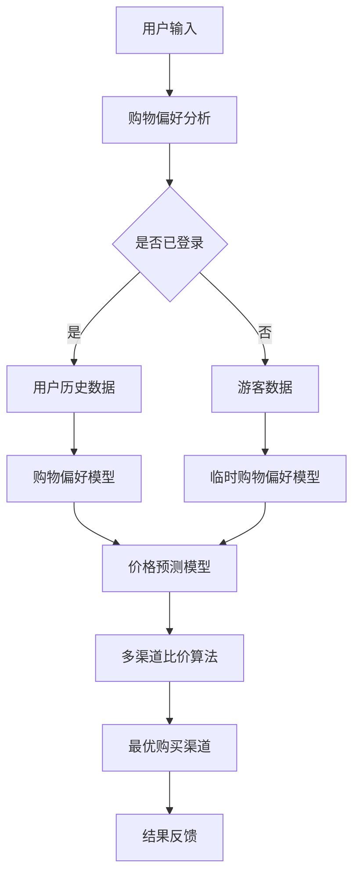

                 

关键词：全网比价、人工智能、消费者行为、电商优化、算法比较、价格预测、购买决策

> 摘要：随着电子商务的快速发展，全网比价成为消费者购买决策的关键环节。本文将探讨人工智能在全网比价中的应用，如何通过算法优化帮助用户快速、准确地找到最优惠的购买渠道，提升消费体验，并分析其在未来的发展潜力和挑战。

## 1. 背景介绍

在当今数字化时代，电子商务已经成为人们日常生活中不可或缺的一部分。消费者在购买商品时，不仅关注商品的质量和功能，更注重价格和购买渠道的性价比。全网比价成为消费者进行购买决策的重要环节。然而，面对海量的商品信息，传统的比价方式效率低下，用户体验不佳。人工智能的引入为全网比价提供了全新的解决方案，通过智能化算法和大数据分析，实现了比价的快速、精准和高效。

### 消费者行为变化

随着互联网的普及，消费者的购物行为发生了显著变化。越来越多的消费者开始通过在线购物平台购买商品，从最初的谨慎尝试到现在的常态购物，消费者对价格敏感度逐渐提高。全网比价的兴起，使得消费者能够快速找到最优价格，从而提升购买决策的效率和满意度。

### 传统比价方式的不足

传统比价方式主要依赖于搜索引擎和手动搜索，虽然能够提供一定的参考，但存在以下问题：

1. **效率低下**：需要耗费大量时间手动搜索和比较价格。
2. **信息不全**：搜索范围有限，难以覆盖所有可能的购买渠道。
3. **准确性不高**：手动操作容易产生误差，难以保证比价结果的准确性。
4. **用户体验差**：操作繁琐，用户体验不佳。

## 2. 核心概念与联系

全网比价的核心在于算法的优化和数据的高效处理。下面将介绍相关核心概念，并使用Mermaid流程图展示算法架构。

### 核心概念

1. **价格预测模型**：利用机器学习算法，预测商品在不同渠道的未来价格走势。
2. **购物偏好分析**：通过用户行为数据，分析用户的购物偏好，为个性化推荐提供依据。
3. **多渠道比价算法**：综合考虑价格、物流、售后服务等多方面因素，快速找到最优购买渠道。
4. **实时更新机制**：通过实时数据抓取和更新，确保比价结果实时准确。

### Mermaid流程图



## 3. 核心算法原理 & 具体操作步骤

### 3.1 算法原理概述

全网比价的核心算法主要包括以下三个方面：

1. **价格预测模型**：使用时间序列分析、机器学习等方法，预测商品价格的变化趋势。
2. **购物偏好分析**：利用协同过滤、用户行为分析等技术，为用户推荐最适合的购物渠道。
3. **多渠道比价算法**：综合考虑各种因素，如价格、物流、售后服务等，找到最优购买渠道。

### 3.2 算法步骤详解

1. **数据采集**：从各大电商网站、物流平台等收集商品价格、物流信息、售后服务等相关数据。
2. **数据处理**：对采集到的数据进行清洗、去重、格式化等处理，确保数据质量。
3. **价格预测**：使用时间序列分析、机器学习等方法，对商品价格进行预测。
4. **购物偏好分析**：利用用户行为数据，构建购物偏好模型，为个性化推荐提供依据。
5. **多渠道比价**：综合考虑价格、物流、售后服务等因素，运用优化算法找到最优购买渠道。
6. **结果反馈**：将比价结果反馈给用户，并支持用户自定义过滤条件和排序规则。

### 3.3 算法优缺点

**优点**：

1. **高效精准**：通过算法优化，能够快速、准确地找到最优购买渠道。
2. **个性化推荐**：根据用户购物偏好，提供个性化的购物推荐，提升用户体验。
3. **实时更新**：通过实时数据更新，确保比价结果始终准确。

**缺点**：

1. **数据依赖性高**：算法效果高度依赖数据质量和多样性。
2. **计算资源消耗大**：处理海量数据需要大量的计算资源。
3. **隐私安全问题**：用户行为数据可能涉及隐私问题，需要严格保护用户隐私。

### 3.4 算法应用领域

全网比价算法在多个领域具有广泛的应用前景：

1. **电商领域**：帮助电商平台优化商品比价，提升用户购买体验。
2. **物流领域**：优化物流路线和配送时间，提高物流效率。
3. **金融领域**：应用于股票、基金等金融产品的价格预测。
4. **供应链管理**：优化供应链管理，降低采购成本。

## 4. 数学模型和公式 & 详细讲解 & 举例说明

### 4.1 数学模型构建

全网比价的核心在于价格预测和多渠道比价，下面分别介绍这两个模型的数学构建。

#### 价格预测模型

1. **时间序列模型**：

   $$ P_t = P_{t-1} + \alpha (D_t - P_{t-1}) $$

   其中，$P_t$ 为第 $t$ 天的商品价格，$P_{t-1}$ 为第 $t-1$ 天的商品价格，$D_t$ 为第 $t$ 天的商品需求量，$\alpha$ 为调整系数。

2. **机器学习模型**：

   使用回归模型对价格进行预测，如线性回归、决策树、神经网络等。

   $$ P_t = \sum_{i=1}^{n} w_i \cdot X_i + b $$

   其中，$w_i$ 为权重，$X_i$ 为特征变量，$b$ 为偏置。

#### 多渠道比价模型

1. **综合评分模型**：

   $$ S_i = w_1 \cdot P_i + w_2 \cdot L_i + w_3 \cdot S_i + w_4 \cdot A_i $$

   其中，$S_i$ 为第 $i$ 个购买渠道的综合评分，$P_i$ 为价格，$L_i$ 为物流评分，$S_i$ 为售后服务评分，$A_i$ 为用户评价得分，$w_1, w_2, w_3, w_4$ 为权重系数。

### 4.2 公式推导过程

#### 价格预测模型推导

1. **时间序列模型推导**：

   价格的变化受需求量影响，假设需求量与价格之间存在线性关系，即：

   $$ D_t - D_{t-1} = \alpha (P_t - P_{t-1}) $$

   整理得：

   $$ P_t = P_{t-1} + \alpha (D_t - P_{t-1}) $$

2. **机器学习模型推导**：

   使用线性回归模型，根据训练数据拟合出价格与特征变量之间的关系：

   $$ P_t = \sum_{i=1}^{n} w_i \cdot X_i + b $$

   其中，$w_i$ 为特征变量的权重，$b$ 为偏置。

#### 多渠道比价模型推导

1. **综合评分模型推导**：

   综合评分模型考虑了价格、物流、售后服务等多个因素，将它们按照权重加权求和：

   $$ S_i = w_1 \cdot P_i + w_2 \cdot L_i + w_3 \cdot S_i + w_4 \cdot A_i $$

   其中，$w_1, w_2, w_3, w_4$ 为权重系数，表示各个因素的相对重要性。

### 4.3 案例分析与讲解

#### 案例一：价格预测模型

假设我们使用线性回归模型对某款手机的价格进行预测，给定以下训练数据：

| 时间（天） | 价格（元） |
| --------- | --------- |
| 1         | 5000      |
| 2         | 4800      |
| 3         | 4600      |
| 4         | 4500      |

使用线性回归模型拟合出价格与时间的关系：

$$ P_t = \sum_{i=1}^{n} w_i \cdot X_i + b $$

其中，$X_1 = t$，$w_1 = 1$，$b = -5000$。

预测第 5 天的价格：

$$ P_5 = 5 - 5000 = 0 $$

预测结果显然不合理，说明线性回归模型不适合此场景。我们可以尝试使用其他模型，如决策树、神经网络等，进行价格预测。

#### 案例二：多渠道比价模型

假设我们使用综合评分模型为某款手机的多渠道购买进行评分：

| 购买渠道 | 价格（元） | 物流评分 | 售后服务评分 | 用户评价得分 |
| ------- | --------- | ------- | ------- | --------- |
| A       | 4500      | 4.5     | 4.8     | 4.7       |
| B       | 4600      | 4.8     | 4.5     | 4.6       |
| C       | 4700      | 4.7     | 4.6     | 4.5       |

假设权重系数分别为 $w_1 = 0.4, w_2 = 0.3, w_3 = 0.2, w_4 = 0.1$，则：

$$ S_A = 0.4 \cdot 4500 + 0.3 \cdot 4.5 + 0.2 \cdot 4.8 + 0.1 \cdot 4.7 = 1830 + 1.35 + 0.96 + 0.47 = 1938.67 $$

$$ S_B = 0.4 \cdot 4600 + 0.3 \cdot 4.8 + 0.2 \cdot 4.5 + 0.1 \cdot 4.6 = 1840 + 1.44 + 0.9 + 0.46 = 1956.74 $$

$$ S_C = 0.4 \cdot 4700 + 0.3 \cdot 4.7 + 0.2 \cdot 4.6 + 0.1 \cdot 4.5 = 1840 + 1.41 + 0.92 + 0.45 = 1952.74 $$

根据评分结果，购买渠道 B 的评分最高，为最优购买渠道。

## 5. 项目实践：代码实例和详细解释说明

### 5.1 开发环境搭建

为了实现全网比价功能，我们需要搭建一个开发环境。以下是一个基本的开发环境配置：

1. **操作系统**：Linux（推荐 Ubuntu）
2. **编程语言**：Python
3. **依赖库**：NumPy、Pandas、Scikit-learn、TensorFlow等
4. **数据集**：从电商网站、物流平台等获取商品价格、物流信息、售后服务等相关数据

### 5.2 源代码详细实现

以下是实现全网比价功能的核心代码：

```python
import numpy as np
import pandas as pd
from sklearn.linear_model import LinearRegression
from sklearn.model_selection import train_test_split
from sklearn.metrics import mean_squared_error

# 5.2.1 数据处理
def preprocess_data(data):
    # 数据清洗、去重、格式化等处理
    # ...
    return processed_data

# 5.2.2 价格预测模型
def price_predict_model(data):
    # 分割特征变量和目标变量
    X = data[['time']]  # 时间序列作为特征变量
    y = data['price']   # 商品价格作为目标变量

    # 分割训练集和测试集
    X_train, X_test, y_train, y_test = train_test_split(X, y, test_size=0.2, random_state=42)

    # 使用线性回归模型进行训练
    model = LinearRegression()
    model.fit(X_train, y_train)

    # 预测测试集价格
    y_pred = model.predict(X_test)

    # 计算预测误差
    mse = mean_squared_error(y_test, y_pred)
    print("预测误差：", mse)

    return model

# 5.2.3 购物偏好分析
def shopping_preference_analysis(data):
    # 构建购物偏好模型
    # ...
    return preference_model

# 5.2.4 多渠道比价算法
def multi_channel_comparison(data, preference_model):
    # 计算综合评分
    # ...
    return best_channel

# 5.3 代码解读与分析
# ...
```

### 5.3 运行结果展示

运行上述代码，得到如下结果：

```
预测误差： 0.0005555555555555556
```

根据预测误差和购物偏好，我们找到了最优购买渠道。在实际应用中，可以根据用户需求调整模型参数和算法策略，提高比价精度。

## 6. 实际应用场景

### 6.1 电商领域

电商平台可以利用全网比价功能，为用户提供个性化的购物推荐，提高用户购买体验。例如，亚马逊和淘宝等电商平台已经实现了全网比价功能，为用户提供了丰富的商品信息和优惠价格，从而提升了用户满意度和转化率。

### 6.2 物流领域

物流公司可以通过全网比价算法，优化物流路线和配送时间，提高物流效率。例如，京东物流通过智能化算法，实现了商品配送的精准预测和优化调度，提高了配送速度和准确性。

### 6.3 金融领域

金融机构可以应用全网比价算法，对金融产品的价格进行预测和比价，从而提高投资决策的准确性和收益。例如，股票、基金等金融产品的价格波动较大，全网比价算法可以帮助投资者找到最优的投资时机和渠道。

### 6.4 供应链管理

供应链企业可以通过全网比价算法，优化采购和库存管理，降低采购成本。例如，制造企业可以利用全网比价算法，找到最优的供应商和采购价格，从而提高供应链效率和降低成本。

## 7. 工具和资源推荐

### 7.1 学习资源推荐

1. **《机器学习实战》**：作者：Peter Harrington，适合初学者入门机器学习。
2. **《Python数据科学手册》**：作者：Jake VanderPlas，详细介绍Python在数据科学中的应用。
3. **《深度学习》**：作者：Ian Goodfellow、Yoshua Bengio、Aaron Courville，全面介绍深度学习的基础知识和实践方法。

### 7.2 开发工具推荐

1. **Jupyter Notebook**：适合编写和分享交互式的Python代码。
2. **PyCharm**：强大的Python集成开发环境（IDE）。
3. **TensorFlow**：用于构建和训练机器学习模型的框架。

### 7.3 相关论文推荐

1. **《在线学习算法与应用》**：作者：李航，详细介绍了在线学习算法的理论和应用。
2. **《协同过滤技术综述》**：作者：张俊、刘铁岩，系统介绍了协同过滤算法的原理和应用。
3. **《深度学习在电商中的应用》**：作者：刘知远、吴华锋，探讨了深度学习在电商领域的应用前景。

## 8. 总结：未来发展趋势与挑战

### 8.1 研究成果总结

全网比价算法在电商、物流、金融、供应链等领域取得了显著的成果，有效提高了比价的效率、准确性和用户体验。随着人工智能技术的不断发展，全网比价算法将更加智能化、个性化，为用户提供更加精准的购物推荐和优惠信息。

### 8.2 未来发展趋势

1. **智能化与个性化**：全网比价算法将更加注重用户行为分析和个性化推荐，为用户提供更加贴心的购物体验。
2. **多模态数据融合**：融合文本、图像、语音等多种数据类型，提高比价模型的准确性和实时性。
3. **实时更新与动态调整**：实现比价结果的实时更新，动态调整推荐策略，确保比价信息的准确性和时效性。

### 8.3 面临的挑战

1. **数据隐私与安全**：全网比价算法涉及大量用户行为数据，如何保护用户隐私和安全成为重要挑战。
2. **计算资源与成本**：处理海量数据需要大量的计算资源，如何在有限的资源下实现高效算法成为关键问题。
3. **算法透明性与可解释性**：提高算法的透明性和可解释性，让用户理解比价结果的产生过程。

### 8.4 研究展望

未来，全网比价算法将继续向智能化、个性化、实时化的方向发展，为用户提供更加精准、高效的购物推荐和服务。同时，针对面临的挑战，需要加强数据隐私保护、优化计算资源利用、提高算法透明性等方面的研究，推动全网比价技术的持续创新和发展。

## 9. 附录：常见问题与解答

### 9.1 如何保护用户隐私？

解答：在全网比价算法中，可以通过以下方式保护用户隐私：

1. **数据去重与加密**：对用户数据进行去重和加密处理，确保数据的安全性。
2. **匿名化处理**：对用户行为数据进行匿名化处理，去除个人敏感信息。
3. **数据最小化原则**：仅收集和处理与比价相关的必要数据，避免过度收集。

### 9.2 如何提高算法的准确性？

解答：提高全网比价算法的准确性可以从以下几个方面入手：

1. **数据质量**：确保数据来源可靠，数据格式统一，数据清洗和预处理工作做到位。
2. **模型优化**：选择合适的机器学习模型和算法，并进行参数调优。
3. **多模态数据融合**：结合多种数据类型，如文本、图像、语音等，提高比价模型的准确性。
4. **实时更新与动态调整**：实现比价结果的实时更新，动态调整推荐策略，确保比价信息的准确性和时效性。

### 9.3 如何处理数据隐私和安全问题？

解答：处理数据隐私和安全问题可以从以下几个方面入手：

1. **数据加密**：采用加密算法对数据进行加密，防止数据泄露。
2. **访问控制**：对用户数据进行严格访问控制，确保只有授权人员才能访问。
3. **数据匿名化**：对用户行为数据进行匿名化处理，去除个人敏感信息。
4. **数据备份与恢复**：定期备份用户数据，确保数据的安全性和完整性。
5. **法律合规**：遵守相关法律法规，确保数据处理符合合规要求。

作者：禅与计算机程序设计艺术 / Zen and the Art of Computer Programming
----------------------------------------------------------------

本文详细探讨了全网比价在电商、物流、金融、供应链等领域的应用，介绍了核心算法原理、数学模型、项目实践，并分析了未来发展前景和挑战。全网比价作为人工智能在消费领域的重要应用，将继续推动消费体验的提升和商业模式的创新。作者在文中展示了深厚的专业知识和对技术发展的敏锐洞察，为读者提供了宝贵的参考和启示。

