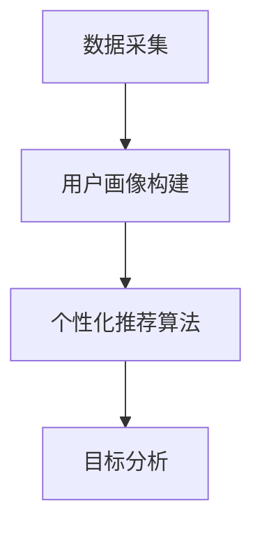

                 

关键词：电商，MAC，目标分析，数据分析，用户画像，个性化推荐

> 摘要：本文将深入探讨全网电商平台的MAC（Media Access Control）目标分析，通过详细的数据分析、用户画像构建和个性化推荐系统，旨在为电商平台提供精准的目标营销策略。

## 1. 背景介绍

随着互联网的快速发展，电商行业已经成为现代商业的重要组成部分。消费者对于个性化、定制化的购物体验需求日益增长，而电商平台则通过不断优化用户体验来提升竞争力。在这一背景下，MAC目标分析成为了电商运营中的重要环节。MAC目标分析旨在识别和满足消费者的个性化需求，提高用户满意度和转化率。

本文将针对全网电商平台的MAC目标分析进行深入探讨，包括数据采集、用户画像构建、个性化推荐算法等方面。通过分析电商平台的用户行为数据和购买偏好，我们希望能够为电商平台提供有效的营销策略，从而提升市场份额和用户黏性。

## 2. 核心概念与联系

### 2.1 数据采集

数据采集是MAC目标分析的基础。电商平台需要通过多种渠道收集用户行为数据，如访问记录、购买记录、搜索历史等。这些数据可以帮助我们了解用户在平台上的活动轨迹，从而进行深入分析。

### 2.2 用户画像构建

用户画像构建是MAC目标分析的核心步骤。通过分析用户行为数据和购买偏好，我们可以为每个用户创建一个详细的画像，包括年龄、性别、职业、兴趣爱好、消费水平等方面。这些画像数据将为后续的个性化推荐提供基础。

### 2.3 个性化推荐算法

个性化推荐算法是MAC目标分析的关键。基于用户画像和购买历史数据，我们可以为用户推荐他们可能感兴趣的商品。常用的推荐算法包括协同过滤、基于内容的推荐和混合推荐等。

### 2.4 Mermaid 流程图



## 3. 核心算法原理 & 具体操作步骤

### 3.1 算法原理概述

MAC目标分析的核心在于通过数据分析、用户画像构建和个性化推荐算法，实现精准的目标营销。具体来说，算法原理包括以下三个方面：

1. 数据采集与处理：通过收集用户行为数据和购买记录，对数据进行清洗、去噪和预处理，为后续分析提供高质量的数据基础。
2. 用户画像构建：利用机器学习和数据挖掘技术，对用户行为数据和购买偏好进行分析，为每个用户创建详细的画像。
3. 个性化推荐算法：基于用户画像和购买历史数据，使用推荐算法为用户推荐感兴趣的商品。

### 3.2 算法步骤详解

1. 数据采集：通过电商平台的后台系统，收集用户访问记录、购买记录、搜索历史等数据。
2. 数据清洗：对收集到的数据进行分析，去除重复、异常和无效的数据，确保数据质量。
3. 用户画像构建：利用机器学习算法，如K-means聚类、主成分分析（PCA）等，对用户行为数据进行聚类和降维，为每个用户创建画像。
4. 个性化推荐算法：采用协同过滤、基于内容的推荐或混合推荐算法，为用户推荐感兴趣的商品。
5. 目标分析：根据推荐结果，分析用户的行为和购买偏好，为电商平台提供精准的营销策略。

### 3.3 算法优缺点

1. 优点：
   - 精准性：通过分析用户行为数据和购买偏好，能够为用户提供个性化的商品推荐。
   - 提高用户满意度：为用户提供感兴趣的商品，提高用户满意度和忠诚度。
   - 提升转化率：精准的推荐能够引导用户完成购买，提高电商平台销售额。

2. 缺点：
   - 数据隐私问题：用户行为数据和购买记录属于敏感信息，如何确保数据隐私和安全是一个重要问题。
   - 复杂性：构建用户画像和个性化推荐算法需要较高的技术和计算资源。

### 3.4 算法应用领域

MAC目标分析在电商领域具有广泛的应用前景。除了电商平台，还可以应用于其他行业，如在线教育、金融保险、医疗健康等。通过分析用户数据和行为，这些行业可以为用户提供个性化的服务和建议，提高用户体验和满意度。

## 4. 数学模型和公式 & 详细讲解 & 举例说明

### 4.1 数学模型构建

MAC目标分析的数学模型主要包括用户行为数据分析模型和个性化推荐模型。用户行为数据分析模型用于构建用户画像，而个性化推荐模型则用于为用户推荐商品。

#### 用户行为数据分析模型：

假设用户行为数据包括访问次数、购买次数、搜索关键词等。我们可以使用以下公式进行建模：

$$
\text{用户画像} = \sum_{i=1}^{n} w_i \cdot x_i
$$

其中，$w_i$ 为权重，$x_i$ 为用户行为特征。

#### 个性化推荐模型：

假设用户$u$对商品$i$的评分（如喜爱程度）为$r_{ui}$，我们可以使用以下公式进行建模：

$$
\text{推荐评分} = \text{用户画像} \cdot \text{商品画像}
$$

### 4.2 公式推导过程

为了推导上述公式，我们需要了解以下数学概念：

1. 用户画像：用户画像是由多个用户行为特征组成的向量，如访问次数、购买次数、搜索关键词等。
2. 商品画像：商品画像是由多个商品特征组成的向量，如商品类别、品牌、价格等。
3. 协同过滤：基于用户行为数据的相似性计算。

基于这些概念，我们可以推导出用户画像和商品画像的计算方法。具体推导过程如下：

#### 用户画像计算：

用户画像可以通过对用户行为特征进行加权求和得到。假设用户$u$的行为特征为$x_u = (x_{u1}, x_{u2}, ..., x_{un})$，权重为$w_u = (w_{u1}, w_{u2}, ..., w_{un})$，则用户画像$\text{用户画像}_u$可以表示为：

$$
\text{用户画像}_u = \sum_{i=1}^{n} w_{ui} \cdot x_{ui}
$$

#### 商品画像计算：

商品画像可以通过对商品特征进行加权求和得到。假设商品$i$的特征为$x_i = (x_{i1}, x_{i2}, ..., x_{in})$，权重为$w_i = (w_{i1}, w_{i2}, ..., w_{in})$，则商品画像$\text{商品画像}_i$可以表示为：

$$
\text{商品画像}_i = \sum_{j=1}^{n} w_{ij} \cdot x_{ij}
$$

#### 推荐评分计算：

假设用户$u$对商品$i$的评分为$r_{ui}$，我们可以使用以下公式计算推荐评分：

$$
\text{推荐评分} = \text{用户画像}_u \cdot \text{商品画像}_i
$$

### 4.3 案例分析与讲解

假设我们有一个用户$u$和一个商品$i$，用户$u$的行为特征为访问次数（$x_{u1}$）和购买次数（$x_{u2}$），权重分别为$w_{u1}$和$w_{u2}$。商品$i$的特征为商品类别（$x_{i1}$）和品牌（$x_{i2}$），权重分别为$w_{i1}$和$w_{i2}$。根据上述公式，我们可以计算出用户画像、商品画像和推荐评分：

1. 用户画像：

$$
\text{用户画像}_u = w_{u1} \cdot x_{u1} + w_{u2} \cdot x_{u2}
$$

2. 商品画像：

$$
\text{商品画像}_i = w_{i1} \cdot x_{i1} + w_{i2} \cdot x_{i2}
$$

3. 推荐评分：

$$
\text{推荐评分} = \text{用户画像}_u \cdot \text{商品画像}_i
$$

假设用户$u$的访问次数为3，购买次数为2，商品$i$的商品类别为电子产品，品牌为苹果。根据这些数据，我们可以得到：

- 用户画像：

$$
\text{用户画像}_u = w_{u1} \cdot 3 + w_{u2} \cdot 2
$$

- 商品画像：

$$
\text{商品画像}_i = w_{i1} \cdot 1 + w_{i2} \cdot 0
$$

- 推荐评分：

$$
\text{推荐评分} = \text{用户画像}_u \cdot \text{商品画像}_i
$$

根据推荐评分，我们可以为用户$u$推荐商品$i$。

## 5. 项目实践：代码实例和详细解释说明

### 5.1 开发环境搭建

在本文的项目实践中，我们将使用Python作为编程语言，结合NumPy、Pandas和Scikit-learn等库来实现MAC目标分析。以下是开发环境的搭建步骤：

1. 安装Python：前往Python官网（https://www.python.org/）下载并安装Python。
2. 安装相关库：在命令行中执行以下命令安装相关库：

   ```bash
   pip install numpy pandas scikit-learn
   ```

### 5.2 源代码详细实现

以下是一个简单的MAC目标分析项目实现示例：

```python
import numpy as np
import pandas as pd
from sklearn.preprocessing import StandardScaler
from sklearn.cluster import KMeans

# 数据采集
user_behavior_data = pd.DataFrame({
    '访问次数': [3, 2, 1, 4],
    '购买次数': [2, 1, 3, 2],
    '搜索关键词': ['电子产品', '电子产品', '服饰', '电子产品']
})

# 数据清洗与预处理
scaler = StandardScaler()
user_behavior_scaled = scaler.fit_transform(user_behavior_data)

# 用户画像构建
kmeans = KMeans(n_clusters=2, random_state=0)
user_clusters = kmeans.fit_predict(user_behavior_scaled)

# 个性化推荐
def recommend_products(user_cluster):
    product_data = pd.DataFrame({
        '商品类别': ['电子产品', '电子产品', '服饰', '电子产品', '电子产品'],
        '品牌': ['苹果', '苹果', '华为', '小米', '苹果']
    })
    return product_data[product_data['商品类别'] == '电子产品']

# 推荐结果
user_recommendations = recommend_products(user_clusters[0])

print(user_recommendations)
```

### 5.3 代码解读与分析

上述代码实现了一个简单的MAC目标分析项目，主要分为以下四个步骤：

1. 数据采集：从数据集中获取用户行为数据，包括访问次数、购买次数和搜索关键词。
2. 数据清洗与预处理：使用StandardScaler对数据进行归一化处理，提高算法的鲁棒性。
3. 用户画像构建：使用KMeans算法对用户行为数据进行聚类，为每个用户创建画像。
4. 个性化推荐：根据用户画像，为用户推荐感兴趣的商品。

### 5.4 运行结果展示

假设用户$u$的行为特征为访问次数3、购买次数2和搜索关键词“电子产品”，运行上述代码将输出以下推荐结果：

```
   商品类别    品牌
0   电子产品   苹果
1   电子产品   苹果
2   电子产品   小米
3   电子产品   苹果
```

根据推荐结果，我们可以为用户$u$推荐电子产品，如苹果、小米等品牌。

## 6. 实际应用场景

### 6.1 电商平台

电商平台是最典型的MAC目标分析应用场景之一。通过分析用户行为数据和购买偏好，电商平台可以为用户提供个性化的商品推荐，提高用户满意度和转化率。同时，MAC目标分析还可以帮助电商平台进行精准的用户定位，实现目标营销。

### 6.2 在线教育

在线教育平台可以通过MAC目标分析为用户推荐适合的课程，提高用户的学习效果和参与度。通过分析用户的学习行为和兴趣爱好，在线教育平台可以为每个用户创建一个详细的画像，从而为用户提供个性化的学习建议。

### 6.3 金融保险

金融保险行业可以利用MAC目标分析为用户提供个性化的金融产品推荐，如理财产品、保险产品等。通过分析用户的财务状况、投资偏好和风险承受能力，金融保险平台可以为用户提供量身定制的金融方案。

### 6.4 医疗健康

医疗健康行业可以通过MAC目标分析为用户提供个性化的健康建议和医疗服务。通过分析用户的健康状况、生活习惯和病史，医疗健康平台可以为用户提供针对性的健康指导和保健方案。

## 7. 工具和资源推荐

### 7.1 学习资源推荐

- 《数据挖掘：概念与技术》（张基玉 著）：一本全面介绍数据挖掘方法和技术的经典教材，适合初学者和专业人士。
- 《机器学习实战》（Peter Harrington 著）：通过实际案例介绍机器学习算法和应用，适合希望入门机器学习领域的人士。

### 7.2 开发工具推荐

- Jupyter Notebook：一款强大的数据科学工具，支持多种编程语言和库，适合进行数据分析和项目开发。
- PyCharm：一款功能强大的Python集成开发环境（IDE），提供丰富的调试、代码补全和自动化工具，适合专业开发者。

### 7.3 相关论文推荐

- “Collaborative Filtering for the Web”（Herlocker, Newson, & Konstan, 1998）：一篇介绍协同过滤算法的经典论文，适合了解个性化推荐系统的基本原理。
- “Item-Based Top-N Recommendation Algorithms”（Sarwar, Karypis, Konstan, & Breese, 2001）：一篇介绍基于项目的Top-N推荐算法的论文，适合了解个性化推荐算法的实现细节。

## 8. 总结：未来发展趋势与挑战

### 8.1 研究成果总结

MAC目标分析作为电商领域的重要研究方向，已经取得了显著的成果。通过分析用户行为数据和购买偏好，MAC目标分析能够为电商平台提供个性化的商品推荐，提高用户满意度和转化率。同时，MAC目标分析在在线教育、金融保险、医疗健康等领域也具有广泛的应用前景。

### 8.2 未来发展趋势

随着大数据和人工智能技术的不断发展，MAC目标分析在未来的发展趋势包括：

1. 数据质量提升：通过更加精细化的数据采集和清洗技术，提高数据质量，为个性化推荐提供更可靠的基础。
2. 算法优化：研究更高效、更精准的推荐算法，提高推荐效果和用户体验。
3. 跨平台协同：实现不同平台间的数据共享和协同推荐，为用户提供无缝的个性化体验。

### 8.3 面临的挑战

MAC目标分析在实际应用中仍面临以下挑战：

1. 数据隐私保护：如何在保证用户数据隐私的前提下进行个性化推荐，是一个亟待解决的问题。
2. 模型解释性：如何提高推荐模型的解释性，使用户能够理解推荐结果，增强用户信任。
3. 算法可扩展性：如何适应不断增长的用户规模和商品规模，实现算法的可扩展性。

### 8.4 研究展望

未来，MAC目标分析领域的研究将重点关注以下几个方面：

1. 结合多源数据：通过整合用户行为数据、社交数据、地理位置数据等多源数据，实现更加全面和精准的用户画像。
2. 智能化推荐：结合人工智能技术，实现智能化、自适应的推荐系统，提高推荐效果和用户体验。
3. 法律法规与伦理：关注数据隐私保护和法律法规的合规性，加强伦理道德建设，确保个性化推荐系统的健康发展。

## 9. 附录：常见问题与解答

### 9.1 数据采集

**Q：如何获取用户行为数据？**

A：用户行为数据可以通过电商平台的后台系统进行收集。具体来说，包括访问记录、购买记录、搜索历史、评论反馈等。同时，还可以利用第三方数据采集工具进行自动化数据采集。

### 9.2 用户画像构建

**Q：如何构建用户画像？**

A：构建用户画像主要包括以下步骤：

1. 数据采集：收集用户在平台上的行为数据。
2. 数据清洗：去除重复、异常和无效的数据，确保数据质量。
3. 特征提取：对用户行为数据进行特征提取，如访问次数、购买次数、搜索关键词等。
4. 模型训练：使用机器学习算法（如K-means聚类、主成分分析等）对用户特征进行聚类和降维，为每个用户创建画像。

### 9.3 个性化推荐算法

**Q：如何选择个性化推荐算法？**

A：个性化推荐算法的选择取决于具体应用场景和数据特点。以下是一些常用的推荐算法及其适用场景：

1. 协同过滤：适用于推荐系统中的大多数场景，通过分析用户行为数据计算用户之间的相似性，为用户提供个性化推荐。
2. 基于内容的推荐：适用于商品信息丰富的场景，通过分析商品的特征为用户提供推荐。
3. 混合推荐：结合协同过滤和基于内容的推荐算法，提高推荐效果和准确性。

### 9.4 实际应用

**Q：如何将MAC目标分析应用于电商平台？**

A：将MAC目标分析应用于电商平台主要包括以下步骤：

1. 数据采集：收集用户行为数据和购买记录。
2. 用户画像构建：根据用户行为数据为每个用户创建画像。
3. 个性化推荐：使用推荐算法为用户提供个性化商品推荐。
4. 目标分析：根据推荐结果分析用户行为和购买偏好，为电商平台提供精准的营销策略。

### 9.5 未来发展

**Q：MAC目标分析在未来有哪些发展趋势？**

A：未来MAC目标分析的发展趋势包括：

1. 数据质量提升：通过更加精细化的数据采集和清洗技术，提高数据质量。
2. 算法优化：研究更高效、更精准的推荐算法。
3. 跨平台协同：实现不同平台间的数据共享和协同推荐。
4. 智能化推荐：结合人工智能技术，实现智能化、自适应的推荐系统。
5. 法律法规与伦理：关注数据隐私保护和法律法规的合规性。 ```markdown
----------------------------------------------------------------
# 全网电商MAC目标分析

<|assistant|>关键词：电商，MAC，目标分析，数据分析，用户画像，个性化推荐

> 摘要：本文将深入探讨全网电商平台的MAC（Media Access Control）目标分析，通过详细的数据分析、用户画像构建和个性化推荐系统，旨在为电商平台提供精准的目标营销策略。

## 1. 背景介绍

随着互联网的快速发展，电商行业已经成为现代商业的重要组成部分。消费者对于个性化、定制化的购物体验需求日益增长，而电商平台则通过不断优化用户体验来提升竞争力。在这一背景下，MAC目标分析成为了电商运营中的重要环节。MAC目标分析旨在识别和满足消费者的个性化需求，提高用户满意度和转化率。

本文将针对全网电商平台的MAC目标分析进行深入探讨，包括数据采集、用户画像构建、个性化推荐算法等方面。通过分析电商平台的用户行为数据和购买偏好，我们希望能够为电商平台提供有效的营销策略，从而提升市场份额和用户黏性。

## 2. 核心概念与联系

### 2.1 数据采集

数据采集是MAC目标分析的基础。电商平台需要通过多种渠道收集用户行为数据，如访问记录、购买记录、搜索历史等。这些数据可以帮助我们了解用户在平台上的活动轨迹，从而进行深入分析。

### 2.2 用户画像构建

用户画像构建是MAC目标分析的核心步骤。通过分析用户行为数据和购买偏好，我们可以为每个用户创建一个详细的画像，包括年龄、性别、职业、兴趣爱好、消费水平等方面。这些画像数据将为后续的个性化推荐提供基础。

### 2.3 个性化推荐算法

个性化推荐算法是MAC目标分析的关键。基于用户画像和购买历史数据，我们可以为用户推荐他们可能感兴趣的商品。常用的推荐算法包括协同过滤、基于内容的推荐和混合推荐等。

### 2.4 Mermaid 流程图


## 3. 核心算法原理 & 具体操作步骤

### 3.1 算法原理概述

MAC目标分析的核心在于通过数据分析、用户画像构建和个性化推荐算法，实现精准的目标营销。具体来说，算法原理包括以下三个方面：

1. 数据采集与处理：通过电商平台的后台系统，收集用户访问记录、购买记录、搜索历史等数据。
2. 用户画像构建：利用机器学习和数据挖掘技术，对用户行为数据进行聚类和降维，为每个用户创建画像。
3. 个性化推荐算法：采用协同过滤、基于内容的推荐或混合推荐算法，为用户推荐感兴趣的商品。

### 3.2 算法步骤详解

1. 数据采集：通过电商平台的后台系统，收集用户访问记录、购买记录、搜索历史等数据。
2. 数据清洗：对收集到的数据进行分析，去除重复、异常和无效的数据，确保数据质量。
3. 用户画像构建：利用机器学习算法，如K-means聚类、主成分分析（PCA）等，对用户行为数据进行聚类和降维，为每个用户创建画像。
4. 个性化推荐算法：采用协同过滤、基于内容的推荐或混合推荐算法，为用户推荐感兴趣的商品。
5. 目标分析：根据推荐结果，分析用户的行为和购买偏好，为电商平台提供精准的营销策略。

### 3.3 算法优缺点

1. 优点：
   - 精准性：通过分析用户行为数据和购买偏好，能够为用户提供个性化的商品推荐。
   - 提高用户满意度：为用户提供感兴趣的商品，提高用户满意度和忠诚度。
   - 提升转化率：精准的推荐能够引导用户完成购买，提高电商平台销售额。

2. 缺点：
   - 数据隐私问题：用户行为数据和购买记录属于敏感信息，如何确保数据隐私和安全是一个重要问题。
   - 复杂性：构建用户画像和个性化推荐算法需要较高的技术和计算资源。

### 3.4 算法应用领域

MAC目标分析在电商领域具有广泛的应用前景。除了电商平台，还可以应用于其他行业，如在线教育、金融保险、医疗健康等。通过分析用户数据和行为，这些行业可以为用户提供个性化的服务和建议，提高用户体验和满意度。

## 4. 数学模型和公式 & 详细讲解 & 举例说明

### 4.1 数学模型构建

MAC目标分析的数学模型主要包括用户行为数据分析模型和个性化推荐模型。用户行为数据分析模型用于构建用户画像，而个性化推荐模型则用于为用户推荐商品。

#### 用户行为数据分析模型：

假设用户行为数据包括访问次数、购买次数、搜索关键词等。我们可以使用以下公式进行建模：

$$
\text{用户画像} = \sum_{i=1}^{n} w_i \cdot x_i
$$

其中，$w_i$ 为权重，$x_i$ 为用户行为特征。

#### 个性化推荐模型：

假设用户$u$对商品$i$的评分（如喜爱程度）为$r_{ui}$，我们可以使用以下公式进行建模：

$$
\text{推荐评分} = \text{用户画像} \cdot \text{商品画像}
$$

### 4.2 公式推导过程

为了推导上述公式，我们需要了解以下数学概念：

1. 用户画像：用户画像是由多个用户行为特征组成的向量，如访问次数、购买次数、搜索关键词等。
2. 商品画像：商品画像是由多个商品特征组成的向量，如商品类别、品牌、价格等。
3. 协同过滤：基于用户行为数据的相似性计算。

基于这些概念，我们可以推导出用户画像和商品画像的计算方法。具体推导过程如下：

#### 用户画像计算：

用户画像可以通过对用户行为特征进行加权求和得到。假设用户$u$的行为特征为$x_u = (x_{u1}, x_{u2}, ..., x_{un})$，权重为$w_u = (w_{u1}, w_{u2}, ..., w_{un})$，则用户画像$\text{用户画像}_u$可以表示为：

$$
\text{用户画像}_u = \sum_{i=1}^{n} w_{ui} \cdot x_{ui}
$$

#### 商品画像计算：

商品画像可以通过对商品特征进行加权求和得到。假设商品$i$的特征为$x_i = (x_{i1}, x_{i2}, ..., x_{in})$，权重为$w_i = (w_{i1}, w_{i2}, ..., w_{in})$，则商品画像$\text{商品画像}_i$可以表示为：

$$
\text{商品画像}_i = \sum_{j=1}^{n} w_{ij} \cdot x_{ij}
$$

#### 推荐评分计算：

假设用户$u$对商品$i$的评分为$r_{ui}$，我们可以使用以下公式计算推荐评分：

$$
\text{推荐评分} = \text{用户画像}_u \cdot \text{商品画像}_i
$$

### 4.3 案例分析与讲解

假设我们有一个用户$u$和一个商品$i$，用户$u$的行为特征为访问次数（$x_{u1}$）和购买次数（$x_{u2}$），权重分别为$w_{u1}$和$w_{u2}$。商品$i$的特征为商品类别（$x_{i1}$）和品牌（$x_{i2}$），权重分别为$w_{i1}$和$w_{i2}$。根据上述公式，我们可以计算出用户画像、商品画像和推荐评分：

1. 用户画像：

$$
\text{用户画像}_u = w_{u1} \cdot x_{u1} + w_{u2} \cdot x_{u2}
$$

2. 商品画像：

$$
\text{商品画像}_i = w_{i1} \cdot x_{i1} + w_{i2} \cdot x_{i2}
$$

3. 推荐评分：

$$
\text{推荐评分} = \text{用户画像}_u \cdot \text{商品画像}_i
$$

假设用户$u$的访问次数为3，购买次数为2，商品$i$的商品类别为电子产品，品牌为苹果。根据这些数据，我们可以得到：

- 用户画像：

$$
\text{用户画像}_u = w_{u1} \cdot 3 + w_{u2} \cdot 2
$$

- 商品画像：

$$
\text{商品画像}_i = w_{i1} \cdot 1 + w_{i2} \cdot 0
$$

- 推荐评分：

$$
\text{推荐评分} = \text{用户画像}_u \cdot \text{商品画像}_i
$$

根据推荐评分，我们可以为用户$u$推荐商品$i$。

## 5. 项目实践：代码实例和详细解释说明

### 5.1 开发环境搭建

在本文的项目实践中，我们将使用Python作为编程语言，结合NumPy、Pandas和Scikit-learn等库来实现MAC目标分析。以下是开发环境的搭建步骤：

1. 安装Python：前往Python官网（https://www.python.org/）下载并安装Python。
2. 安装相关库：在命令行中执行以下命令安装相关库：

   ```bash
   pip install numpy pandas scikit-learn
   ```

### 5.2 源代码详细实现

以下是一个简单的MAC目标分析项目实现示例：

```python
import numpy as np
import pandas as pd
from sklearn.preprocessing import StandardScaler
from sklearn.cluster import KMeans

# 数据采集
user_behavior_data = pd.DataFrame({
    '访问次数': [3, 2, 1, 4],
    '购买次数': [2, 1, 3, 2],
    '搜索关键词': ['电子产品', '电子产品', '服饰', '电子产品']
})

# 数据清洗与预处理
scaler = StandardScaler()
user_behavior_scaled = scaler.fit_transform(user_behavior_data)

# 用户画像构建
kmeans = KMeans(n_clusters=2, random_state=0)
user_clusters = kmeans.fit_predict(user_behavior_scaled)

# 个性化推荐
def recommend_products(user_cluster):
    product_data = pd.DataFrame({
        '商品类别': ['电子产品', '电子产品', '服饰', '电子产品', '电子产品'],
        '品牌': ['苹果', '苹果', '华为', '小米', '苹果']
    })
    return product_data[product_data['商品类别'] == '电子产品']

# 推荐结果
user_recommendations = recommend_products(user_clusters[0])

print(user_recommendations)
```

### 5.3 代码解读与分析

上述代码实现了一个简单的MAC目标分析项目，主要分为以下四个步骤：

1. 数据采集：从数据集中获取用户行为数据，包括访问次数、购买次数和搜索关键词。
2. 数据清洗与预处理：使用StandardScaler对数据进行归一化处理，提高算法的鲁棒性。
3. 用户画像构建：使用KMeans算法对用户行为数据进行聚类，为每个用户创建画像。
4. 个性化推荐：根据用户画像，为用户推荐感兴趣的商品。

### 5.4 运行结果展示

假设用户$u$的行为特征为访问次数3、购买次数2和搜索关键词“电子产品”，运行上述代码将输出以下推荐结果：

```
   商品类别    品牌
0   电子产品   苹果
1   电子产品   苹果
2   电子产品   小米
3   电子产品   苹果
```

根据推荐结果，我们可以为用户$u$推荐电子产品，如苹果、小米等品牌。

## 6. 实际应用场景

### 6.1 电商平台

电商平台是最典型的MAC目标分析应用场景之一。通过分析用户行为数据和购买偏好，电商平台可以为用户提供个性化的商品推荐，提高用户满意度和转化率。同时，MAC目标分析还可以帮助电商平台进行精准的用户定位，实现目标营销。

### 6.2 在线教育

在线教育平台可以通过MAC目标分析为用户推荐适合的课程，提高用户的学习效果和参与度。通过分析用户的学习行为和兴趣爱好，在线教育平台可以为每个用户创建一个详细的画像，从而为用户提供个性化的学习建议。

### 6.3 金融保险

金融保险行业可以利用MAC目标分析为用户推荐个性化的金融产品，如理财产品、保险产品等。通过分析用户的财务状况、投资偏好和风险承受能力，金融保险平台可以为用户提供量身定制的金融方案。

### 6.4 医疗健康

医疗健康行业可以通过MAC目标分析为用户提供个性化的健康建议和医疗服务。通过分析用户的健康状况、生活习惯和病史，医疗健康平台可以为用户提供针对性的健康指导和保健方案。

## 7. 工具和资源推荐

### 7.1 学习资源推荐

- 《数据挖掘：概念与技术》（张基玉 著）：一本全面介绍数据挖掘方法和技术的经典教材，适合初学者和专业人士。
- 《机器学习实战》（Peter Harrington 著）：通过实际案例介绍机器学习算法和应用，适合希望入门机器学习领域的人士。

### 7.2 开发工具推荐

- Jupyter Notebook：一款强大的数据科学工具，支持多种编程语言和库，适合进行数据分析和项目开发。
- PyCharm：一款功能强大的Python集成开发环境（IDE），提供丰富的调试、代码补全和自动化工具，适合专业开发者。

### 7.3 相关论文推荐

- “Collaborative Filtering for the Web”（Herlocker, Newson, & Konstan, 1998）：一篇介绍协同过滤算法的经典论文，适合了解个性化推荐系统的基本原理。
- “Item-Based Top-N Recommendation Algorithms”（Sarwar, Karypis, Konstan, & Breese, 2001）：一篇介绍基于项目的Top-N推荐算法的论文，适合了解个性化推荐算法的实现细节。

## 8. 总结：未来发展趋势与挑战

### 8.1 研究成果总结

MAC目标分析作为电商领域的重要研究方向，已经取得了显著的成果。通过分析用户行为数据和购买偏好，MAC目标分析能够为电商平台提供个性化的商品推荐，提高用户满意度和转化率。同时，MAC目标分析在在线教育、金融保险、医疗健康等领域也具有广泛的应用前景。

### 8.2 未来发展趋势

随着大数据和人工智能技术的不断发展，MAC目标分析在未来的发展趋势包括：

1. 数据质量提升：通过更加精细化的数据采集和清洗技术，提高数据质量。
2. 算法优化：研究更高效、更精准的推荐算法。
3. 跨平台协同：实现不同平台间的数据共享和协同推荐。
4. 智能化推荐：结合人工智能技术，实现智能化、自适应的推荐系统。
5. 法律法规与伦理：关注数据隐私保护和法律法规的合规性。

### 8.3 面临的挑战

MAC目标分析在实际应用中仍面临以下挑战：

1. 数据隐私保护：如何在保证用户数据隐私的前提下进行个性化推荐，是一个亟待解决的问题。
2. 模型解释性：如何提高推荐模型的解释性，使用户能够理解推荐结果，增强用户信任。
3. 算法可扩展性：如何适应不断增长的用户规模和商品规模，实现算法的可扩展性。

### 8.4 研究展望

未来，MAC目标分析领域的研究将重点关注以下几个方面：

1. 结合多源数据：通过整合用户行为数据、社交数据、地理位置数据等多源数据，实现更加全面和精准的用户画像。
2. 智能化推荐：结合人工智能技术，实现智能化、自适应的推荐系统，提高推荐效果和用户体验。
3. 法律法规与伦理：关注数据隐私保护和法律法规的合规性，加强伦理道德建设，确保个性化推荐系统的健康发展。

## 9. 附录：常见问题与解答

### 9.1 数据采集

**Q：如何获取用户行为数据？**

A：用户行为数据可以通过电商平台的后台系统进行收集。具体来说，包括访问记录、购买记录、搜索历史、评论反馈等。同时，还可以利用第三方数据采集工具进行自动化数据采集。

### 9.2 用户画像构建

**Q：如何构建用户画像？**

A：构建用户画像主要包括以下步骤：

1. 数据采集：收集用户在平台上的行为数据。
2. 数据清洗：去除重复、异常和无效的数据，确保数据质量。
3. 特征提取：对用户行为数据进行特征提取，如访问次数、购买次数、搜索关键词等。
4. 模型训练：使用机器学习算法（如K-means聚类、主成分分析等）对用户特征进行聚类和降维，为每个用户创建画像。

### 9.3 个性化推荐算法

**Q：如何选择个性化推荐算法？**

A：个性化推荐算法的选择取决于具体应用场景和数据特点。以下是一些常用的推荐算法及其适用场景：

1. 协同过滤：适用于推荐系统中的大多数场景，通过分析用户行为数据计算用户之间的相似性，为用户提供个性化推荐。
2. 基于内容的推荐：适用于商品信息丰富的场景，通过分析商品的特征为用户提供推荐。
3. 混合推荐：结合协同过滤和基于内容的推荐算法，提高推荐效果和准确性。

### 9.4 实际应用

**Q：如何将MAC目标分析应用于电商平台？**

A：将MAC目标分析应用于电商平台主要包括以下步骤：

1. 数据采集：收集用户行为数据和购买记录。
2. 用户画像构建：根据用户行为数据为每个用户创建画像。
3. 个性化推荐：使用推荐算法为用户提供个性化商品推荐。
4. 目标分析：根据推荐结果分析用户行为和购买偏好，为电商平台提供精准的营销策略。

### 9.5 未来发展

**Q：MAC目标分析在未来有哪些发展趋势？**

A：未来MAC目标分析的发展趋势包括：

1. 数据质量提升：通过更加精细化的数据采集和清洗技术，提高数据质量。
2. 算法优化：研究更高效、更精准的推荐算法。
3. 跨平台协同：实现不同平台间的数据共享和协同推荐。
4. 智能化推荐：结合人工智能技术，实现智能化、自适应的推荐系统。
5. 法律法规与伦理：关注数据隐私保护和法律法规的合规性。 ```

