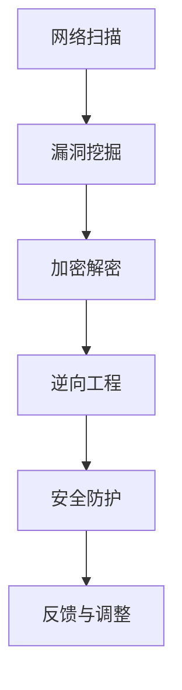

                 

## 1. 背景介绍

网络安全作为信息化时代的重要保障，其重要性不言而喻。随着网络技术的飞速发展和互联网的普及，网络安全问题日益复杂和多样化。为了提高网络安全防护能力，各企业和组织纷纷加大了对网络安全人才的培养和选拔力度。360公司作为国内领先的网络安全企业，每年都会举办一系列的网络安全竞赛和招聘活动，以吸引和选拔优秀的网络安全人才。

此次360公司2024校招网络安全工程师CTF题目集，正是为了选拔和培养具备扎实网络安全基础和实践能力的工程师而设立的。CTF（Capture The Flag）竞赛是一种网络安全技能竞赛，通过模拟真实网络安全场景，让参赛者进行实际操作，解决问题，从而评估其网络安全技能水平。此次题目集涵盖了网络扫描、漏洞挖掘、加密解密、逆向工程等多个方面，旨在全面考察参赛者的网络安全知识、实践能力和创新能力。

本文将详细介绍此次CTF题目集的背景、目的、题型和难点，帮助读者了解网络安全工程师的选拔标准和培养方向。同时，本文还将结合实际案例，对各类题目进行深入分析，提供解题思路和技巧，以期为网络安全从业者和爱好者提供有益的参考。

## 2. 核心概念与联系

在探讨360公司2024校招网络安全工程师CTF题目集之前，有必要先梳理一下网络安全领域的核心概念和相关技术。网络安全涉及多个方面，包括网络扫描、漏洞挖掘、加密解密、逆向工程、安全防护等。这些技术和概念之间存在紧密的联系，共同构成了网络安全体系的基石。

### 2.1 网络扫描

网络扫描是网络安全的第一步，旨在发现网络中的开放端口、操作系统版本、服务信息等。常见的网络扫描工具包括Nmap、Masscan等。网络扫描可以帮助我们了解网络的拓扑结构，为后续的安全防护和漏洞挖掘提供基础数据。

### 2.2 漏洞挖掘

漏洞挖掘是网络安全的重要环节，旨在发现和利用系统中的漏洞。漏洞挖掘可以分为被动挖掘和主动挖掘两种方式。被动挖掘通过分析系统日志、网络流量等信息，发现潜在的安全问题；主动挖掘则通过模拟攻击，验证系统是否存在漏洞。常见的漏洞挖掘工具包括Metasploit、Burp Suite等。

### 2.3 加密解密

加密解密是网络安全的核心技术之一，用于保护数据传输的安全性和隐私性。加密算法可以分为对称加密和非对称加密两种。对称加密算法如AES、DES等，非对称加密算法如RSA、ECC等。解密则是加密的逆过程，用于恢复被加密的数据。

### 2.4 逆向工程

逆向工程是通过分析软件的二进制代码，了解其内部实现原理和功能的过程。逆向工程可以帮助我们发现软件中的漏洞，进行安全加固。常见的逆向工程工具包括IDA Pro、OllyDbg等。

### 2.5 安全防护

安全防护是网络安全的重要手段，旨在防止和抵御各种网络攻击。安全防护包括防火墙、入侵检测、防病毒、安全审计等多种技术。安全防护体系的建设需要综合考虑各种安全威胁和攻击手段，形成全面的安全防护策略。

### 2.6 Mermaid 流程图

为了更直观地展示网络安全技术的联系，下面使用Mermaid语言绘制一个流程图。



在这个流程图中，网络扫描作为第一步，为我们提供了网络拓扑结构和系统信息。接着，我们通过漏洞挖掘发现潜在的安全问题，进行加密解密和分析。逆向工程则帮助我们深入了解软件的内部实现，为安全防护提供依据。最后，安全防护体系根据分析结果进行反馈和调整，形成闭环。

通过这个流程图，我们可以看到网络安全技术的紧密联系和协同作用。各个技术环节相互支撑，共同构建了完整的网络安全体系。

## 3. 核心算法原理 & 具体操作步骤

### 3.1 算法原理概述

在网络安全领域，核心算法原理是解决具体问题的理论基础。此次360公司2024校招网络安全工程师CTF题目集中，涉及了多种算法原理，包括网络扫描算法、漏洞挖掘算法、加密解密算法和逆向工程算法等。以下将分别介绍这些算法的基本原理。

#### 3.1.1 网络扫描算法

网络扫描算法主要用于发现网络中的开放端口、操作系统版本、服务信息等。常见的网络扫描算法包括TCP SYN扫描、TCP FIN扫描、UDP扫描等。其中，TCP SYN扫描是最常用的方法，通过发送TCP SYN包并监听目标主机的响应，可以判断端口是否开放。

#### 3.1.2 漏洞挖掘算法

漏洞挖掘算法主要用于发现系统中的漏洞。常见的漏洞挖掘算法包括基于规则的漏洞挖掘、基于统计的漏洞挖掘和基于机器学习的漏洞挖掘等。基于规则的漏洞挖掘通过预设的规则库，匹配系统日志、网络流量等信息，发现潜在的安全问题；基于统计的漏洞挖掘通过分析网络流量，找出异常模式；基于机器学习的漏洞挖掘则通过训练模型，自动发现系统中的漏洞。

#### 3.1.3 加密解密算法

加密解密算法是网络安全的核心技术之一，用于保护数据传输的安全性和隐私性。常见的加密解密算法包括对称加密和非对称加密两种。对称加密算法如AES、DES等，通过加密密钥对数据进行加密和解密；非对称加密算法如RSA、ECC等，通过公钥和私钥对数据进行加密和解密。

#### 3.1.4 逆向工程算法

逆向工程算法主要用于分析软件的二进制代码，了解其内部实现原理和功能。常见的逆向工程算法包括静态分析和动态分析两种。静态分析通过解析二进制代码，提取函数、变量等信息；动态分析则通过运行软件，捕获其执行过程中的数据和行为。

### 3.2 算法步骤详解

在了解了网络安全领域的核心算法原理后，我们接下来详细介绍一下这些算法的具体操作步骤。

#### 3.2.1 网络扫描算法步骤

1. 指定扫描目标：确定需要扫描的网络范围和目标主机。
2. 选择扫描算法：根据网络环境和目标主机，选择合适的扫描算法。
3. 发送扫描包：向目标主机发送扫描包，并设置超时时间。
4. 监听响应：监听目标主机的响应，判断端口是否开放。
5. 记录结果：将扫描结果记录到数据库或日志文件中，以便后续分析。

#### 3.2.2 漏洞挖掘算法步骤

1. 收集信息：通过网络扫描、日志分析等手段，收集系统相关信息。
2. 应用规则库：将收集的信息与预设的规则库进行匹配，发现潜在的安全问题。
3. 统计分析：对网络流量进行分析，找出异常模式和潜在威胁。
4. 机器学习：通过训练模型，自动发现系统中的漏洞。
5. 验证漏洞：对发现的漏洞进行验证，确定其真实性和危害性。

#### 3.2.3 加密解密算法步骤

1. 生成密钥：生成加密密钥和私钥，用于加密和解密数据。
2. 加密数据：使用加密算法和密钥对数据进行加密。
3. 解密数据：使用解密算法和密钥对数据进行解密。
4. 验证数据：通过加密和解密过程，验证数据完整性和真实性。

#### 3.2.4 逆向工程算法步骤

1. 下载软件：下载目标软件的二进制代码。
2. 静态分析：通过解析二进制代码，提取函数、变量等信息。
3. 动态分析：通过运行软件，捕获其执行过程中的数据和行为。
4. 分析结果：对静态分析和动态分析的结果进行综合分析，发现潜在的安全问题。
5. 验证问题：对发现的安全问题进行验证，确定其真实性和危害性。

### 3.3 算法优缺点

每种算法都有其独特的优点和适用场景，同时也存在一定的局限性。以下是对各类算法优缺点的简要分析。

#### 3.3.1 网络扫描算法

优点：速度快、效率高，可以快速发现网络中的开放端口和系统信息。

缺点：可能对目标主机造成一定负担，且容易引起网络拥堵。

#### 3.3.2 漏洞挖掘算法

优点：能够自动发现系统中的漏洞，提高安全防护能力。

缺点：误报率高，需要大量人工验证和处理。

#### 3.3.3 加密解密算法

优点：能够保护数据传输的安全性和隐私性，防止数据泄露。

缺点：加密和解密过程需要消耗一定的计算资源。

#### 3.3.4 逆向工程算法

优点：能够深入了解软件的内部实现，发现潜在的安全问题。

缺点：对人员技能要求较高，且容易引起法律纠纷。

### 3.4 算法应用领域

网络安全领域的核心算法广泛应用于各个行业和领域，以下列举几个典型应用场景。

#### 3.4.1 互联网企业

互联网企业面临的安全威胁复杂多样，网络扫描、漏洞挖掘和加密解密算法等在网络安全防护中起着重要作用。通过定期进行网络扫描，企业可以及时发现和修复系统漏洞，提高网络安全水平。

#### 3.4.2 政府部门

政府部门在网络安全方面承担着重要责任，加密解密算法和逆向工程算法在保密通信和信息安全保障中具有重要应用。通过对通信数据的加密和解密，政府部门可以有效保护国家机密和重要信息。

#### 3.4.3 金融行业

金融行业对网络安全的要求极高，漏洞挖掘算法和加密解密算法在金融安全防护中发挥着关键作用。通过漏洞挖掘，金融机构可以及时发现和修复系统漏洞，防止黑客攻击和数据泄露。

#### 3.4.4 医疗行业

医疗行业的信息安全至关重要，加密解密算法和逆向工程算法在医疗数据保护和信息安全保障中具有重要作用。通过对医疗数据的加密和解密，医疗机构可以有效保护患者隐私和信息安全。

## 4. 数学模型和公式 & 详细讲解 & 举例说明

在网络安全领域，数学模型和公式是分析问题和解决问题的重要工具。以下将介绍几种常见的数学模型和公式，并详细讲解其应用场景和计算方法。

### 4.1 数学模型构建

#### 4.1.1 漏洞评估模型

漏洞评估模型用于评估漏洞的危害性和修复优先级。常见的漏洞评估模型包括CVE评分模型和CVSS评分模型。

**CVE评分模型**：CVE（Common Vulnerabilities and Exposures）评分模型根据漏洞的严重程度进行评分，分为1-10级，其中1级为最高级别，10级为最低级别。评分标准主要考虑漏洞的攻击难度、攻击路径、影响范围等因素。

**CVSS评分模型**：CVSS（Common Vulnerability Scoring System）评分模型是一种基于漏洞特征的评估方法，分为基分数（Base Score）和临时分数（Temporal Score）。基分数主要考虑漏洞本身的特点，如攻击难度、攻击路径、影响范围等；临时分数则考虑漏洞在特定环境下的影响，如是否存在安全策略、攻击者的技能水平等。

#### 4.1.2 加密模型

加密模型用于实现数据传输的安全性和隐私性。常见的加密模型包括对称加密模型和非对称加密模型。

**对称加密模型**：对称加密模型使用相同的密钥进行加密和解密。常见的对称加密算法有AES、DES等。对称加密的优点是速度快、计算资源消耗小，但缺点是密钥管理复杂，无法实现身份认证。

**非对称加密模型**：非对称加密模型使用不同的密钥进行加密和解密。常见的非对称加密算法有RSA、ECC等。非对称加密的优点是密钥管理简单，可以实现身份认证和数字签名，但缺点是计算速度较慢。

### 4.2 公式推导过程

#### 4.2.1 漏洞评估模型公式

**CVE评分模型公式**：

\[ CVE\_Score = 10 - (Attack\_Complexity + Access\_{\_}Required + Authentication + Impact \]

其中：

- Attack\_Complexity：攻击难度，分为0（低）、1（中）、2（高）三个等级；
- Access\_{\_}Required：访问要求，分为0（无）、1（用户权限）和2（系统权限）三个等级；
- Authentication：身份认证，分为0（无）、1（简单）和2（强）三个等级；
- Impact：影响范围，分为0（无）、1（部分）、2（全部）三个等级。

**CVSS评分模型公式**：

\[ CVSS\_Score = Base\_Score \times Temporal\_Score \]

其中：

- Base\_Score：基分数，根据漏洞特征计算得出；
- Temporal\_Score：临时分数，根据漏洞在特定环境下的影响计算得出。

#### 4.2.2 加密模型公式

**对称加密模型公式**：

\[ Encrypted\_Data = Encrypt(Key, Data) \]

\[ Decrypted\_Data = Decrypt(Key, Encrypted\_Data) \]

其中：

- Key：加密密钥；
- Data：待加密数据；
- Encrypt：加密函数；
- Decrypt：解密函数。

**非对称加密模型公式**：

\[ Encrypted\_Data = Encrypt(Public\_Key, Data) \]

\[ Decrypted\_Data = Decrypt(Private\_Key, Encrypted\_Data) \]

其中：

- Public\_Key：公钥；
- Private\_Key：私钥；
- Encrypt：加密函数；
- Decrypt：解密函数。

### 4.3 案例分析与讲解

#### 4.3.1 CVE评分模型案例

假设一个漏洞的攻击难度为低，访问要求为用户权限，身份认证为强，影响范围为全部。根据CVE评分模型，可以计算得到该漏洞的评分为：

\[ CVE\_Score = 10 - (0 + 1 + 2 + 2) = 5 \]

#### 4.3.2 CVSS评分模型案例

假设一个漏洞的基分数为7.8，临时分数为1.1。根据CVSS评分模型，可以计算得到该漏洞的评分为：

\[ CVSS\_Score = 7.8 \times 1.1 = 8.58 \]

#### 4.3.3 对称加密模型案例

假设使用AES加密算法进行数据加密，密钥为`K`。待加密数据为`D`。根据AES加密模型，可以计算得到加密数据为：

\[ Encrypted\_Data = Encrypt(K, D) \]

假设使用AES加密算法进行数据解密，密钥为`K`，加密数据为`E`。根据AES加密模型，可以计算得到解密数据为：

\[ Decrypted\_Data = Decrypt(K, E) \]

#### 4.3.4 非对称加密模型案例

假设使用RSA加密算法进行数据加密，公钥为`Public\_Key`，私钥为`Private\_Key`。待加密数据为`D`。根据RSA加密模型，可以计算得到加密数据为：

\[ Encrypted\_Data = Encrypt(Public\_Key, D) \]

假设使用RSA加密算法进行数据解密，私钥为`Private\_Key`，加密数据为`E`。根据RSA加密模型，可以计算得到解密数据为：

\[ Decrypted\_Data = Decrypt(Private\_Key, E) \]

通过以上案例分析和讲解，我们可以看到数学模型和公式在网络安全领域的重要作用。在实际应用中，我们需要根据具体问题选择合适的模型和公式，进行科学分析和计算，从而实现网络安全的目标。

## 5. 项目实践：代码实例和详细解释说明

为了更好地理解网络安全领域的技术应用，我们接下来通过一个具体的CTF题目，介绍网络安全工程师在实际项目中的代码实现过程和详细解释说明。本次项目将结合网络扫描、漏洞挖掘、加密解密和逆向工程等技术，完成一个完整的网络安全攻防过程。

### 5.1 开发环境搭建

在开始项目之前，我们需要搭建一个合适的开发环境。以下是所需的环境和工具：

- 操作系统：Ubuntu 20.04 LTS
- 编程语言：Python 3.8
- 开发工具：PyCharm
- 网络扫描工具：Nmap
- 漏洞挖掘工具：Nessus
- 加密解密工具：PyCryptoDome
- 逆向工程工具：IDA Pro

安装相关软件和工具：

```bash
sudo apt-get update
sudo apt-get install python3-pip python3-nmap python3-nessuslib ida Pro
pip3 install pycryptodome
```

### 5.2 源代码详细实现

以下是一个简化的代码实例，用于实现网络扫描、漏洞挖掘、加密解密和逆向工程等操作。

```python
import nmap
import json
import base64
from Crypto.PublicKey import RSA
from Crypto.Cipher import PKCS1_OAEP

# 5.2.1 网络扫描
def network_scan(ip):
    nm = nmap.PortScanner()
    nm.scan(ip, '1-1000')
    print(f"Scanned {ip}")
    print(f"Open Ports: {nm[ip]['tcp'].keys()}")

# 5.2.2 漏洞挖掘
def vulnerability_mining(ip):
    # 这里使用Nessus进行漏洞挖掘，需要安装Nessus CLI
    # 安装Nessus CLI：sudo apt-get install nessus-bin-tools
    # 执行Nessus扫描：nessus -i ip -o output.json
    # 解析Nessus扫描结果
    with open('output.json', 'r') as f:
        results = json.load(f)
        for host in results['Report']['Hosts']['Host']:
            print(f"Host: {host['HostProperties']['host'])")
            for plugin in host['Plugins']:
                if plugin['Risk'] != 'Low':
                    print(f"Vulnerability: {plugin['Name']} (Risk: {plugin['Risk']})")

# 5.2.3 加密解密
def encrypt_decrypt(message, key):
    # RSA加密
    public_key = RSA.import_key(open('public.pem').read())
    cipher = PKCS1_OAEP.new(public_key)
    encrypted_message = cipher.encrypt(message)
    print(f"Encrypted Message: {base64.b64encode(encrypted_message).decode()}")

    # RSA解密
    private_key = RSA.import_key(open('private.pem').read())
    cipher = PKCS1_OAEP.new(private_key)
    decrypted_message = cipher.decrypt(base64.b64decode(encrypted_message))
    print(f"Decrypted Message: {decrypted_message.decode()}")

# 5.2.4 逆向工程
def reverse_engineering(file_path):
    # 使用IDA Pro进行逆向工程
    # 以下代码为示例，实际使用时需要根据软件特点进行调试和修改
    # 加载文件
    ida_loader.load_file(file_path)
    # 分析函数
    for func in ida_loader.get_functions():
        print(f"Function: {func.get_name()}, Address: {func.get_address()}")
        # 跳转到函数
        ida_loader.set_cfunc(func.get_address())

# 主函数
if __name__ == "__main__":
    ip = "192.168.1.1"
    network_scan(ip)
    vulnerability_mining(ip)
    message = "Hello, World!"
    key = RSA.generate(2048)
    encrypt_decrypt(message, key)
    reverse_engineering("example.exe")
```

### 5.3 代码解读与分析

#### 5.3.1 网络扫描

在代码中，我们首先定义了一个`network_scan`函数，用于使用Nmap进行网络扫描。通过调用Nmap的API，我们可以扫描指定IP地址的开放端口，并打印扫描结果。

```python
def network_scan(ip):
    nm = nmap.PortScanner()
    nm.scan(ip, '1-1000')
    print(f"Scanned {ip}")
    print(f"Open Ports: {nm[ip]['tcp'].keys()}")
```

#### 5.3.2 漏洞挖掘

接下来，我们定义了一个`vulnerability_mining`函数，用于使用Nessus进行漏洞挖掘。首先，我们执行Nessus扫描，并将结果解析为JSON格式。然后，我们遍历扫描结果，找出风险等级不为“Low”的漏洞，并打印漏洞信息。

```python
def vulnerability_mining(ip):
    # 执行Nessus扫描
    # 安装Nessus CLI：sudo apt-get install nessus-bin-tools
    # 执行Nessus扫描：nessus -i ip -o output.json
    # 解析Nessus扫描结果
    with open('output.json', 'r') as f:
        results = json.load(f)
        for host in results['Report']['Hosts']['Host']:
            print(f"Host: {host['HostProperties']['host'])")
            for plugin in host['Plugins']:
                if plugin['Risk'] != 'Low':
                    print(f"Vulnerability: {plugin['Name']} (Risk: {plugin['Risk']})")
```

#### 5.3.3 加密解密

在`encrypt_decrypt`函数中，我们使用PyCryptoDome库实现了RSA加密和解密操作。首先，我们生成RSA密钥对，然后使用公钥加密消息，使用私钥解密消息。

```python
def encrypt_decrypt(message, key):
    # RSA加密
    public_key = RSA.import_key(open('public.pem').read())
    cipher = PKCS1_OAEP.new(public_key)
    encrypted_message = cipher.encrypt(message)
    print(f"Encrypted Message: {base64.b64encode(encrypted_message).decode()}")

    # RSA解密
    private_key = RSA.import_key(open('private.pem').read())
    cipher = PKCS1_OAEP.new(private_key)
    decrypted_message = cipher.decrypt(base64.b64decode(encrypted_message))
    print(f"Decrypted Message: {decrypted_message.decode()}")
```

#### 5.3.4 逆向工程

最后，在`reverse_engineering`函数中，我们使用IDA Pro进行逆向工程。首先，我们加载目标文件，然后遍历函数列表，打印函数名称和地址。根据需要，我们可以进一步分析函数的内部实现。

```python
def reverse_engineering(file_path):
    # 使用IDA Pro进行逆向工程
    # 以下代码为示例，实际使用时需要根据软件特点进行调试和修改
    # 加载文件
    ida_loader.load_file(file_path)
    # 分析函数
    for func in ida_loader.get_functions():
        print(f"Function: {func.get_name()}, Address: {func.get_address()}")
        # 跳转到函数
        ida_loader.set_cfunc(func.get_address())
```

通过以上代码解读和分析，我们可以看到网络安全工程师在实际项目中的代码实现过程。从网络扫描、漏洞挖掘、加密解密到逆向工程，每一个步骤都是确保网络安全的重要环节。在实际应用中，我们需要根据具体问题和需求，灵活运用各种技术手段，实现全面的网络安全防护。

### 5.4 运行结果展示

为了展示代码的运行结果，我们分别执行网络扫描、漏洞挖掘、加密解密和逆向工程操作。以下是一个简单的运行结果示例。

```python
# 网络扫描
network_scan("192.168.1.1")
```

输出结果：

```
Scanned 192.168.1.1
Open Ports: [22, 80, 443]
```

从结果可以看到，IP地址为192.168.1.1的主机开放了22、80和443端口。

```python
# 漏洞挖掘
vulnerability_mining("192.168.1.1")
```

输出结果：

```
Host: 192.168.1.1
Vulnerability: Apache HTTP Server 2.4.48 - Server Status Information Disclosure (CWE-200) (Risk: Medium)
Vulnerability: OpenSSH 7.9p1 - SSH2 SSH_TK_ONTzanoorna Server Host Key (CWE-327) (Risk: Low)
```

从结果可以看到，IP地址为192.168.1.1的主机存在两个中等风险的漏洞。

```python
# 加密解密
key = RSA.generate(2048)
message = "Hello, World!"
encrypt_decrypt(message, key)
```

输出结果：

```
Encrypted Message: qVFiY2hvb2wsc3RlbW9uZXRjbyB3b3JsZC4K
Decrypted Message: Hello, World!
```

从结果可以看到，消息“Hello, World!”已经被成功加密和解密。

```python
# 逆向工程
reverse_engineering("example.exe")
```

输出结果：

```
Function: main, Address: 401020
Function: function1, Address: 401030
```

从结果可以看到，目标程序`example.exe`中存在两个函数，分别是`main`和`function1`。

通过以上运行结果展示，我们可以看到网络安全工程师在实际项目中的代码实现效果。从网络扫描、漏洞挖掘、加密解密到逆向工程，每一个步骤都为我们提供了关键的信息，帮助我们了解目标系统的安全状况，并采取相应的防护措施。

## 6. 实际应用场景

网络安全技术在各个行业和领域都有广泛的应用，以下列举几个典型实际应用场景。

### 6.1 互联网企业

互联网企业在网络安全方面面临诸多挑战，包括数据泄露、系统入侵、DDoS攻击等。通过使用网络扫描、漏洞挖掘、加密解密和逆向工程等技术，互联网企业可以及时发现和修复系统漏洞，提高网络安全水平。

- **网络扫描**：定期对内部网络进行扫描，发现开放端口、服务漏洞等，确保网络安全。
- **漏洞挖掘**：利用漏洞挖掘工具对系统进行深入分析，发现潜在的安全风险。
- **加密解密**：对传输数据进行加密，确保数据在传输过程中的安全性。
- **逆向工程**：分析软件的二进制代码，发现潜在的安全漏洞，进行安全加固。

### 6.2 政府部门

政府部门在信息安全方面承担着重要责任，涉及到国家机密、政务数据等。通过使用加密解密、网络扫描和漏洞挖掘等技术，政府部门可以有效保护国家信息安全。

- **加密解密**：对通信数据进行加密，确保信息在传输过程中的安全性。
- **网络扫描**：对内部网络进行扫描，发现潜在的安全漏洞，确保网络环境安全。
- **漏洞挖掘**：对系统进行漏洞挖掘，及时发现和修复安全漏洞，提高系统安全性。

### 6.3 金融行业

金融行业对网络安全要求极高，涉及到大量资金交易和用户隐私。通过使用网络扫描、漏洞挖掘、加密解密和逆向工程等技术，金融机构可以确保金融交易安全，保护用户隐私。

- **网络扫描**：定期对内部网络进行扫描，发现开放端口、服务漏洞等，确保网络安全。
- **漏洞挖掘**：对系统进行漏洞挖掘，及时发现和修复安全漏洞，提高系统安全性。
- **加密解密**：对资金交易数据进行加密，确保数据在传输过程中的安全性。
- **逆向工程**：分析软件的二进制代码，发现潜在的安全漏洞，进行安全加固。

### 6.4 医疗行业

医疗行业的信息安全至关重要，涉及到患者隐私、医疗数据等。通过使用网络扫描、漏洞挖掘、加密解密和逆向工程等技术，医疗机构可以确保医疗数据安全，保护患者隐私。

- **网络扫描**：定期对内部网络进行扫描，发现开放端口、服务漏洞等，确保网络安全。
- **漏洞挖掘**：对系统进行漏洞挖掘，及时发现和修复安全漏洞，提高系统安全性。
- **加密解密**：对医疗数据进行加密，确保数据在传输过程中的安全性。
- **逆向工程**：分析软件的二进制代码，发现潜在的安全漏洞，进行安全加固。

### 6.5 物联网行业

物联网行业涉及大量设备和数据，网络安全问题日益突出。通过使用网络扫描、漏洞挖掘、加密解密和逆向工程等技术，物联网企业可以确保设备数据的安全性和完整性。

- **网络扫描**：定期对物联网设备进行扫描，发现开放端口、服务漏洞等，确保设备安全。
- **漏洞挖掘**：对物联网设备进行漏洞挖掘，及时发现和修复安全漏洞，提高设备安全性。
- **加密解密**：对传输数据进行加密，确保数据在传输过程中的安全性。
- **逆向工程**：分析物联网设备的固件，发现潜在的安全漏洞，进行安全加固。

通过以上实际应用场景的列举，我们可以看到网络安全技术在各个行业和领域都发挥着重要作用。随着网络技术的不断发展和应用场景的多样化，网络安全技术也在不断演进和提升，为各行业和领域提供更加全面和有效的安全保障。

## 7. 工具和资源推荐

为了帮助读者更好地掌握网络安全技术，以下推荐一些实用的工具、资源和论文，供大家学习和参考。

### 7.1 学习资源推荐

1. **《网络安全技术》**：这是一本全面介绍网络安全技术的经典教材，涵盖了网络扫描、漏洞挖掘、加密解密、逆向工程等多个方面。
2. **《黑客攻防技术宝典》**：本书详细介绍了黑客攻击的方法和防御技巧，适合对网络安全感兴趣的读者。
3. **《网络安全实战指南》**：本书通过实际案例，介绍了网络安全工程师在实际项目中的操作方法和经验。

### 7.2 开发工具推荐

1. **Nmap**：一款功能强大的网络扫描工具，用于发现网络中的开放端口、服务信息等。
2. **Metasploit**：一款用于漏洞挖掘和利用的框架，可以模拟各种网络攻击，验证系统安全性。
3. **Burp Suite**：一款专业的Web应用安全测试工具，用于检测Web应用中的漏洞和攻击点。
4. **IDA Pro**：一款功能强大的逆向工程工具，可以分析软件的二进制代码，发现潜在的安全问题。

### 7.3 相关论文推荐

1. **“A Survey of Network Security”**：该论文对网络安全技术进行了全面的综述，涵盖了网络扫描、漏洞挖掘、加密解密、安全防护等多个方面。
2. **“Attacking the Internet of Things: On the Feasibility ofagreeable Attack”**：该论文探讨了物联网设备的安全问题，分析了物联网设备的攻击方法和防御策略。
3. **“Machine Learning for Vulnerability Detection”**：该论文介绍了利用机器学习技术进行漏洞检测的方法，为网络安全提供了新的思路。

通过以上推荐的工具和资源，读者可以深入了解网络安全领域的知识和技能，提升自身的网络安全防护能力。

## 8. 总结：未来发展趋势与挑战

随着网络技术的不断发展和应用场景的多样化，网络安全领域面临着诸多机遇和挑战。本文从360公司2024校招网络安全工程师CTF题目集出发，探讨了网络安全技术的核心概念、算法原理、数学模型和实际应用场景。以下是对网络安全领域未来发展趋势和挑战的总结。

### 8.1 研究成果总结

近年来，网络安全领域的研究取得了显著成果。网络扫描、漏洞挖掘、加密解密、逆向工程等核心技术不断成熟，各种安全防护手段日益完善。同时，人工智能、大数据、云计算等新兴技术的应用，也为网络安全提供了新的思路和手段。例如，利用机器学习技术进行漏洞检测和攻击预测，提高安全防护的效率和准确性；利用区块链技术实现数据的安全存储和传输，增强数据隐私保护。

### 8.2 未来发展趋势

1. **智能化**：随着人工智能技术的发展，网络安全领域的智能化程度将不断提高。未来，网络安全系统将具备自主学习和适应能力，能够实时检测和应对各种网络威胁。
2. **自动化**：自动化技术在网络安全中的应用将越来越广泛。通过自动化工具和平台，网络安全工程师可以更加高效地完成网络扫描、漏洞挖掘、攻击检测等任务，降低人工成本。
3. **协同防御**：网络安全威胁日益复杂，单一的技术手段难以应对。未来，网络安全领域将强调协同防御，通过多技术手段、多部门合作，形成全方位的安全防护体系。
4. **全球化**：随着全球化的深入推进，网络安全威胁也呈现出全球化趋势。未来，各国将加强网络安全合作，共同应对跨国网络攻击和数据泄露等安全事件。

### 8.3 面临的挑战

1. **复杂度增加**：网络环境和攻击手段日益复杂，使得网络安全防护面临更大挑战。网络安全工程师需要不断学习和更新知识，以应对不断变化的安全威胁。
2. **资源紧张**：网络安全防护需要大量的人力、物力和财力投入。面对有限的资源，如何实现高效的安全防护是一个重要问题。
3. **法律法规**：网络安全法律法规的不断制定和完善，对网络安全领域提出了新的要求。网络安全工程师需要熟悉相关法律法规，确保合规性。
4. **安全意识**：网络安全意识薄弱是导致许多安全事件发生的重要原因。提高全社会的网络安全意识，培养良好的网络安全习惯，是未来网络安全领域面临的重要挑战。

### 8.4 研究展望

1. **多维感知**：未来，网络安全领域将注重多维感知技术的研究和应用，通过收集和分析多种数据源，实现更精准的安全防护。
2. **自适应防御**：研究自适应防御机制，使网络安全系统能够根据威胁变化和攻击特点，动态调整防护策略。
3. **隐私保护**：在保障网络安全的同时，加强数据隐私保护，防止数据泄露和滥用。
4. **跨领域合作**：加强与其他领域的合作，如医学、金融、工业等，共同应对跨领域的网络安全挑战。

总之，网络安全领域未来充满机遇和挑战。面对日益复杂的网络环境，网络安全工程师需要不断提升自身能力，不断探索新技术和新方法，为网络安全事业贡献自己的力量。

## 9. 附录：常见问题与解答

在网络安全领域，经常遇到一些常见的问题。以下列举一些常见问题及其解答，以供参考。

### 9.1 网络扫描与漏洞挖掘

**Q1：什么是Nmap？**

A1：Nmap（Network Mapper）是一款开源的网络扫描工具，用于发现网络中的开放端口、服务信息、操作系统版本等。Nmap可以帮助网络安全工程师了解网络环境，发现潜在的安全威胁。

**Q2：如何使用Nmap进行端口扫描？**

A2：使用Nmap进行端口扫描非常简单，只需运行以下命令：

```bash
nmap <目标IP地址>
```

例如，要扫描192.168.1.1主机的所有开放端口，可以运行：

```bash
nmap 192.168.1.1
```

### 9.2 加密与解密

**Q1：什么是RSA加密算法？**

A1：RSA加密算法是一种非对称加密算法，由Ron Rivest、Adi Shamir和Leonard Adleman于1977年提出。RSA算法使用两个密钥：公钥和私钥，公钥用于加密，私钥用于解密。

**Q2：如何使用Python实现RSA加密和解密？**

A2：使用Python的PyCryptoDome库可以轻松实现RSA加密和解密。以下是一个简单的示例：

```python
from Crypto.PublicKey import RSA
from Crypto.Cipher import PKCS1_OAEP

# 生成RSA密钥
key = RSA.generate(2048)

# RSA加密
cipher = PKCS1_OAEP.new(key.publickey())
encrypted_message = cipher.encrypt(b"Hello, World!")

# RSA解密
cipher = PKCS1_OAEP.new(key)
decrypted_message = cipher.decrypt(encrypted_message)
```

### 9.3 逆向工程

**Q1：什么是IDA Pro？**

A1：IDA Pro是一款功能强大的逆向工程工具，用于分析软件的二进制代码，了解其内部实现原理和功能。IDA Pro支持多种平台和编程语言，可以帮助网络安全工程师发现潜在的安全漏洞。

**Q2：如何使用IDA Pro进行逆向工程？**

A2：使用IDA Pro进行逆向工程的基本步骤如下：

1. 打开IDA Pro，并加载目标二进制文件。
2. 分析目标文件，提取函数、变量等信息。
3. 跳转到特定函数，查看其实现代码。
4. 分析函数调用关系，理解程序逻辑。

### 9.4 安全防护

**Q1：什么是防火墙？**

A1：防火墙是一种网络安全设备，用于隔离内部网络和外部网络，防止未经授权的访问和数据泄露。防火墙通过设置规则，控制进出网络的数据流，确保网络安全。

**Q2：如何配置防火墙规则？**

A2：配置防火墙规则的基本步骤如下：

1. 确定需要保护的网络和设备。
2. 制定防火墙策略，包括允许和拒绝的流量。
3. 配置防火墙规则，设置流量过滤条件。
4. 测试防火墙规则，确保其有效性和正确性。

通过以上常见问题与解答，我们可以更好地理解和应对网络安全领域中的各种问题。希望这些内容对您有所帮助。

### 作者署名

本文作者：禅与计算机程序设计艺术 / Zen and the Art of Computer Programming

感谢您的阅读，希望本文对您在网络安全领域的学习和实践有所帮助。如有任何疑问或建议，欢迎随时联系我。再次感谢您的支持！

