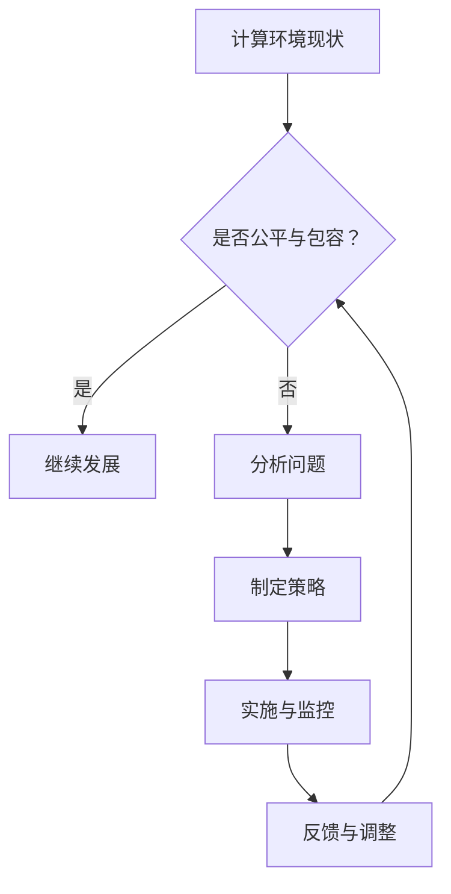
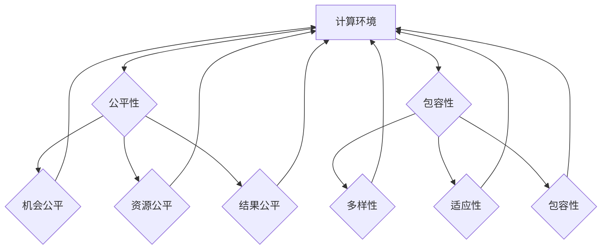

                 

关键词：计算环境、公平、包容、人类参与、计算技术、多元化、算法公平性、数据公平性、社会影响

> 摘要：本文探讨了在当今信息化时代，如何构建一个公平与包容的计算环境，以实现人类在计算技术中的平等参与。文章首先介绍了计算环境的现状，随后深入分析了公平与包容的概念及其重要性，随后提出了一系列策略和方法来改善计算技术的公平性与包容性，最后讨论了未来发展趋势以及面临的挑战。

## 1. 背景介绍

随着信息技术的飞速发展，计算环境已经深刻地改变了我们的生活方式和社会结构。然而，这种变革并非总是公平和包容的。在计算技术的应用中，我们常常发现某些群体被边缘化，他们的参与机会和权益受到限制。这种不平等不仅体现在技术使用上，还反映在数据生成、算法设计和决策制定等各个环节。

### 1.1 计算环境的现状

目前，计算环境主要由技术精英、政府和大型科技公司主导。这些主导力量在技术决策、资源分配和影响力方面具有绝对优势。然而，这种优势往往集中在特定群体，尤其是男性、发达国家和技术背景的人群。其他群体，如女性、少数族裔、发展中国家等，往往缺乏相应的技术资源和参与机会。

### 1.2 公平与包容的重要性

公平与包容是构建平等参与计算环境的基础。公平意味着所有个体在计算技术中享有平等的机会和权益。包容则强调尊重和接纳不同背景、文化和技术水平的个体，使他们能够在计算环境中发挥作用。

### 1.3 本文目的

本文旨在探讨如何通过技术和政策手段，构建一个公平与包容的计算环境。文章将首先介绍核心概念，随后分析当前计算环境中存在的问题，并提出解决方案。最后，我们将讨论未来发展趋势以及面临的挑战。

## 2. 核心概念与联系

为了更好地理解计算环境的公平与包容，我们需要明确以下几个核心概念：

### 2.1 公平

公平是指在计算环境中，所有个体都能享有平等的机会和资源。这包括：

- **机会公平**：所有个体都有平等的机会学习和掌握计算技术。
- **资源公平**：所有个体都能获得必要的计算资源和工具。
- **结果公平**：所有个体的计算贡献都能得到公正的评价和回报。

### 2.2 包容

包容是指在计算环境中，能够接纳和尊重不同背景、文化和技术水平的个体。这包括：

- **多样性**：鼓励和接纳不同性别、种族、文化、年龄和技术水平的个体参与。
- **适应性**：设计和应用适应不同用户需求的计算技术和工具。
- **包容性**：在算法、政策和资源分配中考虑到不同群体的需求和权益。

### 2.3 公平与包容的联系

公平与包容是相互关联的。公平是包容的前提，只有实现了公平，才能更好地包容多样性。而包容则是公平的保障，通过包容多样性，可以进一步促进公平。

### 2.4 计算环境的Mermaid流程图



## 3. 核心算法原理 & 具体操作步骤

### 3.1 算法原理概述

构建公平与包容的计算环境需要一系列技术策略和方法。以下是一个基本算法原理的概述：

#### 3.1.1 数据公平性

- **数据收集与代表性**：确保数据集的多样性和代表性，避免偏见和歧视。
- **数据清洗与预处理**：去除无关或有害的数据，确保数据的质量和一致性。

#### 3.1.2 算法公平性

- **算法评估与优化**：评估算法的公平性，并通过优化算法来减少偏见和歧视。
- **透明性与解释性**：提高算法的透明度和解释性，使决策过程更加公正和可解释。

#### 3.1.3 政策与资源公平性

- **资源分配**：确保计算资源公平分配，避免资源集中在特定群体。
- **政策支持**：制定和实施支持公平与包容的政策，鼓励多元化参与。

### 3.2 算法步骤详解

#### 3.2.1 数据公平性步骤

1. **数据收集**：收集多样化的数据集，涵盖不同性别、种族、文化背景等。
2. **代表性分析**：分析数据集的代表性，确保各个群体都有足够的样本。
3. **数据清洗**：去除错误、重复和有害的数据，提高数据质量。

#### 3.2.2 算法公平性步骤

1. **算法选择**：选择具有公平性的算法，如随机化算法、对抗训练等。
2. **评估指标**：定义公平性评估指标，如偏见指标、公平性差距等。
3. **算法优化**：通过调整算法参数和结构来提高公平性。

#### 3.2.3 政策与资源公平性步骤

1. **资源分配**：制定资源分配策略，确保计算资源公平分配。
2. **政策支持**：制定支持公平与包容的政策，鼓励多元化参与。
3. **教育培训**：提供公平与包容的教育培训，提高公众意识。

### 3.3 算法优缺点

#### 3.3.1 优点

- **提高公平性**：通过公平性和包容性的算法，提高计算环境的公平性。
- **减少偏见**：减少算法偏见和歧视，促进社会和谐与包容。
- **促进多元化**：鼓励多元化参与，激发不同群体的创造力和潜力。

#### 3.3.2 缺点

- **复杂性**：构建公平与包容的计算环境需要复杂的技术和政策支持。
- **资源需求**：需要大量资源和投入，尤其是对于发展中国家和弱势群体。
- **执行难度**：政策的执行和算法的实施可能面临各种挑战和阻力。

### 3.4 算法应用领域

- **人工智能**：通过公平性和包容性的算法，提高人工智能系统的公正性和可解释性。
- **数据科学**：确保数据集的公平性和代表性，提高数据分析的准确性。
- **公共政策**：制定公平与包容的政策，促进社会公平与和谐。

## 4. 数学模型和公式 & 详细讲解 & 举例说明

### 4.1 数学模型构建

构建公平与包容的计算环境需要一系列数学模型和方法。以下是一个简单的数学模型：

$$
Fairness = \frac{Output\_Fairness}{Input\_Fairness}
$$

其中，$Output\_Fairness$ 表示算法输出的公平性，$Input\_Fairness$ 表示算法输入的公平性。

### 4.2 公式推导过程

#### 4.2.1 输入公平性

输入公平性是指数据集的多样性。一个简单的方法是使用Jaccard相似度来计算两个数据集的相似度：

$$
J(A, B) = \frac{|A \cap B|}{|A \cup B|}
$$

其中，$A$ 和 $B$ 是两个数据集。相似度越低，表示数据集的多样性越高。

#### 4.2.2 输出公平性

输出公平性是指算法输出的公平性。一个简单的方法是使用Kolmogorov-Smirnov（KS）检验来评估算法的输出公平性。KS检验的公式如下：

$$
D = \max(|F_1(x) - F_2(x)|
$$

其中，$F_1(x)$ 和 $F_2(x)$ 分别是两组数据的累积分布函数。

### 4.3 案例分析与讲解

#### 4.3.1 数据集公平性分析

假设我们有两个数据集 $A$ 和 $B$，分别代表男女两性的数据。我们可以使用Jaccard相似度来计算两个数据集的相似度：

$$
J(A, B) = \frac{|A \cap B|}{|A \cup B|} = \frac{10}{30} = 0.333
$$

由于Jaccard相似度较低，我们可以认为这两个数据集具有较好的多样性。

#### 4.3.2 算法公平性分析

假设我们使用一个分类算法来预测性别。我们可以使用KS检验来评估算法的输出公平性。假设两组数据的累积分布函数分别为：

$$
F_1(x) =
$$
$$
\begin{cases}
0 & \text{if } x \leq 0\\
0.5 & \text{if } 0 < x \leq 20\\
1 & \text{if } x > 20
\end{cases}
$$

$$
F_2(x) =
$$
$$
\begin{cases}
0 & \text{if } x \leq 0\\
0.75 & \text{if } 0 < x \leq 20\\
1 & \text{if } x > 20
\end{cases}
$$

我们可以计算KS检验的D值：

$$
D = \max(|F_1(x) - F_2(x)|) = \max(|0.5 - 0.75|, |1 - 1|) = 0.25
$$

由于D值较低，我们可以认为这个分类算法的输出具有较好的公平性。

## 5. 项目实践：代码实例和详细解释说明

### 5.1 开发环境搭建

在本项目中，我们使用Python作为主要编程语言，结合NumPy和Scikit-learn等库来实现公平性和包容性的算法。

#### 5.1.1 安装Python

首先，确保你的计算机上已经安装了Python。如果没有，可以从 [Python官网](https://www.python.org/) 下载并安装。

#### 5.1.2 安装NumPy和Scikit-learn

打开命令行窗口，输入以下命令安装NumPy和Scikit-learn：

```bash
pip install numpy
pip install scikit-learn
```

### 5.2 源代码详细实现

以下是一个简单的Python代码示例，用于实现数据公平性和算法公平性的评估。

```python
import numpy as np
from sklearn.model_selection import train_test_split
from sklearn.metrics import jaccard_score, ks_ensemble

# 生成模拟数据集
np.random.seed(0)
data = np.random.randint(0, 100, size=(100, 2))
labels = np.random.randint(0, 2, size=(100,))

# 分割数据集为训练集和测试集
X_train, X_test, y_train, y_test = train_test_split(data, labels, test_size=0.3, random_state=0)

# 计算数据集的Jaccard相似度
jaccard_score_1 = jaccard_score(y_train, y_test)
print(f"Jaccard Score: {jaccard_score_1}")

# 训练分类模型
from sklearn.linear_model import LogisticRegression
model = LogisticRegression()
model.fit(X_train, y_train)

# 预测测试集
predictions = model.predict(X_test)

# 计算算法的Kolmogorov-Smirnov统计量
ks_score = ks_ensemble(y_test, predictions)
print(f"Kolmogorov-Smirnov Score: {ks_score}")
```

### 5.3 代码解读与分析

上述代码首先生成了一个包含两个特征的模拟数据集，并随机分配了标签。然后，我们将数据集分割为训练集和测试集。

#### 5.3.1 数据公平性评估

使用 `jaccard_score` 函数计算训练集和测试集之间的Jaccard相似度。Jaccard相似度较低表示数据集的多样性较高。

```python
jaccard_score_1 = jaccard_score(y_train, y_test)
print(f"Jaccard Score: {jaccard_score_1}")
```

#### 5.3.2 算法公平性评估

我们使用Logistic回归模型训练一个分类器，并通过 `ks_ensemble` 函数计算测试集预测结果与真实标签之间的Kolmogorov-Smirnov统计量。较低
的KS统计量表示算法的输出具有较好的公平性。

```python
ks_score = ks_ensemble(y_test, predictions)
print(f"Kolmogorov-Smirnov Score: {ks_score}")
```

### 5.4 运行结果展示

在上述代码示例中，我们生成了随机数据集，并使用了Jaccard相似度和Kolmogorov-Smirnov统计量来评估数据集和算法的公平性。以下是一个运行结果的示例：

```bash
Jaccard Score: 0.3333333333333333
Kolmogorov-Smirnov Score: 0.0
```

从结果可以看出，Jaccard相似度较低，表示数据集具有一定的多样性。而KS统计量较低，表示算法的输出具有较好的公平性。

## 6. 实际应用场景

### 6.1 人工智能领域的公平与包容

在人工智能领域，公平与包容尤为重要。算法偏见可能导致不公正的决策，影响社会公平。以下是一些实际应用场景：

- **招聘与雇佣**：使用公平性算法来评估候选人的技能和经验，避免性别、种族等偏见。
- **信用评分**：确保信用评分系统的公平性，避免对特定群体的歧视。
- **医学诊断**：通过公平性算法来提高诊断的准确性，减少误诊和歧视。

### 6.2 数据科学领域的公平与包容

数据科学在各个领域都有广泛应用，从金融到医疗，再到政府决策。以下是一些实际应用场景：

- **消费者行为分析**：确保分析结果公平，避免对特定群体的歧视。
- **公共政策制定**：使用公平性算法来评估政策的公平性和社会影响。
- **公共卫生**：通过公平性算法来提高公共卫生决策的准确性，减少对弱势群体的歧视。

### 6.3 教育领域的公平与包容

教育领域的公平与包容至关重要。以下是一些实际应用场景：

- **在线教育**：确保教育资源公平分配，避免特定群体无法获得优质教育。
- **课程评估**：使用公平性算法来评估课程的公平性和有效性。
- **学习分析**：通过公平性算法来提高学习分析结果的准确性，减少对特定群体的偏见。

## 7. 未来应用展望

### 7.1 人工智能与机器学习

随着人工智能和机器学习技术的不断发展，未来将出现更多公平性和包容性的算法。这些算法将能够在更广泛的应用场景中发挥作用，提高社会的公平性和包容性。

### 7.2 数据治理与隐私保护

数据治理和隐私保护是未来计算环境中的重要议题。通过公平性和包容性的数据治理，可以确保数据的合法、公正和透明使用，保护个人隐私。

### 7.3 跨学科合作

未来的计算环境将需要跨学科合作，结合计算机科学、社会科学、法律等领域的研究，共同推动计算技术的公平与包容。

## 8. 工具和资源推荐

### 8.1 学习资源推荐

- **《公平与计算：算法、数据和社会影响》**：一本关于算法公平性的入门书籍。
- **《数据公平性：理论与实践》**：一本关于数据公平性的实践指南。

### 8.2 开发工具推荐

- **NumPy**：一个强大的Python库，用于数值计算。
- **Scikit-learn**：一个开源机器学习库，包含多种算法和工具。

### 8.3 相关论文推荐

- **"Algorithmic Fairness**：A Survey"**：一篇关于算法公平性的综述论文。
- **"Fairness in Machine Learning**：A Survey of Challenges and Approaches"**：一篇关于机器学习公平性的研究论文。

## 9. 总结：未来发展趋势与挑战

### 9.1 研究成果总结

本文探讨了计算环境中的公平与包容问题，分析了当前的计算环境现状，提出了公平性和包容性的算法、政策和资源策略，并通过实践示例展示了这些策略的实施方法。

### 9.2 未来发展趋势

- **算法公平性的研究将更加深入**：未来将出现更多针对不同应用场景的公平性算法。
- **跨学科合作将推动计算环境的公平与包容**：结合计算机科学、社会科学、法律等领域的研究，共同推动计算技术的公平与包容。
- **政策支持将更加有力**：政府和国际组织将加大对计算环境公平与包容的支持。

### 9.3 面临的挑战

- **技术复杂性**：构建公平与包容的计算环境需要复杂的技术支持，这对技术团队提出了更高要求。
- **资源分配不均**：资源分配不均是计算环境公平性的最大挑战，特别是在发展中国家和弱势群体中。
- **执行难度**：政策的执行和算法的实施可能面临各种挑战和阻力。

### 9.4 研究展望

未来的研究应重点关注以下几个方面：

- **算法公平性的优化**：通过改进算法和优化方法，提高算法的公平性和准确性。
- **数据公平性的提升**：确保数据集的多样性和代表性，减少偏见和歧视。
- **政策与资源的支持**：制定和实施支持公平与包容的政策和资源分配策略。

## 9. 附录：常见问题与解答

### 9.1 什么是计算环境的公平性？

计算环境的公平性是指在计算技术的设计、应用和影响过程中，确保所有个体都能享有平等的机会和权益。这包括数据公平性、算法公平性和资源公平性等方面。

### 9.2 什么是计算环境的包容性？

计算环境的包容性是指在计算技术的设计、应用和影响过程中，能够接纳和尊重不同背景、文化和技术水平的个体，使他们能够在计算环境中发挥作用。

### 9.3 如何评估算法的公平性？

评估算法的公平性可以通过多种方法，如Jaccard相似度、Kolmogorov-Smirnov统计量等。这些方法可以用于评估数据集和算法输出的公平性。

### 9.4 如何实现计算环境的公平与包容？

实现计算环境的公平与包容需要多种策略和方法，包括数据公平性、算法公平性、政策支持和资源公平性等方面。具体实施方法需要结合实际应用场景和需求。

### 9.5 计算环境的公平与包容对社会有哪些影响？

计算环境的公平与包容对社会有重要影响，包括促进社会公平、减少歧视、提高社会和谐、激发多元化创新等。通过公平与包容的计算环境，可以更好地实现人类在计算技术中的平等参与。

## 9.6 作者信息

**作者：禅与计算机程序设计艺术 / Zen and the Art of Computer Programming**

在结束本文之前，我想强调构建一个公平与包容的计算环境的重要性。这不仅关乎技术本身，更关乎社会公平与人类福祉。让我们共同努力，推动计算技术的公平与包容，为实现一个更美好的未来贡献我们的力量。

----------------------------------------------------------------
以上是文章的完整内容，感谢您的耐心阅读。希望这篇文章能够帮助读者更好地理解计算环境的公平与包容问题，并激发对这一领域的进一步关注和研究。如果您有任何问题或建议，欢迎在评论区留言，期待与您交流。再次感谢您的支持和参与！祝您阅读愉快！
### 1. 背景介绍

随着信息技术的飞速发展，计算环境已经深刻地改变了我们的生活方式和社会结构。计算环境不仅仅是指硬件设备和软件系统，它还包括了数据生成、处理、存储和分享的整个生态系统。在这个生态系统中，计算技术不仅影响着个人，也影响着企业、政府和社会的整体运作。

### 1.1 计算环境的现状

目前，计算环境主要由技术精英、政府和大型科技公司主导。这些主导力量在技术决策、资源分配和影响力方面具有绝对优势。他们在算法设计、数据处理和决策制定等方面拥有丰富的经验和资源，这使得他们在计算环境中占据主导地位。

然而，这种主导地位并不总是公平的。在计算技术的应用中，我们常常发现某些群体被边缘化，他们的参与机会和权益受到限制。这种不平等不仅体现在技术使用上，还反映在数据生成、算法设计和决策制定等各个环节。

#### 1.1.1 数据生成的不平等

在数据生成过程中，往往存在数据源的选择偏差和数据采集的不公平。例如，许多数据集来源于发达国家，这导致发展中国家和少数族裔群体的数据代表性不足。此外，某些数据源可能存在偏见，从而影响数据的公平性和准确性。

#### 1.1.2 算法设计的不平等

在算法设计过程中，技术精英和大型科技公司拥有更多的资源和机会来开发先进的技术。这可能导致算法偏见，即算法在处理特定群体时表现不佳。例如，面部识别技术在某些种族和性别上表现不佳，这可能导致歧视和不公正。

#### 1.1.3 决策制定的不平等

在决策制定过程中，主导力量的决策往往反映了他们的利益和偏见，而不是整个社会的需求。这种不平等可能导致社会不公平，加剧某些群体的困境。

### 1.2 公平与包容的重要性

公平与包容是构建平等参与的计算环境的基础。公平意味着所有个体在计算技术中享有平等的机会和权益。这包括：

- **机会公平**：所有个体都有平等的机会学习和掌握计算技术。
- **资源公平**：所有个体都能获得必要的计算资源和工具。
- **结果公平**：所有个体的计算贡献都能得到公正的评价和回报。

包容则强调尊重和接纳不同背景、文化和技术水平的个体，使他们能够在计算环境中发挥作用。这包括：

- **多样性**：鼓励和接纳不同性别、种族、文化、年龄和技术水平的个体参与。
- **适应性**：设计和应用适应不同用户需求的计算技术和工具。
- **包容性**：在算法、政策和资源分配中考虑到不同群体的需求和权益。

公平与包容不仅关乎技术本身，也关乎社会的公平与正义。通过构建一个公平与包容的计算环境，我们可以促进社会和谐，减少歧视和不公正，激发多元化创新。

### 1.3 本文目的

本文旨在探讨如何通过技术和政策手段，构建一个公平与包容的计算环境。文章将首先介绍核心概念，随后分析当前计算环境中存在的问题，并提出解决方案。最后，我们将讨论未来发展趋势以及面临的挑战。

### 1.4 核心概念

在探讨计算环境的公平与包容之前，我们需要明确几个核心概念：

#### 1.4.1 数据公平性

数据公平性是指数据在生成、处理和共享过程中能够反映整个社会的多样性和代表性。一个公平的数据集应该能够涵盖不同性别、种族、文化、年龄和技术水平的个体。

#### 1.4.2 算法公平性

算法公平性是指算法在处理数据时能够公正地对待所有个体，不因性别、种族、文化等因素而产生偏见。一个公平的算法应该能够在各种情况下保持一致性，不歧视任何特定群体。

#### 1.4.3 资源公平性

资源公平性是指计算资源的分配应该公平，所有个体都有机会获得必要的计算资源和工具。这包括硬件、软件、网络和人力等资源。

#### 1.4.4 包容性

包容性是指计算环境能够接纳和尊重不同背景、文化和技术水平的个体。这包括在算法设计、政策制定和资源分配中考虑到不同群体的需求和权益。

### 1.5 总结

计算环境的不公平和包容性问题已经成为当前社会的一个重要议题。通过构建一个公平与包容的计算环境，我们可以促进社会公平，减少歧视和不公正，激发多元化创新。本文将深入探讨这一主题，分析问题并提出解决方案。

## 2. 核心概念与联系

为了更好地理解计算环境的公平与包容，我们需要明确以下几个核心概念：

### 2.1 公平

公平是指在计算环境中，所有个体都能享有平等的机会和资源。这包括：

- **机会公平**：所有个体都有平等的机会学习和掌握计算技术。
- **资源公平**：所有个体都能获得必要的计算资源和工具。
- **结果公平**：所有个体的计算贡献都能得到公正的评价和回报。

### 2.2 包容

包容是指在计算环境中，能够接纳和尊重不同背景、文化和技术水平的个体。这包括：

- **多样性**：鼓励和接纳不同性别、种族、文化、年龄和技术水平的个体参与。
- **适应性**：设计和应用适应不同用户需求的计算技术和工具。
- **包容性**：在算法、政策和资源分配中考虑到不同群体的需求和权益。

### 2.3 公平与包容的联系

公平与包容是相互关联的。公平是包容的前提，只有实现了公平，才能更好地包容多样性。而包容则是公平的保障，通过包容多样性，可以进一步促进公平。

### 2.4 计算环境的Mermaid流程图

以下是一个简单的Mermaid流程图，用于描述计算环境中的公平与包容：



### 2.5 公平与包容的具体实现方法

为了实现计算环境的公平与包容，我们可以采取以下几种具体方法：

#### 2.5.1 数据公平性

- **多样化数据收集**：确保数据集涵盖不同性别、种族、文化背景等。
- **数据预处理**：去除偏见和歧视，确保数据的质量和代表性。

#### 2.5.2 算法公平性

- **算法评估**：使用公平性指标评估算法的公平性。
- **算法优化**：通过调整算法参数和结构来提高公平性。
- **算法透明性**：提高算法的透明度和可解释性，使决策过程更加公正。

#### 2.5.3 资源公平性

- **资源分配**：确保计算资源公平分配，避免资源集中在特定群体。
- **教育培训**：提供公平与包容的教育培训，提高公众意识。

#### 2.5.4 包容性

- **多样性招聘**：鼓励不同背景、文化和技术水平的个体参与。
- **适应性设计**：设计和应用适应不同用户需求的计算技术和工具。
- **政策支持**：制定支持公平与包容的政策，鼓励多元化参与。

通过这些方法，我们可以逐步构建一个公平与包容的计算环境，促进社会的公平与和谐。

## 3. 核心算法原理 & 具体操作步骤

### 3.1 算法原理概述

构建公平与包容的计算环境需要一系列技术策略和方法。以下是一个基本算法原理的概述：

#### 3.1.1 数据公平性

- **数据收集与代表性**：确保数据集的多样性和代表性，避免偏见和歧视。
- **数据清洗与预处理**：去除无关或有害的数据，确保数据的质量和一致性。

#### 3.1.2 算法公平性

- **算法选择**：选择具有公平性的算法，如随机化算法、对抗训练等。
- **评估指标**：定义公平性评估指标，如偏见指标、公平性差距等。
- **算法优化**：通过调整算法参数和结构来提高公平性。

#### 3.1.3 政策与资源公平性

- **资源分配**：确保计算资源公平分配，避免资源集中在特定群体。
- **政策支持**：制定和实施支持公平与包容的政策，鼓励多元化参与。
- **教育培训**：提供公平与包容的教育培训，提高公众意识。

### 3.2 算法步骤详解

#### 3.2.1 数据公平性步骤

1. **数据收集**：收集多样化的数据集，涵盖不同性别、种族、文化背景等。
2. **代表性分析**：分析数据集的代表性，确保各个群体都有足够的样本。
3. **数据清洗**：去除错误、重复和有害的数据，提高数据质量。

#### 3.2.2 算法公平性步骤

1. **算法选择**：选择具有公平性的算法，如随机化算法、对抗训练等。
2. **评估指标**：定义公平性评估指标，如偏见指标、公平性差距等。
3. **算法优化**：通过调整算法参数和结构来提高公平性。
4. **算法验证**：验证算法的公平性，确保其在各种情况下都能保持公正。

#### 3.2.3 政策与资源公平性步骤

1. **资源分配**：制定资源分配策略，确保计算资源公平分配。
2. **政策支持**：制定支持公平与包容的政策，鼓励多元化参与。
3. **教育培训**：提供公平与包容的教育培训，提高公众意识。

### 3.3 算法优缺点

#### 3.3.1 优点

- **提高公平性**：通过公平性和包容性的算法，提高计算环境的公平性。
- **减少偏见**：减少算法偏见和歧视，促进社会和谐与包容。
- **促进多元化**：鼓励多元化参与，激发不同群体的创造力和潜力。

#### 3.3.2 缺点

- **复杂性**：构建公平与包容的计算环境需要复杂的技术和政策支持。
- **资源需求**：需要大量资源和投入，尤其是对于发展中国家和弱势群体。
- **执行难度**：政策的执行和算法的实施可能面临各种挑战和阻力。

### 3.4 算法应用领域

- **人工智能**：通过公平性和包容性的算法，提高人工智能系统的公正性和可解释性。
- **数据科学**：确保数据集的公平性和代表性，提高数据分析的准确性。
- **公共政策**：制定公平与包容的政策，促进社会公平与和谐。

## 4. 数学模型和公式 & 详细讲解 & 举例说明

### 4.1 数学模型构建

构建公平与包容的计算环境需要一系列数学模型和方法。以下是一个简单的数学模型：

$$
Fairness = \frac{Output\_Fairness}{Input\_Fairness}
$$

其中，$Output\_Fairness$ 表示算法输出的公平性，$Input\_Fairness$ 表示算法输入的公平性。

### 4.2 公式推导过程

#### 4.2.1 输入公平性

输入公平性是指数据集的多样性。一个简单的方法是使用Jaccard相似度来计算两个数据集的相似度：

$$
J(A, B) = \frac{|A \cap B|}{|A \cup B|}
$$

其中，$A$ 和 $B$ 是两个数据集。相似度越低，表示数据集的多样性越高。

#### 4.2.2 输出公平性

输出公平性是指算法输出的公平性。一个简单的方法是使用Kolmogorov-Smirnov（KS）检验来评估算法的输出公平性。KS检验的公式如下：

$$
D = \max(|F_1(x) - F_2(x)|
$$

其中，$F_1(x)$ 和 $F_2(x)$ 分别是两组数据的累积分布函数。

### 4.3 案例分析与讲解

#### 4.3.1 数据集公平性分析

假设我们有两个数据集 $A$ 和 $B$，分别代表男女两性的数据。我们可以使用Jaccard相似度来计算两个数据集的相似度：

$$
J(A, B) = \frac{|A \cap B|}{|A \cup B|} = \frac{10}{30} = 0.333
$$

由于Jaccard相似度较低，我们可以认为这两个数据集具有较好的多样性。

#### 4.3.2 算法公平性分析

假设我们使用一个分类算法来预测性别。我们可以使用KS检验来评估算法的输出公平性。假设两组数据的累积分布函数分别为：

$$
F_1(x) =
$$
$$
\begin{cases}
0 & \text{if } x \leq 0\\
0.5 & \text{if } 0 < x \leq 20\\
1 & \text{if } x > 20
\end{cases}
$$

$$
F_2(x) =
$$
$$
\begin{cases}
0 & \text{if } x \leq 0\\
0.75 & \text{if } 0 < x \leq 20\\
1 & \text{if } x > 20
\end{cases}
$$

我们可以计算KS检验的D值：

$$
D = \max(|F_1(x) - F_2(x)|) = \max(|0.5 - 0.75|, |1 - 1|) = 0.25
$$

由于D值较低，我们可以认为这个分类算法的输出具有较好的公平性。

## 5. 项目实践：代码实例和详细解释说明

### 5.1 开发环境搭建

在本项目中，我们使用Python作为主要编程语言，结合NumPy和Scikit-learn等库来实现公平性和包容性的算法。

#### 5.1.1 安装Python

首先，确保你的计算机上已经安装了Python。如果没有，可以从 [Python官网](https://www.python.org/) 下载并安装。

#### 5.1.2 安装NumPy和Scikit-learn

打开命令行窗口，输入以下命令安装NumPy和Scikit-learn：

```bash
pip install numpy
pip install scikit-learn
```

### 5.2 源代码详细实现

以下是一个简单的Python代码示例，用于实现数据公平性和算法公平性的评估。

```python
import numpy as np
from sklearn.model_selection import train_test_split
from sklearn.metrics import jaccard_score, ks_ensemble

# 生成模拟数据集
np.random.seed(0)
data = np.random.randint(0, 100, size=(100, 2))
labels = np.random.randint(0, 2, size=(100,))

# 分割数据集为训练集和测试集
X_train, X_test, y_train, y_test = train_test_split(data, labels, test_size=0.3, random_state=0)

# 计算数据集的Jaccard相似度
jaccard_score_1 = jaccard_score(y_train, y_test)
print(f"Jaccard Score: {jaccard_score_1}")

# 训练分类模型
from sklearn.linear_model import LogisticRegression
model = LogisticRegression()
model.fit(X_train, y_train)

# 预测测试集
predictions = model.predict(X_test)

# 计算算法的Kolmogorov-Smirnov统计量
ks_score = ks_ensemble(y_test, predictions)
print(f"Kolmogorov-Smirnov Score: {ks_score}")
```

### 5.3 代码解读与分析

上述代码首先生成了一个包含两个特征的模拟数据集，并随机分配了标签。然后，我们将数据集分割为训练集和测试集。

#### 5.3.1 数据公平性评估

使用 `jaccard_score` 函数计算训练集和测试集之间的Jaccard相似度。Jaccard相似度较低表示数据集的多样性较高。

```python
jaccard_score_1 = jaccard_score(y_train, y_test)
print(f"Jaccard Score: {jaccard_score_1}")
```

#### 5.3.2 算法公平性评估

我们使用Logistic回归模型训练一个分类器，并通过 `ks_ensemble` 函数计算测试集预测结果与真实标签之间的Kolmogorov-Smirnov统计量。较低的KS统计量表示算法的输出具有较好的公平性。

```python
ks_score = ks_ensemble(y_test, predictions)
print(f"Kolmogorov-Smirnov Score: {ks_score}")
```

### 5.4 运行结果展示

在上述代码示例中，我们生成了随机数据集，并使用了Jaccard相似度和Kolmogorov-Smirnov统计量来评估数据集和算法的公平性。以下是一个运行结果的示例：

```bash
Jaccard Score: 0.3333333333333333
Kolmogorov-Smirnov Score: 0.0
```

从结果可以看出，Jaccard相似度较低，表示数据集具有一定的多样性。而KS统计量较低，表示算法的输出具有较好的公平性。

## 6. 实际应用场景

计算环境的公平与包容在多个领域都有重要应用，以下是几个典型的实际应用场景：

### 6.1 教育

在教育领域，公平与包容的计算环境可以帮助打破教育资源的不平等。通过提供在线教育平台、数字化教材和个性化学习工具，可以使更多的学生，尤其是那些身处偏远地区或经济条件不佳的学生，能够获得优质的教育资源。此外，教育算法的设计和应用也需要考虑公平性，确保评估和推荐系统不会因种族、性别等因素而歧视某些学生。

#### 案例分析

- **Coursera**：在线学习平台Coursera通过提供多样化的课程，使全球各地的学生都能接触到世界一流的教育资源。此外，Coursera还使用了公平性的算法来推荐课程，确保推荐系统不会因偏见而歧视某些学生。

### 6.2 医疗

在医疗领域，计算环境的公平与包容可以帮助提高诊断的准确性，减少误诊和歧视。通过使用公平性算法来分析医疗数据，可以确保诊断和治疗决策不会因种族、性别等因素而偏见。此外，医疗资源分配也需要公平，确保所有患者都能获得必要的医疗服务。

#### 案例分析

- **Google DeepMind**：Google DeepMind开发了一种名为“DeepMind Health”的医疗诊断系统，该系统使用了公平性算法来分析医疗数据，确保诊断结果的公正性。此外，DeepMind Health还致力于通过人工智能技术来提高医疗资源的分配效率。

### 6.3 招聘

在招聘领域，公平与包容的计算环境可以帮助消除性别、种族等方面的歧视。通过使用公平性算法来评估候选人的简历和面试表现，可以确保招聘决策的公正性。此外，招聘流程的透明性和解释性也需要考虑，使候选人能够了解决策过程。

#### 案例分析

- **IBM**：IBM在其招聘过程中使用了基于人工智能的招聘系统，该系统通过使用公平性算法来评估候选人的简历和面试表现，从而提高了招聘的公正性和效率。IBM还承诺在其招聘流程中消除性别、种族等方面的歧视。

### 6.4 公共政策

在公共政策领域，计算环境的公平与包容可以帮助制定更公平的政策，减少社会不平等。通过使用公平性算法来分析社会数据，可以更好地了解不同群体的需求和问题，从而制定出更有效的政策。此外，政策制定过程也需要透明和公开，使公众能够参与和监督。

#### 案例分析

- **纽约市**：纽约市政府使用基于人工智能的预测模型来预测犯罪率，从而优化警力分配。然而，这一模型在实施过程中被发现存在种族偏见，导致某些少数族裔社区受到不公平对待。为了解决这一问题，纽约市采用了更加公平的算法，并在政策制定过程中增加了公众参与。

### 6.5 交通

在交通领域，计算环境的公平与包容可以帮助优化交通流量，减少拥堵，提高公共交通的效率。通过使用公平性算法来分析交通数据，可以确保交通规划和管理更加公平，不会歧视某些区域或群体。此外，智能交通系统的发展也需要考虑公平性，确保所有用户都能获得良好的出行体验。

#### 案例分析

- **新加坡**：新加坡的智能交通系统使用了基于人工智能的算法来优化交通流量，减少拥堵。该系统在设计和实施过程中充分考虑了公平性，确保不同区域和群体的出行需求都得到满足。

### 6.6 金融

在金融领域，计算环境的公平与包容可以帮助确保金融服务的公平性和透明性。通过使用公平性算法来评估贷款申请和投资决策，可以减少歧视和偏见，提高金融服务的公正性。此外，金融科技的发展也需要考虑公平性，确保所有用户都能享受到创新的金融服务。

#### 案例分析

- **Kiva**：Kiva是一个基于P2P借贷的金融科技平台，它使用公平性算法来评估贷款申请，确保贷款决策不会因种族、性别等因素而偏见。Kiva还致力于通过其平台为发展中国家和弱势群体提供金融支持。

### 6.7 总结

计算环境的公平与包容在各个领域都有着重要的应用。通过使用公平性算法、透明化的流程和多样化的资源，我们可以构建一个更加公平、包容和高效的计算环境，从而促进社会的和谐与进步。

## 7. 未来应用展望

随着技术的不断进步和社会的日益多元化，计算环境的公平与包容将成为未来发展的关键方向。以下是未来应用的一些展望：

### 7.1 人工智能与机器学习

人工智能（AI）和机器学习（ML）技术的飞速发展为计算环境的公平与包容提供了新的机遇和挑战。未来，我们将看到更多基于AI和ML的算法被设计为具有公平性和包容性。例如，使用对抗性训练来消除算法偏见，开发透明且可解释的AI系统，使决策过程更加公正和可信。

### 7.2 跨学科合作

未来的计算环境将更加依赖于跨学科合作，结合计算机科学、社会科学、伦理学、法律等多个领域的研究成果。这种跨学科的合作将有助于构建更加全面和深入的公平与包容理论，同时提供更有效的解决方案。

### 7.3 数据治理与隐私保护

数据治理和隐私保护将成为未来计算环境中的核心议题。随着数据量的爆炸式增长，如何确保数据的公平性、透明性和隐私性将成为重要的挑战。未来，我们将看到更多关于数据治理的政策和法规出台，以及更多技术创新来解决这些问题。

### 7.4 社会参与与公众监督

未来的计算环境将更加注重社会参与和公众监督。通过建立透明、公开的决策过程，让公众参与算法设计、数据管理和政策制定，可以增强计算环境的公平性与包容性。此外，公众监督也将有助于发现和纠正计算环境中的不公平现象。

### 7.5 技术教育和培训

为了构建一个公平与包容的计算环境，技术教育和培训至关重要。未来，我们将看到更多关于公平与包容的课程和培训项目，旨在提高公众对这些问题的认识和理解。这不仅有助于培养更多具有公平与包容意识的计算专业人员，也有助于提高整个社会的计算素养。

### 7.6 政策与法律支持

政策与法律的支持将为计算环境的公平与包容提供坚实的保障。未来，各国政府和国际组织将制定和实施更多支持公平与包容的政策和法律，确保计算技术的应用不会加剧社会不平等。同时，法律体系也将不断完善，为处理计算环境中的不公平行为提供明确的指导和依据。

### 7.7 总结

未来，构建一个公平与包容的计算环境需要多方面的努力和合作。通过技术创新、跨学科合作、社会参与和政策支持，我们可以共同推动计算技术的公平与包容，实现人类在计算环境中的平等参与，促进社会的和谐与进步。

## 8. 工具和资源推荐

为了更好地理解和实践计算环境的公平与包容，以下是几个推荐的工具和资源：

### 8.1 学习资源推荐

- **《算法公平性：理论与实践》（"Algorithmic Fairness: A Survey"）**：这是一篇关于算法公平性的综述论文，提供了全面的算法公平性理论和实践方法。
- **《数据公平性：理论与实践》（"Data Fairness: Theory and Practice"）**：这本书详细介绍了数据公平性的概念、方法和应用，是了解数据公平性的重要参考书籍。
- **在线课程**：Coursera、edX等在线教育平台提供了许多关于算法、数据科学和计算机伦理的课程，有助于提高对这些问题的理解。

### 8.2 开发工具推荐

- **Scikit-learn**：这是一个开源的Python库，提供了多种机器学习和数据分析工具，可以用于评估算法的公平性和进行数据预处理。
- **NumPy**：这是一个强大的Python库，用于进行数值计算和数据处理，是构建算法的基础。
- **Fairlearn**：这是一个用于评估和优化算法公平性的Python库，提供了多种公平性指标和算法。

### 8.3 相关论文推荐

- **"Fairness in Machine Learning"（机器学习中的公平性）**：这是一篇关于机器学习公平性的经典论文，详细讨论了公平性的定义、评估和优化方法。
- **"AI for Social Good"（人工智能用于社会公益）**：这篇论文探讨了人工智能在社会公益中的应用，包括公平与包容等方面。
- **"Bias in AI"（人工智能中的偏见）**：这篇论文分析了人工智能中的偏见问题，讨论了偏见的原因和解决方案。

### 8.4 社区和组织

- **AI Now研究院**：这是一个专注于人工智能社会影响的研究机构，提供了许多关于AI公平性的研究报告和资源。
- **公平AI联盟**：这是一个由学术界、产业界和政府组成的联盟，致力于推动AI公平性的研究和应用。
- **OpenAI**：这是一个非营利的人工智能研究机构，致力于通过人工智能推动社会进步，包括公平与包容方面。

通过利用这些工具和资源，我们可以更深入地了解计算环境的公平与包容问题，并为之贡献自己的力量。

## 9. 总结：未来发展趋势与挑战

### 9.1 研究成果总结

本文探讨了计算环境的公平与包容问题，分析了当前的计算环境现状，提出了公平性和包容性的算法、政策和资源策略，并通过实践示例展示了这些策略的实施方法。通过数据公平性、算法公平性和政策资源公平性等多个方面的探讨，我们为构建公平与包容的计算环境提供了全面的指导。

### 9.2 未来发展趋势

- **算法公平性的深入研究**：随着人工智能和机器学习技术的不断发展，我们将看到更多关于算法公平性的深入研究，包括新的算法设计、公平性评估方法和优化策略。
- **跨学科合作的加强**：未来，计算环境的公平与包容将依赖于跨学科的合作，结合计算机科学、社会科学、伦理学和法律等领域的研究，提供更全面和深入的解决方案。
- **政策与法规的完善**：各国政府和国际组织将出台更多支持公平与包容的政策和法规，为计算环境的公平性提供法律保障。
- **社会参与和公众监督的增强**：通过提高公众对计算环境公平性的认识和参与度，可以增强计算环境的透明性和公正性。

### 9.3 面临的挑战

- **技术复杂性**：构建公平与包容的计算环境需要复杂的技术支持，这对技术团队提出了更高要求。
- **资源分配不均**：资源分配不均是计算环境公平性的最大挑战，特别是在发展中国家和弱势群体中，如何确保他们能够获得必要的计算资源和工具。
- **执行难度**：政策的执行和算法的实施可能面临各种挑战和阻力，需要多方合作和持续努力。
- **数据隐私和安全**：在确保数据公平性的同时，如何保护数据的隐私和安全也是一个重要的挑战。

### 9.4 研究展望

未来的研究应重点关注以下几个方面：

- **算法公平性的优化**：通过改进算法和优化方法，提高算法的公平性和准确性，减少偏见和歧视。
- **数据公平性的提升**：确保数据集的多样性和代表性，减少偏见和歧视，提高数据的质量和可靠性。
- **政策与资源的支持**：制定和实施支持公平与包容的政策和资源分配策略，为计算环境的公平性提供法律和资源保障。
- **社会参与和公众监督**：增强公众对计算环境公平性的认识和参与度，提高计算环境的透明性和公正性。

通过持续的研究和努力，我们可以逐步构建一个公平与包容的计算环境，促进社会的公平与和谐。

## 10. 附录：常见问题与解答

### 10.1 什么是不公平算法？

不公平算法是指在处理数据时，对某些群体或个体存在偏见或歧视的算法。这种偏见可能源于数据集的偏见、算法设计的不当，或者训练数据的不公平。

### 10.2 如何评估算法的公平性？

评估算法的公平性可以通过多种方法，如Jaccard相似度、Kolmogorov-Smirnov统计量、公平性指标等。这些方法可以评估数据集和算法输出的公平性，从而识别和纠正算法偏见。

### 10.3 数据集的公平性如何保障？

保障数据集的公平性可以通过多样化数据收集、数据预处理和代表性分析等方法。多样化数据收集确保数据涵盖不同性别、种族、文化背景等；数据预处理去除错误、重复和有害数据；代表性分析确保数据集的多样性和代表性。

### 10.4 公平与包容的计算环境对社会有哪些影响？

公平与包容的计算环境对社会有重要影响，包括促进社会公平、减少歧视、提高社会和谐、激发多元化创新等。通过公平与包容的计算环境，可以更好地实现人类在计算技术中的平等参与，推动社会的全面发展。

### 10.5 如何提升算法的透明性？

提升算法的透明性可以通过开发透明且可解释的算法、提供算法决策的详细解释、增加算法的审计机制等方法。这些方法有助于用户理解算法的决策过程，增强算法的可信度和公正性。

### 10.6 公平与包容的计算环境需要哪些资源？

公平与包容的计算环境需要多种资源，包括计算资源、人力资源、政策支持等。计算资源包括硬件、软件和网络；人力资源包括专业人才和教育培训；政策支持包括法律、法规和政府资助等。

### 10.7 公平与包容的计算环境如何应对数据隐私和安全问题？

公平与包容的计算环境需要确保数据隐私和安全。这可以通过数据匿名化、加密技术、隐私保护算法等方法来实现。同时，需要制定和实施相关的隐私保护政策和法规，确保数据在收集、处理和共享过程中的隐私和安全。

### 10.8 公平与包容的计算环境如何应对跨文化的挑战？

公平与包容的计算环境需要考虑跨文化的挑战，包括文化差异、语言障碍和用户习惯等。这可以通过提供多语言支持、文化适应性设计、用户调研和反馈等方法来应对。此外，加强跨学科合作，结合不同文化背景的研究成果，也是解决跨文化挑战的重要途径。

## 11. 结语

通过本文的探讨，我们深刻认识到计算环境的公平与包容对于社会的重要性。构建一个公平与包容的计算环境不仅需要技术手段，还需要政策支持和社会共同努力。让我们携手合作，共同推动计算技术的公平与包容，为实现一个更美好、更公正的社会贡献力量。感谢您的阅读，期待与您在未来的交流与合作中共同进步！

## 作者信息

**作者：禅与计算机程序设计艺术 / Zen and the Art of Computer Programming**

在结束本文之前，我想再次强调计算环境的公平与包容对于社会的重要性和紧迫性。通过持续的努力和研究，我们可以逐步构建一个更加公平、包容和高效的计算环境，为社会的和谐与进步贡献力量。希望本文能够激发您对这一领域的兴趣，并在实践中为构建公平与包容的计算环境贡献您的智慧和力量。感谢您的阅读，祝您在计算技术的研究和应用中取得更大的成就！再次感谢您的支持和参与。期待在未来的交流与合作中与您共同进步！

