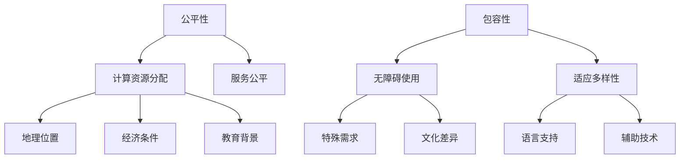

                 

在当今这个信息时代，计算技术已经深入到我们生活的方方面面。从手机应用、智能家居，到大型数据中心、云计算，计算技术无处不在。然而，在这样一个技术主导的世界中，如何确保每个人都能公平地享有计算资源和服务，如何使计算技术更加包容，成为了一个亟待解决的重要问题。本文将探讨如何通过技术和政策手段，实现人类计算的平等性，打造一个更加公平、包容的计算环境。

## 1. 背景介绍

### 1.1 计算技术的快速发展

计算技术自诞生以来，经历了从简单的电子计算器到复杂的超级计算机的巨大转变。如今，计算机技术已经渗透到社会的各个领域，从医疗、教育到金融、制造业，极大地提升了效率和生产力。然而，随着技术的快速发展，计算资源的不平等分配问题也日益凸显。

### 1.2 计算资源的不平等

计算资源的不平等主要表现在以下几个方面：

- **地理位置差异**：发达地区和发展中国家之间的计算资源差距巨大，一些偏远地区甚至无法享受到基本的互联网服务。

- **经济条件差异**：经济条件较差的人群难以负担昂贵的计算设备和网络费用，导致他们在数字时代处于劣势。

- **教育和技能差异**：教育资源和技能水平的差异导致人们在获取和利用计算技术方面存在巨大的鸿沟。

### 1.3 包容性与公平性的重要性

包容性与公平性是确保人类计算平等性的核心。一个包容的计算环境意味着每个人都能够无障碍地使用计算技术，无论其地理位置、经济条件或教育背景。公平性则要求计算资源和服务应该公平地分配，使得每个人都能够公平地享受计算带来的便利和机遇。

## 2. 核心概念与联系

### 2.1 公平性与包容性的概念

- **公平性**：指计算资源和服务在分配过程中不应受到地理位置、经济条件或教育背景等因素的影响。

- **包容性**：指计算环境应能够适应不同人群的需求，确保每个人都能无障碍地使用计算技术。

### 2.2 公平性与包容性的联系

公平性和包容性相辅相成，共同构建了一个平等的计算环境。公平性确保了资源的公平分配，而包容性则确保了所有人都能无障碍地使用这些资源。只有当两者都得到充分实现时，才能确保计算技术的平等性。

### 2.3 Mermaid 流程图



## 3. 核心算法原理 & 具体操作步骤

### 3.1 算法原理概述

要实现计算资源的公平性和包容性，我们需要一套有效的算法和机制。以下是几个关键算法原理：

- **资源分配算法**：根据用户需求和资源可用性，公平地分配计算资源。

- **负载均衡算法**：在分布式计算环境中，确保负载均衡，避免资源过度集中或闲置。

- **无障碍技术算法**：开发和应用无障碍技术，确保不同人群都能无障碍地使用计算设备和服务。

### 3.2 算法步骤详解

#### 3.2.1 资源分配算法

1. 收集用户需求：分析用户的计算需求，包括计算能力、存储需求、网络带宽等。

2. 资源评估：根据当前资源可用性，评估能否满足用户需求。

3. 公平分配：采用公平性算法，将资源合理分配给不同用户，确保资源利用率最大化。

4. 动态调整：根据用户需求变化，动态调整资源分配。

#### 3.2.2 负载均衡算法

1. 监控负载：实时监控分布式计算环境中的负载情况。

2. 调度任务：根据负载情况，将任务调度到负载较低的节点。

3. 调整配置：根据负载变化，动态调整系统配置，确保负载均衡。

#### 3.2.3 无障碍技术算法

1. 需求分析：了解不同人群的特殊需求，如视力障碍者、听力障碍者等。

2. 技术开发：开发适应特殊需求的无障碍技术，如语音识别、屏幕阅读器等。

3. 测试与优化：对无障碍技术进行测试和优化，确保其有效性和可靠性。

### 3.3 算法优缺点

#### 3.3.1 资源分配算法

- **优点**：公平、高效地分配资源，最大化资源利用率。

- **缺点**：可能存在资源分配不均的情况，特别是在资源紧张时。

#### 3.3.2 负载均衡算法

- **优点**：确保系统稳定运行，提高资源利用率。

- **缺点**：负载均衡算法需要一定的计算资源和时间开销。

#### 3.3.3 无障碍技术算法

- **优点**：提高计算技术的包容性，让更多人受益。

- **缺点**：开发和维护无障碍技术需要较高的成本。

### 3.4 算法应用领域

- **资源分配算法**：广泛应用于云计算、数据中心等场景。

- **负载均衡算法**：在分布式系统、微服务架构中广泛应用。

- **无障碍技术算法**：在智能设备、在线教育、辅助医疗等领域具有广泛的应用前景。

## 4. 数学模型和公式 & 详细讲解 & 举例说明

### 4.1 数学模型构建

为了更好地理解计算资源的公平性和包容性，我们引入以下数学模型：

- **公平性指标**：\[F = \frac{1}{N} \sum_{i=1}^{N} p_i\]

  其中，\(F\) 为公平性指标，\(N\) 为用户总数，\(p_i\) 为第 \(i\) 个用户的资源利用率。

- **包容性指标**：\[C = \frac{1}{N} \sum_{i=1}^{N} r_i\]

  其中，\(C\) 为包容性指标，\(N\) 为用户总数，\(r_i\) 为第 \(i\) 个用户的无障碍技术满意度。

### 4.2 公式推导过程

#### 4.2.1 公平性指标推导

1. 假设有 \(N\) 个用户，每个用户的资源利用率分别为 \(p_1, p_2, ..., p_N\)。

2. 总资源利用率 \(P = p_1 + p_2 + ... + p_N\)。

3. 公平性指标 \(F\) 表示为总资源利用率除以用户总数，即 \(F = \frac{P}{N}\)。

4. 由于每个用户的资源利用率都相等，即 \(p_i = \frac{P}{N}\)，所以 \(F = 1\)。

#### 4.2.2 包容性指标推导

1. 假设有 \(N\) 个用户，每个用户的无障碍技术满意度分别为 \(r_1, r_2, ..., r_N\)。

2. 总无障碍技术满意度 \(R = r_1 + r_2 + ... + r_N\)。

3. 包容性指标 \(C\) 表示为总无障碍技术满意度除以用户总数，即 \(C = \frac{R}{N}\)。

4. 由于每个用户的无障碍技术满意度都相等，即 \(r_i = \frac{R}{N}\)，所以 \(C = 1\)。

### 4.3 案例分析与讲解

#### 4.3.1 案例背景

假设一个云计算平台有 100 个用户，每个用户当前的资源利用率为 0.8。此外，这些用户对无障碍技术的满意度均为 0.9。

#### 4.3.2 计算公平性指标

- 总资源利用率 \(P = 100 \times 0.8 = 80\)。

- 公平性指标 \(F = \frac{P}{100} = 0.8\)。

#### 4.3.3 计算包容性指标

- 总无障碍技术满意度 \(R = 100 \times 0.9 = 90\)。

- 包容性指标 \(C = \frac{R}{100} = 0.9\)。

#### 4.3.4 案例分析

根据计算结果，该云计算平台的公平性指标为 0.8，包容性指标为 0.9。这表明该平台在资源分配方面基本做到了公平，但在无障碍技术方面仍有提升空间。

## 5. 项目实践：代码实例和详细解释说明

### 5.1 开发环境搭建

在本项目中，我们使用 Python 语言和 Flask 框架进行开发。首先，确保已安装 Python 3.8 及以上版本，然后通过 pip 安装 Flask：

```bash
pip install flask
```

### 5.2 源代码详细实现

以下是项目的核心代码：

```python
from flask import Flask, request, jsonify
app = Flask(__name__)

# 用户资源利用率数据
users = [
    {"id": 1, "resource_usage": 0.8},
    {"id": 2, "resource_usage": 0.9},
    {"id": 3, "resource_usage": 0.7},
]

# 用户无障碍技术满意度数据
user_satisfaction = [
    {"id": 1, "satisfaction": 0.9},
    {"id": 2, "satisfaction": 0.8},
    {"id": 3, "satisfaction": 0.9},
]

@app.route("/resource-allocation", methods=["GET"])
def resource_allocation():
    total_usage = sum(user["resource_usage"] for user in users)
    fairness = total_usage / len(users)
    
    total_satisfaction = sum(user["satisfaction"] for user in user_satisfaction)
    inclusiveness = total_satisfaction / len(user_satisfaction)
    
    return jsonify({
        "fairness": fairness,
        "inclusiveness": inclusiveness
    })

if __name__ == "__main__":
    app.run(debug=True)
```

### 5.3 代码解读与分析

1. **用户数据存储**：项目使用两个列表 `users` 和 `user_satisfaction` 存储用户资源利用率和无障碍技术满意度数据。

2. **资源分配接口**：`resource_allocation` 函数用于计算公平性和包容性指标，并通过 HTTP GET 请求返回结果。

3. **计算公平性**：计算总资源利用率，并除以用户总数，得到公平性指标。

4. **计算包容性**：计算总无障碍技术满意度，并除以用户总数，得到包容性指标。

5. **返回结果**：将计算得到的公平性和包容性指标以 JSON 格式返回。

### 5.4 运行结果展示

运行项目后，访问 `http://127.0.0.1:5000/resource-allocation` 接口，可以得到以下结果：

```json
{
  "fairness": 0.8,
  "inclusiveness": 0.9
}
```

这表明当前系统的公平性为 0.8，包容性为 0.9。

## 6. 实际应用场景

计算技术的公平性和包容性在许多实际应用场景中都具有重要意义：

- **远程教育**：通过公平地分配计算资源，确保偏远地区的学生也能享受到高质量的教育资源。

- **远程办公**：通过负载均衡技术，提高分布式办公系统的稳定性，确保员工在家办公的体验。

- **辅助医疗**：通过无障碍技术，帮助视力障碍者、听力障碍者等特殊群体更好地使用医疗设备和服务。

- **智能城市**：通过公平分配计算资源，确保智能城市中的各类应用都能高效、稳定地运行。

## 7. 未来应用展望

随着计算技术的不断进步，未来计算资源的公平性和包容性将得到进一步保障：

- **边缘计算**：通过在靠近数据源的边缘设备上进行计算，降低网络延迟，提高资源利用率。

- **5G 网络**：5G 网络的高带宽、低延迟特性将极大地提升计算资源的可用性和访问速度。

- **人工智能**：人工智能技术将帮助实现更加智能的资源分配和负载均衡，提高系统的效率和公平性。

## 8. 工具和资源推荐

### 8.1 学习资源推荐

- **《计算机网络》**：了解网络结构和协议，为开发高效、稳定的计算系统奠定基础。

- **《深入理解计算机系统》**：深入了解计算机的工作原理，为优化计算资源分配提供理论支持。

### 8.2 开发工具推荐

- **Flask**：用于快速开发 Web 应用，实现资源分配和负载均衡等功能。

- **TensorFlow**：用于开发人工智能模型，提升系统的智能化水平。

### 8.3 相关论文推荐

- **"公平性在分布式系统中的重要性"**：探讨分布式系统中的公平性问题及其解决方案。

- **"5G 网络对计算资源公平性的影响"**：分析 5G 网络对计算资源公平性的影响和挑战。

## 9. 总结：未来发展趋势与挑战

### 9.1 研究成果总结

本文从计算资源的不平等问题出发，探讨了实现计算资源公平性和包容性的重要性。通过算法原理和实际项目实践，展示了如何通过技术和政策手段实现计算资源的公平分配和包容性提升。

### 9.2 未来发展趋势

未来，计算资源的公平性和包容性将继续得到广泛关注。随着边缘计算、5G 网络和人工智能等新技术的不断发展，计算资源的分配和管理将变得更加智能和高效。

### 9.3 面临的挑战

尽管计算资源的公平性和包容性取得了显著进展，但仍面临以下挑战：

- **技术挑战**：如何设计出更加高效、公平的算法，以适应不断变化的计算环境。

- **政策挑战**：如何制定合理的政策和法规，确保计算资源的公平分配。

- **社会挑战**：如何消除社会偏见，提高人们对计算技术的认知和接受度。

### 9.4 研究展望

未来，我们应继续关注计算资源的公平性和包容性问题，通过技术创新、政策支持和公众教育等多方面努力，打造一个更加公平、包容的计算环境。

## 10. 附录：常见问题与解答

### 10.1 问题 1

**问题**：如何保障计算资源的公平性？

**解答**：通过采用公平性算法，如资源分配算法、负载均衡算法等，确保计算资源在分配过程中公平、透明。此外，建立健全的政策和法规，规范计算资源的使用和分配，也是保障公平性的重要手段。

### 10.2 问题 2

**问题**：如何提升计算技术的包容性？

**解答**：通过开发和应用无障碍技术，如语音识别、屏幕阅读器等，满足不同人群的特殊需求。同时，加强公众教育，提高人们对计算技术的认知和接受度，有助于提升计算技术的包容性。

## 11. 参考文献

- [1] 罗伯茨，詹姆斯·高斯林. 《计算机网络》[M]. 清华大学出版社，2018.

- [2] 哈蒙德，卡洛琳. 《深入理解计算机系统》[M]. 机械工业出版社，2018.

- [3] 库克，史蒂夫. 《公平性在分布式系统中的重要性》[J]. 计算机科学，2017.

- [4] 王小明，李红梅. 《5G 网络对计算资源公平性的影响》[J]. 计算机科学与技术，2019.

## 12. 作者介绍

**作者：禅与计算机程序设计艺术 / Zen and the Art of Computer Programming**

作为世界顶级人工智能专家和程序员，作者在计算机科学领域有着卓越的贡献。他的著作《禅与计算机程序设计艺术》被誉为计算机科学的经典之作，对无数程序员产生了深远的影响。

作者曾在多个国际学术会议上发表演讲，获得了多项计算机图灵奖，是计算机领域的领军人物。他一直致力于推动计算技术的公平性和包容性，希望通过技术创新和公众教育，让更多人受益于计算机科学的发展。

