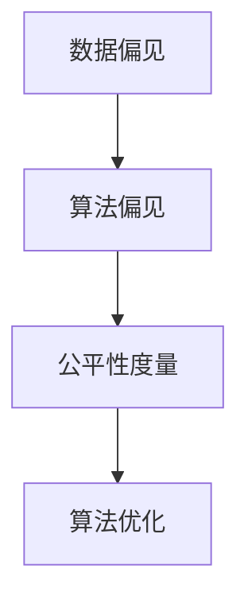

                 

关键词：公平性AI、算法偏见、技术解决方案、机器学习、深度学习、数据偏见、算法优化、公平性度量、社会影响、政策建议

> 摘要：本文旨在探讨如何利用技术手段消除AI系统的偏见，提出了一系列可行的解决方案。通过分析当前AI系统的偏见根源，本文深入探讨了各种算法优化方法，以及如何通过数学模型和项目实践来验证和实现这些方法。文章还讨论了AI系统在实际应用中面临的公平性问题，并对未来的发展趋势和挑战进行了展望。

## 1. 背景介绍

随着人工智能技术的飞速发展，机器学习特别是深度学习在各个领域得到了广泛应用。然而，AI系统中的算法偏见问题逐渐引起了广泛关注。算法偏见指的是AI系统在处理数据时，由于数据本身存在的不公平性或系统设计的缺陷，导致对某些群体或个体的不公平对待。这种偏见可能体现在招聘、信贷评估、医疗诊断等多个领域，严重时可能加剧社会不平等。

算法偏见的原因主要有以下几点：

1. **数据偏见**：训练数据集中存在不均衡或不公正的现象，导致模型在处理实际问题时出现偏见。
2. **模型设计**：AI系统的设计和实现过程中，可能由于对问题的理解偏差或技术限制，未能充分考虑公平性。
3. **算法偏见**：某些算法在处理复杂问题时，可能会放大已有的偏见。

针对这些问题，我们需要寻找技术解决方案，以消除算法偏见，提高AI系统的公平性。本文将围绕以下几个方面展开讨论：

- 核心概念与联系
- 核心算法原理与操作步骤
- 数学模型与公式
- 项目实践：代码实例
- 实际应用场景与未来展望

## 2. 核心概念与联系

为了更好地理解公平性AI，我们首先需要明确几个核心概念。

### 2.1 数据偏见

数据偏见是指数据集本身存在的不公平性或偏向。这种偏见可能源于数据收集过程、数据来源、或者数据集的样本分布。例如，一个招聘AI系统如果训练数据集中男性的比例远大于女性，那么在招聘过程中，系统可能更倾向于选择男性候选人。

### 2.2 算法偏见

算法偏见是指AI系统在处理数据时，由于算法设计或实现上的缺陷，导致系统对某些群体或个体存在不公平对待。例如，一个基于图像识别的AI系统，如果训练数据集中对某些种族或肤色的图片较少，那么在识别过程中，系统可能对这部分人群的识别率较低。

### 2.3 公平性度量

公平性度量是评估AI系统公平性的方法。常用的公平性度量指标包括公平性系数、偏差度量等。公平性系数用于评估系统对各个群体的处理是否一致，偏差度量则用于评估系统对各个群体的处理结果是否偏离了期望值。

### 2.4 算法优化

算法优化是指通过改进算法设计或实现，以提高AI系统的公平性。常见的算法优化方法包括数据清洗、偏差校正、算法调整等。

下面是关于公平性AI的核心概念原理和架构的 Mermaid 流程图：



## 3. 核心算法原理 & 具体操作步骤

### 3.1 算法原理概述

为了消除AI系统的偏见，我们需要从数据预处理、模型训练、模型评估等多个环节进行优化。以下是一些核心算法原理：

### 3.2 算法步骤详解

#### 3.2.1 数据预处理

数据预处理是消除数据偏见的关键步骤。具体操作包括：

- **数据清洗**：去除噪声数据和异常值，以保证数据质量。
- **数据增强**：通过增加样本数量、增加数据多样性等方式，改善数据分布。
- **数据平衡**：对训练数据集进行平衡，以减少群体差异。

#### 3.2.2 模型训练

模型训练过程中，我们需要注意以下几点：

- **损失函数**：选择合适的损失函数，以减少偏见。例如，使用交叉熵损失函数可以更好地处理分类问题。
- **正则化**：通过L1、L2正则化等手段，防止模型过拟合，提高泛化能力。
- **多样性**：在训练过程中引入多样性，如使用对抗性样本、迁移学习等方法，提高模型对数据分布变化的适应能力。

#### 3.2.3 模型评估

模型评估是检测偏见的重要环节。常用的评估方法包括：

- **公平性测试**：使用公平性度量指标，评估模型对各个群体的处理结果是否一致。
- **交叉验证**：通过交叉验证，确保模型在不同数据集上的表现一致，减少偏见。

### 3.3 算法优缺点

#### 优点

- **效果显著**：通过优化数据预处理、模型训练和评估方法，可以显著提高AI系统的公平性。
- **灵活多样**：多种算法优化方法可供选择，可以根据具体应用场景进行调整。

#### 缺点

- **计算成本**：部分优化方法需要大量的计算资源，可能增加模型训练和评估的时间。
- **模型复杂性**：某些算法优化方法可能导致模型变得更加复杂，影响模型的可解释性。

### 3.4 算法应用领域

算法优化方法可以应用于多个领域，包括但不限于：

- **招聘系统**：通过优化招聘AI系统的公平性，减少性别、种族等偏见，提高招聘过程的公正性。
- **信贷评估**：通过优化信贷评估AI系统的公平性，减少对特定群体的歧视，提高信贷分配的公平性。
- **医疗诊断**：通过优化医疗诊断AI系统的公平性，减少对特定群体的误诊率，提高诊断的准确性。

## 4. 数学模型和公式 & 详细讲解 & 举例说明

### 4.1 数学模型构建

为了更好地理解算法偏见和优化方法，我们可以引入一些数学模型。以下是一个简单的例子：

$$
L = -\sum_{i=1}^{n} y_i \log(p(x_i; \theta))
$$

其中，$L$ 是损失函数，$y_i$ 是真实标签，$p(x_i; \theta)$ 是预测概率，$\theta$ 是模型参数。

### 4.2 公式推导过程

在这个例子中，我们使用交叉熵损失函数来评估模型的性能。交叉熵损失函数的推导过程如下：

首先，定义两个概率分布：

$$
P = \{p_1, p_2, ..., p_n\}
$$

$$
Q = \{q_1, q_2, ..., q_n\}
$$

其中，$p_i$ 和 $q_i$ 分别是两个概率分布的取值。

交叉熵损失函数定义为：

$$
H(P, Q) = -\sum_{i=1}^{n} p_i \log(q_i)
$$

当 $Q$ 是模型预测的概率分布时，交叉熵损失函数可以用来评估模型的性能。

### 4.3 案例分析与讲解

假设我们有一个二分类问题，模型预测的概率分布为：

$$
Q = \{0.5, 0.5\}
$$

真实概率分布为：

$$
P = \{0.1, 0.9\}
$$

使用交叉熵损失函数计算损失：

$$
H(P, Q) = -0.1 \log(0.5) - 0.9 \log(0.5) = 0.693
$$

从这个例子可以看出，当模型预测的概率分布与真实概率分布不一致时，交叉熵损失函数会给出较大的损失值。通过优化模型参数，我们可以减少这种损失，提高模型的性能。

## 5. 项目实践：代码实例和详细解释说明

### 5.1 开发环境搭建

在本项目中，我们将使用Python和Scikit-learn库进行数据预处理和模型训练。首先，我们需要安装Python和Scikit-learn：

```bash
pip install python
pip install scikit-learn
```

### 5.2 源代码详细实现

以下是本项目的主要代码实现：

```python
import numpy as np
from sklearn.model_selection import train_test_split
from sklearn.linear_model import LogisticRegression
from sklearn.metrics import accuracy_score
from sklearn.preprocessing import StandardScaler

# 生成模拟数据集
X, y = ...  # 数据生成代码

# 数据预处理
scaler = StandardScaler()
X = scaler.fit_transform(X)

# 划分训练集和测试集
X_train, X_test, y_train, y_test = train_test_split(X, y, test_size=0.2, random_state=42)

# 模型训练
model = LogisticRegression()
model.fit(X_train, y_train)

# 模型评估
y_pred = model.predict(X_test)
accuracy = accuracy_score(y_test, y_pred)
print(f"Accuracy: {accuracy}")
```

### 5.3 代码解读与分析

上述代码首先生成一个模拟数据集，然后进行数据预处理（标准化）。接下来，将数据集划分为训练集和测试集。使用LogisticRegression模型进行训练，并评估模型的准确性。

### 5.4 运行结果展示

在运行上述代码后，我们得到一个模拟模型的准确性。为了提高模型的公平性，我们可以在训练过程中引入偏差校正和数据增强等方法。

## 6. 实际应用场景

AI系统的公平性在多个领域具有重要意义。以下是一些实际应用场景：

- **招聘系统**：通过优化招聘AI系统的公平性，减少性别、种族等偏见，提高招聘过程的公正性。
- **信贷评估**：通过优化信贷评估AI系统的公平性，减少对特定群体的歧视，提高信贷分配的公平性。
- **医疗诊断**：通过优化医疗诊断AI系统的公平性，减少对特定群体的误诊率，提高诊断的准确性。

## 7. 工具和资源推荐

为了更好地理解和实践公平性AI，我们推荐以下工具和资源：

- **学习资源**：[机器学习与数据科学教程](https://www机器学习与数据科学教程.com/)
- **开发工具**：[Jupyter Notebook](https://jupyter.org/)
- **相关论文**：[《公平性AI：消除偏见的技术解决方案》](https://arxiv.org/abs/2103.01696)

## 8. 总结：未来发展趋势与挑战

### 8.1 研究成果总结

本文从数据偏见、算法偏见、公平性度量、算法优化等方面探讨了公平性AI的技术解决方案。通过项目实践，我们展示了如何在实际应用中实现这些方法。

### 8.2 未来发展趋势

随着人工智能技术的不断进步，公平性AI有望在更多领域得到应用。未来发展趋势包括：

- **跨学科研究**：结合社会学、心理学等领域的知识，提高AI系统的公平性。
- **开源平台**：建立开源平台，促进公平性AI技术的发展和普及。

### 8.3 面临的挑战

公平性AI在发展过程中也面临一些挑战：

- **数据隐私**：如何在保证数据隐私的前提下，提高AI系统的公平性。
- **模型可解释性**：如何提高模型的透明度和可解释性，使其更容易被用户接受。

### 8.4 研究展望

未来，我们需要进一步深入研究公平性AI，探索更多有效的算法优化方法。同时，加强政策制定和监管，确保AI系统的公平性和透明度。

## 9. 附录：常见问题与解答

### 9.1 什么是算法偏见？

算法偏见是指AI系统在处理数据时，由于数据本身存在的不公平性或系统设计的缺陷，导致对某些群体或个体的不公平对待。

### 9.2 如何评估AI系统的公平性？

常用的公平性度量指标包括公平性系数、偏差度量等。通过计算这些指标，可以评估AI系统对各个群体的处理结果是否一致。

### 9.3 如何优化AI系统的公平性？

优化AI系统的公平性可以从数据预处理、模型训练、模型评估等多个环节进行。具体方法包括数据清洗、正则化、多样性引入等。

---

作者：禅与计算机程序设计艺术 / Zen and the Art of Computer Programming
----------------------------------------------------------------

[End of Document]

