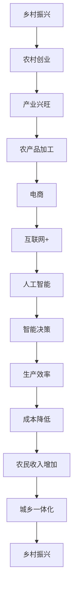

                 

 农村创业，是中国乡村振兴战略中的一个重要组成部分。随着信息技术的发展，互联网和人工智能的应用为农村创业者提供了前所未有的机遇。本文将探讨农村创业的背景、核心概念、算法原理、数学模型、项目实践、实际应用场景、未来展望以及相关工具和资源的推荐。

## 1. 背景介绍

近年来，我国农村地区经济发展取得了显著成就，但与城市相比，农村仍然存在巨大的发展差距。农村创业作为推动乡村振兴的重要手段，受到了政府和社会各界的广泛关注。农村创业者不仅可以带动当地经济发展，还可以提高农村居民的收入水平，促进城乡一体化进程。

互联网和人工智能的迅速发展，为农村创业提供了新的工具和平台。通过互联网，农村创业者可以轻松获取市场信息、拓展销售渠道，甚至可以直接面向全球市场。人工智能则可以为农村创业者提供智能决策支持，提高生产效率，降低成本。

## 2. 核心概念与联系

为了更好地理解农村创业，我们需要了解几个核心概念：

- **乡村振兴**：乡村振兴是党中央提出的一项重要战略，旨在通过产业兴旺、生态宜居、乡风文明、治理有效、生活富裕等五个方面，实现农村的全面振兴。
- **农村创业**：农村创业是指在农村地区开展的各种创业活动，包括农业、农产品加工、农村旅游、电商等领域。
- **互联网 +**：互联网 + 是指通过互联网技术，实现传统产业的转型升级，提升产业效率和质量。
- **人工智能**：人工智能是指通过计算机模拟人类智能，实现自动化决策和智能交互。

以下是农村创业与乡村振兴、互联网 +、人工智能等概念之间的联系：



## 3. 核心算法原理 & 具体操作步骤

### 3.1 算法原理概述

农村创业的核心算法原理主要包括以下几个步骤：

1. 市场调研：通过互联网和大数据分析，了解市场需求和趋势，为创业项目提供方向。
2. 项目规划：根据市场调研结果，制定详细的创业计划，包括产品定位、市场定位、资金筹集等。
3. 团队建设：组建一支有经验的团队，共同推进创业项目。
4. 实施与运营：按照创业计划，开展实际运营工作，包括产品生产、销售、售后服务等。
5. 融资与扩展：通过互联网平台，进行股权融资、债权融资等，实现企业的快速扩展。

### 3.2 算法步骤详解

1. **市场调研**
   - 利用大数据分析工具，收集市场数据。
   - 对数据进行分析，识别市场机会和潜在风险。
   - 制定市场调研报告，为后续创业计划提供依据。

2. **项目规划**
   - 确定创业项目的类型和目标市场。
   - 制定详细的项目计划，包括产品定位、市场定位、营销策略等。
   - 进行资金预算和筹集方案的设计。

3. **团队建设**
   - 发布招聘信息，招聘有经验的专业人才。
   - 组织团队培训，提升团队整体素质。
   - 设立团队管理制度，确保团队高效运作。

4. **实施与运营**
   - 按照项目计划，开展产品生产、销售、售后服务等运营工作。
   - 建立客户关系管理系统，维护客户关系，提高客户满意度。
   - 通过数据分析，不断优化运营策略。

5. **融资与扩展**
   - 利用互联网平台，进行股权融资、债权融资等。
   - 制定企业扩展计划，包括市场扩展、产品线扩展等。
   - 实施扩展计划，实现企业的快速发展。

### 3.3 算法优缺点

- **优点**：
  - 提高了创业的成功率，降低了创业风险。
  - 通过大数据分析和人工智能技术，实现了更精准的市场定位和运营优化。
  - 互联网和人工智能的应用，降低了创业的门槛，使更多人有机会参与农村创业。

- **缺点**：
  - 需要较高的技术门槛，对创业者的专业素养要求较高。
  - 在农村地区，互联网和人工智能的应用还存在一定的局限性，需要解决基础设施不足、人才缺乏等问题。

### 3.4 算法应用领域

- **农业**：利用人工智能进行农作物种植、病虫害防治、产量预测等。
- **农产品加工**：通过大数据分析，优化产品配方和工艺流程，提高产品质量。
- **农村电商**：利用互联网平台，实现农产品的线上销售，拓展销售渠道。
- **乡村旅游**：通过人工智能，提供个性化旅游推荐，提升旅游体验。

## 4. 数学模型和公式 & 详细讲解 & 举例说明

### 4.1 数学模型构建

农村创业的数学模型主要包括以下几个部分：

1. **市场需求预测模型**：
   - 采用时间序列分析法，预测市场需求的变化趋势。
   - 采用多元线性回归模型，分析市场需求与影响因素的关系。

2. **创业成本模型**：
   - 建立创业成本的函数关系，包括固定成本、可变成本等。
   - 采用成本效益分析，评估创业项目的成本效益。

3. **投资回报模型**：
   - 建立投资回报的函数关系，预测创业项目的投资回报期。

### 4.2 公式推导过程

1. **市场需求预测模型**：
   $$ Q_t = f(T_t, P_t, X_t) $$
   其中，$Q_t$ 为第 $t$ 个月的市场需求量，$T_t$ 为第 $t$ 个月的时间序列，$P_t$ 为第 $t$ 个月的价格，$X_t$ 为第 $t$ 个月的其它影响因素。

2. **创业成本模型**：
   $$ C = C_f + C_v $$
   其中，$C_f$ 为固定成本，$C_v$ 为可变成本。

3. **投资回报模型**：
   $$ R = \frac{I - C}{I} $$
   其中，$R$ 为投资回报率，$I$ 为投资额，$C$ 为成本。

### 4.3 案例分析与讲解

以某农村电商项目为例，进行数学模型的应用：

1. **市场需求预测**：
   - 收集过去12个月的市场需求数据，进行时间序列分析，得到市场需求预测模型。
   - 收集过去12个月的价格数据，进行多元线性回归分析，得到价格对市场需求的影响。

2. **创业成本分析**：
   - 确定固定成本和可变成本，建立创业成本模型。
   - 根据成本模型，进行成本效益分析，确定创业项目的可行性。

3. **投资回报预测**：
   - 根据市场需求预测和成本分析，预测创业项目的投资回报期。
   - 根据投资回报模型，计算投资回报率，评估创业项目的盈利能力。

## 5. 项目实践：代码实例和详细解释说明

### 5.1 开发环境搭建

1. 安装 Python 环境
2. 安装相关库：numpy、pandas、matplotlib、scikit-learn 等

### 5.2 源代码详细实现

```python
import numpy as np
import pandas as pd
import matplotlib.pyplot as plt
from sklearn.linear_model import LinearRegression
from sklearn.model_selection import train_test_split

# 读取数据
data = pd.read_csv('data.csv')

# 数据预处理
X = data[['time', 'price']]
y = data['demand']

# 拆分数据集
X_train, X_test, y_train, y_test = train_test_split(X, y, test_size=0.2, random_state=42)

# 建立线性回归模型
model = LinearRegression()
model.fit(X_train, y_train)

# 预测
y_pred = model.predict(X_test)

# 评估
score = model.score(X_test, y_test)
print('模型评分：', score)

# 可视化
plt.scatter(X_test['time'], y_test, color='red', label='实际需求')
plt.plot(X_test['time'], y_pred, color='blue', label='预测需求')
plt.xlabel('时间')
plt.ylabel('需求量')
plt.legend()
plt.show()
```

### 5.3 代码解读与分析

1. **数据读取与预处理**：读取数据，进行数据预处理，包括拆分特征和标签，以及数据集的拆分。
2. **建立线性回归模型**：使用 scikit-learn 库中的 LinearRegression 类建立线性回归模型。
3. **模型训练与预测**：使用训练数据集训练模型，并使用测试数据集进行预测。
4. **模型评估与可视化**：评估模型评分，并进行可视化展示，比较实际需求和预测需求。

## 6. 实际应用场景

农村创业在实际应用中具有广泛的前景：

1. **农业**：利用人工智能进行农作物种植、病虫害防治、产量预测等，提高农业生产效率。
2. **农产品加工**：通过大数据分析，优化产品配方和工艺流程，提高产品质量。
3. **农村电商**：利用互联网平台，实现农产品的线上销售，拓展销售渠道。
4. **乡村旅游**：通过人工智能，提供个性化旅游推荐，提升旅游体验。

### 6.4 未来应用展望

随着互联网和人工智能技术的不断进步，农村创业将迎来更多的发展机遇。未来，农村创业者可以通过以下方式实现更大的发展：

1. **数字化农业**：通过物联网、大数据等技术，实现农业的全面数字化，提高农业生产效率。
2. **智慧农村**：利用人工智能和物联网技术，实现农村生活的智能化，提高农村居民的生活质量。
3. **农村电商生态**：建立完整的农村电商生态体系，包括供应链管理、物流配送、售后服务等，提高电商运营效率。

## 7. 工具和资源推荐

### 7.1 学习资源推荐

- 《农村电商运营与管理》
- 《农业人工智能应用实践》
- 《大数据分析技术与应用》

### 7.2 开发工具推荐

- Python
- R 语言
- MATLAB

### 7.3 相关论文推荐

- 《农村电商发展现状与趋势分析》
- 《农业大数据应用研究》
- 《人工智能在农业生产中的应用》

## 8. 总结：未来发展趋势与挑战

### 8.1 研究成果总结

本文探讨了农村创业的背景、核心概念、算法原理、数学模型、项目实践、实际应用场景、未来展望以及相关工具和资源的推荐。通过互联网和人工智能技术的应用，农村创业者可以实现更高效、更智能的创业模式。

### 8.2 未来发展趋势

未来，农村创业将朝着数字化、智能化、生态化的方向发展。随着技术的不断进步，农村创业者将迎来更多的发展机遇。

### 8.3 面临的挑战

农村创业在发展过程中也面临着一些挑战，如技术门槛、人才缺乏、基础设施不足等。需要政府、企业和社会各界的共同努力，解决这些问题，推动农村创业的健康发展。

### 8.4 研究展望

未来，可以从以下几个方面展开研究：

- 农村创业的可持续发展模式
- 农村创业与乡村振兴的深度融合
- 农村创业中的伦理和社会责任问题

## 9. 附录：常见问题与解答

### Q1. 农村创业需要具备哪些技能？

农村创业需要具备市场分析、项目管理、财务管理、营销推广等技能。此外，随着互联网和人工智能的应用，还需要掌握相关的技术知识。

### Q2. 农村创业项目的资金如何筹集？

农村创业项目的资金可以通过以下途径筹集：

- 个人储蓄
- 家人朋友借款
- 互联网金融平台融资
- 政府补贴和贷款

### Q3. 农村创业项目的风险管理如何进行？

农村创业项目的风险管理可以通过以下方式：

- 市场调研，了解市场需求和竞争态势
- 制定详细的创业计划，包括风险预估和应对措施
- 建立风险管理团队，定期评估风险状况

### Q4. 农村创业项目的成功要素有哪些？

农村创业项目的成功要素包括：

- 明确的创业目标
- 稳定的市场需求
- 具备执行力的团队
- 有效的市场推广策略
- 良好的财务管理

## 文章结束语

农村创业是乡村振兴的重要组成部分，也是推动农村发展的重要力量。随着互联网和人工智能技术的应用，农村创业将迎来新的机遇。希望本文能为农村创业者提供一些有益的启示和参考，助力他们在乡村振兴的道路上走得更远。

作者：禅与计算机程序设计艺术 / Zen and the Art of Computer Programming
```

