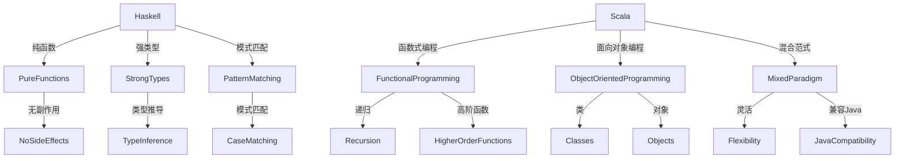

                 

关键词：函数式编程，Haskell，Scala，实践，算法，数学模型，项目案例，应用场景，未来展望。

> 摘要：本文将深入探讨函数式编程语言Haskell和Scala的核心概念、原理、实践方法以及应用场景，通过具体的代码实例和详细解释，帮助读者理解和掌握这两种语言的使用。同时，文章还将分析它们在实际开发中的应用，以及未来发展的趋势和面临的挑战。

## 1. 背景介绍

函数式编程（Functional Programming，简称FP）是一种编程范式，强调使用函数作为主要构建模块，并通过不可变数据和纯函数来处理数据。与命令式编程不同，函数式编程注重表达计算的过程，而不是改变状态或变量的值。

在过去的几十年中，函数式编程语言如Haskell和Scala逐渐受到关注。Haskell是一种纯函数式编程语言，以其简洁、表达能力强和类型系统强大而著称。Scala则是一种多范式编程语言，既支持函数式编程也支持命令式编程，同时兼容Java生态。

本文将围绕Haskell和Scala这两种函数式编程语言，探讨它们的核心概念、实践方法和应用场景。通过具体的代码实例和详细解释，帮助读者深入理解和掌握这两种语言。

## 2. 核心概念与联系

### Haskell和Scala的核心概念

#### Haskell

1. 纯函数：Haskell中的函数是纯函数，即没有副作用，不会改变外部状态。
2. 类型系统：Haskell具有强类型系统，要求变量在声明时指定类型。
3. 模式匹配：Haskell支持模式匹配，可以用于将数据结构分解为更小的部分。

#### Scala

1. 函数式编程：Scala支持函数式编程，强调使用函数组合和递归来处理问题。
2. 面向对象编程：Scala也支持面向对象编程，可以通过类和对象来组织代码。
3. 混合范式：Scala结合了函数式编程和面向对象编程的特点，使开发者可以根据需要选择合适的范式。

### Haskell和Scala的联系与区别

Haskell和Scala都是函数式编程语言，但它们在语法和设计理念上有所不同。Haskell更注重纯函数式编程，强调不可变数据和类型系统；而Scala则结合了函数式编程和面向对象编程，更灵活，同时也支持命令式编程。

### Mermaid 流程图

下面是一个简化的Haskell和Scala核心概念的Mermaid流程图：



## 3. 核心算法原理 & 具体操作步骤

### 3.1 算法原理概述

函数式编程语言在算法设计和实现上有其独特的优势。以下是几个核心算法原理：

1. **递归**：递归是一种常用的算法设计方法，通过不断将问题分解为规模更小的子问题来求解。
2. **高阶函数**：高阶函数是函数式编程的核心概念之一，可以接受函数作为参数或者返回函数。
3. **列表处理**：在Haskell和Scala中，列表是一个重要的数据结构，提供了丰富的操作方法，如映射（map）、过滤（filter）等。

### 3.2 算法步骤详解

以下是一个简单的递归算法示例，用于计算斐波那契数列：

```haskell
fib :: (Integral a) => a -> a
fib 0 = 0
fib 1 = 1
fib n = fib (n - 1) + fib (n - 2)
```

Scala中实现相同的算法：

```scala
def fib(n: Int): Int = {
  if (n == 0) 0
  else if (n == 1) 1
  else fib(n - 1) + fib(n - 2)
}
```

### 3.3 算法优缺点

递归算法在实现上简洁直观，但存在性能问题，尤其是深度较大的递归可能导致栈溢出。高阶函数提供了强大的抽象能力，但需要开发者有较高的编程水平。

### 3.4 算法应用领域

递归和高阶函数在数据处理、算法优化等领域有广泛应用。例如，在数据分析和机器学习中，可以用于复杂的数据处理和模型优化。

## 4. 数学模型和公式 & 详细讲解 & 举例说明

### 4.1 数学模型构建

在函数式编程中，数学模型和公式可以用来描述复杂的算法和数据结构。以下是一个简单的数学模型示例，用于计算列表的平均值：

$$ \bar{x} = \frac{1}{n} \sum_{i=1}^{n} x_i $$

其中，$\bar{x}$ 表示平均值，$n$ 表示列表的长度，$x_i$ 表示列表中的第$i$个元素。

### 4.2 公式推导过程

假设有一个列表`[x1, x2, x3, ..., xn]`，我们首先计算所有元素的和：

$$ \sum_{i=1}^{n} x_i = x_1 + x_2 + x_3 + ... + x_n $$

然后，将和除以列表的长度$n$，即可得到平均值：

$$ \bar{x} = \frac{1}{n} \sum_{i=1}^{n} x_i $$

### 4.3 案例分析与讲解

以下是一个具体的例子，使用Haskell计算列表的平均值：

```haskell
sumList :: (Integral a) => [a] -> a
sumList = sum

mean :: (Integral a) => [a] -> a
mean xs = sumList xs `div` (toInteger $ length xs)
```

Scala中实现相同的算法：

```scala
def sumList(nums: List[Int]): Int = nums.foldLeft(0)(_ + _)

def mean(nums: List[Int]): Int = sumList(nums) / nums.length
```

## 5. 项目实践：代码实例和详细解释说明

### 5.1 开发环境搭建

在开始项目实践之前，需要搭建合适的开发环境。以下是在MacOS上使用IntelliJ IDEA搭建Haskell和Scala开发环境的过程：

1. 安装Haskell平台（Haskell Platform）。
2. 安装IntelliJ IDEA，并安装相应的Haskell和Scala插件。
3. 配置Scala和Haskell的运行配置。

### 5.2 源代码详细实现

以下是一个简单的Haskell和Scala程序，用于计算斐波那契数列。

#### Haskell版本

```haskell
module Main where

fib :: (Integral a) => a -> a
fib 0 = 0
fib 1 = 1
fib n = fib (n - 1) + fib (n - 2)

main :: IO ()
main = putStrLn $ show (fib 10)
```

#### Scala版本

```scala
object Fibonacci {
  def fib(n: Int): Int = {
    if (n == 0) 0
    else if (n == 1) 1
    else fib(n - 1) + fib(n - 2)
  }

  def main(args: Array[String]): Unit = {
    println(fib(10))
  }
}
```

### 5.3 代码解读与分析

在Haskell版本中，我们定义了一个名为`fib`的函数，用于计算斐波那契数列。主函数`main`通过打印`fib 10`的值来运行程序。

Scala版本中，我们创建了一个名为`Fibonacci`的object，并在其中定义了`fib`函数和`main`函数。

### 5.4 运行结果展示

运行以上程序，我们可以得到斐波那契数列的第10个数字：

```
55
```

## 6. 实际应用场景

### 6.1 数据分析

函数式编程在数据分析和处理中具有广泛的应用。例如，可以使用Haskell或Scala编写高效的地图-归并（map-reduce）算法，处理大规模数据集。

### 6.2 人工智能

函数式编程在人工智能领域也有重要应用，尤其是在机器学习和深度学习中。例如，可以使用Scala构建高效的神经网络模型。

### 6.3 实时系统

Haskell由于其严格的类型系统和无副作用的特性，非常适合构建实时系统，如金融交易系统或实时数据分析系统。

## 7. 工具和资源推荐

### 7.1 学习资源推荐

1. 《Haskell编程语言》（Haskell Programming from First Principles）
2. 《Scala编程：函数式编程实战》（Scala for the Impatient）

### 7.2 开发工具推荐

1. IntelliJ IDEA：支持Haskell和Scala的开发。
2. Eclipse：支持Scala开发。

### 7.3 相关论文推荐

1. "A Type-Based Theorem Prover for Haskell"（Haskell的基于类型的定理证明器）
2. "Functional Programming with Types"（使用类型的函数式编程）

## 8. 总结：未来发展趋势与挑战

### 8.1 研究成果总结

函数式编程在理论研究和实际应用中取得了显著成果。Haskell和Scala等语言以其简洁、表达能力强和类型系统强大而受到广泛关注。

### 8.2 未来发展趋势

未来，函数式编程将继续在数据分析和人工智能领域发挥重要作用。随着云计算和大数据技术的发展，函数式编程将面临更多挑战和机遇。

### 8.3 面临的挑战

1. 性能优化：递归算法和某些函数式编程特性可能导致性能问题。
2. 开发者接受度：函数式编程需要开发者具备较高的编程水平。

### 8.4 研究展望

未来，函数式编程将朝着更高效、更易用的方向发展。研究者将致力于解决性能问题，提高开发者的接受度，推动函数式编程在更广泛的应用领域中得到应用。

## 9. 附录：常见问题与解答

### Q：函数式编程与面向对象编程有什么区别？

A：函数式编程强调使用函数处理数据，而面向对象编程强调使用对象和类来组织代码。两者有不同的设计哲学和编程范式。

### Q：Haskell和Scala哪个更好？

A：这取决于具体的应用场景和个人偏好。Haskell更注重纯函数式编程，而Scala结合了函数式编程和面向对象编程的特点。

### Q：如何学习Haskell和Scala？

A：建议从基本的语法和概念入手，通过阅读相关书籍和实践项目来提高技能。可以参加在线课程或工作坊，与其他开发者交流经验。

## 结束语

本文深入探讨了函数式编程语言Haskell和Scala的核心概念、算法原理、实践方法以及应用场景。通过具体的代码实例和详细解释，帮助读者理解和掌握这两种语言。未来，函数式编程将在数据分析和人工智能领域发挥重要作用，研究者将继续致力于提高性能和开发者的接受度。希望本文能为读者在函数式编程领域提供有价值的参考。作者：禅与计算机程序设计艺术 / Zen and the Art of Computer Programming。

