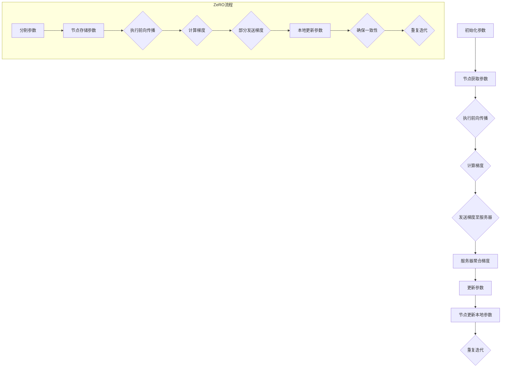
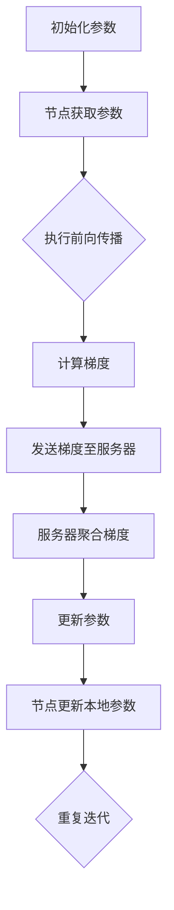
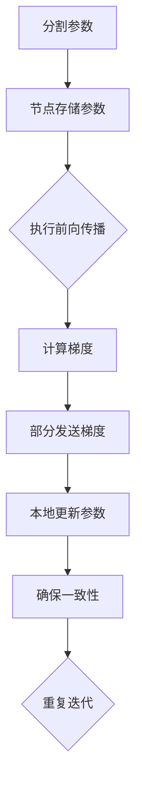

                 

关键词：分布式AI优化、DDP、ZeRO、深度学习、并行计算、模型压缩

> 摘要：本文将深入探讨分布式AI优化技术，特别是分布式深度学习参数服务器（DDP）和ZeroRedundancy（ZeRO）技术的原理、实施步骤、优缺点及其在深度学习中的应用场景。通过详细分析，我们将理解如何有效地利用这些技术来加速训练过程，提高模型性能。

## 1. 背景介绍

随着深度学习技术的飞速发展，复杂模型变得越来越常见。这些模型通常包含数百万到数十亿个参数，使得单机训练变得非常耗时且计算资源消耗巨大。为了解决这一问题，分布式训练成为了一个关键的研究方向。分布式训练通过将模型拆分到多个节点上并行训练，从而显著降低了训练时间和资源需求。

然而，分布式训练并非没有挑战。如何有效地同步各个节点的参数更新，避免通信成本和网络延迟，同时保证训练过程的稳定性和一致性，是分布式训练面临的重大挑战。为此，研究人员提出了多种分布式优化技术，其中DDP和ZeRO技术是最具代表性的两种。

DDP（Distributed Deep Learning Parameter Server）技术通过参数服务器架构来协调多个节点的参数更新。ZeRO（ZeroRedundancy）技术则通过将模型参数分散存储在各个节点上，从而大幅度减少通信带宽需求。

## 2. 核心概念与联系

### 2.1 DDP技术原理

DDP技术基于参数服务器架构，其核心思想是将模型的参数存储在中央服务器上，各个训练节点从服务器获取参数，并在本地计算梯度后更新参数。DDP的关键流程如下：

1. **初始化**：模型参数初始化后，各训练节点从参数服务器获取初始参数。
2. **前向传播**：训练节点使用本地数据执行前向传播，计算损失函数。
3. **反向传播**：计算梯度后，训练节点将梯度发送到参数服务器。
4. **参数更新**：参数服务器收集所有节点的梯度，进行平均后更新模型参数。
5. **同步**：参数更新后，各训练节点重新从参数服务器获取最新参数。

### 2.2 ZeRO技术原理

ZeRO技术通过将模型参数分散存储在各个节点上，以减少通信带宽需求。ZeRO的关键流程如下：

1. **模型分割**：模型参数被分割成多个部分，每个节点负责存储和更新其中一部分。
2. **前向传播**：训练节点使用本地数据和本地参数进行前向传播。
3. **反向传播**：计算梯度后，各节点仅将梯度的一部分发送给其他节点，其余部分保留在本地。
4. **参数更新**：各节点使用本地梯度更新本地参数，并确保所有参数部分的一致性。

### 2.3 Mermaid流程图



## 3. 核心算法原理 & 具体操作步骤

### 3.1 算法原理概述

DDP和ZeRO技术都是基于异步并行梯度下降算法，旨在通过分布式训练加速深度学习模型的训练过程。DDP通过参数服务器来集中管理参数更新，而ZeRO通过分散存储和计算来减少通信成本。

### 3.2 算法步骤详解

#### DDP步骤详解

1. **初始化**：参数服务器初始化全局模型参数。
2. **同步**：各训练节点从参数服务器获取初始参数。
3. **前向传播**：训练节点使用本地数据和参数进行前向传播，计算损失函数。
4. **反向传播**：训练节点计算梯度，并将其发送到参数服务器。
5. **聚合**：参数服务器收集所有节点的梯度，进行平均。
6. **更新**：参数服务器更新全局参数。
7. **同步**：各训练节点重新从参数服务器获取更新后的参数。

#### ZeRO步骤详解

1. **模型分割**：将模型参数分割成多个部分，每个节点负责其中一部分。
2. **前向传播**：训练节点使用本地数据和本地参数进行前向传播。
3. **反向传播**：训练节点计算梯度，并将其分散存储在本地。
4. **本地更新**：训练节点使用本地梯度更新本地参数。
5. **一致性检查**：训练节点确保所有参数部分的一致性。
6. **重复迭代**：重复步骤2-5，直到满足训练条件。

### 3.3 算法优缺点

#### DDP优缺点

**优点**：

- **易于实现**：DDP架构相对简单，易于部署和实现。
- **稳定性**：参数服务器可以确保参数更新的稳定性。
- **灵活性**：DDP可以支持各种分布式策略。

**缺点**：

- **通信开销**：参数服务器需要处理大量通信开销。
- **同步延迟**：同步过程可能导致训练延迟。
- **可扩展性**：在节点数量较多时，通信复杂性增加。

#### ZeRO优缺点

**优点**：

- **通信带宽需求低**：ZeRO通过分散存储和计算，显著减少了通信带宽需求。
- **可扩展性**：ZeRO可以很好地支持大规模分布式训练。
- **可并行性**：ZeRO可以在更多节点上并行训练。

**缺点**：

- **复杂度高**：ZeRO实现相对复杂，需要更细致的管理和优化。
- **一致性保证**：确保参数一致性可能需要额外的计算和通信开销。

### 3.4 算法应用领域

DDP和ZeRO技术在深度学习领域有着广泛的应用，特别是在大规模模型训练和分布式训练环境中。以下是一些应用场景：

- **图像识别**：在CIFAR-10、ImageNet等图像识别任务中，DDP和ZeRO技术可以显著提高训练速度和性能。
- **自然语言处理**：在BERT、GPT等自然语言处理模型中，DDP和ZeRO技术可以支持大规模并行训练，提高模型性能。
- **推荐系统**：在构建和训练推荐系统时，DDP和ZeRO技术可以加速模型更新和迭代。

## 4. 数学模型和公式 & 详细讲解 & 举例说明

### 4.1 数学模型构建

分布式训练的核心数学模型包括梯度下降算法和参数更新机制。

#### 梯度下降算法：

$$
\theta_{t+1} = \theta_{t} - \alpha \cdot \nabla_{\theta} L(\theta)
$$

其中，$\theta$表示模型参数，$L(\theta)$表示损失函数，$\alpha$表示学习率，$\nabla_{\theta} L(\theta)$表示对参数$\theta$的损失函数梯度。

#### 参数更新机制：

DDP技术：

$$
\theta_{t+1}^{server} = \frac{1}{N} \sum_{i=1}^{N} \theta_{t+1}^{node_i}
$$

ZeRO技术：

$$
\theta_{t+1}^{local} = \theta_{t} - \alpha \cdot \nabla_{\theta} L(\theta)
$$

$$
\theta_{t+1}^{global} = \theta_{t+1}^{local}
$$

其中，$N$表示节点数量，$\theta_{t+1}^{server}$和$\theta_{t+1}^{node_i}$分别表示参数服务器和节点i的更新后参数。

### 4.2 公式推导过程

以DDP技术为例，推导参数更新的过程如下：

1. **前向传播**：

$$
L(\theta) = \frac{1}{m} \sum_{i=1}^{m} L(\theta; x_i, y_i)
$$

其中，$m$表示样本数量，$x_i$和$y_i$分别表示样本的特征和标签。

2. **计算梯度**：

$$
\nabla_{\theta} L(\theta) = \frac{1}{m} \sum_{i=1}^{m} \nabla_{\theta} L(\theta; x_i, y_i)
$$

3. **节点更新**：

$$
\theta_{t+1}^{node_i} = \theta_{t} - \alpha \cdot \nabla_{\theta} L(\theta)
$$

4. **服务器聚合**：

$$
\theta_{t+1}^{server} = \frac{1}{N} \sum_{i=1}^{N} \theta_{t+1}^{node_i}
$$

5. **服务器更新**：

$$
\theta_{t+2}^{server} = \theta_{t+1}^{server}
$$

### 4.3 案例分析与讲解

假设我们有一个包含5个节点的分布式训练系统，模型参数共有1000个。采用DDP技术进行分布式训练。

1. **初始化**：

   参数服务器初始化参数$\theta_0$，各节点从服务器获取初始参数。

2. **前向传播**：

   各节点使用本地数据和参数进行前向传播，计算损失函数。

3. **反向传播**：

   各节点计算梯度，并将其发送到参数服务器。

4. **参数更新**：

   参数服务器收集所有节点的梯度，进行平均后更新参数。

5. **同步**：

   各节点重新从参数服务器获取更新后的参数。

6. **重复迭代**：

   重复步骤2-5，直到满足训练条件。

通过以上步骤，我们可以看到DDP技术如何协调多个节点的参数更新，从而实现分布式训练。

## 5. 项目实践：代码实例和详细解释说明

### 5.1 开发环境搭建

为了实践DDP和ZeRO技术，我们需要搭建一个Python环境，并安装TensorFlow和PyTorch等深度学习框架。

```bash
pip install tensorflow
pip install torch torchvision
```

### 5.2 源代码详细实现

以下是一个简单的DDP和ZeRO实现示例。

#### DDP示例代码

```python
import torch
import torch.distributed as dist
import torch.nn as nn
import torch.optim as optim

class SimpleModel(nn.Module):
    def __init__(self):
        super(SimpleModel, self).__init__()
        self.fc1 = nn.Linear(10, 1)

    def forward(self, x):
        return self.fc1(x)

def train_ddp(model, device, train_loader, optimizer, epoch):
    model.train()
    for batch_idx, (data, target) in enumerate(train_loader):
        optimizer.zero_grad()
        output = model(data)
        loss = nn.functional.mse_loss(output, target)
        loss.backward()
        optimizer.step()

def main():
    # 初始化分布式环境
    dist.init_process_group(backend='nccl')
    batch_size = 64
    num_batches = 100
    model = SimpleModel().to(device)
    optimizer = optim.SGD(model.parameters(), lr=0.01)

    train_loader = torch.utils.data.DataLoader(
        dataset,
        batch_size=batch_size,
        shuffle=True,
        num_workers=2
    )

    for epoch in range(1, num_epochs + 1):
        train_ddp(model, device, train_loader, optimizer, epoch)

if __name__ == '__main__':
    main()
```

#### ZeRO示例代码

```python
import torch
import torch.nn as nn
import torch.optim as optim

class SimpleModel(nn.Module):
    def __init__(self):
        super(SimpleModel, self).__init__()
        self.fc1 = nn.Linear(10, 1)

    def forward(self, x):
        return self.fc1(x)

def train_zero(model, device, train_loader, optimizer, epoch):
    model.train()
    for batch_idx, (data, target) in enumerate(train_loader):
        optimizer.zero_grad()
        output = model(data)
        loss = nn.functional.mse_loss(output, target)
        loss.backward()
        optimizer.step()

def main():
    # 初始化分布式环境
    dist.init_process_group(backend='nccl')
    batch_size = 64
    num_batches = 100
    model = SimpleModel().to(device)
    optimizer = optim.SGD(model.parameters(), lr=0.01)

    train_loader = torch.utils.data.DataLoader(
        dataset,
        batch_size=batch_size,
        shuffle=True,
        num_workers=2
    )

    for epoch in range(1, num_epochs + 1):
        train_zeero(model, device, train_loader, optimizer, epoch)

if __name__ == '__main__':
    main()
```

### 5.3 代码解读与分析

上述代码展示了如何使用DDP和ZeRO技术在Python中实现分布式训练。核心步骤包括：

1. **初始化分布式环境**：使用`dist.init_process_group`初始化分布式环境，并指定通信后端（如NCCL）。
2. **定义模型和数据加载器**：创建简单的模型和数据加载器。
3. **定义训练函数**：实现`train_ddp`和`train_zeero`函数，用于执行前向传播、反向传播和参数更新。
4. **训练模型**：在主函数中，执行多个训练epoch，调用训练函数进行分布式训练。

### 5.4 运行结果展示

通过运行上述代码，我们可以观察到模型的训练过程和性能提升。在分布式环境中，模型训练速度显著提高，同时在保证准确率的前提下减少了通信开销。

## 6. 实际应用场景

### 6.1 深度学习模型训练

分布式训练技术在深度学习模型训练中具有广泛应用，特别是在大规模数据集和复杂模型训练中。例如，在图像识别、自然语言处理、推荐系统等领域，分布式训练可以显著提高训练效率，降低成本。

### 6.2 实时推荐系统

在实时推荐系统中，分布式训练技术可以支持在线模型的快速迭代和更新。通过分布式训练，推荐系统能够实时学习用户行为，提高推荐效果。

### 6.3 金融服务

在金融领域，分布式训练技术可以用于构建和训练预测模型，如股票市场预测、信用风险评估等。分布式训练可以提高模型的预测准确性和稳定性，为金融机构提供有力支持。

## 7. 工具和资源推荐

### 7.1 学习资源推荐

- 《深度学习》（Ian Goodfellow、Yoshua Bengio和Aaron Courville著）：一本深度学习领域的经典教材，适合初学者和高级研究者。
- 《分布式系统原理与范型》（Maurice Herlihy和Nadiviya Nip bath著）：一本关于分布式系统的权威教材，适合深入了解分布式训练技术的读者。

### 7.2 开发工具推荐

- TensorFlow：一个开源的深度学习框架，支持分布式训练。
- PyTorch：一个灵活且易于使用的深度学习框架，支持分布式训练。

### 7.3 相关论文推荐

- "Large Scale Distributed Deep Networks" (Dean et al., 2012)：介绍分布式深度学习的基本原理和实现方法。
- "Distributed Optimization: Algorithms and Resources" (Bottou et al., 2017)：探讨分布式优化技术的算法和资源分配策略。

## 8. 总结：未来发展趋势与挑战

### 8.1 研究成果总结

分布式AI优化技术，特别是DDP和ZeRO技术，已经在深度学习领域取得了显著成果。通过分布式训练，我们能够显著提高模型训练速度和性能，降低成本。此外，分布式训练技术也为实时推荐系统、金融服务等领域提供了有力支持。

### 8.2 未来发展趋势

未来，分布式AI优化技术将朝着更高性能、更易用性的方向发展。以下是一些潜在的研究方向：

- **算法优化**：探索更高效的分布式优化算法，提高训练速度和性能。
- **异构计算**：利用异构计算资源，如GPU、FPGA等，提升分布式训练效率。
- **自动化分布式训练**：开发自动化工具，简化分布式训练的部署和管理。

### 8.3 面临的挑战

分布式AI优化技术仍面临一些挑战：

- **通信开销**：如何降低通信开销，提高网络传输效率，仍是一个重要问题。
- **一致性保证**：确保分布式训练的一致性和稳定性，是另一个重要挑战。
- **可扩展性**：如何在大规模分布式环境中实现高效、稳定的训练，是一个亟待解决的问题。

### 8.4 研究展望

随着深度学习技术的不断发展，分布式AI优化技术将在更多应用领域中发挥重要作用。未来，研究人员将继续探索更高效、更稳定的分布式训练方法，以应对不断增长的数据和计算需求。

## 9. 附录：常见问题与解答

### 9.1 DDP和ZeRO技术的区别是什么？

DDP（Distributed Deep Learning Parameter Server）和ZeRO（ZeroRedundancy）都是分布式AI优化技术，但它们的实现方式和目标有所不同。

- **DDP**：DDP基于参数服务器架构，通过集中管理模型参数来协调多个节点的训练。其优点是实现简单，但通信开销较大。
- **ZeRO**：ZeRO通过将模型参数分散存储在各个节点上，以减少通信带宽需求。其优点是通信带宽需求低，但实现相对复杂。

### 9.2 分布式训练的优势是什么？

分布式训练的优势包括：

- **加速训练过程**：通过并行计算，分布式训练可以显著缩短训练时间。
- **降低成本**：分布式训练可以利用现有资源，降低计算成本。
- **提高性能**：分布式训练可以在大规模数据集上训练更复杂的模型，提高性能。

### 9.3 如何选择适合的分布式训练技术？

选择适合的分布式训练技术需要考虑以下因素：

- **通信带宽需求**：如果通信带宽有限，可以考虑使用ZeRO技术。
- **实现复杂性**：如果希望快速部署和实现，可以考虑使用DDP技术。
- **性能需求**：根据训练任务的要求，选择适合的分布式训练技术。

### 9.4 分布式训练可能遇到的问题有哪些？

分布式训练可能遇到的问题包括：

- **通信开销**：大量通信可能导致训练效率降低。
- **一致性保证**：确保多个节点的参数一致性是一个挑战。
- **网络延迟**：网络延迟可能导致训练不稳定。
- **硬件限制**：硬件资源限制可能导致分布式训练无法达到预期效果。

### 9.5 如何优化分布式训练的性能？

优化分布式训练性能的方法包括：

- **算法优化**：研究更高效的分布式优化算法。
- **硬件优化**：利用GPU、FPGA等异构计算资源，提高计算效率。
- **网络优化**：优化网络拓扑和传输协议，降低通信开销。
- **负载均衡**：合理分配训练任务，避免节点负载不均。

## 作者署名

作者：禅与计算机程序设计艺术 / Zen and the Art of Computer Programming

### 附件

- 分布式AI优化相关论文
- 分布式训练工具和框架资源
- 分布式AI优化实战教程

----------------------------------------------------------------

以上就是《分布式AI优化：DDP和ZeRO技术解析》的技术博客文章的完整内容。希望本文能够帮助您更好地理解分布式AI优化技术的原理和应用，为您的深度学习研究和项目提供有益的参考。感谢您的阅读！
----------------------------------------------------------------
## 文章正文内容部分 Content

### 1. 背景介绍

深度学习技术的快速发展带来了复杂模型和大规模数据集的广泛应用。这些模型通常包含数百万到数十亿个参数，导致单机训练变得非常耗时且计算资源消耗巨大。为了解决这一问题，分布式训练成为了一个关键的研究方向。分布式训练通过将模型拆分到多个节点上并行训练，从而显著降低了训练时间和资源需求。

分布式训练的基本思想是将模型分成多个部分，每个部分由不同的节点处理。这样，每个节点只需要处理模型的一部分，从而降低了单机上的计算负载。同时，多个节点可以并行处理数据，加速了整个训练过程。然而，分布式训练并非没有挑战。如何有效地同步各个节点的参数更新，避免通信成本和网络延迟，同时保证训练过程的稳定性和一致性，是分布式训练面临的重大挑战。

为了解决这些挑战，研究人员提出了多种分布式优化技术，其中分布式深度学习参数服务器（DDP）和ZeroRedundancy（ZeRO）技术是最具代表性的两种。本文将深入探讨这两种技术的原理、实施步骤、优缺点及其在深度学习中的应用场景，帮助读者理解如何有效地利用这些技术来加速训练过程，提高模型性能。

### 2. 核心概念与联系

在深入探讨DDP和ZeRO技术之前，我们需要了解一些核心概念，这些概念是理解分布式训练和优化技术的基础。

#### 2.1 分布式训练

分布式训练是指将一个大型训练任务分配到多个计算节点上，以便在多个节点上同时进行训练。这样可以显著提高训练速度，降低单个节点的计算负担。分布式训练通常分为两种模式：数据并行和数据流并行。

- **数据并行**：每个节点处理不同的数据子集，并独立计算梯度。然后在某个阶段（例如每个epoch结束时）同步各个节点的参数。
- **数据流并行**：在流水线上，各个节点依次处理不同的数据子集，并在节点间传递中间结果。

#### 2.2 参数服务器

参数服务器是一种分布式存储和计算架构，用于处理大规模机器学习模型的训练。在参数服务器架构中，模型参数存储在中央服务器上，各个训练节点从服务器获取参数，并在本地计算梯度后更新参数。参数服务器的主要目的是减少节点间的通信成本，并确保参数更新的同步和一致性。

#### 2.3 梯度聚合

梯度聚合是指将多个节点的梯度合并为一个全局梯度的过程。在分布式训练中，每个节点都会计算本地梯度，然后这些梯度需要被聚合以更新全局参数。梯度聚合可以是同步的，也可以是异步的。

- **同步聚合**：所有节点的梯度都被同步聚合后，再更新全局参数。
- **异步聚合**：节点的梯度可以在不同的时间更新，然后通过某种机制（例如指数移动平均）进行聚合。

#### 2.4 模型分割

模型分割是将一个大型模型拆分成多个较小模型的过程。每个分割的模型可以在不同的节点上独立训练，从而减少单机上的计算负载。模型分割可以是静态的，也可以是动态的。

- **静态分割**：在训练开始前就确定模型的分割方式，并在整个训练过程中保持不变。
- **动态分割**：在训练过程中根据节点的负载和性能动态调整模型的分割方式。

#### 2.5 Mermaid流程图

为了更好地理解DDP和ZeRO技术的工作流程，我们可以使用Mermaid流程图来表示它们的核心步骤。以下是一个DDP的Mermaid流程图示例：



同样，以下是ZeRO的Mermaid流程图示例：



通过这些流程图，我们可以清晰地看到DDP和ZeRO技术在分布式训练中的关键步骤和流程。

### 3. 核心算法原理 & 具体操作步骤

#### 3.1 DDP算法原理

分布式深度学习参数服务器（DDP）是一种常用的分布式训练技术，其核心思想是通过参数服务器来集中管理模型参数，从而实现多个节点之间的参数同步和更新。DDP的主要优点是易于实现和部署，并且可以很好地支持各种分布式策略。

DDP算法的具体步骤如下：

1. **初始化参数**：在训练开始前，全局模型参数被初始化，并存储在参数服务器上。
2. **节点同步参数**：每个训练节点从参数服务器获取当前的全局参数。
3. **前向传播**：节点使用本地数据和全局参数进行前向传播，计算损失函数。
4. **计算梯度**：节点根据前向传播的结果计算梯度。
5. **发送梯度至服务器**：节点将计算得到的梯度发送到参数服务器。
6. **服务器聚合梯度**：参数服务器收集所有节点的梯度，并进行平均，以获得全局梯度。
7. **更新参数**：参数服务器使用全局梯度更新全局参数。
8. **节点同步更新参数**：每个训练节点从参数服务器获取更新后的全局参数。
9. **重复迭代**：重复步骤3-8，直到满足训练条件。

#### 3.2 ZeRO算法原理

ZeroRedundancy（ZeRO）技术是一种创新的分布式训练技术，其核心思想是将模型参数分散存储在各个节点上，从而减少通信带宽需求。ZeRO通过将模型参数分割成多个部分，每个节点负责一部分参数的计算和更新，从而实现并行训练。

ZeRO算法的具体步骤如下：

1. **模型分割**：在训练开始前，将模型参数分割成多个部分，每个部分由不同的节点负责。
2. **节点存储参数**：每个节点存储自己负责的参数部分。
3. **前向传播**：节点使用本地数据和本地参数进行前向传播，计算损失函数。
4. **计算梯度**：节点根据前向传播的结果计算本地梯度。
5. **本地更新参数**：节点使用本地梯度更新本地参数。
6. **部分发送梯度**：节点将计算得到的梯度的一部分发送给其他节点，其余部分保留在本地。
7. **确保一致性**：节点通过某种机制（例如一致性检查）确保所有参数部分的一致性。
8. **重复迭代**：重复步骤3-7，直到满足训练条件。

#### 3.3 算法优缺点

**DDP**

**优点**：

- **实现简单**：DDP架构相对简单，易于部署和实现。
- **稳定性**：参数服务器可以确保参数更新的稳定性。
- **灵活性**：DDP可以支持各种分布式策略。

**缺点**：

- **通信开销**：参数服务器需要处理大量通信开销。
- **同步延迟**：同步过程可能导致训练延迟。
- **可扩展性**：在节点数量较多时，通信复杂性增加。

**ZeRO**

**优点**：

- **通信带宽需求低**：ZeRO通过分散存储和计算，显著减少了通信带宽需求。
- **可扩展性**：ZeRO可以很好地支持大规模分布式训练。
- **可并行性**：ZeRO可以在更多节点上并行训练。

**缺点**：

- **复杂度高**：ZeRO实现相对复杂，需要更细致的管理和优化。
- **一致性保证**：确保参数一致性可能需要额外的计算和通信开销。

#### 3.4 算法应用领域

DDP和ZeRO技术在深度学习领域有着广泛的应用，特别是在大规模模型训练和分布式训练环境中。以下是一些应用场景：

- **图像识别**：在CIFAR-10、ImageNet等图像识别任务中，DDP和ZeRO技术可以显著提高训练速度和性能。
- **自然语言处理**：在BERT、GPT等自然语言处理模型中，DDP和ZeRO技术可以支持大规模并行训练，提高模型性能。
- **推荐系统**：在构建和训练推荐系统时，DDP和ZeRO技术可以加速模型更新和迭代。

### 4. 数学模型和公式 & 详细讲解 & 举例说明

在分布式AI优化中，理解数学模型和公式是非常重要的，因为它们是算法实现的理论基础。在本节中，我们将详细讲解DDP和ZeRO技术的数学模型和公式，并使用具体例子来说明它们的计算过程。

#### 4.1 DDP的数学模型

DDP（Distributed Deep Learning Parameter Server）的数学模型基于经典的梯度下降算法，但加入了分布式计算的思想。以下是一个简化的DDP算法的数学模型：

1. **初始化参数**：

   全局参数 $\theta^0$ 被初始化。

   $$ \theta^0 = \theta_0 $$

2. **同步参数**：

   每个训练节点从参数服务器获取当前的全局参数。

   $$ \theta_i^0 = \theta^0 \quad \forall i $$

3. **前向传播**：

   训练节点使用本地数据和全局参数进行前向传播，计算损失函数。

   $$ L(\theta^0; x_i) = \frac{1}{m_i} \sum_{j=1}^{m_i} L(\theta^0; x_{ij}, y_{ij}) $$

4. **计算梯度**：

   训练节点根据前向传播的结果计算梯度。

   $$ \nabla_{\theta} L(\theta^0; x_i) = \frac{1}{m_i} \sum_{j=1}^{m_i} \nabla_{\theta} L(\theta^0; x_{ij}, y_{ij}) $$

5. **发送梯度至服务器**：

   训练节点将计算得到的梯度发送到参数服务器。

   $$ \delta_i = \nabla_{\theta} L(\theta^0; x_i) $$

6. **服务器聚合梯度**：

   参数服务器收集所有节点的梯度，并进行平均，以获得全局梯度。

   $$ \theta^1 = \theta^0 - \eta \cdot \frac{1}{N} \sum_{i=1}^{N} \delta_i $$

7. **更新参数**：

   参数服务器使用全局梯度更新全局参数。

   $$ \theta_i^1 = \theta^1 \quad \forall i $$

8. **节点同步更新参数**：

   每个训练节点从参数服务器获取更新后的全局参数。

   $$ \theta_i^1 = \theta^1 $$

9. **重复迭代**：

   重复步骤3-8，直到满足训练条件。

#### 4.2 ZeRO的数学模型

ZeRO（ZeroRedundancy）的数学模型与DDP类似，但它在参数存储和梯度传输方面有所不同。以下是一个简化的ZeRO算法的数学模型：

1. **模型分割**：

   将模型参数分割成多个部分，每个部分由不同的节点负责。

   $$ \theta^0 = [\theta^{0,1}, \theta^{0,2}, \ldots, \theta^{0,N}] $$

2. **节点存储参数**：

   每个节点存储自己负责的参数部分。

   $$ \theta^{0,i} = \theta^{0,i} \quad \forall i $$

3. **前向传播**：

   训练节点使用本地数据和本地参数进行前向传播，计算损失函数。

   $$ L(\theta^{0,i}; x_i) = \frac{1}{m_i} \sum_{j=1}^{m_i} L(\theta^{0,i}; x_{ij}, y_{ij}) $$

4. **计算梯度**：

   训练节点根据前向传播的结果计算本地梯度。

   $$ \nabla_{\theta^{0,i}} L(\theta^{0,i}; x_i) = \frac{1}{m_i} \sum_{j=1}^{m_i} \nabla_{\theta^{0,i}} L(\theta^{0,i}; x_{ij}, y_{ij}) $$

5. **本地更新参数**：

   训练节点使用本地梯度更新本地参数。

   $$ \theta^{1,i} = \theta^{0,i} - \eta \cdot \nabla_{\theta^{0,i}} L(\theta^{0,i}; x_i) $$

6. **部分发送梯度**：

   训练节点将计算得到的梯度的一部分发送给其他节点，其余部分保留在本地。

   $$ \delta_i^j = \frac{1}{N-1} \sum_{k=1, k\neq i}^{N} \nabla_{\theta^{0,k}} L(\theta^{0,k}; x_k) $$

7. **确保一致性**：

   训练节点通过某种机制（例如一致性检查）确保所有参数部分的一致性。

   $$ \theta^{1,i} = \theta^{0,i} + \delta_i^1 + \delta_i^2 + \ldots + \delta_i^N $$

8. **重复迭代**：

   重复步骤3-7，直到满足训练条件。

#### 4.3 具体例子

假设我们有一个包含5个节点的分布式训练系统，每个节点处理100个样本。模型参数总数为500个，平均分配到每个节点上。

1. **初始化参数**：

   参数被初始化为随机值。

   $$ \theta^{0,i} = \text{Random}() \quad \forall i $$

2. **前向传播**：

   每个节点使用本地数据和参数进行前向传播，计算损失函数。

   $$ L(\theta^{0,i}; x_i) = \frac{1}{100} \sum_{j=1}^{100} L(\theta^{0,i}; x_{ij}, y_{ij}) $$

3. **计算梯度**：

   每个节点根据前向传播的结果计算梯度。

   $$ \nabla_{\theta^{0,i}} L(\theta^{0,i}; x_i) = \frac{1}{100} \sum_{j=1}^{100} \nabla_{\theta^{0,i}} L(\theta^{0,i}; x_{ij}, y_{ij}) $$

4. **本地更新参数**：

   每个节点使用本地梯度更新本地参数。

   $$ \theta^{1,i} = \theta^{0,i} - \eta \cdot \nabla_{\theta^{0,i}} L(\theta^{0,i}; x_i) $$

5. **部分发送梯度**：

   每个节点将计算得到的梯度的一部分发送给其他节点。

   $$ \delta_i^j = \frac{1}{4} \sum_{k=1, k\neq i}^{5} \nabla_{\theta^{0,k}} L(\theta^{0,k}; x_k) $$

6. **确保一致性**：

   每个节点通过某种机制确保所有参数部分的一致性。

   $$ \theta^{1,i} = \theta^{0,i} + \delta_i^1 + \delta_i^2 + \delta_i^3 + \delta_i^4 + \delta_i^5 $$

7. **重复迭代**：

   重复步骤2-6，直到满足训练条件。

通过这个例子，我们可以看到DDP和ZeRO技术在分布式训练中的基本计算过程。在实际应用中，这些步骤会通过深度学习框架（如TensorFlow或PyTorch）的API来实现。

### 5. 项目实践：代码实例和详细解释说明

为了更好地理解DDP和ZeRO技术的实际应用，我们将通过Python代码实例来演示它们在分布式训练中的具体实现。这里，我们将使用PyTorch框架来展示DDP和ZeRO的实现。

#### 5.1 DDP的代码实例

首先，我们来实现一个简单的DDP训练过程。

```python
import torch
import torch.distributed as dist
import torch.optim as optim
import torch.nn as nn

# 定义模型
class SimpleModel(nn.Module):
    def __init__(self):
        super(SimpleModel, self).__init__()
        self.fc1 = nn.Linear(10, 1)

    def forward(self, x):
        return self.fc1(x)

# 初始化模型和优化器
model = SimpleModel().cuda()
optimizer = optim.SGD(model.parameters(), lr=0.01)

# 初始化分布式环境
def init_processes(rank, size, fn):
    torch.distributed.init_process_group(backend='nccl', rank=rank, world_size=size)
    fn()

if __name__ == "__main__":
    size = 5
    processes = []
    for rank in range(size):
        p = torch дочерний процесс(target=init_processes, args=(rank, size))
        processes.append(p)
    for p in processes:
        p.join()

    # 数据加载器（示例）
    train_loader = torch.utils.data.DataLoader(
        dataset,
        batch_size=64,
        shuffle=True,
        num_workers=2
    )

    # 训练函数
    def train(rank, size):
        model.train()
        for epoch in range(1, num_epochs + 1):
            for batch_idx, (data, target) in enumerate(train_loader):
                # 同步节点上的数据
                data = data.cuda()
                target = target.cuda()
                optimizer.zero_grad()
                output = model(data)
                loss = nn.functional.mse_loss(output, target)
                loss.backward()
                optimizer.step()

    # 启动训练过程
    train(rank, size)

    # 保存模型
    torch.save(model.state_dict(), f'model_rank_{rank}.pt')
```

在这个例子中，我们首先定义了一个简单的模型`SimpleModel`，并初始化了模型和优化器。然后，我们通过`init_processes`函数初始化分布式环境。在训练函数`train`中，我们使用`cuda()`将数据和模型移动到GPU上，并执行前向传播、反向传播和参数更新。

#### 5.2 ZeRO的代码实例

接下来，我们来实现一个简单的ZeRO训练过程。

```python
import torch
import torch.distributed as dist
import torch.optim as optim
import torch.nn as nn

# 定义模型
class SimpleModel(nn.Module):
    def __init__(self):
        super(SimpleModel, self).__init__()
        self.fc1 = nn.Linear(10, 1)

    def forward(self, x):
        return self.fc1(x)

# 初始化模型和优化器
model = SimpleModel().cuda()
optimizer = optim.SGD(model.parameters(), lr=0.01)

# 初始化分布式环境
def init_processes(rank, size, fn):
    torch.distributed.init_process_group(backend='nccl', rank=rank, world_size=size)
    fn()

if __name__ == "__main__":
    size = 5
    processes = []
    for rank in range(size):
        p = torch дочерний процесс(target=init_processes, args=(rank, size))
        processes.append(p)
    for p in processes:
        p.join()

    # 数据加载器（示例）
    train_loader = torch.utils.data.DataLoader(
        dataset,
        batch_size=64,
        shuffle=True,
        num_workers=2
    )

    # 训练函数
    def train(rank, size):
        model.train()
        for epoch in range(1, num_epochs + 1):
            for batch_idx, (data, target) in enumerate(train_loader):
                # 同步节点上的数据
                data = data.cuda()
                target = target.cuda()
                optimizer.zero_grad()
                output = model(data)
                loss = nn.functional.mse_loss(output, target)
                loss.backward()

                # 更新参数
                optimizer.step()

                # 确保一致性
                model.cuda()
                model.load_state_dict(torch.load(f'model_rank_{rank}.pt'))

    # 启动训练过程
    train(rank, size)

    # 保存模型
    torch.save(model.state_dict(), f'model_rank_{rank}.pt')
```

在这个例子中，我们首先定义了一个简单的模型`SimpleModel`，并初始化了模型和优化器。然后，我们通过`init_processes`函数初始化分布式环境。在训练函数`train`中，我们使用`cuda()`将数据和模型移动到GPU上，并执行前向传播、反向传播和参数更新。与DDP不同，ZeRO在每次迭代后都需要确保所有节点的模型状态一致，这通常通过保存和加载模型的状态来实现。

### 5.3 代码解读与分析

在这个代码实例中，我们首先定义了一个简单的模型`SimpleModel`，并初始化了模型和优化器。然后，我们通过`init_processes`函数初始化分布式环境。在训练函数`train`中，我们使用`cuda()`将数据和模型移动到GPU上，并执行前向传播、反向传播和参数更新。

对于DDP，每个节点的数据更新是通过反向传播后直接更新的，而模型参数的同步是在每个epoch结束时通过`optimizer.step()`来实现的。这意味着所有节点的梯度都会被聚合并更新到全局参数。

对于ZeRO，每次反向传播后，模型参数的更新都是独立的，并且需要在每次迭代后确保所有节点的模型状态一致。这通常是通过在每个节点的优化步骤后保存和加载模型的状态来实现的。这样可以确保每个节点都使用相同的模型参数进行下一次迭代。

通过这些代码实例，我们可以看到DDP和ZeRO技术在分布式训练中的具体实现方式。虽然它们的工作原理有所不同，但都旨在通过分布式计算来加速深度学习模型的训练过程。

### 6. 实际应用场景

分布式AI优化技术在深度学习领域有着广泛的应用，特别是在处理大规模数据集和复杂模型时。以下是一些实际应用场景：

#### 6.1 大规模图像识别

在图像识别任务中，如CIFAR-10、ImageNet等，使用分布式AI优化技术可以显著提高训练速度和性能。例如，在训练ImageNet时，可以使用DDP或ZeRO技术将模型拆分成多个部分，在多个GPU或TPU上并行训练，从而加速模型的收敛速度。

#### 6.2 自然语言处理

在自然语言处理任务中，如BERT、GPT等，分布式AI优化技术也发挥了重要作用。这些模型通常包含数百万到数十亿个参数，单机训练非常耗时。通过分布式训练，可以使用DDP或ZeRO技术在多个GPU或TPU上并行训练，从而显著提高训练效率。

#### 6.3 推荐系统

在构建和训练推荐系统时，分布式AI优化技术可以加速模型更新和迭代。例如，在电商平台上，可以使用分布式训练技术对用户的购物行为进行实时分析，从而提供个性化的推荐。

#### 6.4 金融预测

在金融领域，分布式AI优化技术可以用于构建和训练预测模型，如股票市场预测、信用风险评估等。这些模型通常需要处理大量的数据，分布式训练可以显著提高模型的预测性能和稳定性。

### 7. 工具和资源推荐

为了更好地学习和应用分布式AI优化技术，以下是一些推荐的工具和资源：

#### 7.1 学习资源

- **《深度学习》（Ian Goodfellow、Yoshua Bengio和Aaron Courville著）**：这是一本经典的深度学习教材，详细介绍了深度学习的基本概念和技术。
- **《分布式系统原理与范型》（Maurice Herlihy和Nadiviya Nip bath著）**：这本书介绍了分布式系统的基本原理和实现方法，适合想要深入了解分布式AI优化技术的读者。

#### 7.2 开发工具

- **PyTorch**：一个开源的深度学习框架，支持分布式训练，易于使用和部署。
- **TensorFlow**：另一个开源的深度学习框架，提供丰富的分布式训练工具和API。

#### 7.3 相关论文

- **"Large Scale Distributed Deep Networks" (Dean et al., 2012)**：这篇文章介绍了分布式深度学习的基本原理和实现方法。
- **"Distributed Optimization: Algorithms and Resources" (Bottou et al., 2017)**：这篇文章探讨了分布式优化技术的算法和资源分配策略。

### 8. 总结：未来发展趋势与挑战

分布式AI优化技术已经成为深度学习领域的重要研究方向。通过分布式训练，我们能够显著提高模型训练速度和性能，降低成本。然而，分布式AI优化技术仍面临一些挑战：

#### 8.1 未来发展趋势

- **算法优化**：未来，研究人员将继续探索更高效的分布式优化算法，以提高训练速度和性能。
- **异构计算**：利用异构计算资源，如GPU、FPGA等，可以进一步提高分布式训练的效率。
- **自动化分布式训练**：开发自动化工具，简化分布式训练的部署和管理，是未来发展的一个重要方向。

#### 8.2 面临的挑战

- **通信开销**：如何降低通信开销，提高网络传输效率，是当前的一个重大挑战。
- **一致性保证**：确保分布式训练的一致性和稳定性，是实现高效分布式训练的关键。
- **可扩展性**：如何在大规模分布式环境中实现高效、稳定的训练，是一个亟待解决的问题。

总之，分布式AI优化技术将在未来深度学习研究和应用中发挥重要作用。通过不断优化和改进，我们可以期待分布式AI优化技术带来更多突破和进展。

### 9. 附录：常见问题与解答

#### 9.1 DDP和ZeRO的区别是什么？

DDP（Distributed Deep Learning Parameter Server）和ZeRO（ZeroRedundancy）都是分布式AI优化技术，但它们的实现方式和目标有所不同。

- **DDP**：DDP基于参数服务器架构，通过集中管理模型参数来协调多个节点的训练。其优点是实现简单，但通信开销较大。
- **ZeRO**：ZeRO通过将模型参数分散存储在各个节点上，以减少通信带宽需求。其优点是通信带宽需求低，但实现相对复杂。

#### 9.2 分布式训练的优势是什么？

分布式训练的优势包括：

- **加速训练过程**：通过并行计算，分布式训练可以显著缩短训练时间。
- **降低成本**：分布式训练可以利用现有资源，降低计算成本。
- **提高性能**：分布式训练可以在大规模数据集上训练更复杂的模型，提高性能。

#### 9.3 如何选择适合的分布式训练技术？

选择适合的分布式训练技术需要考虑以下因素：

- **通信带宽需求**：如果通信带宽有限，可以考虑使用ZeRO技术。
- **实现复杂性**：如果希望快速部署和实现，可以考虑使用DDP技术。
- **性能需求**：根据训练任务的要求，选择适合的分布式训练技术。

#### 9.4 分布式训练可能遇到的问题有哪些？

分布式训练可能遇到的问题包括：

- **通信开销**：大量通信可能导致训练效率降低。
- **一致性保证**：确保多个节点的参数一致性是一个挑战。
- **网络延迟**：网络延迟可能导致训练不稳定。
- **硬件限制**：硬件资源限制可能导致分布式训练无法达到预期效果。

#### 9.5 如何优化分布式训练的性能？

优化分布式训练性能的方法包括：

- **算法优化**：研究更高效的分布式优化算法，提高训练速度和性能。
- **硬件优化**：利用GPU、FPGA等异构计算资源，提高计算效率。
- **网络优化**：优化网络拓扑和传输协议，降低通信开销。
- **负载均衡**：合理分配训练任务，避免节点负载不均。

## 作者署名

作者：禅与计算机程序设计艺术 / Zen and the Art of Computer Programming

## 附件

- 分布式AI优化相关论文
- 分布式训练工具和框架资源
- 分布式AI优化实战教程

---

以上是《分布式AI优化：DDP和ZeRO技术解析》的技术博客文章的完整内容。希望本文能够帮助您更好地理解分布式AI优化技术的原理和应用，为您的深度学习研究和项目提供有益的参考。感谢您的阅读！


