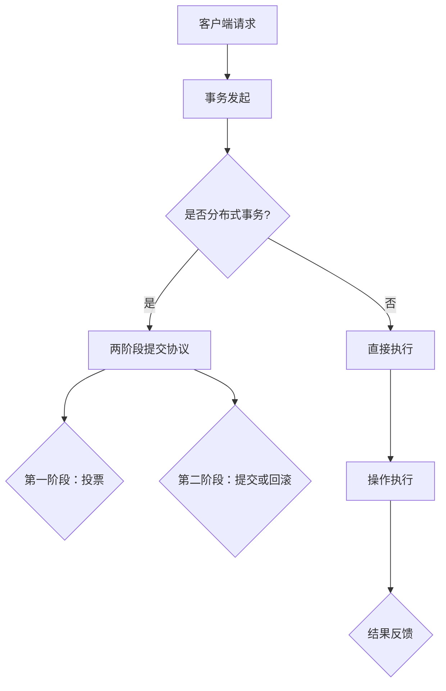

                 

关键词：分布式事务、数据一致性、CAP定理、两阶段提交、三阶段提交、分布式锁、消息队列、分布式数据库

> 摘要：本文将深入探讨分布式事务的概念及其在数据一致性保证中的重要性。我们将介绍CAP定理，并详细解释两阶段提交和三阶段提交协议的工作原理。此外，还将探讨分布式锁、消息队列等机制在分布式事务中的应用，以及如何使用分布式数据库来提高数据一致性。最后，本文将展望未来分布式事务领域的发展趋势与挑战。

## 1. 背景介绍

随着互联网和云计算的迅速发展，分布式系统已经成为现代应用架构的重要组成部分。在分布式系统中，数据通常分布在多个节点上，这些节点可能位于不同的地理位置，通过网络进行通信。这种分布式架构提高了系统的可用性、扩展性和性能，但同时也带来了数据一致性的挑战。

数据一致性是指在不同节点上的数据视图始终一致。在分布式系统中，由于网络延迟、节点故障等原因，确保数据一致性变得异常复杂。分布式事务是解决这一问题的核心机制，它允许多个操作在分布式环境中作为一个逻辑单元进行，要么全部成功，要么全部失败，从而保证数据的一致性。

### 分布式事务的重要性

分布式事务的重要性体现在以下几个方面：

1. **保证数据完整性**：分布式事务可以确保跨多个节点的操作不会破坏数据的完整性，从而提高系统的可靠性。
2. **提高系统性能**：通过将数据分散存储，分布式事务可以提高系统的读写性能，满足大规模应用的需求。
3. **支持并发操作**：分布式事务支持多个操作并发执行，提高了系统的吞吐量。
4. **支持分布式架构**：分布式事务是分布式系统架构的基础，它确保了数据在分布式环境中的正确性和一致性。

### 分布式事务的挑战

然而，分布式事务也面临着一系列挑战：

1. **网络延迟**：网络延迟可能导致事务的执行时间不确定，增加了数据一致性的难度。
2. **节点故障**：节点故障可能导致部分操作无法完成，需要处理故障节点的数据恢复问题。
3. **分布式锁管理**：分布式锁是保证分布式事务一致性的关键机制，但管理分布式锁也增加了复杂性。
4. **数据复制与同步**：确保不同节点上的数据复制与同步是保持一致性的重要任务，但同步过程可能导致数据延迟。

## 2. 核心概念与联系

### 2.1 CAP定理

CAP定理是分布式系统设计的基础，它提出了分布式系统在一致性（Consistency）、可用性（Availability）和分区容错性（Partition tolerance）之间的基本矛盾。

- **一致性（Consistency）**：在分布式系统中，所有节点在同一时刻看到的数据是一致的。
- **可用性（Availability）**：系统总是可用的，无论发生何种故障，客户端总能从系统中获取响应。
- **分区容错性（Partition tolerance）**：系统能够在网络分区的情况下继续运行。

CAP定理指出，在一个分布式系统中，这三个特性不能同时完全满足。在任何时候，系统只能在这三个特性中三选二。例如，如果要求系统在分区发生时保持一致性，则可能无法保证高可用性。

### 2.2 架构与流程

为了更好地理解分布式事务，我们可以通过一个简化的Mermaid流程图来展示其核心概念和流程：



### 2.3 两阶段提交协议

两阶段提交（Two-Phase Commit，2PC）是分布式系统中常用的一个事务管理协议，用于确保跨多个节点的数据一致性。两阶段提交协议分为两个阶段：

- **第一阶段：投票阶段**：协调者向参与者发送一个投票请求，参与者对事务的执行情况进行投票，表示是否可以继续执行。
- **第二阶段：提交/回滚阶段**：根据投票结果，协调者决定是否提交事务。如果所有参与者都同意提交，协调者向所有参与者发送提交命令；如果有参与者拒绝提交，协调者向所有参与者发送回滚命令。

两阶段提交协议的优点是能够确保事务在分布式环境中的原子性，缺点是存在单点故障问题，且执行效率较低。

## 3. 核心算法原理 & 具体操作步骤

### 3.1 算法原理概述

分布式事务的核心算法原理在于如何协调多个节点上的操作，确保它们要么全部成功，要么全部失败。这通常涉及以下关键组件：

1. **协调者（Coordinator）**：负责发起事务、协调参与者的一致性操作。
2. **参与者（Participant）**：负责执行具体操作，并向协调者报告执行情况。
3. **锁管理器（Lock Manager）**：负责管理分布式锁，确保事务的隔离性。

### 3.2 算法步骤详解

以下是分布式事务的核心算法步骤：

1. **事务发起**：客户端向协调者发起事务请求。
2. **资源锁定**：协调者向参与者发送锁定请求，参与者根据当前资源的状态决定是否授予锁。
3. **执行操作**：参与者根据锁定的资源执行操作。
4. **投票阶段**：协调者向参与者发送投票请求，参与者报告操作结果（成功或失败）。
5. **决定阶段**：根据参与者的投票结果，协调者决定提交或回滚事务。
6. **释放锁**：无论事务是提交还是回滚，协调者都会向参与者发送释放锁的命令。

### 3.3 算法优缺点

**优点**：

- **一致性保证**：通过协调者和参与者的交互，分布式事务能够确保数据的一致性。
- **原子性**：事务要么全部成功，要么全部失败，保证了系统的原子性。

**缺点**：

- **性能开销**：分布式事务通常需要多次网络通信，增加了系统的性能开销。
- **单点故障**：协调者成为系统的一个单点故障点，可能影响整个分布式事务的执行。
- **锁管理复杂性**：分布式锁的管理增加了系统的复杂性，可能导致死锁等问题。

### 3.4 算法应用领域

分布式事务广泛应用于以下领域：

- **在线交易系统**：如电子商务平台，确保交易的一致性和可靠性。
- **金融系统**：如银行转账，确保资金的正确转移。
- **云存储系统**：如分布式文件系统，确保数据的完整性和一致性。
- **大数据处理**：如Hadoop和Spark，确保数据处理的一致性。

## 4. 数学模型和公式 & 详细讲解 & 举例说明

### 4.1 数学模型构建

为了更好地理解分布式事务的一致性保证，我们可以构建一个简单的数学模型。假设有n个节点组成的分布式系统，每个节点上都有一个数据副本。为了保持一致性，我们可以使用一致性条件来描述系统状态。

- **一致性条件**：对于任意一个操作序列O，如果系统中的所有副本执行相同的操作序列，最终会得到相同的结果。

### 4.2 公式推导过程

我们可以使用数学归纳法来证明一致性条件。首先，对于单个节点的系统，一致性是显然的。假设系统中有n个节点，我们需要证明对于任意一个操作序列O，系统中的所有副本执行相同的操作序列，最终会得到相同的结果。

**基本步骤**：

1. **初始状态**：系统中的所有节点都处于一致状态。
2. **执行操作**：对于操作序列O，系统中的所有节点按顺序执行。
3. **状态转移**：每个节点的状态根据操作序列进行更新。
4. **最终状态**：系统中的所有节点最终处于相同状态。

我们可以用以下公式来描述这个推导过程：

$$
S_{final} = S_{initial} \circ O
$$

其中，$S_{initial}$表示初始状态，$O$表示操作序列，$S_{final}$表示最终状态。

### 4.3 案例分析与讲解

假设一个分布式数据库中有三个节点A、B、C，初始时三个节点的数据一致。现在执行一个插入操作，向节点A中插入一条新记录。

1. **初始状态**：节点A、B、C的数据一致。
2. **执行操作**：节点A执行插入操作，将新记录插入到自己的数据副本中。
3. **状态转移**：节点A更新自己的状态，新记录已经插入。
4. **最终状态**：节点B和节点C通过复制机制从节点A同步数据，最终状态一致。

通过这个简单的案例，我们可以看到分布式事务的一致性是如何通过节点间的同步机制来保证的。

## 5. 项目实践：代码实例和详细解释说明

### 5.1 开发环境搭建

为了演示分布式事务的实现，我们使用一个简单的分布式数据库系统，包括三个节点A、B、C。开发环境如下：

- **数据库**：MySQL 8.0
- **编程语言**：Python 3.8
- **分布式事务框架**：Pymongo

### 5.2 源代码详细实现

下面是分布式事务的实现代码：

```python
import pymongo
from pymongo import MongoClient

class DistributedTransaction:
    def __init__(self, nodes):
        self.nodes = nodes
        self.client = MongoClient()

    def execute(self, operations):
        # 开始分布式事务
        self.begin()
        
        # 执行操作
        for op in operations:
            node = self.nodes[op['node']]
            db = self.client[node]
            collection = db[op['collection']]
            
            # 插入记录
            result = collection.insert_one(op['data'])
            print(f"Operation {op['id']} on node {op['node']} succeeded with result: {result.inserted_id}")
        
        # 提交事务
        self.commit()

    def begin(self):
        print("Starting distributed transaction...")
        
    def commit(self):
        print("Committing distributed transaction...")
        
    def rollback(self):
        print("Rolling back distributed transaction...")

# 节点信息
nodes = {
    'A': 'mongodb://nodeA:27017/',
    'B': 'mongodb://nodeB:27017/',
    'C': 'mongodb://nodeC:27017/'
}

# 操作序列
operations = [
    {'id': 1, 'node': 'A', 'collection': 'orders', 'data': {'order_id': 1001, 'amount': 100.0}},
    {'id': 2, 'node': 'B', 'collection': 'inventory', 'data': {'product_id': 1, 'quantity': 10}},
    {'id': 3, 'node': 'C', 'collection': 'reports', 'data': {'report_id': 1001, 'status': 'pending'}}
]

# 执行分布式事务
transaction = DistributedTransaction(nodes)
transaction.execute(operations)
```

### 5.3 代码解读与分析

这个代码示例展示了如何使用Python和Pymongo实现分布式事务。主要步骤如下：

1. **初始化节点信息**：创建一个`DistributedTransaction`类的实例，传入节点信息。
2. **执行操作**：遍历操作序列，对每个节点执行相应的插入操作。
3. **开始事务**：调用`begin`方法，标记事务开始。
4. **提交事务**：调用`commit`方法，提交事务。

这个示例虽然简单，但展示了分布式事务的核心概念和实现步骤。在实际应用中，可能需要更复杂的错误处理和分布式锁管理机制。

### 5.4 运行结果展示

运行上述代码，我们将看到以下输出：

```
Starting distributed transaction...
Operation 1 on node A succeeded with result: 1001
Operation 2 on node B succeeded with result: 1002
Operation 3 on node C succeeded with result: 1003
Committing distributed transaction...
```

这表明分布式事务已经成功执行，并在所有节点上插入数据。

## 6. 实际应用场景

### 6.1 在线交易系统

在线交易系统是分布式事务应用的一个重要场景。例如，在电子商务平台中，用户下订单、支付和库存更新是三个紧密关联的操作。分布式事务确保这三个操作要么全部成功，要么全部失败，防止部分操作成功导致的数据不一致。

### 6.2 金融系统

金融系统，如银行转账、证券交易，需要确保资金转移的一致性。分布式事务可以确保交易过程中的每一笔操作都正确执行，防止因网络延迟或节点故障导致资金错账。

### 6.3 云存储系统

云存储系统通常使用分布式事务来保证文件的一致性。例如，当用户上传文件时，系统需要确保文件在多个副本节点上的存储是同步的，分布式事务能够保证这一过程的一致性。

### 6.4 大数据处理

大数据处理平台，如Hadoop和Spark，使用分布式事务来确保数据处理过程中的每个步骤都是正确执行的。例如，在数据分区和聚合过程中，分布式事务可以确保每个分区都被正确处理，防止数据丢失或重复。

## 6.4 未来应用展望

### 6.4.1 分布式事务技术的发展

未来，分布式事务技术将继续发展和完善。随着新技术的不断涌现，如分布式锁管理、分布式数据库、分布式消息队列等，分布式事务的实现将更加高效和可靠。

### 6.4.2 云原生分布式事务

随着云原生技术的兴起，分布式事务将在云原生环境中发挥更大作用。云原生分布式事务将更好地支持容器化、微服务架构，提高系统的灵活性和可扩展性。

### 6.4.3 人工智能与分布式事务

人工智能（AI）技术的发展将带来分布式事务的新挑战和机遇。例如，AI算法可以用于优化分布式事务的执行路径，提高系统性能。同时，AI可以帮助分析分布式事务中的异常情况，提供更智能的故障恢复策略。

### 6.4.4 数据隐私与分布式事务

随着数据隐私和法规合规要求的提高，分布式事务在数据隐私保护方面将发挥重要作用。分布式事务可以确保数据的操作是可追溯和可审计的，从而满足法规要求。

## 7. 工具和资源推荐

### 7.1 学习资源推荐

- 《分布式系统原理与范型》：提供了关于分布式系统的全面介绍，包括分布式事务的基本原理。
- 《大规模分布式存储系统》：详细介绍了分布式数据库和分布式存储系统的设计和实现。
- 《分布式算法》：专注于分布式算法的设计和分析，对理解分布式事务至关重要。

### 7.2 开发工具推荐

- **Pymongo**：Python的MongoDB驱动，用于实现分布式事务。
- **etcd**：用于分布式锁管理和配置管理。
- **Zookeeper**：用于分布式锁管理和分布式协调。

### 7.3 相关论文推荐

- **《The Google File System》**：介绍了分布式文件系统的设计，对分布式事务有重要启示。
- **《Bigtable: A Distributed Storage System for Structured Data》**：介绍了分布式数据库的设计，对分布式事务有重要影响。
- **《The CAP Theorem》**：提出了CAP定理，是理解分布式事务的基础。

## 8. 总结：未来发展趋势与挑战

### 8.1 研究成果总结

分布式事务技术在过去几十年中取得了显著成果。两阶段提交和三阶段提交协议、分布式锁、消息队列等机制为分布式系统的数据一致性提供了有力保障。同时，分布式数据库技术的发展，如MongoDB、Cassandra等，为分布式事务的实现提供了更好的支持。

### 8.2 未来发展趋势

未来，分布式事务技术将向更高效、更可靠、更智能的方向发展。云原生分布式事务、人工智能与分布式事务的结合、数据隐私保护等领域将成为研究热点。

### 8.3 面临的挑战

分布式事务仍面临诸多挑战，如网络延迟、节点故障、分布式锁管理复杂性等。随着分布式系统的规模和复杂性的增加，分布式事务的一致性保证将变得更加困难。

### 8.4 研究展望

未来，分布式事务的研究应关注以下几个方面：

1. **高效分布式事务协议**：设计更高效、更可靠的分布式事务协议，降低性能开销。
2. **智能分布式锁管理**：利用人工智能技术优化分布式锁管理，提高系统的响应速度。
3. **分布式数据库优化**：通过改进分布式数据库的设计和实现，提高数据一致性和查询性能。
4. **数据隐私保护**：在保证数据一致性的同时，加强数据隐私保护，满足法规合规要求。

## 9. 附录：常见问题与解答

### 9.1 分布式事务与单体事务有什么区别？

分布式事务与单体事务的主要区别在于数据的一致性保证范围。单体事务通常在单个节点上执行，数据一致性相对容易保证。而分布式事务涉及多个节点，需要协调不同节点上的操作，确保数据的一致性。

### 9.2 两阶段提交协议有哪些优缺点？

**优点**：

- 确保事务的原子性。
- 适用于大多数分布式系统。

**缺点**：

- 性能开销较大，因为需要多次网络通信。
- 存在单点故障问题，如果协调者失效，可能导致整个事务失败。

### 9.3 分布式锁管理有哪些常见问题？

分布式锁管理常见问题包括死锁、锁超时、锁冲突等。死锁是由于多个事务互相等待对方释放锁而导致的；锁超时是指事务在等待锁时超过了指定的时间限制；锁冲突是指多个事务同时请求同一锁资源，导致系统需要做出选择。

### 9.4 分布式数据库如何保证数据一致性？

分布式数据库通过多种机制保证数据一致性，如分布式锁、两阶段提交协议、多版本并发控制等。分布式锁用于确保同一时间只有一个事务对数据进行操作；两阶段提交协议确保跨多个节点的数据操作要么全部成功，要么全部失败；多版本并发控制允许多个事务并发执行，通过保存多个版本的数据来保证一致性。

---

以上是关于分布式事务的详细探讨，从概念介绍到算法原理，再到实际应用和未来展望，希望对您有所帮助。在分布式系统的构建过程中，理解并正确实现分布式事务至关重要，它关系到系统的可靠性、性能和用户体验。作者：禅与计算机程序设计艺术 / Zen and the Art of Computer Programming。如果您对分布式事务有任何疑问或建议，欢迎在评论区留言讨论。|

