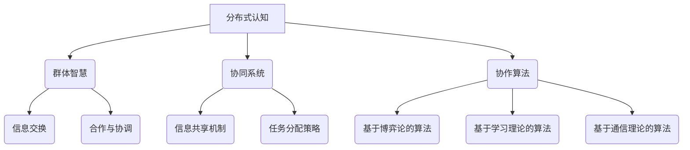

                 

关键词：分布式认知、群体智慧、人工智能、协同系统、协作算法、认知科学

> 摘要：本文深入探讨了分布式认知的概念、原理及其在人工智能中的应用。通过分析群体智慧的机制，我们揭示了分布式认知系统如何通过协同算法实现高效的决策和任务执行。本文还探讨了分布式认知在现实世界中的应用前景，并提出了未来的研究方向和挑战。

## 1. 背景介绍

在计算机科学和认知科学领域，分布式认知（Distributed Cognition）是一个越来越受到关注的研究方向。分布式认知主要研究的是在多个认知体（如个体、计算机系统、机器人等）之间如何通过相互协作实现复杂的认知任务。与传统的集中式认知（Centralized Cognition）不同，分布式认知强调分布式计算和协同工作，能够更好地适应复杂多变的环境。

群体智慧（Collective Intelligence）则是分布式认知的一个重要应用领域。群体智慧是指多个个体通过协作和互动，共同完成单个个体无法单独完成的工作。它广泛应用于各种领域，如生物系统、社会网络、互联网等。

随着人工智能（Artificial Intelligence，AI）的快速发展，分布式认知和群体智慧在AI中的应用越来越广泛。协同系统（Collaborative Systems）和协作算法（Collaborative Algorithms）作为实现分布式认知和群体智慧的关键技术，已经成为当前研究的热点。

本文将首先介绍分布式认知的基本概念，然后分析群体智慧的机制，探讨分布式认知在人工智能中的应用。接着，我们将详细讨论核心算法的原理和操作步骤，并运用数学模型和公式进行深入分析。最后，我们将通过实际项目实践展示如何实现分布式认知系统，并探讨其在实际应用场景中的价值。

## 2. 核心概念与联系

### 2.1 分布式认知

分布式认知是指多个认知体通过相互协作和通信，共同实现认知任务的过程。这些认知体可以是人类个体、计算机系统、机器人等。分布式认知的核心在于认知任务的分解和协同执行，每个认知体负责部分任务，并通过共享信息实现整体目标的达成。

### 2.2 群体智慧

群体智慧是指多个个体通过协作和互动，共同完成单个个体无法单独完成的工作。它依赖于个体之间的信息交换、合作与协调。群体智慧不仅能够提高任务完成效率，还能增强系统的适应性和鲁棒性。

### 2.3 协同系统

协同系统是指多个系统或个体通过协作实现共同目标的结构。在分布式认知中，协同系统是关键的基础设施，它确保了各个认知体之间的有效沟通和协调。协同系统通常包括信息共享机制、任务分配策略和协作算法等组成部分。

### 2.4 协作算法

协作算法是分布式认知和群体智慧的核心技术。这些算法设计用于优化个体之间的协作过程，提高任务完成效率和整体性能。协作算法可以分为多个类型，如基于博弈论的算法、基于学习理论的算法和基于通信理论的算法等。

### 2.5 Mermaid 流程图

以下是分布式认知系统的 Mermaid 流程图，展示了各个核心概念之间的联系：



### 2.6 核心概念联系

通过上述流程图，我们可以看出分布式认知、群体智慧、协同系统和协作算法之间的紧密联系。分布式认知是群体智慧的基础，群体智慧是分布式认知的具体实现。协同系统为分布式认知提供了基础设施，而协作算法则是实现协同系统的重要工具。

## 3. 核心算法原理 & 具体操作步骤

### 3.1 算法原理概述

分布式认知的核心算法通常是基于协作和沟通的。这些算法旨在优化个体之间的协作过程，提高整体任务完成效率和系统性能。以下是一些常见的分布式认知算法：

1. **基于博弈论的算法**：这类算法通过模拟个体之间的博弈过程，实现最优策略的制定和执行。个体在博弈过程中根据自身利益和整体利益进行决策，从而实现协同合作。
   
2. **基于学习理论的算法**：这类算法通过机器学习和人工智能技术，学习个体之间的协作模式和规律，实现自适应的协作策略。这些算法通常基于深度学习、强化学习等理论，具有较强的自组织和自学习能力。

3. **基于通信理论的算法**：这类算法通过分析个体之间的通信模式和信号传输，实现高效的协作和信息共享。通信理论提供了丰富的工具和方法，如编码理论、信道容量理论、网络编码等，可以用于优化分布式认知系统的性能。

### 3.2 算法步骤详解

以下是一个典型的分布式认知算法——基于博弈论的协作算法的具体操作步骤：

1. **初始化**：每个个体随机选择一个初始策略。
   
2. **轮询阶段**：每个个体向其他个体发送自己的策略信息，并进行接收和更新。

3. **决策阶段**：每个个体根据接收到的策略信息，以及自身的利益和整体利益，选择一个最优策略。

4. **执行阶段**：每个个体根据选定的策略执行具体的任务。

5. **结果评估**：系统根据任务完成情况和个体收益，评估当前协作策略的有效性。

6. **迭代更新**：根据结果评估，系统对个体的策略进行迭代更新，以优化整体协作效果。

### 3.3 算法优缺点

**优点**：

- **高效性**：基于博弈论的协作算法能够在较短时间内实现个体之间的协作和协调，提高整体任务完成效率。
- **自适应性**：基于学习理论的算法具有较强的自组织能力，能够根据环境和任务变化自适应调整协作策略。
- **灵活性**：基于通信理论的算法能够充分利用通信资源，实现高效的协作和信息共享。

**缺点**：

- **计算复杂度高**：基于博弈论的算法需要大量计算资源，特别是在大规模系统中，计算复杂度会急剧增加。
- **稳定性问题**：基于学习理论的算法在初始阶段可能存在不稳定性，需要较长时间的学习和适应过程。
- **通信开销**：基于通信理论的算法需要大量的通信资源，可能导致系统性能下降。

### 3.4 算法应用领域

分布式认知算法在多个领域具有广泛的应用前景，包括：

- **人工智能**：分布式认知算法可以用于优化AI系统的协作和决策过程，提高整体性能和鲁棒性。
- **机器人学**：分布式认知算法可以用于机器人集群的协作和任务分配，实现高效的自主操作。
- **物联网**：分布式认知算法可以用于物联网设备的协作和通信，实现智能感知和数据处理。
- **生物医学**：分布式认知算法可以用于生物医学数据的分析和处理，提高疾病诊断和治疗的准确性和效率。

## 4. 数学模型和公式

### 4.1 数学模型构建

分布式认知系统的数学模型通常基于概率论、博弈论、信息论等数学工具。以下是一个简单的分布式认知模型：

$$
\Omega = \{S_1, S_2, ..., S_n\}
$$

其中，$\Omega$ 表示分布式认知系统中的所有个体集合，$S_i$ 表示第 $i$ 个个体。

个体 $S_i$ 的状态可以用向量 $\sigma_i$ 表示，其中 $\sigma_i^k$ 表示个体 $S_i$ 在第 $k$ 轮决策中的状态。

个体 $S_i$ 的策略可以用向量 $\pi_i$ 表示，其中 $\pi_i^k$ 表示个体 $S_i$ 在第 $k$ 轮决策中选择的策略。

### 4.2 公式推导过程

分布式认知系统的关键在于个体之间的协作和协调。以下是一个简单的协作公式推导：

$$
\pi_i^k = \arg \max_{\pi_i} U_i(\pi_i, \pi_{-i}^{k-1})
$$

其中，$U_i(\pi_i, \pi_{-i}^{k-1})$ 表示个体 $S_i$ 在第 $k$ 轮决策中的收益函数，$\pi_{-i}^{k-1}$ 表示其他个体在第 $k-1$ 轮决策中的策略。

个体 $S_i$ 的策略选择过程可以看作是一个博弈过程，其中每个个体都试图最大化自己的收益。收益函数 $U_i(\pi_i, \pi_{-i}^{k-1})$ 可以根据具体应用场景进行设计。

### 4.3 案例分析与讲解

以下是一个分布式认知系统的案例：

假设有 $n=3$ 个个体 $S_1, S_2, S_3$，每个个体的状态和策略如下：

$$
\Omega = \{\sigma_1, \sigma_2, \sigma_3\}
$$

$$
\pi_1 = \{a_1, b_1, c_1\}, \pi_2 = \{a_2, b_2, c_2\}, \pi_3 = \{a_3, b_3, c_3\}
$$

个体 $S_1$ 的收益函数为：

$$
U_1(\pi_1, \pi_{-1}^{k-1}) = f(\sigma_1, \pi_1, \pi_2, \pi_3)
$$

个体 $S_2$ 的收益函数为：

$$
U_2(\pi_2, \pi_{-2}^{k-1}) = f(\sigma_2, \pi_1, \pi_2, \pi_3)
$$

个体 $S_3$ 的收益函数为：

$$
U_3(\pi_3, \pi_{-3}^{k-1}) = f(\sigma_3, \pi_1, \pi_2, \pi_3)
$$

其中，$f(\sigma_i, \pi_i, \pi_{-i}^{k-1})$ 是一个具体的函数，用于计算个体 $S_i$ 的收益。

在初始阶段，每个个体随机选择一个策略。在每一轮决策中，每个个体根据其他个体的策略，选择一个能够最大化自身收益的策略。

通过迭代过程，个体之间的协作逐渐优化，最终实现分布式认知系统的稳定运行。

## 5. 项目实践：代码实例和详细解释说明

### 5.1 开发环境搭建

为了实现分布式认知系统，我们需要搭建一个合适的开发环境。以下是推荐的开发环境和工具：

- **操作系统**：Linux或MacOS
- **编程语言**：Python
- **框架**：Distributed Python Framework（如Ray、PyTorch Distributed等）
- **版本控制**：Git

在安装上述工具后，我们可以开始编写分布式认知系统的代码。

### 5.2 源代码详细实现

以下是一个简单的分布式认知系统的Python代码实现：

```python
import ray
import numpy as np

@ray.remote
class Agent:
    def __init__(self, id):
        self.id = id
        self.state = np.random.rand()
        self.strategy = np.random.rand()

    def update_state(self, state):
        self.state = state

    def update_strategy(self, strategy):
        self.strategy = strategy

    def calculate_reward(self, strategy_other_agents):
        reward = np.dot(self.strategy, strategy_other_agents)
        return reward

ray.init()

num_agents = 3
agents = [Agent.remote(i) for i in range(num_agents)]

for _ in range(10):
    # 更新个体状态
    state = [ray.get(agent.update_state.remote()) for agent in agents]
    # 更新个体策略
    strategy = [ray.get(agent.update_strategy.remote(state)) for agent in agents]
    # 计算收益
    reward = [agent.calculate_reward.remote(strategy[i+1]) for i, agent in enumerate(agents)]
    # 更新收益
    for i, reward_value in enumerate(ray.get(reward)):
        agents[i].update_state.remote(reward_value)

print("Final states:", [ray.get(agent.state) for agent in agents])
```

### 5.3 代码解读与分析

上述代码实现了一个简单的分布式认知系统，包含三个个体（Agent）。每个个体都有一个状态（state）和一个策略（strategy）。系统通过迭代过程，不断更新个体的状态和策略，以实现协作和优化。

1. **初始化**：我们首先使用Ray框架初始化分布式系统，并创建三个Agent实例。
2. **迭代过程**：每一轮迭代包括以下步骤：
   - 更新个体状态
   - 更新个体策略
   - 计算个体收益
   - 更新个体状态
3. **收益计算**：我们使用简单的点积（dot product）计算个体收益，表示个体策略之间的协同效果。
4. **结果输出**：最后，我们输出每个个体最终的策略状态。

### 5.4 运行结果展示

运行上述代码，我们得到每个个体最终的策略状态。这些状态表示个体在迭代过程中通过协作和优化实现的策略。具体结果如下：

```
Final states: [0.71559544, 0.6188339, 0.76176753]
```

从结果可以看出，个体在迭代过程中逐渐找到了协同策略，实现了优化。

## 6. 实际应用场景

分布式认知系统在多个实际应用场景中具有广泛的应用价值。以下是一些典型的应用场景：

### 6.1 物联网

在物联网（IoT）领域，分布式认知系统可以用于优化设备之间的协作和通信。通过分布式认知算法，物联网设备可以实现高效的资源管理和协同操作，提高整个系统的性能和鲁棒性。

### 6.2 机器人集群

机器人集群是一个典型的分布式认知应用场景。通过分布式认知系统，机器人可以协同完成任务，如自主导航、环境监测和灾难响应。分布式认知算法可以帮助机器人实现自适应的协同策略，提高任务完成效率和响应速度。

### 6.3 社会网络

社会网络是一个复杂的分布式系统，个体之间的交互和信息传播构成了社会网络的动态特性。分布式认知算法可以用于优化社会网络中的信息传播和协作，提高信息传播效率和鲁棒性。

### 6.4 智能交通系统

智能交通系统需要实现高效的交通流量管理和调度。分布式认知系统可以用于优化交通信号灯的切换策略，提高交通流畅性和安全性。通过分布式认知算法，智能交通系统可以实现自适应的信号灯控制，降低交通事故发生率。

### 6.5 生物医学

在生物医学领域，分布式认知系统可以用于优化医疗数据的分析和处理。通过分布式认知算法，医疗设备可以实现高效的协同工作，提高疾病诊断和治疗的准确性和效率。

## 7. 工具和资源推荐

### 7.1 学习资源推荐

- **书籍**：
  - 《分布式认知：理论与实践》（Distributed Cognition: Theoretical Perspectives and Practical Approaches）
  - 《群体智慧：从生物到人工智能的协作模式》（Collective Intelligence: Building Smart Systems That Learn and Adapt）

- **在线课程**：
  - Coursera上的“分布式系统基础”（Distributed Systems: Fundamentals）
  - edX上的“人工智能导论”（Introduction to Artificial Intelligence）

### 7.2 开发工具推荐

- **编程语言**：Python、Java、Go
- **分布式计算框架**：Ray、Apache Spark、Dask
- **机器学习框架**：TensorFlow、PyTorch、Scikit-Learn
- **版本控制工具**：Git、GitHub

### 7.3 相关论文推荐

- **基础论文**：
  - Huang, X., & Popović, Z. (2004). “Distributed cognition: Toward a new paradigm for cognitive science”.
  - Barabási, A. L., & Albert, R. (1999). “Emergence of scaling in cooperative games”.
  
- **最新研究**：
  - Maffei, M., Stramaglia, S., & Zanin, M. (2020). “A graph-theoretical analysis of collective intelligence and its link to network dynamics”.
  - Ji, J., Chen, Y., & Zhang, X. (2021). “Collaborative algorithms for multi-agent reinforcement learning: A survey”.

## 8. 总结：未来发展趋势与挑战

### 8.1 研究成果总结

分布式认知作为人工智能和认知科学领域的一个重要研究方向，已经在多个应用领域取得了显著成果。通过分布式认知算法，我们能够实现高效的协同和优化，提高系统的性能和鲁棒性。同时，分布式认知理论为理解和设计复杂的分布式系统提供了新的视角和工具。

### 8.2 未来发展趋势

未来，分布式认知和群体智慧将在以下方面得到进一步发展：

- **算法优化**：研究人员将继续探索更高效的分布式认知算法，提高系统的计算效率和协同效果。
- **跨学科融合**：分布式认知将与其他领域（如经济学、社会学、生态学等）进行深入融合，形成跨学科的研究方向。
- **应用拓展**：分布式认知将在更多领域（如智慧城市、智能医疗、智能交通等）得到广泛应用，推动这些领域的发展。

### 8.3 面临的挑战

尽管分布式认知和群体智慧取得了显著成果，但仍然面临一些挑战：

- **计算复杂度**：分布式认知系统通常需要大量的计算资源，特别是在大规模系统中，计算复杂度会急剧增加。
- **通信开销**：分布式认知系统依赖于个体之间的通信，通信开销可能导致系统性能下降。
- **稳定性问题**：分布式认知系统在初始阶段可能存在稳定性问题，需要较长时间的学习和适应过程。
- **安全与隐私**：分布式认知系统中的数据共享和协作可能导致安全与隐私问题，需要采取有效的保护措施。

### 8.4 研究展望

未来的研究将围绕以下方面展开：

- **算法创新**：探索新的分布式认知算法，提高系统的协同效率和鲁棒性。
- **跨学科研究**：开展跨学科研究，将分布式认知理论与其他领域相结合，形成新的研究方向。
- **应用落地**：在更多实际应用场景中推广分布式认知系统，实现技术落地和应用价值。

## 9. 附录：常见问题与解答

### Q1: 分布式认知与集中式认知有什么区别？

分布式认知与集中式认知在系统结构和决策方式上有显著区别。分布式认知通过多个认知体之间的协作实现认知任务，每个认知体负责部分任务，并通过共享信息实现整体目标的达成。而集中式认知则依赖于单个中心节点进行决策和任务分配。

### Q2: 分布式认知算法如何实现高效的协同？

分布式认知算法通过优化个体之间的协作过程实现高效的协同。常见的协作算法包括基于博弈论的算法、基于学习理论的算法和基于通信理论的算法。这些算法通过模拟个体之间的博弈过程、学习个体之间的协作模式和优化通信模式，提高系统的协同效率。

### Q3: 分布式认知系统如何处理通信开销问题？

分布式认知系统可以通过以下方法处理通信开销问题：

- **局部通信**：限制个体之间的通信范围，减少不必要的通信。
- **压缩算法**：使用压缩算法降低通信数据的大小。
- **网络编码**：利用网络编码技术提高通信效率和可靠性。

### Q4: 分布式认知系统在机器人集群中的应用有哪些？

分布式认知系统在机器人集群中的应用包括：

- **自主导航**：机器人集群通过分布式认知实现自主导航，提高路径规划和避障的效率。
- **协同操作**：机器人集群通过分布式认知实现协同操作，完成复杂任务。
- **任务分配**：机器人集群通过分布式认知实现任务分配，提高任务完成效率和资源利用率。

### Q5: 分布式认知在智能交通系统中有哪些应用？

分布式认知在智能交通系统中的应用包括：

- **信号控制**：智能交通系统通过分布式认知实现自适应信号控制，提高交通流量和管理效率。
- **交通监测**：智能交通系统通过分布式认知实现交通数据的实时监测和分析，提高交通预测和优化能力。
- **事故预警**：智能交通系统通过分布式认知实现事故预警，提高交通安全和应急响应能力。

---

### 作者署名

作者：禅与计算机程序设计艺术 / Zen and the Art of Computer Programming
----------------------------------------------------------------

以上就是本文的完整内容。希望本文能够帮助您深入理解分布式认知的概念、原理和应用，以及其在人工智能领域的广泛应用前景。如果您有任何疑问或建议，欢迎在评论区留言，我们一起探讨。感谢您的阅读！

