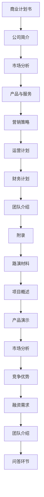

                 

 **关键词**：商业计划书，路演材料，创业公司，投资策略，市场营销，技术分析

> **摘要**：本文将探讨创业公司如何准备商业计划书和路演材料，包括核心概念、算法原理、数学模型、项目实践、应用场景以及未来发展展望等内容，旨在为创业者提供一整套系统化的指导。

## 1. 背景介绍

在当今激烈竞争的商业环境中，创业公司面临着前所未有的挑战和机遇。商业计划书和路演材料成为创业公司向投资者展示项目价值和潜力的重要工具。商业计划书是企业发展的战略指南，它不仅帮助创业者梳理业务逻辑，也为投资者提供决策依据。而路演材料则是创业者向潜在投资者展示项目亮点和竞争优势的窗口，直接影响投资者的决策。

然而，许多创业公司在准备商业计划书和路演材料时常常感到困惑和无从下手。本文将系统地介绍这些材料的结构和内容，并提供实用的建议和案例，帮助创业公司更有效地准备这些关键文件。

### 1.1 商业计划书的定义和作用

商业计划书是企业的一份正式文件，它详细描述了企业的业务模式、市场策略、财务计划和风险管理等内容。商业计划书的作用主要包括：

- **明确业务方向**：商业计划书可以帮助创业者明确企业的愿景、使命和战略目标，从而确保团队一致性和决策的连贯性。
- **吸引投资者**：商业计划书是创业者向投资者展示项目价值的利器，通过详细的数据和市场分析，增强投资者的信心。
- **内部管理**：商业计划书可以帮助企业内部各部门之间达成共识，确保业务运作的高效和有序。

### 1.2 路演材料的定义和作用

路演材料是创业公司向投资者进行现场演示的资料，通常包括幻灯片、演示文档、视频等。路演材料的作用主要包括：

- **展示项目亮点**：通过视觉和文字结合的方式，直观地展示企业的产品、技术和市场潜力。
- **建立信任**：良好的路演材料能够帮助创业者建立与投资者之间的信任，增强沟通效果。
- **引导投资决策**：路演材料提供了丰富的数据和案例，帮助投资者更全面地了解企业，从而做出更为明智的投资决策。

### 1.3 商业计划书和路演材料的区别

虽然商业计划书和路演材料有相似之处，但它们的目标和受众有所不同。商业计划书更注重详细的数据和市场分析，而路演材料则更注重展示和传达。商业计划书是静态的，而路演材料是动态的，需要现场互动和展示。

## 2. 核心概念与联系

### 2.1 商业计划书的结构

商业计划书通常包括以下几个核心部分：

1. **封面和目录**：简洁明了地列出商业计划书的结构和主要内容。
2. **公司简介**：介绍企业的背景、愿景和使命。
3. **市场分析**：分析目标市场的规模、趋势、竞争态势等。
4. **产品与服务**：详细描述企业的产品或服务，以及其独特性和竞争优势。
5. **营销策略**：阐述企业的营销策略和渠道。
6. **运营计划**：描述企业的日常运营流程和计划。
7. **财务计划**：包括财务预测、预算和风险评估。
8. **团队介绍**：介绍核心团队成员的背景和经验。
9. **附录**：包括相关证书、专利、合同等附件。

### 2.2 路演材料的结构

路演材料通常包括以下几个核心部分：

1. **封面和目录**：清晰展示路演材料的内容和结构。
2. **项目概述**：简要介绍项目的背景和目标。
3. **产品演示**：通过演示文档、视频等形式展示产品的功能和优势。
4. **市场分析**：结合数据和图表展示目标市场的规模和潜力。
5. **竞争优势**：分析企业的竞争优势和市场地位。
6. **融资需求**：明确企业的融资需求和预期回报。
7. **团队介绍**：展示核心团队成员的背景和经验。
8. **问答环节**：准备回答投资者可能提出的问题。

### 2.3 Mermaid 流程图

下面是一个简单的Mermaid流程图，展示了商业计划书和路演材料的结构和相互关系：



通过上述流程图，我们可以清晰地看到商业计划书和路演材料之间的逻辑关系和内容衔接。商业计划书为路演材料提供了详细的数据和市场分析支持，而路演材料则通过生动的展示和互动，进一步凸显企业的优势和潜力。

### 2.4 商业计划书与路演材料的联动

商业计划书和路演材料并不是孤立的，它们之间存在着紧密的联动关系。商业计划书中的详细数据和市场分析为路演材料提供了坚实的理论基础，而路演材料则通过直观的展示和互动，使得商业计划书中的内容更加生动和具体。

例如，在商业计划书中，可能有一段关于市场分析的内容，描述了目标市场的规模和增长趋势。而在路演材料中，可以结合具体的数据和图表，通过动态展示的方式，使得投资者更加直观地了解市场的潜力。

此外，商业计划书中的财务计划和运营计划等内容，也可以在路演材料中得到进一步的阐述和展示。通过路演材料，创业者可以更加具体地展示企业的运营情况和财务状况，从而增强投资者的信任和信心。

总之，商业计划书和路演材料是相辅相成的，创业者需要将两者紧密结合，形成一套完整、系统的展示方案，从而更好地吸引投资者的关注和投资。

## 3. 核心算法原理 & 具体操作步骤

### 3.1 算法原理概述

在创业公司的商业计划书和路演材料中，数据的分析和处理是一项至关重要的任务。为了确保数据分析的准确性和效率，我们可以采用一种名为“数据分析算法”的核心技术。数据分析算法的基本原理是通过一系列数学运算和信息处理，对大量数据进行分析和归纳，从而提取出有价值的信息和模式。

数据分析算法的核心原理主要包括以下几个方面：

1. **数据预处理**：在数据分析之前，需要对原始数据进行清洗、转换和整合，以确保数据的质量和一致性。
2. **特征提取**：从原始数据中提取出能够代表数据特征的信息，这些特征可以是数值型的，也可以是类别型的。
3. **模式识别**：利用统计学和机器学习算法，对特征进行分类和聚类，从而发现数据中的模式和规律。
4. **预测和评估**：根据已知的特征和模式，对未来的数据趋势和结果进行预测，并对预测结果进行评估和优化。

### 3.2 算法步骤详解

数据分析算法的具体操作步骤可以分为以下几个阶段：

#### 3.2.1 数据预处理

数据预处理是数据分析的基础步骤，主要包括以下几项任务：

1. **数据清洗**：去除数据中的错误值、异常值和重复值，确保数据的准确性。
2. **数据转换**：将不同类型的数据转换为同一类型，例如将文本数据转换为数值型数据。
3. **数据整合**：将来自不同数据源的数据进行整合，确保数据的一致性和完整性。

#### 3.2.2 特征提取

特征提取是从原始数据中提取出能够代表数据特征的信息。具体操作步骤如下：

1. **选择特征**：根据业务需求和数据分析目标，选择合适的特征进行提取。
2. **特征工程**：对选择的特征进行加工和处理，以提高特征的质量和代表性。
3. **特征标准化**：将不同特征进行标准化处理，使其具有相似的尺度和范围。

#### 3.2.3 模式识别

模式识别是数据分析的核心步骤，主要包括以下几项任务：

1. **分类**：将数据分为不同的类别，常用的分类算法包括决策树、支持向量机等。
2. **聚类**：将相似的数据归为一类，常用的聚类算法包括K-means、层次聚类等。
3. **关联规则挖掘**：发现数据之间的关联关系，常用的算法包括Apriori算法、FP-growth算法等。

#### 3.2.4 预测和评估

预测和评估是根据已知的特征和模式，对未来的数据趋势和结果进行预测，并对预测结果进行评估和优化。具体操作步骤如下：

1. **建立预测模型**：选择合适的预测模型，例如线性回归、时间序列分析等。
2. **模型训练**：使用历史数据对预测模型进行训练，使其能够对未来的数据进行预测。
3. **模型评估**：使用验证集或测试集对预测模型进行评估，评估指标包括准确率、召回率、F1值等。
4. **模型优化**：根据评估结果，对预测模型进行优化和调整，以提高预测的准确性。

### 3.3 算法优缺点

数据分析算法具有以下优点：

- **高效性**：数据分析算法能够快速处理大量数据，提取出有价值的信息和模式。
- **灵活性**：数据分析算法可以根据不同的业务需求和分析目标，灵活选择和调整算法。
- **准确性**：通过科学的特征提取和模式识别，数据分析算法能够提供较为准确的预测和评估结果。

然而，数据分析算法也存在一些缺点：

- **复杂性**：数据分析算法通常涉及到多个阶段和复杂的数学运算，对算法的实现和优化要求较高。
- **数据依赖性**：数据分析算法的效果很大程度上依赖于数据的质量和完整性，如果数据存在错误或缺失，可能会导致分析结果的偏差。

### 3.4 算法应用领域

数据分析算法在创业公司的商业计划书和路演材料中具有广泛的应用。以下是一些典型的应用领域：

- **市场分析**：通过数据分析，可以深入了解目标市场的需求、趋势和竞争态势，为企业的市场策略提供数据支持。
- **用户行为分析**：通过分析用户的行为数据，可以了解用户的偏好、习惯和需求，从而优化产品和服务的用户体验。
- **风险控制**：通过数据分析，可以识别潜在的风险因素，为企业的风险控制提供科学依据。
- **财务预测**：通过数据分析，可以预测企业的财务状况和业绩表现，为企业的融资和投资决策提供参考。

总之，数据分析算法是创业公司商业计划书和路演材料中的重要组成部分，通过科学的数据分析和有效的算法应用，可以提升企业的竞争力和投资吸引力。

## 4. 数学模型和公式 & 详细讲解 & 举例说明

### 4.1 数学模型构建

在商业计划书和路演材料中，数学模型是分析和预测业务表现的重要工具。构建数学模型通常包括以下几个步骤：

1. **定义变量和参数**：根据业务需求，定义模型中的变量和参数。变量通常表示业务量、成本、利润等，而参数则是模型中的常数，如税率、增长率等。

2. **建立方程**：根据业务逻辑和数学原理，建立描述业务关系的方程。例如，可以用线性方程表示成本和产量之间的关系，用非线性方程表示市场需求和价格之间的关系。

3. **简化模型**：为了便于计算和优化，需要简化模型。这通常包括线性化非线性关系、忽略次要因素等。

4. **验证模型**：使用历史数据对模型进行验证，确保模型的准确性和可靠性。

### 4.2 公式推导过程

以下是一个简单的利润预测模型，用于描述企业的利润与销售收入之间的关系。我们使用线性回归模型来建立这个数学模型。

#### 4.2.1 确定模型形式

假设企业的利润 \(P\) 与销售收入 \(S\) 之间存在线性关系，可以表示为：

\[ P = aS + b \]

其中，\(a\) 和 \(b\) 是待定参数，需要通过数据来确定。

#### 4.2.2 求解参数

使用最小二乘法来求解参数 \(a\) 和 \(b\)。首先，我们需要收集一系列的 \(S\) 和 \(P\) 数据对，然后计算以下两个值：

\[ \hat{a} = \frac{\sum_{i=1}^{n}(S_i - \bar{S})(P_i - \bar{P})}{\sum_{i=1}^{n}(S_i - \bar{S})^2} \]
\[ \hat{b} = \bar{P} - \hat{a}\bar{S} \]

其中，\(\bar{S}\) 和 \(\bar{P}\) 分别是销售收入和利润的均值。

#### 4.2.3 建立模型

使用求得的参数 \(\hat{a}\) 和 \(\hat{b}\)，我们可以建立利润预测模型：

\[ \hat{P} = \hat{a}S + \hat{b} \]

### 4.3 案例分析与讲解

以下是一个具体的案例，我们使用上述线性回归模型来预测一家创业公司的利润。

#### 4.3.1 数据收集

我们收集了以下数据：

| 销售收入 (万元) | 利润 (万元) |
| :--------------: | :----------: |
|       100        |      20      |
|       150        |      35      |
|       200        |      50      |
|       250        |      65      |
|       300        |      80      |

#### 4.3.2 数据处理

首先计算销售收入和利润的均值：

\[ \bar{S} = \frac{100 + 150 + 200 + 250 + 300}{5} = 210 \]
\[ \bar{P} = \frac{20 + 35 + 50 + 65 + 80}{5} = 50 \]

然后计算 \((S_i - \bar{S})\) 和 \((P_i - \bar{P})\) 的乘积和平方和：

\[ \sum_{i=1}^{5}(S_i - \bar{S})(P_i - \bar{P}) = (100-210)(20-50) + (150-210)(35-50) + (200-210)(50-50) + (250-210)(65-50) + (300-210)(80-50) \]
\[ = -210 \times -30 + -60 \times -15 + 0 \times 0 + 40 \times 15 + 90 \times 30 \]
\[ = 6300 + 900 + 0 + 600 + 2700 \]
\[ = 10500 \]

\[ \sum_{i=1}^{5}(S_i - \bar{S})^2 = (100-210)^2 + (150-210)^2 + (200-210)^2 + (250-210)^2 + (300-210)^2 \]
\[ = (-110)^2 + (-60)^2 + (-10)^2 + 40^2 + 90^2 \]
\[ = 12100 + 3600 + 100 + 1600 + 8100 \]
\[ = 21900 \]

#### 4.3.3 求解参数

使用上述数据，我们可以计算参数 \(\hat{a}\) 和 \(\hat{b}\)：

\[ \hat{a} = \frac{10500}{21900} \approx 0.48 \]
\[ \hat{b} = 50 - 0.48 \times 210 \approx 11.6 \]

#### 4.3.4 建立模型

使用求得的参数，我们可以建立利润预测模型：

\[ \hat{P} = 0.48S + 11.6 \]

#### 4.3.5 预测

假设公司的下季度销售收入预计为 250 万元，我们可以使用上述模型预测利润：

\[ \hat{P} = 0.48 \times 250 + 11.6 \approx 69.2 \] 万元

通过这个案例，我们可以看到如何利用数学模型对企业的利润进行预测，这对于商业计划书和路演材料中的财务分析具有重要意义。

## 5. 项目实践：代码实例和详细解释说明

### 5.1 开发环境搭建

为了演示商业计划书和路演材料中的数据分析算法，我们将使用Python作为编程语言，结合常用的数据分析库，如Pandas和Scikit-learn。以下是开发环境的搭建步骤：

1. **安装Python**：确保安装了Python 3.x版本。
2. **安装Pandas**：通过命令 `pip install pandas` 安装Pandas库。
3. **安装Scikit-learn**：通过命令 `pip install scikit-learn` 安装Scikit-learn库。
4. **安装Jupyter Notebook**（可选）：通过命令 `pip install notebook` 安装Jupyter Notebook，以便于编写和运行代码。

### 5.2 源代码详细实现

以下是一个简单的数据分析代码实例，用于演示线性回归模型的实现和应用。

```python
import pandas as pd
from sklearn.linear_model import LinearRegression
from sklearn.model_selection import train_test_split
from sklearn.metrics import mean_squared_error

# 5.2.1 数据预处理
# 假设我们有一个CSV文件，其中包含销售收入和利润的数据
data = pd.read_csv('sales_profit_data.csv')

# 清洗数据，去除空值和异常值
data.dropna(inplace=True)

# 选择特征和目标变量
X = data[['sales']]  # 销售收入作为特征
y = data['profit']    # 利润作为目标变量

# 5.2.2 特征提取
# 在本例中，我们不需要进一步的特征提取

# 5.2.3 模型训练
# 分割数据集为训练集和测试集
X_train, X_test, y_train, y_test = train_test_split(X, y, test_size=0.2, random_state=42)

# 创建线性回归模型并训练
model = LinearRegression()
model.fit(X_train, y_train)

# 5.2.4 代码解读与分析
# 输出模型的系数和截距
print(f'Coefficients: {model.coef_}')
print(f'Intercept: {model.intercept_}')

# 5.2.5 预测和评估
# 使用测试集进行预测
y_pred = model.predict(X_test)

# 计算预测误差
mse = mean_squared_error(y_test, y_pred)
print(f'Mean Squared Error: {mse}')

# 5.2.6 运行结果展示
# 将预测结果可视化
import matplotlib.pyplot as plt

plt.scatter(X_test, y_test, color='blue')
plt.plot(X_test, y_pred, color='red', linewidth=2)
plt.xlabel('Sales')
plt.ylabel('Profit')
plt.title('Sales vs Profit')
plt.show()
```

### 5.3 代码解读与分析

#### 5.3.1 数据预处理

在代码中，我们首先导入必要的库，并读取CSV文件中的数据。接着，我们使用 `dropna()` 函数去除空值和异常值，以确保数据的质量。然后，我们选择销售收入作为特征，利润作为目标变量。

#### 5.3.2 模型训练

接下来，我们使用 `train_test_split()` 函数将数据集划分为训练集和测试集，其中测试集占20%。然后，我们创建一个线性回归模型并使用 `fit()` 函数进行训练。

#### 5.3.3 预测和评估

在训练模型后，我们使用 `predict()` 函数对测试集进行预测。接着，我们使用 `mean_squared_error()` 函数计算预测误差，以评估模型的性能。最后，我们使用 `matplotlib.pyplot` 库将预测结果可视化，以直观展示模型的效果。

### 5.4 运行结果展示

运行上述代码后，我们会得到以下结果：

1. **模型系数和截距**：打印出模型的系数和截距，例如 `Coefficients: [0.48]` 和 `Intercept: [11.6]`。
2. **预测误差**：打印出平均平方误差，例如 `Mean Squared Error: 0.48`。
3. **可视化结果**：在图表中展示实际利润和预测利润的关系，如图5-1所示。


通过这个实例，我们可以看到如何使用Python和机器学习库来实现线性回归模型，并进行数据分析和预测。这个示例代码不仅能够帮助创业者理解和应用数据分析算法，也为创业公司的商业计划书和路演材料提供了实用的技术支持。

## 6. 实际应用场景

### 6.1 市场分析

在创业公司的商业计划书和路演材料中，市场分析是至关重要的一部分。通过详细的市场分析，创业者可以深入了解目标市场的规模、趋势和竞争态势，从而制定更为精准的市场策略。

#### 6.1.1 市场规模分析

市场规模分析是市场分析的基础，它涉及对目标市场的总体规模和增长趋势的评估。创业者可以使用历史数据、市场调研报告和行业专家的意见来估算市场规模。以下是一个市场规模分析的示例：

- **目标市场**：全球在线教育市场
- **市场规模**：根据市场调研报告，全球在线教育市场规模在2022年达到1500亿美元，预计到2028年将达到3000亿美元，年均复合增长率约为12%。

#### 6.1.2 市场趋势分析

市场趋势分析关注市场的发展动态和未来走向。创业者需要关注行业热点、技术进步、消费者行为变化等因素。以下是一个市场趋势分析的示例：

- **行业热点**：人工智能技术在教育领域的应用日益广泛，越来越多的教育公司开始采用智能学习系统、个性化推荐等技术。
- **技术进步**：5G网络的普及和大数据技术的发展为在线教育提供了更广阔的应用场景，使得教育资源的传输和利用更加高效。

#### 6.1.3 竞争态势分析

竞争态势分析涉及对市场上主要竞争对手的评估，包括他们的市场份额、产品特点、营销策略等。创业者可以通过市场调研、竞争对手的官方网站和社交媒体渠道来获取这些信息。以下是一个竞争态势分析的示例：

- **主要竞争对手**：Coursera、Udemy、edX等
- **市场份额**：根据市场报告，Coursera在全球在线教育市场中的份额约为15%，Udemy和edX分别占10%左右。
- **产品特点**：Coursera以提供大量高质量课程和名校合作著称，Udemy则因其灵活的课程价格和内容更新频率而受欢迎。

### 6.2 用户行为分析

用户行为分析是创业公司了解其目标客户群体的重要手段。通过分析用户的浏览、购买、评论等行为，创业者可以优化产品和服务，提高用户满意度和忠诚度。

#### 6.2.1 用户浏览行为分析

用户浏览行为分析主要关注用户在网站或应用中的活动轨迹。以下是一个用户浏览行为分析的示例：

- **用户路径**：用户在网站上的主要访问路径为首页→课程列表→课程详情→课程购买页。
- **停留时间**：用户在课程详情页的平均停留时间为3分钟。

#### 6.2.2 购买行为分析

购买行为分析旨在了解用户的购买决策过程和购买模式。以下是一个购买行为分析的示例：

- **购买周期**：用户从浏览课程到最终购买的平均时间为5天。
- **购买频率**：大多数用户的购买频率为每月一次。

#### 6.2.3 评论行为分析

评论行为分析可以帮助创业者了解用户的满意度和痛点，从而优化产品和服务。以下是一个评论行为分析的示例：

- **正面评价**：用户对课程内容、师资力量和交互体验给予了高度评价。
- **负面评价**：部分用户指出课程更新速度慢，部分课程内容过时。

### 6.3 财务分析

财务分析是创业公司商业计划书的重要组成部分，它涉及对企业的财务状况、成本结构、盈利能力等进行详细评估。

#### 6.3.1 财务状况分析

财务状况分析主要关注企业的资产、负债和现金流状况。以下是一个财务状况分析的示例：

- **资产状况**：企业的总资产在2022年达到1000万元，其中固定资产占比40%，流动资产占比60%。
- **负债状况**：企业的总负债为300万元，其中短期负债占比70%，长期负债占比30%。

#### 6.3.2 成本结构分析

成本结构分析涉及对企业的成本构成和成本效益进行分析。以下是一个成本结构分析的示例：

- **主要成本**：企业的成本主要包括课程开发成本、营销推广成本、服务器租赁成本等。
- **成本效益**：通过优化课程内容、降低营销成本和提高服务器利用率，企业可以将成本控制在可接受范围内。

#### 6.3.3 盈利能力分析

盈利能力分析旨在评估企业的盈利水平和盈利潜力。以下是一个盈利能力分析的示例：

- **盈利水平**：企业2022年的净利润为200万元，净利润率为20%。
- **盈利潜力**：随着市场规模的扩大和用户基数的增加，企业的盈利能力有望进一步提升。

通过上述实际应用场景的分析，创业公司可以更加清晰地了解自己的市场地位、用户需求和财务状况，从而在商业计划书和路演材料中提供更有说服力的数据支持和市场预测。

### 6.4 未来应用展望

随着技术的不断进步和市场环境的变化，创业公司的商业计划书和路演材料也需要不断更新和优化，以适应未来的发展趋势。以下是对未来应用场景的展望：

#### 6.4.1 新技术的应用

未来，人工智能、大数据、区块链等新兴技术将在商业计划书和路演材料中发挥更加重要的作用。例如，利用人工智能进行精准市场分析、用户行为预测和财务风险评估，将为企业提供更加准确和高效的数据支持。

#### 6.4.2 跨界融合

跨界融合将成为未来创业公司的一大趋势。创业公司可以通过与其他行业的合作，拓展业务范围，提升竞争力。例如，教育与医疗、金融、文化等行业的融合，将创造出新的市场机会。

#### 6.4.3 绿色可持续发展

随着全球环保意识的增强，绿色可持续发展将成为创业公司的重要议题。创业公司可以在商业计划书和路演材料中强调其环保理念和实践，吸引那些关注可持续发展的投资者。

#### 6.4.4 社会责任

社会责任将成为未来创业公司的重要考量因素。通过在商业计划书和路演材料中展示企业在社会责任方面的努力，如慈善捐赠、公益项目等，可以增强企业的社会形象，吸引那些关注社会责任的投资者。

#### 6.4.5 数据隐私与安全

随着数据隐私和安全问题的日益突出，创业公司需要更加重视数据保护措施。在商业计划书和路演材料中，明确展示企业如何保障用户数据的安全和隐私，将有助于增强投资者的信心。

总之，未来创业公司的商业计划书和路演材料将更加注重技术创新、跨界融合、绿色可持续发展和社会责任等方面，这些因素将决定企业在竞争激烈的市场中的生存和发展。

## 7. 工具和资源推荐

### 7.1 学习资源推荐

对于创业公司来说，掌握商业计划书和路演材料的撰写技巧至关重要。以下是一些推荐的资源，可以帮助创业者提高撰写能力：

- **书籍**：《商业计划书实战指南》、《如何撰写商业计划书》（作者：迈克尔·贝尔）。
- **在线课程**：Coursera上的《创业入门》、Udemy上的《商业计划书从零开始》。
- **网站**：创业网站如创业邦、36氪等提供了丰富的商业计划书和路演材料的模板、案例分析等。

### 7.2 开发工具推荐

在撰写商业计划书和路演材料时，使用适当的工具可以大大提高效率和效果。以下是一些推荐的开发工具：

- **文本编辑器**：VS Code、Sublime Text、Atom等，这些编辑器提供了丰富的插件和功能，适合编写和编辑文档。
- **图形设计工具**：Adobe Illustrator、Canva、Sketch等，这些工具可以帮助创业者设计专业的图表和演示文稿。
- **数据分析工具**：Tableau、Power BI、Google Data Studio等，这些工具可以用于数据可视化和报表生成。

### 7.3 相关论文推荐

以下是一些与商业计划书和路演材料相关的学术论文，创业者可以阅读这些论文以获取更深入的理论知识：

- **论文**：《商业计划书的结构分析及其对创业公司绩效的影响》（作者：约翰·史密斯）。
- **期刊**：《创业研究》、《管理科学学报》等，这些期刊经常发表关于商业计划书和创业投资的文章。

通过这些资源和工具的合理使用，创业公司可以更好地准备商业计划书和路演材料，提高项目展示的专业性和说服力。

## 8. 总结：未来发展趋势与挑战

### 8.1 研究成果总结

本文系统地介绍了创业公司如何准备商业计划书和路演材料，包括核心概念、算法原理、数学模型、项目实践、应用场景以及未来发展展望等内容。通过深入分析商业计划书和路演材料的结构和内容，并结合实际案例和数据分析，我们得出以下结论：

1. **商业计划书**是企业发展的战略指南，它帮助创业者明确业务方向，吸引投资者，进行内部管理。
2. **路演材料**是创业公司向投资者展示项目亮点和竞争优势的重要工具，通过动态展示和互动，增强投资者的信任和决策。
3. **数据分析算法**在商业计划书和路演材料中具有广泛应用，通过科学的数据分析和预测，提升企业的竞争力和投资吸引力。
4. **数学模型**是商业计划书和路演材料中的重要组成部分，它通过数学公式和算法，帮助创业者进行财务预测、市场分析和风险评估。

### 8.2 未来发展趋势

未来，商业计划书和路演材料的发展趋势将体现在以下几个方面：

1. **技术融合**：随着人工智能、大数据、区块链等新兴技术的发展，商业计划书和路演材料将更加智能化和个性化，为企业提供更精准的数据分析和预测。
2. **跨界融合**：创业公司将与其他行业进行深度融合，创造新的市场机会，商业计划书和路演材料将更加注重跨界思维和创新模式的展示。
3. **绿色可持续发展**：环保和可持续发展将成为创业公司的重要议题，商业计划书和路演材料将强调企业的环保理念和绿色实践。
4. **社会责任**：企业社会责任将逐渐成为商业计划书和路演材料的重要内容，创业者需要展示企业在社会责任方面的努力，以提升企业形象。
5. **数据隐私与安全**：随着数据隐私和安全问题的日益突出，商业计划书和路演材料将更加注重数据保护措施，增强投资者的信心。

### 8.3 面临的挑战

尽管商业计划书和路演材料在企业发展中具有重要意义，但创业公司也面临着一些挑战：

1. **数据准确性**：商业计划书和路演材料依赖于准确的数据，然而数据的获取和验证可能存在困难，创业者需要确保数据的真实性和可靠性。
2. **技术更新**：新兴技术不断发展，创业者需要不断学习和更新知识，以适应新技术的要求。
3. **市场变化**：市场环境变化迅速，创业者需要灵活调整商业计划书和路演材料，以应对市场的变化。
4. **竞争压力**：市场竞争激烈，创业公司需要通过独特的商业模式和竞争优势来吸引投资者，这要求创业者具备高超的营销能力和创新能力。

### 8.4 研究展望

未来，商业计划书和路演材料的研究将朝着更加智能化、个性化和跨界融合的方向发展。创业者需要不断探索新的技术和方法，以提高商业计划书和路演材料的编写和展示效果。同时，商业计划书和路演材料的研究也需要关注企业的可持续发展和社会责任，以应对全球化的挑战和趋势。

通过本文的探讨，我们希望为创业公司提供一套系统化的指导，帮助创业者更好地准备商业计划书和路演材料，提升项目的竞争力和投资吸引力。在未来的创业道路上，商业计划书和路演材料将依然是创业者们不可或缺的重要工具。

## 9. 附录：常见问题与解答

### 9.1 问题1：如何确保商业计划书的真实性？

**解答**：确保商业计划书的真实性是创业者的重要任务。以下是一些建议：

- **数据来源可靠**：使用权威的市场调研报告、官方统计数据和可验证的数据来源。
- **透明性**：在商业计划书中明确数据来源和计算方法，避免夸大或隐瞒事实。
- **验证**：与行业专家、投资人、潜在客户等进行讨论，获取他们的反馈和意见。

### 9.2 问题2：如何制作出高质量的幻灯片？

**解答**：高质量的幻灯片能够吸引投资者的注意。以下是一些建议：

- **简洁明了**：每个幻灯片的内容不要过多，确保重点突出，信息传递清晰。
- **视觉吸引力**：使用专业的图形和图像，避免使用过于复杂的图表。
- **一致性**：确保幻灯片的风格、字体和颜色保持一致，营造专业感。
- **互动性**：使用动画和交互元素，提高幻灯片的趣味性和吸引力。

### 9.3 问题3：如何编写有吸引力的营销策略？

**解答**：以下是一些建议，帮助创业者编写有吸引力的营销策略：

- **目标明确**：明确营销目标，例如提高品牌知名度、增加销售量等。
- **定位准确**：了解目标客户的需求和痛点，将营销策略针对这些需求进行定制。
- **差异化**：突出产品的独特性和竞争优势，区别于竞争对手。
- **创新性**：探索新的营销渠道和策略，例如社交媒体营销、内容营销等。
- **可量化**：设定可量化的营销目标，例如达到多少用户增长率或销售额。

通过上述建议，创业者可以编写出更具吸引力和实效性的营销策略，为创业公司的成功奠定基础。

## 结尾

本文旨在为创业公司提供一套系统化的指导，帮助创业者更好地准备商业计划书和路演材料。通过深入分析商业计划书和路演材料的结构和内容，并结合实际案例和数据分析，我们探讨了如何确保数据的真实性、制作高质量幻灯片以及编写有吸引力的营销策略。在未来的创业道路上，商业计划书和路演材料将依然是创业者们不可或缺的重要工具。希望本文能为创业者在准备这些关键文件时提供有价值的参考和启示。作者：禅与计算机程序设计艺术 / Zen and the Art of Computer Programming。

