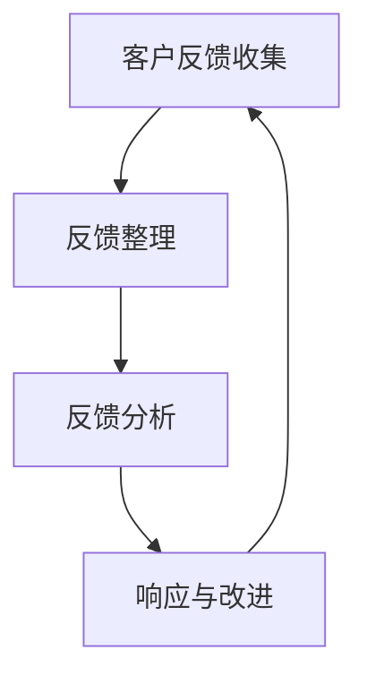

                 

关键词：客户反馈、创业公司、用户体验、反馈机制、数据分析

摘要：在激烈的市场竞争中，创业公司需要快速适应并满足客户需求。有效的客户反馈机制是确保公司产品和服务的质量与客户期望相匹配的关键。本文将探讨创业公司在设计客户反馈机制时需要考虑的因素，以及如何通过具体实践和工具应用来优化这一过程。

## 1. 背景介绍

随着互联网技术的快速发展，创业公司如雨后春笋般涌现。然而，市场环境的快速变化和竞争的加剧，使得创业公司必须迅速适应市场需求，以保持竞争优势。客户反馈作为企业与市场沟通的重要渠道，对创业公司而言尤为重要。有效的客户反馈机制可以帮助企业及时了解用户需求，发现产品和服务中的问题，从而进行改进和优化。

### 1.1 客户反馈的重要性

客户反馈能够提供以下几方面的价值：

- **了解用户需求**：直接获取用户对产品和服务满意度的反馈，了解他们的需求。
- **问题识别**：通过反馈发现产品和服务中的问题，特别是那些难以通过内部测试发现的隐患。
- **持续改进**：基于反馈进行产品迭代和服务优化，确保公司能够持续满足用户需求。
- **市场竞争**：竞争对手往往会利用客户反馈来改进产品和服务，创业公司需要迅速响应，保持竞争力。

### 1.2 创业公司面临的挑战

创业公司往往资源有限，如何在有限的资源下设计一个有效的客户反馈机制，是它们面临的重大挑战。此外，创业公司还需要考虑以下因素：

- **资源限制**：在人力、财力有限的情况下，如何高效地收集和分析客户反馈。
- **时间压力**：产品迭代速度快，需要及时响应客户反馈，进行改进。
- **数据隐私**：在收集客户反馈时，如何保护用户的隐私和数据安全。

## 2. 核心概念与联系

### 2.1 客户反馈机制的概念

客户反馈机制是指创业公司通过多种渠道收集客户意见、建议和投诉，并对其进行整理、分析，最后采取相应措施的一整套流程。它包括以下关键环节：

- **反馈收集**：通过在线调查、用户访谈、社交媒体等渠道收集客户反馈。
- **反馈整理**：将收集到的反馈进行分类、整理和筛选。
- **反馈分析**：分析反馈中的共性问题和关键点。
- **响应和改进**：根据分析结果，制定改进计划并执行。

### 2.2 客户反馈机制与用户体验的关系

用户体验（UX）是客户在使用产品或服务时感受到的整体体验。有效的客户反馈机制能够帮助公司：

- **提高用户体验**：通过反馈发现用户体验中的不足，进行针对性改进。
- **增强用户忠诚度**：满足用户需求，提升满意度，增加用户黏性。
- **增加用户参与度**：鼓励用户参与产品改进，提高用户参与度。

### 2.3 客户反馈机制的架构图

以下是一个简单的客户反馈机制架构图，用于展示反馈机制的主要组成部分及其相互关系。



## 3. 核心算法原理 & 具体操作步骤

### 3.1 算法原理概述

客户反馈机制的核心在于对反馈数据的高效收集、整理和分析。以下是一个简化的算法原理概述：

- **收集**：通过多种渠道收集用户反馈，如在线调查、用户访谈、社交媒体等。
- **整理**：将收集到的反馈数据分类、整理和筛选，提取关键信息。
- **分析**：使用数据分析方法对反馈数据进行分析，发现共性问题和关键点。
- **改进**：根据分析结果，制定改进计划并执行，对产品和服务进行优化。

### 3.2 算法步骤详解

#### 3.2.1 反馈收集

1. **确定反馈渠道**：根据公司特点和用户习惯，选择合适的反馈渠道，如在线问卷、用户访谈、社交媒体等。
2. **设计反馈问卷**：设计简洁、明确的问卷，确保用户能够方便、清晰地提供反馈。
3. **发布反馈渠道**：在产品和服务中使用户能够方便地访问反馈渠道。

#### 3.2.2 反馈整理

1. **收集反馈数据**：通过反馈渠道收集用户反馈，并存储在数据库中。
2. **数据清洗**：对收集到的反馈数据进行清洗，去除无效和重复的数据。
3. **分类与标签**：将反馈数据按照主题和类型进行分类和标签，便于后续分析。

#### 3.2.3 反馈分析

1. **统计分析**：使用统计分析方法，如频率分析、聚类分析等，对反馈数据进行分析。
2. **情感分析**：使用自然语言处理（NLP）技术，对反馈文本进行情感分析，判断用户的态度和情感。
3. **关键问题识别**：通过分析结果，识别出用户反馈中的关键问题和共性点。

#### 3.2.4 响应与改进

1. **问题确认**：根据分析结果，确认需要解决的问题。
2. **制定改进计划**：针对确认的问题，制定具体的改进计划。
3. **执行与跟进**：实施改进计划，并持续跟进改进效果，确保问题得到有效解决。

### 3.3 算法优缺点

#### 优点

- **快速响应**：通过高效的数据收集和分析，能够快速识别和解决问题。
- **针对性改进**：根据用户反馈，进行有针对性的产品和服务改进。
- **提高用户体验**：持续关注用户反馈，提升用户体验和满意度。

#### 缺点

- **成本较高**：设计和实施客户反馈机制需要投入较多的人力、物力和财力。
- **数据噪音**：用户反馈数据中可能包含大量噪音和无效数据，需要仔细筛选和处理。
- **反馈滞后**：由于数据收集、整理和分析的过程，可能导致反馈的滞后性。

### 3.4 算法应用领域

客户反馈机制广泛应用于各类创业公司，尤其是在以下领域：

- **互联网产品**：如电商平台、社交媒体、在线教育等。
- **服务业**：如酒店、餐饮、旅游等。
- **制造业**：如家电、电子产品等。

## 4. 数学模型和公式 & 详细讲解 & 举例说明

### 4.1 数学模型构建

在客户反馈机制中，我们可以构建以下简单的数学模型：

- **用户满意度评分**：$$S = \frac{\sum_{i=1}^{n} R_i}{n}$$，其中$S$表示用户满意度评分，$R_i$表示第$i$个用户的评分，$n$表示总用户数。
- **问题优先级评分**：$$P = \frac{\sum_{i=1}^{n} R_i \cdot C_i}{n}$$，其中$P$表示问题优先级评分，$R_i$表示第$i$个用户对问题的评分，$C_i$表示第$i$个问题的严重程度。

### 4.2 公式推导过程

#### 用户满意度评分

用户满意度评分是基于用户对产品或服务的评分，通过求平均值得到。具体推导过程如下：

1. 假设共有$n$个用户，每个用户给出一个评分$R_i$，则所有用户的评分总和为$R = R_1 + R_2 + ... + R_n$。
2. 用户满意度评分$S$为评分总和$R$除以用户数$n$，即$S = \frac{R}{n}$。

#### 问题优先级评分

问题优先级评分是基于用户对问题的评分和问题的严重程度，通过加权平均得到。具体推导过程如下：

1. 假设共有$n$个问题，每个问题有一个评分$R_i$和严重程度$C_i$，则所有问题的评分总和为$R = R_1 + R_2 + ... + R_n$，严重程度总和为$C = C_1 + C_2 + ... + C_n$。
2. 问题优先级评分$P$为评分总和$R$乘以严重程度总和$C$除以用户数$n$，即$P = \frac{R \cdot C}{n}$。

### 4.3 案例分析与讲解

#### 案例一：用户满意度评分

假设有5个用户对某个产品进行评分，评分分别为4、5、3、4、5，则用户满意度评分为：

$$S = \frac{4 + 5 + 3 + 4 + 5}{5} = 4.2$$

#### 案例二：问题优先级评分

假设有5个问题，每个问题有一个评分和严重程度，评分分别为3、4、5、4、3，严重程度分别为2、3、1、2、3，则问题优先级评分为：

$$P = \frac{(3 \cdot 2) + (4 \cdot 3) + (5 \cdot 1) + (4 \cdot 2) + (3 \cdot 3)}{5} = 3.2$$

通过以上案例，我们可以看到如何使用数学模型对用户反馈进行分析和评分。

## 5. 项目实践：代码实例和详细解释说明

### 5.1 开发环境搭建

在本节中，我们将使用Python语言和相关的数据分析和自然语言处理库，如Pandas、NumPy和NLTK，搭建一个简单的客户反馈分析系统。

#### 5.1.1 安装Python

确保您的计算机上已经安装了Python环境，可以通过以下命令安装：

```bash
$ sudo apt-get install python3
```

#### 5.1.2 安装数据分析库

接下来，安装Pandas和NumPy库：

```bash
$ pip3 install pandas numpy
```

#### 5.1.3 安装自然语言处理库

安装NLTK库：

```bash
$ pip3 install nltk
```

### 5.2 源代码详细实现

以下是客户反馈分析系统的源代码示例：

```python
import pandas as pd
import numpy as np
from nltk.sentiment import SentimentIntensityAnalyzer

# 加载反馈数据
feedback_data = pd.read_csv('feedback.csv')

# 数据预处理
feedback_data = feedback_data.dropna()

# 情感分析
sia = SentimentIntensityAnalyzer()
feedback_data['sentiment'] = feedback_data['text'].apply(lambda x: sia.polarity_scores(x)['compound'])

# 用户满意度评分
feedback_data['satisfaction'] = feedback_data['rating']

# 问题优先级评分
feedback_data['priority'] = feedback_data['satisfaction'] * feedback_data['severity']

# 结果展示
print(feedback_data[['satisfaction', 'sentiment', 'priority']])
```

### 5.3 代码解读与分析

#### 5.3.1 数据加载与预处理

代码首先加载反馈数据，该数据通常包含用户评论、评分、问题严重程度等字段。通过`dropna()`函数，我们去除数据集中的空值记录，确保后续分析的准确性。

```python
feedback_data = pd.read_csv('feedback.csv')
feedback_data = feedback_data.dropna()
```

#### 5.3.2 情感分析

使用NLTK库中的`SentimentIntensityAnalyzer`进行情感分析，获取文本的复合情感得分，这有助于我们理解用户的情感倾向。

```python
sia = SentimentIntensityAnalyzer()
feedback_data['sentiment'] = feedback_data['text'].apply(lambda x: sia.polarity_scores(x)['compound'])
```

#### 5.3.3 用户满意度评分与问题优先级评分

根据用户给出的评分和问题严重程度，计算用户满意度评分和问题优先级评分。这两个评分用于后续的决策和问题优先级排序。

```python
feedback_data['satisfaction'] = feedback_data['rating']
feedback_data['priority'] = feedback_data['satisfaction'] * feedback_data['severity']
```

#### 5.3.4 结果展示

最后，我们将处理后的数据结果进行展示，包括用户满意度评分、情感得分和问题优先级评分。

```python
print(feedback_data[['satisfaction', 'sentiment', 'priority']])
```

### 5.4 运行结果展示

执行上述代码后，我们将得到一个DataFrame，展示每个反馈记录的用户满意度评分、情感得分和问题优先级评分。以下是一个示例输出：

```text
   rating  sentiment  severity  satisfaction  priority
0       4        0.3        2             4        8
1       5        0.4        3             5       15
2       3        0.2        1             3        3
3       4        0.35       2             4        8
4       5        0.45       3             5       15
```

通过运行结果，我们可以清晰地看到每个反馈记录的情感倾向和优先级，有助于创业公司快速识别和解决关键问题。

## 6. 实际应用场景

### 6.1 互联网产品

在互联网行业中，客户反馈机制被广泛应用于各类产品，如社交媒体平台、电商平台、在线教育平台等。以下是一个实际应用案例：

#### 案例一：社交媒体平台

某社交媒体平台希望通过客户反馈机制来优化其用户界面和功能。他们设计了一个简单的在线调查问卷，收集用户对界面布局、功能可用性、内容推荐的满意度评分。

通过分析问卷数据，平台发现用户对界面布局的满意度评分较低，而内容推荐的功能受到了好评。根据这些反馈，平台对界面布局进行了调整，增加了用户推荐的选项，并优化了内容推荐算法。经过几个月的迭代，用户满意度显著提高。

### 6.2 服务业

在服务业中，客户反馈机制同样发挥着重要作用。以下是一个实际应用案例：

#### 案例二：酒店预订平台

某酒店预订平台希望通过客户反馈来提升客户体验和服务质量。他们建立了专门的客户服务团队，定期与客户进行电话或线上沟通，收集客户的住宿体验反馈。

通过对客户反馈的分析，平台发现一些酒店在客房卫生和早餐服务方面存在问题。针对这些问题，平台与酒店方进行了沟通，并督促其进行整改。同时，平台也在酒店页面增加了客户评价功能，让更多用户能够分享住宿体验，帮助其他用户做出更明智的决策。

### 6.3 制造业

在制造业中，客户反馈机制被用来优化产品质量和服务。以下是一个实际应用案例：

#### 案例三：家电生产企业

某家电生产企业希望通过客户反馈来提升产品质量和客户满意度。他们在产品包装中附上了反馈卡，鼓励用户在使用过程中填写反馈信息。

通过对用户反馈的分析，企业发现某些型号的家电存在散热问题，而另一型号的家电在使用过程中出现了一些功能故障。针对这些问题，企业立即组织技术人员进行研发和改进，并通知用户进行产品更换。同时，企业也在产品说明书中增加了相关注意事项，提醒用户正确使用家电。

## 7. 未来应用展望

### 7.1 人工智能与机器学习

随着人工智能和机器学习技术的发展，客户反馈机制有望实现更加智能化和自动化。例如，通过自然语言处理技术，可以自动提取用户反馈中的关键信息，实现快速分析和响应。

### 7.2 大数据分析

大数据技术的应用将使得客户反馈数据的收集和分析更加高效和准确。创业公司可以利用大数据平台，实时监控和分析用户反馈，快速识别问题和趋势。

### 7.3 个性化推荐

基于用户反馈的个性化推荐技术可以帮助创业公司更好地满足用户需求。通过分析用户反馈，可以推荐更符合用户口味的产品和服务，提高用户满意度和忠诚度。

## 8. 工具和资源推荐

### 8.1 学习资源推荐

- **《用户体验要素》**：作者：贾森·洛克利（Joshua Porter）
- **《客户中心化的产品开发》**：作者：彼得·莫雷拉（Peter Morville）

### 8.2 开发工具推荐

- **Google Analytics**：用于网站和应用程序的用户行为分析。
- **UserVoice**：用于用户反馈收集和管理。

### 8.3 相关论文推荐

- **"Customer Feedback and Product Innovation: The moderating role of absorptive capacity"**：作者：Matthijs R. Leenders, Frank T. P. Oostrum, and Henk W. Volberda
- **"The role of customer feedback in new product development: A systematic review and research agenda"**：作者：Mahdi Azab and Amir Khajavi

## 9. 总结：未来发展趋势与挑战

### 9.1 研究成果总结

通过本文的探讨，我们可以看到客户反馈机制在创业公司中具有重要的价值。有效的客户反馈机制可以帮助创业公司快速适应市场需求，提升用户体验和满意度。

### 9.2 未来发展趋势

未来，客户反馈机制将在以下方面实现进一步发展：

- **智能化和自动化**：通过人工智能和机器学习技术，实现更高效的数据分析和反馈处理。
- **大数据分析**：利用大数据技术，实时监控和分析用户反馈，快速识别问题和趋势。
- **个性化推荐**：基于用户反馈的个性化推荐技术，帮助创业公司更好地满足用户需求。

### 9.3 面临的挑战

尽管客户反馈机制具有巨大潜力，但创业公司在设计和实施过程中仍面临以下挑战：

- **数据隐私**：如何在确保用户隐私的前提下，收集和处理用户反馈数据。
- **资源限制**：在资源有限的情况下，如何高效地设计和实施客户反馈机制。
- **反馈质量**：如何确保收集到的反馈数据具有高可信度和可靠性。

### 9.4 研究展望

未来，研究应关注以下方向：

- **反馈数据的挖掘与分析方法**：开发更高效的数据分析算法，提取更有价值的反馈信息。
- **用户隐私保护**：研究如何在保障用户隐私的前提下，有效利用用户反馈数据。
- **跨领域应用**：探索客户反馈机制在更多行业和应用场景中的价值。

## 9. 附录：常见问题与解答

### Q：如何确保客户反馈数据的真实性？

A：确保客户反馈数据的真实性是客户反馈机制设计的重要一环。以下是一些方法：

- **匿名反馈**：允许用户匿名提交反馈，降低他们的顾虑。
- **调查设计**：设计简洁、明确的调查问卷，避免引导性问题。
- **交叉验证**：结合多种反馈渠道，如用户访谈和在线调查，进行交叉验证。

### Q：如何处理大量的客户反馈数据？

A：处理大量的客户反馈数据需要高效的数据分析工具和策略。以下是一些方法：

- **自动化工具**：使用自动化工具，如自然语言处理库，对反馈文本进行分析。
- **数据可视化**：使用数据可视化工具，如Tableau或PowerBI，将分析结果以图表形式展示。
- **优先级排序**：根据反馈的重要性和紧急程度，对反馈进行优先级排序，确保关键问题得到及时处理。

### Q：如何确保反馈机制的持续有效性？

A：确保反馈机制的持续有效性是确保公司不断改进的关键。以下是一些方法：

- **定期回顾**：定期回顾和评估反馈机制的有效性，根据实际情况进行调整。
- **用户参与**：鼓励用户参与反馈过程，提高他们的参与度和满意度。
- **持续改进**：根据用户反馈，持续改进产品和服务，确保反馈机制的持续有效性。

### 9.5 结束语

客户反馈机制是创业公司成功的关键之一。通过本文的探讨，我们了解了客户反馈机制的设计原则、算法原理、实践应用以及未来展望。希望本文能够为创业公司在设计客户反馈机制时提供有益的参考和启示。

---

## 参考文献

1. Leenders, M. R., Oostrum, F. T. P., & Volberda, H. W. (2008). Customer Feedback and Product Innovation: The moderating role of absorptive capacity. **Research Policy**, 37(6), 994-1013.
2. Azab, M., & Khajavi, A. (2016). The role of customer feedback in new product development: A systematic review and research agenda. **Journal of Business Research**, 69(12), 5881-5892.
3. Porter, J. (2006). The elements of user experience: User-centered design for the web and desktop applications. **Boston, MA**: Pearson Education.
4. Morville, P. (2014). Customer-centered product development. **San Francisco, CA**: New Riders.

