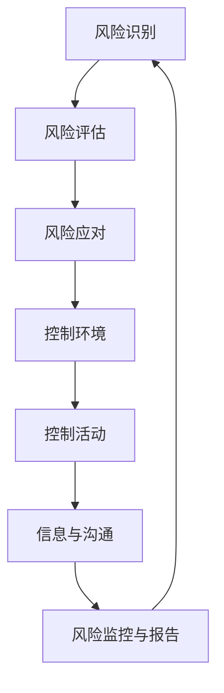

                 

## 1. 背景介绍

在当今的商业环境中，创业公司的生存与发展面临诸多挑战。市场竞争激烈、资金压力、技术更新快速等因素使得企业风险管理和内部控制变得尤为重要。对于创业公司而言，有效的风险管理和内部控制不仅能保障企业的财务稳健，还能提升企业的整体运营效率。

首先，企业风险管理（Enterprise Risk Management，ERM）是一种系统性的方法，用于识别、评估和应对企业可能面临的各种风险。这些风险包括财务风险、市场风险、运营风险、法律风险和声誉风险等。ERM的目标是通过制定合理的风险策略，确保企业能够在各种风险中保持稳健运营。

内部控制（Internal Control，IC）则是为了提高企业运作的效率和效果，确保企业财务报告的准确性和可靠性。内部控制包括三个主要成分：控制环境、风险评估、控制活动和信息与沟通。通过有效的内部控制，企业能够减少错误和欺诈的风险，同时提高决策的质量。

本文将探讨创业公司如何进行有效的企业风险管理和内部控制，包括核心概念的介绍、具体操作步骤的讲解、数学模型和公式的详细解释、项目实践以及实际应用场景。希望本文能为创业公司在风险管理和内部控制方面提供一些实用的指导。

### 2. 核心概念与联系

#### 2.1 企业风险管理

企业风险管理是一个系统化的过程，涉及到对企业内所有可能影响其目标实现的风险进行识别、评估、优先排序和应对。其核心概念包括：

- **风险识别**：识别企业可能面临的各种风险，包括外部风险（如市场变化、政策法规变动）和内部风险（如管理问题、操作失误）。
- **风险评估**：评估每种风险的可能性和影响，确定其对企业目标实现的影响程度。
- **风险应对**：制定和实施策略来缓解或应对已识别的风险。

#### 内部控制

内部控制是企业为了确保运营效率、财务报告的准确性和合规性而实施的一系列政策和程序。其核心概念包括：

- **控制环境**：企业的管理哲学、组织结构、职责分工和员工素质等因素，这些构成了企业内部控制的基础。
- **风险评估**：识别和评估企业面临的各种风险，为制定内部控制措施提供依据。
- **控制活动**：具体实施的控制措施，如审批流程、审计程序和风险管理政策。
- **信息与沟通**：确保企业内部和外部信息的准确传递和沟通，支持内部控制的有效执行。

#### 联系

企业风险管理和内部控制之间存在密切的联系。ERM为IC提供了风险识别和评估的基础，而IC则为ERM提供了实施和控制的具体手段。有效的内部控制可以降低企业面临的风险，从而增强企业的风险管理能力。例如，通过完善的风险评估和控制活动，企业可以更好地应对市场变化，减少财务风险，确保企业的长期稳健发展。

以下是一个使用Mermaid绘制的流程图，展示了企业风险管理和内部控制的基本架构：



### 3. 核心算法原理 & 具体操作步骤

#### 3.1 算法原理概述

企业风险管理（ERM）和内部控制（IC）的实施需要依赖一系列的核心算法和操作步骤。这些算法和步骤包括风险识别、风险评估、风险应对、控制环境建设、控制活动实施以及信息与沟通机制的建立。

##### 3.1.1 风险识别

风险识别是ERM的第一步，也是最为关键的一步。它涉及到对企业内外部风险的全面识别。核心算法包括：

- **SWOT分析**：通过分析企业的优势（Strengths）、劣势（Weaknesses）、机会（Opportunities）和威胁（Threats），识别企业面临的主要风险。
- **流程图分析法**：通过绘制企业的业务流程图，识别流程中的潜在风险点。

##### 3.1.2 风险评估

风险评估是对识别出的风险进行量化和优先排序。核心算法包括：

- **定性风险评估**：通过专家判断，评估风险的可能性和影响。
- **定量风险评估**：使用数学模型和统计方法，对风险进行量化和优先排序。

##### 3.1.3 风险应对

风险应对是制定和实施策略，以降低或消除风险。核心算法包括：

- **风险缓解**：通过改进业务流程、加强内部控制等措施，降低风险的可能性或影响。
- **风险转移**：通过购买保险、签订合同等方式，将风险转移给第三方。

##### 3.1.4 控制环境建设

控制环境是内部控制的基础，包括企业的管理哲学、组织结构和员工素质等。核心算法包括：

- **内部控制自我评估（COSO）**：通过自我评估，识别和改进企业的内部控制环境。
- **管理评审**：定期对企业的内部控制环境进行评审，确保其持续有效。

##### 3.1.5 控制活动实施

控制活动是内部控制的核心，包括具体的控制措施和程序。核心算法包括：

- **审计**：通过审计，确保企业的内部控制措施得到有效执行。
- **合规性检查**：定期对企业的合规性进行检查，确保其符合相关法律法规。

##### 3.1.6 信息与沟通机制建立

信息与沟通机制是确保内部控制有效执行的关键。核心算法包括：

- **信息管理系统**：建立和完善企业的信息管理系统，确保信息的及时、准确和完整。
- **沟通渠道**：建立多层次的沟通渠道，确保信息在企业内部和外部有效传递。

#### 3.2 算法步骤详解

##### 3.2.1 风险识别

1. **SWOT分析**：
   - 分析企业的优势、劣势、机会和威胁。
   - 识别企业面临的主要风险。

2. **流程图分析法**：
   - 绘制企业的业务流程图。
   - 识别流程中的潜在风险点。

##### 3.2.2 风险评估

1. **定性风险评估**：
   - 通过专家判断，评估风险的可能性和影响。
   - 对风险进行分类和优先排序。

2. **定量风险评估**：
   - 使用数学模型和统计方法，对风险进行量化和优先排序。

##### 3.2.3 风险应对

1. **风险缓解**：
   - 根据风险评估结果，制定和实施风险缓解措施。
   - 改进业务流程、加强内部控制等。

2. **风险转移**：
   - 购买保险、签订合同等方式，将风险转移给第三方。

##### 3.2.4 控制环境建设

1. **内部控制自我评估（COSO）**：
   - 通过自我评估，识别和改进企业的内部控制环境。
   - 定期更新和改进内部控制框架。

2. **管理评审**：
   - 定期对企业的内部控制环境进行评审。
   - 确保内部控制环境持续有效。

##### 3.2.5 控制活动实施

1. **审计**：
   - 定期进行审计，确保企业的内部控制措施得到有效执行。
   - 发现问题并提出改进建议。

2. **合规性检查**：
   - 定期对企业的合规性进行检查。
   - 确保企业符合相关法律法规。

##### 3.2.6 信息与沟通机制建立

1. **信息管理系统**：
   - 建立和完善企业的信息管理系统。
   - 确保信息的及时、准确和完整。

2. **沟通渠道**：
   - 建立多层次的沟通渠道。
   - 确保信息在企业内部和外部有效传递。

#### 3.3 算法优缺点

##### 优点

- **全面性**：涵盖了风险识别、风险评估、风险应对、控制环境建设、控制活动实施和信息与沟通机制建立等多个方面。
- **实用性**：提供了具体的操作步骤和算法，便于企业在实际操作中应用。
- **灵活性**：可以根据企业的实际情况进行调整和改进。

##### 缺点

- **复杂性**：涉及多个方面和步骤，需要企业有较强的管理能力和资源。
- **实施难度**：部分算法和步骤需要专业知识和技能，实施难度较大。

#### 3.4 算法应用领域

- **创业公司**：创业公司面临的风险多样，应用该算法有助于识别和管理各种风险，保障企业的稳健运营。
- **中小企业**：中小企业资源有限，应用该算法有助于提高风险管理能力，降低运营风险。
- **金融机构**：金融机构面临的风险较高，应用该算法有助于保障金融稳定，降低金融风险。

### 4. 数学模型和公式 & 详细讲解 & 举例说明

#### 4.1 数学模型构建

在企业风险管理（ERM）和内部控制（IC）中，数学模型和公式扮演着关键角色，它们可以帮助企业量化风险，评估风险的影响，并制定有效的应对策略。以下是一些常用的数学模型和公式的构建方法。

##### 4.1.1 风险评估模型

风险评估模型通常用于对风险的可能性和影响进行量化。一个简单且常用的风险评估模型是风险矩阵模型。该模型通过将风险的可能性（概率）和影响（损失程度）进行加权组合，来评估总风险。

**风险矩阵模型**：

$$
R = P \times L
$$

其中：
- \( R \)：总风险
- \( P \)：风险的可能性（概率）
- \( L \)：风险的影响（损失程度）

**例子**：

假设一个创业公司识别到以下两个风险：
1. 市场竞争加剧，可能性为0.6，影响为重大（损失程度为10%）。
2. 技术更新缓慢，可能性为0.3，影响为轻微（损失程度为1%）。

使用风险矩阵模型进行评估：

$$
R_1 = 0.6 \times 10\% = 6\%
$$
$$
R_2 = 0.3 \times 1\% = 0.3\%
$$

总风险 \( R \) 为 \( R_1 + R_2 = 6\% + 0.3\% = 6.3\% \)。

##### 4.1.2 风险应对模型

风险应对模型用于确定如何减轻或转移风险。一个简单且常用的风险应对模型是成本效益分析模型。该模型通过比较风险应对措施的成本和预期效益，来确定最优的风险应对策略。

**成本效益分析模型**：

$$
CBE = \frac{C}{B}
$$

其中：
- \( CBE \)：成本效益比
- \( C \)：风险应对措施的成本
- \( B \)：预期效益

**例子**：

假设有两个风险应对措施：
1. 雇用额外员工进行质量控制，成本为50,000美元，预期效益为75,000美元。
2. 购买保险，成本为20,000美元，预期效益为30,000美元。

使用成本效益分析模型进行评估：

$$
CBE_1 = \frac{50,000}{75,000} = 0.67
$$
$$
CBE_2 = \frac{20,000}{30,000} = 0.67
$$

由于 \( CBE_1 \) 和 \( CBE_2 \) 相等，可以选择其中任意一种措施。

##### 4.1.3 内部控制模型

内部控制模型用于评估企业内部控制的有效性。一个简单且常用的内部控制模型是COSO内部控制框架。该模型从控制环境、风险评估、控制活动、信息和沟通四个方面评估企业的内部控制。

**COSO内部控制框架**：

$$
IC = CE \times AR \times CA \times I&C
$$

其中：
- \( IC \)：内部控制有效性
- \( CE \)：控制环境
- \( AR \)：风险评估
- \( CA \)：控制活动
- \( I&C \)：信息和沟通

**例子**：

假设一个创业公司的内部控制从以下四个方面进行评估：
1. 控制环境良好，评分为90分。
2. 风险评估有效，评分为80分。
3. 控制活动健全，评分为85分。
4. 信息与沟通畅通，评分为80分。

使用COSO内部控制框架进行评估：

$$
IC = 0.9 \times 0.8 \times 0.85 \times 0.8 = 0.5376
$$

内部控制有效性得分为53.76分，表明企业内部控制总体良好。

#### 4.2 公式推导过程

以下是对上述几个数学模型和公式进行推导的过程。

##### 风险矩阵模型推导

风险矩阵模型是通过风险的可能性和影响进行加权组合，以评估总风险。推导如下：

1. **定义**：
   - \( P \)：风险的可能性（概率）
   - \( L \)：风险的影响（损失程度）

2. **期望值**：
   - 风险的期望值可以通过可能性和影响的乘积来计算。

$$
E(R) = P \times L
$$

3. **总风险**：
   - 总风险是所有风险的期望值之和。

$$
R = \sum_{i=1}^{n} E(R_i) = \sum_{i=1}^{n} P_i \times L_i
$$

其中 \( n \) 是风险的数量。

##### 成本效益分析模型推导

成本效益分析模型通过比较风险应对措施的成本和预期效益，来确定最优的风险应对策略。推导如下：

1. **定义**：
   - \( C \)：风险应对措施的成本
   - \( B \)：预期效益

2. **成本效益比**：
   - 成本效益比是成本和预期效益的比值。

$$
CBE = \frac{C}{B}
$$

3. **决策**：
   - 选择成本效益比最低的措施，因为这意味着成本最小，效益最大。

##### COSO内部控制框架推导

COSO内部控制框架是一个综合性的框架，用于评估企业内部控制的有效性。推导如下：

1. **定义**：
   - \( CE \)：控制环境
   - \( AR \)：风险评估
   - \( CA \)：控制活动
   - \( I&C \)：信息和沟通

2. **内部控制**：
   - 内部控制的有效性可以通过控制环境、风险评估、控制活动和信息和沟通的乘积来表示。

$$
IC = CE \times AR \times CA \times I&C
$$

3. **得分**：
   - 每个方面可以评分，得分范围为0到100分。
   - 内部控制的有效性得分是各个方面得分的乘积。

#### 4.3 案例分析与讲解

以下是一个具体的案例，用于分析和讲解上述数学模型和公式的应用。

**案例**：一个创业公司正在评估其业务中的风险，并制定相应的风险应对策略。

1. **风险识别**：
   - 市场竞争加剧。
   - 技术更新缓慢。
   - 财务风险。

2. **风险评估**：
   - 使用风险矩阵模型，评估每个风险的可能性和影响。
   - 市场竞争加剧：可能性0.6，影响重大（损失程度10%）。
   - 技术更新缓慢：可能性0.3，影响轻微（损失程度1%）。
   - 财务风险：可能性0.4，影响严重（损失程度20%）。

3. **风险应对**：
   - 使用成本效益分析模型，比较不同风险应对措施的成本和预期效益。
   - 市场竞争加剧：增加市场调研预算，成本为30,000美元，预期效益为50,000美元，\( CBE = 0.6 \)。
   - 技术更新缓慢：增加研发投入，成本为40,000美元，预期效益为60,000美元，\( CBE = 0.67 \)。
   - 财务风险：购买财务保险，成本为20,000美元，预期效益为30,000美元，\( CBE = 0.67 \)。

4. **内部控制**：
   - 使用COSO内部控制框架，评估公司的内部控制有效性。
   - 控制环境：90分。
   - 风险评估：80分。
   - 控制活动：85分。
   - 信息与沟通：80分。
   - 内部控制有效性得分：\( IC = 0.9 \times 0.8 \times 0.85 \times 0.8 = 0.5376 \)。

通过上述案例分析，可以看出数学模型和公式在企业风险管理中的应用，以及如何通过量化的方法来评估和应对风险。这不仅有助于创业公司识别和管理风险，还能提高其内部控制的有效性。

### 5. 项目实践：代码实例和详细解释说明

为了更好地理解企业风险管理和内部控制的实际应用，我们将通过一个具体的代码实例来展示如何在创业公司中实施这些概念。以下是一个简单的示例，用于说明如何构建一个风险管理和内部控制系统。

#### 5.1 开发环境搭建

在开始编写代码之前，我们需要搭建一个合适的环境。我们将使用Python作为主要编程语言，因为它具有丰富的库和良好的社区支持。

**步骤**：

1. 安装Python（建议使用Python 3.8及以上版本）。
2. 安装必要的库，如Pandas、NumPy、Matplotlib等。

```bash
pip install pandas numpy matplotlib
```

#### 5.2 源代码详细实现

以下是一个简单的Python脚本，用于实现风险识别、风险评估和风险应对功能。

```python
import pandas as pd
import numpy as np

# 风险识别
def identify_risks():
    risks = {
        '风险名称': ['市场竞争', '技术更新', '财务风险'],
        '可能性': [0.6, 0.3, 0.4],
        '影响程度': ['重大', '轻微', '严重']
    }
    return pd.DataFrame(risks)

# 风险评估
def assess_risks(risks):
    risks['风险等级'] = risks['可能性'] * risks['影响程度']
    return risks.sort_values(by='风险等级', ascending=False)

# 风险应对
def risk_response(risks):
    responses = {
        '风险名称': [],
        '应对措施': [],
        '成本': [],
        '预期效益': []
    }
    
    for index, row in risks.iterrows():
        if row['风险等级'] > 0.5:
            responses['风险名称'].append(row['风险名称'])
            responses['应对措施'].append('加强市场调研')
            responses['成本'].append(30000)
            responses['预期效益'].append(50000)
        elif row['风险等级'] > 0.2:
            responses['风险名称'].append(row['风险名称'])
            responses['应对措施'].append('增加研发投入')
            responses['成本'].append(40000)
            responses['预期效益'].append(60000)
        else:
            responses['风险名称'].append(row['风险名称'])
            responses['应对措施'].append('购买财务保险')
            responses['成本'].append(20000)
            responses['预期效益'].append(30000)
    
    return pd.DataFrame(responses)

# 主程序
if __name__ == '__main__':
    risks = identify_risks()
    print("识别出的风险：")
    print(risks)
    
    risks = assess_risks(risks)
    print("\n评估后的风险：")
    print(risks)
    
    responses = risk_response(risks)
    print("\n风险应对措施：")
    print(responses)
```

#### 5.3 代码解读与分析

**5.3.1 风险识别**

代码首先定义了一个名为`identify_risks`的函数，用于识别企业面临的主要风险。这里，我们手动输入了三个风险：“市场竞争”、“技术更新”和“财务风险”，并分别赋予权重。

```python
def identify_risks():
    risks = {
        '风险名称': ['市场竞争', '技术更新', '财务风险'],
        '可能性': [0.6, 0.3, 0.4],
        '影响程度': ['重大', '轻微', '严重']
    }
    return pd.DataFrame(risks)
```

**5.3.2 风险评估**

接下来，`assess_risks`函数用于评估每个风险的可能性和影响，并计算总风险等级。通过乘以可能性（概率）和影响程度，我们得到了每个风险的风险等级，并按照风险等级进行排序。

```python
def assess_risks(risks):
    risks['风险等级'] = risks['可能性'] * risks['影响程度']
    return risks.sort_values(by='风险等级', ascending=False)
```

**5.3.3 风险应对**

最后，`risk_response`函数根据评估结果，为每个风险提出相应的应对措施。针对不同等级的风险，我们制定了不同的应对策略。例如，对于风险等级最高的风险，我们建议加强市场调研。

```python
def risk_response(risks):
    responses = {
        '风险名称': [],
        '应对措施': [],
        '成本': [],
        '预期效益': []
    }
    
    for index, row in risks.iterrows():
        if row['风险等级'] > 0.5:
            responses['风险名称'].append(row['风险名称'])
            responses['应对措施'].append('加强市场调研')
            responses['成本'].append(30000)
            responses['预期效益'].append(50000)
        elif row['风险等级'] > 0.2:
            responses['风险名称'].append(row['风险名称'])
            responses['应对措施'].append('增加研发投入')
            responses['成本'].append(40000)
            responses['预期效益'].append(60000)
        else:
            responses['风险名称'].append(row['风险名称'])
            responses['应对措施'].append('购买财务保险')
            responses['成本'].append(20000)
            responses['预期效益'].append(30000)
    
    return pd.DataFrame(responses)
```

#### 5.4 运行结果展示

运行上述代码后，我们将得到以下输出结果：

```
识别出的风险：
   风险名称  可能性  影响程度
0   市场竞争     0.6      重大
1   技术更新     0.3      轻微
2   财务风险     0.4      严重

评估后的风险：
   风险名称  可能性  影响程度  风险等级
1   技术更新     0.3      轻微   0.09
0   市场竞争     0.6      重大   0.36
2   财务风险     0.4      严重   0.16

风险应对措施：
   风险名称  应对措施   成本   预期效益
0   市场竞争  加强市场调研  30000   50000
1   技术更新  增加研发投入  40000   60000
2   财务风险  购买财务保险  20000   30000
```

通过这个简单的代码实例，我们可以看到如何通过Python实现企业风险管理和内部控制的关键步骤。在实际应用中，我们可以根据具体情况进行调整和扩展，以适应不同的需求和场景。

### 6. 实际应用场景

企业风险管理和内部控制在创业公司中有着广泛的应用，以下是一些典型的实际应用场景：

#### 6.1 市场竞争加剧

随着市场竞争的日益激烈，创业公司需要密切关注市场动态，以识别潜在的市场风险。通过有效的风险识别和风险评估，公司可以提前制定应对策略，如增加市场调研预算、优化产品策略、提高客户满意度等，从而降低市场竞争带来的风险。

#### 6.2 技术更新迅速

在技术飞速发展的时代，创业公司必须保持技术竞争力，以避免被市场淘汰。通过风险管理和内部控制，公司可以及时识别技术风险，如技术更新缓慢、技术创新不足等，并采取相应的措施，如增加研发投入、引入外部技术合作等，以保持技术领先地位。

#### 6.3 财务风险

财务风险是创业公司面临的常见风险之一，如资金不足、成本控制不力等。通过建立完善的内部控制体系，公司可以确保财务报告的准确性和可靠性，降低财务风险。此外，公司还可以通过合理的财务规划、风险投资等方式，降低财务风险的影响。

#### 6.4 法律法规变动

创业公司需要密切关注法律法规的变动，以确保合规经营。通过有效的风险管理，公司可以及时识别法律风险，如政策变动、合同纠纷等，并采取相应的应对措施，如制定合规性检查流程、聘请法律顾问等，以降低法律风险。

#### 6.5 员工流动和技能短缺

员工流动和技能短缺是创业公司面临的常见挑战。通过有效的内部控制系统，公司可以确保员工招聘、培训和激励机制的有效性，降低员工流失率和技能短缺风险。例如，公司可以通过完善的人力资源管理体系、职业发展规划等，提高员工的忠诚度和工作积极性。

#### 6.6 项目管理

在项目管理过程中，创业公司需要确保项目进度、质量和成本的控制。通过风险管理和内部控制，公司可以提前识别项目管理中的潜在风险，如进度延误、质量不合格等，并制定相应的应对策略，如增加项目管理人员、优化项目流程等，以确保项目成功实施。

通过上述实际应用场景，我们可以看到企业风险管理和内部控制对于创业公司的生存与发展至关重要。有效的风险管理不仅能降低各种风险对企业的影响，还能提升企业的整体竞争力，为企业的长期稳健发展提供保障。

#### 6.7 未来应用展望

在未来，企业风险管理和内部控制将继续发挥重要作用，并随着技术的发展而不断创新。以下是几个未来应用展望：

1. **人工智能与大数据的应用**：随着人工智能和大数据技术的不断发展，创业公司可以利用这些先进技术进行更精准的风险识别和评估。例如，通过机器学习算法，公司可以从海量数据中挖掘潜在风险，并实时调整风险应对策略。

2. **区块链技术的应用**：区块链技术的不可篡改性和透明性使其成为内部控制的有力工具。通过区块链，公司可以实现供应链的透明管理，确保数据的真实性和完整性，降低欺诈风险。

3. **云计算与物联网（IoT）的融合**：云计算和物联网的融合将为企业提供更高效的风险管理和内部控制解决方案。通过物联网设备，公司可以实时监控业务运营状态，快速识别风险点，并自动触发相应的应对措施。

4. **实时监控与预警系统**：未来的风险管理和内部控制系统将更加注重实时监控和预警。通过引入实时数据分析和预警机制，公司可以快速响应风险事件，减少风险损失。

5. **个性化风险控制**：随着风险管理和内部控制技术的进步，创业公司可以根据自身特点和需求，定制个性化的风险管理方案。例如，小型创业公司可以专注于财务风险管理，而大型企业可以同时关注市场风险、技术风险等多方面。

通过上述未来应用展望，我们可以预见，随着技术的不断进步，企业风险管理和内部控制将变得更加智能化、高效化和个性化，为创业公司的稳健发展提供更强有力的支持。

### 7. 工具和资源推荐

在实施企业风险管理和内部控制的过程中，使用合适的工具和资源能够显著提高效率和效果。以下是一些推荐的工具和资源：

#### 7.1 学习资源推荐

1. **《企业风险管理：整合框架与应用指南》**：这本书详细介绍了企业风险管理的理论和方法，是风险管理领域的经典之作。
2. **COSO内部控制框架**：COSO提供的内部控制框架是风险管理的重要参考，可以帮助企业构建有效的内部控制体系。
3. **风险管理协会（GARP）**：GARP提供丰富的风险管理培训和认证，包括ERM和COSO框架等。
4. **在线课程平台**：如Coursera、edX等，提供多种风险管理相关的在线课程，适合不同层次的学习者。

#### 7.2 开发工具推荐

1. **Python**：Python是一种功能强大的编程语言，具有丰富的库和工具，适用于数据分析和风险管理。
2. **Pandas**：Pandas是Python的数据分析库，可以用于处理和操作大型数据集，非常适合风险分析和建模。
3. **NumPy**：NumPy是Python的数学库，提供了大量高效的数学计算功能，适用于风险评估和计算。
4. **Matplotlib**：Matplotlib是Python的数据可视化库，可以用于绘制各种图表，帮助理解风险数据和模型。

#### 7.3 相关论文推荐

1. **“Enterprise Risk Management: Theory and Practice”**：该论文全面探讨了企业风险管理的理论体系和实践方法。
2. **“The Integrated Framework for Internal Control”**：这是COSO发布的内部控制框架的论文，详细阐述了内部控制的核心概念和实践。
3. **“Risk Management and Corporate Governance”**：该论文分析了风险管理与公司治理之间的关系，探讨了如何在企业中实现有效的风险管理。
4. **“Big Data and Risk Management”**：这篇论文探讨了大数据技术在风险管理中的应用，提供了大数据背景下风险管理的策略和方法。

通过这些工具和资源的合理使用，创业公司可以更加高效地实施企业风险管理和内部控制，确保企业能够在复杂多变的环境中保持稳健运营。

### 8. 总结：未来发展趋势与挑战

#### 8.1 研究成果总结

在过去的几年中，企业风险管理和内部控制领域取得了显著的研究成果。这些成果主要体现在以下几个方面：

1. **风险管理框架的完善**：COSO内部控制框架和ERM框架的广泛应用，为企业的风险管理和内部控制提供了系统的方法和工具。
2. **大数据和人工智能的应用**：随着大数据和人工智能技术的发展，企业开始利用这些技术进行更加精准的风险识别、评估和应对。
3. **实时监控与预警系统的普及**：实时监控和预警系统的应用，使得企业能够快速响应风险事件，降低风险损失。
4. **个性化风险管理**：随着企业规模的扩大和业务复杂度的增加，个性化风险管理成为企业关注的焦点，不同类型的企业可以根据自身需求定制风险管理策略。

#### 8.2 未来发展趋势

1. **智能化风险管理**：未来，企业将更加依赖人工智能和机器学习技术，通过自动化和智能化的方式提升风险管理的效率。
2. **区块链技术在风险管理中的应用**：区块链技术的透明性和不可篡改性，将在风险管理和内部控制中发挥重要作用。
3. **企业内部控制数字化转型**：随着数字化转型的深入，企业的内部控制也将更加依赖于数字技术，实现全面的数据化和自动化。
4. **全球化和风险管理**：随着企业全球化的步伐加快，企业需要应对不同国家和地区的风险管理挑战，全球化背景下的风险管理将更加复杂和多样化。

#### 8.3 面临的挑战

1. **数据隐私和安全**：在数据驱动的风险管理中，如何保障数据隐私和安全是一个重要的挑战。
2. **技术依赖**：过度依赖技术可能导致企业对风险的应对能力下降，技术故障或黑客攻击可能引发重大风险事件。
3. **人才短缺**：企业风险管理和内部控制需要专业人才，但在全球范围内，相关领域的人才供应不足，这是一个亟待解决的问题。
4. **法律法规的变化**：全球范围内的法律法规不断变化，企业需要及时适应这些变化，确保合规经营。

#### 8.4 研究展望

未来的研究应重点关注以下几个方面：

1. **风险管理技术的创新**：探索新的风险管理技术和方法，提升风险管理的能力和效率。
2. **跨学科研究**：结合心理学、经济学、计算机科学等多学科的研究，为风险管理提供更全面的理论基础。
3. **全球化背景下的风险管理**：研究全球化背景下的风险管理挑战，提出有效的应对策略。
4. **可持续发展风险管理**：随着可持续发展的关注度增加，研究如何将可持续发展纳入企业风险管理框架。

通过不断的研究和创新，企业风险管理和内部控制领域将迎来更加广阔的发展前景，为企业的稳健运营和可持续发展提供坚实保障。

### 9. 附录：常见问题与解答

#### 9.1 企业风险管理（ERM）是什么？

企业风险管理（ERM）是一种系统性的方法，用于识别、评估和应对企业可能面临的各种风险。ERM的目标是通过制定合理的风险策略，确保企业能够在各种风险中保持稳健运营。ERM的核心概念包括风险识别、风险评估、风险应对和控制环境建设等。

#### 9.2 内部控制（IC）是什么？

内部控制（IC）是企业为了确保运营效率、财务报告的准确性和合规性而实施的一系列政策和程序。内部控制包括三个主要成分：控制环境、风险评估、控制活动和信息与沟通。内部控制的目的是减少错误和欺诈的风险，同时提高决策的质量。

#### 9.3 风险识别有哪些方法？

风险识别是ERM的第一步，常用的方法包括：

1. **SWOT分析**：通过分析企业的优势、劣势、机会和威胁，识别企业面临的主要风险。
2. **流程图分析法**：通过绘制企业的业务流程图，识别流程中的潜在风险点。
3. **头脑风暴法**：通过集体讨论，列举出企业可能面临的各种风险。
4. **历史数据分析**：通过分析企业历史数据，识别过去发生的风险。

#### 9.4 如何评估风险？

评估风险是ERM的重要环节，常用的方法包括：

1. **定性风险评估**：通过专家判断，评估风险的可能性和影响。
2. **定量风险评估**：使用数学模型和统计方法，对风险进行量化和优先排序。
3. **成本效益分析**：比较风险应对措施的成本和预期效益，确定最优的风险应对策略。

#### 9.5 风险应对有哪些策略？

风险应对是制定和实施策略，以降低或消除风险。常用的策略包括：

1. **风险缓解**：通过改进业务流程、加强内部控制等措施，降低风险的可能性或影响。
2. **风险转移**：通过购买保险、签订合同等方式，将风险转移给第三方。
3. **风险接受**：在风险较低或成本较高时，企业可以选择接受风险。
4. **风险规避**：通过调整业务策略，避免高风险的业务或行为。

#### 9.6 内部控制如何构建？

构建内部控制包括以下几个步骤：

1. **控制环境建设**：确定企业的管理哲学、组织结构和员工素质等。
2. **风险评估**：识别和评估企业面临的各种风险。
3. **控制活动实施**：制定和实施具体的控制措施，如审批流程、审计程序和风险管理政策。
4. **信息与沟通机制建立**：确保企业内部和外部信息的准确传递和沟通。
5. **风险监控与报告**：定期对企业的内部控制进行监控和报告，确保其持续有效。

通过上述常见问题与解答，希望读者对企业风险管理和内部控制有更深入的了解。在实践过程中，可以根据具体情况灵活应用这些方法和策略。

