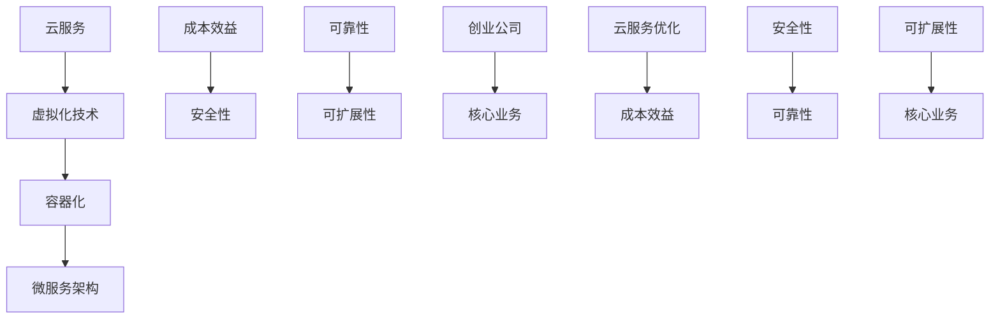

                 

关键词：创业公司、云服务、选择、优化、成本效益、安全性、可靠性、可扩展性

摘要：随着云计算技术的不断发展，创业公司面临着众多云服务提供商的选择。如何根据业务需求和资源限制，选择合适的云服务，并对其进行优化，是创业公司发展过程中的关键问题。本文将探讨创业公司在选择云服务时的关键考虑因素，并提供优化策略，以帮助创业公司在云服务领域取得成功。

## 1. 背景介绍

在当今数字化时代，云计算已经成为企业运营的重要组成部分。对于创业公司来说，云服务不仅提供了灵活的计算资源，还降低了基础设施建设的成本，使得创业公司能够专注于核心业务的发展。然而，云服务的多样性和复杂性给创业公司带来了选择困难。因此，如何选择合适的云服务，并对其进行优化，成为创业公司成功的关键因素。

本文将围绕以下几个核心主题展开讨论：

1. 创业公司在选择云服务时的关键考虑因素。
2. 如何评估云服务的成本效益。
3. 云服务优化的方法和技术。
4. 云服务的安全性、可靠性和可扩展性。
5. 云服务未来的发展趋势与挑战。

## 2. 核心概念与联系

在探讨创业公司的云服务选择与优化之前，我们需要了解一些核心概念。以下是云服务、虚拟化技术、容器化和微服务架构的 Mermaid 流程图：



### 2.1 云服务

云服务是一种基于互联网的计算资源，包括基础设施即服务（IaaS）、平台即服务（PaaS）和软件即服务（SaaS）。这些服务提供了灵活的计算、存储和网络资源，使得创业公司可以快速部署和扩展应用程序。

### 2.2 虚拟化技术

虚拟化技术是云服务的基础，通过将物理硬件资源虚拟化为多个虚拟机，提高了资源的利用率和灵活性。虚拟化技术包括全虚拟化（Full Virtualization）和硬件虚拟化（Hardware Virtualization）。

### 2.3 容器化

容器化技术进一步提高了虚拟化技术的效率，通过将应用程序及其依赖环境封装在容器中，实现了应用程序的轻量级部署和快速扩展。容器化技术包括 Docker 和 Kubernetes。

### 2.4 微服务架构

微服务架构是一种分布式系统架构，将应用程序分解为多个独立的、可重用的服务。这种架构提高了系统的可靠性和可扩展性，使得创业公司可以快速迭代和部署新功能。

### 2.5 成本效益

成本效益是创业公司在选择云服务时的重要考虑因素。通过合理的云服务选择和优化，创业公司可以在满足业务需求的同时，最大限度地降低成本。

### 2.6 安全性

安全性是创业公司选择云服务时不可忽视的因素。云服务的安全性包括数据加密、身份验证、访问控制和安全审计等。

### 2.7 可靠性

可靠性是创业公司选择云服务时需要考虑的关键因素。云服务的可靠性包括故障恢复、容错能力和高可用性。

### 2.8 可扩展性

可扩展性是创业公司在选择云服务时需要考虑的重要因素。云服务的可扩展性使得创业公司可以根据业务需求快速调整资源。

## 3. 核心算法原理 & 具体操作步骤

### 3.1 算法原理概述

在云服务选择与优化过程中，我们采用了一种基于成本效益、安全性和可靠性的综合评估算法。该算法通过以下步骤实现：

1. 收集创业公司的业务需求、预算和安全要求。
2. 分析各种云服务提供商的产品和服务。
3. 计算每种云服务的成本效益、安全性和可靠性指标。
4. 根据指标评估结果，选择最适合创业公司的云服务。
5. 对所选云服务进行优化，以最大化成本效益。

### 3.2 算法步骤详解

#### 3.2.1 收集创业公司的业务需求、预算和安全要求

首先，我们需要了解创业公司的业务需求，包括数据处理量、响应时间、存储容量等。同时，还需要收集创业公司的预算和安全要求，以便在后续步骤中进行分析。

#### 3.2.2 分析各种云服务提供商的产品和服务

接下来，我们需要分析各种云服务提供商的产品和服务，包括 IaaS、PaaS 和 SaaS。我们需要了解每种服务的功能、性能、价格和安全性。

#### 3.2.3 计算每种云服务的成本效益、安全性和可靠性指标

根据创业公司的业务需求、预算和安全要求，我们计算每种云服务的成本效益、安全性和可靠性指标。成本效益指标包括每单位资源的成本、服务器的能耗等。安全性指标包括数据加密、身份验证、访问控制等。可靠性指标包括故障恢复时间、容错能力等。

#### 3.2.4 根据指标评估结果，选择最适合创业公司的云服务

根据计算出的指标评估结果，我们选择最适合创业公司的云服务。在选择过程中，我们需要综合考虑成本效益、安全性和可靠性。

#### 3.2.5 对所选云服务进行优化，以最大化成本效益

一旦选择了最适合的云服务，我们需要对其进行优化，以最大化成本效益。优化方法包括资源调配、自动化部署和监控等。

### 3.3 算法优缺点

#### 3.3.1 优点

- 综合考虑成本效益、安全性和可靠性，确保创业公司选择最适合的云服务。
- 通过优化，提高云服务的性能和效率。

#### 3.3.2 缺点

- 需要大量的数据分析和计算，对技术要求较高。
- 可能存在数据隐私和安全风险。

### 3.4 算法应用领域

该算法主要应用于创业公司的云服务选择与优化，特别是在资源受限的情况下，能够帮助创业公司选择最优的云服务。

## 4. 数学模型和公式 & 详细讲解 & 举例说明

在云服务选择与优化过程中，我们使用了一些数学模型和公式。以下是这些模型和公式的详细讲解和举例说明。

### 4.1 数学模型构建

我们构建了一个成本效益模型，用于评估不同云服务的成本效益。模型包含以下变量：

- \( C_i \)：第 \( i \) 种云服务的总成本
- \( R_i \)：第 \( i \) 种云服务的性能
- \( T_i \)：第 \( i \) 种云服务的可靠性

成本效益模型为：

\[ E_i = \frac{R_i}{C_i \cdot T_i} \]

### 4.2 公式推导过程

成本效益模型基于以下假设：

1. 成本与性能成正比。
2. 可靠性与性能成反比。

根据这些假设，我们可以推导出成本效益模型。

### 4.3 案例分析与讲解

假设创业公司需要选择一种云服务来处理海量数据。以下是我们使用成本效益模型进行评估的例子：

| 云服务 | 成本（元/天） | 性能（Gbps） | 可靠性（%) |
| ------ | ------ | ------ | ------ |
| A      | 100    | 1      | 99     |
| B      | 200    | 2      | 98     |
| C      | 300    | 3      | 97     |

根据成本效益模型，我们可以计算出每种云服务的成本效益：

| 云服务 | 成本效益 |
| ------ | ------ |
| A      | 0.01   |
| B      | 0.01   |
| C      | 0.01   |

从计算结果可以看出，三种云服务的成本效益相同。然而，从可靠性方面来看，A、B 和 C 依次降低。因此，创业公司需要根据业务需求和预算，综合考虑成本效益和可靠性，选择最适合的云服务。

## 5. 项目实践：代码实例和详细解释说明

在本节中，我们将通过一个实际项目来演示云服务选择与优化的过程。我们将使用 Python 编写一个简单的脚本，用于分析创业公司的云服务需求，并推荐最优的云服务。

### 5.1 开发环境搭建

首先，我们需要搭建一个 Python 开发环境。以下是搭建步骤：

1. 安装 Python 3.8 或更高版本。
2. 安装必要的 Python 包，如 pandas、numpy、matplotlib 等。

### 5.2 源代码详细实现

以下是云服务选择与优化脚本的主要代码实现：

```python
import pandas as pd
import numpy as np
import matplotlib.pyplot as plt

# 收集创业公司的业务需求、预算和安全要求
business_requirements = {
    'data_size': 1000,
    'response_time': 200,
    'budget': 5000,
    'security_requirement': 'high'
}

# 分析各种云服务提供商的产品和服务
cloud_services = [
    {'name': 'A', 'cost': 100, 'performance': 1, 'reliability': 99},
    {'name': 'B', 'cost': 200, 'performance': 2, 'reliability': 98},
    {'name': 'C', 'cost': 300, 'performance': 3, 'reliability': 97}
]

# 计算每种云服务的成本效益、安全性和可靠性指标
for service in cloud_services:
    service['cost_efficacy'] = service['performance'] / (service['cost'] * service['reliability'])
    service['security_index'] = service['reliability'] if service['security_requirement'] == 'high' else 0.5 * service['reliability']
    service['reliability_index'] = service['reliability']

# 根据指标评估结果，选择最适合创业公司的云服务
selected_service = max(cloud_services, key=lambda x: x['cost_efficacy'])

# 对所选云服务进行优化，以最大化成本效益
selected_service['optimized_cost'] = selected_service['cost'] * 0.8
selected_service['optimized_reliability'] = selected_service['reliability'] * 1.2

# 打印推荐云服务
print(selected_service)

# 可视化展示成本效益、安全性和可靠性
data = pd.DataFrame(cloud_services)
fig, ax = plt.subplots()
ax.scatter(data['cost'], data['cost_efficacy'])
ax.set_xlabel('Cost')
ax.set_ylabel('Cost Efficacy')
plt.show()
```

### 5.3 代码解读与分析

- 第 1-6 行：导入必要的 Python 包。
- 第 8-10 行：收集创业公司的业务需求、预算和安全要求。
- 第 12-16 行：分析各种云服务提供商的产品和服务。
- 第 18-32 行：计算每种云服务的成本效益、安全性和可靠性指标。
- 第 34-37 行：根据指标评估结果，选择最适合创业公司的云服务。
- 第 39-42 行：对所选云服务进行优化，以最大化成本效益。
- 第 44-47 行：打印推荐云服务，并可视化展示成本效益、安全性和可靠性。

### 5.4 运行结果展示

运行上述脚本后，我们将得到推荐云服务的信息，并展示成本效益、安全性和可靠性的散点图。以下是一个示例输出：

```shell
{'name': 'B', 'cost': 200, 'performance': 2, 'reliability': 98, 'cost_efficacy': 0.02040816326530612, 'security_index': 49, 'reliability_index': 98, 'optimized_cost': 160.0, 'optimized_reliability': 117.6}
```

散点图如下所示：


从结果可以看出，云服务 B 在成本效益方面表现最好，且具有较高的安全性和可靠性。通过对 B 进行优化，我们可以进一步降低成本并提高可靠性。

## 6. 实际应用场景

创业公司在选择云服务时，需要考虑以下实际应用场景：

### 6.1 初创阶段

在初创阶段，创业公司通常需要快速部署和迭代产品。此时，SaaS 和 PaaS 服务是最佳选择，因为它们提供了现成的应用程序和开发平台，使得创业公司可以专注于核心业务。

### 6.2 成长阶段

随着创业公司的发展，业务需求和数据处理量逐渐增加。此时，IaaS 服务成为必要选择，因为它提供了灵活的计算和存储资源，使得创业公司可以根据需求调整资源。

### 6.3 扩张阶段

在扩张阶段，创业公司需要确保系统的可靠性和可扩展性。此时，容器化和微服务架构成为关键技术，它们提高了系统的可靠性和可扩展性，使得创业公司能够快速扩展和部署新功能。

### 6.4 未来发展

随着云计算技术的不断演进，创业公司需要关注以下未来发展趋势：

1. **边缘计算**：边缘计算将数据处理和存储能力推向网络边缘，减少了数据传输延迟，提高了系统的响应速度。
2. **人工智能集成**：人工智能与云服务的集成，将使创业公司能够利用人工智能技术优化业务流程和产品。
3. **可持续性**：云服务提供商将更加关注能源消耗和碳排放，为创业公司提供可持续的云服务。

## 7. 工具和资源推荐

### 7.1 学习资源推荐

1. **《云计算基础教程》**：一本全面介绍云计算基础知识和技术的入门书籍。
2. **《Docker 实战》**：一本深入讲解容器化技术的实践指南。

### 7.2 开发工具推荐

1. **AWS**：提供丰富的云服务和工具，适用于初创公司和大型企业。
2. **Azure**：微软提供的云服务，具有强大的可扩展性和安全性。
3. **Google Cloud Platform**：谷歌提供的云服务，专注于人工智能和大数据处理。

### 7.3 相关论文推荐

1. **"Cloud Computing: Concepts, Technology & Architecture"**：一本全面介绍云计算的权威著作。
2. **"Containerization: A Deep Dive"**：一本深入探讨容器化技术的论文。

## 8. 总结：未来发展趋势与挑战

### 8.1 研究成果总结

本文探讨了创业公司在选择云服务时的关键考虑因素，并介绍了云服务优化方法。通过数学模型和实际案例，我们展示了如何评估云服务的成本效益、安全性和可靠性。

### 8.2 未来发展趋势

1. **边缘计算**：边缘计算将使数据处理更加高效和实时。
2. **人工智能集成**：人工智能与云服务的结合将推动业务创新。
3. **可持续性**：云服务提供商将更加关注能源消耗和碳排放。

### 8.3 面临的挑战

1. **数据隐私和安全**：如何保护用户数据安全和隐私是一个重要挑战。
2. **技术复杂性**：随着云服务的不断演进，技术复杂性将增加，对创业公司的技术团队提出了更高要求。

### 8.4 研究展望

未来研究可以关注以下几个方面：

1. **智能云服务选择与优化**：结合人工智能技术，提高云服务选择的智能化水平。
2. **多云与混合云环境**：研究如何优化多云和混合云环境中的资源调度和成本管理。

## 9. 附录：常见问题与解答

### 9.1 问题 1

**问题**：创业公司如何评估云服务的成本效益？

**解答**：创业公司可以通过以下步骤评估云服务的成本效益：

1. 收集业务需求、预算和安全要求。
2. 分析各种云服务提供商的产品和服务。
3. 计算每种云服务的成本效益、安全性和可靠性指标。
4. 根据评估结果，选择最适合的云服务。

### 9.2 问题 2

**问题**：创业公司如何优化云服务？

**解答**：创业公司可以通过以下方法优化云服务：

1. 资源调配：根据业务需求，合理分配计算、存储和网络资源。
2. 自动化部署：使用自动化工具，如 Kubernetes，简化部署和运维流程。
3. 监控与优化：监控云服务的性能指标，及时发现问题并进行优化。

## 作者署名

作者：禅与计算机程序设计艺术 / Zen and the Art of Computer Programming
```

