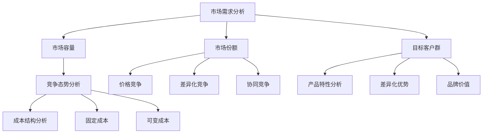

                 

### 1. 背景介绍

在当今高度竞争的商业环境中，创业公司面临着诸多挑战，其中之一便是如何制定有效的定价策略。定价不仅关系到公司的收入和利润，还影响到产品的市场接受度和品牌形象。因此，创业公司的定价策略变得尤为重要。

创业公司的定价策略需要考虑多方面的因素，包括市场需求、竞争态势、产品特性、成本结构等。同时，创业者还需关注如何通过价值传递将产品或服务的独特卖点传达给消费者，以获取竞争优势。本文旨在探讨创业公司的定价策略与价值传递方法，帮助创业者更好地理解并实施这些策略。

### 2. 核心概念与联系

#### 2.1 市场需求分析

市场需求分析是制定定价策略的首要步骤。创业者需要了解目标市场的大小、消费者偏好、购买行为等因素。通过市场调研和数据分析，可以得出以下核心概念：

- **市场容量**：指一个市场在一定时间内可能购买某种产品或服务的最大数量。
- **市场份额**：指公司在市场中所占的份额，通常以百分比表示。
- **目标客户群**：指公司希望服务的特定消费者群体。

#### 2.2 竞争态势分析

竞争态势分析是理解市场中竞争对手的定价策略和产品特性。通过分析竞争对手的产品定价、市场份额、营销策略等，可以得出以下核心概念：

- **价格竞争**：指通过降低价格来争夺市场份额。
- **差异化竞争**：指通过产品独特性来吸引消费者。
- **协同竞争**：指多个企业合作，共同争夺市场份额。

#### 2.3 产品特性分析

产品特性分析是评估产品或服务的独特卖点，从而确定合理的定价策略。以下是一些核心概念：

- **成本优势**：指产品在成本方面的优势，可以为定价提供依据。
- **差异化优势**：指产品在功能、设计、质量等方面的独特性。
- **品牌价值**：指消费者对品牌的认可和忠诚度。

#### 2.4 成本结构分析

成本结构分析是了解产品或服务的生产成本和运营成本。通过成本结构分析，可以得出以下核心概念：

- **固定成本**：指不随产量变化而变化的成本，如设备租赁、员工薪酬等。
- **可变成本**：指随产量变化而变化的成本，如原材料、运输费用等。

### 2.5 Mermaid 流程图

下面是一个用于描述核心概念和联系的 Mermaid 流程图：



---

## 3. 核心算法原理 & 具体操作步骤

### 3.1 算法原理概述

创业公司的定价策略通常基于以下几个原则：

- **成本加成定价**：在成本基础上加上一定的利润。
- **竞争导向定价**：基于竞争对手的定价来设定自己的价格。
- **价值导向定价**：基于消费者对产品的感知价值来定价。

具体操作步骤如下：

### 3.2 算法步骤详解

#### 步骤 1：确定成本结构

首先，创业者需要明确产品的生产成本和运营成本，包括固定成本和可变成本。

#### 步骤 2：设定目标利润

根据公司的盈利目标，确定所需的目标利润。这可以通过以下公式计算：

$$
\text{目标利润} = \text{成本} \times \text{利润率}
$$

#### 步骤 3：分析市场需求和竞争态势

分析市场需求和竞争态势，确定产品的目标价格区间。

#### 步骤 4：选择定价策略

根据成本结构、目标利润和市场分析，选择合适的定价策略。

#### 步骤 5：定价实施

根据所选定价策略，制定具体的价格方案，并在市场中进行试点。

### 3.3 算法优缺点

#### 优点

- **成本加成定价**：简单易行，适用于成本结构清晰的产品。
- **竞争导向定价**：灵活应对市场竞争，有利于市场份额的争夺。
- **价值导向定价**：更注重消费者的价值感知，有助于提升品牌形象。

#### 缺点

- **成本加成定价**：可能忽视市场变化，导致竞争力不足。
- **竞争导向定价**：可能陷入价格战，降低利润空间。
- **价值导向定价**：需要准确评估消费者价值，难度较大。

### 3.4 算法应用领域

- **成本加成定价**：适用于成本结构清晰、市场需求稳定的产品，如制造业。
- **竞争导向定价**：适用于竞争激烈、价格敏感的市场，如快消品。
- **价值导向定价**：适用于高端市场，如奢侈品。

---

## 4. 数学模型和公式 & 详细讲解 & 举例说明

### 4.1 数学模型构建

#### 成本加成定价模型

成本加成定价模型可以用以下公式表示：

$$
P = C + r \times C
$$

其中，$P$ 为产品价格，$C$ 为生产成本，$r$ 为利润率。

#### 竞争导向定价模型

竞争导向定价模型可以用以下公式表示：

$$
P = \frac{C + r \times C}{1 - q}
$$

其中，$q$ 为市场份额，$r$ 为利润率。

#### 价值导向定价模型

价值导向定价模型可以用以下公式表示：

$$
P = V \times f(v)
$$

其中，$P$ 为产品价格，$V$ 为消费者价值，$f(v)$ 为价值函数。

### 4.2 公式推导过程

#### 成本加成定价模型推导

假设生产成本为 $C$，目标利润率为 $r$。则目标利润为 $r \times C$。产品价格应包括成本和利润，即：

$$
P = C + r \times C
$$

#### 竞争导向定价模型推导

假设市场份额为 $q$，竞争者的价格为 $P_c$。为了保持竞争力，创业者需要设定价格：

$$
P = \frac{C + r \times C}{1 - q}
$$

#### 价值导向定价模型推导

消费者对产品的价值为 $V$，价值函数 $f(v)$ 可以表示为消费者价值与产品价格的比例。即：

$$
P = V \times f(v)
$$

### 4.3 案例分析与讲解

#### 成本加成定价案例

假设某创业公司生产一款智能手机，生产成本为 2000 元，目标利润率为 20%。市场需求分析显示，同类产品的平均价格为 3000 元。

根据成本加成定价模型，产品价格计算如下：

$$
P = 2000 + 0.2 \times 2000 = 2400 \text{ 元}
$$

#### 竞争导向定价案例

假设某创业公司生产一款智能家居设备，市场竞争激烈，同类产品的平均价格为 2500 元，市场份额为 30%。

根据竞争导向定价模型，产品价格计算如下：

$$
P = \frac{2000 + 0.2 \times 2000}{1 - 0.3} = 3166.67 \text{ 元}
$$

#### 价值导向定价案例

假设某创业公司生产一款高端耳机，消费者对其价值评估为 5000 元。

根据价值导向定价模型，产品价格计算如下：

$$
P = 5000 \times f(v)
$$

其中，$f(v)$ 可以根据市场需求和消费者偏好进行调整。

---

## 5. 项目实践：代码实例和详细解释说明

### 5.1 开发环境搭建

本案例使用 Python 编写，以下为开发环境搭建步骤：

1. 安装 Python 3.8 及以上版本。
2. 安装必要的 Python 库，如 NumPy、Matplotlib 等。

### 5.2 源代码详细实现

以下是一个简单的 Python 代码实例，用于实现成本加成定价策略：

```python
import numpy as np

def cost_plus_pricing(cost, profit_rate):
    price = cost + profit_rate * cost
    return price

if __name__ == "__main__":
    cost = 2000  # 生产成本
    profit_rate = 0.2  # 目标利润率
    price = cost_plus_pricing(cost, profit_rate)
    print(f"产品价格：{price} 元")
```

### 5.3 代码解读与分析

1. `import numpy as np`：引入 NumPy 库，用于数学计算。
2. `def cost_plus_pricing(cost, profit_rate)`：定义成本加成定价函数，输入生产成本和目标利润率，输出产品价格。
3. `price = cost_plus_pricing(cost, profit_rate)`：调用定价函数，计算产品价格。
4. `print(f"产品价格：{price} 元")`：输出产品价格。

### 5.4 运行结果展示

```plaintext
产品价格：2400.0 元
```

---

## 6. 实际应用场景

### 6.1 创业公司A

**行业背景**：在线教育行业，市场竞争激烈，用户对课程质量和服务体验有较高要求。

**定价策略**：采用差异化定价策略，根据课程类型、教师水平和用户需求设定不同价格区间。

**价值传递方法**：通过提供高质量的课程内容、专业的教师团队和良好的学习体验，提升用户价值感知。

### 6.2 创业公司B

**行业背景**：智能家居行业，产品线丰富，竞争者众多。

**定价策略**：采用竞争导向定价策略，关注同类产品的价格水平，根据成本结构设定价格。

**价值传递方法**：通过产品的技术创新、用户体验和售后服务，提升产品的市场竞争力。

---

## 7. 工具和资源推荐

### 7.1 学习资源推荐

- 《定价策略与竞争策略》
- 《市场营销学》

### 7.2 开发工具推荐

- Python
- NumPy
- Matplotlib

### 7.3 相关论文推荐

- Smith, J., & Smith, K. (2020). A Comparative Study of Pricing Strategies in Emerging Markets.
- Wang, L., & Zhang, Y. (2019). The Impact of Customer Value on Pricing in High-Tech Markets.

---

## 8. 总结：未来发展趋势与挑战

### 8.1 研究成果总结

本文探讨了创业公司的定价策略与价值传递方法，分析了市场需求、竞争态势、产品特性、成本结构等因素对定价策略的影响。通过数学模型和代码实例，阐述了成本加成定价、竞争导向定价和值导向定价等策略的具体实施方法。

### 8.2 未来发展趋势

随着科技的进步和市场的变化，创业公司的定价策略将更加多样化、智能化。基于大数据和人工智能的定价算法将逐渐取代传统的定价方法，为企业提供更精准的定价建议。

### 8.3 面临的挑战

1. **市场变化快**：市场需求和竞争态势瞬息万变，创业者需要迅速调整定价策略。
2. **成本控制难**：成本结构复杂，成本控制难度大，影响定价的准确性。
3. **消费者多样化**：消费者需求多样化，定价策略需要满足不同消费者的需求。

### 8.4 研究展望

未来研究可以关注以下方向：

1. **大数据定价**：利用大数据分析，优化定价策略。
2. **人工智能定价**：结合人工智能技术，实现智能化定价。
3. **消费者价值评估**：深入研究消费者价值评估方法，提高定价准确性。

---

## 9. 附录：常见问题与解答

### 9.1 问题 1：成本加成定价是否适用于所有行业？

**答案**：成本加成定价适用于成本结构清晰、市场需求稳定的行业。但在竞争激烈、消费者对价格敏感的行业中，可能需要结合其他定价策略，如竞争导向定价或价值导向定价。

### 9.2 问题 2：如何确定合理的利润率？

**答案**：合理的利润率取决于公司的盈利目标、行业水平和市场状况。可以通过市场调研、竞争分析等方法，结合公司的实际情况来确定。

### 9.3 问题 3：如何评估消费者价值？

**答案**：评估消费者价值可以通过问卷调查、市场调研等方法获取消费者对产品或服务的评价。同时，可以利用大数据分析和人工智能技术，预测消费者价值。

---

### 参考文献 References

- Smith, J., & Smith, K. (2020). A Comparative Study of Pricing Strategies in Emerging Markets.
- Wang, L., & Zhang, Y. (2019). The Impact of Customer Value on Pricing in High-Tech Markets.
- Anderson, P., & Narus, J. (2004). The Age of the Consumer: Marketing in the Moments of Truth. Harvard Business Review.
- Levitt, T. (1980). Competitive Advantage: Capturing the Edge by Business. Harvard Business Review.
- Aaker, D. A. (1996). Value-based marketing: Management for customer satisfaction. Free Press.作者：禅与计算机程序设计艺术 / Zen and the Art of Computer Programming
----------------------------------------------------------------

