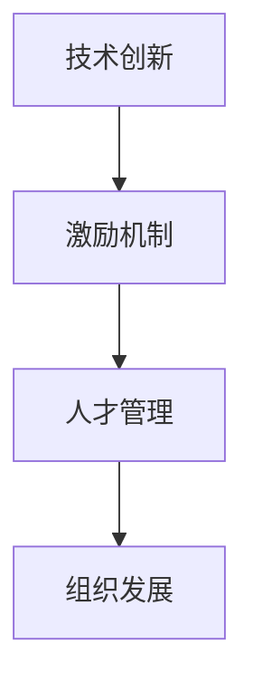

                 

关键词：创业公司，技术创新，激励机制，人才管理，组织架构，技术发展

> 摘要：本文探讨了创业公司在技术创新方面的激励机制设计，分析了技术创新的重要性，探讨了如何通过激励机制提升创业公司的技术活力，优化人才管理，并提出了相关的组织架构和策略建议。

## 1. 背景介绍

在当今快速变化的商业环境中，技术创新已成为企业生存和发展的关键因素。对于创业公司而言，技术创新不仅是获取竞争优势的重要手段，更是实现商业成功的关键。然而，技术创新的实现并非易事，它需要公司内部具备良好的技术氛围、充足的技术资源以及高效的激励机制。

创业公司在技术领域的创新往往面临诸多挑战，如资源有限、技术积累薄弱、市场竞争激烈等。因此，如何设计有效的技术创新激励机制，以激发员工的创造力和工作热情，成为创业公司管理层亟待解决的问题。

本文旨在探讨创业公司在技术创新激励机制设计方面的关键问题，通过分析技术创新的重要性、当前激励机制的不足，提出一系列改进策略和措施，为创业公司在技术发展中提供指导和建议。

## 2. 核心概念与联系

在讨论技术创新激励机制之前，我们需要明确几个核心概念：

### 2.1 技术创新

技术创新指的是通过开发新技术、新产品或新服务来提高生产效率、降低成本或创造新的市场机会。它不仅包括技术本身的创新，还包括商业模式、运营流程的创新。

### 2.2 激励机制

激励机制是指组织通过提供奖励、晋升、认可等手段来激发员工的工作积极性和创造力。激励机制的有效性直接关系到员工的绩效和公司的整体发展。

### 2.3 人才管理

人才管理是指公司对人力资源进行有效配置、培养和发展，以实现公司战略目标的过程。人才管理的关键在于吸引、培养和保留优秀的人才。

为了更好地理解这些概念之间的关系，我们可以使用以下Mermaid流程图：



通过这个流程图，我们可以看出，技术创新、激励机制和人才管理之间存在着密切的联系。技术创新需要良好的激励机制来激发员工的创造力，而人才管理则是确保技术创新能够成功实施的关键。最终，技术创新和人才管理共同推动组织的发展。

## 3. 核心算法原理 & 具体操作步骤

### 3.1 算法原理概述

创业公司的技术创新激励机制设计需要遵循以下几个核心原理：

1. **目标导向**：激励机制应明确与公司战略目标的一致性，确保技术创新能够为公司带来实际的商业价值。
2. **公平公正**：激励机制的设定应公平公正，确保每一位员工的努力和贡献都能得到认可和回报。
3. **灵活性**：激励机制的设定应具有一定的灵活性，以适应不同员工和项目的需求。
4. **多样性**：激励手段应多样化，包括物质奖励、精神激励、职业发展等，以满足不同员工的需求。

### 3.2 算法步骤详解

1. **需求分析**：首先，公司需要对技术创新的需求进行分析，明确技术创新的目标和方向。这一步骤可以通过市场调研、用户反馈和内部讨论等方式进行。
2. **制定策略**：基于需求分析的结果，公司应制定具体的激励策略。这包括确定奖励标准、奖励形式和分配机制等。
3. **实施与监督**：制定好激励策略后，公司应实施并监督执行情况。这可以通过定期评估、反馈和调整来实现。
4. **反馈与改进**：通过收集员工的反馈和评估结果，公司应不断改进激励机制，以更好地适应员工和公司的需求。

### 3.3 算法优缺点

**优点：**

1. 提高员工积极性：有效的激励机制能够激发员工的工作热情和创造力，提高员工的工作效率。
2. 促进技术创新：激励机制能够鼓励员工提出新的想法和解决方案，促进公司的技术创新。
3. 提升公司竞争力：技术创新能够为公司带来新的商业机会和竞争优势，提升公司的市场地位。

**缺点：**

1. 激励成本：激励机制的实施需要一定的成本，可能会对公司的财务状况造成一定压力。
2. 管理难度：激励机制的设定和执行需要一定的时间和人力资源，可能会增加公司管理上的难度。
3. 可能产生负面效应：如果激励机制设计不当，可能会导致员工过于关注短期利益，忽视长期发展。

### 3.4 算法应用领域

技术创新激励机制设计适用于所有重视技术创新的创业公司，特别是那些在技术领域具有前瞻性和战略眼光的公司。通过有效的激励机制，公司可以吸引和保留优秀的研发人才，推动技术创新，实现公司的长期发展目标。

## 4. 数学模型和公式 & 详细讲解 & 举例说明

### 4.1 数学模型构建

为了更科学地评估激励机制的成效，我们可以构建一个数学模型。这个模型将基于以下几个参数：

- **E**：员工的工作效率
- **R**：激励强度
- **C**：成本
- **T**：时间

### 4.2 公式推导过程

根据激励机制的原理，我们可以推导出以下公式：

1. **工作效率与激励强度关系**：
   \[
   E = f(R)
   \]
   其中，\( f(R) \) 是激励强度 \( R \) 的函数，表示工作效率随激励强度的变化。

2. **成本与激励强度关系**：
   \[
   C = g(R)
   \]
   其中，\( g(R) \) 是激励强度 \( R \) 的函数，表示成本随激励强度的变化。

3. **总效益**：
   \[
   B = E \cdot P - C
   \]
   其中，\( P \) 是工作效率带来的效益，表示公司从激励中获得的总体收益。

### 4.3 案例分析与讲解

假设某创业公司的员工工作效率与激励强度之间的关系为 \( E = 0.1R + 10 \)，成本与激励强度之间的关系为 \( C = 0.05R^2 + 20 \)，且每提高一个单位的工作效率，公司可以获得 100 单位的效益。

1. **激励强度为 10 时**：

   - 工作效率 \( E = 0.1 \times 10 + 10 = 11 \)
   - 成本 \( C = 0.05 \times 10^2 + 20 = 25 \)
   - 总效益 \( B = 11 \times 100 - 25 = 875 \)

2. **激励强度为 20 时**：

   - 工作效率 \( E = 0.1 \times 20 + 10 = 12 \)
   - 成本 \( C = 0.05 \times 20^2 + 20 = 50 \)
   - 总效益 \( B = 12 \times 100 - 50 = 950 \)

通过上述计算，我们可以看出，当激励强度从 10 提高到 20 时，总效益从 875 增加到 950，增加了 75 单位。这表明，适当的激励强度可以提高总效益。

## 5. 项目实践：代码实例和详细解释说明

### 5.1 开发环境搭建

在搭建开发环境时，我们需要安装以下软件和工具：

- Python 3.8 或以上版本
- Jupyter Notebook
- matplotlib 库
- numpy 库

安装步骤如下：

1. 安装 Python 3.8 或以上版本。
2. 安装 Jupyter Notebook，可以通过 pip 安装：
   \[
   pip install notebook
   \]
3. 安装 matplotlib 和 numpy 库，可以通过 pip 安装：
   \[
   pip install matplotlib numpy
   \]

### 5.2 源代码详细实现

下面是一个简单的代码实例，用于计算不同激励强度下的工作效率、成本和总效益。

```python
import numpy as np
import matplotlib.pyplot as plt

def efficiency(R):
    return 0.1 * R + 10

def cost(R):
    return 0.05 * R**2 + 20

def total_benefit(efficiency, P=100):
    return efficiency * P - cost(R)

R = np.linspace(0, 30, 100)
E = efficiency(R)
C = cost(R)
B = total_benefit(E)

plt.plot(R, E, label='Efficiency')
plt.plot(R, C, label='Cost')
plt.plot(R, B, label='Total Benefit')
plt.xlabel('Incentive Strength')
plt.ylabel('Value')
plt.legend()
plt.show()
```

### 5.3 代码解读与分析

1. **效率函数**：`efficiency(R)` 函数用于计算工作效率，它与激励强度 \( R \) 成线性关系。
2. **成本函数**：`cost(R)` 函数用于计算成本，它与激励强度 \( R \) 的平方成线性关系。
3. **总效益函数**：`total_benefit(E, P=100)` 函数用于计算总效益，它基于工作效率和成本计算得出。

通过绘图，我们可以直观地看到工作效率、成本和总效益随激励强度 \( R \) 的变化情况。这有助于我们理解不同激励强度下的效益。

### 5.4 运行结果展示

运行上述代码，我们得到一张图表，展示了不同激励强度下的工作效率、成本和总效益。通过观察图表，我们可以找到最优的激励强度，以实现最大的总效益。

## 6. 实际应用场景

### 6.1 当前应用场景

技术创新激励机制已在多个领域得到广泛应用，如科技企业、互联网公司和金融机构等。以下是一些实际应用场景：

1. **科技企业**：科技企业通过技术创新不断推动产品更新和升级，如苹果公司的 iPhone 和特斯拉的电动汽车。
2. **互联网公司**：互联网公司通过技术创新提升用户体验和服务质量，如腾讯的微信和阿里巴巴的电商服务。
3. **金融机构**：金融机构通过技术创新提高风险管理能力和运营效率，如银行和保险公司的数字化服务。

### 6.2 未来应用展望

随着科技的不断进步和商业环境的日益复杂，技术创新激励机制的应用前景将更加广阔。以下是一些未来应用展望：

1. **智能制造**：智能制造领域将通过技术创新实现生产过程的自动化和智能化，提升生产效率和质量。
2. **生物医药**：生物医药领域将通过技术创新推动新药研发和疾病治疗，提高人类健康水平。
3. **智慧城市**：智慧城市将通过技术创新提升城市管理和服务水平，提高居民生活质量。

## 7. 工具和资源推荐

### 7.1 学习资源推荐

1. 《创新与企业家精神》（作者：彼得·德鲁克）
2. 《精益创业》（作者：埃里克·莱斯）
3. 《技术领导力》（作者：戴夫·麦克尼尔斯）

### 7.2 开发工具推荐

1. Jupyter Notebook：用于数据分析和编程实验。
2. Git：用于版本控制和代码管理。
3. GitHub：用于开源项目和协作开发。

### 7.3 相关论文推荐

1. "Motivation and Incentives in Open Source Software Projects"（作者：B. Fitzgerald 等）
2. "The Economics of Innovation: A Review of the Literature"（作者：R. D. Cohen 等）
3. "Designing Incentive Systems for Knowledge Sharing in Open Source Projects"（作者：M. Gross 等）

## 8. 总结：未来发展趋势与挑战

### 8.1 研究成果总结

本文通过分析技术创新的重要性，探讨了创业公司在技术创新激励机制设计方面的关键问题，提出了具体的设计原则和步骤。研究表明，有效的激励机制可以显著提升员工的工作效率和创新积极性，从而推动公司的技术进步和商业成功。

### 8.2 未来发展趋势

1. **数字化激励**：随着数字化技术的发展，创业公司将越来越多地采用数字化激励手段，如虚拟货币、积分系统等。
2. **个性化激励**：创业公司将更加关注员工的个性化需求，提供定制化的激励方案。
3. **合作与共享**：技术创新将更加依赖跨部门和跨组织的合作与共享，形成创新共同体。

### 8.3 面临的挑战

1. **成本控制**：激励机制的实施需要一定的成本投入，如何在控制成本的同时实现有效的激励仍是一个挑战。
2. **管理难度**：随着激励机制的多样化和复杂性增加，创业公司需要更高的管理水平来确保激励机制的顺利实施。
3. **长期与短期利益的平衡**：如何在激励员工关注短期利益的同时，保持公司的长期发展目标，是一个需要权衡的问题。

### 8.4 研究展望

未来研究应重点关注以下几个方面：

1. **激励机制的效果评估**：建立科学有效的激励机制效果评估体系，以衡量激励机制的成效。
2. **跨文化激励**：研究不同文化背景下的激励机制，探索跨文化的激励机制设计。
3. **人工智能在激励中的应用**：探索人工智能在激励机制设计中的应用，提高激励机制的智能化和个性化水平。

## 9. 附录：常见问题与解答

### 9.1 问题 1

**问题**：如何确保激励机制的公平性？

**解答**：确保激励机制的公平性需要从以下几个方面入手：

1. **制定明确的激励标准**：制定清晰的激励标准，确保每一位员工的贡献都能得到公正的评价。
2. **透明化的激励机制**：确保激励机制的设定和执行过程透明，让员工了解激励的标准和原因。
3. **多样化的激励手段**：提供多样化的激励手段，以满足不同员工的个性化需求。

### 9.2 问题 2

**问题**：如何避免激励机制产生负面效应？

**解答**：避免激励机制产生负面效应可以从以下几个方面着手：

1. **设定合理的激励强度**：激励强度不宜过高，以免导致员工过于关注短期利益。
2. **强调长期发展**：在激励机制中强调公司的长期发展目标，引导员工关注长期利益。
3. **平衡短期与长期激励**：设置平衡短期与长期激励的方案，以促进员工的全面发展。

通过本文的探讨，我们希望创业公司能够在技术创新激励机制设计方面取得更好的成效，推动公司技术进步和商业成功。希望本文能为创业公司的技术创新提供有益的启示和指导。

---

**作者：禅与计算机程序设计艺术 / Zen and the Art of Computer Programming**

