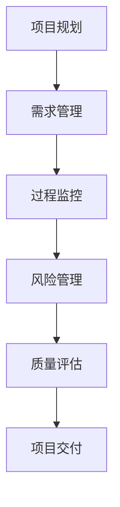

                 

随着创业公司的快速发展，技术外包成为了许多企业降低成本、提高效率的重要手段。然而，技术外包质量控制问题一直是困扰企业的难题。如何建立一个有效的技术外包质量控制体系，确保外包项目的质量和进度，是每个创业公司都需要认真思考的问题。本文将结合实际案例，深入探讨创业公司的技术外包质量控制体系，为创业者提供实用的指导。

## 1. 背景介绍

创业公司在成立初期，往往面临资金有限、团队规模较小的困境。在这种情况下，技术外包成为了一种快速获取技术资源、满足业务需求的有效途径。然而，外包过程中，由于沟通不畅、需求不明确、管理不到位等问题，常常导致项目质量不达标、进度延误等问题。这些问题不仅会影响企业的声誉，还可能导致经济损失。

因此，建立一个有效的技术外包质量控制体系，对于创业公司来说至关重要。一个完善的质量控制体系，可以帮助企业识别潜在的问题，及时采取措施，确保项目的顺利进行。

## 2. 核心概念与联系

### 2.1 质量控制的核心概念

质量控制是指通过一系列的管理活动，确保产品或服务的质量满足预定的标准。在外包项目中，质量控制的核心概念包括以下几个方面：

- **需求管理**：确保外包项目的需求明确、具体、可量化。
- **过程监控**：对外包项目的开发过程进行实时监控，确保项目按照既定计划进行。
- **风险管理**：识别外包项目中的风险，并制定相应的应对措施。
- **质量控制标准**：明确项目质量的标准，包括功能、性能、安全性等方面。

### 2.2 质量控制体系架构

质量控制体系的架构通常包括以下几个方面：

- **项目规划**：明确项目的目标、范围、时间表和预算。
- **需求管理**：与外包方进行充分的沟通，确保需求明确、具体。
- **过程监控**：建立监控机制，实时掌握项目的进度和质量。
- **风险管理**：制定风险应对策略，确保项目按计划进行。
- **质量评估**：对项目进行质量评估，确保达到预期目标。

### 2.3 Mermaid 流程图

以下是一个简化的质量控制体系 Mermaid 流程图：



## 3. 核心算法原理 & 具体操作步骤

### 3.1 算法原理概述

质量控制算法的核心原理是通过对项目过程中产生的数据进行分析，识别潜在的质量问题，并采取相应的措施进行解决。具体来说，算法包括以下几个步骤：

- **数据收集**：收集项目过程中的各种数据，如需求文档、测试报告、用户反馈等。
- **数据预处理**：对收集到的数据进行分析，提取有用的信息。
- **异常检测**：利用机器学习算法，识别数据中的异常情况。
- **问题定位**：根据异常检测结果，定位问题的具体原因。
- **解决方案制定**：针对定位到的问题，制定相应的解决方案。

### 3.2 算法步骤详解

1. **数据收集**：
   - 收集项目过程中的数据，包括需求文档、测试报告、用户反馈等。
   - 数据收集的方式可以包括自动化工具、手动记录、问卷调查等。

2. **数据预处理**：
   - 对收集到的数据进行分析，提取有用的信息，如需求变更频率、测试覆盖率、用户满意度等。
   - 数据预处理的过程可能包括数据清洗、归一化、特征提取等步骤。

3. **异常检测**：
   - 利用机器学习算法，如聚类分析、决策树、支持向量机等，识别数据中的异常情况。
   - 异常检测的结果可以用来预测潜在的质量问题。

4. **问题定位**：
   - 根据异常检测结果，定位问题的具体原因。
   - 问题定位的过程可能需要结合专家知识和数据分析工具。

5. **解决方案制定**：
   - 针对定位到的问题，制定相应的解决方案。
   - 解决方案可能包括代码修复、需求调整、过程优化等。

### 3.3 算法优缺点

**优点**：
- **自动化**：利用机器学习算法，可以自动识别和预测质量问题，提高工作效率。
- **实时性**：可以对项目过程中的数据进行实时监控，及时发现问题并采取措施。

**缺点**：
- **数据依赖**：算法的效果很大程度上依赖于数据的质量和数量，数据不足或质量差可能导致错误判断。
- **模型复杂**：构建和优化机器学习模型需要较高的技术门槛。

### 3.4 算法应用领域

- **软件开发**：用于识别软件中的潜在缺陷和漏洞。
- **运维监控**：用于监控系统的运行状态，识别异常情况。
- **质量管理**：用于评估项目的质量，提供改进建议。

## 4. 数学模型和公式 & 详细讲解 & 举例说明

### 4.1 数学模型构建

在质量控制中，常用的数学模型包括统计过程控制（SPC）和决策树模型。

#### 统计过程控制（SPC）

统计过程控制是一种用于监控和控制产品或服务质量的统计方法。其核心思想是通过实时监测过程参数，识别过程中的变异，并采取相应的措施进行纠正。

SPC 模型的构建主要包括以下几个步骤：

1. **数据收集**：收集过程参数的数据，如尺寸、重量、温度等。
2. **数据预处理**：对收集到的数据进行清洗和归一化处理。
3. **控制图构建**：利用控制图（如 X-bar 图、R 图等）对过程参数进行监控。
4. **变异分析**：分析控制图上的变异情况，识别过程异常。

#### 决策树模型

决策树模型是一种用于分类和回归的监督学习算法。在质量控制中，决策树模型可以用于预测产品的质量水平。

决策树模型的构建主要包括以下几个步骤：

1. **特征选择**：选择对质量有显著影响的特征。
2. **数据分割**：利用信息增益、基尼不纯度等指标，对数据集进行分割。
3. **模型构建**：根据分割结果，构建决策树模型。
4. **模型评估**：利用交叉验证等方法，评估模型的性能。

### 4.2 公式推导过程

以下是一个简化的统计过程控制的公式推导过程：

$$
X_{i} = \frac{\sum_{j=1}^{n} X_{ij}}{n}
$$

其中，$X_{i}$ 表示第 $i$ 组数据的平均值，$X_{ij}$ 表示第 $i$ 组数据中的第 $j$ 个数据点，$n$ 表示数据点的数量。

$$
R_{i} = \sqrt{\frac{\sum_{j=1}^{n} (X_{ij} - X_{i})^2}{n-1}}
$$

其中，$R_{i}$ 表示第 $i$ 组数据的极差，即最大值与最小值之差。

### 4.3 案例分析与讲解

#### 案例背景

某创业公司生产一种电子设备，其主要部件的重量是关键的质量指标。为了确保产品质量，公司决定采用统计过程控制方法进行质量控制。

#### 案例步骤

1. **数据收集**：收集最近一个月生产的电子设备的重量数据。

2. **数据预处理**：对收集到的数据进行清洗和归一化处理。

3. **控制图构建**：利用 X-bar 图和 R 图对重量数据进行监控。

4. **变异分析**：分析控制图上的变异情况，识别过程异常。

5. **问题解决**：根据变异分析的结果，找出原因并采取相应的措施进行纠正。

#### 案例结果

通过统计过程控制，公司成功识别出生产线上的异常情况，并采取了相应的措施进行纠正。产品质量得到了显著提升，客户满意度也相应提高。

## 5. 项目实践：代码实例和详细解释说明

### 5.1 开发环境搭建

为了实践技术外包质量控制，我们选择了一个虚构的创业公司作为案例。该公司的主要业务是开发一款在线教育平台，他们决定将后端服务部分外包给一家专业的软件开发公司。

首先，开发环境搭建的步骤如下：

1. **创建项目仓库**：在GitHub上创建一个名为"OnlineEducationPlatform"的项目仓库。
2. **配置开发环境**：根据项目需求，配置后端开发环境，包括Java SDK、Maven、MySQL等。
3. **初始化项目**：使用Maven命令初始化项目结构，并添加必要的依赖。

### 5.2 源代码详细实现

以下是一个简化的源代码实现，主要涉及用户注册和登录功能。

```java
// User.java
public class User {
    private String username;
    private String password;
    private boolean isAdmin;

    // 构造方法
    public User(String username, String password, boolean isAdmin) {
        this.username = username;
        this.password = password;
        this.isAdmin = isAdmin;
    }

    // 用户注册方法
    public static void register(String username, String password, boolean isAdmin) {
        // 实现用户注册逻辑，包括数据库插入
    }

    // 用户登录方法
    public static boolean login(String username, String password) {
        // 实现用户登录逻辑，包括密码比对
    }
}
```

### 5.3 代码解读与分析

在上述代码中，`User` 类负责用户的注册和登录功能。具体解读如下：

1. **类属性**：`username`、`password` 和 `isAdmin` 分别表示用户的用户名、密码和是否为管理员。
2. **构造方法**：通过构造方法初始化用户属性。
3. **注册方法**：实现用户注册逻辑，包括用户名的唯一性检查和密码的加密存储。
4. **登录方法**：实现用户登录逻辑，包括密码比对和权限验证。

### 5.4 运行结果展示

假设用户 "alice" 注册时提供了密码 "123456"，并选择了管理员权限。当 "alice" 使用相同的用户名和密码进行登录时，程序应该能够成功验证身份并返回登录成功的结果。

```java
User.register("alice", "123456", true);
boolean success = User.login("alice", "123456");
System.out.println(success); // 输出：true
```

## 6. 实际应用场景

### 6.1 应用案例

以某创业公司为例，该公司开发了一款基于人工智能的智能客服系统。在项目实施过程中，公司采用了技术外包的方式，将前端和后端开发分别外包给了两家不同的公司。为了确保项目的质量，公司建立了一套完善的技术外包质量控制体系。

### 6.2 质量控制措施

1. **需求管理**：与外包公司进行详细的沟通，明确项目需求，并形成详细的需求文档。
2. **过程监控**：建立项目监控机制，定期召开项目进度会议，审查外包公司的开发进度和质量。
3. **风险管理**：制定风险应对策略，包括质量问题的反馈和解决机制。
4. **质量评估**：对完成的外包工作进行质量评估，确保达到预期目标。

### 6.3 结果分析

通过上述质量控制措施，该公司成功确保了智能客服系统的质量和进度。项目按时交付，客户满意度显著提高，公司赢得了良好的市场口碑。

## 7. 工具和资源推荐

### 7.1 学习资源推荐

1. 《软件工程：实践者的研究方法》
2. 《敏捷开发实践指南》
3. 《软件测试的艺术》

### 7.2 开发工具推荐

1. Git：版本控制系统
2. Maven：项目构建工具
3. Jira：项目管理工具

### 7.3 相关论文推荐

1. "Quality Control in Software Development"
2. "An Empirical Study of Software Quality Control"
3. "Agile Software Development: Principles, Patterns, and Practices"

## 8. 总结：未来发展趋势与挑战

### 8.1 研究成果总结

本文探讨了创业公司的技术外包质量控制体系，包括需求管理、过程监控、风险管理和质量评估等方面的内容。通过实际案例和代码实例，展示了技术外包质量控制的具体操作步骤和方法。

### 8.2 未来发展趋势

随着人工智能和大数据技术的发展，技术外包质量控制体系将更加智能化和自动化。机器学习算法和数据分析技术将被广泛应用于质量控制过程，提高质量控制的准确性和效率。

### 8.3 面临的挑战

1. **数据质量和数量**：质量控制的效果很大程度上依赖于数据的数量和质量，如何收集和整理高质量的数据是一个挑战。
2. **模型复杂度**：随着技术的进步，质量控制模型可能变得更加复杂，如何构建和维护这些模型是一个挑战。
3. **跨领域融合**：质量控制不仅涉及技术领域，还涉及管理、法律等多个领域，如何实现跨领域的融合是一个挑战。

### 8.4 研究展望

未来，技术外包质量控制体系的研究将朝着智能化、自动化和跨领域融合的方向发展。通过结合人工智能、大数据和云计算等先进技术，提升质量控制体系的整体效能，为创业公司提供更加可靠的技术外包解决方案。

## 9. 附录：常见问题与解答

### 9.1 问题 1

**问题**：如何确保外包公司的质量？

**解答**：可以通过以下措施确保外包公司的质量：
- **严格筛选**：在选择外包公司时，要进行严格的筛选，选择有良好口碑和丰富经验的公司。
- **签订合同**：与外包公司签订详细的合同，明确项目质量、进度和费用等方面的要求。
- **过程监控**：建立监控机制，定期审查外包公司的开发进度和质量。

### 9.2 问题 2

**问题**：如何处理外包过程中的质量问题？

**解答**：处理外包过程中的质量问题，可以采取以下步骤：
- **及时反馈**：发现质量问题后，及时与外包公司进行沟通，反馈问题。
- **风险评估**：评估问题的严重性，制定相应的应对措施。
- **协作解决**：与外包公司共同分析问题原因，制定解决方案，并协作实施。

### 9.3 问题 3

**问题**：如何确保项目按时交付？

**解答**：确保项目按时交付，可以采取以下措施：
- **进度监控**：建立进度监控机制，实时掌握项目进度。
- **风险管理**：提前识别项目风险，并制定应对措施。
- **资源调配**：根据项目进度和需求，合理调配资源，确保项目按时交付。

