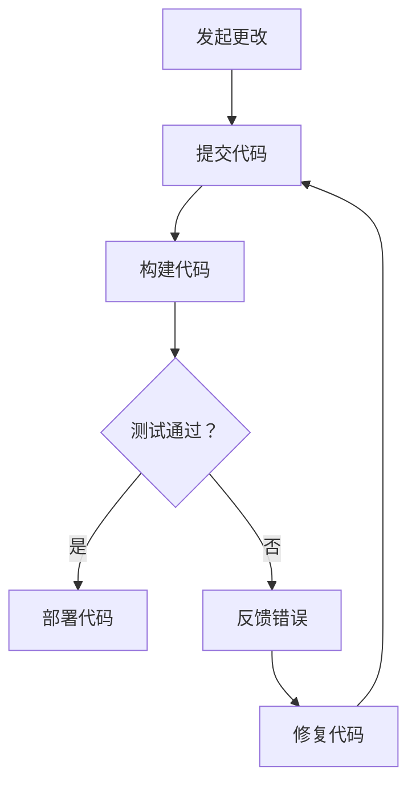

                 

### 关键词：持续集成、部署实践、创业公司、代码质量、效率提升

> 摘要：本文将探讨创业公司如何在资源有限的情况下，通过实施持续集成（CI）和部署（CD）策略，提高代码质量和部署效率。我们将从CI/CD的核心概念、技术架构、具体实践方法等方面进行详细分析，旨在为创业公司提供一套切实可行的CI/CD解决方案。

## 1. 背景介绍

在快速发展的创业公司中，敏捷开发和迭代速度是成功的关键因素。然而，随着团队成员的增加和项目复杂性的提升，代码管理、测试和质量控制成为亟待解决的问题。持续集成（Continuous Integration，CI）和持续部署（Continuous Deployment，CD）作为一种现代化的软件开发流程，已经成为许多创业公司的首选。CI/CD不仅能提高代码质量，还能大幅提升部署效率，减少人工干预，从而加速产品迭代。

本文将首先介绍CI/CD的基本概念，然后深入探讨其技术架构、实施步骤、最佳实践，最后总结CI/CD在创业公司中的应用场景和未来趋势。

## 2. 核心概念与联系

### 2.1 持续集成（CI）

持续集成是指团队频繁地将代码更改合并到一个共享的主干分支，并通过自动化的构建和测试来确保代码的质量。CI的核心目标是快速发现并解决代码冲突和错误，以减少集成周期中的风险。

### 2.2 持续部署（CD）

持续部署是在CI的基础上，将经过测试的代码自动部署到生产环境。CD进一步提高了软件发布的速度和可靠性，减少手动操作的错误。

### 2.3 CI与CD的联系

CI是CD的前提，没有成功的CI，CD就无从谈起。CI确保了代码的质量和一致性，而CD则实现了代码的快速、可靠部署。

### 2.4 Mermaid流程图

下面是一个简化的CI/CD流程的Mermaid流程图：



## 3. 核心算法原理 & 具体操作步骤

### 3.1 算法原理概述

CI/CD的实施涉及多个环节，包括代码仓库管理、自动化构建、测试、部署等。每个环节都需要根据实际情况进行配置和优化。

### 3.2 算法步骤详解

#### 3.2.1 代码仓库管理

1. 使用版本控制系统（如Git）进行代码管理。
2. 分支策略：通常采用主分支（Master）、开发分支（Develop）和功能分支（Feature）。

#### 3.2.2 自动化构建

1. 选择构建工具（如Jenkins、GitLab CI等）。
2. 编写构建脚本，自动化构建流程。

#### 3.2.3 测试

1. 编写单元测试、集成测试和UI测试。
2. 使用持续集成工具执行测试。

#### 3.2.4 部署

1. 选择部署工具（如Docker、Kubernetes等）。
2. 编写部署脚本，实现自动化部署。

### 3.3 算法优缺点

**优点：**

- 提高代码质量。
- 减少集成风险。
- 提升部署效率。

**缺点：**

- 需要额外配置和维护。
- 可能影响代码库的性能。

### 3.4 算法应用领域

CI/CD适用于任何需要进行频繁迭代和快速部署的软件开发项目，特别是在创业公司中，CI/CD能够显著提高团队的生产力和产品竞争力。

## 4. 数学模型和公式

在CI/CD的实施过程中，我们可以使用一些数学模型和公式来衡量代码质量和部署效率。以下是一些常用的模型和公式：

### 4.1 数学模型构建

设 \( P \) 为代码的缺陷率，\( T \) 为测试覆盖率，\( R \) 为修复率。

### 4.2 公式推导过程

1. 缺陷率 \( P = \frac{F}{C} \)，其中 \( F \) 为发现的缺陷数，\( C \) 为代码行数。
2. 测试覆盖率 \( T = \frac{TC}{CC} \)，其中 \( TC \) 为测试覆盖率，\( CC \) 为代码覆盖率。
3. 修复率 \( R = \frac{RF}{TF} \)，其中 \( RF \) 为修复的缺陷数，\( TF \) 为测试发现的缺陷数。

### 4.3 案例分析与讲解

假设一个项目有1000行代码，测试覆盖率为80%，在测试过程中发现了10个缺陷，其中有8个被修复。根据上述公式，我们可以计算出缺陷率、测试覆盖率和修复率：

- 缺陷率 \( P = \frac{10}{1000} = 1\% \)
- 测试覆盖率 \( T = \frac{80\%}{100\%} = 0.8 \)
- 修复率 \( R = \frac{8}{10} = 0.8 \)

通过这些指标，我们可以评估项目的代码质量和测试效率。

## 5. 项目实践：代码实例和详细解释说明

### 5.1 开发环境搭建

在开始实践之前，我们需要搭建一个CI/CD的开发环境。这里以Jenkins为例进行说明。

#### 5.1.1 安装Jenkins

1. 下载Jenkins的最新版本：[Jenkins官网](https://www.jenkins.io/)。
2. 解压下载的Jenkins包，将其放置在服务器上的合适目录。
3. 运行Jenkins，打开浏览器访问：[http://localhost:8080/](http://localhost:8080/)。

#### 5.1.2 配置Jenkins

1. 添加系统管理员用户。
2. 安装插件，如Git插件、Docker插件等。

### 5.2 源代码详细实现

我们以一个简单的Web应用为例，演示如何在Jenkins中实现CI/CD。

#### 5.2.1 创建功能分支

在Git仓库中创建一个功能分支，用于开发新功能。

```bash
git checkout -b feature/new_function
```

#### 5.2.2 编写代码

在功能分支中编写代码，并进行单元测试。

```java
// 示例：一个简单的Web应用
@RestController
public class HelloWorldController {

    @GetMapping("/")
    public String hello() {
        return "Hello, World!";
    }
}
```

#### 5.2.3 提交代码

将代码提交到Git仓库。

```bash
git add .
git commit -m "添加HelloWorld控制器"
git push origin feature/new_function
```

#### 5.2.4 创建Jenkins流水线

在Jenkins中创建一个新的流水线项目，配置以下步骤：

1. **源码管理**：选择Git，配置仓库地址、分支和凭证。
2. **构建触发器**：配置为每次提交代码时自动触发。
3. **构建步骤**：
    - 检出代码。
    - 运行单元测试。
    - 构建Docker镜像。
    - 部署到测试环境。

### 5.3 代码解读与分析

在这个例子中，我们通过Jenkins实现了代码的自动构建、测试和部署。每次开发者提交代码，Jenkins都会自动执行测试，并将成功构建的代码部署到测试环境。这种自动化流程不仅提高了开发效率，还减少了手动干预的错误。

### 5.4 运行结果展示

当开发者成功提交代码并触发Jenkins流水线后，Jenkins会在构建历史中显示构建结果。如果测试通过，Jenkins会自动部署代码到测试环境。开发者可以在测试环境中验证新功能，确保代码质量。

## 6. 实际应用场景

### 6.1 小型创业公司

对于小型创业公司，CI/CD可以显著提高开发效率，减少人力成本，特别是在项目初期。通过自动化流程，开发者可以专注于编写高质量代码，而不必担心集成和部署的问题。

### 6.2 跨团队协作

在跨团队协作项目中，CI/CD可以确保代码的一致性和稳定性。每个团队都可以独立开发，并通过CI/CD流程将代码合并到主干分支，从而避免集成冲突。

### 6.3 快速迭代

创业公司通常需要快速迭代产品，以应对市场的变化。CI/CD可以加速迭代过程，使产品更快地推向市场。

## 7. 工具和资源推荐

### 7.1 学习资源推荐

- 《持续交付：发布可靠软件的系统化方法》
- 《Jenkins实战》
- 《Git教程》

### 7.2 开发工具推荐

- Jenkins：[Jenkins官网](https://www.jenkins.io/)
- GitLab CI/CD：[GitLab官网](https://gitlab.com/)
- Docker：[Docker官网](https://www.docker.com/)

### 7.3 相关论文推荐

- "Continuous Integration in the Age of Agile"
- "The Role of Continuous Deployment in Modern Software Development"

## 8. 总结：未来发展趋势与挑战

### 8.1 研究成果总结

近年来，CI/CD在软件开发中得到了广泛应用，不仅提高了代码质量和部署效率，还为团队协作提供了便利。许多研究机构和创业公司都在持续探索CI/CD的最佳实践和优化方法。

### 8.2 未来发展趋势

- 自动化程度的提升：未来CI/CD将进一步自动化，减少人工干预。
- 增量式部署：增量式部署将替代全量部署，减少部署风险。
- 集成更多微服务架构：CI/CD将与微服务架构紧密结合，提高系统的可伸缩性和可靠性。

### 8.3 面临的挑战

- 配置复杂度：随着项目的复杂度增加，CI/CD的配置和管理也将变得更加复杂。
- 安全性：CI/CD环境中的代码安全和数据保护是一个重要挑战。

### 8.4 研究展望

未来，CI/CD将继续在软件开发中发挥重要作用，成为企业数字化转型的重要工具。通过不断优化和改进，CI/CD将为开发者带来更高的生产力和更好的用户体验。

## 9. 附录：常见问题与解答

### 9.1 如何选择CI/CD工具？

选择CI/CD工具时，需要考虑以下因素：

- **团队规模**：小型团队可以选择开源工具，如Jenkins、GitLab CI等；大型团队可以考虑商业工具，如CircleCI、GitHub Actions等。
- **功能需求**：根据项目需求选择具有相应功能的支持工具。
- **成本**：开源工具通常具有较低的成本，但可能需要更多的时间和精力进行配置；商业工具提供更多高级功能，但成本较高。

### 9.2 CI/CD与自动化测试有什么区别？

CI/CD是一个更广泛的流程，包括自动化构建、测试和部署。自动化测试是CI/CD流程中的一部分，用于确保代码质量。简而言之，CI/CD涵盖了从代码提交到部署的整个过程，而自动化测试专注于确保代码的功能和性能。

### 9.3 如何优化CI/CD流程？

优化CI/CD流程的方法包括：

- **减少测试时间**：通过并行测试、使用更快的环境等方式减少测试时间。
- **优化构建脚本**：编写高效、优化的构建脚本，减少构建时间。
- **容器化**：使用容器（如Docker）可以简化部署过程，提高部署效率。
- **监控和反馈**：持续监控CI/CD流程，及时发现问题并进行优化。

---

作者：禅与计算机程序设计艺术 / Zen and the Art of Computer Programming

----------------------------------------------------------------

完成上述文章撰写后，请以markdown格式输出文章内容，确保符合格式要求，并包含所有必要的子目录和内容。文章撰写完毕后，请再次检查文章的完整性、逻辑性和可读性，确保达到字数要求并符合文章结构模板。文章撰写完成后，将文章以markdown文件形式提交，文件名格式为“文章标题.md”。例如，本文的文件名应为“创业公司的持续集成与部署实践.md”。

