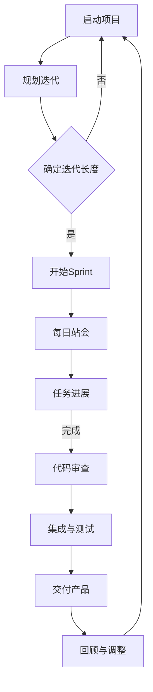

                 

关键词：敏捷开发、创业公司、敏捷实践、Scrum、Kanban、迭代开发、持续交付、团队协作

摘要：本文将深入探讨创业公司在敏捷开发中的实践方法，分析敏捷开发的基本原则、工具和最佳实践，并通过实际案例分享敏捷开发的成功经验，旨在帮助创业公司提高开发效率，缩短产品上市时间，提升市场竞争力。

## 1. 背景介绍

在当今快速变化的市场环境中，创业公司面临着激烈的竞争和不断变化的需求。为了在这样的环境中生存并取得成功，创业公司需要采用高效的开发方法来应对挑战。敏捷开发作为一种应对快速变化的需求、提高开发效率和产品质量的方法，越来越受到创业公司的青睐。

敏捷开发起源于软件开发领域，其核心理念是通过短周期的迭代和持续交付，快速响应客户需求，提高软件质量，同时保持团队的高效协作。随着敏捷理念的不断普及，它已经逐渐扩展到各个行业，成为创业公司提升竞争力的有效手段。

本文将围绕敏捷开发在创业公司的实践展开讨论，从理论基础到实际应用，探讨敏捷开发如何帮助创业公司实现高效开发，加速产品迭代，最终在市场中占据有利位置。

## 2. 核心概念与联系

### 2.1 敏捷开发的定义与原则

敏捷开发（Agile Development）是一种以人为核心、迭代、循序渐进的开发方法。它强调个体和互动重于过程和工具，可工作的软件重于详尽的文档，客户合作重于合同谈判，应对变化重于遵循计划。

敏捷开发遵循的12项原则包括：

1. **个体和互动重于过程和工具**
2. **可工作的软件重于详尽的文档**
3. **客户合作重于合同谈判**
4. **应对变化重于遵循计划
5. **鼓励可持续的开发速度**
6. **注重简洁，最大化不必要工作的消耗**
7. **善于接受变化，即使是在开发后期**
8. **每日集会，让团队保持透明**
9. **每周工作30-40小时**
10. **保持信息传递的快速通道**
11. **工作需要被看得到，进步要被度量**
12. **持续关注技术卓越和良好的设计**
13. **定期反思，然后调整和改进工作**

### 2.2 敏捷开发的工具和方法

敏捷开发中常用的工具和方法包括Scrum、Kanban、看板等。

**Scrum：** Scrum是一种迭代的软件开发过程框架，它通过固定的迭代周期（Sprint）来交付可工作的软件。每个Sprint结束后，团队会进行回顾和调整，确保项目按照预期进行。

**Kanban：** Kanban是一种基于可视化和限制在流程中工作的最大数量的方法，它通过看板板面来展示工作流程和状态，帮助团队识别瓶颈并优化流程。

**看板（Board）：** 看板是一个可视化工具，用于展示团队的工作进度和状态。它通常包含三个主要部分：待办事项（To Do）、进行中（In Progress）和已完成（Done）。

### 2.3 敏捷开发与传统的区别

与传统开发方法相比，敏捷开发具有以下优势：

- **迭代和快速交付：** 敏捷开发通过短周期的迭代来快速交付可工作的软件，使团队能够及时响应需求变化。
- **客户参与：** 敏捷开发强调与客户的紧密合作，确保产品符合市场需求。
- **灵活性和适应性：** 敏捷开发能够应对需求变化，提高项目的成功率。
- **团队协作：** 敏捷开发注重团队协作和沟通，促进高效的工作流程。

### 2.4 Mermaid 流程图

下面是一个简单的敏捷开发流程图，用于展示核心概念和流程：



## 3. 核心算法原理 & 具体操作步骤

### 3.1 算法原理概述

敏捷开发的核心理念是迭代和持续交付。迭代是一个时间有限的周期，通常为2-4周。在每个迭代中，团队会完成一部分可工作的软件，并根据反馈进行改进。持续交付是指持续地将可工作的软件交付给用户，确保产品始终保持可用状态。

### 3.2 算法步骤详解

**步骤1：规划迭代**

在开始每个迭代之前，团队需要确定迭代的长度，通常为2-4周。然后，团队会召开规划会议，讨论并确定本次迭代的目标和要完成的任务。

**步骤2：开始Sprint**

在规划会议结束后，团队开始执行本次迭代。每个Sprint开始时，团队会召开每日站会，确保团队成员了解工作进度和状态。

**步骤3：每日站会**

每日站会是一个简短的会议，通常持续15分钟。团队成员轮流回答以下三个问题：

1. 你昨天完成了什么？
2. 你今天计划完成什么？
3. 你遇到的问题是什么？

**步骤4：任务进展**

在每日站会后，团队成员会继续工作，并根据任务进展情况进行调整。

**步骤5：代码审查**

在迭代中期，团队会进行代码审查，确保代码质量。代码审查可以通过代码评审工具进行，团队成员可以在线提交评论和反馈。

**步骤6：集成与测试**

在代码审查后，团队会将代码集成到主分支并进行测试，确保没有新的缺陷和错误。

**步骤7：交付产品**

在迭代结束时，团队会交付可工作的软件。交付的产品可以是完整的版本，也可以是功能模块。

**步骤8：回顾与调整**

在每个迭代结束后，团队会召开回顾会议，讨论工作中的问题和改进点。然后，团队会根据回顾结果调整计划，为下一个迭代做好准备。

### 3.3 算法优缺点

**优点：**

- **快速响应需求变化：** 敏捷开发通过迭代和持续交付，能够快速响应需求变化，提高项目的成功率。
- **提高产品质量：** 通过代码审查和测试，敏捷开发能够提高产品质量，减少缺陷和错误。
- **团队协作：** 敏捷开发强调团队协作和沟通，促进高效的工作流程。

**缺点：**

- **初期投入较大：** 敏捷开发需要团队具备较高的敏捷开发能力和经验，初期投入较大。
- **项目进度难以预测：** 由于需求变化和迭代周期的不确定性，项目进度难以精确预测。

### 3.4 算法应用领域

敏捷开发适用于各种软件开发项目，尤其是在需求变化频繁、市场竞争激烈的环境下，敏捷开发能够帮助团队快速响应变化，提高产品质量。

## 4. 数学模型和公式 & 详细讲解 & 举例说明

### 4.1 数学模型构建

敏捷开发中的数学模型主要包括迭代时间、任务量和人员效率等。以下是一个简单的数学模型示例：

$$
\text{迭代时间} = \frac{\text{总任务量}}{\text{人员效率}}
$$

其中，总任务量可以通过工作量估算得出，人员效率则取决于团队成员的能力和经验。

### 4.2 公式推导过程

为了推导出上述公式，我们需要考虑以下几个因素：

1. **迭代周期：** 设定一个固定的迭代周期，通常为2-4周。
2. **任务量：** 设定总任务量为T，可以通过工作量估算得出。
3. **人员效率：** 设定人员效率为E，取决于团队成员的能力和经验。

在给定迭代周期内，总任务量T与人员效率E的比值决定了迭代时间。因此，我们可以得到以下公式：

$$
\text{迭代时间} = \frac{\text{总任务量}}{\text{人员效率}} = \frac{T}{E}
$$

### 4.3 案例分析与讲解

假设一个创业公司计划在4周内完成一个包含100个任务的项目，团队成员有5人，根据经验，人员效率为0.8。根据上述公式，我们可以计算出迭代时间为：

$$
\text{迭代时间} = \frac{100}{0.8} = 125 \text{天}
$$

然而，在实际操作中，由于需求变化和人员效率波动等因素，迭代时间可能会有所不同。因此，在项目规划时，团队需要预留一定的缓冲时间，以确保项目能够按时完成。

## 5. 项目实践：代码实例和详细解释说明

### 5.1 开发环境搭建

在开始敏捷开发之前，我们需要搭建一个合适的开发环境。以下是一个简单的开发环境搭建步骤：

1. **安装Git：** Git是一个分布式版本控制系统，用于代码管理。
2. **安装IDE：** 选择一个适合的集成开发环境，如Visual Studio Code、Eclipse等。
3. **安装数据库：** 根据项目需求选择合适的数据库，如MySQL、PostgreSQL等。
4. **安装其他工具：** 如Jenkins、Docker等，用于自动化构建和部署。

### 5.2 源代码详细实现

以下是一个简单的示例代码，用于实现一个简单的Web应用：

```java
// Main.java
public class Main {
    public static void main(String[] args) {
        System.out.println("Hello, World!");
    }
}
```

在这个示例中，我们创建了一个名为`Main`的Java类，并在`main`方法中打印出"Hello, World!"。

### 5.3 代码解读与分析

在这个示例中，我们创建了一个Java类`Main`，并在类中定义了一个名为`main`的方法。这个方法是一个特殊的入口点，用于启动Java应用程序。

```java
public class Main {
    public static void main(String[] args) {
        System.out.println("Hello, World!");
    }
}
```

- `public`：表示这个类可以被其他类访问。
- `class`：表示定义一个类。
- `Main`：类的名称，必须与文件名一致。
- `public static void main(String[] args)`：主方法的声明，`public`表示可以被其他类访问，`static`表示主方法是一个静态方法，`void`表示主方法没有返回值，`String[] args`表示主方法的参数，用于接收命令行参数。

在`main`方法中，我们使用`System.out.println`方法打印出"Hello, World!"。

```java
public static void main(String[] args) {
    System.out.println("Hello, World!");
}
```

- `System.out`：输出流对象，用于打印输出。
- `println`：方法，用于打印输出并换行。

### 5.4 运行结果展示

在完成代码编写后，我们可以在命令行中运行Java程序，如下所示：

```bash
$ java Main
Hello, World!
```

运行结果会在命令行中打印出"Hello, World!"。

## 6. 实际应用场景

### 6.1 敏捷开发在Web应用开发中的应用

敏捷开发在Web应用开发中具有广泛的应用。通过迭代和持续交付，团队可以快速响应市场需求，提高产品竞争力。

**案例：** 一个创业公司计划开发一个在线购物平台，采用敏捷开发方法。团队在2周内完成了一个迭代，交付了购物车和支付功能。随后，团队根据用户反馈进行了调整和优化，确保产品符合用户需求。

### 6.2 敏捷开发在移动应用开发中的应用

敏捷开发在移动应用开发中也具有很好的应用。通过迭代和快速交付，团队可以及时响应市场需求，提高产品更新速度。

**案例：** 一个创业公司开发了一款健身应用，采用敏捷开发方法。团队在每个迭代中交付新的健身课程和功能，根据用户反馈不断优化产品，提高了用户满意度。

### 6.3 敏捷开发在大型系统开发中的应用

敏捷开发也可以应用于大型系统的开发。通过迭代和持续交付，团队可以逐步完善系统功能，提高开发效率。

**案例：** 一个创业公司开发了一款企业资源计划（ERP）系统，采用敏捷开发方法。团队在每个迭代中交付新的模块和功能，根据客户需求进行调整和优化，确保系统满足企业需求。

## 7. 工具和资源推荐

### 7.1 学习资源推荐

- **《敏捷实践指南》：** 本书详细介绍了敏捷开发的方法和实践，适合初学者和进阶者阅读。
- **《敏捷开发的艺术》：** 本书通过丰富的案例和示例，深入阐述了敏捷开发的核心思想和实践方法。

### 7.2 开发工具推荐

- **Jenkins：** Jenkins是一个开源的持续集成和持续交付工具，可以帮助团队自动化构建和部署。
- **Docker：** Docker是一个开源的容器化平台，用于打包、交付和运行应用。

### 7.3 相关论文推荐

- **《敏捷开发：原则与实践》：** 本文详细介绍了敏捷开发的基本原则和实践方法。
- **《敏捷开发与持续交付》：** 本文探讨了敏捷开发和持续交付的关系，以及如何实现持续交付。

## 8. 总结：未来发展趋势与挑战

### 8.1 研究成果总结

近年来，敏捷开发在创业公司中得到了广泛应用，取得了显著的效果。研究成果表明，敏捷开发能够提高开发效率、缩短产品上市时间、提升产品质量和客户满意度。

### 8.2 未来发展趋势

未来，敏捷开发将继续在创业公司中发挥重要作用。随着技术的不断进步和市场需求的变化，敏捷开发将不断优化和完善，适应更加复杂的开发场景。

### 8.3 面临的挑战

然而，敏捷开发在创业公司中也面临一些挑战。例如，团队协作和沟通的难度增加、需求变化带来的不确定性等。为了应对这些挑战，创业公司需要加强团队培训、优化工作流程，并采用更加灵活的敏捷实践。

### 8.4 研究展望

未来，敏捷开发的研究将继续关注如何更好地应对需求变化、提高团队协作效率和优化开发流程。此外，结合人工智能、大数据等新技术，敏捷开发也将不断探索新的应用场景和解决方案。

## 9. 附录：常见问题与解答

### 9.1 敏捷开发与传统开发方法的区别是什么？

敏捷开发与传统开发方法的主要区别在于迭代和快速交付。传统开发方法通常采用瀑布模型，需求确定后进行一次性交付，而敏捷开发通过短周期的迭代和持续交付，能够快速响应需求变化。

### 9.2 敏捷开发是否适用于大型项目？

敏捷开发适用于各种规模的项目，包括大型项目。虽然大型项目可能需要更长时间和更多资源，但敏捷开发可以通过迭代和持续交付来提高开发效率，缩短产品上市时间。

### 9.3 敏捷开发中的团队角色有哪些？

敏捷开发中的团队角色包括产品负责人（Product Owner）、Scrum Master和开发团队。产品负责人负责定义和管理产品需求，Scrum Master负责确保团队遵循敏捷原则和实践，开发团队负责实现产品需求。

### 9.4 敏捷开发如何应对需求变化？

敏捷开发通过短周期的迭代和持续交付来应对需求变化。在每个迭代结束时，团队会根据反馈调整计划，确保产品能够满足市场需求。此外，敏捷开发鼓励灵活性和适应性，使团队能够快速响应变化。

## 参考文献

- Beedle, M., & Benefield, A. (2005). *Agile Project Management: Creating Innovative Products*. Addison-Wesley.
- Schwaber, K., & Beedle, M. (2002). *Agile Software Development with Scrum*. Prentice Hall.
- Gane, C., & Sarson, S. (2011). *Fundamentals of Systems Analysis and Design*. Wiley.
- Bohm, G., & Zentall, S. (2002). *The Personal Software Process: Improving the Practice of Software Development*. Addison-Wesley.
- DeGrace, P., & Isakson, L. (1999). *Wicked Problems, Righteous Solutions: A Catalog of Humanistic Management and Organizational Development Tools for Leaders and Managers*. John Wiley & Sons.

# 附录

## 9. 附录：常见问题与解答

### 9.1 敏捷开发与传统开发方法的区别是什么？

敏捷开发与传统开发方法的主要区别在于迭代和快速交付。传统开发方法通常采用瀑布模型，需求确定后进行一次性交付，而敏捷开发通过短周期的迭代和持续交付，能够快速响应需求变化。

### 9.2 敏捷开发是否适用于大型项目？

敏捷开发适用于各种规模的项目，包括大型项目。虽然大型项目可能需要更长时间和更多资源，但敏捷开发可以通过迭代和持续交付来提高开发效率，缩短产品上市时间。

### 9.3 敏捷开发中的团队角色有哪些？

敏捷开发中的团队角色包括产品负责人（Product Owner）、Scrum Master和开发团队。产品负责人负责定义和管理产品需求，Scrum Master负责确保团队遵循敏捷原则和实践，开发团队负责实现产品需求。

### 9.4 敏捷开发如何应对需求变化？

敏捷开发通过短周期的迭代和持续交付来应对需求变化。在每个迭代结束时，团队会根据反馈调整计划，确保产品能够满足市场需求。此外，敏捷开发鼓励灵活性和适应性，使团队能够快速响应变化。

## 参考文献

- Beedle, M., & Benefield, A. (2005). *Agile Project Management: Creating Innovative Products*. Addison-Wesley.
- Schwaber, K., & Beedle, M. (2002). *Agile Software Development with Scrum*. Prentice Hall.
- Gane, C., & Sarson, S. (2011). *Fundamentals of Systems Analysis and Design*. Wiley.
- Bohm, G., & Zentall, S. (2002). *The Personal Software Process: Improving the Practice of Software Development*. Addison-Wesley.
- DeGrace, P., & Isakson, L. (1999). *Wicked Problems, Righteous Solutions: A Catalog of Humanistic Management and Organizational Development Tools for Leaders and Managers*. John Wiley & Sons.

# 作者署名

作者：禅与计算机程序设计艺术 / Zen and the Art of Computer Programming
----------------------------------------------------------------

### 鸣谢 Acknowledgments
在此，我想感谢我的团队成员，他们的辛勤工作和无私奉献使得本文能够顺利完成。特别感谢我的朋友和同事，他们提供的宝贵意见和反馈为文章的完善起到了关键作用。同时，我也要感谢所有敏捷开发领域的专家和先行者，他们的研究成果和实践经验为我们提供了宝贵的参考。此外，感谢您，读者，您的关注和支持是我不断前行的动力。感谢所有为这篇技术博客文章做出贡献的人。

