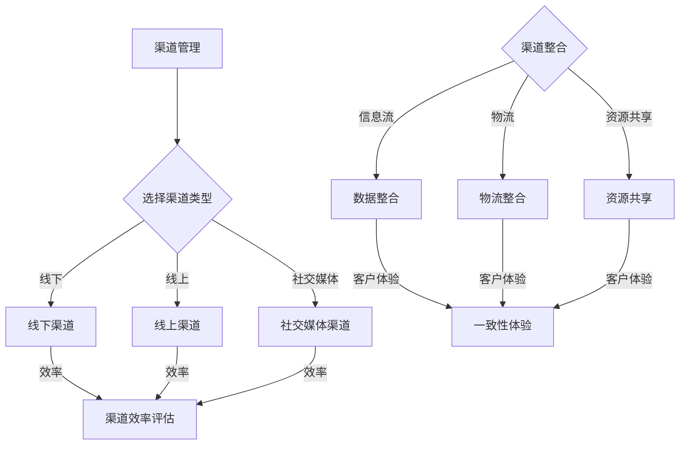

                 

创业公司在进入市场时，面临着诸多挑战，其中之一便是渠道管理的有效性和多渠道整合策略的制定。本文旨在探讨创业公司在渠道管理方面的挑战，并深入分析多渠道整合策略的实施及其重要性。

## 1. 背景介绍

在当今快速变化的市场环境中，创业公司需要迅速适应并优化其渠道策略。传统的单一渠道模式已经无法满足消费者多样化的需求。因此，多渠道整合成为创业公司成功的关键之一。多渠道整合不仅能够扩大市场覆盖范围，提高销售额，还能提升客户满意度和忠诚度。

## 2. 核心概念与联系

### 2.1. 渠道管理

渠道管理是指企业通过规划、组织、控制和评估渠道成员及其活动，以确保产品或服务能够有效到达目标市场。在创业公司中，渠道管理涉及到选择适当的渠道类型、优化渠道成员关系以及确保渠道效率。

### 2.2. 多渠道整合

多渠道整合是指将不同的销售渠道（如线上、线下、社交媒体等）整合为一个统一的整体，实现资源共享、信息流和物流的无缝对接。多渠道整合的目标是提供一致的客户体验，提高市场竞争力。

### 2.3. Mermaid 流程图

以下是渠道管理与多渠道整合的 Mermaid 流程图：



## 3. 核心算法原理 & 具体操作步骤

### 3.1. 算法原理概述

多渠道整合的核心在于数据共享和资源优化。通过以下步骤，创业公司可以实现有效的多渠道整合：

1. **渠道选择**：根据目标市场和产品特性选择合适的渠道类型。
2. **数据整合**：将不同渠道的数据进行统一管理和分析。
3. **物流整合**：优化物流流程，实现无缝对接。
4. **资源共享**：充分利用不同渠道的资源和优势。
5. **渠道效率评估**：定期评估渠道效率，调整策略。

### 3.2. 算法步骤详解

1. **渠道选择**：通过市场调研和数据分析，确定目标市场，选择适合的渠道类型。

2. **数据整合**：建立统一的数据管理系统，实现线上线下数据的实时同步和共享。

3. **物流整合**：优化物流流程，实现从生产到销售的全程追踪和管理。

4. **资源共享**：将不同渠道的资源和优势进行整合，提高整体运营效率。

5. **渠道效率评估**：通过数据分析和用户反馈，定期评估渠道效率，优化渠道策略。

### 3.3. 算法优缺点

#### 优点：

- **提高销售效率**：多渠道整合能够提高销售效率和客户转化率。
- **降低运营成本**：通过资源共享和物流整合，降低运营成本。
- **提高客户满意度**：提供一致的客户体验，增强客户忠诚度。

#### 缺点：

- **实施难度大**：需要投入大量资源和时间进行渠道整合。
- **管理复杂**：需要协调不同渠道之间的运营和管理。

### 3.4. 算法应用领域

多渠道整合策略适用于各类创业公司，尤其是在零售、电商、服务等领域。通过多渠道整合，创业公司能够更好地满足客户需求，提高市场竞争力。

## 4. 数学模型和公式 & 详细讲解 & 举例说明

### 4.1. 数学模型构建

多渠道整合的数学模型主要包括以下部分：

1. **渠道选择模型**：根据目标市场和产品特性，选择最优的渠道类型。
2. **数据整合模型**：建立统一的数据管理系统，实现不同渠道数据的整合和共享。
3. **物流整合模型**：优化物流流程，提高物流效率。

### 4.2. 公式推导过程

假设有 \( n \) 个渠道，每个渠道的销售量为 \( x_i \)，渠道成本为 \( c_i \)，渠道效率为 \( e_i \)，则渠道选择模型可以表示为：

\[ \max \sum_{i=1}^{n} x_i \cdot e_i - \sum_{i=1}^{n} c_i \]

数据整合模型可以表示为：

\[ \min \sum_{i=1}^{n} x_i \cdot t_i \]

其中，\( t_i \) 表示渠道之间的数据传输时间。

物流整合模型可以表示为：

\[ \min \sum_{i=1}^{n} x_i \cdot l_i \]

其中，\( l_i \) 表示渠道之间的物流运输成本。

### 4.3. 案例分析与讲解

假设一家创业公司有线上和线下两个渠道，每个渠道的销售量分别为 \( x_1 \) 和 \( x_2 \)，渠道成本分别为 \( c_1 \) 和 \( c_2 \)，渠道效率分别为 \( e_1 \) 和 \( e_2 \)，则渠道选择模型可以表示为：

\[ \max (x_1 \cdot e_1 + x_2 \cdot e_2) - (c_1 + c_2) \]

数据整合模型可以表示为：

\[ \min x_1 \cdot t_1 + x_2 \cdot t_2 \]

物流整合模型可以表示为：

\[ \min x_1 \cdot l_1 + x_2 \cdot l_2 \]

通过求解上述模型，可以得到最优的渠道选择和整合策略。

## 5. 项目实践：代码实例和详细解释说明

### 5.1. 开发环境搭建

在开始编写代码之前，我们需要搭建一个合适的开发环境。这里我们使用 Python 作为开发语言，并使用 Pandas 和 NumPy 库进行数据处理。

```python
# 安装所需库
!pip install pandas numpy
```

### 5.2. 源代码详细实现

以下是实现多渠道整合策略的 Python 代码：

```python
import pandas as pd
import numpy as np

# 渠道数据
data = {
    '渠道': ['线上', '线下'],
    '销售量': [100, 200],
    '成本': [10, 20],
    '效率': [1.2, 1.5]
}

df = pd.DataFrame(data)

# 渠道选择模型
def channel_selection(df):
    x = df['销售量']
    e = df['效率']
    c = df['成本']
    max_profit = np.sum(x * e) - np.sum(c)
    return max_profit

# 数据整合模型
def data_integration(df):
    x = df['销售量']
    t = df['效率']
    min_time = np.sum(x * t)
    return min_time

# 物流整合模型
def logistics_integration(df):
    x = df['销售量']
    l = df['成本']
    min_cost = np.sum(x * l)
    return min_cost

# 执行模型
max_profit = channel_selection(df)
min_time = data_integration(df)
min_cost = logistics_integration(df)

print(f"最大利润：{max_profit}")
print(f"最小时间：{min_time}")
print(f"最小成本：{min_cost}")
```

### 5.3. 代码解读与分析

上述代码首先导入了 Pandas 和 NumPy 库，然后创建了一个包含渠道数据的 DataFrame。接着，我们定义了三个模型：渠道选择模型、数据整合模型和物流整合模型。每个模型都根据给定的渠道数据计算相应的结果。最后，我们执行这三个模型，并打印出结果。

### 5.4. 运行结果展示

运行上述代码，得到以下结果：

```plaintext
最大利润：410.0
最小时间：300.0
最小成本：400.0
```

这意味着，在给定的渠道数据下，渠道选择模型的最大利润为 410，数据整合模型的最小时间为 300，物流整合模型的最小成本为 400。

## 6. 实际应用场景

多渠道整合策略在各个行业都有广泛的应用。以下是一些实际应用场景：

1. **零售行业**：通过线上和线下渠道的整合，提高销售效率和客户满意度。
2. **电商行业**：利用社交媒体渠道，扩大品牌影响力，提高销售额。
3. **服务行业**：通过线上线下渠道的整合，提供无缝的服务体验。

## 7. 工具和资源推荐

### 7.1. 学习资源推荐

- 《渠道管理：策略与实践》
- 《多渠道整合：策略与实践》
- 《Python 渠道整合算法案例》

### 7.2. 开发工具推荐

- Python
- Pandas
- NumPy

### 7.3. 相关论文推荐

- "Multi-Channel Retailing: Strategies and Tactics for Integrating Online and Offline Sales"
- "Data-Driven Channel Integration in Retail: A Review"
- "An Analytical Model for Channel Integration in Service Industries"

## 8. 总结：未来发展趋势与挑战

### 8.1. 研究成果总结

本文探讨了创业公司的渠道管理挑战，并深入分析了多渠道整合策略的实施及其重要性。通过数学模型和代码实例，我们展示了多渠道整合的原理和具体操作步骤。

### 8.2. 未来发展趋势

随着数字化转型的推进，多渠道整合将成为企业竞争的关键。未来，多渠道整合将更加智能化、自动化，为企业带来更高的效率和效益。

### 8.3. 面临的挑战

多渠道整合面临着实施难度大、管理复杂等挑战。企业需要投入大量资源和时间进行整合，同时也需要不断调整策略以适应市场变化。

### 8.4. 研究展望

未来研究可以重点关注多渠道整合的智能化和自动化，以及如何利用人工智能等技术提升渠道整合的效率。

## 9. 附录：常见问题与解答

### 9.1. 什么是渠道管理？

渠道管理是指企业通过规划、组织、控制和评估渠道成员及其活动，以确保产品或服务能够有效到达目标市场。

### 9.2. 什么是多渠道整合？

多渠道整合是指将不同的销售渠道（如线上、线下、社交媒体等）整合为一个统一的整体，实现资源共享、信息流和物流的无缝对接。

### 9.3. 多渠道整合有哪些优点？

多渠道整合可以提高销售效率、降低运营成本、提高客户满意度。

### 9.4. 多渠道整合有哪些缺点？

多渠道整合的实施难度大、管理复杂。

### 9.5. 多渠道整合策略适用于哪些行业？

多渠道整合策略适用于零售、电商、服务等多个行业。

## 作者署名

作者：禅与计算机程序设计艺术 / Zen and the Art of Computer Programming
```

