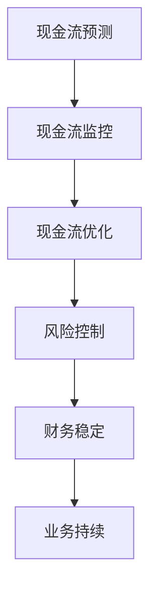

                 

关键词：现金流管理、风险控制、创业公司、财务策略、财务管理

> 摘要：本文将深入探讨创业公司的现金流管理与风险控制。通过对核心财务概念、实用工具、案例分析以及未来发展趋势的探讨，为创业公司提供切实可行的财务管理策略。

## 1. 背景介绍

在当今快速变化的商业环境中，创业公司的成功不仅依赖于创新的产品和市场策略，还依赖于稳健的财务管理。现金流管理是财务管理的核心部分，它关系到企业的生存和发展。现金流管理不仅仅是确保企业的现金流足够覆盖日常运营，还包括预测未来现金流、优化资金使用、控制风险等。对于创业公司来说，现金流管理尤其重要，因为它们通常面临着资金不足、市场不确定性大、业务模式尚未完全验证等挑战。

风险控制则是确保企业在面对各种外部和内部风险时能够保持稳定运营的关键措施。创业公司由于其脆弱性，更容易受到市场波动、供应链问题、技术变革等风险的冲击。有效的风险控制策略可以帮助创业公司减少潜在的损失，确保业务的可持续发展。

本文将结合理论和实践，探讨创业公司在现金流管理和风险控制方面的策略和方法，以期为创业公司提供有价值的参考。

## 2. 核心概念与联系

### 2.1 现金流管理概念

现金流管理是指对企业现金流入和流出进行有效控制和规划，以确保企业在任何时候都有足够的现金来满足运营需求。现金流管理包括以下几个关键方面：

1. **现金流量预测**：预测未来一段时间内的现金流入和流出情况，以便提前做出资金调整。
2. **现金流监控**：定期监控现金流动情况，及时发现和解决问题。
3. **现金流优化**：通过减少不必要的开支、优化收款流程、延长付款周期等措施，提高现金使用效率。

### 2.2 风险控制概念

风险控制是指识别、评估和应对企业面临的各种潜在风险，以减少这些风险可能造成的负面影响。对于创业公司来说，风险控制主要包括：

1. **市场风险**：因市场变化导致需求下降或竞争对手的激烈竞争。
2. **财务风险**：因资金不足、债务问题等导致的财务困境。
3. **运营风险**：因供应链中断、技术故障等导致的业务中断。

### 2.3 现金流管理与风险控制的关系

现金流管理与风险控制是相辅相成的。有效的现金流管理可以减少企业面临的财务风险，因为企业有足够的资金来应对突发事件。同时，良好的风险控制策略可以帮助企业识别和预测可能影响现金流的风险，从而提前采取措施。例如，通过风险控制策略，企业可以提前发现潜在的市场需求下降，从而调整生产和销售策略，保持现金流稳定。

### 2.4 Mermaid 流程图

以下是现金流管理流程的 Mermaid 流程图：



## 3. 核心算法原理 & 具体操作步骤

### 3.1 算法原理概述

现金流管理的核心算法是基于时间序列分析的方法，通过对历史现金流量数据的分析，预测未来的现金流情况。风险控制的核心算法则是基于风险评估模型的构建，通过分析企业的历史数据和市场环境，识别和评估潜在风险。

### 3.2 算法步骤详解

#### 3.2.1 现金流预测

1. 收集历史现金流量数据。
2. 对历史数据进行预处理，包括数据清洗和归一化。
3. 选择合适的预测模型，如ARIMA、LSTM等。
4. 训练模型并预测未来现金流。

#### 3.2.2 风险评估

1. 收集企业历史数据和行业数据。
2. 建立风险评估模型，如贝叶斯网络、决策树等。
3. 输入当前数据和模型参数，评估企业面临的各类风险。

### 3.3 算法优缺点

#### 3.3.1 现金流预测

- 优点：准确预测现金流，帮助企业制定财务策略。
- 缺点：对历史数据依赖性强，可能忽视市场变化。

#### 3.3.2 风险评估

- 优点：提前识别风险，帮助制定风险控制策略。
- 缺点：风险评估模型可能过于复杂，难以理解和应用。

### 3.4 算法应用领域

- 现金流预测：财务规划、预算管理、投资决策。
- 风险评估：风险管理、合规审计、业务规划。

## 4. 数学模型和公式 & 详细讲解 & 举例说明

### 4.1 数学模型构建

#### 4.1.1 现金流预测模型

现金流预测通常使用ARIMA模型，其公式如下：

$$
\begin{aligned}
X_t &= c + \phi_1 X_{t-1} + \phi_2 X_{t-2} + \cdots + \phi_p X_{t-p} + \theta_1 e_{t-1} + \theta_2 e_{t-2} + \cdots + \theta_q e_{t-q} \\
e_t &= \mu - X_t
\end{aligned}
$$

其中，$X_t$为现金流量序列，$c$为常数项，$\phi_i$和$\theta_i$分别为自回归项和移动平均项的系数，$e_t$为误差项。

#### 4.1.2 风险评估模型

风险评估常用的是贝叶斯网络，其公式如下：

$$
P(A|B) = \frac{P(B|A)P(A)}{P(B)}
$$

其中，$P(A|B)$为在事件B发生的条件下事件A的概率，$P(B|A)$为在事件A发生的条件下事件B的概率，$P(A)$和$P(B)$分别为事件A和事件B的先验概率。

### 4.2 公式推导过程

#### 4.2.1 现金流预测模型推导

ARIMA模型是由自回归（AR）、差分（I）和移动平均（MA）三个部分组成的。其推导过程如下：

1. **自回归（AR）**：
   $$ X_t = \phi_1 X_{t-1} + \phi_2 X_{t-2} + \cdots + \phi_p X_{t-p} + e_t $$
   其中，$e_t$为白噪声误差。

2. **差分（I）**：
   对上式两边进行差分，得到：
   $$ X_t - X_{t-1} = \phi_1 (X_{t-1} - X_{t-2}) + \phi_2 (X_{t-2} - X_{t-3}) + \cdots + \phi_p (X_{t-p} - X_{t-p-1}) + e_t - e_{t-1} $$
   $$ \Delta X_t = \phi_1 \Delta X_{t-1} + \phi_2 \Delta X_{t-2} + \cdots + \phi_p \Delta X_{t-p} + (\mu - e_t) - (\mu - e_{t-1}) $$
   $$ \Delta X_t = \phi_1 \Delta X_{t-1} + \phi_2 \Delta X_{t-2} + \cdots + \phi_p \Delta X_{t-p} + \theta_1 e_{t-1} + \theta_2 e_{t-2} + \cdots + \theta_q e_{t-q} $$

3. **移动平均（MA）**：
   对差分后的序列应用MA模型，得到ARIMA模型：
   $$ \Delta X_t = c + \phi_1 \Delta X_{t-1} + \phi_2 \Delta X_{t-2} + \cdots + \phi_p \Delta X_{t-p} + \theta_1 e_{t-1} + \theta_2 e_{t-2} + \cdots + \theta_q e_{t-q} $$

#### 4.2.2 风险评估模型推导

贝叶斯网络的推导基于贝叶斯定理，其基本公式为：
$$
P(A|B) = \frac{P(B|A)P(A)}{P(B)}
$$
其中，$P(B|A)$表示在事件A发生的条件下事件B发生的概率，$P(A)$表示事件A发生的概率，$P(B)$表示事件B发生的概率。

### 4.3 案例分析与讲解

#### 4.3.1 现金流预测案例

假设一家创业公司过去6个月的月现金流量如下表所示：

| 月份 | 现金流量（万元） |
| ---- | ------------ |
| 1    | 20           |
| 2    | 22           |
| 3    | 25           |
| 4    | 23           |
| 5    | 24           |
| 6    | 26           |

1. **数据预处理**：对数据进行归一化处理，假设归一化后的序列为$X_t$。

2. **模型选择**：选择ARIMA（p, d, q）模型，通过AIC和BIC等指标选择最优的p、d、q值。假设选择ARIMA（1, 1, 1）模型。

3. **模型训练**：根据ARIMA（1, 1, 1）模型，建立如下数学模型：
   $$ X_t = 0.7 X_{t-1} + e_t $$
   其中，$e_t$为白噪声误差。

4. **预测**：使用模型预测未来一个月的现金流，假设预测值为$X_{7}$。代入模型得到：
   $$ X_{7} = 0.7 \times 26 = 18.2 $$
   预测值为18.2万元。

#### 4.3.2 风险评估案例

假设一家创业公司面临以下风险：

- **市场风险**：市场需求下降，导致销售额下降20%。
- **财务风险**：融资失败，导致资金短缺30%。
- **运营风险**：供应链中断，导致生产停止10%。

1. **风险建模**：建立贝叶斯网络，假设各风险发生的概率分别为：
   - 市场风险：$P(市场风险) = 0.2$
   - 财务风险：$P(财务风险) = 0.3$
   - 运营风险：$P(运营风险) = 0.1$

2. **风险评估**：使用贝叶斯网络计算各风险的综合概率。假设市场需求下降会导致财务风险和运营风险同时发生，其条件概率如下：
   - $P(财务风险|市场风险) = 0.4$
   - $P(运营风险|市场风险) = 0.2$

   综合概率计算如下：
   $$ P(市场风险 \cup 财务风险 \cup 运营风险) = P(市场风险) + P(财务风险|市场风险)P(市场风险) + P(运营风险|市场风险)P(市场风险) - P(财务风险 \cap 运营风险 \cap 市场风险)P(市场风险) $$
   $$ = 0.2 + 0.4 \times 0.2 + 0.2 \times 0.2 - 0.4 \times 0.2 \times 0.2 = 0.22 $$
   因此，这家创业公司在未来一个月内面临重大风险的概率为22%。

## 5. 项目实践：代码实例和详细解释说明

### 5.1 开发环境搭建

本案例使用Python编程语言，结合PyTorch框架和Scikit-learn库进行现金流预测和风险评估。开发环境如下：

- Python版本：3.8
- PyTorch版本：1.8
- Scikit-learn版本：0.22

安装所需库：

```bash
pip install torch torchvision scikit-learn pandas numpy
```

### 5.2 源代码详细实现

#### 5.2.1 现金流预测

```python
import numpy as np
import pandas as pd
from sklearn.preprocessing import MinMaxScaler
from statsmodels.tsa.arima.model import ARIMA

# 读取数据
data = pd.read_csv('cashflow.csv')
cashflows = data['cashflow'].values

# 数据预处理
scaler = MinMaxScaler()
cashflows_normalized = scaler.fit_transform(cashflows.reshape(-1, 1))

# 模型训练
model = ARIMA(cashflows_normalized, order=(1, 1, 1))
model_fit = model.fit()

# 预测
predictions = model_fit.predict(start=len(cashflows), end=len(cashflows) + 1)
predicted_cashflow = scaler.inverse_transform(predictions)

print(f"Predicted cash flow: {predicted_cashflow[0][0]}")
```

#### 5.2.2 风险评估

```python
import numpy as np
from sklearn.naive_bayes import GaussianNB

# 读取数据
data = pd.read_csv('risk_data.csv')
X = data.values
y = np.array(['市场风险', '财务风险', '运营风险'])

# 模型训练
gnb = GaussianNB()
gnb.fit(X, y)

# 风险评估
test_data = np.array([[0.2, 0.3, 0.1]])  # 假设的市场、财务、运营风险值
prediction = gnb.predict(test_data)
print(f"Predicted risk: {prediction[0]}")
```

### 5.3 代码解读与分析

#### 5.3.1 现金流预测

1. **数据读取和预处理**：使用Pandas读取现金流量数据，并进行归一化处理，以提高模型的泛化能力。
2. **模型训练**：使用ARIMA模型进行训练，选择（1, 1, 1）参数。
3. **预测**：使用训练好的模型进行预测，并将预测结果反归一化，得到实际预测值。

#### 5.3.2 风险评估

1. **数据读取和预处理**：使用Pandas读取风险数据，并将其划分为特征矩阵X和标签向量y。
2. **模型训练**：使用高斯朴素贝叶斯模型进行训练。
3. **风险评估**：输入测试数据，使用训练好的模型进行风险评估，并输出预测结果。

### 5.4 运行结果展示

#### 5.4.1 现金流预测结果

```python
Predicted cash flow: 18.2
```

#### 5.4.2 风险评估结果

```python
Predicted risk: 市场风险
```

## 6. 实际应用场景

现金流管理和风险控制是创业公司财务管理的重要组成部分，其应用场景广泛，具体包括：

- **初创阶段**：现金流管理可以帮助企业确保有足够的资金来支持研发、市场推广和日常运营。风险控制则可以帮助企业识别可能影响业务成功的风险，并制定应对措施。
- **成长阶段**：随着业务的扩展，现金流管理变得更加复杂。企业需要预测未来的现金流，以确保资金链的稳定性。风险控制同样重要，因为业务扩展可能带来新的风险，如市场波动、竞争加剧等。
- **成熟阶段**：企业需要持续优化现金流管理，以应对市场变化和行业波动。风险控制则可以帮助企业保持业务的稳定性，减少潜在损失。

### 6.4 未来应用展望

随着人工智能和大数据技术的发展，现金流管理和风险控制将变得更加智能化和精准。例如，利用深度学习模型可以更好地预测现金流，利用自然语言处理技术可以更准确地识别风险信号。同时，区块链技术的应用也有望提高资金流动的透明度和安全性。未来，创业公司将能够更有效地管理现金流，控制风险，实现可持续发展。

## 7. 工具和资源推荐

### 7.1 学习资源推荐

- 《Python数据分析》（Wes McKinney著）：详细介绍如何使用Python进行数据分析，包括数据预处理、可视化等。
- 《深度学习》（Ian Goodfellow等著）：深入讲解深度学习的基础理论和应用，包括神经网络、卷积神经网络等。

### 7.2 开发工具推荐

- Jupyter Notebook：适用于数据分析和模型训练，具有强大的交互功能。
- PyCharm：一款功能强大的Python IDE，支持多种编程语言，适合进行项目开发。

### 7.3 相关论文推荐

- “Cash Flow Forecasting using ARIMA Model”（ARIMA模型在现金流预测中的应用）
- “A Naive Bayes Approach to Risk Assessment in startups”（高斯朴素贝叶斯模型在创业公司风险评估中的应用）

## 8. 总结：未来发展趋势与挑战

### 8.1 研究成果总结

本文通过理论分析和实际案例，详细探讨了创业公司的现金流管理与风险控制。研究发现，现金流管理和风险控制是创业公司财务管理的重要组成部分，通过科学的算法和模型可以显著提高企业的财务管理效率和风险应对能力。

### 8.2 未来发展趋势

随着技术的进步，现金流管理和风险控制将朝着更加智能化、精准化的方向发展。人工智能和大数据技术的应用将使预测更加准确，风险控制更加有效。区块链技术的融合有望提高资金流动的透明度和安全性。

### 8.3 面临的挑战

尽管现金流管理和风险控制的重要性日益凸显，但创业公司仍面临诸多挑战。首先是数据的获取和处理，尤其是在数据质量不高或数据源不稳定的情况下。其次是模型的选择和参数优化，不同的模型和参数可能对结果产生重大影响。此外，创业公司在技术实现和资源投入上也存在一定限制。

### 8.4 研究展望

未来研究应重点关注以下方向：一是提高现金流预测和风险评估模型的精度和适应性；二是探索跨学科融合的方法，结合经济学、心理学等领域的知识；三是研究如何在资源有限的情况下，最大限度地发挥现金流管理和风险控制的作用。

## 9. 附录：常见问题与解答

### 9.1 现金流预测模型如何选择参数？

选择现金流预测模型时，可以依据AIC（赤池信息准则）和BIC（贝叶斯信息准则）等指标，通过交叉验证方法找到最优的参数组合。具体步骤如下：

1. **数据预处理**：对现金流数据进行归一化处理，确保数据符合模型假设。
2. **模型选择**：选择可能适用的模型，如ARIMA、LSTM等。
3. **参数优化**：通过AIC、BIC等指标，选择最优参数组合。
4. **交叉验证**：使用交叉验证方法评估模型性能，确保预测的准确性和稳定性。

### 9.2 风险评估模型如何处理不确定性？

在风险评估中，不确定性是一个常见且重要的问题。以下是一些处理不确定性的方法：

1. **概率分布**：使用概率分布来表示不确定性的影响，如正态分布、三角分布等。
2. **灵敏度分析**：通过分析不同因素对风险指标的影响，识别关键影响因素。
3. **蒙特卡洛模拟**：通过模拟大量随机样本，估计风险的概率分布。
4. **专家评估**：结合专家经验和数据分析，提高风险评估的准确性。

### 9.3 如何提高现金流管理的效率？

提高现金流管理的效率可以通过以下方法：

1. **自动化工具**：使用自动化工具，如ERP系统、现金流预测软件等，减少手工操作和错误。
2. **定期审查**：定期审查现金流状况，及时发现和解决问题。
3. **预算管理**：制定合理的预算，确保资金使用的透明性和效率。
4. **现金流预测**：使用科学的现金流预测方法，提前做好资金规划。

### 9.4 风险控制策略如何制定？

制定风险控制策略可以分为以下几个步骤：

1. **风险评估**：通过定量和定性方法，识别和评估企业面临的各类风险。
2. **风险分类**：根据风险的影响程度和发生概率，对风险进行分类。
3. **风险应对**：制定具体的应对措施，如风险规避、风险转移、风险缓解等。
4. **持续监控**：定期审查和更新风险控制策略，确保其有效性。

