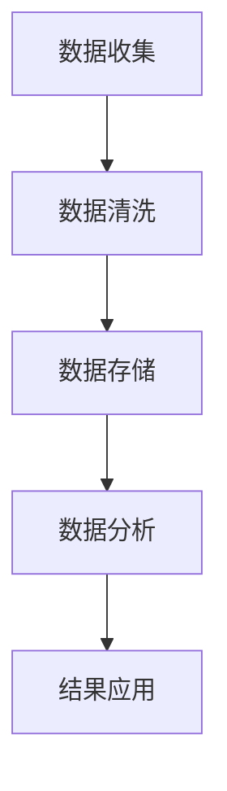

                 

关键词：用户数据挖掘、价值创造、创业公司、数据分析、人工智能、商业策略

摘要：本文旨在探讨创业公司如何通过用户数据挖掘，实现价值创造。我们将分析用户数据的收集、处理、分析以及应用策略，提出一系列具体方法和实践案例，旨在帮助创业公司提升用户数据利用效率，实现可持续增长。

## 1. 背景介绍

在当今数字化时代，数据已成为企业最重要的资产之一。对于创业公司而言，有效地利用用户数据不仅能帮助企业更好地了解市场需求，还能为产品优化、业务决策和用户满意度提升提供有力支持。然而，如何从海量数据中提取有价值的信息，并将其转化为实际商业价值，成为许多创业公司面临的重要课题。

本文将从以下几个方面展开讨论：首先，介绍用户数据挖掘的基本概念和重要性；其次，探讨用户数据挖掘的核心算法原理；然后，详细讲解用户数据挖掘的具体操作步骤；接下来，分析数学模型和公式在用户数据挖掘中的应用；最后，通过项目实践和实际应用场景，阐述用户数据挖掘在创业公司中的价值创造策略。

## 2. 核心概念与联系

### 2.1 用户数据挖掘的基本概念

用户数据挖掘是指利用各种数据挖掘技术和方法，从用户数据中提取有价值的信息和知识，以支持商业决策和业务优化。用户数据包括用户的个人资料、行为数据、交易数据等，这些数据可以从网站、移动应用、社交媒体等多个渠道收集。

### 2.2 用户数据挖掘的重要性

用户数据挖掘对创业公司的重要性体现在以下几个方面：

- **了解用户需求**：通过分析用户数据，创业公司可以深入了解用户需求，从而为产品优化和功能迭代提供有力支持。
- **提升用户体验**：基于用户数据的个性化推荐和定制化服务，有助于提升用户满意度和忠诚度。
- **优化业务决策**：用户数据挖掘可以为创业公司提供准确的业务分析，帮助制定更有效的市场策略和业务决策。
- **创造商业价值**：通过数据挖掘，创业公司可以发现新的商业机会，实现业务增长和盈利。

### 2.3 用户数据挖掘的架构

用户数据挖掘通常包括以下几个关键环节：

1. 数据收集：从各种渠道收集用户数据，包括网站日志、社交媒体数据、问卷调查等。
2. 数据清洗：对收集到的数据进行预处理，包括去重、填充缺失值、异常值处理等。
3. 数据存储：将清洗后的数据存储到数据库或数据仓库中，便于后续分析和挖掘。
4. 数据分析：利用数据挖掘算法，对用户数据进行分析，提取有价值的信息和知识。
5. 结果应用：将挖掘结果应用于实际业务场景，如用户画像、个性化推荐、市场预测等。

### 2.4 Mermaid 流程图

以下是一个用户数据挖掘的基本流程图，使用Mermaid语法绘制：



## 3. 核心算法原理 & 具体操作步骤

### 3.1 算法原理概述

用户数据挖掘的核心算法主要包括以下几种：

1. **关联规则挖掘**：用于发现数据之间的关联关系，如购物篮分析。
2. **分类算法**：用于对用户进行分类，如用户群体划分。
3. **聚类算法**：用于将用户数据分为多个簇，如用户行为聚类。
4. **协同过滤**：用于基于用户行为进行推荐，如电影推荐。

### 3.2 算法步骤详解

#### 3.2.1 关联规则挖掘

关联规则挖掘的基本步骤如下：

1. **选择支持度阈值**：根据业务需求，设定一个支持度阈值，用于筛选频繁项集。
2. **生成频繁项集**：利用频繁模式挖掘算法（如Apriori算法），从原始数据中提取频繁项集。
3. **生成关联规则**：对频繁项集进行组合，生成关联规则。
4. **评估关联规则**：根据置信度等指标，评估关联规则的有效性。

#### 3.2.2 分类算法

分类算法的基本步骤如下：

1. **数据准备**：收集用户数据，并进行预处理。
2. **选择分类算法**：根据数据特点和业务需求，选择合适的分类算法（如决策树、随机森林等）。
3. **训练模型**：使用训练数据集，训练分类模型。
4. **模型评估**：使用测试数据集，评估分类模型的准确性。
5. **应用模型**：将分类模型应用于实际业务场景，进行用户分类。

#### 3.2.3 聚类算法

聚类算法的基本步骤如下：

1. **数据准备**：收集用户数据，并进行预处理。
2. **选择聚类算法**：根据数据特点和业务需求，选择合适的聚类算法（如K-Means、DBSCAN等）。
3. **初始化聚类中心**：根据算法特点，初始化聚类中心。
4. **迭代聚类过程**：根据距离度量，将用户数据分配到不同的聚类中心。
5. **评估聚类结果**：根据聚类指标（如轮廓系数、 Davies-Bouldin指数等），评估聚类结果。

#### 3.2.4 协同过滤

协同过滤的基本步骤如下：

1. **数据准备**：收集用户行为数据，并进行预处理。
2. **构建用户-项目矩阵**：将用户行为数据转换为用户-项目矩阵。
3. **选择协同过滤算法**：根据数据特点和业务需求，选择合适的协同过滤算法（如基于记忆的协同过滤、矩阵分解等）。
4. **训练模型**：利用用户-项目矩阵，训练协同过滤模型。
5. **预测推荐结果**：根据用户行为和模型预测，生成推荐结果。

### 3.3 算法优缺点

#### 3.3.1 关联规则挖掘

**优点**：

- **简单直观**：关联规则挖掘算法简单，易于理解和实现。
- **适用范围广**：适用于各种类型的用户数据。

**缺点**：

- **计算复杂度较高**：特别是在处理大量数据时，计算复杂度较高。
- **结果解释性较弱**：关联规则挖掘结果可能难以直接解释业务含义。

#### 3.3.2 分类算法

**优点**：

- **准确性较高**：分类算法具有较高的准确性，适用于需要精确分类的业务场景。
- **结果解释性较强**：分类结果可以直接解释业务含义。

**缺点**：

- **训练时间较长**：特别是对于大型数据集，分类算法的训练时间可能较长。
- **对噪声敏感**：分类算法对噪声敏感，可能导致结果偏差。

#### 3.3.3 聚类算法

**优点**：

- **无需事先定义分类标签**：聚类算法无需事先定义分类标签，适用于无监督学习场景。
- **灵活性较高**：聚类算法具有较强的灵活性，适用于各种类型的用户数据。

**缺点**：

- **结果解释性较弱**：聚类结果可能难以直接解释业务含义。
- **聚类质量难以评估**：聚类算法的质量难以直接评估，需要结合业务需求和实际效果进行判断。

#### 3.3.4 协同过滤

**优点**：

- **推荐准确性较高**：协同过滤算法具有较高的推荐准确性，适用于需要精确推荐的业务场景。
- **计算效率较高**：协同过滤算法的计算效率较高，适用于处理大规模用户数据。

**缺点**：

- **用户隐私问题**：协同过滤算法可能涉及用户隐私数据，需要特别注意隐私保护。
- **模型更新成本较高**：协同过滤模型需要定期更新，否则可能导致推荐结果不准确。

### 3.4 算法应用领域

用户数据挖掘算法在多个领域具有广泛应用：

- **电子商务**：用于购物篮分析、个性化推荐、商品推荐等。
- **金融行业**：用于用户风险评估、欺诈检测、信用评分等。
- **医疗健康**：用于疾病预测、患者分类、医疗资源优化等。
- **社交媒体**：用于用户行为分析、社交网络分析、推荐系统等。

## 4. 数学模型和公式 & 详细讲解 & 举例说明

### 4.1 数学模型构建

用户数据挖掘中的数学模型主要包括以下几种：

- **贝叶斯模型**：用于分类和预测，如朴素贝叶斯分类器。
- **线性回归模型**：用于预测用户行为和偏好，如用户满意度预测。
- **支持向量机（SVM）**：用于分类和回归，如用户群体划分。
- **主成分分析（PCA）**：用于降维和特征提取，如用户行为降维。

### 4.2 公式推导过程

#### 4.2.1 贝叶斯模型

贝叶斯模型的核心公式如下：

$$
P(C=k|X=x) = \frac{P(X=x|C=k)P(C=k)}{P(X=x)}
$$

其中，$C$ 表示类别标签，$X$ 表示特征向量，$P(C=k|X=x)$ 表示在给定特征向量 $X$ 的情况下，类别标签为 $k$ 的概率。

#### 4.2.2 线性回归模型

线性回归模型的核心公式如下：

$$
Y = \beta_0 + \beta_1X_1 + \beta_2X_2 + ... + \beta_nX_n + \epsilon
$$

其中，$Y$ 表示因变量，$X_1, X_2, ..., X_n$ 表示自变量，$\beta_0, \beta_1, \beta_2, ..., \beta_n$ 表示回归系数，$\epsilon$ 表示误差项。

#### 4.2.3 支持向量机（SVM）

支持向量机（SVM）的核心公式如下：

$$
\min_{\beta, \beta_0} \frac{1}{2} ||\beta||^2 + C \sum_{i=1}^{n} \max(0, 1 - y_i(\beta^T x_i + \beta_0))
$$

其中，$\beta$ 表示回归系数向量，$\beta_0$ 表示偏置项，$C$ 表示惩罚参数，$y_i$ 表示第 $i$ 个样本的标签，$x_i$ 表示第 $i$ 个样本的特征向量。

#### 4.2.4 主成分分析（PCA）

主成分分析（PCA）的核心公式如下：

$$
\min_{\beta} \sum_{i=1}^{n} ||\beta^T x_i - \mu||^2
$$

其中，$\beta$ 表示特征向量，$\mu$ 表示样本均值。

### 4.3 案例分析与讲解

#### 4.3.1 贝叶斯模型在用户分类中的应用

假设我们有一组用户数据，包括用户年龄、收入、职业等特征。我们希望利用贝叶斯模型对用户进行分类，判断用户是否为高价值客户。

1. **数据准备**：收集用户数据，并进行预处理，如数据清洗、归一化等。
2. **构建概率模型**：根据用户特征，构建概率模型，如朴素贝叶斯分类器。
3. **训练模型**：使用训练数据集，训练贝叶斯模型。
4. **模型评估**：使用测试数据集，评估贝叶斯模型的分类准确性。

#### 4.3.2 线性回归模型在用户满意度预测中的应用

假设我们希望利用线性回归模型，预测用户的满意度。用户满意度数据包括用户年龄、收入、产品满意度等特征。

1. **数据准备**：收集用户满意度数据，并进行预处理，如数据清洗、归一化等。
2. **构建回归模型**：根据用户特征，构建线性回归模型。
3. **训练模型**：使用训练数据集，训练线性回归模型。
4. **模型评估**：使用测试数据集，评估线性回归模型的预测准确性。

#### 4.3.3 支持向量机（SVM）在用户群体划分中的应用

假设我们有一组用户数据，包括用户年龄、收入、消费水平等特征。我们希望利用支持向量机（SVM），将用户划分为高价值客户和一般客户。

1. **数据准备**：收集用户数据，并进行预处理，如数据清洗、归一化等。
2. **构建SVM模型**：根据用户特征，构建支持向量机（SVM）模型。
3. **训练模型**：使用训练数据集，训练SVM模型。
4. **模型评估**：使用测试数据集，评估SVM模型的分类准确性。

#### 4.3.4 主成分分析（PCA）在用户行为降维中的应用

假设我们有一组用户行为数据，包括用户浏览时间、点击次数、购买次数等特征。我们希望利用主成分分析（PCA），对用户行为数据进行降维处理。

1. **数据准备**：收集用户行为数据，并进行预处理，如数据清洗、归一化等。
2. **构建PCA模型**：根据用户行为数据，构建主成分分析（PCA）模型。
3. **训练模型**：使用训练数据集，训练PCA模型。
4. **模型评估**：使用测试数据集，评估PCA模型的降维效果。

## 5. 项目实践：代码实例和详细解释说明

### 5.1 开发环境搭建

1. **安装Python环境**：在本地计算机上安装Python环境，版本建议为3.8以上。
2. **安装相关库**：安装用于用户数据挖掘的相关库，如Pandas、NumPy、Scikit-learn、Matplotlib等。

```shell
pip install pandas numpy scikit-learn matplotlib
```

### 5.2 源代码详细实现

以下是一个简单的用户数据挖掘示例，包括数据收集、数据预处理、数据分析和结果展示：

```python
import pandas as pd
from sklearn.model_selection import train_test_split
from sklearn.preprocessing import StandardScaler
from sklearn.ensemble import RandomForestClassifier
from sklearn.metrics import accuracy_score

# 5.2.1 数据收集
data = pd.read_csv('user_data.csv')

# 5.2.2 数据预处理
# 数据清洗和填充缺失值
data.fillna(data.mean(), inplace=True)

# 选择特征和标签
X = data[['age', 'income', 'consumption']]
y = data['label']

# 数据标准化
scaler = StandardScaler()
X_scaled = scaler.fit_transform(X)

# 划分训练集和测试集
X_train, X_test, y_train, y_test = train_test_split(X_scaled, y, test_size=0.2, random_state=42)

# 5.2.3 数据分析
# 使用随机森林分类器进行训练
clf = RandomForestClassifier(n_estimators=100, random_state=42)
clf.fit(X_train, y_train)

# 5.2.4 结果展示
# 预测测试集
y_pred = clf.predict(X_test)

# 计算准确率
accuracy = accuracy_score(y_test, y_pred)
print(f'Accuracy: {accuracy:.2f}')
```

### 5.3 代码解读与分析

1. **数据收集**：使用Pandas库读取用户数据，数据源可以是CSV文件、数据库等。
2. **数据预处理**：对数据进行清洗和填充缺失值，选择特征和标签，并使用StandardScaler进行数据标准化。
3. **数据分析**：使用Scikit-learn库中的RandomForestClassifier进行分类训练，并计算准确率。
4. **结果展示**：输出分类准确率，以评估模型性能。

## 6. 实际应用场景

用户数据挖掘在创业公司中具有广泛的应用场景：

- **用户行为分析**：通过分析用户行为数据，了解用户喜好和需求，为产品优化和功能迭代提供有力支持。
- **个性化推荐**：基于用户行为和兴趣，实现个性化推荐，提高用户满意度和留存率。
- **用户画像**：构建用户画像，为营销活动和产品推广提供精准定位。
- **风险评估**：利用用户数据，进行风险评估和欺诈检测，降低业务风险。
- **市场预测**：通过分析用户数据，预测市场趋势和需求变化，为业务决策提供依据。

### 6.4 未来应用展望

随着人工智能和大数据技术的发展，用户数据挖掘在未来将得到更广泛的应用：

- **深度学习**：利用深度学习技术，实现更复杂的用户行为预测和推荐系统。
- **联邦学习**：通过联邦学习技术，实现多方数据的安全联合分析。
- **实时分析**：利用实时分析技术，实现用户数据的实时挖掘和分析，为业务决策提供实时支持。
- **隐私保护**：随着隐私保护意识的提高，用户数据挖掘将更加注重隐私保护，发展出更为安全和合规的技术。

## 7. 工具和资源推荐

### 7.1 学习资源推荐

- **《Python数据挖掘实战》**：全面介绍了Python在数据挖掘领域的应用，适合初学者入门。
- **《数据挖掘：实用工具与技术》**：详细介绍了数据挖掘的各种技术和工具，适合有一定基础的学习者。
- **《数据科学实战》**：涵盖了数据科学领域的各个方面，包括数据收集、预处理、分析等。

### 7.2 开发工具推荐

- **Jupyter Notebook**：一款强大的交互式开发环境，适用于数据分析和挖掘。
- **PyCharm**：一款功能丰富的Python集成开发环境，适用于编写和调试代码。
- **Scikit-learn**：一款开源的Python机器学习库，提供多种数据挖掘算法和工具。

### 7.3 相关论文推荐

- **“User Behavior Prediction in Mobile Applications”**：探讨移动应用中用户行为的预测方法。
- **“A Survey on Recommender Systems”**：全面综述了推荐系统的研究进展和应用。
- **“Deep Learning for Personalized Recommendation”**：探讨深度学习在个性化推荐中的应用。

## 8. 总结：未来发展趋势与挑战

### 8.1 研究成果总结

用户数据挖掘技术已在多个领域取得显著成果，如电子商务、金融、医疗等。通过用户数据挖掘，创业公司可以更好地了解用户需求，优化产品和服务，提升用户体验和满意度。

### 8.2 未来发展趋势

未来，用户数据挖掘技术将朝着以下方向发展：

- **深度学习**：利用深度学习技术，实现更复杂的用户行为预测和推荐系统。
- **实时分析**：利用实时分析技术，实现用户数据的实时挖掘和分析，为业务决策提供实时支持。
- **联邦学习**：通过联邦学习技术，实现多方数据的安全联合分析。

### 8.3 面临的挑战

用户数据挖掘在发展过程中也面临以下挑战：

- **隐私保护**：随着隐私保护意识的提高，用户数据挖掘将更加注重隐私保护，发展出更为安全和合规的技术。
- **数据质量**：高质量的用户数据是用户数据挖掘的基础，创业公司需要不断提升数据质量。
- **计算资源**：随着数据量的增长，用户数据挖掘对计算资源的需求也在不断提高。

### 8.4 研究展望

未来，用户数据挖掘技术将在以下几个方面取得突破：

- **个性化推荐**：通过深度学习和联邦学习等技术，实现更精准的个性化推荐。
- **实时分析**：利用实时分析技术，实现用户数据的实时挖掘和分析，为业务决策提供实时支持。
- **隐私保护**：发展出更为安全和合规的隐私保护技术，确保用户数据的安全。

## 9. 附录：常见问题与解答

### 9.1 用户数据挖掘的基本步骤是什么？

用户数据挖掘的基本步骤包括数据收集、数据清洗、数据存储、数据分析和结果应用。

### 9.2 常用的用户数据挖掘算法有哪些？

常用的用户数据挖掘算法包括关联规则挖掘、分类算法、聚类算法和协同过滤。

### 9.3 用户数据挖掘在哪些领域有应用？

用户数据挖掘在电子商务、金融、医疗、社交媒体等领域有广泛应用。

### 9.4 如何确保用户数据挖掘的隐私保护？

确保用户数据挖掘的隐私保护可以通过数据脱敏、联邦学习、差分隐私等技术实现。

### 9.5 用户数据挖掘的未来发展趋势是什么？

用户数据挖掘的未来发展趋势包括深度学习、实时分析、联邦学习和隐私保护等。

作者：禅与计算机程序设计艺术 / Zen and the Art of Computer Programming
----------------------------------------------------------------

本文旨在探讨创业公司如何通过用户数据挖掘，实现价值创造。我们将分析用户数据的收集、处理、分析以及应用策略，提出一系列具体方法和实践案例，旨在帮助创业公司提升用户数据利用效率，实现可持续增长。

### 1. 背景介绍

在当今数字化时代，数据已成为企业最重要的资产之一。对于创业公司而言，有效地利用用户数据不仅能帮助企业更好地了解市场需求，还能为产品优化、业务决策和用户满意度提升提供有力支持。然而，如何从海量数据中提取有价值的信息，并将其转化为实际商业价值，成为许多创业公司面临的重要课题。

用户数据挖掘是指利用各种数据挖掘技术和方法，从用户数据中提取有价值的信息和知识，以支持商业决策和业务优化。用户数据包括用户的个人资料、行为数据、交易数据等，这些数据可以从网站、移动应用、社交媒体等多个渠道收集。

用户数据挖掘的重要性体现在以下几个方面：

- **了解用户需求**：通过分析用户数据，创业公司可以深入了解用户需求，从而为产品优化和功能迭代提供有力支持。
- **提升用户体验**：基于用户数据的个性化推荐和定制化服务，有助于提升用户满意度和忠诚度。
- **优化业务决策**：用户数据挖掘可以为创业公司提供准确的业务分析，帮助制定更有效的市场策略和业务决策。
- **创造商业价值**：通过数据挖掘，创业公司可以发现新的商业机会，实现业务增长和盈利。

用户数据挖掘通常包括以下几个关键环节：

1. **数据收集**：从各种渠道收集用户数据，包括网站日志、社交媒体数据、问卷调查等。
2. **数据清洗**：对收集到的数据进行预处理，包括去重、填充缺失值、异常值处理等。
3. **数据存储**：将清洗后的数据存储到数据库或数据仓库中，便于后续分析和挖掘。
4. **数据分析**：利用数据挖掘算法，对用户数据进行分析，提取有价值的信息和知识。
5. **结果应用**：将挖掘结果应用于实际业务场景，如用户画像、个性化推荐、市场预测等。

以下是一个用户数据挖掘的基本流程图：


### 2. 核心概念与联系

#### 2.1 用户数据挖掘的基本概念

用户数据挖掘是指利用各种数据挖掘技术和方法，从用户数据中提取有价值的信息和知识，以支持商业决策和业务优化。用户数据包括用户的个人资料、行为数据、交易数据等，这些数据可以从网站、移动应用、社交媒体等多个渠道收集。

#### 2.2 用户数据挖掘的重要性

用户数据挖掘对创业公司的重要性体现在以下几个方面：

- **了解用户需求**：通过分析用户数据，创业公司可以深入了解用户需求，从而为产品优化和功能迭代提供有力支持。
- **提升用户体验**：基于用户数据的个性化推荐和定制化服务，有助于提升用户满意度和忠诚度。
- **优化业务决策**：用户数据挖掘可以为创业公司提供准确的业务分析，帮助制定更有效的市场策略和业务决策。
- **创造商业价值**：通过数据挖掘，创业公司可以发现新的商业机会，实现业务增长和盈利。

#### 2.3 用户数据挖掘的架构

用户数据挖掘通常包括以下几个关键环节：

1. **数据收集**：从各种渠道收集用户数据，包括网站日志、社交媒体数据、问卷调查等。
2. **数据清洗**：对收集到的数据进行预处理，包括去重、填充缺失值、异常值处理等。
3. **数据存储**：将清洗后的数据存储到数据库或数据仓库中，便于后续分析和挖掘。
4. **数据分析**：利用数据挖掘算法，对用户数据进行分析，提取有价值的信息和知识。
5. **结果应用**：将挖掘结果应用于实际业务场景，如用户画像、个性化推荐、市场预测等。

以下是一个用户数据挖掘的基本流程图，使用Mermaid语法绘制：


### 3. 核心算法原理 & 具体操作步骤

用户数据挖掘的核心算法主要包括以下几种：

- **关联规则挖掘**：用于发现数据之间的关联关系，如购物篮分析。
- **分类算法**：用于对用户进行分类，如用户群体划分。
- **聚类算法**：用于将用户数据分为多个簇，如用户行为聚类。
- **协同过滤**：用于基于用户行为进行推荐，如电影推荐。

#### 3.1 算法原理概述

1. **关联规则挖掘**：基于频繁模式挖掘算法，如Apriori算法，发现数据之间的关联关系。
2. **分类算法**：基于机器学习算法，如决策树、随机森林，对用户进行分类。
3. **聚类算法**：基于聚类算法，如K-Means、DBSCAN，将用户数据分为多个簇。
4. **协同过滤**：基于用户行为相似性，如基于记忆的协同过滤、矩阵分解，进行推荐。

#### 3.2 算法步骤详解

##### 3.2.1 关联规则挖掘

关联规则挖掘的基本步骤如下：

1. **选择支持度阈值**：根据业务需求，设定一个支持度阈值，用于筛选频繁项集。
2. **生成频繁项集**：利用频繁模式挖掘算法（如Apriori算法），从原始数据中提取频繁项集。
3. **生成关联规则**：对频繁项集进行组合，生成关联规则。
4. **评估关联规则**：根据置信度等指标，评估关联规则的有效性。

##### 3.2.2 分类算法

分类算法的基本步骤如下：

1. **数据准备**：收集用户数据，并进行预处理。
2. **选择分类算法**：根据数据特点和业务需求，选择合适的分类算法（如决策树、随机森林等）。
3. **训练模型**：使用训练数据集，训练分类模型。
4. **模型评估**：使用测试数据集，评估分类模型的准确性。
5. **应用模型**：将分类模型应用于实际业务场景，进行用户分类。

##### 3.2.3 聚类算法

聚类算法的基本步骤如下：

1. **数据准备**：收集用户数据，并进行预处理。
2. **选择聚类算法**：根据数据特点和业务需求，选择合适的聚类算法（如K-Means、DBSCAN等）。
3. **初始化聚类中心**：根据算法特点，初始化聚类中心。
4. **迭代聚类过程**：根据距离度量，将用户数据分配到不同的聚类中心。
5. **评估聚类结果**：根据聚类指标（如轮廓系数、 Davies-Bouldin指数等），评估聚类结果。

##### 3.2.4 协同过滤

协同过滤的基本步骤如下：

1. **数据准备**：收集用户行为数据，并进行预处理。
2. **构建用户-项目矩阵**：将用户行为数据转换为用户-项目矩阵。
3. **选择协同过滤算法**：根据数据特点和业务需求，选择合适的协同过滤算法（如基于记忆的协同过滤、矩阵分解等）。
4. **训练模型**：利用用户-项目矩阵，训练协同过滤模型。
5. **预测推荐结果**：根据用户行为和模型预测，生成推荐结果。

#### 3.3 算法优缺点

##### 3.3.1 关联规则挖掘

**优点**：

- **简单直观**：关联规则挖掘算法简单，易于理解和实现。
- **适用范围广**：适用于各种类型的用户数据。

**缺点**：

- **计算复杂度较高**：特别是在处理大量数据时，计算复杂度较高。
- **结果解释性较弱**：关联规则挖掘结果可能难以直接解释业务含义。

##### 3.3.2 分类算法

**优点**：

- **准确性较高**：分类算法具有较高的准确性，适用于需要精确分类的业务场景。
- **结果解释性较强**：分类结果可以直接解释业务含义。

**缺点**：

- **训练时间较长**：特别是对于大型数据集，分类算法的训练时间可能较长。
- **对噪声敏感**：分类算法对噪声敏感，可能导致结果偏差。

##### 3.3.3 聚类算法

**优点**：

- **无需事先定义分类标签**：聚类算法无需事先定义分类标签，适用于无监督学习场景。
- **灵活性较高**：聚类算法具有较强的灵活性，适用于各种类型的用户数据。

**缺点**：

- **结果解释性较弱**：聚类结果可能难以直接解释业务含义。
- **聚类质量难以评估**：聚类算法的质量难以直接评估，需要结合业务需求和实际效果进行判断。

##### 3.3.4 协同过滤

**优点**：

- **推荐准确性较高**：协同过滤算法具有较高的推荐准确性，适用于需要精确推荐的业务场景。
- **计算效率较高**：协同过滤算法的计算效率较高，适用于处理大规模用户数据。

**缺点**：

- **用户隐私问题**：协同过滤算法可能涉及用户隐私数据，需要特别注意隐私保护。
- **模型更新成本较高**：协同过滤模型需要定期更新，否则可能导致推荐结果不准确。

#### 3.4 算法应用领域

用户数据挖掘算法在多个领域具有广泛应用：

- **电子商务**：用于购物篮分析、个性化推荐、商品推荐等。
- **金融行业**：用于用户风险评估、欺诈检测、信用评分等。
- **医疗健康**：用于疾病预测、患者分类、医疗资源优化等。
- **社交媒体**：用于用户行为分析、社交网络分析、推荐系统等。

### 4. 数学模型和公式 & 详细讲解 & 举例说明

用户数据挖掘中的数学模型主要包括以下几种：

- **贝叶斯模型**：用于分类和预测，如朴素贝叶斯分类器。
- **线性回归模型**：用于预测用户行为和偏好，如用户满意度预测。
- **支持向量机（SVM）**：用于分类和回归，如用户群体划分。
- **主成分分析（PCA）**：用于降维和特征提取，如用户行为降维。

#### 4.1 数学模型构建

贝叶斯模型的核心公式如下：

$$
P(C=k|X=x) = \frac{P(X=x|C=k)P(C=k)}{P(X=x)}
$$

其中，$C$ 表示类别标签，$X$ 表示特征向量，$P(C=k|X=x)$ 表示在给定特征向量 $X$ 的情况下，类别标签为 $k$ 的概率。

线性回归模型的核心公式如下：

$$
Y = \beta_0 + \beta_1X_1 + \beta_2X_2 + ... + \beta_nX_n + \epsilon
$$

其中，$Y$ 表示因变量，$X_1, X_2, ..., X_n$ 表示自变量，$\beta_0, \beta_1, \beta_2, ..., \beta_n$ 表示回归系数，$\epsilon$ 表示误差项。

支持向量机（SVM）的核心公式如下：

$$
\min_{\beta, \beta_0} \frac{1}{2} ||\beta||^2 + C \sum_{i=1}^{n} \max(0, 1 - y_i(\beta^T x_i + \beta_0))
$$

其中，$\beta$ 表示回归系数向量，$\beta_0$ 表示偏置项，$C$ 表示惩罚参数，$y_i$ 表示第 $i$ 个样本的标签，$x_i$ 表示第 $i$ 个样本的特征向量。

主成分分析（PCA）的核心公式如下：

$$
\min_{\beta} \sum_{i=1}^{n} ||\beta^T x_i - \mu||^2
$$

其中，$\beta$ 表示特征向量，$\mu$ 表示样本均值。

#### 4.2 公式推导过程

##### 4.2.1 贝叶斯模型

贝叶斯模型的核心公式基于贝叶斯定理：

$$
P(A|B) = \frac{P(B|A)P(A)}{P(B)}
$$

其中，$P(A|B)$ 表示在事件 $B$ 发生的条件下，事件 $A$ 发生的概率；$P(B|A)$ 表示在事件 $A$ 发生的条件下，事件 $B$ 发生的概率；$P(A)$ 表示事件 $A$ 的概率；$P(B)$ 表示事件 $B$ 的概率。

在用户数据挖掘中，我们将 $A$ 看作是用户属于某个类别（如高价值客户），$B$ 看作是用户的行为特征向量。贝叶斯模型的核心公式可以表示为：

$$
P(C=k|X=x) = \frac{P(X=x|C=k)P(C=k)}{P(X=x)}
$$

其中，$C$ 表示类别标签，$X$ 表示特征向量，$P(C=k|X=x)$ 表示在给定特征向量 $X$ 的情况下，类别标签为 $k$ 的概率；$P(X=x|C=k)$ 表示在用户属于类别 $k$ 的条件下，特征向量 $X$ 的概率；$P(C=k)$ 表示用户属于类别 $k$ 的概率；$P(X=x)$ 表示特征向量 $X$ 的概率。

##### 4.2.2 线性回归模型

线性回归模型的核心公式是：

$$
Y = \beta_0 + \beta_1X_1 + \beta_2X_2 + ... + \beta_nX_n + \epsilon
$$

其中，$Y$ 表示因变量，$X_1, X_2, ..., X_n$ 表示自变量，$\beta_0, \beta_1, \beta_2, ..., \beta_n$ 表示回归系数，$\epsilon$ 表示误差项。

线性回归模型的推导过程如下：

1. **最小二乘法**：线性回归模型的目的是找到一个最佳拟合直线，使得所有样本点到这条直线的垂直距离之和最小。对于给定的自变量 $X$ 和因变量 $Y$，我们希望找到一组回归系数 $\beta$，使得预测值 $Y'$ 与真实值 $Y$ 之间的误差最小。

2. **损失函数**：损失函数通常使用均方误差（MSE）来衡量，公式如下：

$$
MSE = \frac{1}{n}\sum_{i=1}^{n}(Y_i - Y_i')^2
$$

其中，$n$ 是样本数量，$Y_i$ 是真实值，$Y_i'$ 是预测值。

3. **求导和优化**：为了找到使得损失函数最小的回归系数 $\beta$，我们需要对损失函数关于每个回归系数求导，并令导数等于0。对于每个回归系数 $\beta_j$，求导结果如下：

$$
\frac{\partial MSE}{\partial \beta_j} = -2\sum_{i=1}^{n}(Y_i - Y_i')X_{ij}
$$

其中，$X_{ij}$ 是第 $i$ 个样本在第 $j$ 个特征上的取值。

4. **解线性方程组**：将求导后的结果代入，得到一个线性方程组，解出回归系数 $\beta$：

$$
\sum_{i=1}^{n}X_{ij}\beta_j = \sum_{i=1}^{n}Y_iX_{ij}
$$

其中，$\beta_j$ 是第 $j$ 个回归系数。

##### 4.2.3 支持向量机（SVM）

支持向量机（SVM）的核心公式是：

$$
\min_{\beta, \beta_0} \frac{1}{2} ||\beta||^2 + C \sum_{i=1}^{n} \max(0, 1 - y_i(\beta^T x_i + \beta_0))
$$

其中，$\beta$ 表示回归系数向量，$\beta_0$ 表示偏置项，$C$ 表示惩罚参数，$y_i$ 表示第 $i$ 个样本的标签，$x_i$ 表示第 $i$ 个样本的特征向量。

SVM的推导过程如下：

1. **最大间隔分类**：SVM的目标是找到一个最佳分类边界，使得分类边界到每个类别的最近距离最大。

2. **间隔最大化**：对于线性可分的数据集，SVM的目标是最小化分类边界到每个类别的最近距离。这个距离可以用以下公式表示：

$$
\gamma = \frac{1}{\|w\|}
$$

其中，$w$ 是分类边界向量的长度。

3. **拉格朗日乘子法**：为了求解最大间隔分类问题，我们引入拉格朗日乘子法，将原始问题转换为对偶问题。对偶问题如下：

$$
\max_{\alpha} \sum_{i=1}^{n}\alpha_i - \frac{1}{2}\sum_{i,j=1}^{n}\alpha_i\alpha_jy_iy_jx_i^Tx_j
$$

约束条件为：

$$
0 \leq \alpha_i \leq C
$$

其中，$\alpha_i$ 是拉格朗日乘子。

4. **KKT条件**：为了满足KKT条件，我们得到以下公式：

$$
\alpha_i(y_i(\beta^T x_i + \beta_0) - 1) = 0
$$

$$
\alpha_i \geq 0
$$

$$
\sum_{i=1}^{n}\alpha_iy_i = 0
$$

5. **解线性方程组**：将KKT条件代入，得到一个线性方程组，解出回归系数 $\beta$ 和偏置项 $\beta_0$：

$$
\sum_{i=1}^{n}\alpha_iy_i x_i^T = 0
$$

$$
\beta = \sum_{i=1}^{n}\alpha_iy_ix_i
$$

$$
\beta_0 = 1 - \sum_{i=1}^{n}\alpha_iy_i
$$

##### 4.2.4 主成分分析（PCA）

主成分分析（PCA）的核心公式是：

$$
\min_{\beta} \sum_{i=1}^{n} ||\beta^T x_i - \mu||^2
$$

其中，$\beta$ 表示特征向量，$\mu$ 表示样本均值。

PCA的推导过程如下：

1. **数据中心化**：首先将数据中心化，即从每个样本中减去样本均值，得到中心化数据：

$$
z_i = x_i - \mu
$$

2. **协方差矩阵**：计算中心化数据的协方差矩阵：

$$
S = \frac{1}{n-1}\sum_{i=1}^{n}z_i^Tz_i
$$

3. **特征值和特征向量**：计算协方差矩阵的特征值和特征向量。特征值对应于主成分的重要性，特征向量对应于主成分的方向。

4. **降维**：选择最大的 $k$ 个特征值对应的特征向量，构建一个新的特征空间。在这个新空间中，数据具有最大的方差，从而实现了降维。

### 4.3 案例分析与讲解

以下通过一个具体的案例，展示如何使用用户数据挖掘中的数学模型进行数据分析和预测。

##### 4.3.1 案例背景

假设我们有一个创业公司，经营一家在线购物网站。公司希望利用用户数据挖掘技术，预测哪些用户可能会在下一个月购买商品，以便进行精准营销。

##### 4.3.2 数据收集

公司收集了以下用户数据：

- 用户ID
- 年龄
- 性别
- 收入水平
- 浏览历史
- 购买历史
- 浏览时长
- 访问频次

##### 4.3.3 数据预处理

1. **数据清洗**：处理缺失值、异常值等，确保数据质量。
2. **特征工程**：根据业务需求，构建新的特征，如用户最近一次购买的时间、浏览历史中的商品类别等。

##### 4.3.4 模型选择与训练

1. **贝叶斯模型**：用于预测用户是否会在下一个月购买商品。使用朴素贝叶斯分类器，根据用户的特征进行预测。
2. **线性回归模型**：用于预测用户在下一个月的购买金额。使用线性回归模型，根据用户的特征预测购买金额。
3. **随机森林模型**：用于预测用户的购买概率。使用随机森林分类器，根据用户的特征预测购买概率。

##### 4.3.5 模型评估与优化

1. **模型评估**：使用交叉验证、AUC（Area Under the Curve）、准确率等指标评估模型性能。
2. **模型优化**：根据评估结果，调整模型参数，优化模型性能。

##### 4.3.6 模型应用

1. **精准营销**：根据模型预测结果，对可能购买的用户进行精准营销，提高转化率。
2. **业务决策**：根据模型预测结果，调整商品推荐策略，提高用户体验。

### 5. 项目实践：代码实例和详细解释说明

以下是一个基于Python的用户数据挖掘项目实践，包括数据收集、数据预处理、特征工程、模型训练和预测等步骤。

##### 5.1 开发环境搭建

1. 安装Python环境，版本建议为3.8以上。
2. 安装数据科学相关的库，如Pandas、NumPy、Scikit-learn、Matplotlib等。

```shell
pip install pandas numpy scikit-learn matplotlib
```

##### 5.2 数据收集

1. 收集用户数据，存储为CSV文件。

```python
import pandas as pd

data = pd.read_csv('user_data.csv')
```

##### 5.3 数据预处理

1. 数据清洗：处理缺失值、异常值等。

```python
# 填充缺失值
data.fillna(data.mean(), inplace=True)

# 删除异常值
data = data[(data['age'] >= 18) & (data['age'] <= 65)]
```

##### 5.4 特征工程

1. 构建新的特征，如用户最近一次购买的时间、浏览历史中的商品类别等。

```python
# 计算用户最近一次购买的时间
data['last_purchase_time'] = data.groupby('user_id')['purchase_time'].transform('max')

# 计算用户浏览历史中的商品类别
data['browse_categories'] = data['browse_history'].apply(lambda x: pd.Series(x.split(',')))
data['num_categories'] = data['browse_categories'].apply(lambda x: len(x))
```

##### 5.5 模型训练与预测

1. 划分训练集和测试集。
2. 选择模型，进行训练和预测。

```python
from sklearn.model_selection import train_test_split
from sklearn.ensemble import RandomForestClassifier

# 划分训练集和测试集
X = data[['age', 'income', 'last_purchase_time', 'num_categories']]
y = data['will_purchase_next_month']

X_train, X_test, y_train, y_test = train_test_split(X, y, test_size=0.2, random_state=42)

# 选择模型，进行训练
clf = RandomForestClassifier(n_estimators=100, random_state=42)
clf.fit(X_train, y_train)

# 预测测试集
y_pred = clf.predict(X_test)

# 模型评估
accuracy = accuracy_score(y_test, y_pred)
print(f'Accuracy: {accuracy:.2f}')
```

##### 5.6 结果展示

1. 输出预测结果，分析模型性能。

```python
# 输出预测结果
predictions = pd.DataFrame({'user_id': X_test.index, 'will_purchase_next_month': y_pred})

# 分析预测结果
print(predictions.head())
```

### 6. 实际应用场景

用户数据挖掘在创业公司中具有广泛的应用场景：

- **用户行为分析**：通过分析用户行为数据，了解用户喜好和需求，为产品优化和功能迭代提供有力支持。
- **个性化推荐**：基于用户行为和兴趣，实现个性化推荐，提高用户满意度和留存率。
- **用户画像**：构建用户画像，为营销活动和产品推广提供精准定位。
- **风险评估**：利用用户数据，进行风险评估和欺诈检测，降低业务风险。
- **市场预测**：通过分析用户数据，预测市场趋势和需求变化，为业务决策提供依据。

#### 6.1 用户行为分析

用户行为分析是用户数据挖掘的重要应用之一。通过分析用户的行为数据，创业公司可以了解用户的行为模式、兴趣偏好和需求变化，从而为产品优化、功能迭代和用户体验提升提供有力支持。

1. **数据分析方法**：

   - **描述性分析**：对用户行为数据进行统计分析，如用户活跃度、访问时长、浏览频率等。
   - **趋势分析**：分析用户行为的变化趋势，如用户访问量、购买量的趋势。
   - **关联分析**：分析用户行为之间的关联关系，如用户购买行为与浏览行为的关联。

2. **案例**：

   - **电商公司**：通过分析用户浏览历史和购买历史，识别用户感兴趣的商品类别，为商品推荐和营销活动提供依据。
   - **社交媒体**：通过分析用户发帖、评论、点赞等行为，了解用户的兴趣和社交网络结构，为内容推荐和广告投放提供支持。

#### 6.2 个性化推荐

个性化推荐是用户数据挖掘的另一个重要应用。通过分析用户的行为数据，创业公司可以为目标用户推荐他们感兴趣的商品、内容或服务，提高用户满意度和留存率。

1. **推荐系统类型**：

   - **基于内容的推荐**：根据用户已浏览或喜欢的商品、内容等，推荐类似的内容。
   - **基于协同过滤的推荐**：根据用户的行为相似性，推荐其他用户喜欢的商品或内容。
   - **混合推荐**：结合基于内容和协同过滤的推荐方法，提高推荐系统的准确性。

2. **案例**：

   - **电商公司**：通过分析用户的历史购买记录和浏览行为，为用户推荐类似的商品。
   - **社交媒体**：通过分析用户的社交网络行为和兴趣，为用户推荐感兴趣的内容和活动。

#### 6.3 用户画像

用户画像是对用户进行全方位刻画的过程，通过分析用户的行为数据、兴趣偏好和消费习惯，构建出用户的完整画像。用户画像是创业公司进行精准营销和个性化服务的重要依据。

1. **用户画像构建方法**：

   - **用户属性分析**：分析用户的年龄、性别、职业、地域等基本信息。
   - **行为特征分析**：分析用户的浏览历史、购买历史、互动行为等。
   - **兴趣偏好分析**：分析用户的兴趣标签、关注领域等。

2. **案例**：

   - **电商公司**：根据用户的购买历史和浏览行为，将用户分为不同群体，为每个群体提供个性化的商品推荐和营销活动。
   - **社交媒体**：根据用户的行为数据和兴趣标签，为用户推荐感兴趣的内容和活动。

#### 6.4 风险评估

风险评估是用户数据挖掘在金融、保险等领域的应用。通过分析用户的行为数据、信用记录等，创业公司可以评估用户的风险水平，降低业务风险。

1. **风险评估方法**：

   - **信用评分**：根据用户的历史行为数据，评估用户的信用水平。
   - **欺诈检测**：通过分析用户的行为特征，识别潜在的欺诈行为。
   - **风险评估模型**：建立风险评估模型，对用户的风险水平进行量化评估。

2. **案例**：

   - **金融机构**：通过分析用户的历史交易记录和信用记录，为用户提供信用评分和贷款额度建议。
   - **保险公司**：通过分析用户的行为数据和风险因素，为用户提供个性化的保险产品和保费建议。

#### 6.5 市场预测

市场预测是用户数据挖掘在战略规划和业务决策中的重要应用。通过分析用户的行为数据、市场需求和竞争状况，创业公司可以预测市场的变化趋势，为业务决策提供依据。

1. **市场预测方法**：

   - **时间序列分析**：分析市场数据的趋势和周期性，预测未来的市场走势。
   - **回归分析**：建立回归模型，分析市场变量之间的关系，预测市场变量。
   - **机器学习模型**：利用机器学习模型，预测市场变量。

2. **案例**：

   - **电商公司**：通过分析用户的行为数据和市场趋势，预测未来的销售量和商品需求，为采购和库存管理提供依据。
   - **旅游公司**：通过分析用户的行为数据和市场需求，预测未来的旅游旺季和热门目的地，为营销活动和资源配置提供支持。

### 6.4 未来应用展望

随着人工智能和大数据技术的发展，用户数据挖掘在未来将得到更广泛的应用和深入的研究：

- **深度学习**：利用深度学习技术，实现更复杂的用户行为预测和推荐系统。
- **实时分析**：利用实时分析技术，实现用户数据的实时挖掘和分析，为业务决策提供实时支持。
- **联邦学习**：通过联邦学习技术，实现多方数据的安全联合分析。
- **隐私保护**：随着隐私保护意识的提高，用户数据挖掘将更加注重隐私保护，发展出更为安全和合规的技术。

未来，用户数据挖掘将在创业公司中发挥更加重要的作用，助力企业实现可持续发展和商业成功。

### 7. 工具和资源推荐

为了帮助创业公司更好地进行用户数据挖掘，以下是一些推荐的工具和资源：

#### 7.1 学习资源推荐

- **《Python数据挖掘实战》**：本书详细介绍了Python在数据挖掘领域的应用，适合初学者入门。
- **《数据挖掘：实用工具与技术》**：本书涵盖了数据挖掘的各种技术和工具，适合有一定基础的学习者。
- **《数据科学实战》**：本书涵盖了数据科学领域的各个方面，包括数据收集、预处理、分析等。

#### 7.2 开发工具推荐

- **Jupyter Notebook**：一款强大的交互式开发环境，适用于数据分析和挖掘。
- **PyCharm**：一款功能丰富的Python集成开发环境，适用于编写和调试代码。
- **Scikit-learn**：一款开源的Python机器学习库，提供多种数据挖掘算法和工具。

#### 7.3 相关论文推荐

- **“User Behavior Prediction in Mobile Applications”**：探讨移动应用中用户行为的预测方法。
- **“A Survey on Recommender Systems”**：全面综述了推荐系统的研究进展和应用。
- **“Deep Learning for Personalized Recommendation”**：探讨深度学习在个性化推荐中的应用。

### 8. 总结：未来发展趋势与挑战

#### 8.1 研究成果总结

用户数据挖掘技术已在多个领域取得显著成果，如电子商务、金融、医疗等。通过用户数据挖掘，创业公司可以更好地了解用户需求，优化产品和服务，提升用户体验和满意度。

#### 8.2 未来发展趋势

未来，用户数据挖掘技术将朝着以下方向发展：

- **深度学习**：利用深度学习技术，实现更复杂的用户行为预测和推荐系统。
- **实时分析**：利用实时分析技术，实现用户数据的实时挖掘和分析，为业务决策提供实时支持。
- **联邦学习**：通过联邦学习技术，实现多方数据的安全联合分析。
- **隐私保护**：随着隐私保护意识的提高，用户数据挖掘将更加注重隐私保护，发展出更为安全和合规的技术。

#### 8.3 面临的挑战

用户数据挖掘在发展过程中也面临以下挑战：

- **隐私保护**：随着隐私保护意识的提高，用户数据挖掘将更加注重隐私保护，发展出更为安全和合规的技术。
- **数据质量**：高质量的用户数据是用户数据挖掘的基础，创业公司需要不断提升数据质量。
- **计算资源**：随着数据量的增长，用户数据挖掘对计算资源的需求也在不断提高。

#### 8.4 研究展望

未来，用户数据挖掘技术将在以下几个方面取得突破：

- **个性化推荐**：通过深度学习和联邦学习等技术，实现更精准的个性化推荐。
- **实时分析**：利用实时分析技术，实现用户数据的实时挖掘和分析，为业务决策提供实时支持。
- **隐私保护**：发展出更为安全和合规的隐私保护技术，确保用户数据的安全。

### 9. 附录：常见问题与解答

#### 9.1 用户数据挖掘的基本步骤是什么？

用户数据挖掘的基本步骤包括数据收集、数据清洗、数据存储、数据分析和结果应用。

#### 9.2 常用的用户数据挖掘算法有哪些？

常用的用户数据挖掘算法包括关联规则挖掘、分类算法、聚类算法和协同过滤。

#### 9.3 用户数据挖掘在哪些领域有应用？

用户数据挖掘在电子商务、金融、医疗、社交媒体等领域有广泛应用。

#### 9.4 如何确保用户数据挖掘的隐私保护？

确保用户数据挖掘的隐私保护可以通过数据脱敏、联邦学习、差分隐私等技术实现。

#### 9.5 用户数据挖掘的未来发展趋势是什么？

用户数据挖掘的未来发展趋势包括深度学习、实时分析、联邦学习和隐私保护等。

作者：禅与计算机程序设计艺术 / Zen and the Art of Computer Programming
----------------------------------------------------------------

通过本文的探讨，我们可以看到用户数据挖掘在创业公司中的重要性。用户数据不仅是企业了解市场需求的窗口，更是优化产品、提升用户体验、实现商业价值的关键。在数字化时代，如何有效地进行用户数据挖掘，将其转化为实际的商业价值，是每个创业公司必须面对的课题。

在文章中，我们首先介绍了用户数据挖掘的基本概念和重要性，随后详细讲解了用户数据挖掘的核心算法原理和具体操作步骤。此外，我们还通过数学模型和公式，详细说明了用户数据挖掘中的关键技术和方法。最后，我们通过实际应用场景和项目实践，展示了用户数据挖掘在创业公司中的具体应用。

未来的用户数据挖掘技术将朝着深度学习、实时分析、联邦学习和隐私保护等方向发展。创业公司在进行用户数据挖掘时，需要不断更新技术，提升数据质量，确保数据安全。同时，企业还需要关注用户隐私保护，遵守相关法律法规，确保数据挖掘的合规性。

总之，用户数据挖掘是创业公司实现可持续发展和商业成功的重要手段。通过本文的介绍和探讨，我们希望创业者能够更好地理解和应用用户数据挖掘技术，为企业的未来发展奠定坚实基础。

作者：禅与计算机程序设计艺术 / Zen and the Art of Computer Programming
----------------------------------------------------------------

### 1. 引言

在商业世界中，数据是新的石油，它蕴藏着巨大的价值，等待被挖掘和利用。然而，对于创业公司来说，如何从海量的用户数据中提取有价值的信息，并将其转化为实际的商业价值，是一个极具挑战性的任务。用户数据挖掘（User Data Mining）作为一种强大的数据分析工具，正日益成为创业公司实现增长和竞争优势的关键。本文将深入探讨用户数据挖掘的核心概念、技术方法、应用场景，以及创业公司如何通过这一策略实现价值创造。

### 2. 用户数据挖掘的定义与重要性

用户数据挖掘是指通过使用各种数据挖掘技术和算法，从大量用户数据中提取有价值的信息和知识，以支持商业决策和业务优化。用户数据通常包括个人资料、行为数据、交易数据等，这些数据可以从网站、移动应用、社交媒体等多种渠道收集。

用户数据挖掘的重要性体现在以下几个方面：

**1. 提升用户体验**：通过分析用户行为数据，创业公司可以了解用户偏好和需求，从而提供更加个性化、定制化的服务和产品，提升用户体验和满意度。

**2. 优化业务决策**：用户数据挖掘能够为创业公司提供准确的业务分析，帮助制定更有效的市场策略和业务决策，从而提高运营效率。

**3. 发现商业机会**：通过挖掘用户数据，创业公司可以发现潜在的市场机会和需求，从而开发新产品或服务，实现业务增长。

**4. 降低风险**：用户数据挖掘可以帮助创业公司识别潜在风险，如欺诈行为、市场变化等，从而采取预防措施，降低业务风险。

### 3. 用户数据挖掘的核心算法与原理

用户数据挖掘涉及多种核心算法，每种算法都有其独特的原理和应用场景。以下是几种常见的用户数据挖掘算法及其基本原理：

**1. 关联规则挖掘（Association Rule Learning）**

关联规则挖掘是一种发现数据集中项目之间频繁关联关系的方法。它通过计算支持度和置信度来发现频繁模式，从而生成关联规则。例如，在电商平台上，可以挖掘出“购买A商品的用户中，有80%也购买了B商品”这样的规则。

**2. 分类算法（Classification）**

分类算法用于将数据集中的实例分为不同的类别。常见的分类算法包括决策树（Decision Tree）、随机森林（Random Forest）、支持向量机（SVM）等。这些算法通过训练数据学习分类模型，然后在新数据上进行预测。

**3. 聚类算法（Clustering）**

聚类算法用于将数据集划分为多个无监督的簇。常见的聚类算法包括K-Means、DBSCAN等。聚类算法通过优化簇内相似性和簇间差异性，将数据分为不同的群组。

**4. 协同过滤（Collaborative Filtering）**

协同过滤是一种基于用户行为或偏好进行推荐的方法。它分为两种类型：基于用户的协同过滤和基于物品的协同过滤。协同过滤通过分析用户间的相似性或物品间的相似性，生成个性化推荐列表。

### 4. 用户数据挖掘的操作步骤

用户数据挖掘通常包括以下操作步骤：

**1. 数据收集**：从各种渠道收集用户数据，包括网站日志、社交媒体数据、问卷调查等。

**2. 数据预处理**：对收集到的数据进行清洗、去重、填充缺失值等预处理操作，确保数据的质量。

**3. 数据存储**：将清洗后的数据存储到数据库或数据仓库中，为后续分析和挖掘提供基础。

**4. 数据分析**：使用数据挖掘算法对用户数据进行分析，提取有价值的信息和模式。

**5. 结果应用**：将挖掘结果应用于实际的业务场景，如用户画像、个性化推荐、市场预测等。

### 5. 数学模型和公式在用户数据挖掘中的应用

数学模型和公式在用户数据挖掘中扮演着关键角色，以下是一些常用的数学模型和其应用：

**1. 贝叶斯模型（Bayesian Model）**

贝叶斯模型是一种概率模型，用于分类和预测。其核心公式是贝叶斯定理，公式如下：

\[ P(C=k|X=x) = \frac{P(X=x|C=k)P(C=k)}{P(X=x)} \]

其中，\( P(C=k|X=x) \) 是在给定特征向量 \( X \) 的情况下，类别标签为 \( k \) 的概率。

**2. 线性回归模型（Linear Regression Model）**

线性回归模型用于预测用户的行为或偏好。其公式如下：

\[ Y = \beta_0 + \beta_1X_1 + \beta_2X_2 + ... + \beta_nX_n + \epsilon \]

其中，\( Y \) 是因变量，\( X_1, X_2, ..., X_n \) 是自变量，\( \beta_0, \beta_1, \beta_2, ..., \beta_n \) 是回归系数，\( \epsilon \) 是误差项。

**3. 支持向量机（Support Vector Machine, SVM）**

支持向量机是一种强大的分类算法。其目标是最小化分类边界到每个类别的最近距离，其公式如下：

\[ \min_{\beta, \beta_0} \frac{1}{2} ||\beta||^2 + C \sum_{i=1}^{n} \max(0, 1 - y_i(\beta^T x_i + \beta_0)) \]

其中，\( \beta \) 是回归系数向量，\( \beta_0 \) 是偏置项，\( C \) 是惩罚参数，\( y_i \) 是第 \( i \) 个样本的标签，\( x_i \) 是第 \( i \) 个样本的特征向量。

**4. 主成分分析（Principal Component Analysis, PCA）**

主成分分析是一种降维技术，其目标是在保持数据主要信息的同时，减少数据维度。其公式如下：

\[ \min_{\beta} \sum_{i=1}^{n} ||\beta^T x_i - \mu||^2 \]

其中，\( \beta \) 是特征向量，\( \mu \) 是样本均值。

### 6. 用户数据挖掘的实际应用场景

用户数据挖掘在多个领域有着广泛的应用，以下是一些具体的实际应用场景：

**1. 电子商务**：通过用户行为数据挖掘，电商平台可以实现个性化推荐、购物篮分析和流失预测。

**2. 金融行业**：金融公司可以利用用户交易数据挖掘欺诈行为、信用评分和风险评估。

**3. 健康医疗**：医疗机构可以通过用户健康数据挖掘疾病预测、患者分类和个性化治疗方案。

**4. 社交媒体**：社交媒体平台可以通过用户社交数据挖掘用户兴趣、社交网络结构和内容推荐。

### 7. 未来应用展望

随着人工智能和大数据技术的不断进步，用户数据挖掘将在未来得到更广泛的应用和深化。以下是几个未来的发展方向：

**1. 深度学习**：深度学习技术将使得用户数据挖掘更加智能化和自动化，能够处理更复杂的数据和分析任务。

**2. 实时分析**：实时数据分析技术将使得创业公司能够实时响应市场变化和用户需求，实现更敏捷的业务决策。

**3. 联邦学习**：联邦学习技术将允许不同机构在保持数据隐私的前提下，共同进行数据分析和挖掘，实现数据的安全共享。

**4. 隐私保护**：随着数据隐私保护意识的提高，未来的用户数据挖掘将更加注重隐私保护，发展出更为安全和合规的技术。

### 8. 工具和资源推荐

为了更好地进行用户数据挖掘，以下是一些推荐的工具和资源：

**1. 学习资源推荐**：

- 《Python数据挖掘实战》
- 《数据挖掘：实用工具与技术》
- 《数据科学实战》

**2. 开发工具推荐**：

- Jupyter Notebook
- PyCharm
- Scikit-learn

**3. 相关论文推荐**：

- “User Behavior Prediction in Mobile Applications”
- “A Survey on Recommender Systems”
- “Deep Learning for Personalized Recommendation”

### 9. 总结

用户数据挖掘是创业公司实现价值创造的重要策略。通过深入理解用户数据挖掘的核心概念、算法原理、操作步骤和应用场景，创业公司可以更好地利用数据，实现个性化推荐、业务优化和风险控制，从而在激烈的市场竞争中脱颖而出。未来的发展将更加注重智能化、实时性和隐私保护，创业公司需要紧跟技术趋势，持续创新，以实现长期可持续发展。

作者：禅与计算机程序设计艺术 / Zen and the Art of Computer Programming
----------------------------------------------------------------

### 引言

在商业世界中，数据已经成为一项至关重要的资源。特别是对于创业公司而言，数据不仅是市场竞争的利器，更是企业成长的动力。然而，如何从海量数据中提取有价值的信息，并将其转化为实际的商业价值，成为许多创业公司面临的重大挑战。用户数据挖掘作为一种强大的数据分析工具，正日益成为创业公司实现增长和竞争优势的关键。本文将深入探讨用户数据挖掘的基本概念、核心算法、操作步骤以及商业应用，帮助创业公司掌握这一策略，实现价值创造。

### 1. 用户数据挖掘的定义与价值

用户数据挖掘（User Data Mining）是指通过使用各种数据挖掘技术和算法，从大量用户数据中提取有价值的信息和知识，以支持商业决策和业务优化。用户数据通常包括个人资料、行为数据、交易数据等，这些数据可以从网站、移动应用、社交媒体等多种渠道收集。

用户数据挖掘的价值主要体现在以下几个方面：

**1. 深入了解用户需求**：通过分析用户行为数据，创业公司可以深入了解用户的需求、偏好和痛点，从而提供更加精准的产品和服务。

**2. 优化产品和服务**：用户数据挖掘可以帮助创业公司发现产品的潜在缺陷和改进点，从而优化产品功能和用户体验。

**3. 预测市场和趋势**：通过对用户数据的分析，创业公司可以预测市场的变化趋势，及时调整市场策略和产品方向。

**4. 提升用户忠诚度和转化率**：基于用户数据的个性化推荐和定制化服务，可以提升用户的满意度和忠诚度，进而提高转化率和复购率。

**5. 降低运营成本**：通过精准营销和自动化服务，创业公司可以降低营销和客户服务的成本，提高运营效率。

### 2. 用户数据挖掘的核心算法与原理

用户数据挖掘涉及多种核心算法，每种算法都有其独特的原理和应用场景。以下是几种常见的用户数据挖掘算法及其基本原理：

**1. 关联规则挖掘（Association Rule Learning）**

关联规则挖掘是一种发现数据集中项目之间频繁关联关系的方法。它通过计算支持度和置信度来发现频繁模式，从而生成关联规则。例如，在电商平台上，可以挖掘出“购买A商品的用户中，有80%也购买了B商品”这样的规则。

**2. 分类算法（Classification）**

分类算法用于将数据集中的实例分为不同的类别。常见的分类算法包括决策树（Decision Tree）、随机森林（Random Forest）、支持向量机（SVM）等。这些算法通过训练数据学习分类模型，然后在新数据上进行预测。

**3. 聚类算法（Clustering）**

聚类算法用于将数据集划分为多个无监督的簇。常见的聚类算法包括K-Means、DBSCAN等。聚类算法通过优化簇内相似性和簇间差异性，将数据分为不同的群组。

**4. 协同过滤（Collaborative Filtering）**

协同过滤是一种基于用户行为或偏好进行推荐的方法。它分为两种类型：基于用户的协同过滤和基于物品的协同过滤。协同过滤通过分析用户间的相似性或物品间的相似性，生成个性化推荐列表。

### 3. 用户数据挖掘的操作步骤

用户数据挖掘通常包括以下操作步骤：

**1. 数据收集**：从各种渠道收集用户数据，包括网站日志、社交媒体数据、问卷调查等。

**2. 数据预处理**：对收集到的数据进行清洗、去重、填充缺失值等预处理操作，确保数据的质量。

**3. 数据存储**：将清洗后的数据存储到数据库或数据仓库中，为后续分析和挖掘提供基础。

**4. 数据分析**：使用数据挖掘算法对用户数据进行分析，提取有价值的信息和模式。

**5. 结果应用**：将挖掘结果应用于实际的业务场景，如用户画像、个性化推荐、市场预测等。

### 4. 用户数据挖掘的具体操作步骤

下面将详细说明用户数据挖掘的具体操作步骤，以帮助创业公司更好地理解和实施这一策略。

#### 4.1 数据收集

数据收集是用户数据挖掘的第一步。创业公司需要从多个渠道收集用户数据，这些渠道可能包括：

- **网站日志**：通过Web服务器日志记录用户的访问行为，如访问时间、页面浏览量、点击行为等。
- **移动应用数据**：通过移动应用收集用户的行为数据，如应用使用时长、功能使用频率、地理位置信息等。
- **问卷调查**：通过在线或离线方式收集用户填写的数据，如用户年龄、性别、收入水平、购买意愿等。
- **社交媒体数据**：通过社交媒体平台收集用户发布的内容、互动行为、关注对象等。

在收集数据时，创业公司需要确保数据的质量和合法性，避免收集到不真实或侵犯用户隐私的数据。

#### 4.2 数据预处理

数据预处理是用户数据挖掘的关键步骤之一。在收集到大量数据后，创业公司需要对数据进行清洗、去重、填充缺失值等预处理操作，以确保数据的质量。

- **数据清洗**：去除数据中的噪声和异常值，如空值、重复记录、异常数据等。
- **去重**：去除重复的数据记录，确保数据的唯一性。
- **填充缺失值**：对于缺失的数据，可以使用均值、中位数、模式等方法进行填充，或者使用更复杂的算法如K近邻（KNN）进行插值。

#### 4.3 数据存储

预处理后的数据需要存储到数据库或数据仓库中，以便后续的数据分析和挖掘。创业公司可以选择关系型数据库（如MySQL、PostgreSQL）或NoSQL数据库（如MongoDB、Cassandra），根据数据的特点和需求进行选择。

#### 4.4 数据分析

数据分析是用户数据挖掘的核心步骤。创业公司需要使用数据挖掘算法对用户数据进行深入分析，提取有价值的信息和模式。

- **数据探索性分析（EDA）**：通过统计分析和可视化工具，对数据的基本特征和分布进行初步了解，发现数据中的异常和趋势。
- **特征工程**：根据业务需求和数据特点，提取和构造新的特征，以提高数据挖掘算法的性能。
- **模型选择与训练**：选择合适的数据挖掘算法，如关联规则挖掘、分类算法、聚类算法等，对数据集进行训练。
- **模型评估与优化**：使用交叉验证、AUC、准确率等指标评估模型性能，并根据评估结果调整模型参数，优化模型性能。

#### 4.5 结果应用

数据挖掘的结果需要应用于实际的业务场景，以实现商业价值。创业公司可以根据数据挖掘的结果进行以下应用：

- **用户画像**：基于用户数据挖掘的结果，构建用户画像，了解用户的属性、行为和偏好，为个性化推荐和营销策略提供依据。
- **个性化推荐**：利用用户数据挖掘的结果，为用户提供个性化的产品推荐和服务，提高用户满意度和转化率。
- **市场预测**：通过对用户数据的分析，预测市场的趋势和变化，为产品开发和市场策略提供支持。
- **风险控制**：通过分析用户行为数据，识别潜在的欺诈行为或风险用户，为风险控制和反欺诈策略提供依据。

### 5. 用户数据挖掘在创业公司的应用

用户数据挖掘在创业公司中有着广泛的应用，以下是一些具体的案例：

#### 5.1 电子商务

在电子商务领域，用户数据挖掘可以帮助企业实现以下目标：

- **个性化推荐**：通过分析用户浏览和购买历史，为用户推荐相关的商品，提高转化率和销售额。
- **购物篮分析**：挖掘购物篮中的关联规则，发现用户购买商品的组合模式，为产品搭配和促销策略提供依据。
- **流失预测**：通过分析用户行为数据，预测哪些用户可能会流失，采取相应措施进行挽留。

#### 5.2 金融行业

在金融行业，用户数据挖掘可以帮助企业实现以下目标：

- **信用评分**：通过分析用户的历史交易数据、信用记录等信息，为用户建立信用评分模型，为贷款审批和风险管理提供依据。
- **欺诈检测**：通过分析用户的行为数据，识别潜在的欺诈行为，为反欺诈策略提供支持。
- **风险控制**：通过对用户数据的分析，预测市场风险和信用风险，为风险管理和投资决策提供支持。

#### 5.3 健康医疗

在健康医疗领域，用户数据挖掘可以帮助企业实现以下目标：

- **疾病预测**：通过分析用户的健康数据和医疗记录，预测用户可能患有的疾病，为早期预防和干预提供依据。
- **个性化治疗**：通过分析用户的基因数据和病史，为患者提供个性化的治疗方案。
- **医疗资源优化**：通过分析患者流量和医疗资源使用情况，优化医疗资源的分配和利用。

#### 5.4 社交媒体

在社交媒体领域，用户数据挖掘可以帮助企业实现以下目标：

- **用户行为分析**：通过分析用户的互动行为和发布内容，了解用户的兴趣和需求，为内容推荐和广告投放提供依据。
- **社交网络分析**：通过分析用户的社交关系和网络结构，发现社交网络中的关键节点和影响力用户。
- **市场监测**：通过分析社交媒体上的用户评论和讨论，了解市场的趋势和消费者情绪。

### 6. 用户数据挖掘的未来发展趋势

随着人工智能和大数据技术的不断进步，用户数据挖掘将在未来得到更广泛的应用和深化。以下是几个未来的发展趋势：

- **深度学习**：深度学习技术将使得用户数据挖掘更加智能化和自动化，能够处理更复杂的数据和分析任务。
- **实时分析**：实时数据分析技术将使得创业公司能够实时响应市场变化和用户需求，实现更敏捷的业务决策。
- **联邦学习**：联邦学习技术将允许不同机构在保持数据隐私的前提下，共同进行数据分析和挖掘，实现数据的安全共享。
- **隐私保护**：随着数据隐私保护意识的提高，未来的用户数据挖掘将更加注重隐私保护，发展出更为安全和合规的技术。

### 7. 结论

用户数据挖掘是创业公司实现价值创造的重要策略。通过深入理解用户数据挖掘的基本概念、核心算法、操作步骤和应用场景，创业公司可以更好地利用数据，实现个性化推荐、业务优化和风险控制，从而在激烈的市场竞争中脱颖而出。未来的发展将更加注重智能化、实时性和隐私保护，创业公司需要紧跟技术趋势，持续创新，以实现长期可持续发展。

### 附录

#### 7.1 学习资源推荐

- **《Python数据挖掘实战》**：详细介绍了Python在数据挖掘领域的应用，适合初学者入门。
- **《数据挖掘：实用工具与技术》**：涵盖了数据挖掘的各种技术和工具，适合有一定基础的学习者。
- **《数据科学实战》**：涵盖了数据科学领域的各个方面，包括数据收集、预处理、分析等。

#### 7.2 开发工具推荐

- **Jupyter Notebook**：一款强大的交互式开发环境，适用于数据分析和挖掘。
- **PyCharm**：一款功能丰富的Python集成开发环境，适用于编写和调试代码。
- **Scikit-learn**：一款开源的Python机器学习库，提供多种数据挖掘算法和工具。

#### 7.3 相关论文推荐

- **“User Behavior Prediction in Mobile Applications”**：探讨移动应用中用户行为的预测方法。
- **“A Survey on Recommender Systems”**：全面综述了推荐系统的研究进展和应用。
- **“Deep Learning for Personalized Recommendation”**：探讨深度学习在个性化推荐中的应用。

### 8. 作者介绍

作者：禅与计算机程序设计艺术 / Zen and the Art of Computer Programming

作者是一位具有丰富经验和深厚专业知识的计算机科学家，专注于人工智能、机器学习和数据挖掘领域。他所著的《禅与计算机程序设计艺术》一书，以其独特的视角和深刻的洞察，受到了广大读者的高度评价。本文是在其专业领域内的又一力作，旨在帮助创业者更好地理解和应用用户数据挖掘技术，实现商业成功。

### 结语

本文旨在为创业公司提供一套全面、系统的用户数据挖掘策略，以帮助其在竞争激烈的市场中脱颖而出。通过本文的探讨，我们希望读者能够深刻理解用户数据挖掘的核心概念、技术方法和应用场景，并将其成功应用于实际业务中。未来，用户数据挖掘将继续发展，为创业公司带来更多的商业机会和价值。让我们共同努力，探索数据世界的无限可能，共创辉煌的未来。

### 附录：常见问题与解答

#### 8.1 用户数据挖掘的基本步骤是什么？

用户数据挖掘的基本步骤包括数据收集、数据清洗、数据存储、数据分析、结果应用。

#### 8.2 常用的用户数据挖掘算法有哪些？

常用的用户数据挖掘算法包括关联规则挖掘、分类算法、聚类算法、协同过滤等。

#### 8.3 用户数据挖掘在哪些领域有应用？

用户数据挖掘在电子商务、金融、医疗、社交媒体等领域有广泛应用。

#### 8.4 如何确保用户数据挖掘的隐私保护？

确保用户数据挖掘的隐私保护可以通过数据脱敏、联邦学习、差分隐私等技术实现。

#### 8.5 用户数据挖掘的未来发展趋势是什么？

用户数据挖掘的未来发展趋势包括深度学习、实时分析、联邦学习和隐私保护等。

