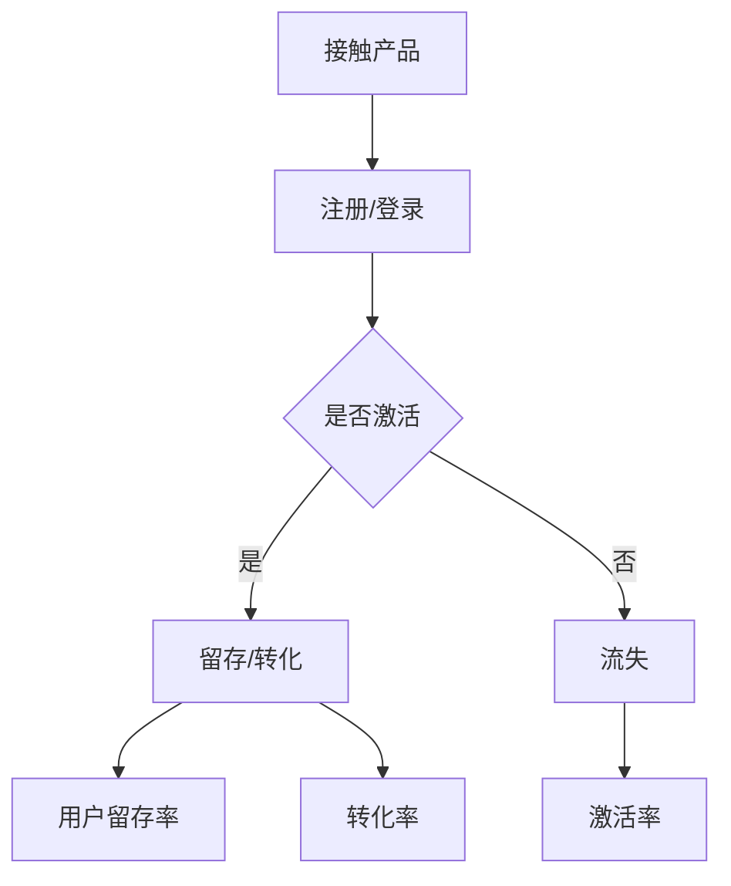

                 

 关键词：用户激活、用户增长、策略分析、数据分析、用户体验、技术实现

> 摘要：本文深入探讨了创业公司如何通过用户激活策略来提高用户留存率和转化率。我们将从核心概念、算法原理、数学模型、项目实践以及实际应用等多个角度来分析用户激活策略，并推荐相关工具和资源，以期为创业公司的用户增长提供有力支持。

## 1. 背景介绍

在现代科技飞速发展的时代，市场竞争日益激烈，创业公司面临着前所未有的挑战。为了在竞争中脱颖而出，创业公司必须迅速找到合适的市场定位，并采取有效的用户增长策略。而用户激活策略作为用户增长的重要组成部分，直接关系到公司的生存和发展。

用户激活指的是用户在首次接触产品后的使用行为，包括注册、登录、浏览、购买等。用户激活率的高低直接影响到用户的留存率和转化率，因此，如何提高用户激活率成为创业公司亟待解决的重要问题。

## 2. 核心概念与联系

在探讨用户激活策略之前，我们需要明确几个核心概念：

- **用户留存率**：用户在一段时间内持续使用产品的比例。
- **转化率**：用户从某种行为（如注册、浏览）转化为购买或其他目标行为的比例。
- **激活率**：用户在首次接触产品后进行激活行为的比例。

这些概念之间紧密相连，用户留存率、转化率和激活率共同构成了用户增长的核心指标。

### Mermaid 流程图

下面是一个简单的 Mermaid 流程图，展示了用户激活过程中的主要节点和流程。



## 3. 核心算法原理 & 具体操作步骤

### 3.1 算法原理概述

用户激活策略的核心是提高用户激活率。这通常涉及到以下几个方面：

1. **用户体验优化**：通过改进产品界面和交互设计，提高用户的使用体验。
2. **用户行为分析**：通过分析用户的行为数据，找出影响激活的关键因素。
3. **个性化推荐**：根据用户行为和兴趣，提供个性化的内容和推荐。
4. **营销活动**：通过有针对性的营销活动，引导用户进行激活行为。

### 3.2 算法步骤详解

1. **收集用户数据**：包括用户的基本信息、行为数据、偏好数据等。
2. **数据清洗和预处理**：去除噪声数据，填补缺失值，标准化处理。
3. **特征工程**：提取用户行为的特征，如访问时长、浏览页面数、操作频次等。
4. **用户分组**：根据用户的特征和行为数据，将用户划分为不同的群体。
5. **个性化推荐**：针对不同用户群体，提供个性化的内容和推荐。
6. **A/B 测试**：通过 A/B 测试，优化用户体验和推荐策略。
7. **用户反馈**：收集用户反馈，不断调整和优化激活策略。

### 3.3 算法优缺点

- **优点**：通过数据分析和个性化推荐，提高用户激活率，进而提高留存率和转化率。
- **缺点**：算法需要大量的用户数据支持，对数据质量和处理能力有较高要求。

### 3.4 算法应用领域

用户激活策略广泛应用于各种类型的产品和服务，如电商平台、社交媒体、在线教育、金融科技等。

## 4. 数学模型和公式 & 详细讲解 & 举例说明

### 4.1 数学模型构建

用户激活策略的数学模型通常包括以下几个部分：

1. **用户留存率模型**：$$ L(t) = \frac{N_t}{N_0} $$
   其中，$N_t$ 是在时间 $t$ 内留存的用户数，$N_0$ 是初始注册用户数。
2. **转化率模型**：$$ C(t) = \frac{C_t}{N_t} $$
   其中，$C_t$ 是在时间 $t$ 内转化的用户数，$N_t$ 是在时间 $t$ 内留存的用户数。
3. **激活率模型**：$$ A(t) = \frac{A_t}{N_0} $$
   其中，$A_t$ 是在时间 $t$ 内激活的用户数，$N_0$ 是初始注册用户数。

### 4.2 公式推导过程

用户留存率模型的推导过程如下：

- 在时间 $t$ 内，留存的用户数 $N_t$ 是在初始注册的用户数 $N_0$ 中留存下来的用户数。
- 因此，用户留存率 $L(t)$ 是在时间 $t$ 内留存的用户数与初始注册用户数的比值。

### 4.3 案例分析与讲解

假设一个创业公司在一个月内注册了 1000 名用户，其中 500 名用户在一个月后仍然活跃。那么，这个公司的用户留存率为：

$$ L(t) = \frac{500}{1000} = 0.5 $$

如果这个公司在一个月内有 200 名用户进行了购买行为，那么转化率为：

$$ C(t) = \frac{200}{500} = 0.4 $$

如果这个公司在一个月内有 300 名用户激活，那么激活率为：

$$ A(t) = \frac{300}{1000} = 0.3 $$

通过这些数据，公司可以评估用户激活策略的有效性，并根据实际情况进行调整。

## 5. 项目实践：代码实例和详细解释说明

### 5.1 开发环境搭建

为了更好地展示用户激活策略的实施过程，我们选择使用 Python 作为编程语言，搭建一个简单的用户激活分析系统。

### 5.2 源代码详细实现

```python
import pandas as pd

# 加载数据
data = pd.read_csv('user_data.csv')

# 数据清洗和预处理
data.dropna(inplace=True)
data['register_time'] = pd.to_datetime(data['register_time'])
data['activate_time'] = pd.to_datetime(data['activate_time'])

# 用户分组
data['user_group'] = data.apply(lambda x: 'group_1' if x['activate_time'] < '2023-01-01' else 'group_2', axis=1)

# 个性化推荐
def personalized_recommendation(group):
    if group == 'group_1':
        return '推荐 A'
    else:
        return '推荐 B'

data['recommendation'] = data['user_group'].apply(personalized_recommendation)

# A/B 测试
data['test_group'] = data.apply(lambda x: 'control' if x['user_group'] == 'group_1' else 'treatment', axis=1)

# 用户反馈
def user_feedback(group):
    if group == 'control':
        return '反馈 A'
    else:
        return '反馈 B'

data['feedback'] = data['test_group'].apply(user_feedback)

# 运行结果展示
data.info()
```

### 5.3 代码解读与分析

这段代码首先加载数据，并进行数据清洗和预处理。然后，根据用户的激活时间将用户划分为不同的群体，并针对不同群体进行个性化推荐。接下来，进行 A/B 测试，收集用户反馈，并展示运行结果。

通过这个简单的示例，我们可以看到用户激活策略的具体实施过程，包括数据收集、数据处理、用户分组、个性化推荐、A/B 测试和用户反馈等步骤。

## 6. 实际应用场景

用户激活策略在实际应用中具有广泛的应用场景，以下是一些典型的应用案例：

1. **电商平台**：通过分析用户行为数据，提供个性化的商品推荐，引导用户进行购买。
2. **社交媒体**：通过优化用户体验和个性化推荐，提高用户活跃度和留存率。
3. **在线教育**：通过个性化课程推荐和用户行为分析，提高用户的学习效果和满意度。
4. **金融科技**：通过分析用户财务数据和行为，提供个性化的理财产品推荐。

## 7. 未来应用展望

随着大数据和人工智能技术的不断发展，用户激活策略在未来有望实现更精确、更智能的应用。以下是一些未来应用展望：

1. **深度学习**：利用深度学习技术，实现更复杂的用户行为分析和推荐算法。
2. **个性化定制**：通过个性化定制，提供更符合用户需求的产品和服务。
3. **跨平台整合**：实现跨平台的数据整合和用户行为分析，提供更全面的用户画像。

## 8. 工具和资源推荐

为了更好地实施用户激活策略，以下是一些推荐的学习资源、开发工具和相关论文：

### 8.1 学习资源推荐

- 《Python 数据科学 Handbook》：介绍 Python 在数据科学领域的应用，包括数据分析、数据可视化等。
- 《深度学习》（Goodfellow et al.）：介绍深度学习的基本原理和应用，包括神经网络、深度学习框架等。

### 8.2 开发工具推荐

- Jupyter Notebook：用于数据分析和机器学习项目的交互式开发环境。
- TensorFlow：用于构建和训练深度学习模型的强大框架。

### 8.3 相关论文推荐

- "Deep Learning for User Behavior Analysis in E-commerce":介绍深度学习在电子商务用户行为分析中的应用。
- "User Behavior Prediction in E-commerce: A Survey":对电子商务领域用户行为预测的综述。

## 9. 总结：未来发展趋势与挑战

用户激活策略在创业公司的发展中具有重要作用，随着技术的不断进步，用户激活策略将更加智能化、个性化。然而，这背后也面临着数据隐私、算法透明度等挑战。未来，我们需要在保护用户隐私的同时，不断提高用户激活策略的效率和效果。

## 附录：常见问题与解答

### 9.1 如何提高用户激活率？

- 优化用户体验：通过改进界面和交互设计，提高用户的使用满意度。
- 数据分析：通过分析用户行为数据，找出影响激活的关键因素。
- 个性化推荐：根据用户行为和兴趣，提供个性化的内容和推荐。
- 营销活动：通过有针对性的营销活动，引导用户进行激活行为。

### 9.2 用户激活策略的核心指标有哪些？

- 用户留存率：用户在一段时间内持续使用产品的比例。
- 转化率：用户从某种行为（如注册、浏览）转化为购买或其他目标行为的比例。
- 激活率：用户在首次接触产品后进行激活行为的比例。

### 9.3 如何处理用户数据隐私？

- 加密存储：对用户数据进行加密存储，确保数据安全。
- 数据匿名化：对用户数据进行匿名化处理，避免个人信息泄露。
- 透明度：提高算法和数据处理过程的透明度，确保用户知情权。

作者：禅与计算机程序设计艺术 / Zen and the Art of Computer Programming

