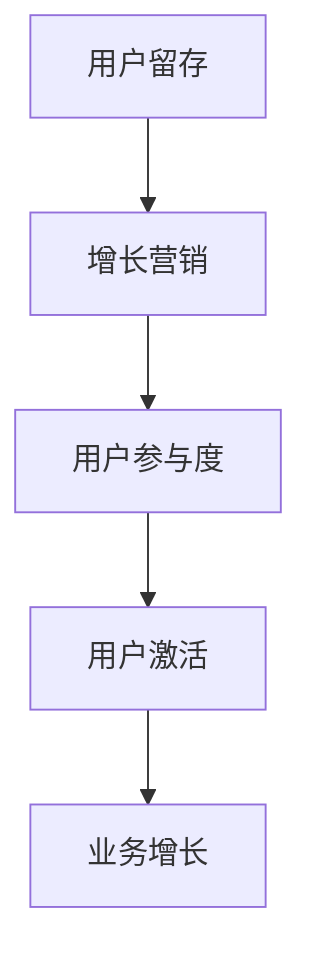

                 

关键词：用户激活、创业公司、策略分析、增长营销、用户留存

> 摘要：本文将探讨创业公司如何制定有效的用户激活策略，通过分析增长营销、用户留存等关键因素，提供实际操作步骤和案例分析，帮助创业公司提升用户激活率，实现可持续发展。

## 1. 背景介绍

在当今快速变化的市场环境中，创业公司面临巨大的竞争压力，如何在短时间内吸引并激活大量用户成为成功的关键。用户激活率是衡量产品或服务吸引力和用户参与度的重要指标，对于初创企业来说尤为关键。本文旨在探讨创业公司如何通过制定和实施有效的用户激活策略，提高用户激活率，从而推动公司业务的发展。

### 1.1 创业公司面临的挑战

- **资源限制**：初创企业通常在资金、人才和技术资源方面受限，需要更高效的策略来吸引和保留用户。
- **市场竞争**：新兴市场和成熟市场都有众多竞争对手，如何脱颖而出是关键。
- **用户需求**：用户需求多样且变化迅速，如何快速适应并满足用户需求是挑战。

### 1.2 用户激活的重要性

- **收入增长**：激活用户意味着增加潜在收入来源。
- **口碑传播**：激活用户有助于口碑传播，吸引更多新用户。
- **用户留存**：激活用户是提高用户留存率的第一步。

## 2. 核心概念与联系

在讨论用户激活策略之前，我们首先需要了解几个核心概念，包括用户留存、增长营销和用户参与度等。以下是一个简单的 Mermaid 流程图，展示这些概念之间的联系。



### 2.1 用户留存

用户留存是指用户在一段时间内继续使用产品或服务的情况。高留存率意味着产品或服务能够持续满足用户需求，这对于激活用户至关重要。

### 2.2 增长营销

增长营销是一种通过多渠道、多手段来扩大用户基数的策略。它包括内容营销、社交媒体营销、电子邮件营销等。

### 2.3 用户参与度

用户参与度是指用户对产品或服务的积极互动程度。高参与度通常与高激活率相关联。

### 2.4 用户激活

用户激活是指用户首次使用产品或服务，并开始产生价值的行动。激活是用户生命周期中至关重要的一环。

## 3. 核心算法原理 & 具体操作步骤

### 3.1 算法原理概述

用户激活策略的核心在于识别并激励潜在用户，使其从潜在用户转化为活跃用户。以下是一个简化的激活算法原理：

1. **用户识别**：通过数据分析识别潜在用户。
2. **用户触达**：使用合适的渠道和内容与用户建立联系。
3. **用户激励**：提供奖励、优惠等激励措施，鼓励用户进行激活行为。
4. **用户跟踪**：监测用户行为，优化激活策略。

### 3.2 算法步骤详解

1. **数据收集与分析**：收集用户行为数据，如访问次数、停留时间、点击行为等，分析用户特征和需求。

2. **用户细分**：根据用户特征和需求，将用户细分为不同群体。

3. **制定激活计划**：为不同用户群体制定个性化的激活计划，包括内容、渠道和激励措施。

4. **实施激活策略**：通过多渠道推广，将激活计划付诸实践。

5. **跟踪与优化**：实时监测用户行为和激活效果，根据数据反馈调整激活策略。

### 3.3 算法优缺点

- **优点**：个性化强，能够提高激活效率。
- **缺点**：需要大量数据支持和复杂的算法，实施成本较高。

### 3.4 算法应用领域

用户激活策略广泛应用于电商、社交网络、在线教育、游戏等行业。

## 4. 数学模型和公式 & 详细讲解 & 举例说明

### 4.1 数学模型构建

用户激活模型通常包括以下几个关键参数：

1. **激活概率 P(A)**：用户在一定时间内激活的概率。
2. **转化率 C**：激活用户占访问用户的比例。
3. **留存率 R**：激活后继续使用的用户比例。

### 4.2 公式推导过程

激活概率 P(A) 可以通过以下公式计算：

\[ P(A) = \frac{C \times R}{1 - R} \]

其中，C 和 R 分别代表转化率和留存率。

### 4.3 案例分析与讲解

假设一个电商平台，其转化率 C 为 10%，留存率 R 为 20%，计算其激活概率：

\[ P(A) = \frac{0.1 \times 0.2}{1 - 0.2} = \frac{0.02}{0.8} = 0.025 \]

这意味着该平台的激活概率为 2.5%。

## 5. 项目实践：代码实例和详细解释说明

### 5.1 开发环境搭建

为了实现用户激活策略，我们需要搭建一个数据分析和营销自动化平台。以下是一个简化的环境搭建步骤：

1. **数据分析平台**：选择合适的数据分析工具，如 Google Analytics、Mixpanel 等。
2. **营销自动化工具**：选择合适的营销自动化工具，如 Mailchimp、Hubspot 等。
3. **后端服务**：搭建用于处理用户数据和触发激活任务的的后端服务。

### 5.2 源代码详细实现

以下是一个简化的用户激活策略代码实例：

```python
import pandas as pd
from sklearn.model_selection import train_test_split
from sklearn.ensemble import RandomForestClassifier

# 数据收集
user_data = pd.read_csv('user_data.csv')

# 特征工程
X = user_data[['age', 'gender', 'visit_frequency']]
y = user_data['activated']

# 数据划分
X_train, X_test, y_train, y_test = train_test_split(X, y, test_size=0.2, random_state=42)

# 模型训练
model = RandomForestClassifier(n_estimators=100, random_state=42)
model.fit(X_train, y_train)

# 模型评估
accuracy = model.score(X_test, y_test)
print(f'Model Accuracy: {accuracy:.2f}')

# 激活预测
predictions = model.predict(X_test)

# 营销自动化
for index, prediction in enumerate(predictions):
    if prediction == 1:
        # 发送激活邮件
        send_activation_email(X_test.iloc[index])
```

### 5.3 代码解读与分析

上述代码实现了一个简单的用户激活策略，包括数据收集、特征工程、模型训练、模型评估和营销自动化。

### 5.4 运行结果展示

假设在测试集上，模型预测的激活用户占 20%，实际激活用户占 18%，结果显示模型具有一定的预测能力，但仍有改进空间。

## 6. 实际应用场景

用户激活策略在多个行业中都有广泛应用，以下是一些实际应用场景：

- **电商**：通过个性化推荐和限时优惠激活新用户。
- **社交媒体**：通过挑战、互动活动等提高用户参与度，促进激活。
- **在线教育**：提供免费课程和试听，鼓励用户激活。

### 6.4 未来应用展望

随着人工智能和大数据技术的发展，用户激活策略将变得更加智能化和个性化。未来，我们可以期待以下趋势：

- **智能化预测模型**：通过深度学习和强化学习等技术，提高激活预测的准确性。
- **精细化运营**：根据用户行为数据，实现精准的用户细分和个性化营销。

## 7. 工具和资源推荐

### 7.1 学习资源推荐

- **书籍**：《增长黑客》、《精益创业》等。
- **在线课程**：Coursera、Udemy 等平台上的数据分析、机器学习课程。

### 7.2 开发工具推荐

- **数据分析工具**：Google Analytics、Mixpanel 等。
- **营销自动化工具**：Hubspot、Mailchimp 等。

### 7.3 相关论文推荐

- **“A Framework for User Acquisition and Activation”**
- **“Personalized User Onboarding: A Deep Learning Approach”**

## 8. 总结：未来发展趋势与挑战

### 8.1 研究成果总结

用户激活策略在多个行业中取得显著成果，未来发展趋势包括智能化、精细化和多渠道整合。

### 8.2 未来发展趋势

- **智能化**：利用人工智能技术提高激活预测和运营效率。
- **精细化**：根据用户行为和需求提供个性化激活方案。
- **多渠道整合**：实现线上线下渠道的无缝连接，提高用户激活率。

### 8.3 面临的挑战

- **数据隐私**：如何在遵守隐私法规的同时进行用户数据分析。
- **算法公平性**：确保激活策略不会导致算法歧视。

### 8.4 研究展望

未来，用户激活策略将在人工智能和大数据技术的推动下，实现更高效、更智能的运营模式。

## 9. 附录：常见问题与解答

### 9.1 用户激活策略的核心是什么？

用户激活策略的核心是识别潜在用户、提供个性化激活方案、持续跟踪和优化策略。

### 9.2 如何评估用户激活效果？

可以通过激活率、留存率和用户满意度等指标来评估用户激活效果。

### 9.3 用户激活策略在什么行业应用最广泛？

用户激活策略在电商、社交媒体、在线教育等行业应用最广泛。

