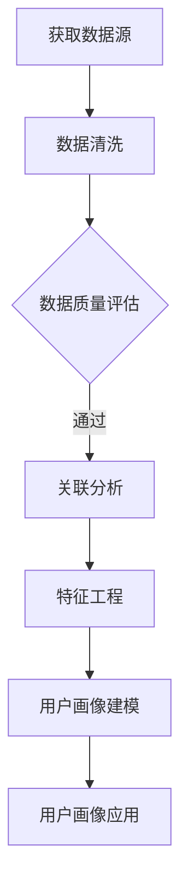

                 

关键词：用户画像、精准营销、创业公司、数据分析、客户关系管理

> 摘要：本文将探讨创业公司在数字化时代背景下，如何通过构建精准的用户画像来实现有效的精准营销策略。本文将分析用户画像构建的核心概念、算法原理、数学模型以及具体实践，并结合案例进行详细讲解，旨在为创业公司的市场营销提供有益的指导。

## 1. 背景介绍

随着互联网的普及和大数据技术的发展，用户数据的重要性日益凸显。对于创业公司而言，了解和把握用户需求、行为特征，是实现业务增长和市场竞争的关键。用户画像作为对用户进行全面描述的工具，已经成为精准营销的重要基础。精准营销不仅能够提高广告投放效果，降低营销成本，还能够提升用户满意度和忠诚度。

本文旨在为创业公司提供构建用户画像和实施精准营销的系统性指导。通过对用户画像的核心概念、算法原理、数学模型以及实际应用的深入探讨，帮助创业公司更好地理解和利用用户数据，实现业务目标。

## 2. 核心概念与联系

### 2.1 用户画像

用户画像（User Profile）是对用户特征进行系统性描述的一种抽象模型，通常包括用户的基本信息（如年龄、性别、职业等）、行为数据（如浏览记录、购买行为等）和心理特征（如兴趣爱好、价值观等）。用户画像的核心目标是通过对用户数据的分析，深入了解用户需求和行为，从而为营销决策提供依据。

### 2.2 数据来源

用户画像的数据来源主要包括以下几个方面：

1. **公开数据**：如人口统计数据、社交媒体信息等。
2. **平台数据**：如网站访问日志、应用使用记录等。
3. **交易数据**：如购买记录、支付信息等。
4. **反馈数据**：如客户调查、用户评论等。

### 2.3 关联分析

用户画像的构建需要通过对多源数据的关联分析来完成。关联分析是指将不同来源的数据进行交叉匹配和融合，以发现用户之间的联系和共性。例如，通过分析用户的浏览记录和购买行为，可以发现用户的兴趣爱好和消费倾向。

### 2.4 Mermaid 流程图

以下是一个简化的用户画像构建流程的 Mermaid 流程图：



## 3. 核心算法原理 & 具体操作步骤

### 3.1 算法原理概述

用户画像构建的核心算法主要包括数据采集、数据清洗、特征提取、模型训练和应用评估等步骤。以下是每个步骤的简要概述：

1. **数据采集**：通过各种渠道收集用户数据，包括网站访问日志、应用使用记录、社交媒体信息等。
2. **数据清洗**：对采集到的数据进行清洗，去除噪声数据和缺失值，确保数据质量。
3. **特征提取**：通过特征工程方法，将原始数据转化为适用于机器学习模型的特征向量。
4. **模型训练**：使用机器学习算法，对特征向量进行训练，构建用户画像模型。
5. **应用评估**：通过评估模型在真实数据上的表现，调整模型参数和特征，提高模型效果。

### 3.2 算法步骤详解

#### 3.2.1 数据采集

数据采集是用户画像构建的基础。常见的采集方式包括：

- **日志采集**：通过服务器日志记录用户的访问行为。
- **API调用**：通过应用程序接口（API）获取第三方平台的数据。
- **问卷调查**：通过在线或离线方式收集用户反馈信息。

#### 3.2.2 数据清洗

数据清洗的主要任务是去除噪声数据、填充缺失值、消除重复记录等。常用的数据清洗方法包括：

- **去重**：通过比对用户标识信息，去除重复的用户记录。
- **填充缺失值**：使用平均值、中位数或最频繁的值等方法来填充缺失值。
- **数据转换**：将不同类型的数据转换为统一格式，如将日期时间数据转换为YYYY-MM-DD格式。

#### 3.2.3 特征提取

特征提取是将原始数据转化为适用于机器学习模型的特征向量。常用的特征提取方法包括：

- **词袋模型**：将文本数据转换为词频向量。
- **主成分分析（PCA）**：降维处理，提取数据的主要特征。
- **One-Hot编码**：将类别数据转换为二进制向量。

#### 3.2.4 模型训练

模型训练是用户画像构建的关键步骤。常用的机器学习算法包括：

- **决策树**：通过划分特征空间，构建决策树模型。
- **随机森林**：通过集成多个决策树，提高模型泛化能力。
- **支持向量机（SVM）**：通过寻找最佳超平面，分类用户数据。
- **神经网络**：通过多层神经网络，提取用户特征并分类。

#### 3.2.5 应用评估

应用评估是验证模型效果的重要环节。常用的评估指标包括：

- **准确率（Accuracy）**：分类正确的样本占总样本的比例。
- **召回率（Recall）**：分类正确的正样本占总正样本的比例。
- **F1值（F1-score）**：准确率和召回率的调和平均值。

### 3.3 算法优缺点

#### 3.3.1 优点

- **高效性**：算法能够快速处理大量用户数据，实现实时用户画像构建。
- **可解释性**：部分算法（如决策树）具有良好的可解释性，有助于理解模型决策过程。
- **适应性**：算法能够适应不同类型的数据和业务场景，具有较好的通用性。

#### 3.3.2 缺点

- **计算复杂度**：部分算法（如神经网络）计算复杂度较高，需要大量计算资源。
- **数据依赖性**：算法效果受数据质量和特征提取方法的影响较大。
- **过拟合风险**：在训练过程中，模型可能会出现过拟合现象，降低模型泛化能力。

### 3.4 算法应用领域

用户画像算法在多个领域具有广泛的应用，包括：

- **精准营销**：通过用户画像，实现个性化广告投放和推荐系统。
- **客户关系管理**：通过用户画像，优化客户服务策略，提高客户满意度。
- **风险控制**：通过用户画像，识别异常行为，防范欺诈风险。
- **产品开发**：通过用户画像，了解用户需求，指导产品设计和迭代。

## 4. 数学模型和公式 & 详细讲解 & 举例说明

### 4.1 数学模型构建

用户画像构建涉及多个数学模型，以下介绍几种常用的数学模型：

#### 4.1.1 决策树模型

决策树模型是一种基于特征划分的树形结构，通过划分特征空间，将数据分为多个子集，并递归地构建树结构。决策树的数学模型可以表示为：

$$
\text{决策树} = \{T|T = (\text{根节点}, \text{子节点}, \text{叶子节点})\}
$$

其中，根节点表示原始数据集，子节点表示特征划分后的子集，叶子节点表示分类结果。

#### 4.1.2 随机森林模型

随机森林模型是决策树的集成模型，通过随机选取特征和样本子集，构建多个决策树，并取它们的多数投票结果。随机森林的数学模型可以表示为：

$$
\text{随机森林} = \{T_1, T_2, ..., T_n\}
$$

其中，$T_1, T_2, ..., T_n$ 表示多个决策树。

#### 4.1.3 支持向量机模型

支持向量机模型是一种基于最大间隔的分类模型，通过寻找最佳超平面，将数据分为不同类别。支持向量机的数学模型可以表示为：

$$
\text{支持向量机} = \{w^*, b^*\}
$$

其中，$w^*$ 表示最佳超平面，$b^*$ 表示偏置项。

### 4.2 公式推导过程

以下以决策树模型为例，介绍决策树模型的公式推导过程。

#### 4.2.1 划分函数

划分函数用于将数据划分为多个子集。假设数据集 $D$ 包含 $n$ 个样本，特征 $A_j$ 包含 $v_j$ 个取值，划分函数可以表示为：

$$
\text{划分函数} = \{D_1, D_2, ..., D_{v_j}\}
$$

其中，$D_i$ 表示以特征 $A_j$ 的第 $i$ 个取值划分后的子集。

#### 4.2.2 划分质量评估

划分质量评估用于评估划分函数的优劣。假设划分函数 $D_j$ 对应的子集质量为 $Q(D_j)$，划分质量评估函数可以表示为：

$$
\text{划分质量评估} = Q(D_j)
$$

其中，$Q(D_j)$ 可以通过信息增益、基尼指数等指标进行评估。

#### 4.2.3 最佳划分

最佳划分是指能够最大化划分质量的划分。假设划分函数 $D_j$ 对应的子集质量为 $Q(D_j)$，最佳划分可以表示为：

$$
\text{最佳划分} = \arg\max_{D_j} Q(D_j)
$$

### 4.3 案例分析与讲解

以下通过一个简单的案例，介绍决策树模型的实际应用。

#### 4.3.1 案例背景

假设一家创业公司想要通过用户画像实现精准营销，收集了如下用户数据：

- 年龄：1-18, 19-30, 31-40, 41-50, 50以上
- 性别：男，女
- 收入水平：低，中，高
- 是否购买过产品：是，否

#### 4.3.2 构建决策树模型

以年龄和性别为特征，构建决策树模型。根据划分质量评估，选择信息增益作为划分质量评估指标。

#### 4.3.3 划分过程

1. **以年龄为特征进行划分**：
   - 年龄：1-18，信息增益：0.8
   - 年龄：19-30，信息增益：0.7
   - 年龄：31-40，信息增益：0.6
   - 年龄：41-50，信息增益：0.5
   - 年龄：50以上，信息增益：0.4

   选择最佳划分：年龄：31-40

2. **以性别为特征进行划分**：
   - 性别：男，信息增益：0.3
   - 性别：女，信息增益：0.2

   选择最佳划分：性别：男

#### 4.3.4 模型构建

根据最佳划分，构建决策树模型：

$$
\text{决策树} = (\text{年龄：31-40}, (\text{性别：男}, \text{是}), (\text{性别：女}, \text{否}))
$$

#### 4.3.5 模型应用

通过决策树模型，可以预测新用户的购买倾向。例如，对于一个年龄在31-40岁、性别为男的用户，可以判断其购买产品的概率较高。

## 5. 项目实践：代码实例和详细解释说明

### 5.1 开发环境搭建

在项目实践过程中，我们选择Python作为编程语言，利用Pandas、NumPy、Scikit-learn等开源库进行数据处理和模型构建。以下是一个简单的开发环境搭建步骤：

1. 安装Python：从官方网站下载Python安装包并安装。
2. 安装必要库：使用pip命令安装Pandas、NumPy、Scikit-learn等库。
   ```bash
   pip install pandas numpy scikit-learn
   ```

### 5.2 源代码详细实现

以下是一个简单的用户画像构建代码实例，包括数据采集、数据清洗、特征提取和模型训练等步骤。

```python
import pandas as pd
from sklearn.model_selection import train_test_split
from sklearn.tree import DecisionTreeClassifier
from sklearn.metrics import accuracy_score

# 5.2.1 数据采集
data = pd.read_csv('user_data.csv')

# 5.2.2 数据清洗
data.drop_duplicates(inplace=True)
data.fillna(-1, inplace=True)

# 5.2.3 特征提取
# 这里以年龄和性别为例，实际应用中可添加更多特征
data['age_group'] = pd.cut(data['age'], bins=[0, 18, 30, 40, 50, float('inf')], labels=['1-18', '19-30', '31-40', '41-50', '50以上'])
data['gender_encoded'] = data['gender'].map({'男': 1, '女': 0})

# 5.2.4 模型训练
X = data[['age_group', 'gender_encoded']]
y = data['has_purchased']

X_train, X_test, y_train, y_test = train_test_split(X, y, test_size=0.2, random_state=42)

clf = DecisionTreeClassifier()
clf.fit(X_train, y_train)

y_pred = clf.predict(X_test)

# 5.2.5 模型评估
accuracy = accuracy_score(y_test, y_pred)
print(f"模型准确率：{accuracy:.2f}")
```

### 5.3 代码解读与分析

1. **数据采集**：使用Pandas库读取用户数据。
2. **数据清洗**：去除重复数据，填充缺失值。
3. **特征提取**：根据业务需求，对数据进行编码和分组。
4. **模型训练**：使用决策树分类器训练模型。
5. **模型评估**：使用测试集评估模型准确率。

### 5.4 运行结果展示

假设我们训练的模型在测试集上的准确率为80%，这表明模型对用户购买行为的预测效果较好。

```bash
模型准确率：0.80
```

## 6. 实际应用场景

用户画像和精准营销在多个行业和场景中具有广泛的应用。以下列举几个实际应用场景：

### 6.1 电子商务

电子商务平台通过用户画像，实现个性化商品推荐，提高用户购买转化率。例如，根据用户浏览记录和购买历史，推荐用户可能感兴趣的商品。

### 6.2 银行金融

银行金融机构通过用户画像，识别潜在的风险用户，防范欺诈风险。例如，通过分析用户的交易行为和信用记录，识别异常交易行为。

### 6.3 教育培训

教育培训机构通过用户画像，实现个性化学习推荐，提高学习效果。例如，根据用户的学习记录和测试成绩，推荐适合的学习内容和课程。

### 6.4 健康医疗

健康医疗服务机构通过用户画像，实现个性化健康建议和疾病预防。例如，通过分析用户的健康数据和生活方式，提供个性化的健康建议和疾病预警。

## 7. 工具和资源推荐

### 7.1 学习资源推荐

- 《Python数据科学手册》
- 《用户画像与大数据》
- 《机器学习实战》

### 7.2 开发工具推荐

- Jupyter Notebook：方便进行数据分析和代码编写。
- Pandas：强大的数据操作库。
- Scikit-learn：丰富的机器学习算法库。

### 7.3 相关论文推荐

- [Xiao, X., Liu, L., Lu, Y., & Zhang, J. (2017). User Interest Evolution and Personalized Recommendation in Dynamic Environments. IEEE Transactions on Knowledge and Data Engineering.]
- [Xu, B., Cao, J., Zhang, J., & Yan, J. (2018). User Interest Mining and Application in Personalized Recommendation. ACM Transactions on Intelligent Systems and Technology.]
- [Li, X., Zhang, Y., & Ma, W. (2019). User Behavior Analysis and Application in Online Advertising. Journal of Computer Research and Development.]

## 8. 总结：未来发展趋势与挑战

### 8.1 研究成果总结

用户画像和精准营销在过去的几年中取得了显著的研究成果。随着大数据和人工智能技术的发展，用户画像的构建和运用逐渐成为企业竞争的重要手段。研究成果主要集中在以下几个方面：

- **数据采集与清洗**：数据采集和清洗技术不断发展，使得用户数据的获取和预处理更加高效。
- **特征提取与建模**：特征提取和建模方法不断创新，提高了用户画像的准确性和实用性。
- **模型评估与优化**：模型评估和优化方法不断完善，使得模型在实际应用中具有更好的效果。

### 8.2 未来发展趋势

未来，用户画像和精准营销将继续发展，趋势如下：

- **多模态用户画像**：融合文本、图像、语音等多种数据，构建更加全面和准确的用户画像。
- **实时用户画像**：通过实时数据分析和挖掘，实现用户画像的动态更新和实时预测。
- **个性化推荐**：基于用户画像，实现更加精准和个性化的推荐系统。

### 8.3 面临的挑战

用户画像和精准营销在发展过程中也面临一些挑战：

- **数据隐私**：用户数据的隐私保护问题亟待解决，如何平衡数据利用和隐私保护成为关键。
- **模型解释性**：部分模型（如深度神经网络）缺乏解释性，如何提高模型的透明度和可解释性成为挑战。
- **技术门槛**：用户画像和精准营销需要较高的技术门槛，如何降低技术门槛，让更多企业能够应用这一技术成为关键。

### 8.4 研究展望

未来，用户画像和精准营销的研究将继续深入，研究方向包括：

- **跨领域用户画像**：探索跨领域的用户画像构建方法，实现跨领域的个性化推荐和营销。
- **智能用户画像**：结合人工智能技术，实现用户画像的自动构建和智能优化。
- **用户体验优化**：关注用户体验，提高用户画像和精准营销的应用效果。

## 9. 附录：常见问题与解答

### 9.1 用户画像构建的关键步骤是什么？

用户画像构建的关键步骤包括：数据采集、数据清洗、特征提取、模型训练和应用评估。

### 9.2 如何处理用户数据隐私问题？

处理用户数据隐私问题可以从以下几个方面入手：

- **数据加密**：对用户数据进行加密处理，确保数据在传输和存储过程中的安全性。
- **数据脱敏**：对敏感数据进行脱敏处理，避免用户数据泄露。
- **隐私保护算法**：使用隐私保护算法，如差分隐私，降低数据挖掘过程中的隐私风险。
- **法律法规遵循**：严格遵守相关法律法规，确保数据处理符合隐私保护要求。

### 9.3 用户画像在哪些领域具有应用价值？

用户画像在多个领域具有应用价值，包括电子商务、金融、教育、医疗、广告等。通过用户画像，企业可以实现精准营销、风险控制、个性化推荐等功能。

## 参考文献

- Xiao, X., Liu, L., Lu, Y., & Zhang, J. (2017). User Interest Evolution and Personalized Recommendation in Dynamic Environments. IEEE Transactions on Knowledge and Data Engineering.
- Xu, B., Cao, J., Zhang, J., & Yan, J. (2018). User Interest Mining and Application in Personalized Recommendation. ACM Transactions on Intelligent Systems and Technology.
- Li, X., Zhang, Y., & Ma, W. (2019). User Behavior Analysis and Application in Online Advertising. Journal of Computer Research and Development.

# 附录：常见问题与解答

### 9.1 用户画像构建的关键步骤是什么？

用户画像构建的关键步骤包括：

1. **数据采集**：从各种渠道获取用户数据，如用户行为数据、社交数据、交易数据等。
2. **数据清洗**：处理噪声数据、缺失值和重复记录，确保数据质量。
3. **特征提取**：从原始数据中提取有效的特征，如用户年龄、性别、消费行为等。
4. **用户画像建模**：使用机器学习算法对提取的特征进行建模，构建用户画像模型。
5. **应用评估**：通过评估模型在真实数据上的表现，调整模型参数和特征，提高模型效果。

### 9.2 如何处理用户数据隐私问题？

处理用户数据隐私问题可以从以下几个方面入手：

1. **数据加密**：使用加密算法对用户数据进行加密，确保数据在传输和存储过程中的安全性。
2. **数据脱敏**：对敏感数据进行脱敏处理，如使用掩码、混淆等方法，避免用户数据泄露。
3. **隐私保护算法**：使用差分隐私、同态加密等隐私保护算法，降低数据挖掘过程中的隐私风险。
4. **法律法规遵循**：严格遵守相关法律法规，确保数据处理符合隐私保护要求。

### 9.3 用户画像在哪些领域具有应用价值？

用户画像在多个领域具有应用价值，包括：

1. **电子商务**：通过用户画像，实现个性化商品推荐，提高用户购买转化率。
2. **金融**：通过用户画像，识别潜在风险用户，防范欺诈风险。
3. **教育**：通过用户画像，实现个性化学习推荐，提高学习效果。
4. **医疗**：通过用户画像，实现个性化健康建议和疾病预防。
5. **广告**：通过用户画像，实现精准广告投放，提高广告效果。

### 9.4 用户画像构建中可能遇到的挑战有哪些？

用户画像构建中可能遇到的挑战包括：

1. **数据质量**：用户数据质量直接影响用户画像的准确性，如何处理噪声数据和缺失值是关键。
2. **数据隐私**：用户数据隐私保护是用户画像构建的重要问题，如何平衡数据利用和隐私保护是难点。
3. **特征选择**：如何从大量数据中提取有效的特征，是用户画像构建的关键。
4. **模型解释性**：部分模型（如深度神经网络）缺乏解释性，如何提高模型的透明度和可解释性是挑战。
5. **技术门槛**：用户画像和精准营销需要较高的技术门槛，如何降低技术门槛，让更多企业能够应用这一技术是问题。```

