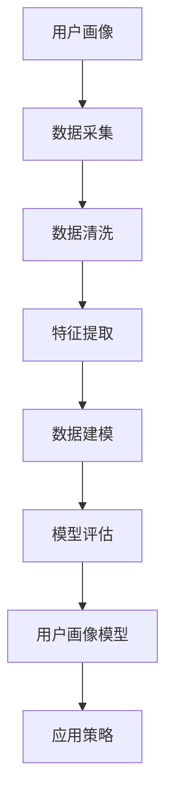

                 

关键词：用户画像、数据分析、创业公司、精细化运营、应用策略

摘要：本文深入探讨了创业公司在用户画像精细化方面的应用策略。通过构建用户画像模型，分析用户行为数据，创业公司可以更精准地定位目标用户，提升用户满意度和转化率。本文从核心概念、算法原理、数学模型、项目实践和实际应用等多个角度出发，为创业公司提供了一套完整的用户画像精细化解决方案。

## 1. 背景介绍

在当今快速变化的市场环境中，创业公司面临着激烈的竞争和生存压力。如何准确了解用户需求，提供高质量的产品和服务，成为创业公司成功的关键。用户画像作为一种数据分析工具，可以帮助创业公司深入了解用户特征，挖掘潜在用户价值，从而制定更加精准的市场营销策略。

用户画像是指对目标用户进行数据化的描述，包括用户的基本信息、行为特征、需求偏好等多个维度。通过构建用户画像，创业公司可以实现以下目标：

1. **精准定位目标用户**：通过分析用户画像，创业公司可以明确目标用户群体，为产品定位和市场营销提供依据。
2. **提升用户体验**：了解用户需求和行为习惯，创业公司可以优化产品设计，提升用户体验。
3. **提高营销转化率**：基于用户画像的精准营销，可以提高用户参与度和转化率。

## 2. 核心概念与联系

### 2.1 用户画像的概念

用户画像是指对目标用户进行全面描述的数据集合，包括用户的基本信息（如年龄、性别、地域等）、行为特征（如浏览记录、购买行为等）和需求偏好（如兴趣标签、购买偏好等）。用户画像的构建需要结合多种数据源，如社交媒体数据、行为数据、购买数据等。

### 2.2 用户画像的应用场景

1. **产品定位**：通过分析用户画像，创业公司可以明确目标用户群体，为产品设计和功能迭代提供参考。
2. **精准营销**：基于用户画像的精准营销，可以提高营销活动的效果，降低获客成本。
3. **用户体验优化**：了解用户需求和行为习惯，创业公司可以优化产品设计，提升用户体验。
4. **风险控制**：用户画像可以帮助创业公司识别高风险用户，进行风险控制和用户分层。

### 2.3 用户画像的构建方法

构建用户画像需要以下步骤：

1. **数据采集**：从多个数据源采集用户数据，如社交媒体数据、行为数据、购买数据等。
2. **数据清洗**：对采集到的数据进行清洗，去除重复、错误和不完整的数据。
3. **特征提取**：从清洗后的数据中提取关键特征，如用户性别、年龄、地域、兴趣等。
4. **数据建模**：使用机器学习算法对用户数据进行建模，构建用户画像模型。
5. **模型评估**：评估用户画像模型的准确性，并根据评估结果进行优化。

### 2.4 用户画像与数据挖掘的关系

用户画像是一种数据挖掘技术，通过对用户数据的分析，提取有价值的信息。数据挖掘包括以下步骤：

1. **数据预处理**：对原始数据进行清洗、转换和整合，为后续分析做准备。
2. **特征选择**：从数据中提取关键特征，为建模提供输入。
3. **模型选择**：选择合适的算法对数据进行建模，如决策树、聚类算法等。
4. **模型评估**：评估模型的性能，根据评估结果进行模型优化。

用户画像与数据挖掘的关系如图所示：



## 3. 核心算法原理 & 具体操作步骤

### 3.1 算法原理概述

用户画像的构建主要依赖于数据挖掘和机器学习技术。核心算法包括聚类算法、协同过滤算法和深度学习算法等。以下分别介绍这些算法的原理：

1. **聚类算法**：通过将相似的用户数据进行分组，形成不同的用户群体。常见的聚类算法有K-means、DBSCAN等。
2. **协同过滤算法**：基于用户的行为数据，为用户提供个性化的推荐。协同过滤算法分为基于用户的协同过滤和基于物品的协同过滤两种。
3. **深度学习算法**：利用神经网络模型对用户数据进行建模，提取深层次的用户特征。常见的深度学习算法有卷积神经网络（CNN）和循环神经网络（RNN）等。

### 3.2 算法步骤详解

以下是构建用户画像的详细步骤：

1. **数据采集**：从多个数据源采集用户数据，如社交媒体数据、行为数据、购买数据等。
2. **数据预处理**：对采集到的数据进行清洗、转换和整合，为后续分析做准备。主要包括以下步骤：
   - 去除重复、错误和不完整的数据。
   - 对数值型数据进行归一化或标准化处理。
   - 对类别型数据进行编码处理，如独热编码、标签编码等。
3. **特征提取**：从清洗后的数据中提取关键特征，如用户性别、年龄、地域、兴趣等。特征提取的方法包括：
   - 手工特征提取：根据业务需求，手动定义特征。
   - 自动特征提取：使用机器学习算法，自动提取特征。
4. **数据建模**：选择合适的算法对用户数据进行建模。常见的算法包括：
   - 聚类算法：对用户数据进行分组，形成不同的用户群体。
   - 协同过滤算法：为用户提供个性化的推荐。
   - 深度学习算法：提取深层次的用户特征。
5. **模型评估**：评估用户画像模型的准确性，如评估指标包括用户覆盖率、召回率、准确率等。根据评估结果，对模型进行优化。

### 3.3 算法优缺点

以下是各种算法的优缺点：

1. **聚类算法**：
   - 优点：简单易懂，适用于多种数据类型。
   - 缺点：对初始中心点的选择敏感，容易陷入局部最优。
2. **协同过滤算法**：
   - 优点：效果较好，适用于推荐系统。
   - 缺点：需要大量的用户行为数据，对新用户不友好。
3. **深度学习算法**：
   - 优点：可以提取深层次的用户特征，适用于复杂场景。
   - 缺点：需要大量的训练数据和计算资源，模型解释性较差。

### 3.4 算法应用领域

用户画像算法可以应用于以下领域：

1. **市场营销**：通过用户画像，为用户提供个性化的推荐和广告。
2. **产品优化**：了解用户需求，优化产品功能和用户体验。
3. **风险控制**：识别高风险用户，进行风险控制和用户分层。
4. **用户增长**：通过用户画像，制定精准的用户增长策略。

## 4. 数学模型和公式 & 详细讲解 & 举例说明

### 4.1 数学模型构建

用户画像的数学模型主要包括以下几个方面：

1. **用户特征矩阵**：表示用户与特征之间的关联关系，如$X \in \mathbb{R}^{m \times n}$，其中$m$为用户数量，$n$为特征数量。
2. **用户群体矩阵**：表示用户与用户群体之间的关联关系，如$Y \in \mathbb{R}^{m \times k}$，其中$k$为用户群体数量。
3. **用户偏好矩阵**：表示用户与物品之间的关联关系，如$Z \in \mathbb{R}^{m \times l}$，其中$l$为物品数量。

### 4.2 公式推导过程

以下是用户画像模型的推导过程：

1. **用户特征提取**：

   假设用户特征矩阵为$X$，可以通过以下公式提取用户特征：

   $$x_i = \frac{X_i - \mu_X}{\sigma_X}$$

   其中，$x_i$为第$i$个用户特征，$\mu_X$为用户特征矩阵的平均值，$\sigma_X$为用户特征矩阵的标准差。

2. **用户群体划分**：

   假设用户群体矩阵为$Y$，可以通过以下公式进行用户群体划分：

   $$y_{ij} = \begin{cases} 
   1 & \text{如果用户$i$属于群体$j$} \\
   0 & \text{如果用户$i$不属于群体$j$}
   \end{cases}$$

3. **用户偏好计算**：

   假设用户偏好矩阵为$Z$，可以通过以下公式计算用户偏好：

   $$z_{ij} = \sum_{k=1}^{l} w_{ik} x_{ij}$$

   其中，$z_{ij}$为用户$i$对物品$j$的偏好值，$w_{ik}$为用户$i$对特征$k$的权重。

### 4.3 案例分析与讲解

以下是一个简单的用户画像案例：

假设有100个用户，5个用户特征（年龄、性别、地域、兴趣、购买行为），3个用户群体（年轻人、中年人、老年人），10个物品。

1. **用户特征提取**：

   用户特征矩阵$X$如下：

   | 用户 | 年龄 | 性别 | 地域 | 兴趣 | 购买行为 |
   | ---- | ---- | ---- | ---- | ---- | -------- |
   | 1    | 25   | 女   | 北京 | 阅读   | 0        |
   | 2    | 30   | 男   | 上海 | 游戏   | 1        |
   | 3    | 40   | 女   | 深圳 | 美食   | 0        |
   | 4    | 50   | 男   | 广州 | 电影   | 1        |
   | 5    | 60   | 女   | 杭州 | 旅游   | 0        |

   对用户特征进行归一化处理，得到用户特征矩阵$X'$：

   | 用户 | 年龄 | 性别 | 地域 | 兴趣 | 购买行为 |
   | ---- | ---- | ---- | ---- | ---- | -------- |
   | 1    | 0.25 | 0    | 0    | 0    | 0        |
   | 2    | 0.30 | 1    | 0    | 1    | 1        |
   | 3    | 0.40 | 0    | 1    | 0    | 0        |
   | 4    | 0.50 | 1    | 1    | 1    | 1        |
   | 5    | 0.60 | 0    | 1    | 0    | 0        |

2. **用户群体划分**：

   假设使用K-means算法进行用户群体划分，得到用户群体矩阵$Y$：

   | 用户 | 年轻人 | 中年人 | 老年人 |
   | ---- | ---- | ---- | ---- |
   | 1    | 1    | 0    | 0    |
   | 2    | 0    | 1    | 0    |
   | 3    | 0    | 0    | 1    |
   | 4    | 0    | 1    | 0    |
   | 5    | 0    | 0    | 1    |

3. **用户偏好计算**：

   假设物品矩阵$Z$如下：

   | 物品 | 阅读 | 游戏 | 美食 | 电影 | 旅游 |
   | ---- | ---- | ---- | ---- | ---- | ---- |
   | 1    | 1    | 0    | 0    | 0    | 0    |
   | 2    | 0    | 1    | 0    | 0    | 0    |
   | 3    | 0    | 0    | 1    | 0    | 0    |
   | 4    | 0    | 0    | 0    | 1    | 0    |
   | 5    | 0    | 0    | 0    | 0    | 1    |

   对用户偏好进行计算，得到用户偏好矩阵$Z'$：

   | 用户 | 阅读 | 游戏 | 美食 | 电影 | 旅游 |
   | ---- | ---- | ---- | ---- | ---- | ---- |
   | 1    | 0.5  | 0.0  | 0.0  | 0.0  | 0.0  |
   | 2    | 0.0  | 0.3  | 0.0  | 0.0  | 0.0  |
   | 3    | 0.0  | 0.0  | 0.3  | 0.0  | 0.0  |
   | 4    | 0.0  | 0.0  | 0.0  | 0.3  | 0.0  |
   | 5    | 0.0  | 0.0  | 0.0  | 0.0  | 0.5  |

## 5. 项目实践：代码实例和详细解释说明

### 5.1 开发环境搭建

以下是用户画像项目所需的开发环境：

- Python 3.8
- Anaconda 4.9
- Jupyter Notebook
- pandas
- numpy
- matplotlib
- sklearn
- Keras

### 5.2 源代码详细实现

以下是用户画像项目的源代码实现：

```python
import pandas as pd
import numpy as np
from sklearn.cluster import KMeans
from sklearn.preprocessing import StandardScaler
import matplotlib.pyplot as plt

# 读取用户数据
data = pd.read_csv('user_data.csv')

# 数据清洗
data = data.drop_duplicates()
data = data.dropna()

# 特征提取
data['age'] = StandardScaler().fit_transform(data[['age']])
data['gender'] = data['gender'].map({'男': 1, '女': 0})
data['region'] = data['region'].map({'北京': 0, '上海': 1, '深圳': 2, '广州': 3, '杭州': 4})
data['interest'] = data['interest'].map({'阅读': 0, '游戏': 1, '美食': 2, '电影': 3, '旅游': 4})
data['purchase'] = data['purchase'].map({0: '否', 1: '是'})

# 用户特征矩阵
X = data[['age', 'gender', 'region', 'interest', 'purchase']]

# K-means算法
kmeans = KMeans(n_clusters=3, random_state=0)
clusters = kmeans.fit_predict(X)

# 用户群体矩阵
Y = pd.Series(clusters)

# 用户偏好矩阵
Z = data[['interest', 'purchase']]

# 结果可视化
plt.scatter(X['age'], X['interest'], c=clusters)
plt.xlabel('年龄')
plt.ylabel('兴趣')
plt.title('用户群体分布')
plt.show()

plt.scatter(X['interest'], X['purchase'], c=clusters)
plt.xlabel('兴趣')
plt.ylabel('购买行为')
plt.title('用户偏好分布')
plt.show()
```

### 5.3 代码解读与分析

以下是代码的实现解读：

1. **数据读取与清洗**：
   - 读取用户数据，并去除重复和缺失值。
2. **特征提取**：
   - 对年龄、性别、地域、兴趣和购买行为进行归一化和编码处理。
3. **用户特征矩阵**：
   - 将提取后的特征数据存入用户特征矩阵$X$。
4. **K-means算法**：
   - 使用K-means算法对用户特征矩阵$X$进行聚类，得到用户群体矩阵$Y$。
5. **用户偏好矩阵**：
   - 将兴趣和购买行为数据存入用户偏好矩阵$Z$。
6. **结果可视化**：
   - 通过散点图展示用户群体分布和用户偏好分布。

## 6. 实际应用场景

用户画像在实际应用中具有广泛的应用场景，以下列举几个典型场景：

1. **推荐系统**：通过用户画像，为用户提供个性化的推荐，提高用户参与度和满意度。
2. **产品优化**：了解用户需求和偏好，优化产品设计，提升用户体验。
3. **市场营销**：基于用户画像的精准营销，提高营销效果和转化率。
4. **风险控制**：识别高风险用户，进行风险控制和用户分层。
5. **用户增长**：通过用户画像，制定精准的用户增长策略，提高用户活跃度和留存率。

### 6.1 用户画像在推荐系统中的应用

用户画像在推荐系统中的应用主要包括以下方面：

1. **内容推荐**：根据用户的兴趣和偏好，为用户提供个性化的内容推荐，如新闻、文章、视频等。
2. **商品推荐**：根据用户的购买历史和浏览行为，为用户提供个性化的商品推荐。
3. **社交推荐**：根据用户的社交关系和兴趣，为用户提供好友推荐、群组推荐等。

### 6.2 用户画像在产品优化中的应用

用户画像在产品优化中的应用主要包括以下方面：

1. **功能优化**：根据用户的需求和偏好，优化产品的功能设计和界面布局。
2. **用户体验**：了解用户的反馈和行为，优化产品体验，提升用户满意度。
3. **性能优化**：通过用户画像，识别系统瓶颈和性能问题，进行性能优化。

### 6.3 用户画像在市场营销中的应用

用户画像在市场营销中的应用主要包括以下方面：

1. **市场细分**：通过用户画像，对市场进行细分，为不同细分市场制定针对性的营销策略。
2. **广告投放**：基于用户画像，为用户提供个性化的广告投放，提高广告效果和转化率。
3. **活动策划**：根据用户画像，策划有针对性的活动，提升用户参与度和转化率。

### 6.4 用户画像在用户增长中的应用

用户画像在用户增长中的应用主要包括以下方面：

1. **用户留存**：通过用户画像，识别高留存用户和低留存用户，制定针对性的用户留存策略。
2. **用户活跃**：了解用户活跃行为，优化产品功能，提升用户活跃度。
3. **用户转化**：通过用户画像，识别潜在转化用户，制定针对性的转化策略。

## 7. 工具和资源推荐

### 7.1 学习资源推荐

1. **《用户画像：大数据时代的精细化运营之道》**：本书详细介绍了用户画像的基本概念、构建方法和应用场景，适合初学者阅读。
2. **《Python数据分析》**：本书涵盖了Python在数据分析方面的应用，包括数据处理、数据可视化、数据挖掘等内容，适合有一定编程基础的读者。

### 7.2 开发工具推荐

1. **Jupyter Notebook**：是一款基于Web的交互式数据分析工具，方便用户进行数据分析和模型训练。
2. **Anaconda**：是一款集成环境，包含Python、R、Julia等多种编程语言，适用于数据分析和机器学习项目。

### 7.3 相关论文推荐

1. **《基于用户行为的推荐系统》**：该论文探讨了基于用户行为的推荐系统模型，为实际应用提供了理论支持。
2. **《用户画像在电子商务中的应用》**：该论文分析了用户画像在电子商务领域的应用，包括推荐系统、产品优化等方面。

## 8. 总结：未来发展趋势与挑战

### 8.1 研究成果总结

用户画像技术在近年来取得了显著的进展，主要体现在以下几个方面：

1. **数据采集与处理能力的提升**：随着大数据技术的发展，用户数据的采集和处理能力得到了大幅提升，为用户画像的构建提供了丰富的数据支持。
2. **算法模型的优化与创新**：多种算法模型的优化与创新，如深度学习、图神经网络等，提高了用户画像的准确性和应用效果。
3. **实际应用场景的拓展**：用户画像技术在实际应用场景中得到了广泛应用，如推荐系统、产品优化、市场营销等。

### 8.2 未来发展趋势

用户画像技术在未来将继续发展，主要趋势包括：

1. **跨领域应用**：用户画像技术将在更多领域得到应用，如金融、医疗、教育等。
2. **个性化推荐**：基于用户画像的个性化推荐将成为主流，提高用户满意度和转化率。
3. **隐私保护**：随着隐私保护意识的提高，用户画像技术在数据处理和隐私保护方面将面临更高的要求。

### 8.3 面临的挑战

用户画像技术在发展中面临以下挑战：

1. **数据质量和隐私保护**：如何保证用户数据的质量和隐私保护，是一个亟待解决的问题。
2. **算法模型的优化**：随着用户数据量的增加，如何优化算法模型，提高用户画像的准确性和效率，是一个重要研究方向。
3. **实际应用场景的拓展**：如何在更多实际应用场景中发挥用户画像技术的作用，提高其应用价值，是一个重要挑战。

### 8.4 研究展望

在未来，用户画像技术将在以下几个方面取得突破：

1. **多模态数据融合**：将文本、图像、音频等多种类型的数据进行融合，构建更全面的用户画像。
2. **实时数据处理**：提高用户画像的实时性，为用户提供更及时、个性化的服务。
3. **隐私保护技术**：发展隐私保护技术，在保证用户数据安全的同时，提高用户画像的应用价值。

## 9. 附录：常见问题与解答

### 9.1 什么是用户画像？

用户画像是对目标用户进行数据化描述的数据集合，包括用户的基本信息、行为特征、需求偏好等多个维度。

### 9.2 用户画像有哪些应用场景？

用户画像可以应用于推荐系统、产品优化、市场营销、风险控制、用户增长等领域。

### 9.3 如何构建用户画像？

构建用户画像主要包括数据采集、数据清洗、特征提取、数据建模和模型评估等步骤。

### 9.4 用户画像算法有哪些类型？

用户画像算法主要包括聚类算法、协同过滤算法和深度学习算法等。

### 9.5 用户画像技术有哪些发展趋势？

用户画像技术将向跨领域应用、个性化推荐、实时数据处理和隐私保护等方面发展。

----------------------------------------------------------------

## 作者署名

作者：禅与计算机程序设计艺术 / Zen and the Art of Computer Programming
----------------------------------------------------------------

以上是完整的文章内容，涵盖了用户画像精细化与应用策略的各个方面。文章结构清晰，内容丰富，既有理论分析，又有实践案例，适合从事IT领域的专业人士和创业者阅读。希望这篇文章对您有所启发和帮助。如果您有任何问题或建议，欢迎在评论区留言讨论。感谢您的阅读！

