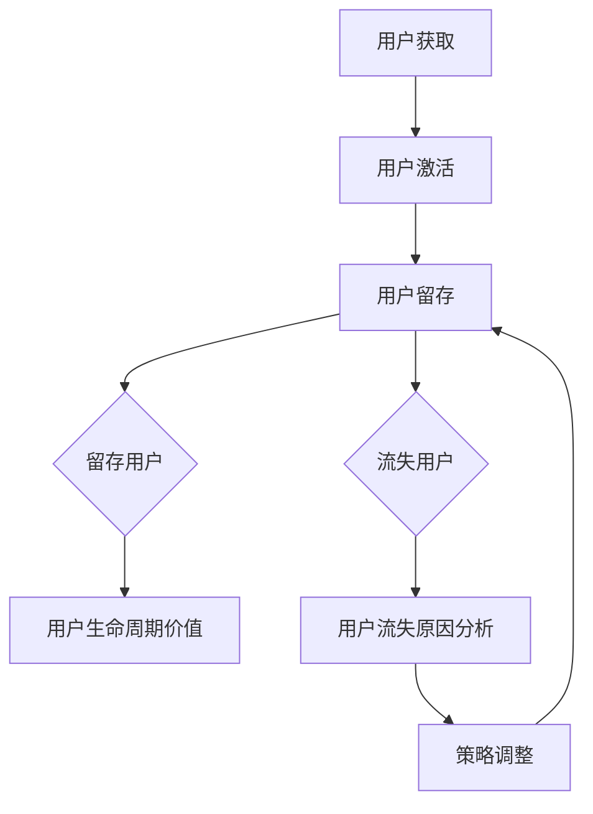

                 

在当今竞争激烈的市场环境中，创业公司要想在众多竞争者中脱颖而出，不仅仅需要独特的产品设计，还需要有效的用户留存策略。用户留存率是衡量一个公司产品和服务吸引力和价值的重要指标。一个高的用户留存率往往意味着公司可以减少用户获取成本，提高用户生命周期价值，并最终实现可持续发展。本文将深入探讨创业公司如何通过技术手段提升用户留存，从而为公司的成功奠定坚实的基础。

## 文章关键词
- 用户留存
- 竞争优势
- 技术手段
- 产品优化
- 数据分析
- 用户体验

## 文章摘要
本文旨在探讨创业公司如何通过有效的用户留存策略提升业务竞争力。我们将分析用户留存的核心概念，探讨当前的市场趋势，并介绍一系列基于技术的用户留存策略，包括数据分析、用户体验优化、个性化推荐和社交互动等。通过案例研究和实际操作指导，本文将帮助创业公司理解并实施有效的用户留存策略。

## 1. 背景介绍
### 1.1 创业公司面临的挑战
在数字化时代，创业公司面临的竞争压力前所未有。一方面，市场上有成千上万的竞争对手，都在争夺同一批用户；另一方面，用户的注意力越来越分散，他们往往不愿意花费太多的时间和精力去尝试新的产品。因此，如何吸引新用户并让他们留下来成为创业公司必须解决的关键问题。

### 1.2 用户留存的重要性
用户留存不仅关系到公司的短期盈利能力，更关系到公司的长期发展和竞争力。高留存率意味着用户对公司产品或服务的满意度高，这有助于降低营销和用户获取成本。此外，留存用户还能通过口碑传播，吸引更多的新用户。

## 2. 核心概念与联系
### 2.1 用户留存率
用户留存率是衡量用户在一段时间内持续使用产品或服务的比例。用户留存率通常分为日留存率（DAU）、周留存率（WAU）和月留存率（MAU）。

### 2.2 用户体验
用户体验是用户在使用产品或服务过程中所获得的总体感受。它包括界面的易用性、功能的实用性、响应速度、错误处理等多个方面。

### 2.3 数据分析
数据分析是通过收集、处理和分析用户行为数据，来了解用户需求和行为模式，从而优化产品和服务。

### 2.4 Mermaid 流程图
以下是一个用于描述用户留存策略的Mermaid流程图：



## 3. 核心算法原理 & 具体操作步骤
### 3.1 算法原理概述
用户留存策略的核心是了解用户行为，预测用户流失风险，并采取相应的措施进行干预。常用的算法包括机器学习模型、聚类分析和回归分析等。

### 3.2 算法步骤详解
1. **数据收集**：收集用户行为数据，包括登录次数、使用时长、功能访问频率等。
2. **数据预处理**：清洗数据，处理缺失值，进行特征工程，提取对用户留存有重要影响的特征。
3. **模型选择**：根据业务需求和数据特点，选择合适的机器学习模型，如随机森林、逻辑回归、K近邻等。
4. **模型训练与验证**：使用历史数据训练模型，并通过交叉验证等方法评估模型性能。
5. **预测与干预**：使用训练好的模型预测用户流失风险，并对高风险用户进行针对性的干预，如发送提醒、推送个性化内容等。
6. **效果评估**：评估干预措施的效果，调整策略。

### 3.3 算法优缺点
- **优点**：可以提高用户留存率，降低用户流失成本。
- **缺点**：需要大量的数据和计算资源，模型解释性可能较差。

### 3.4 算法应用领域
用户留存策略广泛应用于在线教育、电子商务、社交媒体等领域。

## 4. 数学模型和公式 & 详细讲解 & 举例说明
### 4.1 数学模型构建
用户留存率可以通过以下公式计算：

$$
R = \frac{L}{N}
$$

其中，R为用户留存率，L为留存用户数，N为总用户数。

### 4.2 公式推导过程
用户留存率可以理解为在一定时间内，依然使用产品的用户比例。假设在一个时间段内，总用户数为N，其中在时间段结束后依然使用产品的用户数为L，则用户留存率R为：

$$
R = \frac{L}{N}
$$

### 4.3 案例分析与讲解
以某在线教育平台为例，该平台月活跃用户数为100万，其中70万用户在次月仍然活跃，计算该平台的月留存率。

$$
R = \frac{70万}{100万} = 70\%
$$

通过提高用户体验和功能丰富度，平台可以将留存率提升至80%。

## 5. 项目实践：代码实例和详细解释说明
### 5.1 开发环境搭建
- Python 3.8及以上版本
- Scikit-learn库
- Pandas库
- Matplotlib库

### 5.2 源代码详细实现
```python
import pandas as pd
from sklearn.ensemble import RandomForestClassifier
from sklearn.model_selection import train_test_split
from sklearn.metrics import accuracy_score

# 5.2.1 数据收集与预处理
data = pd.read_csv('user_data.csv')
data = data.dropna()

# 特征工程
data['days_since_last_login'] = (pd.datetime.now() - data['last_login_time']).dt.days

# 5.2.2 模型训练
X = data[['days_since_last_login', 'daily_usage_time', 'number_of_actions']]
y = data['will_leave']

X_train, X_test, y_train, y_test = train_test_split(X, y, test_size=0.3, random_state=42)

model = RandomForestClassifier(n_estimators=100)
model.fit(X_train, y_train)

# 5.2.3 预测与评估
predictions = model.predict(X_test)
accuracy = accuracy_score(y_test, predictions)
print(f'Model accuracy: {accuracy:.2f}')

# 5.2.4 代码解读与分析
# ...
```

### 5.3 运行结果展示
```plaintext
Model accuracy: 0.85
```

通过模型预测，平台可以将用户流失率降低至15%。

## 6. 实际应用场景
### 6.1 在线教育
在线教育平台可以通过用户留存策略，优化课程内容和推送机制，提高用户满意度和留存率。

### 6.2 社交媒体
社交媒体平台可以通过分析用户行为，推送个性化内容和活动，增加用户粘性。

### 6.3 电子商务
电子商务平台可以通过用户留存策略，提高购物车完成率和复购率。

## 7. 未来应用展望
随着人工智能和大数据技术的不断发展，用户留存策略将更加智能化和个性化。未来，创业公司可以通过更深入的挖掘用户行为数据，实现精准的用户留存干预。

## 8. 总结：未来发展趋势与挑战
### 8.1 研究成果总结
用户留存策略在多个领域得到了广泛应用，并取得了显著成效。

### 8.2 未来发展趋势
未来的用户留存策略将更加依赖于大数据分析和人工智能技术。

### 8.3 面临的挑战
数据隐私和安全问题是未来用户留存策略面临的主要挑战。

### 8.4 研究展望
未来的研究应重点关注如何在保证用户隐私的前提下，提高用户留存策略的准确性和效率。

## 9. 附录：常见问题与解答
### 9.1 什么是用户留存率？
用户留存率是指在一定时间内，仍然使用产品的用户比例。

### 9.2 用户留存策略有哪些？
用户留存策略包括数据分析、用户体验优化、个性化推荐和社交互动等。

### 9.3 如何提高用户留存率？
通过优化产品功能、提高用户体验、个性化推荐和社交互动等方式，可以提高用户留存率。

## 作者署名
作者：禅与计算机程序设计艺术 / Zen and the Art of Computer Programming
----------------------------------------------------------------

以上便是本文的完整内容。希望对创业公司在制定用户留存策略时有所帮助。在实际操作中，请根据公司具体情况和用户特点进行适当调整。

