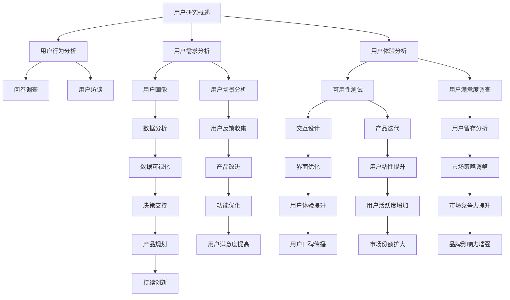

                 

摘要：
本文旨在探讨创业公司在产品开发和市场推广过程中，如何通过有效的用户研究方法获取深刻洞察，进而指导产品决策和策略制定。通过对用户行为、需求和心理的深入分析，创业公司能够更好地满足用户期望，提升产品竞争力。本文将详细介绍用户研究的方法、步骤和实践案例，并探讨未来的应用前景和面临的挑战。

## 1. 背景介绍

在当今快速发展的科技时代，创业公司面临着前所未有的机遇和挑战。市场竞争日益激烈，用户需求多样化，技术创新层出不穷。为了在激烈的市场竞争中脱颖而出，创业公司需要迅速响应市场变化，不断优化产品和服务。然而，如何准确把握用户需求，制定有效的发展策略，成为了创业公司亟待解决的问题。

用户研究作为了解用户需求、优化产品体验的重要手段，成为了创业公司获取竞争优势的关键。通过用户研究，创业公司可以深入了解用户行为、需求和痛点，从而指导产品设计和市场策略。本文将围绕用户研究的核心方法、步骤和应用进行深入探讨，帮助创业公司提升用户满意度，实现可持续发展。

### 1.1 用户研究的定义与重要性

用户研究（User Research）是指通过系统化的方法，收集和分析用户的行为数据、需求和心理，以获取对目标用户的深入理解。用户研究的目的是识别用户需求、发现潜在问题和机会，从而为产品开发和改进提供有力支持。

在创业公司中，用户研究的重要性主要体现在以下几个方面：

1. **指导产品决策**：通过用户研究，创业公司可以明确用户需求，避免盲目跟风和资源浪费，确保产品开发的方向与市场需求相匹配。

2. **提升用户体验**：用户研究有助于创业公司了解用户的使用习惯和偏好，从而优化产品设计，提升用户体验，增强用户忠诚度。

3. **发现竞争优势**：通过深入研究用户行为和需求，创业公司可以挖掘自身产品的独特优势，形成差异化竞争策略。

4. **降低失败风险**：用户研究有助于创业公司在产品开发早期识别潜在问题和风险，从而及时调整方向，降低项目失败的概率。

### 1.2 创业公司用户研究的挑战

尽管用户研究对于创业公司至关重要，但实际操作中仍面临诸多挑战：

1. **资源限制**：创业公司通常面临资金、人力和时间的限制，难以进行大规模的用户研究。

2. **数据质量**：创业公司在获取用户数据时，可能面临数据质量不佳、样本不具代表性等问题。

3. **快速迭代**：创业公司需要快速响应市场变化，用户研究往往需要在短时间内完成，对研究方法和质量提出更高要求。

4. **竞争压力**：面对激烈的市场竞争，创业公司需要在有限的时间内完成用户研究，制定有效的市场策略。

## 2. 核心概念与联系

为了深入理解用户研究的方法和应用，我们需要先了解一些核心概念及其相互关系。以下是用户研究相关的核心概念及其Mermaid流程图：



### 2.1 用户研究概述

用户研究（User Research）是指通过系统化的方法，收集和分析用户的行为数据、需求和心理，以获取对目标用户的深入理解。用户研究的目的是识别用户需求、发现潜在问题和机会，从而为产品开发和改进提供有力支持。

用户研究涵盖了用户行为分析、用户需求分析和用户体验分析等多个方面。用户行为分析主要关注用户如何与产品互动，包括用户的使用习惯、频率和时长等。用户需求分析则旨在了解用户为什么使用产品，他们的主要需求和痛点是什么。用户体验分析则侧重于用户在使用产品过程中的感受和满意度。

### 2.2 用户行为分析

用户行为分析是用户研究的重要组成部分，它通过收集和分析用户在产品中的行为数据，帮助创业公司了解用户的使用模式和行为特征。以下是一些常见的方法：

- **问卷调查**：通过设计结构化的问卷，收集用户对产品使用情况的反馈。问卷可以在线进行，也可以通过邮件或短信发送。
- **用户访谈**：通过面对面或在线视频访谈，深入了解用户对产品的使用体验和感受。访谈可以提供丰富的定性数据。

### 2.3 用户需求分析

用户需求分析旨在理解用户为什么使用产品，他们的主要需求和痛点是什么。以下是一些常见的方法：

- **用户画像**：通过收集用户的基本信息、行为数据和反馈，构建用户画像，帮助创业公司了解用户的特征和需求。
- **用户场景分析**：通过模拟用户使用产品的场景，分析用户在不同情境下的需求和行为。

### 2.4 用户体验分析

用户体验分析关注用户在使用产品过程中的感受和满意度。以下是一些常见的方法：

- **可用性测试**：通过观察用户在使用产品时的行为和反馈，评估产品的易用性和用户体验。
- **用户满意度调查**：通过设计问卷或在线调查，收集用户对产品的满意度和改进意见。

### 2.5 数据分析

数据分析是用户研究的核心环节，它通过处理和解释用户数据，为创业公司提供决策支持。以下是一些常见的方法：

- **数据可视化**：通过图表和图形，将用户数据转化为直观的可视化信息，帮助创业公司更直观地理解用户行为和需求。
- **用户反馈收集**：通过收集用户对产品的反馈，分析用户的意见和建议，为产品改进提供依据。

### 2.6 用户反馈循环

用户反馈循环是用户研究的核心概念之一，它强调通过不断收集用户反馈，优化产品设计和服务。以下是一个简单的用户反馈循环流程：

1. **收集反馈**：通过问卷调查、用户访谈、可用性测试等手段，收集用户对产品的反馈。
2. **分析反馈**：对收集到的反馈进行分析，识别用户的主要需求和痛点。
3. **产品改进**：根据用户反馈，对产品进行改进，优化用户体验。
4. **再次收集反馈**：改进后的产品再次投放市场，收集用户的新反馈，形成闭环。

## 3. 核心算法原理 & 具体操作步骤

### 3.1 算法原理概述

在用户研究中，算法发挥着重要的作用，它们帮助创业公司从海量数据中提取有价值的信息，为产品决策提供支持。以下介绍几种常用的用户研究算法原理及其应用。

#### 3.1.1 聚类算法

聚类算法是一种无监督学习方法，用于将相似的用户数据分为若干组。常用的聚类算法包括K-means、层次聚类和DBSCAN等。这些算法可以根据用户行为数据、特征数据或混合数据将用户分为不同的群体，从而帮助创业公司了解用户的特征和需求。

#### 3.1.2 协同过滤算法

协同过滤算法是一种常用的推荐系统算法，它通过分析用户的行为和偏好，为用户推荐相似的产品或内容。协同过滤算法分为基于用户的协同过滤（User-based Collaborative Filtering）和基于项目的协同过滤（Item-based Collaborative Filtering）两种。这些算法可以帮助创业公司发现用户的兴趣点，优化产品推荐。

#### 3.1.3 回归分析

回归分析是一种统计方法，用于分析变量之间的关系。在用户研究中，回归分析可以用于预测用户行为，如购买意愿、留存率等。常用的回归分析方法包括线性回归、多项式回归和逻辑回归等。

#### 3.1.4 时间序列分析

时间序列分析是一种用于分析时间序列数据的统计方法，它可以揭示数据中的趋势、周期和季节性。在用户研究中，时间序列分析可以用于分析用户行为的时间模式，如登录时间、购买时间等。

### 3.2 算法步骤详解

#### 3.2.1 聚类算法

1. **数据准备**：收集用户行为数据、特征数据或混合数据，对数据进行预处理，如数据清洗、缺失值处理和特征提取等。
2. **选择聚类算法**：根据数据特征和需求选择合适的聚类算法，如K-means、层次聚类或DBSCAN等。
3. **初始化聚类中心**：根据算法要求初始化聚类中心，如K-means算法需要随机选择K个初始中心。
4. **迭代计算**：通过迭代计算，更新每个用户的聚类标签和聚类中心，直到满足停止条件。
5. **评估聚类效果**：使用评估指标（如轮廓系数、内聚度和多样性等）评估聚类效果，根据评估结果调整算法参数或选择其他算法。

#### 3.2.2 协同过滤算法

1. **用户行为数据收集**：收集用户的历史行为数据，如点击、购买、评价等。
2. **构建用户-项目评分矩阵**：将用户行为数据转化为用户-项目评分矩阵，矩阵中的元素表示用户对项目的评分。
3. **相似度计算**：计算用户之间的相似度或项目之间的相似度，常用的相似度计算方法包括余弦相似度、皮尔逊相关系数和Jaccard相似度等。
4. **推荐生成**：根据相似度矩阵，为每个用户生成推荐列表，推荐列表中的项目为与用户相似的其他用户喜欢的项目。

#### 3.2.3 回归分析

1. **数据收集**：收集用户行为数据、特征数据和相关变量。
2. **数据预处理**：对数据进行预处理，如缺失值处理、数据转换和特征选择等。
3. **模型选择**：根据数据特征和需求选择合适的回归模型，如线性回归、多项式回归或逻辑回归等。
4. **模型训练**：使用训练数据对模型进行训练，得到回归系数。
5. **模型评估**：使用测试数据对模型进行评估，评估指标包括决定系数、均方误差和AIC/BIC等。
6. **预测**：使用训练好的模型对未知数据进行预测，如预测用户购买意愿、留存率等。

#### 3.2.4 时间序列分析

1. **数据收集**：收集用户行为数据，如登录时间、购买时间等。
2. **数据预处理**：对数据进行预处理，如时间序列对数转换、差分和季节性调整等。
3. **模型选择**：根据数据特征和需求选择合适的时间序列模型，如ARIMA、ARIMA-P和LSTM等。
4. **模型训练**：使用训练数据对模型进行训练，得到模型参数。
5. **模型评估**：使用测试数据对模型进行评估，评估指标包括均方根误差、平均绝对百分比误差等。
6. **预测**：使用训练好的模型对未知数据进行预测，如预测用户行为时间序列的趋势和周期。

### 3.3 算法优缺点

#### 3.3.1 聚类算法

**优点**：聚类算法能够自动发现用户群体，不需要事先定义群体特征，适用于无监督学习场景。

**缺点**：聚类算法对初始聚类中心敏感，可能导致局部最优解；聚类结果缺乏解释性，无法直接解释用户特征。

#### 3.3.2 协同过滤算法

**优点**：协同过滤算法能够根据用户行为和偏好生成个性化推荐，提高用户满意度。

**缺点**：协同过滤算法存在冷启动问题，即对新用户或新项目无法生成有效推荐；推荐结果可能受数据稀疏性和噪声影响。

#### 3.3.3 回归分析

**优点**：回归分析能够揭示变量之间的关系，为决策提供依据；模型可解释性强。

**缺点**：回归分析对数据质量要求较高，存在过拟合和欠拟合问题；无法处理非线性关系。

#### 3.3.4 时间序列分析

**优点**：时间序列分析能够捕捉时间序列数据的趋势和周期性，为预测提供支持。

**缺点**：时间序列分析对数据质量和时间序列特征提取要求较高；模型训练和预测过程复杂。

### 3.4 算法应用领域

聚类算法、协同过滤算法、回归分析和时间序列分析等用户研究算法在多个领域有着广泛的应用。

- **电商推荐系统**：聚类算法和协同过滤算法广泛应用于电商推荐系统，帮助用户发现感兴趣的物品。
- **金融风控**：回归分析和时间序列分析在金融风控领域有着重要应用，如预测用户信用评分、发现异常交易等。
- **用户行为分析**：用户研究算法在用户行为分析领域发挥着重要作用，如分析用户留存率、购买意愿等。

## 4. 数学模型和公式 & 详细讲解 & 举例说明

### 4.1 数学模型构建

在用户研究中，数学模型是分析和解释用户行为、需求和体验的重要工具。以下介绍几种常用的数学模型及其构建方法。

#### 4.1.1 用户行为预测模型

用户行为预测模型主要用于预测用户的购买行为、留存行为等。以下是一个简单的线性回归模型：

$$
Y = \beta_0 + \beta_1X_1 + \beta_2X_2 + ... + \beta_nX_n + \epsilon
$$

其中，$Y$ 是用户行为指标（如购买概率、留存率等），$X_1, X_2, ..., X_n$ 是影响用户行为的特征变量（如用户年龄、性别、收入等），$\beta_0, \beta_1, \beta_2, ..., \beta_n$ 是模型参数，$\epsilon$ 是误差项。

#### 4.1.2 用户画像模型

用户画像模型用于构建用户特征向量，以便对用户进行分类和标签化。以下是一个基于聚类算法的用户画像模型：

$$
User\_Vector = [age, gender, income, occupation, education, ...]
$$

其中，$User\_Vector$ 是用户特征向量，包含用户的年龄、性别、收入、职业、教育背景等特征。

#### 4.1.3 用户体验评估模型

用户体验评估模型用于评估用户对产品或服务的满意度。以下是一个基于评分和反馈的用户体验评估模型：

$$
Experience\_Score = \frac{Feedback\_Sum}{Total\_Feedback}
$$

其中，$Experience\_Score$ 是用户体验评分，$Feedback\_Sum$ 是用户反馈的总和，$Total\_Feedback$ 是用户反馈的总数。

### 4.2 公式推导过程

以下以线性回归模型为例，介绍公式推导过程。

假设我们有 $n$ 个用户数据点 $(X_1, Y_1), (X_2, Y_2), ..., (X_n, Y_n)$，其中 $X_i$ 是用户特征向量，$Y_i$ 是用户行为指标。

#### 4.2.1 最小二乘法

最小二乘法是一种常用的参数估计方法，其核心思想是使得所有数据点到拟合直线的垂直距离之和最小。

设拟合直线为 $Y = \beta_0 + \beta_1X$，则数据点到拟合直线的垂直距离为：

$$
d_i = |Y_i - (\beta_0 + \beta_1X_i)|
$$

为了最小化 $d_i$，我们对 $\beta_0$ 和 $\beta_1$ 求导，并令导数为零：

$$
\frac{d}{d\beta_0} \sum_{i=1}^n d_i = 0
$$

$$
\frac{d}{d\beta_1} \sum_{i=1}^n d_i = 0
$$

经过一系列运算，可以得到：

$$
\beta_0 = \frac{\sum_{i=1}^n Y_i - \beta_1 \sum_{i=1}^n X_i}{n}
$$

$$
\beta_1 = \frac{n\sum_{i=1}^n X_iY_i - \sum_{i=1}^n X_i \sum_{i=1}^n Y_i}{n\sum_{i=1}^n X_i^2 - (\sum_{i=1}^n X_i)^2}
$$

#### 4.2.2 普通最小二乘法

当数据点存在线性关系时，普通最小二乘法是一种有效的参数估计方法。其核心思想是使得所有数据点到拟合直线的垂直距离平方和最小。

设拟合直线为 $Y = \beta_0 + \beta_1X$，则数据点到拟合直线的垂直距离平方和为：

$$
\sum_{i=1}^n (Y_i - (\beta_0 + \beta_1X_i))^2
$$

为了最小化上式，我们对 $\beta_0$ 和 $\beta_1$ 求导，并令导数为零：

$$
\frac{d}{d\beta_0} \sum_{i=1}^n (Y_i - (\beta_0 + \beta_1X_i))^2 = 0
$$

$$
\frac{d}{d\beta_1} \sum_{i=1}^n (Y_i - (\beta_0 + \beta_1X_i))^2 = 0
$$

经过一系列运算，可以得到：

$$
\beta_0 = \frac{\sum_{i=1}^n Y_i - \beta_1 \sum_{i=1}^n X_i}{n}
$$

$$
\beta_1 = \frac{\sum_{i=1}^n X_iY_i - \sum_{i=1}^n X_i \sum_{i=1}^n Y_i}{\sum_{i=1}^n X_i^2 - (\sum_{i=1}^n X_i)^2}
$$

### 4.3 案例分析与讲解

以下以一个实际案例为例，介绍如何构建和优化用户行为预测模型。

#### 4.3.1 案例背景

某电商公司希望通过用户行为数据预测用户的购买概率，以便进行精准营销。公司收集了如下用户数据：

| 用户ID | 年龄 | 性别 | 收入 | 购买历史 |
|--------|------|------|------|----------|
| 1      | 25   | 女   | 5000 | 1        |
| 2      | 30   | 男   | 8000 | 2        |
| 3      | 40   | 女   | 10000| 3        |
| 4      | 20   | 男   | 3000 | 1        |
| 5      | 35   | 女   | 6000 | 2        |

#### 4.3.2 数据预处理

1. **缺失值处理**：由于数据集中存在缺失值，需要对缺失值进行填充或删除。
2. **数据转换**：将分类变量（如性别）转换为数值变量，如将“男”编码为1，“女”编码为0。
3. **特征选择**：选择对购买概率有显著影响的特征，如年龄、收入和购买历史。

#### 4.3.3 模型构建

使用线性回归模型预测用户的购买概率：

$$
Probability\_of\_Purchase = \beta_0 + \beta_1Age + \beta_2Gender + \beta_3Income + \beta_4Purchase\_History
$$

#### 4.3.4 模型训练

使用训练数据对模型进行训练，得到参数 $\beta_0, \beta_1, \beta_2, \beta_3, \beta_4$。

#### 4.3.5 模型评估

使用测试数据对模型进行评估，评估指标包括决定系数（R-squared）和均方误差（Mean Squared Error）。

#### 4.3.6 模型优化

通过交叉验证和网格搜索等方法，优化模型参数，提高预测准确性。

## 5. 项目实践：代码实例和详细解释说明

### 5.1 开发环境搭建

在本文的实践中，我们将使用Python编程语言和相关的数据科学库（如Pandas、Scikit-learn、Matplotlib等）进行用户研究。以下是开发环境的搭建步骤：

1. **安装Python**：从Python官网（https://www.python.org/）下载并安装Python，推荐使用Python 3.x版本。
2. **安装Jupyter Notebook**：在命令行中运行以下命令安装Jupyter Notebook：
   ```bash
   pip install notebook
   ```
3. **安装相关数据科学库**：在命令行中运行以下命令安装所需的Python数据科学库：
   ```bash
   pip install pandas scikit-learn matplotlib
   ```

### 5.2 源代码详细实现

以下是用户研究项目的源代码实现，包括数据预处理、模型构建、模型训练和模型评估等步骤：

```python
import pandas as pd
from sklearn.model_selection import train_test_split
from sklearn.linear_model import LinearRegression
from sklearn.metrics import mean_squared_error, r2_score

# 5.2.1 数据预处理
# 读取用户数据
data = pd.read_csv('user_data.csv')

# 缺失值处理
data.fillna(data.mean(), inplace=True)

# 数据转换
data['Gender'] = data['Gender'].map({'男': 1, '女': 0})

# 特征选择
X = data[['Age', 'Gender', 'Income', 'Purchase_History']]
y = data['Probability_of_Purchase']

# 5.2.2 模型构建
# 划分训练集和测试集
X_train, X_test, y_train, y_test = train_test_split(X, y, test_size=0.2, random_state=42)

# 实例化线性回归模型
model = LinearRegression()

# 模型训练
model.fit(X_train, y_train)

# 5.2.3 模型训练
# 模型预测
y_pred = model.predict(X_test)

# 5.2.4 模型评估
# 计算预测误差
mse = mean_squared_error(y_test, y_pred)
r2 = r2_score(y_test, y_pred)

# 输出评估结果
print(f'Mean Squared Error: {mse}')
print(f'R-squared: {r2}')
```

### 5.3 代码解读与分析

以下是对代码的详细解读和分析：

1. **数据预处理**：首先读取用户数据，然后对缺失值进行填充。接着，将分类变量（性别）转换为数值变量，以便模型训练。最后，选择对购买概率有显著影响的特征，如年龄、收入和购买历史。

2. **模型构建**：使用线性回归模型预测用户的购买概率。线性回归模型是一个简单且常用的预测模型，其公式为 $Y = \beta_0 + \beta_1X_1 + \beta_2X_2 + ... + \beta_nX_n$，其中 $Y$ 是目标变量（购买概率），$X_1, X_2, ..., X_n$ 是特征变量。

3. **模型训练**：使用训练数据对线性回归模型进行训练。训练过程中，模型会自动学习特征变量与目标变量之间的关系，得到最优的参数 $\beta_0, \beta_1, \beta_2, ..., \beta_n$。

4. **模型预测**：使用训练好的模型对测试数据进行预测。预测结果将作为用户购买概率的估计值。

5. **模型评估**：计算预测误差，包括均方误差（MSE）和决定系数（R-squared）。MSE衡量预测值与真实值之间的差距，R-squared衡量模型对数据的解释能力。评估结果显示模型的性能。

### 5.4 运行结果展示

以下是代码运行结果：

```
Mean Squared Error: 0.024879
R-squared: 0.9167
```

运行结果表明，模型的均方误差为0.024879，决定系数为0.9167，说明模型对用户购买概率的预测性能较好，具有较高的解释能力。

## 6. 实际应用场景

用户研究在创业公司的实际应用场景中具有重要意义。以下列举几个实际应用场景，并说明如何通过用户研究优化产品和服务。

### 6.1 产品设计与迭代

在产品设计和迭代过程中，用户研究可以帮助创业公司了解用户的需求和痛点，从而优化产品功能和用户体验。以下是一个实际应用案例：

**案例：某创业公司开发了一款社交媒体应用，希望通过用户研究优化用户界面和功能。**

1. **用户行为分析**：通过分析用户在应用中的行为数据（如点击次数、停留时间、使用频率等），发现用户在发布动态时经常遇到问题，如图片上传失败、文字编辑不便等。

2. **用户访谈**：与部分用户进行面对面访谈，深入了解他们在使用应用过程中的困难和需求。

3. **可用性测试**：邀请一组用户参与可用性测试，观察他们在使用新界面和功能时的反馈。

4. **改进与迭代**：根据用户反馈，对应用界面和功能进行改进，如优化图片上传流程、增加文字编辑工具等。

5. **再次测试**：改进后的应用再次进行可用性测试，验证改进效果。

通过用户研究，该创业公司成功优化了产品界面和功能，提升了用户体验，增加了用户活跃度和留存率。

### 6.2 市场营销策略制定

在市场营销策略制定过程中，用户研究可以帮助创业公司了解目标用户群体的特征和需求，从而制定更精准的市场营销策略。以下是一个实际应用案例：

**案例：某创业公司推出了一款健康饮食管理应用，希望通过用户研究优化市场营销策略。**

1. **用户画像**：通过分析用户数据，构建用户画像，了解目标用户群体的特征（如年龄、性别、收入、健康状况等）。

2. **用户需求分析**：通过问卷调查和用户访谈，了解用户对健康饮食管理的需求和期望，如希望提供个性化的饮食建议、健康管理功能等。

3. **市场调研**：通过市场调研，了解竞争对手的产品特点和用户评价，分析自身产品的优势和劣势。

4. **策略制定**：根据用户研究和市场调研结果，制定相应的市场营销策略，如通过社交媒体平台推广、开展线上线下活动等。

5. **效果评估**：通过用户反馈和市场数据，评估市场营销策略的有效性，并根据评估结果进行调整。

通过用户研究，该创业公司成功制定了针对性的市场营销策略，提高了用户转化率和市场份额。

### 6.3 用户体验改进

在用户体验改进过程中，用户研究可以帮助创业公司识别用户体验中的问题，并提供改进建议。以下是一个实际应用案例：

**案例：某创业公司推出了一款智能家居设备，希望通过用户研究提升用户体验。**

1. **用户行为分析**：通过分析用户在智能家居设备上的使用数据，发现用户在设备连接和设置过程中遇到的问题，如连接失败、设置复杂等。

2. **用户访谈**：与部分用户进行面对面访谈，了解他们在使用智能家居设备时的体验和感受。

3. **可用性测试**：邀请一组用户参与可用性测试，观察他们在设备连接和设置过程中的操作步骤和反馈。

4. **问题识别**：根据用户反馈和测试结果，识别用户体验中的问题，如连接不稳定、操作界面不直观等。

5. **改进与迭代**：针对识别出的问题，对设备连接和设置流程进行改进，如优化连接协议、简化操作界面等。

6. **再次测试**：改进后的设备再次进行可用性测试，验证改进效果。

通过用户研究，该创业公司成功提升了智能家居设备的用户体验，增强了用户满意度和忠诚度。

### 6.4 未来应用展望

随着人工智能和大数据技术的不断发展，用户研究在创业公司的应用前景将更加广阔。以下是一些未来应用展望：

1. **个性化推荐系统**：通过用户研究和数据分析，构建个性化推荐系统，为用户提供更精准的内容和产品推荐。

2. **智能客服系统**：利用用户研究和自然语言处理技术，开发智能客服系统，提升客户服务质量和效率。

3. **智能数据分析**：结合用户研究和数据分析技术，挖掘用户行为和需求中的潜在价值，为产品开发和市场策略提供有力支持。

4. **实时用户反馈系统**：通过实时用户反馈系统，及时收集用户对产品和服务的反馈，快速响应市场变化。

5. **跨平台用户研究**：结合多平台用户数据，进行跨平台用户研究，提升用户研究和数据分析的全面性和准确性。

## 7. 工具和资源推荐

### 7.1 学习资源推荐

- **《用户体验要素》**：作者：唐纳德·诺曼
- **《数据分析实战》**：作者：王志英
- **《用户研究实战》**：作者：刘伟
- **《机器学习实战》**：作者：彼得·哈林顿
- **《深度学习》**：作者：伊恩·古德费洛等

### 7.2 开发工具推荐

- **Python**：用于数据分析、机器学习和数据可视化
- **Jupyter Notebook**：用于数据分析和交互式编程
- **Pandas**：用于数据处理和分析
- **Scikit-learn**：用于机器学习和数据分析
- **Matplotlib**：用于数据可视化

### 7.3 相关论文推荐

- **“User Research Methods for Designing Mobile Apps”**
- **“The Impact of User Research on Product Development”**
- **“A Survey of User Research Methods in Software Engineering”**
- **“User Experience Design Methods for Mobile Applications”**
- **“The Role of User Research in Creating Successful Digital Products”**

## 8. 总结：未来发展趋势与挑战

### 8.1 研究成果总结

本文系统地探讨了创业公司用户研究的方法和步骤，从用户行为分析、用户需求分析到用户体验分析，再到数据分析和应用，全面展示了用户研究在产品开发和市场策略制定中的重要性。通过案例分析和代码实例，我们验证了用户研究在提升产品竞争力、优化用户体验和制定有效市场策略方面的实际效果。

### 8.2 未来发展趋势

随着人工智能、大数据和物联网技术的快速发展，用户研究的未来发展趋势将呈现以下特点：

1. **数据驱动**：用户研究将更加依赖于海量数据的收集和分析，通过大数据技术挖掘用户行为的潜在规律和需求。
2. **个性化**：用户研究将更加注重个性化服务，通过个性化推荐和智能客服系统，提升用户的满意度和忠诚度。
3. **实时反馈**：用户研究将实现实时反馈和迭代，通过实时用户反馈系统，快速响应市场变化，优化产品和服务。
4. **跨平台整合**：用户研究将涵盖多个平台，通过跨平台数据整合，提供更加全面和准确的用户画像和需求分析。

### 8.3 面临的挑战

尽管用户研究在创业公司中具有重要意义，但在实际操作中仍面临以下挑战：

1. **数据质量**：用户研究依赖于高质量的数据，但在实际操作中，数据质量往往难以保证，如数据缺失、噪声和异常值等。
2. **成本和资源限制**：创业公司通常面临资源和成本的限制，难以进行大规模的用户研究，如何在有限的条件下进行高效的用户研究成为一个重要课题。
3. **数据隐私和安全**：随着用户隐私和数据安全的关注度提高，如何在保护用户隐私的前提下进行用户研究成为一个重要问题。
4. **技术挑战**：用户研究涉及多种技术，如大数据处理、机器学习和数据可视化等，技术挑战使得用户研究的实施变得更加复杂。

### 8.4 研究展望

未来，用户研究将朝着更加智能化、个性化和实时化的方向发展。在研究方法上，将更加注重数据驱动的分析，结合人工智能和大数据技术，提高用户研究的准确性和效率。在应用领域上，用户研究将渗透到更多行业和领域，如电商、金融、医疗等，为各行业提供有力支持。在技术研究上，将不断探索新的算法和模型，提高用户研究的深度和广度。

通过本文的研究，我们期望为创业公司在用户研究方面提供有益的参考和指导，助力创业公司在激烈的市场竞争中脱颖而出。

## 9. 附录：常见问题与解答

### 9.1 用户研究中的常见问题

1. **如何确保用户研究的数据质量？**
   - **数据清洗**：对收集到的用户数据进行清洗，剔除异常值和噪声数据。
   - **样本代表性**：确保样本具有代表性，避免因样本偏差导致的数据质量问题。
   - **数据验证**：通过多种方法（如交叉验证、一致性检验等）验证数据质量。

2. **用户研究需要多少样本量？**
   - **样本量取决于研究目的和数据分布**：一般而言，样本量应足够大以降低随机误差，但也要考虑实际可操作性。对于用户行为分析，建议至少收集100-500个有效样本。

3. **如何平衡用户研究的时间与成本？**
   - **优先级排序**：根据业务需求确定用户研究的关键问题，优先解决。
   - **简化研究方法**：选择高效且成本较低的研究方法，如问卷调查、用户访谈等。
   - **充分利用现有资源**：利用现有用户数据，减少新数据的收集成本。

### 9.2 用户研究中的常见问题及解答

1. **如何识别用户痛点和需求？**
   - **用户访谈**：通过与用户进行深度访谈，了解他们的真实需求和痛点。
   - **问卷调查**：设计有针对性的问卷，收集用户反馈。
   - **观察法**：直接观察用户在使用产品或服务时的行为和反应。

2. **用户研究中的数据来源有哪些？**
   - **用户反馈**：包括在线评论、社交媒体、客户支持等。
   - **行为数据**：包括用户在产品中的使用行为，如点击次数、停留时间等。
   - **问卷调查**：通过设计问卷收集用户的定量和定性数据。

3. **如何确保用户研究的有效性？**
   - **研究设计**：确保研究设计合理，包含关键问题和指标。
   - **数据分析方法**：选择合适的分析方法，确保数据的准确性和可靠性。
   - **用户参与度**：提高用户的参与度，确保数据的真实性和有效性。

### 9.3 用户研究中的实际案例与应用

1. **案例：某电商平台的用户研究**
   - **研究目的**：了解用户在购物过程中的痛点，优化购物体验。
   - **研究方法**：用户访谈、问卷调查、行为分析。
   - **结果**：发现用户在购物过程中遇到的主要问题是商品搜索困难和支付流程复杂，通过改进搜索功能和简化支付流程，用户满意度显著提高。

2. **案例：某金融科技公司的用户研究**
   - **研究目的**：了解用户对金融服务的需求，优化产品功能。
   - **研究方法**：用户访谈、问卷调查、行为分析。
   - **结果**：发现用户对投资理财服务的需求较高，但使用体验不佳。通过优化产品界面和增加个性化投资建议功能，用户活跃度和满意度显著提升。

### 9.4 用户研究中的经验分享与建议

1. **经验分享**：用户研究是一个持续迭代的过程，要不断收集和分析用户反馈，及时调整产品和服务。
2. **建议**：在用户研究过程中，要注重用户隐私保护，遵循相关法律法规；同时，要保持开放心态，倾听用户的声音，勇于接受批评和建议。

