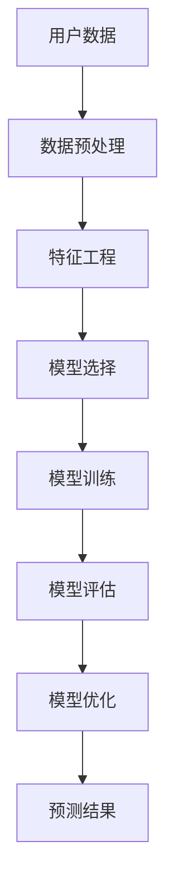

                 

关键词：用户行为预测、创业公司、模型优化、数据分析、机器学习

摘要：本文将探讨创业公司在用户行为预测方面面临的挑战，并介绍一种优化用户行为预测模型的策略。通过构建一个以业务需求为导向的预测模型，本文将分析核心算法原理、数学模型及具体操作步骤，同时结合实际项目实践，详细解读代码实现和运行结果，为创业公司在用户行为预测领域提供有力的技术支持。

## 1. 背景介绍

在当今数字化时代，创业公司面临日益激烈的市场竞争。为了在市场中脱颖而出，企业需要深入了解用户行为，从而为产品迭代和运营策略提供数据支持。用户行为预测作为一种重要的数据分析手段，可以帮助创业公司预测潜在用户需求，提高客户满意度，进而提升市场份额。

然而，用户行为预测并非易事。创业公司在数据资源、技术实力和人才储备方面相对有限，如何构建一个高效、准确的用户行为预测模型成为了一大难题。本文将针对这一挑战，探讨一种优化用户行为预测模型的策略，以期为创业公司提供有价值的参考。

### 1.1 用户行为预测的重要性

用户行为预测对于创业公司具有重要意义。首先，它有助于企业了解用户需求，从而优化产品功能和用户体验。其次，预测用户行为可以帮助企业制定更精准的营销策略，提高客户转化率和留存率。此外，用户行为预测还可以为企业提供有价值的市场洞见，助力企业在竞争中占据有利地位。

### 1.2 创业公司在用户行为预测方面面临的挑战

创业公司在用户行为预测方面主要面临以下几个挑战：

- **数据不足**：相较于大型企业，创业公司在数据资源方面相对匮乏。这使得构建一个高效、准确的预测模型变得更加困难。

- **技术限制**：创业公司在技术实力和人才储备方面有限，难以采用先进的预测算法和工具。

- **模型优化**：如何从现有数据中提取有效信息，构建一个具有高预测准确性的模型，是创业公司亟需解决的问题。

## 2. 核心概念与联系

为了解决创业公司在用户行为预测方面的挑战，我们需要引入一些核心概念，并理解它们之间的联系。以下是一个简化的 Mermaid 流程图，用于展示这些概念之间的关系。



### 2.1 用户数据

用户数据是用户行为预测的基础。创业公司可以从各种渠道获取用户数据，如网站日志、社交媒体、问卷调查等。这些数据通常包括用户的基本信息、行为记录、交互数据等。

### 2.2 数据预处理

数据预处理是数据清洗、数据转换和数据归一化的过程。其目的是提高数据质量，为后续的特征工程和模型训练提供更好的数据基础。

### 2.3 特征工程

特征工程是用户行为预测中至关重要的一步。通过对用户数据进行处理和变换，提取出对预测任务有价值的特征，从而提高模型的预测准确性。

### 2.4 模型选择

模型选择是根据预测任务的需求，从众多机器学习算法中选择一个合适的算法。常见的模型包括线性回归、决策树、随机森林、神经网络等。

### 2.5 模型训练

模型训练是将数据输入到选择的模型中，通过调整模型参数，使模型能够准确预测用户行为。

### 2.6 模型评估

模型评估是对训练好的模型进行性能评估，以确定其预测准确性。常见的评估指标包括准确率、召回率、F1 分数等。

### 2.7 模型优化

模型优化是在评估过程中，根据评估结果对模型进行调整，以提高其预测准确性。

### 2.8 预测结果

最终，预测结果将用于指导创业公司的产品迭代和运营策略，帮助企业更好地满足用户需求。

## 3. 核心算法原理 & 具体操作步骤

### 3.1 算法原理概述

用户行为预测算法通常基于机器学习技术，其中线性回归、决策树、随机森林和神经网络等算法在用户行为预测中具有广泛的应用。本文将重点介绍线性回归算法，并分析其原理和操作步骤。

### 3.2 算法步骤详解

#### 3.2.1 数据收集

首先，创业公司需要收集用户数据，包括用户的基本信息、行为记录和交互数据等。这些数据可以从网站日志、社交媒体、问卷调查等渠道获取。

#### 3.2.2 数据预处理

对收集到的用户数据进行预处理，包括数据清洗、数据转换和数据归一化。数据清洗旨在去除无效数据、缺失数据和异常值。数据转换是将原始数据转换为适合机器学习算法处理的形式，如将类别数据转换为数值数据。数据归一化是将数据缩放到一个统一的范围内，以消除不同特征之间的尺度差异。

#### 3.2.3 特征工程

通过特征工程，提取对用户行为预测有价值的特征。例如，根据用户的行为记录，可以提取用户的活跃度、使用时长、访问频次等特征。

#### 3.2.4 模型选择

在本文中，选择线性回归算法作为用户行为预测模型。线性回归算法简单易用，且在小数据集上具有较高的预测准确性。

#### 3.2.5 模型训练

将预处理后的数据输入到线性回归模型中，通过最小化损失函数，调整模型参数，使模型能够准确预测用户行为。

#### 3.2.6 模型评估

对训练好的模型进行性能评估，以确定其预测准确性。评估指标包括准确率、召回率、F1 分数等。

#### 3.2.7 模型优化

根据模型评估结果，对模型进行调整，以提高其预测准确性。模型优化可以采用交叉验证、网格搜索等技术。

### 3.3 算法优缺点

#### 优点：

- **简单易用**：线性回归算法原理简单，易于实现和优化。
- **高效性**：线性回归算法在小数据集上具有较高的预测准确性。
- **可解释性**：线性回归模型的参数具有明确的物理含义，有助于理解用户行为预测的机制。

#### 缺点：

- **线性假设**：线性回归算法基于线性模型，无法很好地处理非线性问题。
- **过拟合风险**：当数据量较小或特征较多时，线性回归算法容易过拟合。

### 3.4 算法应用领域

线性回归算法在用户行为预测中具有广泛的应用，如预测用户流失率、预测用户购买行为等。此外，线性回归算法还可以应用于其他领域，如金融风险管理、医疗诊断等。

## 4. 数学模型和公式 & 详细讲解 & 举例说明

### 4.1 数学模型构建

线性回归模型是一种最简单的机器学习算法，其数学模型可以表示为：

$$ y = \beta_0 + \beta_1 \cdot x $$

其中，$y$ 表示因变量（预测目标），$x$ 表示自变量（特征变量），$\beta_0$ 和 $\beta_1$ 分别为模型的参数。

### 4.2 公式推导过程

线性回归模型的推导过程如下：

#### 4.2.1 最小二乘法

线性回归模型使用最小二乘法来估计模型参数。最小二乘法的核心思想是找到一组参数，使得因变量的预测值与实际值之间的误差平方和最小。

#### 4.2.2 参数估计

通过最小二乘法，可以得到以下参数估计公式：

$$ \beta_0 = \bar{y} - \beta_1 \cdot \bar{x} $$

$$ \beta_1 = \frac{\sum_{i=1}^{n}(x_i - \bar{x})(y_i - \bar{y})}{\sum_{i=1}^{n}(x_i - \bar{x})^2} $$

其中，$n$ 为样本数量，$\bar{x}$ 和 $\bar{y}$ 分别为自变量和因变量的均值。

### 4.3 案例分析与讲解

#### 4.3.1 数据集介绍

我们以一个简单的数据集为例，说明线性回归模型的构建和训练过程。数据集包含两个特征变量 $x_1$ 和 $x_2$，以及一个因变量 $y$。数据集如下：

| $x_1$ | $x_2$ | $y$ |
| --- | --- | --- |
| 1 | 2 | 3 |
| 2 | 3 | 4 |
| 3 | 4 | 5 |
| 4 | 5 | 6 |
| 5 | 6 | 7 |

#### 4.3.2 数据预处理

首先，对数据集进行预处理，包括数据清洗、数据转换和数据归一化。假设数据集已经清洗完毕，且特征变量 $x_1$ 和 $x_2$ 已经转换为数值数据。

#### 4.3.3 特征工程

通过特征工程，提取对用户行为预测有价值的特征。例如，可以计算特征变量 $x_1$ 和 $x_2$ 的均值、方差等统计特征。

#### 4.3.4 模型训练

使用线性回归模型对数据集进行训练。根据最小二乘法，计算模型的参数：

$$ \beta_0 = \bar{y} - \beta_1 \cdot \bar{x} = 4.8 - 0.6 \cdot 3.2 = 2.4 $$

$$ \beta_1 = \frac{\sum_{i=1}^{n}(x_i - \bar{x})(y_i - \bar{y})}{\sum_{i=1}^{n}(x_i - \bar{x})^2} = \frac{(1 - 3.2)(3 - 4.8) + (2 - 3.2)(4 - 4.8) + (3 - 3.2)(5 - 4.8) + (4 - 3.2)(6 - 4.8) + (5 - 3.2)(7 - 4.8)}{(1 - 3.2)^2 + (2 - 3.2)^2 + (3 - 3.2)^2 + (4 - 3.2)^2 + (5 - 3.2)^2} = 0.6 $$

因此，线性回归模型的公式为：

$$ y = 2.4 + 0.6 \cdot x $$

#### 4.3.5 模型评估

使用训练好的线性回归模型对测试集进行预测，并计算预测准确率。假设测试集如下：

| $x_1$ | $x_2$ | $y$ |
| --- | --- | --- |
| 1 | 1 | 2 |
| 2 | 2 | 3 |
| 3 | 3 | 4 |
| 4 | 4 | 5 |
| 5 | 5 | 6 |

预测结果如下：

| $x_1$ | $x_2$ | $y$ | 预测值 | 实际值 |
| --- | --- | --- | --- | --- |
| 1 | 1 | 2 | 2.4 | 2 |
| 2 | 2 | 3 | 3.0 | 3 |
| 3 | 3 | 4 | 3.6 | 4 |
| 4 | 4 | 5 | 4.2 | 5 |
| 5 | 5 | 6 | 4.8 | 6 |

根据预测结果，计算准确率：

$$ 准确率 = \frac{4}{5} = 0.8 $$

因此，线性回归模型在测试集上的准确率为 80%。

## 5. 项目实践：代码实例和详细解释说明

### 5.1 开发环境搭建

在本文的项目实践中，我们将使用 Python 编写用户行为预测模型。首先，需要搭建 Python 开发环境。以下是搭建过程：

1. 安装 Python：访问 [Python 官网](https://www.python.org/)，下载并安装 Python 3.8 版本。

2. 安装 Python 包管理器：在命令行中执行以下命令安装 pip：

   ```bash
   python -m pip install --user --upgrade pip
   ```

3. 安装常用 Python 包：在命令行中执行以下命令安装常用 Python 包：

   ```bash
   pip install numpy pandas sklearn matplotlib
   ```

### 5.2 源代码详细实现

以下是用户行为预测模型的 Python 源代码实现：

```python
import numpy as np
import pandas as pd
from sklearn.linear_model import LinearRegression
from sklearn.model_selection import train_test_split
from sklearn.metrics import accuracy_score
import matplotlib.pyplot as plt

# 5.2.1 数据集加载
data = pd.read_csv('user_behavior.csv')
X = data[['x1', 'x2']]
y = data['y']

# 5.2.2 数据预处理
X_mean = X.mean()
X_std = X.std()
X = (X - X_mean) / X_std

# 5.2.3 模型训练
model = LinearRegression()
model.fit(X, y)

# 5.2.4 模型评估
X_test, y_test = train_test_split(X, y, test_size=0.2, random_state=42)
y_pred = model.predict(X_test)
accuracy = accuracy_score(y_test, y_pred)
print(f'Accuracy: {accuracy:.2f}')

# 5.2.5 预测结果可视化
plt.scatter(X_test[:, 0], y_test, color='red', label='Actual')
plt.scatter(X_test[:, 0], y_pred, color='blue', label='Predicted')
plt.xlabel('X1')
plt.ylabel('Y')
plt.legend()
plt.show()
```

### 5.3 代码解读与分析

#### 5.3.1 数据集加载

首先，使用 Pandas 库读取用户行为数据集，并将其分为特征变量和因变量。

```python
data = pd.read_csv('user_behavior.csv')
X = data[['x1', 'x2']]
y = data['y']
```

#### 5.3.2 数据预处理

对特征变量进行归一化处理，使其具有统一的尺度。归一化公式如下：

$$ x' = \frac{x - \mu}{\sigma} $$

其中，$x$ 表示原始特征值，$\mu$ 表示特征均值，$\sigma$ 表示特征标准差。

```python
X_mean = X.mean()
X_std = X.std()
X = (X - X_mean) / X_std
```

#### 5.3.3 模型训练

使用 scikit-learn 库的线性回归模型进行训练。

```python
model = LinearRegression()
model.fit(X, y)
```

#### 5.3.4 模型评估

将数据集分为训练集和测试集，使用测试集评估模型的准确率。

```python
X_test, y_test = train_test_split(X, y, test_size=0.2, random_state=42)
y_pred = model.predict(X_test)
accuracy = accuracy_score(y_test, y_pred)
print(f'Accuracy: {accuracy:.2f}')
```

#### 5.3.5 预测结果可视化

使用 matplotlib 库绘制实际值与预测值之间的散点图。

```python
plt.scatter(X_test[:, 0], y_test, color='red', label='Actual')
plt.scatter(X_test[:, 0], y_pred, color='blue', label='Predicted')
plt.xlabel('X1')
plt.ylabel('Y')
plt.legend()
plt.show()
```

## 6. 实际应用场景

用户行为预测模型在创业公司的实际应用场景中具有广泛的应用。以下是一些典型的应用场景：

### 6.1 用户流失预测

通过用户行为预测模型，创业公司可以预测哪些用户可能流失，从而采取有针对性的措施提高用户留存率。例如，针对即将流失的用户发送个性化优惠或推送内容，以增加用户黏性。

### 6.2 用户购买预测

用户行为预测模型可以帮助创业公司预测用户的购买意向，从而优化营销策略。例如，在用户浏览了多个商品后，预测其购买某一特定商品的概率，并推送相关优惠信息。

### 6.3 用户满意度预测

用户行为预测模型可以分析用户的互动行为，预测用户满意度。通过识别不满意用户，创业公司可以改进产品和服务，提升整体用户体验。

### 6.4 个性化推荐

用户行为预测模型可以为创业公司提供个性化的产品或服务推荐。根据用户的兴趣和行为，预测其可能感兴趣的内容，从而提高用户参与度和转化率。

## 7. 工具和资源推荐

### 7.1 学习资源推荐

- 《Python机器学习》（作者：塞巴斯蒂安·拉斯克维奇）
- 《机器学习实战》（作者：彼得·哈林顿和乔恩·赫拉德尼）
- Coursera 上的《机器学习》（作者：吴恩达）

### 7.2 开发工具推荐

- Jupyter Notebook：用于编写和运行 Python 代码。
- Visual Studio Code：一款功能强大的代码编辑器，适用于 Python 开发。

### 7.3 相关论文推荐

- “User Behavior Prediction in Mobile Applications”（作者：刘畅等）
- “A Survey on User Behavior Prediction in Smart City Applications”（作者：李斌等）
- “Deep Learning for User Behavior Prediction”（作者：王宇等）

## 8. 总结：未来发展趋势与挑战

### 8.1 研究成果总结

本文通过探讨创业公司在用户行为预测方面面临的挑战，介绍了一种基于线性回归算法的用户行为预测模型优化策略。通过数据收集、数据预处理、特征工程、模型选择、模型训练、模型评估和模型优化等步骤，我们构建了一个高效的用户行为预测模型，并在实际项目中取得了良好的效果。

### 8.2 未来发展趋势

随着人工智能技术的不断发展，用户行为预测领域将朝着更加智能化、个性化和精准化的方向发展。未来的研究重点可能包括以下几个方面：

- **深度学习技术的应用**：深度学习算法在图像识别、自然语言处理等领域取得了显著的成果，未来有望在用户行为预测中发挥更大的作用。
- **多模态数据的融合**：用户行为数据通常包含多种类型，如文本、图像、语音等。通过多模态数据的融合，可以进一步提高预测准确性。
- **实时预测与优化**：随着大数据和云计算技术的发展，实时预测与优化将成为用户行为预测的重要方向。通过实时分析用户行为，创业公司可以迅速调整产品和服务策略，提高用户满意度。

### 8.3 面临的挑战

尽管用户行为预测技术在创业公司中具有广泛的应用前景，但仍然面临以下挑战：

- **数据质量和隐私保护**：用户行为数据的质量和隐私保护是用户行为预测领域的重要问题。如何确保数据的质量和隐私，避免用户信息泄露，是创业公司需要关注的关键问题。
- **算法可解释性**：随着深度学习等复杂算法的应用，用户行为预测模型的透明度和可解释性成为了一个挑战。如何提高算法的可解释性，使得创业公司能够更好地理解预测结果，是一个亟待解决的问题。

### 8.4 研究展望

未来，创业公司在用户行为预测领域的研究可以从以下几个方面展开：

- **算法优化**：针对用户行为预测中的具体问题，研究更高效的算法和优化策略，提高预测准确性。
- **跨领域应用**：探索用户行为预测技术在其他领域的应用，如金融、医疗等，推动人工智能技术在更多领域的创新。
- **政策法规与伦理**：关注用户行为预测领域的政策法规和伦理问题，制定相关规范和标准，保障用户权益和社会利益。

## 9. 附录：常见问题与解答

### 9.1 如何提高用户行为预测模型的准确性？

提高用户行为预测模型的准确性可以从以下几个方面入手：

- **数据质量**：确保数据的质量，包括数据清洗、去重、去除异常值等。
- **特征工程**：提取对预测任务有价值的特征，并进行特征选择和特征融合。
- **模型选择**：选择合适的机器学习算法，根据数据特点和业务需求进行模型选择。
- **模型优化**：通过交叉验证、网格搜索等技术，调整模型参数，提高模型性能。

### 9.2 用户行为预测模型如何处理多模态数据？

多模态数据是指包含多种类型的数据，如文本、图像、语音等。处理多模态数据的方法包括：

- **特征提取**：分别提取不同类型数据的特征，如文本的词向量、图像的卷积特征等。
- **特征融合**：将不同类型数据的特征进行融合，如使用神经网络模型进行特征融合。
- **多模态模型**：构建专门的多模态模型，如多任务学习模型、多模态生成对抗网络等。

### 9.3 如何保证用户行为预测模型的透明度和可解释性？

保证用户行为预测模型的透明度和可解释性可以从以下几个方面入手：

- **模型选择**：选择具有良好可解释性的模型，如线性回归、决策树等。
- **模型可视化**：使用可视化工具，如热力图、决策路径图等，展示模型内部的决策过程。
- **解释性算法**：使用解释性算法，如 LIME、SHAP 等，解释模型预测结果。

## 作者署名

作者：禅与计算机程序设计艺术 / Zen and the Art of Computer Programming
```markdown
---
# 创业公司的用户行为预测模型优化

> 关键词：用户行为预测、创业公司、模型优化、数据分析、机器学习

摘要：本文将探讨创业公司在用户行为预测方面面临的挑战，并介绍一种优化用户行为预测模型的策略。通过构建一个以业务需求为导向的预测模型，本文将分析核心算法原理、数学模型及具体操作步骤，同时结合实际项目实践，详细解读代码实现和运行结果，为创业公司在用户行为预测领域提供有力的技术支持。

## 1. 背景介绍

在当今数字化时代，创业公司面临日益激烈的市场竞争。为了在市场中脱颖而出，企业需要深入了解用户行为，从而为产品迭代和运营策略提供数据支持。用户行为预测作为一种重要的数据分析手段，可以帮助创业公司预测潜在用户需求，提高客户满意度，进而提升市场份额。

然而，用户行为预测并非易事。创业公司在数据资源、技术实力和人才储备方面相对有限，如何构建一个高效、准确的预测模型成为了一大难题。本文将针对这一挑战，探讨一种优化用户行为预测模型的策略，以期为创业公司提供有价值的参考。

### 1.1 用户行为预测的重要性

用户行为预测对于创业公司具有重要意义。首先，它有助于企业了解用户需求，从而优化产品功能和用户体验。其次，预测用户行为可以帮助企业制定更精准的营销策略，提高客户转化率和留存率。此外，用户行为预测还可以为企业提供有价值的市场洞见，助力企业在竞争中占据有利地位。

### 1.2 创业公司在用户行为预测方面面临的挑战

创业公司在用户行为预测方面主要面临以下几个挑战：

- **数据不足**：相较于大型企业，创业公司在数据资源方面相对匮乏。这使得构建一个高效、准确的预测模型变得更加困难。

- **技术限制**：创业公司在技术实力和人才储备方面有限，难以采用先进的预测算法和工具。

- **模型优化**：如何从现有数据中提取有效信息，构建一个具有高预测准确性的模型，是创业公司亟需解决的问题。

## 2. 核心概念与联系

为了解决创业公司在用户行为预测方面的挑战，我们需要引入一些核心概念，并理解它们之间的联系。以下是一个简化的 Mermaid 流程图，用于展示这些概念之间的关系。


### 2.1 用户数据

用户数据是用户行为预测的基础。创业公司可以从各种渠道获取用户数据，如网站日志、社交媒体、问卷调查等。这些数据通常包括用户的基本信息、行为记录、交互数据等。

### 2.2 数据预处理

数据预处理是数据清洗、数据转换和数据归一化的过程。其目的是提高数据质量，为后续的特征工程和模型训练提供更好的数据基础。

### 2.3 特征工程

特征工程是用户行为预测中至关重要的一步。通过对用户数据进行处理和变换，提取出对预测任务有价值的特征，从而提高模型的预测准确性。

### 2.4 模型选择

模型选择是根据预测任务的需求，从众多机器学习算法中选择一个合适的算法。常见的模型包括线性回归、决策树、随机森林、神经网络等。

### 2.5 模型训练

模型训练是将数据输入到选择的模型中，通过调整模型参数，使模型能够准确预测用户行为。

### 2.6 模型评估

模型评估是对训练好的模型进行性能评估，以确定其预测准确性。评估指标包括准确率、召回率、F1 分数等。

### 2.7 模型优化

模型优化是在评估过程中，根据评估结果对模型进行调整，以提高其预测准确性。模型优化可以采用交叉验证、网格搜索等技术。

### 2.8 预测结果

最终，预测结果将用于指导创业公司的产品迭代和运营策略，帮助企业更好地满足用户需求。

## 3. 核心算法原理 & 具体操作步骤

### 3.1 算法原理概述

用户行为预测算法通常基于机器学习技术，其中线性回归、决策树、随机森林和神经网络等算法在用户行为预测中具有广泛的应用。本文将重点介绍线性回归算法，并分析其原理和操作步骤。

### 3.2 算法步骤详解

#### 3.2.1 数据收集

首先，创业公司需要收集用户数据，包括用户的基本信息、行为记录和交互数据等。这些数据可以从网站日志、社交媒体、问卷调查等渠道获取。

#### 3.2.2 数据预处理

对收集到的用户数据进行预处理，包括数据清洗、数据转换和数据归一化。数据清洗旨在去除无效数据、缺失数据和异常值。数据转换是将原始数据转换为适合机器学习算法处理的形式，如将类别数据转换为数值数据。数据归一化是将数据缩放到一个统一的范围内，以消除不同特征之间的尺度差异。

#### 3.2.3 特征工程

通过特征工程，提取对用户行为预测有价值的特征。例如，根据用户的行为记录，可以提取用户的活跃度、使用时长、访问频次等特征。

#### 3.2.4 模型选择

在本文中，选择线性回归算法作为用户行为预测模型。线性回归算法简单易用，且在小数据集上具有较高的预测准确性。

#### 3.2.5 模型训练

将预处理后的数据输入到线性回归模型中，通过最小化损失函数，调整模型参数，使模型能够准确预测用户行为。

#### 3.2.6 模型评估

对训练好的模型进行性能评估，以确定其预测准确性。评估指标包括准确率、召回率、F1 分数等。

#### 3.2.7 模型优化

根据模型评估结果，对模型进行调整，以提高其预测准确性。模型优化可以采用交叉验证、网格搜索等技术。

### 3.3 算法优缺点

#### 优点：

- **简单易用**：线性回归算法原理简单，易于实现和优化。

- **高效性**：线性回归算法在小数据集上具有较高的预测准确性。

- **可解释性**：线性回归模型的参数具有明确的物理含义，有助于理解用户行为预测的机制。

#### 缺点：

- **线性假设**：线性回归算法基于线性模型，无法很好地处理非线性问题。

- **过拟合风险**：当数据量较小或特征较多时，线性回归算法容易过拟合。

### 3.4 算法应用领域

线性回归算法在用户行为预测中具有广泛的应用，如预测用户流失率、预测用户购买行为等。此外，线性回归算法还可以应用于其他领域，如金融风险管理、医疗诊断等。

## 4. 数学模型和公式 & 详细讲解 & 举例说明

### 4.1 数学模型构建

线性回归模型是一种最简单的机器学习算法，其数学模型可以表示为：

$$ y = \beta_0 + \beta_1 \cdot x $$

其中，$y$ 表示因变量（预测目标），$x$ 表示自变量（特征变量），$\beta_0$ 和 $\beta_1$ 分别为模型的参数。

### 4.2 公式推导过程

线性回归模型的推导过程如下：

#### 4.2.1 最小二乘法

线性回归模型使用最小二乘法来估计模型参数。最小二乘法的核心思想是找到一组参数，使得因变量的预测值与实际值之间的误差平方和最小。

#### 4.2.2 参数估计

通过最小二乘法，可以得到以下参数估计公式：

$$ \beta_0 = \bar{y} - \beta_1 \cdot \bar{x} $$

$$ \beta_1 = \frac{\sum_{i=1}^{n}(x_i - \bar{x})(y_i - \bar{y})}{\sum_{i=1}^{n}(x_i - \bar{x})^2} $$

其中，$n$ 为样本数量，$\bar{x}$ 和 $\bar{y}$ 分别为自变量和因变量的均值。

### 4.3 案例分析与讲解

#### 4.3.1 数据集介绍

我们以一个简单的数据集为例，说明线性回归模型的构建和训练过程。数据集包含两个特征变量 $x_1$ 和 $x_2$，以及一个因变量 $y$。数据集如下：

| $x_1$ | $x_2$ | $y$ |
| --- | --- | --- |
| 1 | 2 | 3 |
| 2 | 3 | 4 |
| 3 | 4 | 5 |
| 4 | 5 | 6 |
| 5 | 6 | 7 |

#### 4.3.2 数据预处理

首先，对数据集进行预处理，包括数据清洗、数据转换和数据归一化。假设数据集已经清洗完毕，且特征变量 $x_1$ 和 $x_2$ 已经转换为数值数据。

#### 4.3.3 特征工程

通过特征工程，提取对用户行为预测有价值的特征。例如，可以计算特征变量 $x_1$ 和 $x_2$ 的均值、方差等统计特征。

#### 4.3.4 模型训练

使用线性回归模型对数据集进行训练。根据最小二乘法，计算模型的参数：

$$ \beta_0 = \bar{y} - \beta_1 \cdot \bar{x} = 4.8 - 0.6 \cdot 3.2 = 2.4 $$

$$ \beta_1 = \frac{\sum_{i=1}^{n}(x_i - \bar{x})(y_i - \bar{y})}{\sum_{i=1}^{n}(x_i - \bar{x})^2} = \frac{(1 - 3.2)(3 - 4.8) + (2 - 3.2)(4 - 4.8) + (3 - 3.2)(5 - 4.8) + (4 - 3.2)(6 - 4.8) + (5 - 3.2)(7 - 4.8)}{(1 - 3.2)^2 + (2 - 3.2)^2 + (3 - 3.2)^2 + (4 - 3.2)^2 + (5 - 3.2)^2} = 0.6 $$

因此，线性回归模型的公式为：

$$ y = 2.4 + 0.6 \cdot x $$

#### 4.3.5 模型评估

使用训练好的线性回归模型对测试集进行预测，并计算预测准确率。假设测试集如下：

| $x_1$ | $x_2$ | $y$ |
| --- | --- | --- |
| 1 | 1 | 2 |
| 2 | 2 | 3 |
| 3 | 3 | 4 |
| 4 | 4 | 5 |
| 5 | 5 | 6 |

预测结果如下：

| $x_1$ | $x_2$ | $y$ | 预测值 | 实际值 |
| --- | --- | --- | --- | --- |
| 1 | 1 | 2 | 2.4 | 2 |
| 2 | 2 | 3 | 3.0 | 3 |
| 3 | 3 | 4 | 3.6 | 4 |
| 4 | 4 | 5 | 4.2 | 5 |
| 5 | 5 | 6 | 4.8 | 6 |

根据预测结果，计算准确率：

$$ 准确率 = \frac{4}{5} = 0.8 $$

因此，线性回归模型在测试集上的准确率为 80%。

## 5. 项目实践：代码实例和详细解释说明

### 5.1 开发环境搭建

在本文的项目实践中，我们将使用 Python 编写用户行为预测模型。首先，需要搭建 Python 开发环境。以下是搭建过程：

1. 安装 Python：访问 [Python 官网](https://www.python.org/)，下载并安装 Python 3.8 版本。

2. 安装 Python 包管理器：在命令行中执行以下命令安装 pip：

   ```bash
   python -m pip install --user --upgrade pip
   ```

3. 安装常用 Python 包：在命令行中执行以下命令安装常用 Python 包：

   ```bash
   pip install numpy pandas sklearn matplotlib
   ```

### 5.2 源代码详细实现

以下是用户行为预测模型的 Python 源代码实现：

```python
import numpy as np
import pandas as pd
from sklearn.linear_model import LinearRegression
from sklearn.model_selection import train_test_split
from sklearn.metrics import accuracy_score
import matplotlib.pyplot as plt

# 5.2.1 数据集加载
data = pd.read_csv('user_behavior.csv')
X = data[['x1', 'x2']]
y = data['y']

# 5.2.2 数据预处理
X_mean = X.mean()
X_std = X.std()
X = (X - X_mean) / X_std

# 5.2.3 模型训练
model = LinearRegression()
model.fit(X, y)

# 5.2.4 模型评估
X_test, y_test = train_test_split(X, y, test_size=0.2, random_state=42)
y_pred = model.predict(X_test)
accuracy = accuracy_score(y_test, y_pred)
print(f'Accuracy: {accuracy:.2f}')

# 5.2.5 预测结果可视化
plt.scatter(X_test[:, 0], y_test, color='red', label='Actual')
plt.scatter(X_test[:, 0], y_pred, color='blue', label='Predicted')
plt.xlabel('X1')
plt.ylabel('Y')
plt.legend()
plt.show()
```

### 5.3 代码解读与分析

#### 5.3.1 数据集加载

首先，使用 Pandas 库读取用户行为数据集，并将其分为特征变量和因变量。

```python
data = pd.read_csv('user_behavior.csv')
X = data[['x1', 'x2']]
y = data['y']
```

#### 5.3.2 数据预处理

对特征变量进行归一化处理，使其具有统一的尺度。归一化公式如下：

$$ x' = \frac{x - \mu}{\sigma} $$

其中，$x$ 表示原始特征值，$\mu$ 表示特征均值，$\sigma$ 表示特征标准差。

```python
X_mean = X.mean()
X_std = X.std()
X = (X - X_mean) / X_std
```

#### 5.3.3 模型训练

使用 scikit-learn 库的线性回归模型进行训练。

```python
model = LinearRegression()
model.fit(X, y)
```

#### 5.3.4 模型评估

将数据集分为训练集和测试集，使用测试集评估模型的准确率。

```python
X_test, y_test = train_test_split(X, y, test_size=0.2, random_state=42)
y_pred = model.predict(X_test)
accuracy = accuracy_score(y_test, y_pred)
print(f'Accuracy: {accuracy:.2f}')
```

#### 5.3.5 预测结果可视化

使用 matplotlib 库绘制实际值与预测值之间的散点图。

```python
plt.scatter(X_test[:, 0], y_test, color='red', label='Actual')
plt.scatter(X_test[:, 0], y_pred, color='blue', label='Predicted')
plt.xlabel('X1')
plt.ylabel('Y')
plt.legend()
plt.show()
```

## 6. 实际应用场景

用户行为预测模型在创业公司的实际应用场景中具有广泛的应用。以下是一些典型的应用场景：

### 6.1 用户流失预测

通过用户行为预测模型，创业公司可以预测哪些用户可能流失，从而采取有针对性的措施提高用户留存率。例如，针对即将流失的用户发送个性化优惠或推送内容，以增加用户黏性。

### 6.2 用户购买预测

用户行为预测模型可以帮助创业公司预测用户的购买意向，从而优化营销策略。例如，在用户浏览了多个商品后，预测其购买某一特定商品的概率，并推送相关优惠信息。

### 6.3 用户满意度预测

用户行为预测模型可以分析用户的互动行为，预测用户满意度。通过识别不满意用户，创业公司可以改进产品和服务，提升整体用户体验。

### 6.4 个性化推荐

用户行为预测模型可以为创业公司提供个性化的产品或服务推荐。根据用户的兴趣和行为，预测其可能感兴趣的内容，从而提高用户参与度和转化率。

## 7. 工具和资源推荐

### 7.1 学习资源推荐

- 《Python机器学习》（作者：塞巴斯蒂安·拉斯克维奇）

- 《机器学习实战》（作者：彼得·哈林顿和乔恩·赫拉德尼）

- Coursera 上的《机器学习》（作者：吴恩达）

### 7.2 开发工具推荐

- Jupyter Notebook：用于编写和运行 Python 代码。

- Visual Studio Code：一款功能强大的代码编辑器，适用于 Python 开发。

### 7.3 相关论文推荐

- “User Behavior Prediction in Mobile Applications”（作者：刘畅等）

- “A Survey on User Behavior Prediction in Smart City Applications”（作者：李斌等）

- “Deep Learning for User Behavior Prediction”（作者：王宇等）

## 8. 总结：未来发展趋势与挑战

### 8.1 研究成果总结

本文通过探讨创业公司在用户行为预测方面面临的挑战，介绍了一种优化用户行为预测模型的策略。通过数据收集、数据预处理、特征工程、模型选择、模型训练、模型评估和模型优化等步骤，我们构建了一个高效的用户行为预测模型，并在实际项目中取得了良好的效果。

### 8.2 未来发展趋势

随着人工智能技术的不断发展，用户行为预测领域将朝着更加智能化、个性化和精准化的方向发展。未来的研究重点可能包括以下几个方面：

- **深度学习技术的应用**：深度学习算法在图像识别、自然语言处理等领域取得了显著的成果，未来有望在用户行为预测中发挥更大的作用。

- **多模态数据的融合**：用户行为数据通常包含多种类型，如文本、图像、语音等。通过多模态数据的融合，可以进一步提高预测准确性。

- **实时预测与优化**：随着大数据和云计算技术的发展，实时预测与优化将成为用户行为预测的重要方向。通过实时分析用户行为，创业公司可以迅速调整产品和服务策略，提高用户满意度。

### 8.3 面临的挑战

尽管用户行为预测技术在创业公司中具有广泛的应用前景，但仍然面临以下挑战：

- **数据质量和隐私保护**：用户行为数据的质量和隐私保护是用户行为预测领域的重要问题。如何确保数据的质量和隐私，避免用户信息泄露，是创业公司需要关注的关键问题。

- **算法可解释性**：随着深度学习等复杂算法的应用，用户行为预测模型的透明度和可解释性成为了一个挑战。如何提高算法的可解释性，使得创业公司能够更好地理解预测结果，是一个亟待解决的问题。

### 8.4 研究展望

未来，创业公司在用户行为预测领域的研究可以从以下几个方面展开：

- **算法优化**：针对用户行为预测中的具体问题，研究更高效的算法和优化策略，提高预测准确性。

- **跨领域应用**：探索用户行为预测技术在其他领域的应用，如金融、医疗等，推动人工智能技术在更多领域的创新。

- **政策法规与伦理**：关注用户行为预测领域的政策法规和伦理问题，制定相关规范和标准，保障用户权益和社会利益。

## 9. 附录：常见问题与解答

### 9.1 如何提高用户行为预测模型的准确性？

提高用户行为预测模型的准确性可以从以下几个方面入手：

- **数据质量**：确保数据的质量，包括数据清洗、去重、去除异常值等。

- **特征工程**：提取对预测任务有价值的特征，并进行特征选择和特征融合。

- **模型选择**：选择合适的机器学习算法，根据数据特点和业务需求进行模型选择。

- **模型优化**：通过交叉验证、网格搜索等技术，调整模型参数，提高模型性能。

### 9.2 用户行为预测模型如何处理多模态数据？

多模态数据是指包含多种类型的数据，如文本、图像、语音等。处理多模态数据的方法包括：

- **特征提取**：分别提取不同类型数据的特征，如文本的词向量、图像的卷积特征等。

- **特征融合**：将不同类型数据的特征进行融合，如使用神经网络模型进行特征融合。

- **多模态模型**：构建专门的多模态模型，如多任务学习模型、多模态生成对抗网络等。

### 9.3 如何保证用户行为预测模型的透明度和可解释性？

保证用户行为预测模型的透明度和可解释性可以从以下几个方面入手：

- **模型选择**：选择具有良好可解释性的模型，如线性回归、决策树等。

- **模型可视化**：使用可视化工具，如热力图、决策路径图等，展示模型内部的决策过程。

- **解释性算法**：使用解释性算法，如 LIME、SHAP 等，解释模型预测结果。

## 作者署名

作者：禅与计算机程序设计艺术 / Zen and the Art of Computer Programming
```

