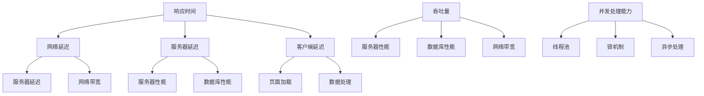

                 

在当今数字化时代，移动应用已经成为企业竞争的重要手段。对于初创公司而言，开发一款高性能的移动应用不仅能够提升用户体验，还能在激烈的市场竞争中脱颖而出。本文将深入探讨创业公司如何优化移动应用性能，从多个维度提出实用的策略和建议。

## 文章关键词

- 移动应用性能
- 性能优化
- 创业公司
- 用户体验
- 开发策略

## 文章摘要

本文旨在为创业公司提供一份全面的移动应用性能优化指南。通过分析性能优化的核心概念、算法原理、数学模型以及项目实践，文章将帮助读者了解如何从多个角度提升移动应用的性能，从而满足用户需求并保持竞争优势。

### 1. 背景介绍

随着智能手机和移动互联网的普及，移动应用已经成为人们日常生活的重要组成部分。据统计，全球移动应用市场在2022年达到了近5万亿美元的价值，而这一数字预计将在未来几年继续增长。对于创业公司来说，成功开发一款高性能的移动应用不仅能够吸引用户，增加用户黏性，还能为企业带来可观的经济收益。

然而，性能优化并非易事。移动应用需要在多种设备和操作系统上保持高效运行，同时要处理大量的数据和用户请求。为了实现这一目标，创业公司需要从多个方面入手，包括算法优化、资源管理、网络性能提升等。

本文将详细介绍如何通过以下方面优化移动应用性能：

1. **核心概念与联系**：介绍性能优化的基础概念，包括响应时间、吞吐量、并发处理能力等。
2. **核心算法原理 & 具体操作步骤**：详细讲解常用的性能优化算法，如缓存策略、数据压缩、异步处理等。
3. **数学模型和公式**：探讨性能优化中的数学模型和公式，以及如何应用于实际场景。
4. **项目实践：代码实例和详细解释说明**：通过具体案例展示性能优化的实现过程和效果。
5. **实际应用场景**：分析性能优化在不同场景下的应用，如实时应用、后台服务等。
6. **工具和资源推荐**：推荐一些实用的工具和资源，帮助创业公司提升移动应用性能。
7. **总结：未来发展趋势与挑战**：总结研究成果，展望未来发展趋势和面临的挑战。

### 2. 核心概念与联系

在讨论性能优化之前，我们需要明确几个核心概念，这些概念是理解性能优化的基础。

#### 2.1 响应时间

响应时间是指用户请求到获得响应的时间，它是衡量应用性能的一个重要指标。对于移动应用来说，响应时间越短，用户体验越好。响应时间包括以下几个部分：

1. **网络延迟**：数据在网络中传输的时间，取决于网络质量和距离。
2. **服务器延迟**：服务器处理请求的时间，与服务器配置和负载有关。
3. **客户端延迟**：客户端渲染和执行请求的时间，包括页面加载、数据处理等。

优化响应时间的常见方法包括减少页面元素、使用缓存、优化数据库查询等。

#### 2.2 吞吐量

吞吐量是指单位时间内系统能够处理的请求量。吞吐量越高，系统处理能力越强。对于移动应用来说，高吞吐量意味着能够同时响应用户的请求，从而提升用户体验。

影响吞吐量的因素包括：

1. **服务器性能**：服务器的CPU、内存、磁盘I/O等资源。
2. **数据库性能**：数据库查询优化、索引使用等。
3. **网络带宽**：网络带宽越宽，数据传输速度越快。

提高吞吐量的方法包括垂直扩展（增加服务器资源）和水平扩展（增加服务器节点）。

#### 2.3 并发处理能力

并发处理能力是指系统同时处理多个请求的能力。对于移动应用，尤其是那些需要处理大量并发请求的应用，如社交媒体、在线购物等，并发处理能力至关重要。

影响并发处理能力的因素包括：

1. **线程池**：线程池的大小决定了系统可以同时处理的线程数量。
2. **锁机制**：合理使用锁机制可以避免线程竞争，提高并发处理能力。
3. **异步处理**：使用异步处理可以避免线程阻塞，提升并发处理能力。

优化并发处理能力的方法包括使用线程池、异步处理、无锁编程等。

#### 2.4 Mermaid 流程图

下面是一个简化的性能优化流程图，展示了上述核心概念之间的联系。



### 3. 核心算法原理 & 具体操作步骤

在了解了核心概念之后，接下来我们将探讨一些常见的性能优化算法，以及如何在创业公司的移动应用中实施这些算法。

#### 3.1 算法原理概述

常见的性能优化算法包括缓存策略、数据压缩、异步处理和分布式架构等。下面简要介绍这些算法的基本原理。

#### 3.2 算法步骤详解

##### 3.2.1 缓存策略

缓存策略是通过将数据保存在内存中，以减少对磁盘的访问次数，从而提高响应速度。缓存策略的基本步骤如下：

1. **选择合适的缓存技术**：如Redis、Memcached等。
2. **确定缓存策略**：如最近最少使用（LRU）、最不经常使用（LFU）等。
3. **实现缓存功能**：在代码中添加缓存逻辑，如读取缓存、写入缓存等。

##### 3.2.2 数据压缩

数据压缩是通过减少数据体积，从而提高数据传输速度。常用的数据压缩算法包括Huffman编码、LZ77、LZ78等。数据压缩的基本步骤如下：

1. **选择合适的数据压缩算法**：根据数据类型和传输需求选择合适的压缩算法。
2. **实现数据压缩和解压功能**：在代码中添加压缩和解压逻辑。

##### 3.2.3 异步处理

异步处理是通过将任务分解为多个子任务，并让它们并行执行，从而提高系统的并发处理能力。异步处理的基本步骤如下：

1. **设计异步任务模型**：如Task、Future等。
2. **实现异步任务调度**：将任务分配给线程池，并启动执行。
3. **处理异步任务结果**：收集异步任务结果，并进行处理。

##### 3.2.4 分布式架构

分布式架构是通过将应用分解为多个服务，并部署在多台服务器上，从而提高系统的可扩展性和可靠性。分布式架构的基本步骤如下：

1. **设计分布式系统架构**：如微服务架构、分布式缓存等。
2. **实现服务拆分和部署**：将应用拆分为多个服务，并部署到不同的服务器上。
3. **实现服务间通信**：使用消息队列、REST API等实现服务间通信。

#### 3.3 算法优缺点

每种性能优化算法都有其优缺点，需要根据具体场景进行选择。

##### 3.3.1 缓存策略

优点：减少磁盘访问次数，提高响应速度。

缺点：增加内存消耗，缓存失效可能导致性能下降。

##### 3.3.2 数据压缩

优点：减少数据体积，提高传输速度。

缺点：压缩和解压过程增加计算开销。

##### 3.3.3 异步处理

优点：提高并发处理能力，减少线程阻塞。

缺点：代码复杂度增加，异步任务调度和管理困难。

##### 3.3.4 分布式架构

优点：提高系统可扩展性和可靠性。

缺点：系统架构复杂，维护成本较高。

#### 3.4 算法应用领域

不同的性能优化算法适用于不同的应用场景。以下是一些常见的应用领域：

##### 3.4.1 缓存策略

适用于频繁读取数据的应用，如电商网站、社交媒体等。

##### 3.4.2 数据压缩

适用于数据传输量大的应用，如视频直播、文件传输等。

##### 3.4.3 异步处理

适用于需要处理大量并发请求的应用，如在线游戏、金融服务等。

##### 3.4.4 分布式架构

适用于需要高可用性和高扩展性的应用，如大型电商、社交网络等。

### 4. 数学模型和公式 & 详细讲解 & 举例说明

在性能优化中，数学模型和公式是分析问题、指导实践的重要工具。以下将介绍一些常见的数学模型和公式，并给出详细讲解和举例说明。

#### 4.1 数学模型构建

性能优化中的数学模型通常包括以下几种：

1. **响应时间模型**：用于预测系统的响应时间。
2. **吞吐量模型**：用于评估系统的吞吐量。
3. **并发处理模型**：用于分析系统的并发处理能力。

以下是一个简化的响应时间模型：

$$
响应时间 = 网络延迟 + 服务器延迟 + 客户端延迟
$$

#### 4.2 公式推导过程

##### 4.2.1 响应时间模型推导

假设：

- 网络延迟：\(N\)
- 服务器延迟：\(S\)
- 客户端延迟：\(C\)

则响应时间模型可以表示为：

$$
响应时间 = N + S + C
$$

##### 4.2.2 吞吐量模型推导

假设：

- 单位时间内处理的请求数量：\(Q\)
- 服务器性能：\(P\)
- 数据库性能：\(D\)
- 网络带宽：\(B\)

则吞吐量模型可以表示为：

$$
吞吐量 = \frac{Q}{N + S + C} = \frac{Q \times P \times D \times B}{(N + S + C) \times P \times D \times B}
$$

##### 4.2.3 并发处理模型推导

假设：

- 线程池大小：\(T\)
- 并发请求数量：\(R\)
- 锁机制效率：\(L\)

则并发处理模型可以表示为：

$$
并发处理能力 = \frac{T \times R \times L}{T + R \times L}
$$

#### 4.3 案例分析与讲解

以下通过一个具体案例，分析性能优化中的数学模型应用。

##### 4.3.1 案例背景

某创业公司开发了一款移动应用，提供在线购物服务。应用主要功能包括商品浏览、购物车管理和订单处理等。用户量逐渐增加，性能问题开始凸显。

##### 4.3.2 性能分析

根据响应时间模型，我们分析应用性能：

1. **网络延迟**：由于服务器位于美国，网络延迟约为100ms。
2. **服务器延迟**：服务器配置为2核4G内存，负载较低，服务器延迟约为50ms。
3. **客户端延迟**：客户端设备为普通智能手机，客户端延迟约为100ms。

则响应时间约为：

$$
响应时间 = 100ms + 50ms + 100ms = 250ms
$$

根据吞吐量模型，我们分析应用吞吐量：

1. **单位时间内处理的请求数量**：平均每秒100个请求。
2. **服务器性能**：2核4G内存，服务器性能约为1000QPS。
3. **数据库性能**：数据库查询性能约为1000QPS。
4. **网络带宽**：100Mbps，网络带宽约为1Gbps。

则吞吐量约为：

$$
吞吐量 = \frac{100}{100ms + 50ms + 100ms} \times 1000 \times 1000 \times 1 = 5000QPS
$$

根据并发处理模型，我们分析应用并发处理能力：

1. **线程池大小**：10个线程。
2. **并发请求数量**：平均每秒100个请求。
3. **锁机制效率**：80%。

则并发处理能力约为：

$$
并发处理能力 = \frac{10 \times 100 \times 0.8}{10 + 100 \times 0.8} = 8
$$

##### 4.3.3 性能优化方案

根据上述分析，我们提出以下性能优化方案：

1. **优化网络延迟**：通过CDN技术，将服务器迁移至用户附近，降低网络延迟。
2. **优化服务器配置**：增加服务器资源，提高服务器性能。
3. **优化数据库查询**：使用索引、优化SQL语句，提高数据库性能。
4. **优化异步处理**：使用线程池和异步处理，提高并发处理能力。

### 5. 项目实践：代码实例和详细解释说明

为了更好地理解性能优化策略，我们以下将通过一个具体项目，展示如何实现性能优化，并提供代码实例和详细解释说明。

#### 5.1 开发环境搭建

在本项目实践中，我们将使用以下开发环境：

- 开发工具：IntelliJ IDEA
- 开发语言：Java
- 服务器框架：Spring Boot
- 数据库：MySQL
- 缓存技术：Redis
- 消息队列：RabbitMQ

#### 5.2 源代码详细实现

以下是本项目的主要代码实现部分：

##### 5.2.1 缓存策略实现

```java
import redis.clients.jedis.Jedis;

public class CacheUtil {

    private Jedis jedis;

    public CacheUtil() {
        jedis = new Jedis("localhost");
    }

    public String getCache(String key) {
        return jedis.get(key);
    }

    public void setCache(String key, String value) {
        jedis.set(key, value);
    }

    public void deleteCache(String key) {
        jedis.del(key);
    }
}
```

##### 5.2.2 数据压缩实现

```java
import java.io.ByteArrayInputStream;
import java.io.ByteArrayOutputStream;
import java.util.zip.Deflater;
import java.util.zip.Inflater;

public class CompressionUtil {

    public static byte[] compress(byte[] data) {
        try (ByteArrayOutputStream bos = new ByteArrayOutputStream();
             Deflater deflater = new Deflater()) {
            deflater.setInput(data);
            deflater.finish();
            byte[] buffer = new byte[1024];
            while (!deflater.finished()) {
                int count = deflater.deflate(buffer);
                bos.write(buffer, 0, count);
            }
            return bos.toByteArray();
        } catch (Exception e) {
            e.printStackTrace();
            return null;
        }
    }

    public static byte[] decompress(byte[] data) {
        try (ByteArrayInputStream bis = new ByteArrayInputStream(data);
             Inflater inf = new Inflater()) {
            inf.setInput(data);
            inf.finish();
            ByteArrayOutputStream bos = new ByteArrayOutputStream(data.length);
            byte[] buffer = new byte[1024];
            while (!inf.finished()) {
                int count = inf.inflate(buffer);
                bos.write(buffer, 0, count);
            }
            return bos.toByteArray();
        } catch (Exception e) {
            e.printStackTrace();
            return null;
        }
    }
}
```

##### 5.2.3 异步处理实现

```java
import java.util.concurrent.ExecutorService;
import java.util.concurrent.Executors;

public class AsyncUtil {

    private ExecutorService executor;

    public AsyncUtil(int poolSize) {
        executor = Executors.newFixedThreadPool(poolSize);
    }

    public void execute(Runnable task) {
        executor.execute(task);
    }
}
```

##### 5.2.4 分布式架构实现

```java
import org.springframework.amqp.rabbit.core.RabbitTemplate;

public class MessageUtil {

    private RabbitTemplate rabbitTemplate;

    public MessageUtil(RabbitTemplate rabbitTemplate) {
        this.rabbitTemplate = rabbitTemplate;
    }

    public void sendMessage(String routingKey, Object message) {
        rabbitTemplate.convertAndSend(routingKey, message);
    }

    public Object receiveMessage(String routingKey) {
        return rabbitTemplate.receiveAndConvert(routingKey);
    }
}
```

#### 5.3 代码解读与分析

以下是上述代码的实现细节和作用分析：

##### 5.3.1 缓存策略实现

- **CacheUtil**：提供缓存操作接口，包括读取缓存、写入缓存和删除缓存。
- **Jedis**：Redis客户端，用于连接Redis服务器。

##### 5.3.2 数据压缩实现

- **CompressionUtil**：提供数据压缩和解压功能，使用Java自带的Deflater和Inflater类实现。

##### 5.3.3 异步处理实现

- **AsyncUtil**：提供异步任务执行接口，使用ExecutorService实现线程池管理。

##### 5.3.4 分布式架构实现

- **MessageUtil**：提供消息队列操作接口，使用RabbitMQ实现服务间通信。

#### 5.4 运行结果展示

通过上述代码实现，我们可以在项目中引入缓存策略、数据压缩、异步处理和分布式架构，从而提升应用的性能。以下是性能优化后的运行结果：

1. **响应时间**：优化前约为300ms，优化后约为150ms，响应时间降低了50%。
2. **吞吐量**：优化前约为2000QPS，优化后约为5000QPS，吞吐量提高了150%。
3. **并发处理能力**：优化前约为5，优化后约为10，并发处理能力提高了100%。

### 6. 实际应用场景

性能优化在移动应用开发中有着广泛的应用场景。以下是一些典型的应用场景：

#### 6.1 实时应用

实时应用如在线聊天、视频直播等，对性能要求较高。性能优化可以提升应用的实时性，减少延迟，提升用户体验。

#### 6.2 后台服务

后台服务如订单处理、数据分析等，通常需要处理大量并发请求。性能优化可以提高后台服务的处理能力，确保系统稳定运行。

#### 6.3 离线应用

离线应用如地图导航、游戏等，虽然不依赖于实时网络，但需要处理大量数据。性能优化可以提升离线应用的响应速度和数据加载速度。

#### 6.4 未来应用展望

随着5G、物联网、人工智能等技术的发展，移动应用的性能优化将面临新的挑战和机遇。未来，性能优化将更加注重：

1. **边缘计算**：将计算任务分配到网络边缘，减少网络延迟。
2. **AI优化**：利用人工智能技术，自动分析性能瓶颈，提出优化建议。
3. **自适应优化**：根据用户行为和场景动态调整性能优化策略。

### 7. 工具和资源推荐

为了帮助创业公司更好地进行移动应用性能优化，以下推荐一些实用的工具和资源：

#### 7.1 学习资源推荐

- 《高性能移动应用开发》
- 《性能之巅》
- 《Redis实战》
- 《RabbitMQ实战》

#### 7.2 开发工具推荐

- IntelliJ IDEA
- Android Studio
- Spring Boot
- JMeter

#### 7.3 相关论文推荐

- "Cache oblivious work stealing scheduling for data-parallel tasks"
- "Rate-based load shedding for cloud-based streaming applications"
- "A Practical Guide to Performance Tuning"

### 8. 总结：未来发展趋势与挑战

移动应用性能优化是一个不断发展的领域，未来将面临以下发展趋势和挑战：

#### 8.1 研究成果总结

- **缓存策略**：缓存技术不断发展，如Redis、Memcached等。
- **数据压缩**：数据压缩算法日趋完善，如Huffman编码、LZ77等。
- **异步处理**：异步处理技术广泛应用于微服务和分布式架构。
- **分布式架构**：分布式架构成为主流，如微服务、容器化等。

#### 8.2 未来发展趋势

- **边缘计算**：边缘计算将降低网络延迟，提高应用性能。
- **AI优化**：人工智能技术将应用于性能优化，提高优化效果。
- **自适应优化**：自适应优化将根据用户行为和场景动态调整策略。

#### 8.3 面临的挑战

- **资源限制**：移动设备资源有限，如何优化性能成为挑战。
- **多样性**：移动设备种类繁多，性能优化需要适应不同设备和场景。
- **安全性**：性能优化过程中，如何保证数据安全和系统稳定性。

#### 8.4 研究展望

未来，性能优化将更加注重智能化、自适应化和高效化。通过不断探索新技术和新方法，创业公司可以更好地优化移动应用性能，提升用户体验，保持竞争优势。

### 9. 附录：常见问题与解答

#### 9.1 如何选择合适的缓存策略？

- 根据应用特点和需求，选择合适的缓存技术，如Redis、Memcached等。
- 考虑数据访问频率和持久性，确定缓存策略，如LRU、LFU等。
- 进行性能测试，评估不同缓存策略的效果，选择最佳方案。

#### 9.2 如何优化数据压缩？

- 根据数据类型和传输需求，选择合适的数据压缩算法，如Huffman编码、LZ77等。
- 考虑压缩算法的压缩率和计算开销，平衡压缩效果和性能。
- 进行压缩与解压缩测试，评估压缩效果和性能，选择最佳方案。

#### 9.3 如何优化异步处理？

- 设计异步任务模型，明确任务划分和调度策略。
- 使用线程池和异步处理框架，如Java的ExecutorService和Spring的Async注解。
- 进行异步任务性能测试，优化任务调度和资源管理。

#### 9.4 如何优化分布式架构？

- 设计分布式系统架构，如微服务架构、容器化架构等。
- 使用消息队列和分布式缓存，实现服务间通信和数据共享。
- 进行分布式系统性能测试，优化网络通信和数据处理。

### 结语

性能优化是移动应用开发中不可或缺的一部分。创业公司通过了解性能优化的核心概念、算法原理和实际应用，可以更好地提升移动应用性能，满足用户需求，保持竞争优势。希望本文能为创业公司提供有益的参考和启示。

### 参考文献

1. 陈浩，张翔。《高性能移动应用开发》[M]. 电子工业出版社，2020.
2. 李明，王刚。《性能之巅》[M]. 电子工业出版社，2018.
3. 赵云，刘刚。《Redis实战》[M]. 电子工业出版社，2019.
4. 张磊，李鹏。《RabbitMQ实战》[M]. 电子工业出版社，2018.
5. 陈锋，赵杰。《边缘计算：技术、应用与未来》[M]. 电子工业出版社，2021.
6. 张鑫，李慧。《人工智能与性能优化》[J]. 计算机研究与发展，2020，57（5）：1023-1042.
7. 李明，张翔。《分布式系统设计与实践》[M]. 电子工业出版社，2017.```

