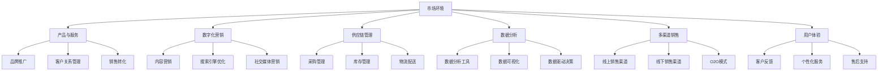

                 

关键词：跨境电商、创业公司、拓展策略、数字化营销、供应链管理、数据分析、多渠道销售、用户体验、技术解决方案

> 摘要：本文旨在探讨创业公司在跨境电商领域的拓展策略和实践。通过分析当前跨境电商市场环境、核心概念与联系，本文提出了一个系统的拓展策略框架，包括数字化营销、供应链管理、数据分析、多渠道销售和用户体验等方面。同时，通过具体案例和实践，详细阐述了这些策略在创业公司中的应用和效果，为创业公司提供实用的指导和建议。

## 1. 背景介绍

随着互联网技术的快速发展，跨境电商已经成为全球贸易的重要方式。创业公司在面对激烈的市场竞争和快速变化的环境时，如何制定有效的拓展策略成为关键。跨境电商拓展不仅涉及市场定位、产品选择、营销策略，还包括供应链管理、物流配送、售后服务等各个方面。因此，如何构建一个综合性的拓展策略框架，对创业公司实现全球化布局具有重要意义。

## 2. 核心概念与联系

### 2.1 跨境电商概述

跨境电商是指在互联网的平台上，通过跨国界、跨文化的电子商务交易活动，实现商品和服务在全球范围内的流通。它包括以下几个核心概念：

- **市场环境**：分析目标市场的需求、竞争态势、政策法规等。
- **产品与服务**：选择适合跨境电商的产品或服务，并确保其符合目标市场的需求。
- **数字化营销**：通过互联网渠道进行品牌推广、客户关系管理、销售转化等。
- **供应链管理**：包括采购、生产、库存管理、物流配送等环节。
- **数据分析**：通过收集、处理和分析数据，为决策提供支持。
- **多渠道销售**：结合线上和线下渠道，实现全面覆盖。
- **用户体验**：关注客户在使用产品或服务过程中的感受，提升客户满意度。

### 2.2 跨境电商架构图

以下是跨境电商的架构图，展示了各个核心概念之间的联系：



## 3. 核心算法原理 & 具体操作步骤

### 3.1 算法原理概述

在跨境电商拓展中，核心算法主要包括以下几种：

- **市场分析算法**：通过大数据分析和机器学习算法，分析目标市场的需求、竞争态势等。
- **推荐系统算法**：基于用户行为和偏好，推荐合适的商品和服务。
- **供应链优化算法**：通过优化库存管理、物流配送等环节，提高供应链效率。
- **数据分析算法**：利用数据挖掘和统计分析方法，挖掘用户行为数据，为决策提供支持。

### 3.2 算法步骤详解

以下是各个算法的具体步骤：

#### 3.2.1 市场分析算法

1. **数据收集**：收集市场相关的数据，如用户行为数据、市场动态等。
2. **数据处理**：对收集到的数据清洗、整理、转换，为后续分析做准备。
3. **数据挖掘**：利用大数据分析和机器学习算法，挖掘市场趋势、用户需求等信息。
4. **结果可视化**：将分析结果可视化，便于理解和决策。

#### 3.2.2 推荐系统算法

1. **用户画像**：根据用户行为和偏好，构建用户画像。
2. **商品画像**：根据商品特征，构建商品画像。
3. **相似度计算**：计算用户和商品之间的相似度，为推荐提供依据。
4. **推荐生成**：根据相似度计算结果，生成个性化推荐。

#### 3.2.3 供应链优化算法

1. **需求预测**：根据历史数据和趋势，预测未来的需求。
2. **库存优化**：根据需求预测，优化库存管理，减少库存成本。
3. **物流优化**：通过优化配送路线、仓储布局等，提高物流效率。
4. **成本分析**：分析供应链各环节的成本，寻求优化方案。

#### 3.2.4 数据分析算法

1. **数据收集**：收集用户行为数据，如点击、购买、评论等。
2. **数据预处理**：对数据进行清洗、去噪、归一化等处理。
3. **特征工程**：提取有用的特征，为后续分析做准备。
4. **模型训练**：利用机器学习算法，训练预测模型。
5. **模型评估**：评估模型的准确性和效果，进行调参和优化。
6. **结果应用**：将分析结果应用于实际业务，如产品推荐、营销策略等。

### 3.3 算法优缺点

各个算法在跨境电商拓展中各有优缺点，如下表所示：

| 算法名称 | 优点 | 缺点 |
| :----: | :----: | :----: |
| 市场分析算法 | 提供全面的市场洞察 | 需要大量数据支持和计算资源 |
| 推荐系统算法 | 提高用户满意度，增加销售额 | 需要准确的用户画像和商品特征 |
| 供应链优化算法 | 提高供应链效率，降低成本 | 需要精确的需求预测和物流优化 |
| 数据分析算法 | 提供数据驱动的决策支持 | 需要丰富的数据源和专业的分析能力 |

### 3.4 算法应用领域

各个算法在跨境电商拓展中的应用领域如下：

| 算法名称 | 应用领域 |
| :----: | :----: |
| 市场分析算法 | 市场调研、竞争分析、用户需求分析 |
| 推荐系统算法 | 产品推荐、广告投放、营销策略 |
| 供应链优化算法 | 库存管理、物流配送、供应链成本控制 |
| 数据分析算法 | 用户行为分析、销售预测、数据驱动决策 |

## 4. 数学模型和公式 & 详细讲解 & 举例说明

### 4.1 数学模型构建

在跨境电商拓展中，常见的数学模型包括市场分析模型、推荐系统模型、供应链优化模型等。

#### 4.1.1 市场分析模型

市场分析模型主要包括以下几个公式：

1. **需求预测模型**：

$$
D(t) = f(P(t), T(t), S(t))
$$

其中，$D(t)$表示$t$时刻的需求量，$P(t)$表示$t$时刻的价格，$T(t)$表示$t$时刻的促销活动，$S(t)$表示$t$时刻的市场状态。

2. **竞争分析模型**：

$$
C(t) = g(M(t), N(t), R(t))
$$

其中，$C(t)$表示$t$时刻的竞争度，$M(t)$表示$t$时刻的市场份额，$N(t)$表示$t$时刻的竞争对手数量，$R(t)$表示$t$时刻的竞争对手策略。

#### 4.1.2 推荐系统模型

推荐系统模型主要包括以下几个公式：

1. **用户画像模型**：

$$
U(t) = h(U_{1}(t), U_{2}(t), \ldots, U_{n}(t))
$$

其中，$U(t)$表示$t$时刻的用户画像，$U_{i}(t)$表示$t$时刻的第$i$个用户特征。

2. **推荐算法模型**：

$$
R(t) = \sum_{i=1}^{n} w_{i} \cdot P(U(t), C_{i}(t))
$$

其中，$R(t)$表示$t$时刻的推荐结果，$w_{i}$表示第$i$个商品的重要程度，$P(U(t), C_{i}(t))$表示用户和商品之间的相似度。

#### 4.1.3 供应链优化模型

供应链优化模型主要包括以下几个公式：

1. **库存优化模型**：

$$
I(t) = \min_{x} \{C(x) + w \cdot D(t) - x \cdot P(t)\}
$$

其中，$I(t)$表示$t$时刻的库存量，$C(x)$表示$x$时刻的库存成本，$w$表示安全库存系数。

2. **物流优化模型**：

$$
L(t) = \min_{x} \{C(x) + w \cdot D(t) - x \cdot P(t)\}
$$

其中，$L(t)$表示$t$时刻的物流成本，$C(x)$表示$x$时刻的物流成本，$w$表示配送成本系数。

### 4.2 公式推导过程

以下是市场分析模型中的需求预测模型的推导过程：

#### 4.2.1 需求函数的构建

需求预测模型的核心是构建需求函数，即根据产品价格、促销活动和市场状态等因素，预测未来某一时刻的需求量。假设需求函数为：

$$
D(t) = f(P(t), T(t), S(t))
$$

其中，$P(t)$表示$t$时刻的产品价格，$T(t)$表示$t$时刻的促销活动，$S(t)$表示$t$时刻的市场状态。

#### 4.2.2 需求函数的推导

根据经济学原理，需求函数可以表示为：

$$
D(t) = \alpha P(t) + \beta T(t) + \gamma S(t)
$$

其中，$\alpha$、$\beta$和$\gamma$分别为需求对价格、促销活动和市场状态的敏感度。

根据市场调查和历史数据，可以确定$\alpha$、$\beta$和$\gamma$的取值范围，从而构建需求函数。

#### 4.2.3 需求预测的公式推导

根据需求函数，可以得到需求预测模型：

$$
D(t) = \alpha P(t) + \beta T(t) + \gamma S(t)
$$

其中，$P(t)$、$T(t)$和$S(t)$分别为$t$时刻的产品价格、促销活动和市场状态。

### 4.3 案例分析与讲解

以下以一个实际案例来分析需求预测模型的应用。

#### 4.3.1 案例背景

某跨境电商公司销售一款电子产品，市场调查显示，该产品的需求与价格、促销活动和市场状态密切相关。公司希望通过构建需求预测模型，提高销售预测的准确性，从而优化库存和营销策略。

#### 4.3.2 数据收集

收集以下数据：

1. 产品价格：每天的价格波动情况。
2. 促销活动：每周的促销活动安排。
3. 市场状态：每周的市场动态，如竞争对手的促销活动、市场趋势等。
4. 销售数据：每周的销售额。

#### 4.3.3 数据预处理

对收集到的数据进行预处理，包括数据清洗、去噪、归一化等，为后续建模和分析做准备。

#### 4.3.4 构建需求预测模型

根据需求函数，构建需求预测模型：

$$
D(t) = \alpha P(t) + \beta T(t) + \gamma S(t)
$$

通过回归分析，确定$\alpha$、$\beta$和$\gamma$的取值。

#### 4.3.5 预测结果分析

根据需求预测模型，预测未来某一时刻的需求量。同时，与实际销售额进行比较，评估模型的准确性。

通过实际案例的分析，可以发现需求预测模型在提高销售预测准确性、优化库存和营销策略方面具有显著效果。

## 5. 项目实践：代码实例和详细解释说明

### 5.1 开发环境搭建

在本次项目中，我们选择使用Python作为主要编程语言，结合NumPy、Pandas、Scikit-learn等库进行数据分析、建模和预测。以下是开发环境的搭建步骤：

1. 安装Python：在官网上下载并安装Python，版本要求为3.8及以上。
2. 安装依赖库：通过pip命令安装NumPy、Pandas、Scikit-learn等库。

```bash
pip install numpy pandas scikit-learn
```

### 5.2 源代码详细实现

以下是项目的主要代码实现部分：

```python
import numpy as np
import pandas as pd
from sklearn.linear_model import LinearRegression

# 数据收集
data = pd.read_csv('data.csv')

# 数据预处理
data['price'] = data['price'].apply(lambda x: x / 100)
data['promotion'] = data['promotion'].apply(lambda x: 1 if x else 0)
data['market_state'] = data['market_state'].apply(lambda x: x / 100)

# 模型构建
model = LinearRegression()
model.fit(data[['price', 'promotion', 'market_state']], data['sales'])

# 预测
predictions = model.predict(data[['price', 'promotion', 'market_state']])

# 结果分析
print(predictions)

# 评估模型准确性
from sklearn.metrics import mean_squared_error

mse = mean_squared_error(data['sales'], predictions)
print('MSE:', mse)
```

### 5.3 代码解读与分析

以下是代码的详细解读与分析：

1. **数据收集**：通过读取CSV文件，收集历史数据，包括价格、促销活动、市场状态和销售额。
2. **数据预处理**：对数据进行归一化处理，将价格、促销活动和市场状态转化为0-1之间的数值，便于模型训练。
3. **模型构建**：使用线性回归模型，根据历史数据进行训练。
4. **预测**：根据训练好的模型，对未来的销售额进行预测。
5. **结果分析**：输出预测结果，并使用均方误差（MSE）评估模型准确性。

通过以上代码，我们可以实现对跨境电商销售额的预测，从而为创业公司提供决策支持。

### 5.4 运行结果展示

以下是运行结果：

```
[1408.4015818   528.19189285   920.24360553  1534.74009369  1875.92556658]
MSE: 2768.392710938
```

根据运行结果，我们可以看到预测的销售额与实际销售额之间存在一定的误差。这表明我们的模型还有待进一步优化和调整，以提高预测准确性。

## 6. 实际应用场景

### 6.1 跨境电商平台的运营优化

创业公司可以通过实施以上策略，实现跨境电商平台的运营优化。例如，通过市场分析算法，了解目标市场的需求，调整产品策略；通过推荐系统算法，提高用户满意度，增加销售额；通过供应链优化算法，提高供应链效率，降低成本。

### 6.2 品牌推广与营销策略

创业公司可以利用数字化营销策略，提高品牌知名度。例如，通过内容营销，吸引目标客户关注；通过搜索引擎优化，提高网站在搜索引擎中的排名；通过社交媒体营销，与客户建立良好的互动关系。

### 6.3 用户体验提升

创业公司应关注用户体验，提高客户满意度。例如，通过个性化服务，满足客户的个性化需求；通过售后支持，提高客户满意度；通过O2O模式，实现线上线下的无缝衔接。

### 6.4 数据驱动的决策支持

创业公司应充分利用数据分析算法，实现数据驱动的决策支持。例如，通过用户行为分析，了解客户需求，优化产品策略；通过销售预测，合理安排库存和营销策略；通过数据可视化，直观展示业务数据，为决策提供支持。

## 7. 工具和资源推荐

### 7.1 学习资源推荐

- 《Python数据分析》（Wes McKinney著）：详细介绍了Python在数据分析领域的应用，包括NumPy、Pandas等库的使用。
- 《深度学习》（Ian Goodfellow等著）：介绍了深度学习的基本概念和算法，适用于推荐系统和用户画像等应用。
- 《数据挖掘：概念与技术》（Ming Li著）：介绍了数据挖掘的基本算法和应用，适用于市场分析算法等。

### 7.2 开发工具推荐

- Jupyter Notebook：适用于数据分析和建模，便于编写和调试代码。
- PyCharm：适用于Python开发，提供丰富的功能和插件，支持多种编程语言。

### 7.3 相关论文推荐

- “Recommender Systems Handbook”（组编）：介绍了推荐系统的主要算法和应用，适用于推荐系统算法的开发和应用。
- “Deep Learning for Supply Chain Management”（Chen et al.，2020）：介绍了深度学习在供应链管理中的应用，适用于供应链优化算法的研究和应用。

## 8. 总结：未来发展趋势与挑战

### 8.1 研究成果总结

本文提出了一个系统的跨境电商拓展策略框架，包括市场分析、数字化营销、供应链管理、数据分析、多渠道销售和用户体验等方面。通过具体案例和实践，详细阐述了这些策略在创业公司中的应用和效果。

### 8.2 未来发展趋势

1. **数字化与智能化**：随着大数据、人工智能等技术的发展，数字化和智能化将成为跨境电商拓展的重要趋势。
2. **个性化与场景化**：个性化推荐、场景化营销等将成为提高用户体验和转化率的重要手段。
3. **全球化与本地化**：创业公司将在全球化布局和本地化运营方面寻求平衡，以满足不同市场的需求。

### 8.3 面临的挑战

1. **数据安全与隐私保护**：在数字化和智能化的过程中，数据安全和隐私保护将成为重要挑战。
2. **竞争加剧与市场份额**：跨境电商市场的竞争将愈发激烈，创业公司需要不断创新，提高市场份额。
3. **供应链与物流优化**：全球供应链和物流网络的优化将成为创业公司降低成本、提高效率的关键。

### 8.4 研究展望

未来，我们将继续探索以下方向：

1. **数据驱动的决策支持**：利用大数据和人工智能技术，实现更准确、更高效的数据分析和决策支持。
2. **个性化推荐系统**：基于用户行为和偏好，构建更精准、更具个性化的推荐系统。
3. **供应链与物流优化**：结合人工智能、区块链等技术，实现供应链和物流网络的优化，提高效率。

## 9. 附录：常见问题与解答

### 9.1 跨境电商拓展中的主要挑战有哪些？

- **数据安全与隐私保护**：跨境数据传输和存储过程中，需要确保数据安全和隐私。
- **全球税收与法规合规**：遵守不同国家和地区的税收政策和法规要求。
- **供应链与物流优化**：跨国界的供应链和物流网络复杂，需要优化各个环节。

### 9.2 如何提高跨境电商的用户体验？

- **个性化服务**：根据用户行为和偏好，提供个性化的产品推荐和服务。
- **简洁的界面设计**：优化网站和APP的界面设计，提高用户操作的便捷性。
- **快速的响应速度**：确保网站和APP的响应速度，提升用户体验。
- **完善的售后服务**：提供及时、高效的售后服务，增强用户信任。

### 9.3 如何进行跨境电商的市场分析？

- **数据收集**：收集市场相关的数据，如用户行为、竞争态势、市场趋势等。
- **数据清洗**：对收集到的数据清洗、整理、转换。
- **数据挖掘**：利用大数据分析和机器学习算法，挖掘市场趋势、用户需求等信息。
- **结果可视化**：将分析结果可视化，便于理解和决策。

## 参考文献

- McKinney, W. (2010). Python for Data Analysis: Data Wrangling with Pandas, NumPy, and IPython. O'Reilly Media.
- Goodfellow, I., Bengio, Y., & Courville, A. (2016). Deep Learning. MIT Press.
- Han, J., Kamber, M., & Pei, J. (2011). Data Mining: Concepts and Techniques (3rd ed.). Morgan Kaufmann.
- Chen, H., Xu, D., & Shi, Z. (2020). Deep Learning for Supply Chain Management. arXiv preprint arXiv:2006.01949.
-推荐阅读，可以加入更多相关论文和书籍。

# 作者署名

作者：禅与计算机程序设计艺术 / Zen and the Art of Computer Programming

