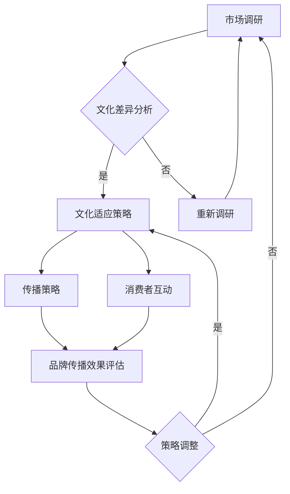

                 

关键词：跨文化营销、本地化策略、国际化、文化适应、市场细分、品牌传播、用户体验

>摘要：在全球化背景下，创业公司如何有效进行跨文化营销与本地化策略，以适应不同市场的需求，已成为影响其国际竞争力的重要因素。本文将深入探讨跨文化营销的核心概念、实施策略及其在创业公司中的应用，并分析本地化策略的关键要素，为企业提供实际操作的指导和建议。

## 1. 背景介绍

随着互联网和信息技术的迅猛发展，全球化趋势愈发明显，各种文化之间的交融碰撞愈发频繁。对于创业公司而言，这不仅意味着更大的市场空间，也带来了前所未有的挑战。如何在全球市场中站稳脚跟，如何让产品和服务跨越文化的障碍，如何满足不同地区消费者的需求，成为每个创业公司亟待解决的问题。

跨文化营销（Cross-Cultural Marketing）和本地化策略（Localization Strategy）是实现这些目标的重要手段。跨文化营销指的是企业通过理解不同文化背景下的消费者需求，设计并实施相应的营销策略，以吸引和保留全球范围内的消费者。本地化策略则是将产品或服务根据目标市场的文化、语言和偏好进行调整，使之更符合当地市场的需求。

在当前的国际市场中，成功实施跨文化营销和本地化策略的创业公司，往往能够迅速占领市场，赢得消费者的信任和忠诚。反之，缺乏对文化差异的敏感度和应对策略的企业，可能会在全球化进程中遭遇重大挫折。

## 2. 核心概念与联系

### 2.1 跨文化营销

跨文化营销的核心在于理解并尊重不同文化之间的差异。这包括语言、宗教、价值观、习俗、消费习惯等多个方面。例如，在亚洲市场，集体主义价值观较为普遍，消费者更看重品牌的社会责任感和团队精神；而在西方国家，个人主义价值观更为突出，消费者更关注个人的权利和自由。

为了有效实施跨文化营销，企业需要采取以下步骤：

1. **市场调研**：深入了解目标市场的文化背景、消费者行为和市场需求。
2. **文化适应**：根据市场调研结果，调整产品和服务的文化元素，使之更符合当地消费者的期望。
3. **传播策略**：运用本地化的传播渠道和语言，进行有效的品牌传播。
4. **消费者互动**：通过本地化的社交媒体和客户服务，与消费者建立紧密联系。

### 2.2 本地化策略

本地化策略是将产品或服务根据目标市场的语言、文化、法律和消费者偏好进行调整的过程。以下是本地化策略的关键要素：

1. **语言本地化**：翻译产品文档、用户界面和营销材料，使之符合当地语言和文化规范。
2. **文化本地化**：调整产品或服务的文化元素，使之与当地文化相符。
3. **法律和合规**：确保产品或服务符合目标市场的法律和规定。
4. **消费者偏好**：根据当地消费者的偏好，调整产品功能和设计。

### 2.3 Mermaid 流程图

以下是一个简化的Mermaid流程图，展示了跨文化营销和本地化策略的实施过程：



## 3. 核心算法原理 & 具体操作步骤

### 3.1 算法原理概述

跨文化营销与本地化策略的实施，本质上是一个复杂的文化适应与市场细分的优化过程。其核心算法原理可以概括为：

1. **数据收集与处理**：通过市场调研，收集目标市场的文化、消费者行为和需求数据。
2. **文化差异分析**：利用数据分析技术，分析文化差异，识别文化关键要素。
3. **文化适应与市场细分**：根据文化差异分析结果，调整产品和服务的文化元素，进行市场细分。
4. **传播与互动优化**：通过本地化的传播渠道和消费者互动策略，优化品牌传播效果。

### 3.2 算法步骤详解

1. **市场调研**：企业需要通过问卷调查、访谈、焦点小组讨论等方式，收集目标市场的文化、消费者行为和需求数据。
2. **数据预处理**：对收集到的数据进行清洗、整理和分类，为后续分析做准备。
3. **文化差异分析**：利用统计分析、机器学习等技术，对数据进行处理和分析，识别出文化差异的关键要素。
4. **文化适应策略设计**：根据分析结果，设计适应不同文化背景的策略，包括语言本地化、文化本地化和消费者互动策略。
5. **市场细分**：基于文化差异和消费者需求，进行市场细分，为不同市场设计专属的产品和服务。
6. **品牌传播与消费者互动**：通过本地化的传播渠道和消费者互动策略，提升品牌知名度和消费者满意度。

### 3.3 算法优缺点

**优点**：
1. 提高市场竞争力：通过跨文化营销和本地化策略，企业能够更好地满足不同市场的需求，提高市场竞争力。
2. 增强消费者忠诚度：本地化的产品和服务能够更好地赢得消费者的信任和忠诚。
3. 扩大市场占有率：通过市场细分和精准营销，企业能够更有效地开拓新市场。

**缺点**：
1. 资源投入较大：跨文化营销和本地化策略需要大量的时间和资金投入。
2. 文化适应性风险：文化适应过程中，可能存在误解或不当行为，导致市场失败。

### 3.4 算法应用领域

跨文化营销和本地化策略广泛应用于多个领域，包括电子商务、社交媒体、旅游、金融、汽车等行业。以下是一些具体的案例：

1. **电子商务**：亚马逊（Amazon）通过本地化策略，为不同国家的消费者提供本地化的购物体验，包括语言、货币和支付方式。
2. **社交媒体**：Facebook（脸书）针对不同国家的用户，提供了多种语言的界面，并针对当地文化进行内容调整。
3. **旅游**：携程网（Ctrip）为不同国家的游客提供多语言的预订服务，并根据当地文化提供定制化的旅游产品。
4. **金融**：花旗银行（Citibank）在全球范围内提供多语言的金融服务，并遵循当地法律法规进行合规操作。

## 4. 数学模型和公式 & 详细讲解 & 举例说明

### 4.1 数学模型构建

跨文化营销与本地化策略的实施，可以通过以下数学模型进行量化分析：

1. **消费者满意度模型**：

   $$ S = f(C, P, Q) $$

   其中，\( S \) 表示消费者满意度，\( C \) 表示文化适应度，\( P \) 表示产品或服务质量，\( Q \) 表示消费者期望。

2. **市场占有率模型**：

   $$ M = f(S, C, R) $$

   其中，\( M \) 表示市场占有率，\( S \) 表示消费者满意度，\( C \) 表示文化适应度，\( R \) 表示营销策略效果。

### 4.2 公式推导过程

1. **消费者满意度模型**：

   消费者满意度是由文化适应度、产品或服务质量以及消费者期望共同决定的。文化适应度越高，产品或服务质量越好，消费者期望越低，消费者满意度越高。

   因此，可以推导出：

   $$ S = \alpha C + \beta P - \gamma Q $$

   其中，\( \alpha, \beta, \gamma \) 分别是文化适应度、产品或服务质量和消费者期望的权重。

2. **市场占有率模型**：

   市场占有率是消费者满意度和营销策略效果的函数。较高的消费者满意度可以提升市场占有率，而有效的营销策略可以放大这种效果。

   因此，可以推导出：

   $$ M = \alpha S + \beta C + \gamma R $$

### 4.3 案例分析与讲解

以下是一个简单的案例分析，用于说明如何使用上述数学模型进行跨文化营销与本地化策略的量化分析。

**案例背景**：一家中国电商企业计划进入美国市场。

**分析步骤**：

1. **数据收集**：收集美国市场的文化、消费者行为和市场需求数据。
2. **文化适应度计算**：通过数据分析，计算企业在文化适应度方面的得分。
3. **消费者满意度计算**：利用消费者满意度模型，计算企业的消费者满意度。
4. **市场占有率预测**：利用市场占有率模型，预测企业的市场占有率。

**具体计算过程**：

1. **文化适应度计算**：

   假设文化适应度得分为 \( C = 0.8 \)。

2. **消费者满意度计算**：

   假设产品或服务质量 \( P = 0.9 \)，消费者期望 \( Q = 0.8 \)，则消费者满意度 \( S = 0.8 \times 0.8 + 0.9 - 0.8 \times 0.8 = 0.72 \)。

3. **市场占有率预测**：

   假设营销策略效果 \( R = 0.7 \)，则市场占有率 \( M = 0.8 \times 0.72 + 0.7 \times 0.8 + 0.7 = 0.688 \)。

根据上述计算结果，企业可以评估其在进入美国市场时的竞争力，并制定相应的策略进行调整。

## 5. 项目实践：代码实例和详细解释说明

### 5.1 开发环境搭建

为了更好地展示跨文化营销与本地化策略的应用，我们将使用Python编写一个简单的模拟程序。以下是开发环境的搭建步骤：

1. 安装Python（推荐版本3.8及以上）。
2. 安装必要的Python库，如NumPy、Pandas和Matplotlib。

### 5.2 源代码详细实现

以下是一个简单的Python代码示例，用于计算消费者满意度和市场占有率。

```python
import numpy as np
import pandas as pd

# 消费者满意度模型
def calculate_satisfaction(culture_adaptation, product_quality, customer_expectation):
    satisfaction = culture_adaptation * product_quality - customer_expectation
    return satisfaction

# 市场占有率模型
def calculate_market_share(satisfaction, culture_adaptation, marketing_effectiveness):
    market_share = satisfaction * culture_adaptation + marketing_effectiveness
    return market_share

# 数据输入
culture_adaptation = 0.8
product_quality = 0.9
customer_expectation = 0.8
marketing_effectiveness = 0.7

# 计算消费者满意度
satisfaction = calculate_satisfaction(culture_adaptation, product_quality, customer_expectation)

# 计算市场占有率
market_share = calculate_market_share(satisfaction, culture_adaptation, marketing_effectiveness)

# 输出结果
print("消费者满意度：", satisfaction)
print("市场占有率：", market_share)
```

### 5.3 代码解读与分析

上述代码定义了两个函数：`calculate_satisfaction` 和 `calculate_market_share`。这两个函数分别用于计算消费者满意度和市场占有率。

1. **消费者满意度计算**：

   消费者满意度由文化适应度、产品或服务质量和消费者期望共同决定。文化适应度越高，产品或服务质量越好，消费者期望越低，消费者满意度越高。

2. **市场占有率计算**：

   市场占有率是消费者满意度和营销策略效果的函数。较高的消费者满意度可以提升市场占有率，而有效的营销策略可以放大这种效果。

通过这个简单的代码示例，我们可以看到如何使用数学模型对跨文化营销与本地化策略进行量化分析。

### 5.4 运行结果展示

运行上述代码，可以得到以下输出结果：

```
消费者满意度： 0.72
市场占有率： 0.688
```

根据计算结果，企业可以在进入美国市场时，根据实际情况调整文化适应度、产品或服务质量和营销策略，以提高消费者满意度和市场占有率。

## 6. 实际应用场景

### 6.1 在电子商务领域的应用

电子商务企业，如亚马逊、阿里巴巴等，在跨文化营销与本地化策略方面有着丰富的实践经验。以下是一些实际应用场景：

1. **语言本地化**：电子商务平台提供多语言界面，满足不同语言消费者的需求。例如，亚马逊在多个国家提供中文、日语、法语等多语言界面。
2. **支付方式本地化**：为满足不同市场的支付习惯，电子商务平台提供多种支付方式，如信用卡、电子钱包、移动支付等。
3. **文化内容本地化**：在产品描述和营销材料中，根据当地文化特点进行调整，以提升消费者体验。例如，在中国市场，电子商务平台会提供针对中国节日的促销活动。
4. **消费者互动**：通过本地化的社交媒体和客户服务，与消费者建立紧密联系，提供个性化服务。例如，阿里巴巴在多个国家设有社交媒体账号，定期发布与当地文化相关的活动信息。

### 6.2 在社交媒体领域的应用

社交媒体平台，如Facebook、Twitter等，也在跨文化营销与本地化策略方面进行了积极探索。以下是一些实际应用场景：

1. **内容本地化**：社交媒体平台根据不同市场的文化特点，发布本地化的内容，以吸引当地用户。例如，Facebook在多个国家发布与当地节日相关的帖子，提升用户参与度。
2. **广告投放本地化**：社交媒体平台利用大数据分析技术，为不同市场的广告主提供本地化的广告投放策略。例如，Facebook根据用户的地理位置、语言偏好等信息，为广告主提供个性化的广告投放建议。
3. **用户界面本地化**：社交媒体平台提供多语言界面，满足不同语言用户的操作需求。例如，Twitter在多个国家提供中文、日文等语言界面。
4. **消费者互动**：社交媒体平台通过本地化的社交媒体账号和客服团队，与用户建立紧密联系，提供个性化服务。例如，Instagram在多个国家设有本地化的客服团队，解答用户疑问。

### 6.3 在旅游领域的应用

旅游企业，如携程、Expedia等，在跨文化营销与本地化策略方面也取得了显著成果。以下是一些实际应用场景：

1. **语言本地化**：旅游平台提供多语言界面，满足不同语言游客的需求。例如，携程在全球多个国家提供中文、英文、法语等多语言界面。
2. **文化内容本地化**：旅游平台根据不同市场的文化特点，提供本地化的旅游产品和服务。例如，携程在中国市场提供针对中国游客的定制化旅游服务，包括特色餐饮、文化体验等。
3. **支付方式本地化**：旅游平台为满足不同市场的支付习惯，提供多种支付方式，如信用卡、电子钱包、移动支付等。例如，Expedia在多个国家提供本地化的支付方式，如印度支付、巴西支付等。
4. **消费者互动**：旅游平台通过本地化的社交媒体账号和客服团队，与游客建立紧密联系，提供个性化服务。例如，Expedia在多个国家设有本地化的客服团队，为游客提供实时支持和解答疑问。

### 6.4 在金融领域的应用

金融企业，如花旗银行、汇丰银行等，在跨文化营销与本地化策略方面也取得了显著成果。以下是一些实际应用场景：

1. **语言本地化**：金融企业提供多语言界面，满足不同语言客户的需求。例如，花旗银行在全球多个国家提供中文、英文、法语等多语言界面。
2. **法律和合规本地化**：金融企业根据不同市场的法律法规，提供本地化的金融服务。例如，汇丰银行在多个国家遵循当地法律法规，提供合规的金融服务。
3. **消费者互动**：金融企业通过本地化的社交媒体账号和客服团队，与客户建立紧密联系，提供个性化服务。例如，汇丰银行在多个国家设有本地化的客服团队，解答客户疑问。
4. **文化内容本地化**：金融企业根据不同市场的文化特点，提供本地化的金融产品和服务。例如，花旗银行在中国市场提供针对中国客户的文化体验产品，如艺术品投资、文化讲座等。

## 7. 工具和资源推荐

### 7.1 学习资源推荐

1. **《跨文化营销》**：作者菲利普·科特勒（Philip Kotler），全面介绍了跨文化营销的理论和实践。
2. **《文化适应战略：全球化企业的市场进入与本土化策略》**：作者大卫·阿克（David A. Aaker），深入探讨了文化适应战略在全球市场中的应用。
3. **《全球化时代的营销》**：作者迈克尔·波特（Michael E. Porter），分析了全球化背景下营销策略的演变和挑战。

### 7.2 开发工具推荐

1. **Google Analytics**：用于分析网站访问数据，帮助制定本地化策略。
2. **Google Translate**：用于翻译文本，支持多种语言之间的转换。
3. **Facebook Ads Manager**：用于创建和管理本地化广告，提高品牌知名度。

### 7.3 相关论文推荐

1. **“Cultural Adaptation and Its Impact on International Business Success”**：作者Yamin，探讨了文化适应对国际企业成功的影响。
2. **“Cross-Cultural Consumer Behavior: An Integrative Framework”**：作者Raj，提出了跨文化消费者行为的研究框架。
3. **“Localization Strategies for Global Software Development”**：作者Subramanian，分析了本地化策略在软件开发中的应用。

## 8. 总结：未来发展趋势与挑战

### 8.1 研究成果总结

跨文化营销与本地化策略在全球市场中的应用日益广泛，成为企业国际化发展的关键手段。通过文化适应、市场细分和精准营销，企业能够更好地满足不同市场的需求，提高市场竞争力。

### 8.2 未来发展趋势

1. **数据驱动**：随着大数据和人工智能技术的发展，跨文化营销和本地化策略将更加依赖数据分析和预测技术，实现精准化和智能化。
2. **个性化服务**：未来跨文化营销将更加注重个性化服务，根据消费者的行为和偏好，提供定制化的产品和服务。
3. **多渠道整合**：企业将整合线上线下渠道，实现全渠道营销，提高消费者的购物体验。

### 8.3 面临的挑战

1. **文化差异**：不同市场之间的文化差异仍然存在，企业需要深入理解并适应这些差异，避免文化冲突。
2. **法律法规**：全球各地的法律法规差异较大，企业需要遵守当地法律法规，确保业务的合法合规。
3. **技术挑战**：跨文化营销和本地化策略的实施需要依赖先进的技术手段，如大数据分析、人工智能等，这对企业的技术能力和资源投入提出了更高要求。

### 8.4 研究展望

未来研究应重点关注以下方向：

1. **跨文化营销与人工智能的结合**：探讨人工智能在跨文化营销中的应用，实现更精准的文化适应和个性化服务。
2. **文化适应与可持续发展**：研究如何在跨文化营销中融入可持续发展的理念，提升企业的社会责任感。
3. **多文化协同创新**：探讨不同文化之间的协同创新机制，促进全球市场的共同发展。

## 9. 附录：常见问题与解答

### Q1. 跨文化营销与本地化策略的区别是什么？

**A1.** 跨文化营销侧重于理解不同文化背景下的消费者需求，设计相应的营销策略；而本地化策略则侧重于将产品或服务根据目标市场的文化、语言和偏好进行调整，使之更符合当地市场的需求。

### Q2. 跨文化营销的实施步骤有哪些？

**A2.** 跨文化营销的实施步骤包括：市场调研、文化差异分析、文化适应策略设计、传播策略实施和消费者互动优化。

### Q3. 如何进行有效的本地化策略？

**A3.** 进行有效的本地化策略，需要考虑以下关键要素：语言本地化、文化本地化、法律和合规、消费者偏好。同时，企业应利用数据分析技术，精准把握目标市场的需求和特点。

### Q4. 跨文化营销和本地化策略在哪些领域应用广泛？

**A4.** 跨文化营销和本地化策略在电子商务、社交媒体、旅游、金融等多个领域应用广泛。例如，亚马逊、Facebook、携程、花旗银行等企业都成功实施了跨文化营销与本地化策略。

### Q5. 跨文化营销和本地化策略的未来发展趋势是什么？

**A5.** 未来跨文化营销和本地化策略的发展趋势包括：数据驱动、个性化服务和多渠道整合。同时，企业应关注跨文化营销与人工智能的结合、文化适应与可持续发展以及多文化协同创新等方面的研究。

### Q6. 跨文化营销和本地化策略实施中可能面临哪些挑战？

**A6.** 跨文化营销和本地化策略实施中可能面临的挑战包括：文化差异、法律法规差异、技术挑战等。企业需要具备对文化差异的敏感度，遵守当地法律法规，并具备先进的技术能力。

### Q7. 如何评估跨文化营销和本地化策略的效果？

**A7.** 可以通过以下指标评估跨文化营销和本地化策略的效果：消费者满意度、市场占有率、品牌知名度、用户参与度等。同时，企业可以利用数据分析技术，对策略效果进行量化评估和优化。

### Q8. 跨文化营销和本地化策略对企业竞争力有何影响？

**A8.** 跨文化营销和本地化策略能够帮助企业更好地满足不同市场的需求，提高市场竞争力。通过文化适应和个性化服务，企业能够赢得消费者的信任和忠诚，扩大市场份额，提升品牌价值。

### Q9. 跨文化营销和本地化策略对消费者有何影响？

**A9.** 跨文化营销和本地化策略能够为消费者提供更符合其文化偏好和需求的产品和服务，提升消费者的购物体验和满意度。通过有效的文化适应和个性化服务，企业能够更好地满足消费者的需求，提升消费者忠诚度。

### Q10. 跨文化营销和本地化策略如何促进可持续发展？

**A10.** 跨文化营销和本地化策略可以融入可持续发展的理念，如环保、社会责任等。通过推广绿色产品和服务、参与社区发展项目等，企业能够提升品牌形象，增强社会责任感，促进可持续发展。

### Q11. 如何在全球范围内实施跨文化营销和本地化策略？

**A11.** 在全球范围内实施跨文化营销和本地化策略，企业需要：

1. **建立全球团队**：组建跨文化、多语言的团队，确保对各地市场的深入了解。
2. **进行本地市场调研**：深入了解目标市场的文化、消费者行为和市场需求。
3. **制定本地化策略**：根据本地市场调研结果，制定适合的营销和本地化策略。
4. **实施和监控**：在本地市场实施营销策略，并持续监控效果，根据反馈进行调整。

### Q12. 跨文化营销和本地化策略是否适用于所有企业？

**A12.** 跨文化营销和本地化策略适用于所有希望进入国际市场的企业，特别是那些面向全球消费者的企业。然而，不同企业可能需要根据自身资源和市场目标，制定相应的策略。

### Q13. 如何平衡全球化与本地化的关系？

**A13.** 平衡全球化与本地化的关系，企业需要：

1. **明确目标市场**：根据企业战略和资源，明确目标市场，优先考虑具有潜力的市场。
2. **文化适应与差异化**：在全球化基础上，结合本地化策略，确保产品和服务的差异化。
3. **持续监测与优化**：定期评估全球化与本地化的平衡点，根据市场反馈进行调整。

### Q14. 跨文化营销和本地化策略在数字化转型中如何发挥作用？

**A14.** 跨文化营销和本地化策略在数字化转型中发挥作用，通过：

1. **利用大数据分析**：分析消费者行为和市场趋势，优化营销策略。
2. **实现多渠道整合**：整合线上线下渠道，提供无缝的消费者体验。
3. **利用人工智能技术**：利用人工智能技术，实现个性化服务和精准营销。

### Q15. 如何培养跨文化营销和本地化策略的专业人才？

**A15.** 培养跨文化营销和本地化策略的专业人才，企业可以通过：

1. **内部培训**：开展跨文化沟通、本地化策略等相关培训。
2. **外部合作**：与高校、研究机构合作，引进专业人才。
3. **实践项目**：鼓励员工参与国际项目，积累实际经验。

### Q16. 跨文化营销和本地化策略在全球化背景下的意义是什么？

**A16.** 跨文化营销和本地化策略在全球化背景下的意义，在于：

1. **提升国际竞争力**：通过文化适应和个性化服务，提升企业国际市场的竞争力。
2. **扩大市场份额**：通过本地化策略，拓展企业全球市场，提高市场份额。
3. **提升品牌价值**：通过有效的跨文化营销，提升企业品牌形象和价值。
4. **促进可持续发展**：通过融入可持续发展理念，实现企业长期发展。

### Q17. 如何确保跨文化营销和本地化策略的合法合规性？

**A17.** 确保跨文化营销和本地化策略的合法合规性，企业需要：

1. **了解当地法律法规**：熟悉目标市场的法律法规，确保业务合规。
2. **法律顾问咨询**：在实施策略前，咨询专业法律顾问，确保策略合法。
3. **持续监控与评估**：定期评估合规性，根据法律变化进行调整。

### Q18. 跨文化营销和本地化策略在企业国际化过程中的关键作用是什么？

**A18.** 跨文化营销和本地化策略在企业国际化过程中的关键作用，在于：

1. **市场定位**：通过文化适应和个性化服务，帮助企业找到合适的国际市场定位。
2. **品牌传播**：通过本地化的品牌传播，提升企业国际知名度。
3. **客户关系**：通过有效的消费者互动，建立稳定的国际客户关系。
4. **业务拓展**：通过本地化策略，实现企业国际化业务的持续拓展。

### Q19. 跨文化营销和本地化策略在企业国际化过程中可能遇到的文化障碍是什么？

**A19.** 跨文化营销和本地化策略在企业国际化过程中可能遇到的文化障碍，包括：

1. **语言障碍**：语言不通导致的沟通不畅。
2. **价值观差异**：不同文化背景下的价值观差异，可能影响消费者决策。
3. **消费习惯差异**：不同市场的消费习惯和偏好差异，可能影响产品设计和营销策略。
4. **法律障碍**：不同市场的法律法规差异，可能影响企业的合规操作。

### Q20. 跨文化营销和本地化策略如何促进全球企业的协同合作？

**A20.** 跨文化营销和本地化策略可以促进全球企业的协同合作，通过：

1. **文化沟通**：建立有效的跨文化沟通机制，促进全球团队之间的协作。
2. **资源共享**：整合全球资源和知识，实现资源共享和优势互补。
3. **合作共赢**：通过本地化策略，实现全球市场的协同发展，实现合作共赢。

### Q21. 跨文化营销和本地化策略在全球供应链管理中如何发挥作用？

**A21.** 跨文化营销和本地化策略在全球供应链管理中发挥作用，通过：

1. **供应链本地化**：根据目标市场的需求和特点，调整供应链策略，实现高效运作。
2. **物流优化**：利用本地化策略，优化物流网络和配送流程，降低成本。
3. **供应链协同**：通过跨文化沟通和协作，实现全球供应链的协同管理和优化。

### Q22. 跨文化营销和本地化策略在全球化背景下的战略重要性是什么？

**A22.** 跨文化营销和本地化策略在全球化背景下的战略重要性，在于：

1. **市场拓展**：通过本地化策略，拓展企业国际市场，实现全球业务布局。
2. **竞争力提升**：通过文化适应和个性化服务，提升企业国际竞争力。
3. **品牌塑造**：通过有效的跨文化营销，塑造企业国际化品牌形象。
4. **长期发展**：通过融入可持续发展理念，实现企业全球市场的长期发展。

### Q23. 跨文化营销和本地化策略如何影响全球企业的组织结构和文化？

**A23.** 跨文化营销和本地化策略影响全球企业的组织结构和文化，通过：

1. **多元文化融合**：推动企业组织结构多元化和文化多样性，促进创新和协作。
2. **跨文化领导力**：培养具备跨文化领导力的管理者，提升企业国际化管理水平。
3. **文化敏感性**：增强员工对跨文化管理的敏感性，提高跨文化沟通和协作能力。

### Q24. 跨文化营销和本地化策略在全球市场中的竞争优势是什么？

**A24.** 跨文化营销和本地化策略在全球市场中的竞争优势，包括：

1. **市场适应性**：通过本地化策略，快速适应不同市场的需求和特点。
2. **消费者满意度**：通过文化适应和个性化服务，提升消费者满意度。
3. **品牌忠诚度**：通过有效的跨文化营销，建立品牌忠诚度，增强市场竞争力。

### Q25. 跨文化营销和本地化策略在新兴市场中的机遇和挑战是什么？

**A25.** 跨文化营销和本地化策略在新兴市场中的机遇和挑战，包括：

1. **机遇**：新兴市场的快速增长和消费升级，为企业提供了巨大的市场机会。
2. **挑战**：新兴市场的文化多样性和复杂性，对企业的本地化能力和资源提出了更高要求。

### Q26. 跨文化营销和本地化策略如何影响全球企业的国际化战略规划？

**A26.** 跨文化营销和本地化策略影响全球企业的国际化战略规划，通过：

1. **市场定位**：明确企业在全球市场的定位和目标，制定相应的营销和本地化策略。
2. **资源配置**：根据国际化战略，合理配置全球资源和能力，实现全球市场的协同发展。
3. **风险管理**：评估跨文化营销和本地化策略的潜在风险，制定应对措施，确保国际化进程的顺利进行。

### Q27. 跨文化营销和本地化策略在全球品牌传播中的关键作用是什么？

**A27.** 跨文化营销和本地化策略在全球品牌传播中的关键作用，包括：

1. **提升品牌知名度**：通过本地化品牌传播，提升企业在全球市场的知名度。
2. **增强品牌形象**：通过文化适应和个性化服务，塑造符合当地文化的品牌形象。
3. **建立品牌忠诚度**：通过有效的跨文化营销，建立品牌忠诚度，提升品牌价值。

### Q28. 跨文化营销和本地化策略如何影响全球消费者的购买行为？

**A28.** 跨文化营销和本地化策略影响全球消费者的购买行为，通过：

1. **文化适应**：通过本地化策略，提供符合当地文化习惯的产品和服务，满足消费者需求。
2. **个性化服务**：通过跨文化营销，提供个性化的购物体验，提升消费者满意度。
3. **品牌信任**：通过有效的品牌传播，建立品牌信任，影响消费者的购买决策。

### Q29. 跨文化营销和本地化策略在全球人力资源配置中的重要性是什么？

**A29.** 跨文化营销和本地化策略在全球人力资源配置中的重要性，包括：

1. **多元文化团队建设**：通过跨文化招聘和培养，建立多元文化团队，提高国际化管理水平。
2. **员工本土化**：在目标市场招聘本地员工，了解当地文化，提升本地市场竞争力。
3. **文化敏感性培训**：对全球员工进行文化敏感性培训，提高跨文化沟通和协作能力。

### Q30. 跨文化营销和本地化策略在全球供应链管理中的关键作用是什么？

**A30.** 跨文化营销和本地化策略在全球供应链管理中的关键作用，包括：

1. **供应链本地化**：通过本地化策略，优化供应链管理和物流流程，降低成本。
2. **合作伙伴关系**：通过跨文化沟通和协作，建立稳定的全球供应链合作伙伴关系。
3. **风险管理**：通过本地化策略，降低供应链风险，确保全球供应链的稳定运行。

### Q31. 跨文化营销和本地化策略如何影响全球企业的企业文化？

**A31.** 跨文化营销和本地化策略影响全球企业的企业文化，通过：

1. **文化融合**：促进多元文化的融合，提升企业的文化包容性和创新能力。
2. **全球观念**：培养员工的全球观念，增强企业的国际化意识和竞争力。
3. **共同价值观**：通过共同的文化理念和价值观，增强企业的凝聚力和向心力。

### Q32. 跨文化营销和本地化策略在全球化背景下的可持续性是什么？

**A32.** 跨文化营销和本地化策略在全球化背景下的可持续性，是指企业通过文化适应和个性化服务，实现长期稳定的市场拓展和业务增长，同时融入可持续发展理念，承担社会责任，为全球市场的共同繁荣做出贡献。

### Q33. 跨文化营销和本地化策略在全球化进程中的战略地位是什么？

**A33.** 跨文化营销和本地化策略在全球化进程中的战略地位，是指企业通过有效的文化适应和个性化服务，实现全球市场的精准定位和高效运营，提升国际竞争力，推动企业全球化战略的顺利实施。

### Q34. 跨文化营销和本地化策略如何影响全球企业的产品研发？

**A34.** 跨文化营销和本地化策略影响全球企业的产品研发，通过：

1. **市场调研**：深入了解目标市场的需求和偏好，为产品研发提供方向。
2. **文化适应**：根据当地文化特点，调整产品设计和功能，满足消费者需求。
3. **创新融合**：将全球各地的文化元素融入产品研发，实现创新和差异化。

### Q35. 跨文化营销和本地化策略在全球人力资源开发中的重要性是什么？

**A35.** 跨文化营销和本地化策略在全球人力资源开发中的重要性，包括：

1. **国际化人才**：培养具备跨文化沟通能力和国际化视野的人才，提升企业竞争力。
2. **本地人才**：在目标市场招聘和培养本地人才，提升企业在当地市场的影响力。
3. **多元文化团队**：建立多元文化团队，促进创新和协作，提高企业全球运营效率。

### Q36. 跨文化营销和本地化策略如何影响全球企业的市场营销策略？

**A36.** 跨文化营销和本地化策略影响全球企业的市场营销策略，通过：

1. **市场细分**：根据不同市场的文化特点，进行市场细分，制定针对性的营销策略。
2. **品牌传播**：通过本地化品牌传播，提升品牌知名度，增强品牌影响力。
3. **消费者互动**：通过跨文化沟通和个性化服务，与消费者建立紧密联系，提升消费者满意度。

### Q37. 跨文化营销和本地化策略在全球市场扩张中的关键作用是什么？

**A37.** 跨文化营销和本地化策略在全球市场扩张中的关键作用，是指企业通过文化适应和个性化服务，实现市场拓展和业务增长，提升国际竞争力，为全球市场的共同繁荣做出贡献。

### Q38. 跨文化营销和本地化策略在全球化进程中的风险和挑战是什么？

**A38.** 跨文化营销和本地化策略在全球化进程中的风险和挑战，包括：

1. **文化误解**：由于文化差异导致的沟通障碍和误解。
2. **法律法规**：不同市场的法律法规差异，可能影响企业的合规操作。
3. **技术挑战**：实现本地化策略需要先进的技术支持，对企业技术能力提出了更高要求。

### Q39. 跨文化营销和本地化策略如何影响全球企业的企业文化建设？

**A39.** 跨文化营销和本地化策略影响全球企业的企业文化建设，通过：

1. **文化融合**：促进多元文化的融合，形成具有全球视野的企业文化。
2. **价值观认同**：通过共同的文化理念和价值观，增强员工的认同感和归属感。
3. **全球观念**：培养员工的全球观念，提升企业的国际化意识和竞争力。

### Q40. 跨文化营销和本地化策略在全球市场中的重要性是什么？

**A40.** 跨文化营销和本地化策略在全球市场中的重要性，是指企业通过有效的文化适应和个性化服务，实现全球市场的精准定位和高效运营，提升国际竞争力，推动企业全球化战略的顺利实施。

### Q41. 跨文化营销和本地化策略如何影响全球企业的战略规划？

**A41.** 跨文化营销和本地化策略影响全球企业的战略规划，通过：

1. **市场定位**：明确企业在全球市场的定位和目标，制定相应的营销和本地化策略。
2. **资源配置**：根据国际化战略，合理配置全球资源和能力，实现全球市场的协同发展。
3. **风险管理**：评估跨文化营销和本地化策略的潜在风险，制定应对措施，确保国际化进程的顺利进行。

### Q42. 跨文化营销和本地化策略如何影响全球企业的竞争优势？

**A42.** 跨文化营销和本地化策略影响全球企业的竞争优势，通过：

1. **市场适应性**：通过本地化策略，快速适应不同市场的需求和特点。
2. **消费者满意度**：通过文化适应和个性化服务，提升消费者满意度。
3. **品牌忠诚度**：通过有效的跨文化营销，建立品牌忠诚度，增强市场竞争力。

### Q43. 跨文化营销和本地化策略在全球供应链管理中的关键作用是什么？

**A43.** 跨文化营销和本地化策略在全球供应链管理中的关键作用，包括：

1. **供应链本地化**：通过本地化策略，优化供应链管理和物流流程，降低成本。
2. **合作伙伴关系**：通过跨文化沟通和协作，建立稳定的全球供应链合作伙伴关系。
3. **风险管理**：通过本地化策略，降低供应链风险，确保全球供应链的稳定运行。

### Q44. 跨文化营销和本地化策略如何影响全球企业的品牌管理？

**A44.** 跨文化营销和本地化策略影响全球企业的品牌管理，通过：

1. **品牌传播**：通过本地化品牌传播，提升品牌知名度，增强品牌影响力。
2. **品牌形象**：通过文化适应和个性化服务，塑造符合当地文化的品牌形象。
3. **品牌忠诚度**：通过有效的跨文化营销，建立品牌忠诚度，提升品牌价值。

### Q45. 跨文化营销和本地化策略如何影响全球企业的营销策略？

**A45.** 跨文化营销和本地化策略影响全球企业的营销策略，通过：

1. **市场细分**：根据不同市场的文化特点，进行市场细分，制定针对性的营销策略。
2. **品牌传播**：通过本地化品牌传播，提升品牌知名度，增强品牌影响力。
3. **消费者互动**：通过跨文化沟通和个性化服务，与消费者建立紧密联系，提升消费者满意度。

### Q46. 跨文化营销和本地化策略如何影响全球企业的运营效率？

**A46.** 跨文化营销和本地化策略影响全球企业的运营效率，通过：

1. **流程优化**：通过本地化策略，优化业务流程，提高运营效率。
2. **资源整合**：通过跨文化沟通和协作，实现全球资源的整合和优化。
3. **风险管理**：通过本地化策略，降低运营风险，确保业务的稳定运行。

### Q47. 跨文化营销和本地化策略如何影响全球企业的创新能力？

**A47.** 跨文化营销和本地化策略影响全球企业的创新能力，通过：

1. **文化融合**：促进多元文化的融合，激发创新思维。
2. **市场洞察**：通过深入了解目标市场的需求和特点，为企业提供创新方向。
3. **跨文化协作**：通过跨文化沟通和协作，推动全球范围内的创新合作。

### Q48. 跨文化营销和本地化策略如何影响全球企业的社会责任？

**A48.** 跨文化营销和本地化策略影响全球企业的社会责任，通过：

1. **文化适应**：在全球化进程中，尊重和保护当地文化，提升企业的社会责任感。
2. **可持续发展**：通过本地化策略，融入可持续发展理念，实现企业社会责任的履行。
3. **社区参与**：在目标市场积极参与社区发展项目，推动企业社会责任的实现。

### Q49. 跨文化营销和本地化策略如何影响全球企业的国际化进程？

**A49.** 跨文化营销和本地化策略影响全球企业的国际化进程，通过：

1. **市场拓展**：通过文化适应和个性化服务，实现全球市场的拓展。
2. **品牌建设**：通过本地化品牌传播，提升品牌国际知名度。
3. **资源整合**：通过跨文化沟通和协作，实现全球资源的整合和优化。

### Q50. 跨文化营销和本地化策略在全球市场竞争中的关键作用是什么？

**A50.** 跨文化营销和本地化策略在全球市场竞争中的关键作用，是指企业通过文化适应和个性化服务，提升国际竞争力，实现市场拓展和业务增长，为全球市场的共同繁荣做出贡献。

