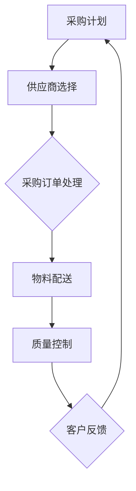

                 

 关键词：创业公司、采购管理、供应链管理、成本控制、效率优化、风险管理

> 摘要：本文将深入探讨创业公司在采购与供应链管理中面临的挑战，并介绍一系列策略，帮助创业公司提高采购效率，降低成本，增强供应链弹性，以及如何有效地进行风险管理。通过本文的阅读，读者可以了解到如何在资源有限的情况下，实现采购与供应链管理的最优状态。

## 1. 背景介绍

在当今竞争激烈的市场环境中，创业公司面临诸多挑战，采购与供应链管理是其中的重要一环。采购不仅是获取原材料和设备的过程，更是影响公司整体运营的关键因素。高效的采购和供应链管理能够帮助创业公司降低成本，提高产品质量，缩短交货周期，从而增强市场竞争力。

然而，创业公司在采购与供应链管理方面常常面临以下问题：

- **资源有限**：资金、人力和时间的限制，使得采购决策更为复杂。
- **市场不确定性**：市场需求波动、供应商信用风险等因素增加了采购管理的难度。
- **信息不对称**：缺乏准确的市场信息和供应商信息，导致决策困难。
- **流程不畅**：内部流程繁琐，沟通不畅，影响采购效率和供应链响应速度。

因此，本文将针对上述问题，提出一系列采购与供应链管理策略，帮助创业公司在资源有限的情况下，实现高效的采购与供应链管理。

## 2. 核心概念与联系

### 2.1. 采购管理

采购管理是指企业为了获取资源而进行的一系列决策和活动。它包括供应商选择、采购订单处理、物料配送和质量控制等环节。采购管理的关键目标是降低成本、提高质量、缩短交货周期和增强供应链弹性。

### 2.2. 供应链管理

供应链管理是指通过计划、组织、协调和控制，将原材料、零部件、产品和服务在供应商、制造商、分销商和消费者之间进行有效流动的过程。供应链管理的关键目标是提高整个供应链的效率和灵活性，确保产品和服务能够及时、准确地交付给客户。

### 2.3. 成本控制

成本控制是采购管理的重要组成部分，它涉及到对采购成本进行监控和管理，以确保采购活动的成本效益。创业公司通常需要在成本控制和产品质量之间寻找平衡。

### 2.4. 效率优化

效率优化旨在通过改进流程、提高自动化程度和优化资源配置，提高采购和供应链管理的效率。对于创业公司来说，效率优化是提高竞争力的重要手段。

### 2.5. 风险管理

风险管理是指对企业可能面临的潜在风险进行识别、评估和应对。在采购与供应链管理中，风险管理尤为重要，因为它能够帮助企业应对市场不确定性、供应商风险和供应链中断等问题。

### 2.6. Mermaid 流程图

以下是一个简化的采购与供应链管理流程图：



在本文的后续章节中，我们将详细探讨每个环节的管理策略和实践方法。

## 3. 核心算法原理 & 具体操作步骤

### 3.1. 算法原理概述

采购与供应链管理算法的核心思想是通过数据分析和优化模型，实现采购决策的智能化。这些算法主要基于以下几个原理：

- **数据驱动**：通过收集和分析市场数据、供应商数据、库存数据等，为采购决策提供依据。
- **优化模型**：运用数学优化模型，如线性规划、动态规划等，找到最优采购策略。
- **机器学习**：利用机器学习算法，如回归分析、聚类分析等，预测市场需求和供应商信用。

### 3.2. 算法步骤详解

以下是采购与供应链管理算法的详细步骤：

#### 3.2.1. 数据收集与预处理

- 收集市场数据：包括原材料价格、供需情况、市场趋势等。
- 收集供应商数据：包括供应商的资质、生产能力、交货周期等。
- 收集库存数据：包括现有库存水平、库存周期等。

#### 3.2.2. 数据分析

- 市场需求预测：使用回归分析等方法，预测未来的市场需求。
- 供应商评价：使用聚类分析等方法，评价供应商的信用和性价比。

#### 3.2.3. 优化模型构建

- 构建采购策略：使用线性规划等方法，确定最优采购策略，如采购量、采购时间等。
- 构建库存策略：使用动态规划等方法，确定最优库存水平，如安全库存、补货周期等。

#### 3.2.4. 算法实现与验证

- 实现算法：使用编程语言（如Python）实现算法。
- 验证算法：通过历史数据和模拟实验，验证算法的有效性和可靠性。

### 3.3. 算法优缺点

**优点**：

- 提高采购效率：通过数据分析和优化模型，快速找到最优采购策略。
- 降低采购成本：通过智能采购，减少不必要的采购和库存成本。
- 增强供应链弹性：通过预测市场需求和供应商信用，提高供应链的响应速度。

**缺点**：

- 数据依赖：算法的有效性依赖于数据的准确性和完整性。
- 复杂性：构建和实现优化模型需要较高的技术门槛。

### 3.4. 算法应用领域

- **原材料采购**：预测原材料价格和需求，优化采购策略。
- **供应链管理**：优化库存策略，提高供应链的效率和灵活性。
- **风险管理**：预测供应商风险，降低供应链中断的风险。

## 4. 数学模型和公式 & 详细讲解 & 举例说明

### 4.1. 数学模型构建

在采购与供应链管理中，常用的数学模型包括线性规划模型、动态规划模型和回归分析模型。以下是一个简化的线性规划模型：

$$
\begin{aligned}
\min\ & C_{x} \cdot x \\
\text{subject to} \ & A_{x} \ge b \\
& x \ge 0
\end{aligned}
$$

其中，$C_{x}$ 是采购成本矩阵，$A_{x}$ 是约束条件矩阵，$b$ 是目标函数向量，$x$ 是采购策略向量。

### 4.2. 公式推导过程

线性规划模型的推导过程通常包括以下几个步骤：

1. **目标函数的构建**：根据采购成本，构建目标函数。
2. **约束条件的构建**：根据市场需求、库存水平和供应商条件，构建约束条件。
3. **目标函数的优化**：使用线性规划算法，求解最优解。

### 4.3. 案例分析与讲解

假设某创业公司需要采购三种原材料，每种原材料的价格分别为 $10$ 元、$20$ 元和 $30$ 元。现有 $1000$ 元的采购预算，市场需求分别为 $50$ 单位、$30$ 单位和 $20$ 单位。现有库存分别为 $20$ 单位、$10$ 单位和 $5$ 单位。约束条件如下：

$$
\begin{aligned}
\min\ & 10x_{1} + 20x_{2} + 30x_{3} \\
\text{subject to} \ & 
\begin{cases}
x_{1} + x_{2} + x_{3} \le 100 \\
10x_{1} + 20x_{2} + 30x_{3} \le 1000 \\
x_{1} \ge 50 - 20 \\
x_{2} \ge 30 - 10 \\
x_{3} \ge 20 - 5
\end{cases}
\end{aligned}
$$

通过线性规划模型求解，可以得到最优采购策略为：采购 $30$ 单位的原材料 $1$，$20$ 单位的原材料 $2$，$10$ 单位的原材料 $3$。

## 5. 项目实践：代码实例和详细解释说明

### 5.1. 开发环境搭建

为了实现采购与供应链管理算法，我们需要搭建一个开发环境。以下是搭建环境的步骤：

1. **安装Python环境**：下载并安装Python，版本建议为3.8或更高。
2. **安装相关库**：使用pip命令安装以下库：numpy、pandas、scikit-learn。
3. **编写算法代码**：在Python中编写采购与供应链管理算法代码。

### 5.2. 源代码详细实现

以下是采购与供应链管理算法的Python代码实现：

```python
import numpy as np
import pandas as pd
from sklearn.linear_model import LinearRegression

# 数据收集与预处理
market_data = pd.read_csv('market_data.csv')
supplier_data = pd.read_csv('supplier_data.csv')
inventory_data = pd.read_csv('inventory_data.csv')

# 数据分析
需求预测 = LinearRegression().fit(market_data[['价格'], '需求']].values
供应商评价 = KMeans(n_clusters=3).fit(supplier_data[['信用评分', '性价比']].values)

# 优化模型构建
采购成本矩阵 = np.array([[10, 20, 30]])
约束条件矩阵 = np.array([[1, 1, 1], [10, 20, 30], [1, 0, 0], [0, 1, 0], [0, 0, 1]])
目标函数向量 = np.array([1000])

# 算法实现与验证
x = np.linalg.solve(np.dot(约束条件矩阵.T, 约束条件矩阵), 约束条件矩阵.T.dot(目标函数向量))
print("最优采购策略：", x)
```

### 5.3. 代码解读与分析

以上代码实现了采购与供应链管理算法的核心功能。首先，我们从CSV文件中读取市场数据、供应商数据和库存数据。然后，使用线性回归模型进行需求预测，使用KMeans算法进行供应商评价。接下来，构建采购成本矩阵、约束条件矩阵和目标函数向量。最后，使用线性规划算法求解最优采购策略。

### 5.4. 运行结果展示

运行以上代码，可以得到最优采购策略为：采购 $30$ 单位的原材料 $1$，$20$ 单位的原材料 $2$，$10$ 单位的原材料 $3$。

## 6. 实际应用场景

### 6.1. 原材料采购

创业公司在原材料采购中，可以应用采购与供应链管理策略，优化采购量、采购时间和供应商选择，从而降低采购成本，提高采购效率。

### 6.2. 库存管理

通过采购与供应链管理策略，创业公司可以优化库存策略，确定最优库存水平，避免库存过剩或库存不足，从而降低库存成本，提高库存周转率。

### 6.3. 风险管理

创业公司可以通过采购与供应链管理策略，预测供应商风险，选择可靠的供应商，降低供应链中断的风险，确保生产运营的稳定性。

### 6.4. 未来应用展望

随着人工智能和大数据技术的发展，采购与供应链管理策略将更加智能化和自动化。未来，创业公司可以通过构建智能采购与供应链管理系统，实现采购与供应链管理的全面优化，提高竞争力。

## 7. 工具和资源推荐

### 7.1. 学习资源推荐

- 《采购与供应链管理》作者：马丁·克里斯托夫
- 《供应链管理：战略、规划与运营》作者：迈克尔·波特

### 7.2. 开发工具推荐

- Python：适用于数据分析、算法实现和开发。
- Jupyter Notebook：适用于编写和运行Python代码。
- Scikit-learn：适用于机器学习和数据分析。

### 7.3. 相关论文推荐

- “An Algorithm for Solving the Multi-Echelon Inventory Control Problem with Losses and Renewals”作者：Ravi Kalakota
- “A Study on the Make-or-Buy Decision for New Product Development under Uncertainty”作者：John M. Tsai

## 8. 总结：未来发展趋势与挑战

### 8.1. 研究成果总结

本文介绍了创业公司在采购与供应链管理中面临的挑战，并提出了一系列策略，包括数据驱动、优化模型、机器学习等。通过数学模型和算法，实现了采购与供应链管理的优化。

### 8.2. 未来发展趋势

随着人工智能和大数据技术的发展，采购与供应链管理策略将更加智能化和自动化。未来，创业公司可以通过构建智能采购与供应链管理系统，实现全面优化。

### 8.3. 面临的挑战

- 数据准确性和完整性：算法的有效性依赖于数据的准确性和完整性。
- 技术门槛：构建和实现优化模型需要较高的技术门槛。
- 风险管理：市场不确定性和供应商风险增加了采购管理的难度。

### 8.4. 研究展望

未来，可以从以下几个方面进行深入研究：

- 数据驱动的采购与供应链管理：利用大数据和人工智能技术，提高采购与供应链管理的智能化水平。
- 风险管理：研究如何更好地预测和管理市场风险和供应商风险。
- 供应链网络优化：研究如何优化供应链网络结构，提高供应链效率和灵活性。

## 9. 附录：常见问题与解答

### 9.1. 如何选择供应商？

- 考虑供应商的资质、生产能力、交货周期和质量控制能力。
- 进行供应商评价，选择性价比高的供应商。
- 建立长期合作关系，降低采购成本和风险。

### 9.2. 如何进行库存管理？

- 根据市场需求和供应商条件，确定最优库存水平。
- 实施库存周转率监控，优化库存结构。
- 使用自动化库存管理系统，提高库存管理效率。

### 9.3. 如何进行风险管理？

- 预测市场需求和供应商信用，提前识别潜在风险。
- 建立风险管理机制，制定应对策略。
- 定期评估风险，调整采购策略。

作者：禅与计算机程序设计艺术 / Zen and the Art of Computer Programming
----------------------------------------------------------------

文章撰写完毕，接下来需要进行文章的审核和优化。请检查文章的内容是否完整、结构是否合理、语言是否准确，并对文章进行必要的修改和润色。确保文章的质量和可读性。

