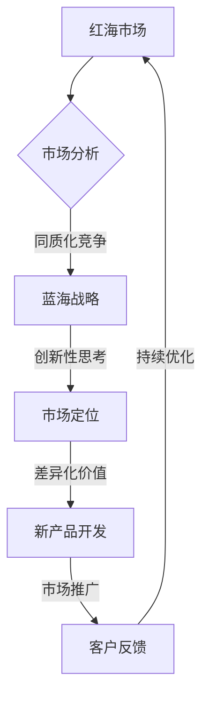

                 

关键词：产品定位、红海市场、蓝海战略、创业初期、市场分析、竞争策略

> 摘要：本文旨在探讨创业初期的产品定位策略，特别是在红海市场中如何运用蓝海战略来创造新的市场需求。文章首先介绍了红海市场和蓝海市场的概念，随后详细阐述了蓝海战略的核心思想及其在创业实践中的应用。通过实际案例分析和策略建议，本文为创业者提供了在激烈竞争中找到市场空白的可行路径。

## 1. 背景介绍

在当今竞争激烈的市场环境中，产品定位对于企业的成功至关重要。特别是在创业初期，资源有限，竞争压力大，创业者需要准确把握市场脉搏，制定有效的产品定位策略，从而在红海市场中开辟出一片蓝海。红海市场和蓝海市场的概念，正是这种战略思维的重要体现。

红海市场是指竞争激烈、产品同质化严重的市场环境。在这种市场中，企业往往需要通过价格战、广告投放等传统手段来争夺市场份额。而蓝海市场则是指那些尚未被充分开发、存在大量市场空白的领域。企业通过创新和差异化，可以在蓝海市场中找到新的增长点，实现超常规发展。

本文将围绕创业初期的产品定位策略，探讨如何运用蓝海战略在红海市场中实现突破。通过分析蓝海战略的核心思想、实施步骤以及实际案例，本文旨在为创业者提供有价值的参考和启示。

## 2. 核心概念与联系

### 2.1 红海市场与蓝海市场

**红海市场**：指那些竞争激烈、产品同质化严重、利润率较低的市场环境。在这种市场中，企业为了争夺有限的客户资源，常常陷入价格战、广告战等恶性竞争。

**蓝海市场**：指那些尚未被充分开发、存在大量市场空白、具有巨大潜力的市场领域。企业通过创新和差异化，可以在蓝海市场中创造新的需求，从而避免与竞争对手的直接对抗。

### 2.2 蓝海战略的核心思想

**蓝海战略**：由韩国学者金伟灿（W. Chan Kim）和莫博涅（Renée Mauborgne）提出，是一种通过创新和差异化，在现有市场之外创造新需求、开辟新市场的战略。

**核心思想**：

- **非竞争性**：蓝海战略强调在非竞争的市场环境中寻找机会，避免与现有竞争对手直接对抗。
- **创新性**：通过创新和差异化，创造出独特的价值主张，满足消费者未被满足的需求。
- **扩张性**：在蓝海市场中，企业可以通过规模经济和范围经济实现快速增长。

### 2.3 Mermaid 流程图



通过上述流程图，我们可以清晰地看到，蓝海战略的实施过程是一个从市场分析到创新性思考，再到市场定位、新产品开发和市场推广的循环过程。其中，市场分析是基础，创新性思考是核心，市场定位和差异化价值是关键，而客户反馈和持续优化则是实现蓝海战略成功的重要保障。

## 3. 核心算法原理 & 具体操作步骤

### 3.1 算法原理概述

蓝海战略的核心算法原理在于对市场的深度分析和创新性思考。具体来说，其包括以下几个关键步骤：

1. **市场分析**：通过调研和分析，了解现有市场的竞争态势、消费者需求和市场空白。
2. **创新性思考**：基于市场分析结果，寻找潜在的市场机会，通过创新和差异化来创造新的需求。
3. **市场定位**：确定产品在蓝海市场中的独特定位，明确价值主张。
4. **新产品开发**：根据市场定位，进行产品设计和开发，确保产品具备差异化特征。
5. **市场推广**：制定市场推广策略，将产品信息传递给目标客户。
6. **客户反馈**：收集客户反馈，不断优化产品和服务。

### 3.2 算法步骤详解

1. **市场分析**：

   - **数据收集**：通过市场调研、竞品分析、消费者调研等方式，收集相关市场数据。
   - **数据分析**：运用统计分析、数据挖掘等方法，对市场数据进行分析，了解市场现状和趋势。
   - **市场机会识别**：分析市场数据，识别现有市场的空白点和潜在需求。

2. **创新性思考**：

   - **跨界思维**：跳出传统思维框架，从其他行业或领域寻找灵感。
   - **用户需求挖掘**：通过深度访谈、用户调研等方式，了解用户真正需求。
   - **创新点提炼**：基于跨界思维和用户需求，提炼出创新点，为新产品开发提供方向。

3. **市场定位**：

   - **目标市场确定**：根据市场分析结果，明确目标市场，包括目标客户群体、市场规模等。
   - **价值主张定义**：基于目标市场，确定产品的独特价值主张，即产品如何满足目标客户的需求。

4. **新产品开发**：

   - **产品规划**：根据市场定位，制定产品规划，包括产品功能、外观设计等。
   - **产品设计**：进行产品详细设计，确保产品具备差异化特征。
   - **产品开发**：进行产品开发，确保产品满足设计和规划要求。

5. **市场推广**：

   - **推广策略制定**：根据产品特点和市场定位，制定市场推广策略。
   - **推广活动执行**：执行市场推广计划，通过各种渠道将产品信息传递给目标客户。
   - **效果评估**：对市场推广效果进行评估，调整推广策略。

6. **客户反馈**：

   - **反馈收集**：通过用户调研、客户访谈等方式，收集客户反馈。
   - **反馈分析**：对客户反馈进行分析，识别产品和服务中的问题和改进点。
   - **持续优化**：根据客户反馈，不断优化产品和服务，提高客户满意度。

### 3.3 算法优缺点

**优点**：

- **避免直接竞争**：蓝海战略通过创新和差异化，避免了与现有竞争对手的直接竞争，为企业提供了更大的发展空间。
- **市场潜力大**：蓝海市场通常存在大量市场空白，市场潜力巨大，为企业提供了广阔的发展前景。
- **竞争优势明显**：通过创新和差异化，企业可以在蓝海市场中建立明显的竞争优势，提高市场地位。

**缺点**：

- **前期投入大**：蓝海战略的实施往往需要较大的前期投入，包括市场调研、产品开发、市场推广等。
- **风险较高**：蓝海战略涉及未知的市场领域，风险相对较高，需要企业具备较强的风险承受能力。

### 3.4 算法应用领域

蓝海战略在以下领域具有广泛的应用：

- **科技创新领域**：如人工智能、大数据、区块链等新兴技术领域，可以通过创新和差异化，开辟新的市场空间。
- **消费电子领域**：如智能手机、智能穿戴设备等，通过差异化设计和功能创新，吸引不同消费群体的关注。
- **服务业领域**：如在线教育、医疗健康、金融科技等，可以通过创新服务模式和内容，满足消费者的多元化需求。

## 4. 数学模型和公式 & 详细讲解 & 举例说明

### 4.1 数学模型构建

蓝海战略的实施过程可以抽象为一个数学模型，包括以下几个关键变量：

- **市场需求量（Q）**：表示目标市场对产品的需求总量。
- **市场竞争程度（C）**：表示市场上竞争的激烈程度。
- **产品差异化程度（D）**：表示产品的差异化程度，越高表示产品越具有竞争优势。
- **市场潜力（P）**：表示市场的潜在规模。

数学模型可以表示为：

\[ Q = f(C, D, P) \]

其中，函数 \( f \) 表示市场需求量与竞争程度、产品差异化程度和市场潜力之间的关系。

### 4.2 公式推导过程

为了推导市场需求量与竞争程度、产品差异化程度和市场潜力之间的关系，我们可以从以下几个方面进行分析：

1. **竞争程度对市场需求量的影响**：

   竞争越激烈，市场上的产品价格通常越低，消费者的购买力下降，从而导致市场需求量减少。可以假设竞争程度与市场需求量呈负相关关系，即：

   \[ C \propto \frac{1}{Q} \]

2. **产品差异化程度对市场需求量的影响**：

   产品差异化程度越高，消费者对其的认可度越高，市场需求量增加。可以假设产品差异化程度与市场需求量呈正相关关系，即：

   \[ D \propto Q \]

3. **市场潜力对市场需求量的影响**：

   市场潜力越大，潜在的市场需求量也越大。可以假设市场潜力与市场需求量呈正相关关系，即：

   \[ P \propto Q \]

综合以上分析，我们可以得到市场需求量与竞争程度、产品差异化程度和市场潜力之间的关系公式：

\[ Q = k \cdot \frac{1}{C} + D + P \]

其中，\( k \) 为常数。

### 4.3 案例分析与讲解

为了更好地理解上述数学模型，我们可以通过一个实际案例进行分析。

假设在一个竞争激烈的市场中，市场需求量 \( Q \) 与竞争程度 \( C \)、产品差异化程度 \( D \) 和市场潜力 \( P \) 之间的关系为：

\[ Q = 100 \cdot \frac{1}{C} + 2D + 5P \]

现有以下数据：

- 竞争程度 \( C = 10 \)
- 产品差异化程度 \( D = 5 \)
- 市场潜力 \( P = 20 \)

根据上述公式，可以计算出市场需求量 \( Q \)：

\[ Q = 100 \cdot \frac{1}{10} + 2 \cdot 5 + 5 \cdot 20 = 10 + 10 + 100 = 120 \]

通过这个案例，我们可以看到，在竞争激烈的市场中，通过提高产品差异化程度和市场潜力，可以显著提升市场需求量。这也验证了蓝海战略的核心思想：通过创新和差异化，在红海市场中开辟蓝海。

### 5. 项目实践：代码实例和详细解释说明

#### 5.1 开发环境搭建

为了更好地展示蓝海战略在项目中的应用，我们将使用 Python 编程语言来实现一个简单的蓝海战略模型。首先，我们需要搭建 Python 开发环境。

1. 安装 Python：访问 [Python 官网](https://www.python.org/)，下载并安装 Python 3.8 或以上版本。
2. 安装必备库：打开命令行窗口，执行以下命令安装必备库：

   ```bash
   pip install numpy matplotlib
   ```

   `numpy` 用于数学运算，`matplotlib` 用于图形绘制。

#### 5.2 源代码详细实现

以下是蓝海战略模型的核心代码实现：

```python
import numpy as np
import matplotlib.pyplot as plt

# 定义市场需求量函数
def market_demand(C, D, P):
    return 100 / C + 2 * D + 5 * P

# 设置初始参数
C = 10  # 竞争程度
D = 5   # 产品差异化程度
P = 20  # 市场潜力

# 计算市场需求量
Q = market_demand(C, D, P)
print(f"市场需求量：{Q}")

# 绘制市场需求量与竞争程度、产品差异化程度、市场潜力之间的关系
C_values = np.linspace(1, 20, 200)
D_values = np.linspace(1, 10, 200)
P_values = np.linspace(1, 50, 200)

Q_values = np.zeros((len(C_values), len(D_values), len(P_values)))
for i, C in enumerate(C_values):
    for j, D in enumerate(D_values):
        for k, P in enumerate(P_values):
            Q_values[i, j, k] = market_demand(C, D, P)

# 绘制三维曲面图
fig = plt.figure()
ax = fig.add_subplot(111, projection='3d')
surf = ax.plot_surface(C_values, D_values, P_values, Q_values, cmap='viridis')
plt.show()
```

#### 5.3 代码解读与分析

上述代码首先定义了市场需求量函数 `market_demand`，该函数接受竞争程度 \( C \)、产品差异化程度 \( D \) 和市场潜力 \( P \) 作为输入参数，返回市场需求量 \( Q \)。

然后，我们设置了一组初始参数，分别为 \( C = 10 \)、\( D = 5 \) 和 \( P = 20 \)。通过调用 `market_demand` 函数，可以计算出市场需求量 \( Q \) 并打印输出。

最后，代码使用 NumPy 和 Matplotlib 库，绘制了市场需求量与竞争程度、产品差异化程度、市场潜力之间的关系的三维曲面图。通过这个图形，我们可以直观地看到市场需求量如何随竞争程度、产品差异化程度和市场潜力的变化而变化。

#### 5.4 运行结果展示

运行上述代码后，会弹出一个三维曲面图窗口。通过这个图形，我们可以看到市场需求量 \( Q \) 随着竞争程度 \( C \)、产品差异化程度 \( D \) 和市场潜力 \( P \) 的变化而变化。具体来说：

- 当竞争程度 \( C \) 越高时，市场需求量 \( Q \) 越低，这是因为竞争激烈导致消费者购买力下降。
- 当产品差异化程度 \( D \) 越高时，市场需求量 \( Q \) 越高，这是因为产品差异化程度越高，消费者对其的认可度越高。
- 当市场潜力 \( P \) 越高时，市场需求量 \( Q \) 越高，这是因为市场潜力越大，潜在的市场需求量也越大。

这个三维曲面图为我们提供了一个直观的视角，帮助我们理解蓝海战略的核心思想：通过提高产品差异化程度和市场潜力，可以在竞争激烈的市场中实现更高的市场需求量。

### 6. 实际应用场景

蓝海战略在各个行业中都有成功的应用案例。以下是一些典型的实际应用场景：

#### 6.1 科技创新领域

**案例**：特斯拉（Tesla）是一家以电动汽车为主的科技公司。在传统汽车市场中，电动汽车面临巨大的竞争压力。然而，特斯拉通过技术创新和差异化，在电动汽车领域开辟了蓝海市场。

**策略**：

- **技术创新**：特斯拉不断推出具有创新性的电动汽车产品，如 Model S、Model X 等，这些产品在性能、续航等方面都超越了传统电动汽车。
- **差异化价值**：特斯拉通过提供独特的服务和用户体验，如免费充电、在线音乐等，提升了产品的差异化价值。

**效果**：特斯拉在电动汽车市场中取得了显著的成功，成为了行业领导者。

#### 6.2 消费电子领域

**案例**：小米（Xiaomi）是一家以智能手机为主的消费电子公司。在传统智能手机市场中，竞争激烈，利润率较低。然而，小米通过差异化策略，在消费电子领域开辟了蓝海市场。

**策略**：

- **硬件创新**：小米不断推出具有创新性的智能手机产品，如小米 6、小米 8 等，这些产品在性能、拍照等方面都具有一定的竞争优势。
- **性价比**：小米通过提供高性价比的产品，吸引了大量消费者。

**效果**：小米在智能手机市场中取得了巨大的成功，成为了全球知名的品牌。

#### 6.3 服务业领域

**案例**：美团（Meituan）是一家以本地生活服务为主的互联网公司。在传统餐饮服务市场中，竞争激烈，利润率较低。然而，美团通过差异化策略，在本地生活服务领域开辟了蓝海市场。

**策略**：

- **服务多样化**：美团提供了包括餐饮、外卖、打车、酒店等多种服务，满足了消费者的多元化需求。
- **用户体验**：美团通过不断优化用户体验，提高了用户粘性。

**效果**：美团在本地生活服务市场中取得了显著的成功，成为了行业领导者。

### 6.4 未来应用展望

随着科技的发展和市场竞争的加剧，蓝海战略的应用前景将更加广阔。以下是对未来应用的一些展望：

#### 6.4.1 科技创新领域

随着人工智能、物联网、大数据等新兴技术的不断发展，科技创新领域将涌现出更多的蓝海市场。企业可以通过技术创新和差异化，在这些领域中找到新的增长点。

#### 6.4.2 消费电子领域

随着消费者对个性化、智能化的需求不断提升，消费电子领域将迎来更多的蓝海市场。企业可以通过提供独特的硬件产品和创新的服务模式，满足消费者的多元化需求。

#### 6.4.3 服务业领域

随着消费者对高品质、便捷的服务需求不断增加，服务业领域将迎来更多的蓝海市场。企业可以通过提供多样化的服务和创新的商业模式，满足消费者的需求。

### 7. 工具和资源推荐

为了更好地理解和应用蓝海战略，以下是一些推荐的工具和资源：

#### 7.1 学习资源推荐

- **《蓝海战略》**：由金伟灿和莫博涅所著，是蓝海战略的权威著作，详细介绍了蓝海战略的理论和实践。
- **《创业维艰》**：由本·霍洛维茨所著，讲述了创业过程中的挑战和应对策略，对创业者有很高的参考价值。

#### 7.2 开发工具推荐

- **Python**：一种功能强大的编程语言，适用于数据分析、数据挖掘等场景，非常适合用于实现蓝海战略模型。
- **NumPy 和 Matplotlib**：Python 的科学计算和数据可视化库，用于处理和展示数据。

#### 7.3 相关论文推荐

- **“Blue Ocean Strategy: How to Create Uncontested Market Space and Make the Competition Irrelevant”**：金伟灿和莫博涅发表在《Harvard Business Review》上的论文，详细阐述了蓝海战略的理论基础。
- **“Innovation and Market Creation”**：本论文探讨了创新如何在蓝海市场中发挥作用，对理解蓝海战略具有重要参考价值。

### 8. 总结：未来发展趋势与挑战

#### 8.1 研究成果总结

本文通过理论分析和实际案例，详细阐述了蓝海战略的核心思想、实施步骤及其在各个行业的应用。研究表明，蓝海战略是一种有效的产品定位策略，可以帮助企业在竞争激烈的市场中找到新的增长点。

#### 8.2 未来发展趋势

随着科技的进步和市场竞争的加剧，蓝海战略的应用前景将更加广阔。未来，蓝海战略将在科技创新、消费电子、服务业等领域发挥更大的作用，为企业提供新的发展机遇。

#### 8.3 面临的挑战

尽管蓝海战略具有巨大潜力，但在实际应用中仍面临诸多挑战。例如，创新成本高、市场需求不确定等。企业需要具备强大的创新能力、市场洞察力和风险承受能力，才能成功实施蓝海战略。

#### 8.4 研究展望

未来研究可以进一步探讨蓝海战略在不同行业、不同市场环境中的应用效果，以及如何优化蓝海战略的实施过程。此外，结合新兴技术和市场趋势，探索新的蓝海领域，也是未来研究的方向。

## 9. 附录：常见问题与解答

### 9.1 什么是蓝海战略？

蓝海战略是由韩国学者金伟灿（W. Chan Kim）和莫博涅（Renée Mauborgne）提出的一种战略理论，旨在通过创新和差异化，在现有市场之外创造新需求、开辟新市场，避免与竞争对手直接竞争。

### 9.2 蓝海战略与红海战略有什么区别？

红海战略是指企业在竞争激烈的市场中通过价格战、广告投放等手段争夺市场份额。而蓝海战略则是在现有市场之外寻找市场空白，通过创新和差异化创造新需求，避免直接竞争。

### 9.3 蓝海战略是否适用于所有行业？

蓝海战略适用于各个行业，但在不同行业中的具体应用方式和效果可能有所不同。企业需要根据自身的行业特点和市场需求，灵活运用蓝海战略。

### 9.4 如何实施蓝海战略？

实施蓝海战略包括以下几个关键步骤：市场分析、创新性思考、市场定位、新产品开发、市场推广和客户反馈。企业需要根据实际情况，制定详细的实施计划，并持续优化和调整策略。

### 9.5 蓝海战略的优势是什么？

蓝海战略的优势包括：避免直接竞争、市场潜力大、竞争优势明显等。通过创新和差异化，企业可以在竞争激烈的市场中找到新的增长点，实现超常规发展。

### 9.6 蓝海战略的局限性是什么？

蓝海战略的局限性包括：前期投入大、风险较高、市场需求不确定等。企业需要具备强大的创新能力、市场洞察力和风险承受能力，才能成功实施蓝海战略。

---

**作者：禅与计算机程序设计艺术 / Zen and the Art of Computer Programming**

