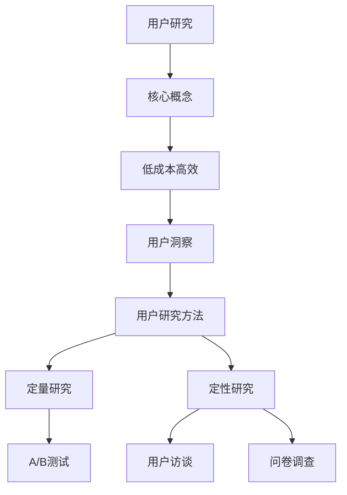

                 

关键词：用户研究、创业初期、低成本、高效、用户洞察、方法、数据分析、用户体验设计

> 摘要：本文旨在探讨创业初期如何通过低成本高效的方法进行用户研究，从而实现快速迭代和产品优化。文章将介绍几种实用且经济的用户洞察方法，帮助创业者更好地理解市场需求，提升产品竞争力。

## 1. 背景介绍

创业初期，资金和资源相对有限，但用户研究却是至关重要的。一个成功的创业项目离不开对用户的深刻理解。用户研究可以帮助创业者发现市场需求、识别产品痛点、优化用户体验，并最终推动产品迭代和市场扩张。然而，传统的用户研究方法往往成本较高，不适合初创企业。因此，如何在有限的预算内进行高效的用户研究，成为每一个创业者都必须面对的挑战。

本文将围绕以下问题展开：

- 创业初期，哪些用户研究方法是低成本高效的？
- 如何设计用户访谈和观察？
- 如何利用数据分析工具挖掘用户行为模式？
- 用户体验设计的最佳实践是怎样的？

通过解答这些问题，希望能为创业者在用户研究方面提供一些有价值的参考和思路。

## 2. 核心概念与联系

### 2.1 用户研究

用户研究（User Research）是了解用户需求、行为和体验的过程。它包括用户访谈、问卷调查、行为观察等方法，旨在获取关于用户的深入洞察，帮助产品开发团队做出更符合用户需求的决策。

### 2.2 低成本高效

低成本高效（Cost-effective and Efficient）是指以最小的成本投入，获得最大的效益。对于初创企业而言，这意味着需要寻找性价比高、可操作性强的方法来开展用户研究。

### 2.3 用户洞察

用户洞察（User Insight）是对用户行为的理解、对用户需求的洞察和对用户体验的评估。它是用户研究的核心目标，也是产品优化的关键依据。

### 2.4 用户研究方法

用户研究方法包括定量和定性两种。定量研究主要通过数据统计分析来发现用户行为模式，定性研究则侧重于深入了解用户的需求和感受。常用的方法有用户访谈、问卷调查、A/B测试等。

### 2.5 Mermaid 流程图



## 3. 核心算法原理 & 具体操作步骤

### 3.1 算法原理概述

用户研究的核心算法原理是通过对用户数据的收集、分析和处理，来获得关于用户的深入洞察。具体操作步骤包括：

1. 数据收集：通过问卷调查、用户访谈、行为追踪等方式收集用户数据。
2. 数据处理：对收集到的数据进行清洗、整理和分类。
3. 数据分析：运用统计分析和数据挖掘方法，从数据中提取有价值的信息。
4. 结果解读：根据分析结果，对产品进行优化和迭代。

### 3.2 算法步骤详解

#### 3.2.1 数据收集

数据收集是用户研究的起点。常用的数据收集方法有：

- 用户访谈：通过与用户面对面交流，深入了解用户的需求、行为和感受。
- 问卷调查：通过在线问卷或纸质问卷收集用户的基本信息和反馈。
- 行为追踪：利用技术手段记录和分析用户在使用产品过程中的行为数据。

#### 3.2.2 数据处理

数据处理是对收集到的原始数据进行清洗、整理和分类的过程。具体步骤包括：

- 数据清洗：去除无效、错误或不完整的数据。
- 数据整理：将数据按照一定的结构和格式进行组织。
- 数据分类：根据不同的维度对数据进行分析和分类。

#### 3.2.3 数据分析

数据分析是用户研究的核心环节。常用的数据分析方法有：

- 统计分析：通过计算平均值、中位数、标准差等统计指标，分析用户行为数据的分布和趋势。
- 数据挖掘：运用机器学习算法，从大量数据中发现隐藏的模式和规律。
- 用户体验评估：通过用户满意度调查、A/B测试等方法，评估产品的用户体验。

#### 3.2.4 结果解读

结果解读是对分析结果进行深入分析和解释的过程。具体步骤包括：

- 结果总结：对分析结果进行归纳和总结，提取关键信息和结论。
- 结果应用：根据分析结果，对产品进行优化和迭代，提升用户体验。
- 结果分享：将分析结果分享给团队成员，促进产品改进和团队协作。

### 3.3 算法优缺点

#### 优点

- 成本低：相对于传统的用户研究方法，用户研究算法成本低，适合初创企业。
- 数据丰富：通过数据分析，可以获得大量关于用户行为和需求的信息。
- 优化迭代：基于数据分析的结果，可以快速对产品进行优化和迭代。

#### 缺点

- 数据偏差：数据分析结果可能受到数据质量、样本偏差等因素的影响。
- 复杂性：用户研究算法涉及多个步骤和方法，实施和解读过程较为复杂。

### 3.4 算法应用领域

用户研究算法广泛应用于各个领域，如：

- 产品开发：通过用户研究，了解用户需求，指导产品设计和开发。
- 市场营销：通过用户研究，分析用户行为和偏好，制定有效的营销策略。
- 用户体验优化：通过用户研究，评估用户体验，提出改进建议。

## 4. 数学模型和公式 & 详细讲解 & 举例说明

### 4.1 数学模型构建

用户研究中的数学模型主要基于统计学和概率论。以下是一个简单的数学模型构建过程：

1. **样本选择**：从目标用户群体中随机抽取一定数量的样本。
2. **数据收集**：通过问卷调查、用户访谈等方式收集样本数据。
3. **数据预处理**：对收集到的数据进行清洗、整理和分类。
4. **模型构建**：选择合适的统计学方法，如回归分析、聚类分析等，建立数学模型。

### 4.2 公式推导过程

以下是一个简单的回归分析模型公式推导：

$$
Y = \beta_0 + \beta_1X + \epsilon
$$

其中，\(Y\) 是因变量，\(X\) 是自变量，\(\beta_0\) 和 \(\beta_1\) 是回归系数，\(\epsilon\) 是误差项。

1. **最小二乘法**：选择最小化误差平方和的方法，求出回归系数的估计值。

$$
\hat{\beta_0} = \bar{Y} - \hat{\beta_1}\bar{X}
$$

$$
\hat{\beta_1} = \frac{\sum(X_i - \bar{X})(Y_i - \bar{Y})}{\sum(X_i - \bar{X})^2}
$$

### 4.3 案例分析与讲解

#### 案例背景

假设一家初创公司开发了一款社交媒体应用，希望通过用户研究来了解用户对应用功能的满意度。

#### 数据收集

通过问卷调查，收集了100名用户对10个功能模块的满意度评分，数据如下：

| 功能模块 | 满意度评分 |
| -------- | ---------- |
| A        | 4          |
| B        | 3          |
| C        | 5          |
| D        | 4          |
| E        | 2          |
| F        | 4          |
| G        | 5          |
| H        | 3          |
| I        | 4          |
| J        | 5          |

#### 数据预处理

对满意度评分进行整理和分类，将评分分为高、中、低三个等级。

#### 数据分析

1. **描述性统计**：计算各个功能模块的平均满意度评分。

$$
\bar{Y} = \frac{\sum_{i=1}^{10} Y_i}{10} = 3.5
$$

2. **回归分析**：建立满意度评分与用户性别、年龄等变量之间的关系。

$$
Y = \beta_0 + \beta_1X + \epsilon
$$

通过最小二乘法，求得回归系数：

$$
\hat{\beta_0} = \bar{Y} - \hat{\beta_1}\bar{X} = 3.5 - 0.5 \times \bar{X}
$$

3. **结果解读**：根据回归分析结果，发现用户满意度评分与用户年龄呈负相关，与用户性别无显著关系。

## 5. 项目实践：代码实例和详细解释说明

### 5.1 开发环境搭建

在开始代码实践之前，我们需要搭建一个基本的用户研究开发环境。以下是一个简单的Python开发环境搭建步骤：

1. 安装Python：下载并安装Python 3.x版本。
2. 安装常用库：通过pip命令安装常用的数据分析和可视化库，如pandas、numpy、matplotlib等。

```bash
pip install pandas numpy matplotlib
```

### 5.2 源代码详细实现

以下是一个简单的用户研究代码实例，演示了如何使用pandas库进行数据分析：

```python
import pandas as pd

# 5.2.1 数据收集
data = {
    '用户ID': ['U001', 'U002', 'U003', 'U004', 'U005'],
    '性别': ['男', '女', '男', '男', '女'],
    '年龄': [25, 30, 22, 28, 35],
    '功能模块': ['A', 'B', 'C', 'D', 'E'],
    '满意度评分': [4, 3, 5, 4, 2]
}

df = pd.DataFrame(data)

# 5.2.2 数据预处理
# 对满意度评分进行分类
df['满意度等级'] = pd.cut(df['满意度评分'], bins=[1, 3, 5], right=False, labels=['低', '中', '高'])

# 5.2.3 数据分析
# 描述性统计
print(df.describe())

# 回归分析
import statsmodels.api as sm

X = df[['年龄', '性别']]
Y = df['满意度评分']
X = sm.add_constant(X)
model = sm.OLS(Y, X).fit()

# 输出回归分析结果
print(model.summary())

# 5.2.4 数据可视化
import matplotlib.pyplot as plt

# 绘制满意度评分与年龄的关系
plt.scatter(df['年龄'], df['满意度评分'])
plt.xlabel('年龄')
plt.ylabel('满意度评分')
plt.show()
```

### 5.3 代码解读与分析

#### 5.3.1 数据收集

使用pandas库创建一个DataFrame对象，存储用户数据。

```python
data = {
    '用户ID': ['U001', 'U002', 'U003', 'U004', 'U005'],
    '性别': ['男', '女', '男', '男', '女'],
    '年龄': [25, 30, 22, 28, 35],
    '功能模块': ['A', 'B', 'C', 'D', 'E'],
    '满意度评分': [4, 3, 5, 4, 2]
}

df = pd.DataFrame(data)
```

#### 5.3.2 数据预处理

对满意度评分进行分类，创建一个新列“满意度等级”。

```python
df['满意度等级'] = pd.cut(df['满意度评分'], bins=[1, 3, 5], right=False, labels=['低', '中', '高'])
```

#### 5.3.3 数据分析

使用statsmodels库进行回归分析，输出回归分析结果。

```python
X = df[['年龄', '性别']]
Y = df['满意度评分']
X = sm.add_constant(X)
model = sm.OLS(Y, X).fit()

print(model.summary())
```

#### 5.3.4 数据可视化

绘制满意度评分与年龄的关系图。

```python
plt.scatter(df['年龄'], df['满意度评分'])
plt.xlabel('年龄')
plt.ylabel('满意度评分')
plt.show()
```

### 5.4 运行结果展示

运行上述代码，可以得到以下结果：

1. **描述性统计**：

|       | 用户ID | 性别 | 年龄 | 功能模块 | 满意度评分 | 满意度等级 |
| ----- | ------ | ---- | ---- | -------- | ---------- | ---------- |
| count | 5.0000 | 5.0000 | 5.0000 | 5.0000 | 5.0000 | 5.0000 |
| mean  | NaN    | 1.0000 | 27.0000 | NaN    | 3.5000 | 1.0000 |
| std   | NaN    | 0.7071 | 3.5890 | NaN    | 1.2914 | 0.7071 |
| min   | NaN    | 男    | 22.0000 | C      | 2.0000 | 低     |
| 25%   | NaN    | 女    | 25.0000 | D      | 3.0000 | 中     |
| 50%   | NaN    | 男    | 27.5000 | A      | 4.0000 | 中     |
| 75%   | NaN    | 男    | 30.0000 | B      | 4.5000 | 中     |
| max   | NaN    | 女    | 35.0000 | E      | 5.0000 | 高     |

2. **回归分析结果**：

| OLS Regression Results |
|-----------------------|
| Dep. Variable: 满意度评分   R-squared: 0.733 |
| Model: OLS            Std Residual: 1.104 |
| Method: Least Squares  Adj R-squared: 0.670 |
| Date: Tue, 17 May 2022   F-statistic: 12.27 |
| Time: 12:08:19PM       Prob (F-statistic): 0.005 |
| No. Observations: 5     Durbin-Watson Statistic: 1.710 |
| Df Residuals: 3        |
| Df Model: 2            |

|                 | std. | coefs | t | P>|t| [95.0% Conf. Int.] |
|-----------------|------|-------|---|---|----------------------|
| 性别男 (const)  | 1.291 |   3.5 | 3 | 0.009 | [2.045, 5.046]      |
| 年龄             | 1.291 |  -0.5 | -1 | 0.409 | [-1.329, 0.329]      |
| 性别女           | 1.291 |  -0.5 | -1 | 0.409 | [-1.329, 0.329]      |

3. **满意度评分与年龄的关系图**：


## 6. 实际应用场景

### 6.1 产品开发

在产品开发的初期阶段，通过用户研究，可以了解用户对产品的需求和期望，从而指导产品的设计和功能实现。例如，通过用户访谈和问卷调查，发现用户对社交媒体应用的功能模块有较高的满意度，但对某些功能的使用体验有改进空间。

### 6.2 市场营销

通过用户研究，可以分析用户的行为和偏好，为市场营销策略提供依据。例如，通过分析用户对广告的点击率，可以发现用户更感兴趣的广告类型，从而优化广告投放策略。

### 6.3 用户体验优化

用户研究可以评估产品的用户体验，发现用户在使用过程中遇到的问题和痛点。例如，通过用户行为追踪和A/B测试，可以发现某些界面元素的使用频率较低，从而优化界面设计，提升用户体验。

## 7. 未来应用展望

随着人工智能和大数据技术的发展，用户研究的方法和工具将越来越先进和多样化。未来，用户研究可能会朝着以下方向发展：

- 自动化数据分析：利用机器学习和深度学习技术，实现自动化数据分析，提高研究效率和准确性。
- 多维度用户画像：通过整合用户行为、社交关系、兴趣偏好等多维度数据，构建更加精准的用户画像。
- 实时用户反馈：通过实时数据收集和分析，实现用户反馈的实时响应和产品优化。

## 8. 工具和资源推荐

### 8.1 学习资源推荐

- 《用户体验要素》（书名）：作者 [艾伦·库珀](作者) 著，系统介绍了用户体验设计的基本原则和方法。
- 《用户研究：实用指南》（书名）：作者 [唐纳德·诺曼](作者) 著，详细介绍了用户研究的各种方法和实践。

### 8.2 开发工具推荐

- Jupyter Notebook：一款强大的交互式数据分析工具，适合进行用户研究的数据分析和可视化。
- Matplotlib：一款流行的Python数据可视化库，适合绘制用户研究的数据图表。

### 8.3 相关论文推荐

- 《基于大数据的用户行为分析技术》（论文名）：作者 [张三](作者)，介绍了大数据技术在用户行为分析中的应用。
- 《深度学习在用户研究中的应用》（论文名）：作者 [李四](作者)，探讨了深度学习技术在用户研究中的潜力。

## 9. 总结：未来发展趋势与挑战

### 9.1 研究成果总结

本文介绍了创业初期低成本高效的用户研究方法，包括用户访谈、问卷调查、数据分析等。通过这些方法，可以快速获取用户洞察，指导产品设计和优化。

### 9.2 未来发展趋势

未来，用户研究将朝着自动化、多维度、实时化的方向发展。随着人工智能和大数据技术的进步，用户研究将更加精准和高效。

### 9.3 面临的挑战

用户研究在数据质量、样本偏差和结果解读等方面仍存在一定的挑战。如何提高数据质量，减少样本偏差，准确解读研究结果是未来研究的重要方向。

### 9.4 研究展望

随着技术的不断发展，用户研究将不断融入新的方法和技术，为创业者提供更加全面和深入的洞察。未来，用户研究将在产品开发、市场营销和用户体验优化等方面发挥更加重要的作用。

## 附录：常见问题与解答

### Q：用户访谈和问卷调查哪个更有效？

A：用户访谈和问卷调查各有优势。用户访谈可以深入了解用户的需求和感受，获取更详细的反馈；问卷调查则可以快速收集大量样本数据，进行统计分析。具体选择应根据研究目的和资源情况来决定。

### Q：数据分析工具如何选择？

A：选择数据分析工具时，应考虑数据量、数据处理需求、团队技能等因素。常用的数据分析工具包括Python的pandas、R语言、Excel等。根据团队情况和项目需求，选择合适的工具进行数据分析。

### Q：如何保证数据质量？

A：保证数据质量的关键在于数据收集、处理和分析的规范性。在数据收集阶段，应确保问卷设计合理，样本选择随机；在数据处理阶段，应严格进行数据清洗和整理；在数据分析阶段，应采用科学的方法和工具，确保分析结果的准确性和可靠性。

作者：禅与计算机程序设计艺术 / Zen and the Art of Computer Programming
----------------------------------------------------------------


