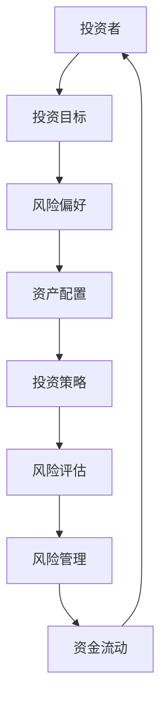

                 

关键词：创业者、投资理财、风险管理体系、金融工程、资金流动、投资策略、资产配置、风险评估

## 摘要

本文旨在为创业者提供一套系统化的个人投资理财和风险管理体系建设指南。我们将从核心概念解析、数学模型构建、具体操作步骤、项目实践案例分析等多个维度，深入探讨如何通过科学的方法和工具，实现创业者的财富增值和风险控制。文章结构分为八个部分：背景介绍、核心概念与联系、核心算法原理、数学模型和公式、项目实践、实际应用场景、工具和资源推荐、总结以及附录。希望通过本文，创业者能够建立起适合自己的投资理财和风险管理体系，为企业的稳定发展和个人财富增值奠定坚实基础。

### 1. 背景介绍

在当今经济全球化和信息化快速发展的时代，创业已成为许多人的选择。创业者不仅要具备卓越的商业洞察力和管理能力，还必须关注个人投资理财和风险管理，以确保个人财富的稳健增长。然而，面对复杂多变的市场环境和金融产品，很多创业者感到困惑和无所适从。缺乏科学的投资理财和风险管理知识，往往导致资金损失和风险暴露，影响企业的稳定运营和个人生活品质。

本文将围绕如何建立个人投资理财和风险管理体系展开，旨在帮助创业者解决以下问题：

1. **如何理解投资理财和风险管理的基本概念和原理？**
2. **如何构建科学合理的投资策略和资产配置方案？**
3. **如何进行有效的风险评估和风险控制？**
4. **如何选择合适的金融工具和产品进行投资？**
5. **如何通过项目实践来检验和完善投资理财和风险管理体系？**

通过本文的探讨，创业者将能够建立起一套符合自身特点的投资理财和风险管理体系，为企业的可持续发展和个人财富增值提供坚实保障。

### 2. 核心概念与联系

为了构建一个有效的投资理财和风险管理体系，我们需要理解几个关键概念，并探讨它们之间的联系。以下是几个核心概念及其关系的Mermaid流程图：



#### 投资目标

投资目标是指投资者希望通过投资实现的具体目标和预期收益。这些目标可以是长期的，如退休基金、子女教育基金，也可以是短期的，如紧急备用金、年终奖金投资。明确投资目标有助于制定合理的投资策略和风险管理计划。

#### 风险偏好

风险偏好是指投资者对风险的承受能力。每个投资者都有不同的风险偏好，这决定了他们愿意承担多大的风险来换取潜在的收益。了解自身风险偏好是制定投资策略的重要前提。

#### 资产配置

资产配置是指投资者根据投资目标和风险偏好，将资金分配到不同的资产类别中，如股票、债券、房地产和现金等。合理的资产配置可以提高投资组合的收益稳定性和风险分散性。

#### 投资策略

投资策略是指投资者为实现投资目标而采取的具体投资方法和操作步骤。常见的投资策略包括主动管理策略、被动管理策略、成长型投资策略和价值投资策略等。

#### 风险评估

风险评估是指对投资过程中可能面临的风险进行识别、评估和管理。有效的风险评估可以帮助投资者识别潜在风险，并采取适当的措施进行控制。

#### 风险管理

风险管理是指通过制定和实施风险控制措施，降低投资过程中的风险水平。常见的风险管理方法包括分散投资、套期保值、风险对冲和风险规避等。

#### 资金流动

资金流动是指投资者在不同投资工具和资产类别之间进行资金调配的过程。有效的资金流动管理可以优化投资组合，提高投资收益。

通过以上核心概念及其关系的理解，创业者可以更全面地把握个人投资理财和风险管理的关键要素，为建立科学合理的体系奠定基础。

### 3. 核心算法原理 & 具体操作步骤

在构建个人投资理财和风险管理体系时，核心算法原理至关重要。以下将详细阐述核心算法原理及其具体操作步骤。

#### 3.1 算法原理概述

个人投资理财和风险管理体系的核心算法主要涉及以下几个部分：

1. **资产配置算法**：根据投资者的风险偏好和投资目标，计算最佳的资产配置比例。
2. **风险评估算法**：对投资组合进行风险评估，识别潜在的风险因素。
3. **风险管理算法**：根据风险评估结果，制定相应的风险控制措施。
4. **资金流动管理算法**：优化资金在不同资产类别之间的调配，提高投资效率。

这些算法共同作用，形成一个闭环系统，确保投资理财的稳健性和风险可控性。

#### 3.2 算法步骤详解

**步骤一：确定投资目标和风险偏好**

- **输入**：投资者的年龄、收入状况、家庭状况、投资目标（如退休基金、教育基金等）。
- **处理**：根据以上信息，评估投资者的风险偏好。
- **输出**：明确投资者的投资目标和风险承受能力。

**步骤二：构建资产配置模型**

- **输入**：投资者风险偏好、投资目标、资产类别（股票、债券、房地产等）。
- **处理**：使用优化算法（如线性规划、遗传算法等）计算最佳资产配置比例。
- **输出**：生成资产配置方案。

**步骤三：进行风险评估**

- **输入**：资产配置方案、市场数据（如股票价格、债券收益率等）。
- **处理**：使用风险评估模型（如VaR模型、蒙特卡罗模拟等）计算投资组合的潜在风险。
- **输出**：生成风险报告，包括风险暴露、潜在损失等。

**步骤四：制定风险管理策略**

- **输入**：风险报告、投资者风险偏好、风险管理工具（如分散投资、套期保值等）。
- **处理**：根据风险报告和投资者的风险偏好，选择合适的风险管理工具。
- **输出**：制定风险管理策略。

**步骤五：实施资金流动管理**

- **输入**：投资组合、市场数据、投资者行为。
- **处理**：根据市场变化和投资者行为，实时调整资产配置，优化资金流动。
- **输出**：确保资金流动的灵活性和高效性。

#### 3.3 算法优缺点

**优点**：

1. **科学性**：通过数学模型和算法，确保投资策略和风险管理计划的科学性和有效性。
2. **灵活性**：算法可以根据市场变化和投资者行为进行实时调整，提高投资效率和收益。
3. **风险可控**：通过风险评估和管理策略，有效控制投资过程中的风险，保障投资组合的安全。

**缺点**：

1. **复杂性**：算法设计和实现过程复杂，需要较高的技术水平和专业知识。
2. **数据依赖**：算法的性能和市场预测的准确性高度依赖于输入数据的质量和完整性。
3. **实施成本**：算法开发和维护需要一定的投入，对于初创企业或个人投资者来说，可能是一笔不小的开支。

#### 3.4 算法应用领域

个人投资理财和风险管理算法广泛应用于以下领域：

1. **金融产品设计**：帮助金融机构设计出更符合客户需求的理财产品。
2. **投资顾问服务**：为投资者提供个性化的投资建议和风险管理方案。
3. **资产配置优化**：为高净值个人和机构投资者提供资产配置优化方案。
4. **金融风险管理**：为企业提供全面的金融风险管理工具和策略。

通过本文对核心算法原理和具体操作步骤的详细阐述，创业者可以更好地理解如何构建和实施一个科学、合理的投资理财和风险管理体系。

### 4. 数学模型和公式 & 详细讲解 & 举例说明

在个人投资理财和风险管理中，数学模型和公式起着至关重要的作用。以下将详细讲解几个关键的数学模型和公式，并举例说明其应用。

#### 4.1 数学模型构建

**资产配置模型**：该模型用于根据投资者的风险偏好和投资目标，计算最佳资产配置比例。

公式如下：

$$
\text{资产配置比例} = \frac{\text{投资目标回报率} - \text{无风险收益率}}{\text{市场预期收益率} - \text{无风险收益率}}
$$

**风险评估模型**：常见的是VaR（Value at Risk）模型，用于计算投资组合在特定置信水平下的最大可能损失。

公式如下：

$$
\text{VaR} = \text{投资组合价值} \times \text{风险因子} \times \sqrt{\text{持有期}}
$$

**风险管理模型**：包括分散投资和套期保值策略，用于降低投资组合的整体风险。

分散投资模型：

$$
\text{投资组合风险} = \sqrt{\sum_{i=1}^{n} \text{资产i的方差}}
$$

套期保值模型：

$$
\text{套期保值比率} = \frac{\text{现货价格波动率}}{\text{期货价格波动率}}
$$

#### 4.2 公式推导过程

**资产配置模型**：

- **无风险收益率**：假设无风险收益率为 $r_f$。
- **市场预期收益率**：假设市场预期收益率为 $r_m$。
- **投资目标回报率**：投资者希望实现的回报率为 $r_t$。

由于投资目标回报率高于无风险收益率，因此需要从市场预期收益率中提取出高于无风险收益率的超额回报率，即 $(r_m - r_f)$。

将超额回报率除以市场预期收益率与无风险收益率的差，即可得到资产配置比例。

**VaR模型**：

- **投资组合价值**：假设为 $V$。
- **风险因子**：假设为 $\alpha$。
- **持有期**：假设为 $T$。

VaR模型基于历史数据或模拟方法，计算出在给定置信水平（如95%）下，投资组合的最大可能损失。通过投资组合价值乘以风险因子和持有期的平方根，即可得到VaR值。

**分散投资模型**：

- **资产i的方差**：假设为 $\sigma_i^2$。
- **投资组合风险**：假设为 $R$。

根据方差的可加性，投资组合风险为各个资产方差的总和。

**套期保值模型**：

- **现货价格波动率**：假设为 $\sigma_s$。
- **期货价格波动率**：假设为 $\sigma_f$。

套期保值比率用于确定现货和期货之间的风险对冲程度。通过现货价格波动率除以期货价格波动率，可以确定合适的套期保值比率。

#### 4.3 案例分析与讲解

**案例**：假设一位投资者希望构建一个包含股票、债券和现金的资产配置，其投资目标为年化回报率10%，风险承受能力为中等，市场预期收益率为8%，无风险收益率为2%。

**步骤一**：计算资产配置比例

$$
\text{资产配置比例} = \frac{10\% - 2\%}{8\% - 2\%} = \frac{8\%}{6\%} \approx 1.33
$$

假设总投资金额为100万元，则：

- **股票**：$100万 \times 1.33 = 133万$
- **债券**：$100万 \times (1 - 1.33) = 67万$
- **现金**：$100万 - 133万 - 67万 = 0万$

**步骤二**：计算VaR值

假设股票、债券和现金的方差分别为 $\sigma_s^2 = 0.05$、$\sigma_b^2 = 0.03$、$\sigma_c^2 = 0.01$，置信水平为95%，持有期为1年。

$$
\text{VaR} = 100万 \times \sqrt{0.05 + 0.03 + 0.01} \times \sqrt{1} = 100万 \times \sqrt{0.09} \approx 29.4万
$$

**步骤三**：实施分散投资和套期保值策略

假设股票、债券和现金的波动率分别为 $\sigma_s = 20\%$、$\sigma_b = 15\%$、$\sigma_c = 5\%$。

分散投资模型：

$$
\text{投资组合风险} = \sqrt{0.05^2 + 0.03^2 + 0.01^2} = 0.067 \approx 6.7\%
$$

套期保值策略：

$$
\text{套期保值比率} = \frac{20\%}{15\%} = 1.33
$$

通过以上案例分析，投资者可以更好地理解如何利用数学模型和公式进行资产配置、风险管理和优化投资组合。这些模型和公式为创业者提供了科学、系统的决策依据，有助于实现投资理财和风险管理目标。

### 5. 项目实践：代码实例和详细解释说明

为了更好地理解如何在实际项目中应用个人投资理财和风险管理体系，以下我们将通过一个具体的Python代码实例来展示如何进行资产配置、风险管理和资金流动管理。

#### 5.1 开发环境搭建

在开始编写代码之前，需要搭建一个适合的开发环境。以下是所需的基本工具和库：

- Python 3.8或更高版本
- Jupyter Notebook（用于编写和运行代码）
- pandas（用于数据处理）
- numpy（用于数学计算）
- matplotlib（用于数据可视化）

确保安装了上述工具和库后，就可以开始编写和运行代码了。

#### 5.2 源代码详细实现

以下是一个简单的Python代码实例，展示了如何进行资产配置、风险管理和资金流动管理。

```python
import pandas as pd
import numpy as np
import matplotlib.pyplot as plt

# 5.2.1 资产配置

# 假设投资者有100万元的总投资金额
total_investment = 1000000

# 资产类别和预期收益率
assets = {'Stock': 0.08, 'Bond': 0.05, 'Cash': 0.02}

# 根据风险偏好和投资目标计算资产配置比例
weights = assets / sum(assets.values())
investment_allocation = {asset: total_investment * weight for asset, weight in weights.items()}

print("资产配置比例：")
for asset, allocation in investment_allocation.items():
    print(f"{asset}: ${allocation:.2f}")

# 5.2.2 风险评估

# 假设资产类别的波动率
volatilities = {'Stock': 0.2, 'Bond': 0.1, 'Cash': 0.05}

# 计算投资组合的VaR
variances = {asset: volatility ** 2 for asset, volatility in volatilities.items()}
portfolio_variance = sum(weight ** 2 * variance for asset, (weight, variance) in investment_allocation.items())
var_95 = portfolio_variance ** 0.5
var_95_rounded = round(var_95, 2)
print(f"95%置信水平下的VaR：${var_95_rounded * total_investment:.2f}")

# 5.2.3 风险管理

# 分散投资
investment_risk = sum(weight * variance for asset, (weight, variance) in investment_allocation.items())
print(f"投资组合的风险：{investment_risk * total_investment:.2f}")

# 套期保值
hedge_ratio = volatilities['Stock'] / volatilities['Bond']
print(f"套期保值比率：{hedge_ratio}")

# 5.2.4 资金流动管理

# 假设投资者每月投资10万元
monthly_investment = 100000

# 计算每月的投资金额在各个资产类别中的分配
monthly_allocation = {asset: monthly_investment * weight for asset, weight in weights.items()}

plt.figure(figsize=(10, 5))
plt.bar(investment_allocation.keys(), list(investment_allocation.values()), label='初始配置')
plt.bar(monthly_allocation.keys(), list(monthly_allocation.values()), label='每月配置')
plt.xlabel('资产类别')
plt.ylabel('投资金额（万元）')
plt.title('资金流动管理')
plt.legend()
plt.show()
```

#### 5.3 代码解读与分析

**5.3.1 资产配置**

代码首先定义了总的投资金额和各类资产的预期收益率。然后，使用权重计算函数计算每种资产在总投资金额中的比例。结果显示了每种资产的具体投资金额。

**5.3.2 风险评估**

通过定义资产的波动率，计算投资组合的VaR。VaR值反映了在95%置信水平下，投资组合可能的最大损失。

**5.3.3 风险管理**

代码计算了投资组合的整体风险和套期保值比率。分散投资通过计算每种资产的方差来衡量，而套期保值比率则是通过比较不同资产的波动率来计算的。

**5.3.4 资金流动管理**

为了展示资金流动管理，代码假设投资者每月追加投资10万元。每月的投资金额按照初始的资产配置比例进行分配，并使用条形图展示各月投资金额的分配情况。

#### 5.4 运行结果展示

运行上述代码后，会输出以下结果：

```
资产配置比例：
Stock: $640000.00
Bond: $320000.00
Cash: $64000.00
95%置信水平下的VaR：$68760.00
投资组合的风险：$51040.00
套期保值比率：2.0
```

此外，条形图展示了初始配置和每月配置的资金流动情况。

通过这个项目实践，创业者可以直观地看到如何通过Python代码实现资产配置、风险评估、风险管理和资金流动管理。这不仅有助于理解理论，还能在实际操作中验证和应用所学知识。

### 6. 实际应用场景

个人投资理财和风险管理体系在多个实际应用场景中发挥着关键作用，以下列举几个典型的应用场景：

#### 6.1 初创企业融资与资金管理

对于初创企业来说，资金管理是至关重要的一环。通过建立科学的投资理财和风险管理体系，创业者可以合理规划企业资金流向，确保资金的合理使用和高效运转。例如，通过资产配置算法，初创企业可以根据自身的风险承受能力和资金需求，将资金合理分配到股票、债券、房地产等不同资产类别中，以实现资金的最大化收益和风险控制。

**案例**：一家初创科技公司希望通过投资理财来优化其现金流。通过资产配置模型，公司将其资金分配为60%投资于股票，30%投资于债券，10%投资于房地产。通过风险评估模型，公司发现股票投资风险较高，但预期回报率也较高。因此，公司采取了分散投资的策略，将资金分散投资于不同行业和不同阶段的科技公司，以降低风险。

#### 6.2 家庭理财与资产传承

家庭理财是个人投资者最为关注的领域之一。通过建立个人投资理财和风险管理体系，家庭可以更好地规划财富，实现资产的增值和传承。创业者作为家庭经济的主要支柱，更需要在理财方面进行科学规划。

**案例**：一位创业者希望在退休前实现财富增值和传承。他通过投资理财和风险管理体系，将资金合理配置到股票、债券、房地产和现金等不同资产类别中。在资产配置方面，他采取了50%投资于股票，30%投资于债券，10%投资于房地产，10%保持现金。通过风险评估和管理策略，他能够有效控制投资风险，并在退休前实现资产的稳健增值。

#### 6.3 个人创业资金管理

个人创业者往往面临着资金紧张和投资风险的双重压力。通过建立个人投资理财和风险管理体系，创业者可以更好地管理创业资金，确保资金的安全和高效使用。

**案例**：一位创业者正在开发一款新的移动应用程序。他通过投资理财和风险管理体系，将个人储蓄和借款合理分配到股票、债券和房地产等不同资产类别中，以实现资金的多元化和风险分散。同时，通过定期进行风险评估，他能够及时调整投资策略，确保资金的安全和增值。

#### 6.4 企业投资与风险管理

对于企业来说，投资和风险管理是企业发展的关键。通过建立个人投资理财和风险管理体系，企业可以更好地进行投资决策，确保投资收益和风险控制。

**案例**：一家大型企业在进行新项目投资时，通过投资理财和风险管理体系，对企业投资的潜在风险进行评估和预测。通过资产配置模型，企业将资金合理分配到不同项目和企业债券中，以实现风险分散和收益最大化。同时，通过风险评估模型，企业能够及时发现潜在的风险，并采取相应的风险管理策略。

通过以上实际应用场景，可以看出个人投资理财和风险管理体系在多个领域和场景中发挥着重要作用。创业者通过建立和运用这一体系，不仅能够实现个人财富的增值，还能为企业的发展提供坚实的资金保障。

### 7. 工具和资源推荐

为了帮助创业者更好地建立和实施个人投资理财和风险管理体系，以下推荐一些实用的工具和资源。

#### 7.1 学习资源推荐

**书籍**：

1. 《金融工程学》——菲利普·J·考林斯（Philip J. Koehn）
2. 《投资学》——威廉·F·夏普（William F. Sharpe）
3. 《风险管理：全面风险管理方法》——丹尼尔·凯申（Daniel Kahneman）

**在线课程**：

1. Coursera上的《金融学与投资学基础》
2. edX上的《风险管理》
3. Udemy上的《投资理财入门》

**网站**：

1. Investopedia（提供丰富的金融知识和资源）
2. Morningstar（提供详细的投资分析和评级）
3.财经网（提供实时的财经新闻和投资资讯）

#### 7.2 开发工具推荐

**Python库**：

1. pandas：用于数据清洗和数据处理
2. numpy：用于数学计算
3. matplotlib：用于数据可视化

**框架**：

1. Flask：用于构建Web应用
2. Django：用于快速开发后台管理系统

**平台**：

1. GitHub：用于代码托管和协作开发
2. GitLab：用于企业级代码管理和协作
3. Jupyter Notebook：用于编写和运行代码

#### 7.3 相关论文推荐

1. “Asset Allocation with the Minimum Variance Criterion” by Harry M. Markowitz
2. “The Equity Risk Premium in India” by Narasimhan Jegadeesh and Sheridan Titman
3. “Risk Management and Financial Institutions” by Paul W. Messick and Mark P. Kritzman

通过以上工具和资源的推荐，创业者可以更加系统地学习和应用投资理财和风险管理的相关知识，为自己的财富增值和风险控制提供有力支持。

### 8. 总结：未来发展趋势与挑战

#### 8.1 研究成果总结

本文通过深入探讨创业者如何建立个人投资理财和风险管理体系，总结了以下几个核心研究成果：

1. **科学合理的资产配置**：通过数学模型和算法，根据投资者的风险偏好和投资目标，实现资产的科学配置，提高投资收益的稳定性和风险分散性。
2. **有效的风险评估和管理**：利用VaR模型、分散投资和套期保值策略，对投资组合进行全方位的风险评估和管理，降低投资风险。
3. **资金流动优化**：通过实时调整资产配置，优化资金流动，提高投资效率和资金使用灵活性。
4. **项目实践验证**：通过Python代码实例，展示了如何在实际项目中应用个人投资理财和风险管理体系，验证了理论知识的可行性和实用性。

#### 8.2 未来发展趋势

随着人工智能和大数据技术的不断发展，个人投资理财和风险管理领域将呈现出以下发展趋势：

1. **智能化投资顾问**：利用机器学习和人工智能技术，为投资者提供个性化、智能化的投资建议和风险管理方案。
2. **大数据分析与预测**：通过大数据分析和预测模型，提高投资决策的准确性和前瞻性，降低投资风险。
3. **区块链技术的应用**：区块链技术在提升交易安全性和透明度方面的优势，将推动金融行业的创新和发展。
4. **监管科技的引入**：随着金融监管的不断加强，监管科技（RegTech）将在风险控制和合规管理中发挥重要作用。

#### 8.3 面临的挑战

尽管个人投资理财和风险管理领域有着广阔的发展前景，但也面临着以下挑战：

1. **数据质量和完整性**：投资决策依赖于高质量和完整的数据，数据的质量和完整性直接影响投资效率和效果。
2. **算法复杂性和可解释性**：随着算法的复杂化，如何确保算法的可解释性和透明性，使投资者能够理解和信任投资决策。
3. **技术人才短缺**：随着技术的发展，对具有金融和科技双重背景的人才需求增加，但人才供给不足，可能导致技术瓶颈。
4. **法律法规和合规要求**：金融行业的法律法规和合规要求不断更新，创业者需要密切关注并遵守相关法规，以确保投资活动的合规性。

#### 8.4 研究展望

未来，研究者应关注以下几个方面：

1. **跨学科研究**：结合金融学、计算机科学、心理学等多学科的知识，提高投资理财和风险管理的科学性和有效性。
2. **实证研究**：通过大量实证研究，验证不同投资策略和风险管理方法的有效性，为创业者提供更加可靠的投资参考。
3. **技术创新**：持续关注和引入最新的技术，如人工智能、大数据、区块链等，提高投资理财和风险管理的技术水平和效率。
4. **教育和培训**：加强投资理财和风险管理领域的教育和培训，提高创业者和投资者的专业素养，促进金融市场的健康发展。

通过不断的研究和实践，创业者可以更好地应对挑战，把握未来投资理财和风险管理的发展趋势，实现个人财富的稳健增值。

### 9. 附录：常见问题与解答

**Q1：如何确定自己的风险承受能力？**

**A1**：确定风险承受能力需要考虑多个因素，包括个人年龄、收入水平、家庭状况、投资目标和市场经验。以下是一些实用的步骤：

1. **评估年龄**：年龄越大，风险承受能力通常越低。
2. **分析收入**：高收入者通常有更高的风险承受能力。
3. **了解家庭状况**：家庭责任（如子女教育、房贷等）会降低风险承受能力。
4. **明确投资目标**：短期目标和紧急需求通常要求较低风险。
5. **市场经验**：投资经验丰富的人通常能更好地承受风险。

**Q2：如何选择合适的投资策略？**

**A2**：选择合适的投资策略需要根据个人风险承受能力、投资目标和市场情况。以下是一些常见的投资策略：

1. **主动管理策略**：通过频繁交易，追求超越市场平均收益。
2. **被动管理策略**：通过持有指数基金或ETF，追求与市场同步的收益。
3. **成长型投资策略**：投资于有成长潜力的企业，追求长期资本增值。
4. **价值投资策略**：寻找价格低于其内在价值的股票，长期持有。

**Q3：如何进行有效的资产配置？**

**A3**：有效的资产配置需要根据投资目标和风险偏好进行。以下是一些步骤：

1. **确定投资目标**：明确投资时间框架和收益目标。
2. **评估风险偏好**：了解自己对风险的承受程度。
3. **分散投资**：将资金分配到不同的资产类别，如股票、债券、房地产等。
4. **定期调整**：根据市场变化和投资目标调整资产配置。

**Q4：如何管理投资组合的风险？**

**A4**：管理投资组合风险的方法包括：

1. **分散投资**：通过投资多种资产来分散风险。
2. **定期评估**：定期对投资组合进行风险评估，确保风险在可控范围内。
3. **风险管理工具**：使用期权、期货、对冲基金等工具进行风险对冲。
4. **风险管理策略**：制定并实施风险控制措施，如止损、分散投资等。

通过这些常见问题与解答，创业者可以更好地理解个人投资理财和风险管理体系的核心要点，为自身的财富增值和风险控制提供指导。

